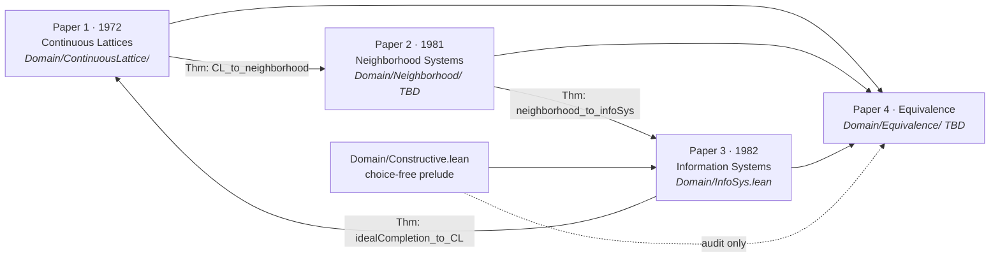
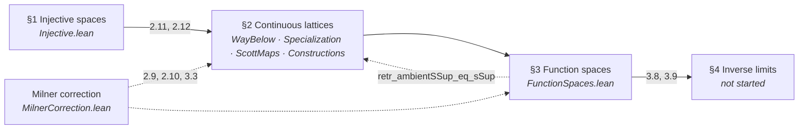
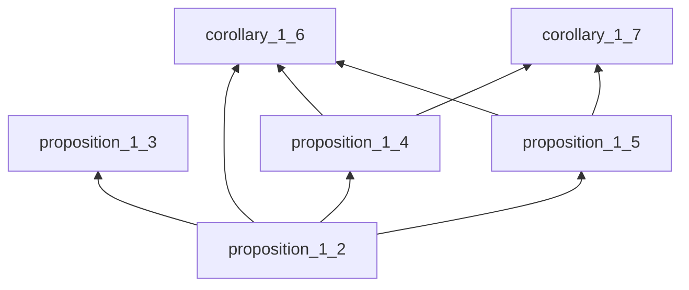
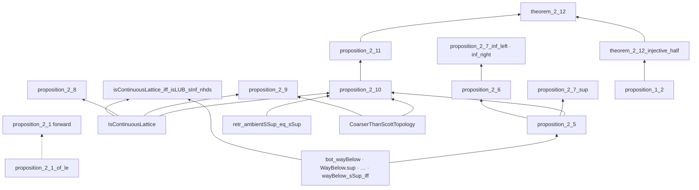
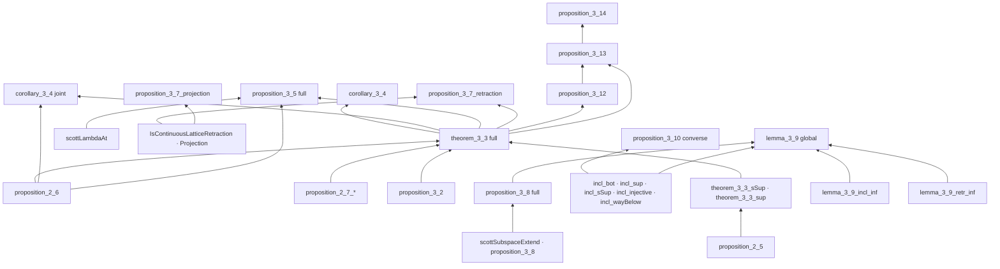
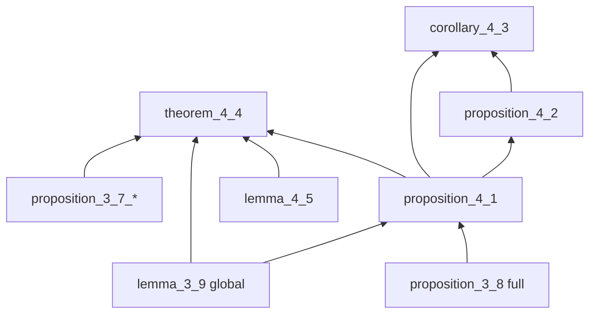
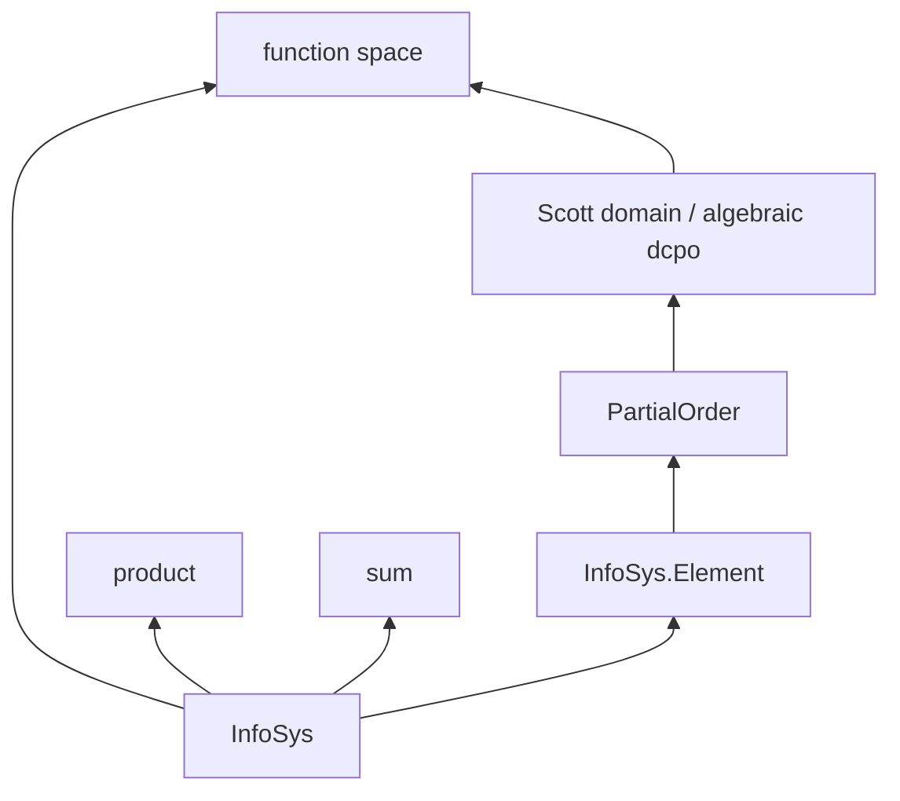

# Four Presentations of Scott Domains in Lean 4: A Chronological Formalization

---

## Abstract

We formalize Dana Scott's domain theory in **Lean 4** with **mathlib**, following **four
historical layers in order**:

1. **Scott 1972** — *Continuous Lattices* (LNM 274): injective `T₀`-spaces, Scott topology,
   way-below, function spaces, inverse limits.
2. **Scott 1981** — PRG-19 *Lectures on a Mathematical Theory of Computation*: neighborhood
   systems (filters of neighborhoods on a master set Δ; domain elements as filters).
3. **Scott 1982** — *Domains for Denotational Semantics* (ICALP): information systems
   (finite consistency + entailment on tokens).
4. **Equivalence** — explicit Lean theorems relating the three presentations, showing they
   determine the same class of domains up to isomorphism.

The narrative thesis is that **required skill descends chronologically**: professional
point-set topology and lattice theory (1972) → filter-theoretic neighborhoods (1981) →
finite combinatorics (1982). The formalization makes this objective via mathlib dependency
footprints and `#print axioms` audits.

**Paper 1 (1972)** is the active workstream: vision transcription through the March 1972
Milner correction is complete; **11 / 32** tracked numbered results are **Pass**, **9 Stuck**,
**12 Not Yet** (zero `sorry`s). **Papers 2–4** are stubbed with planned theorem names.
**Paper 3** is the **fully constructive** target (`[propext, Quot.sound]` only); **Papers 1–2**
and the **1972 leg of the equivalence** are **classical** (see §2.3).

Complete Lean source is indexed in **Appendix A**; `scripts/generate_arxiv_with_code.py` expands
this narrative mechanically into `arxiv_with_code.md`.

---

## 1. Introduction

Domain theory supplies the ordered structures on which recursive definitions are interpreted
as least fixed points. Scott did not arrive at a single canonical presentation on first try.
Instead, over a decade, he moved from **topological continuous lattices** (1972) through
**neighborhood systems** (1981 lectures, PRG-19) to **information systems** (1982 ICALP) —
each time lowering the topological overhead and making the data more finitary.

This document is the **master narrative** for a multi-part formalization. We do **not** treat
the four layers as independent silos. They are related by **specific equivalence theorems**
(§2.2), and Paper 1's §1–§4 internal dependency structure is spelled out in §3.

### 1.1 Contribution (overall)

1. **Paper 1:** Scott 1972 continuous lattices — numbered-result inventory, Milner correction,
   and partial §3–§4 spine in `Domain/ContinuousLattice/`.
2. **Paper 2 (planned):** PRG-19 neighborhood systems — stub module `Domain/Neighborhood/` (TBD).
3. **Paper 3 (planned):** 1982 information systems — choice-free core in `Domain/InfoSys.lean`
   and `Domain/Constructive.lean`.
4. **Paper 4 (planned):** functors and isomorphisms tying Papers 1–3; constructive certification
   for the 1982 route, documented classical frontier for the 1972 route.

### 1.2 Constructivity discipline

| Layer | Target fragment | Typical axioms beyond `propext`, `Quot.sound` |
|-------|-----------------|--------------------------------------------------|
| **Paper 1 (1972)** | Classical / topological | `Classical.choice`; mathlib Scott topology, embeddings, Zorn where used |
| **Paper 2 (1981)** | Classical (expected) | Choice for maximal/total elements; filter theory |
| **Paper 3 (1982)** | **Fully constructive** | **None** — audited choice-free `Finset` via `funion` (`Domain/Constructive.lean`) |
| **Paper 4 (equivalence)** | Mixed | Constructive on the 1981↔1982 and 1982↔ideal-completion legs; **classical frontier** on any 1972↔1982 bridge using compact-open / basis-of-compacts |

Paper 3 is the **certified constructive core**. Papers 1 and 2 are allowed classical
machinery; Paper 4 must **say explicitly** where classical steps enter when relating back to
1972.

---

## 2. Four-paper blueprint

### 2.1 Historical order and module map

The four papers are **not** independent boxes. Chronological reading order is **1 → 2 → 3**;
Paper **4** is the synthesis. Paper **3** also feeds back to Paper **1** via ideal completion
(algebraic / consistently complete presentation of the same domains).

### 2.2 Planned equivalence theorems (Paper 4)

These are the **new theorems relating one presentation to the next** (Lean names provisional):

| Theorem (planned) | Direction | Depends on | Status |
|-------------------|-----------|------------|--------|
| `continuousLattice_to_neighborhoodSystem` | 1972 → 1981 | Paper 1 **2.11**, **2.12**; Δ as master set | **Not Yet** |
| `neighborhoodSystem_to_infoSys` | 1981 → 1982 | Paper 2 domain-as-filter; finite basis | **Not Yet** |
| `infoSys_to_idealCompletion` | 1982 → algebraic dcpo | Paper 3 `InfoSys.Element` | **Not Yet** |
| `idealCompletion_to_continuousLattice` | algebraic CL → 1972 | compact elements, Scott open sets | **Not Yet** (classical frontier) |
| `presentation_domains_equiv` | 1 ↔ 2 ↔ 3 | all above | **Not Yet** |
| `infoSys_constructions_equiv` | products, sums, function space | Papers 1 **3.3**, 3 **constructions** | **Not Yet** |

Scott himself notes (1982) that neighborhood systems and information systems are equivalent
in a precise sense; our Paper 4 makes that equivalence **checkable in Lean**.

### 2.3 Gate between papers

| Gate | Requirement |
|------|-------------|
| **Paper 1 → Paper 2** | **Pass** on **2.8–2.11**, **3.3** (under `CoarserThanScottTopology`) |
| **Paper 2 → Paper 3** | Paper 2 domain definition + approximable maps (PRG-19 core) |
| **Paper 3 standalone** | Prop 2.3 (1982), Scott domain = consistently complete algebraic dcpo |
| **Paper 4** | All three presentations + functorial constructions |

---

## 3. Paper 1 — Scott 1972 *Continuous Lattices*

**Source:** Scott, *Continuous Lattices*, LNM 274 (1972); vision transcription in
[`sources/ScottContinLatt1972_vision.md`](sources/ScottContinLatt1972_vision.md) through the
**March 1972 Milner correction** (pp. 135–136).

**Constructivity:** **Classical.** Uses mathlib topology, `Classical.choice` transitively,
embedding into Sierpiński powers, and order-theoretic arguments not audited for constructivity.

**Lean root:** `Domain/ContinuousLattice/` (imported from `Domain.lean` before `InfoSys`).

Scott's four section titles within this paper:

| § | Title | Lean modules |
|---|-------|--------------|
| §1 | **Injective spaces** | `Injective.lean` |
| §2 | **Continuous lattices** | `WayBelow.lean`, `Specialization.lean`, `ScottMaps.lean`, `Constructions.lean`, `MilnerCorrection.lean` |
| §3 | **Function spaces** | `FunctionSpaces.lean` |
| §4 | **Inverse limits** | — (not started) |

### 3.1 Report card (32 tracked results)

**Pass** = full numbered statement proved, sorry-free. **Stuck** = partial. **Not Yet** = no
full deliverable. Score: **11 Pass · 9 Stuck · 12 Not Yet**.

| § | Scott | Lean name(s) | Module | Status | Notes |
|---|-------|--------------|--------|--------|-------|
| 1 | Prop 1.2 | `proposition_1_2` | `Injective.lean` | **Pass** | |
| 1 | Prop 1.3 | `proposition_1_3` | `Injective.lean` | **Pass** | |
| 1 | Prop 1.4 | `proposition_1_4` | `Injective.lean` | **Pass** | |
| 1 | Prop 1.5 | `proposition_1_5` | `Injective.lean` | **Pass** | |
| 1 | Cor 1.6 | `corollary_1_6` | `Injective.lean` | **Pass** | |
| 1 | Cor 1.7 | `corollary_1_7` | `Injective.lean` | **Pass** | |
| 2 | Prop 2.1 | `proposition_2_1_of_le` | `Specialization.lean` | **Stuck** | backward only |
| 2 | Prop 2.2 | `bot_wayBelow`, `WayBelow.sup`, `WayBelow.trans_le`, `WayBelow.le_trans`, `wayBelow_self_iff_scottOpen_Ici`, `wayBelow_sSup_iff` | `WayBelow.lean` | **Pass** | seven clauses |
| 2 | Prop 2.4 | `isContinuousLattice_iff_isLUB_sInf_nhds` | `WayBelow.lean` | **Pass** | |
| 2 | Prop 2.5 | `proposition_2_5` | `ScottMaps.lean` | **Pass** | |
| 2 | Prop 2.6 | — | — | **Not Yet** | joint vs separate continuity |
| 2 | Prop 2.8 | — | — | **Not Yet** | finite lattices |
| 2 | Prop 2.9 | — | — | **Not Yet** | products; `CoarserThanScottTopology` |
| 2 | Prop 2.10 | `retr_ambientSSup_eq_sSup` | `FunctionSpaces.lean` | **Stuck** | Milner identity; full prop open |
| 2 | Prop 2.11 | — | — | **Not Yet** | CL injective |
| 2 | Thm 2.12 | `theorem_2_12_injective_half`, `theorem_2_12_sierpinski_backward` | `Constructions.lean` | **Stuck** | half of equivalence |
| 3 | Prop 3.2 | `proposition_3_2` | `FunctionSpaces.lean` | **Pass** | |
| 3 | Thm 3.3 | `theorem_3_3_sSup`, `theorem_3_3_sup` | `FunctionSpaces.lean` | **Stuck** | pointwise sups only |
| 3 | Cor 3.4 | `corollary_3_4`, `corollary_3_4_eval_on_C` | `FunctionSpaces.lean` | **Stuck** | fixed-`x` eval |
| 3 | Prop 3.5 | `scottLambdaAt`, `curry_right_preservesDirectedSup` | `FunctionSpaces.lean` | **Stuck** | right curry only |
| 3 | Prop 3.7 | `proposition_3_7_retraction`, `proposition_3_7_projection` | `FunctionSpaces.lean` | **Pass** | |
| 3 | Prop 3.8 | `scottSubspaceExtend`, `proposition_3_8` | `FunctionSpaces.lean` | **Stuck** | one-sided bound |
| 3 | Lemma 3.9 | `lemma_3_9_incl_inf`, `lemma_3_9_retr_inf` | `FunctionSpaces.lean` | **Stuck** | inf-level; global eq open |
| 3 | Prop 3.10 | `incl_bot`, `incl_sup`, `incl_sSup`, `incl_injective`, `incl_wayBelow` | `FunctionSpaces.lean` | **Stuck** | forward (i)–(iii) |
| 3 | Prop 3.12 | — | — | **Not Yet** | |
| 3 | Prop 3.13 | — | — | **Not Yet** | |
| 3 | Prop 3.14 | — | — | **Not Yet** | |
| 4 | Prop 4.1 | — | — | **Not Yet** | uses 3.8 |
| 4 | Prop 4.2 | — | — | **Not Yet** | |
| 4 | Cor 4.3 | — | — | **Not Yet** | |
| 4 | Thm 4.4 | — | — | **Not Yet** | `D∞ ≅ [D∞ → D∞]` |
| 4 | Lemma 4.5 | — | — | **Not Yet** | |

**Milner infrastructure:** `CoarserThanScottTopology`, `scottOpen_of_coarserThanScott`,
`scottLowerSubbasisSet`, `scottPrincipalUpSet` in `MilnerCorrection.lean`.

**Notation:** `⊔S′` = ambient join in `D′` (`ambientSSup`); `⊔S` = subspace join;
`j(⊔S′) = ⊔S` = `retr_ambientSSup_eq_sSup`.

### 3.2 Paper 1 — section dependency (§1–§4 are not independent)

### 3.3 §1 Injective spaces — inclusion hierarchy

All six results **Pass**.

### 3.4 §2 Continuous lattices — inclusion hierarchy

### 3.5 §3 Function spaces — inclusion hierarchy

### 3.6 §4 Inverse limits — inclusion hierarchy

All nodes **Not Yet**; blocked on full **3.8** and **3.9**.

### 3.7 Paper 1 — next work (Composer vs Opus)

| Priority | Items | Suggested agent |
|----------|-------|-----------------|
| Medium | **2.6**, **2.1** forward, **2.8**, **3.5** left curry | Composer 2.5 |
| Hard | **2.9**, **2.10** full, **2.11**, **3.3** full, **3.10** converse, **§4** | Opus 4.8 (one theorem per session) |

---

## 4. Paper 2 — Scott 1981 PRG-19 (stub)

**Source:** Scott, *Lectures on a Mathematical Theory of Computation*, Technical Monograph
PRG-19, Oxford (May 1981). OCR draft: [`sources/PRG19.md`](sources/PRG19.md).

**Constructivity:** **Classical expected** — filters, maximal/total elements, Zorn/choice
(PRG-19 discusses choice explicitly).

**Planned Lean root:** `Domain/Neighborhood/` (not yet created).

### 4.1 Planned content

- **Definition:** neighborhood system on master set Δ; domain elements as filters of neighborhoods.
- **Core theorems (inventory TBD):** approximable maps, domain isomorphisms from neighborhood
  isomorphisms (PRG-19 Thm 2.7), function-space and product constructions.
- **Bridge to Paper 1:** `continuousLattice_to_neighborhoodSystem` (§2.2).
- **Bridge to Paper 3:** `neighborhoodSystem_to_infoSys` (§2.2).

### 4.2 Status

| Block | Status |
|-------|--------|
| Vision / OCR | Partial (`sources/PRG19.md`) |
| Lean module | **Not Yet** |
| Report card | **Not Yet** |

---

## 5. Paper 3 — Scott 1982 information systems (stub)

**Source:** Scott, *Domains for Denotational Semantics*, ICALP 1982, LNCS 140. OCR draft:
[`sources/Domains_for_Denotational_Semantics.md`](sources/Domains_for_Denotational_Semantics.md).

**Constructivity:** **Fully constructive target.** Every result must satisfy `#print axioms ⊆
{propext, Quot.sound}`. Choice-tainted mathlib `Finset` operations are avoided via
`Domain/Constructive.lean` (`funion`, `insert_comm'`, …).

**Lean root:** `Domain/InfoSys.lean`, `Domain/Constructive.lean`.

### 5.1 In place today

- `InfoSys` structure (Scott Def 2.1, six axioms; `insert` instead of `∪` for (iii)).
- `InfoSys.Element` (ideals) and partial order instance.

### 5.2 Planned content

| Scott (1982) | Planned Lean | Status |
|--------------|--------------|--------|
| Prop 2.3 | Scott domain = consistently complete algebraic dcpo | **Not Yet** |
| Def 3.1 / constructions | function space, product, sum + universal properties | **Not Yet** |
| Domain equations | solutions as IS | **Not Yet** |

### 5.3 Planned dependency (stub)

---

## 6. Paper 4 — Equivalence of presentations (stub)

**Role:** Not a historical Scott PDF, but this project's **synthesis layer**: explicit
isomorphisms showing Papers 1–3 determine the same domains and (where possible) the same
constructions.

### 6.1 Planned theorems (see §2.2)

### 6.2 Constructivity note

- **1981 ↔ 1982:** target **constructive** (Scott's 1982 text emphasizes constructive
  definitions; PRG-19 notes equivalence).
- **1982 → algebraic → 1972:** document **classical frontier** (compact elements / basis of
  compacts) wherever Paper 1 topology cannot be eliminated.

### 6.3 Status

| Block | Status |
|-------|--------|
| `Domain/Equivalence/` | **Not Yet** |
| Any bridge theorem | **Not Yet** |

---

## 7. Related work

- mathlib: `Topology.Order.ScottTopology`, `Order.ScottContinuity`, `Order.OmegaCompletePartialOrder`.
- Winskel, *Formal Semantics* Ch. 8 (1982 presentation).
- Abramsky–Jung, *Domain Theory* handbook chapter.
- Gierz et al., *Continuous Lattices and Domains*.

---

## 8. Conclusion

We are mid-transition through Scott's four-layer story: **Paper 1** has a complete vision
transcript and a sorry-free partial formalization (**11/32 Pass** on the tracked 1972
inventory); **Papers 2–4** are architected with explicit bridge theorem names and
constructivity boundaries. The next gate is Paper 1 **2.8–2.11** and **3.3** under the
Milner hypothesis, then chronological entry into PRG-19.

---

## References

- **[Sco72]** D. Scott. *Continuous Lattices*. In *Toposes, Algebraic Geometry and Logic*,
  LNM 274, Springer, 1972.
- **[Sco81]** D. Scott. *Lectures on a Mathematical Theory of Computation*. Technical
  Monograph PRG-19, Oxford University Computing Laboratory, May 1981.
- **[Sco82]** D. Scott. *Domains for Denotational Semantics*. ICALP 1982, LNCS 140.
- **[Win93]** G. Winskel. *The Formal Semantics of Programming Languages*. MIT Press, 1993.
- **[AJ94]** S. Abramsky and A. Jung. *Domain Theory*. Handbook of Logic in Computer Science, Vol. 3.
- **[GHKLMS03]** G. Gierz et al. *Continuous Lattices and Domains*. Cambridge, 2003.

---

## Appendix A — Lean source index

This appendix lists every library file in `Domain.lean` import order. Run
`scripts/generate_arxiv_with_code.sh` (or `python3 scripts/generate_arxiv_with_code.py`) to
produce **`arxiv_with_code.md`**, which inlines the full source below this narrative.

| # | File | Role |
|---|------|------|
| 1 | [`Domain.lean`](Domain.lean) | Root import graph |
| 2 | [`Domain/Constructive.lean`](Domain/Constructive.lean) | Choice-free `Finset` prelude (Paper 3) |
| 3 | [`Domain/ContinuousLattice/Injective.lean`](Domain/ContinuousLattice/Injective.lean) | Paper 1 §1 |
| 4 | [`Domain/ContinuousLattice/WayBelow.lean`](Domain/ContinuousLattice/WayBelow.lean) | Paper 1 §2: `ScottOpen`, `≪`, Def 2.3, Prop 2.2, 2.4 |
| 5 | [`Domain/ContinuousLattice/Specialization.lean`](Domain/ContinuousLattice/Specialization.lean) | Paper 1 §2: specialization, Prop 2.1 (partial) |
| 6 | [`Domain/ContinuousLattice/ScottMaps.lean`](Domain/ContinuousLattice/ScottMaps.lean) | Paper 1 §2: Props 2.5, 2.7 |
| 7 | [`Domain/ContinuousLattice/MilnerCorrection.lean`](Domain/ContinuousLattice/MilnerCorrection.lean) | March 1972 Milner hypothesis |
| 8 | [`Domain/ContinuousLattice/Constructions.lean`](Domain/ContinuousLattice/Constructions.lean) | Paper 1 §2.8–2.12 (partial) |
| 9 | [`Domain/ContinuousLattice/FunctionSpaces.lean`](Domain/ContinuousLattice/FunctionSpaces.lean) | Paper 1 §3 (+ 2.10 lemma) |
| 10 | [`Domain/InfoSys.lean`](Domain/InfoSys.lean) | Paper 3 core (stub) |

**Vision / OCR sources (not inlined by script):**

- [`sources/ScottContinLatt1972_vision.md`](sources/ScottContinLatt1972_vision.md) — Paper 1 transcript + inventory
- [`sources/PRG19.md`](sources/PRG19.md) — Paper 2 OCR draft
- [`sources/Domains_for_Denotational_Semantics.md`](sources/Domains_for_Denotational_Semantics.md) — Paper 3 OCR draft

**Build:** `lake build Domain` (target: sorry-free).
