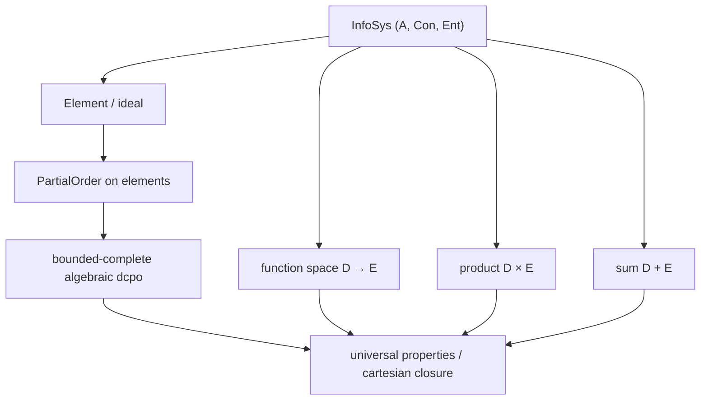

# Scott Information Systems in Lean 4

---

## Abstract

We develop, in **Lean 4** with **mathlib**, a formalization of Dana Scott's *information
systems* and the Scott domains they determine. Information systems present domains
discretely and combinatorially — as a type of *tokens* together with a consistency
predicate on finite token sets and an entailment relation — sidestepping much of the
order-theoretic and topological overhead of building domains from the Scott topology and
directed-complete partial orders directly. We define information systems, construct the
poset of *elements* (ideals) ordered by inclusion, and (planned) show that this poset is
a bounded-complete algebraic dcpo — a Scott domain — together with the function-space,
product, and sum constructions and their universal properties. The development follows
Scott's *"Domains for Denotational Semantics"* (ICALP 1982) and the compact presentation
of information systems in Winskel's *The Formal Semantics of Programming Languages*
(Chapter 8).

---

## 1. Introduction

Domain theory underpins denotational semantics: it supplies the ordered structures on
which recursive definitions are interpreted as least fixed points. The classical route
builds domains as directed-complete partial orders (dcpos) carrying the Scott topology.
Elegant on paper, this route is heavy to mechanize: it asks a proof assistant to carry a
substantial amount of order theory and point-set topology before any domain is in hand.

Scott's *information systems* offer a lighter path. A domain is presented not by its
points but by a logic of *tokens*: finite, observable units of information, a notion of
which finite token sets are jointly *consistent*, and an *entailment* relation recording
when a token is forced by a finite set. The points of the domain — its *elements*, or
*ideals* — are then recovered as the consistent, entailment-closed sets of tokens,
ordered by inclusion. Because the data is finite and inductive, the constructions and
their proofs are largely set-theoretic and combinatorial, which suits a proof assistant
well.

This paper reports a Lean 4 formalization of this development.

### 1.1 Contribution

This paper:

1. Formalizes Scott information systems and their elements in Lean 4 / mathlib.
2. Establishes the partial order on elements (the Scott ordering).
3. (Planned) Proves the elements form a bounded-complete algebraic dcpo.
4. (Planned) Constructs the function space `D → E`, product `D × E`, and sum `D + E`,
   with their universal properties, entirely in the information-system presentation.

### 1.2 Where the difficulty lives: a note on the progression of ideas

We present the three historical versions in chronological order (1972, 1981, 1982) not
merely for tidiness but to make visible *where* the genuine technical difficulty of the
foundations actually sits. Scott's original 1972 route is, in a precise sense, a piece of
professional point-set topology and lattice theory: it turns on injective `T₀`-spaces, the
Scott topology, the way-below relation `≪`, and inverse limits (culminating in the
self-applicative model `D∞`). It is comfortable only for a reader with the training and
mathematical culture of a topologist — a relatively rare intersection with the typical
computer-science skill set. The 1981 *neighborhood systems* and then the 1982 *information
systems* progressively trade that topological machinery for elementary, finite,
combinatorial data; the barrier to entry falls, version by version, from professional
topology to finite combinatorics.

The formalization furnishes *objective* evidence for this reading rather than mere
rhetoric. The 1972 layer leans on substantial mathlib topology and is irreducibly
classical — it already depends on `Classical.choice`, and the passage to maximal/total
elements is Zorn's lemma — whereas the 1982 information-system core is elementary enough to
be carried out in a purely constructive, choice-free, *executable* fragment of Lean (see
the constructivity audit, §[Goal 3]). The descent in proof machinery across the three
versions — measured concretely by mathlib dependencies and by `#print axioms` footprints —
is itself a quantitative gauge of where the conceptual depth is concentrated.

---

## 2. Information systems

Following Scott's Definition 2.1, an **information system** is a structure
`(P, Δ, Con, ⊢)`:

- `P` is a set of *data objects* / *propositions* (our token type);
- `Δ ∈ P` is a distinguished *least informative* object;
- `Con` is a set of finite subsets of `P`, the *consistent* sets; and
- `⊢` ("`u ⊢ a`") relates a finite set `u` to a token `a` it entails.

subject to Scott's six axioms: (i) consistency is downward closed; (ii) singletons are
consistent; (iii) if `u ⊢ a` then `u ∪ {a}` is consistent; (iv) `Δ` is entailed by every
consistent set; (v) entailment is reflexive on members of a consistent set; and (vi)
entailment satisfies cut (transitivity). The Lean encoding is the structure `InfoSys` in
`Domain/InfoSys.lean`. To keep the development constructive (choice-free), axiom (iii) is
written with `insert a u` rather than `u ∪ {a}`, since mathlib's `Finset` union instance
carries a `Classical.choice` dependency; the two are definitionally equal.

---

## 3. The domain of elements

An **element** (ideal) of an information system is a set of tokens that is consistent on
every finite subset and closed under entailment. Elements ordered by inclusion form a
poset — the Scott ordering — encoded as the `PartialOrder` instance on `InfoSys.Element`.

The plan for the remaining structure is the standard one:

---

## 4. Related work

- mathlib already provides `Order.OmegaCompletePartialOrder`, `Order.CompletePartialOrder`,
  and `Topology.Order.ScottTopology`; we relate the information-system domain to these.
- The information-system presentation is due to Dana Scott (ICALP 1982); the compact
  construction we follow is Winskel, Chapter 8.

---

## 5. Conclusion and further work

(To be written as the formalization proceeds.)

---

## References

- **[Sco82]** D. Scott. *Domains for Denotational Semantics*. ICALP 1982, LNCS 140.
- **[Win93]** G. Winskel. *The Formal Semantics of Programming Languages*. MIT Press,
  1993. (Chapter 8, *Information Systems*.)
- **[AJ94]** S. Abramsky and A. Jung. *Domain Theory*. In *Handbook of Logic in Computer
  Science*, Vol. 3, Oxford University Press, 1994.
- **[GHKLMS03]** G. Gierz, K. H. Hofmann, K. Keimel, J. D. Lawson, M. W. Mislove, D. S.
  Scott. *Continuous Lattices and Domains*. Cambridge University Press, 2003.
- **[AC98]** R. M. Amadio and P.-L. Curien. *Domains and Lambda-Calculi*. Cambridge
  University Press, 1998.
- **[Sco81]** D. Scott. *Lectures on a Mathematical Theory of Computation*. Technical
  Monograph PRG-19, Oxford University Computing Laboratory, 1981.
