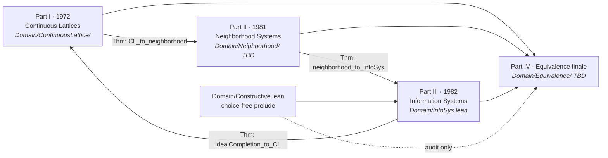
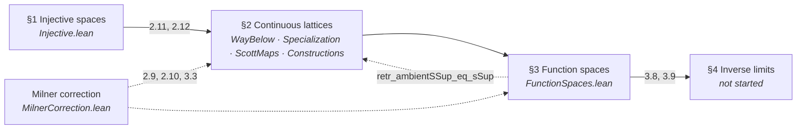
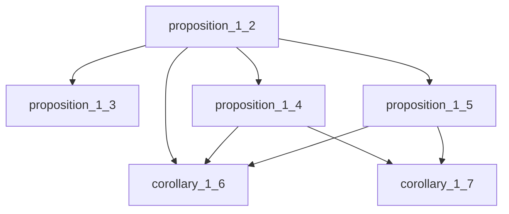
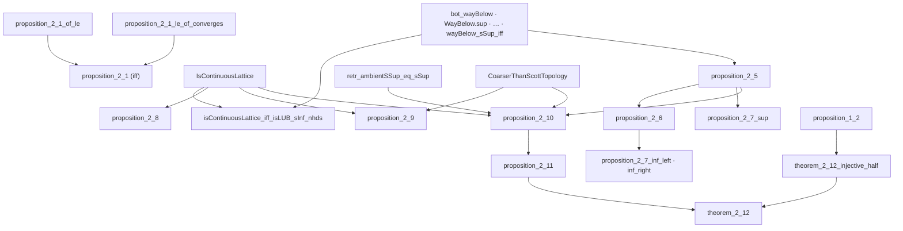
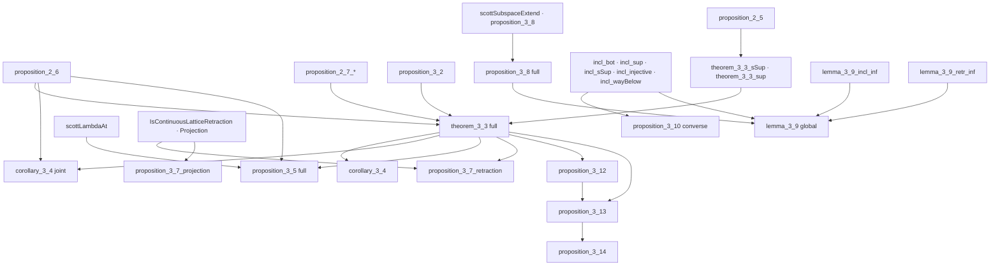
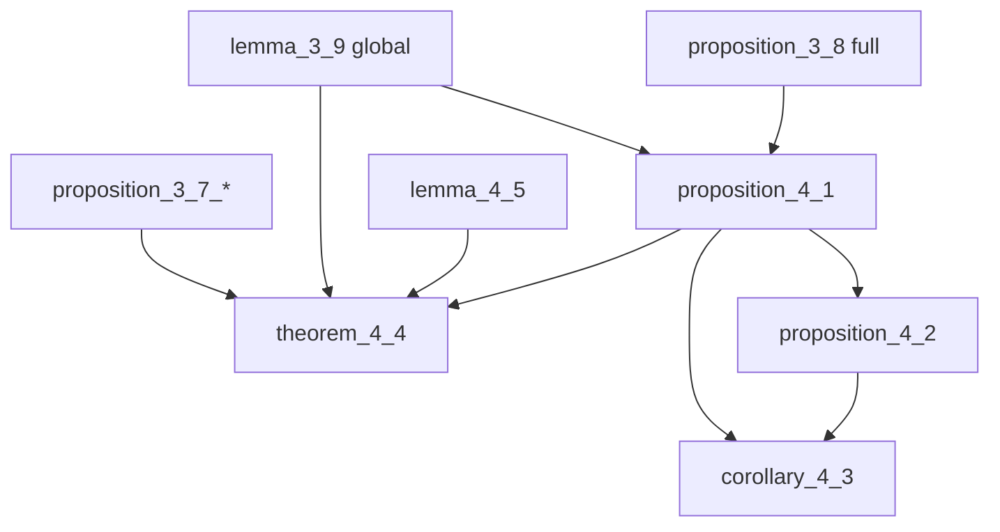
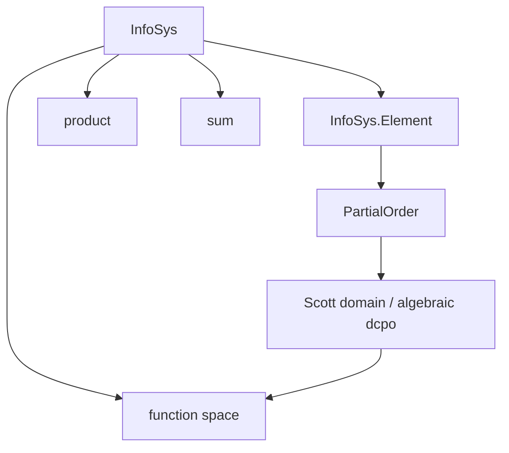
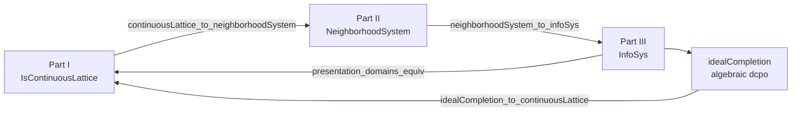

# Four Presentations of Scott Domains in Lean 4: A Chronological Formalization

---

## Abstract

This is **one formalization monograph** in **Lean 4** with **mathlib**. It has **four
sequential parts**, each formalizing a historical presentation of Scott domains in
chronological order:

1. **Part I (Scott 1972)** — *Continuous Lattices* (LNM 274): injective `T₀`-spaces, Scott
  topology, way-below, function spaces, inverse limits.
2. **Part II (Scott 1981)** — PRG-19 *Lectures on a Mathematical Theory of Computation*:
  neighborhood systems (filters of neighborhoods on a master set Δ; domain elements as
   filters).
3. **Part III (Scott 1982)** — *Domains for Denotational Semantics* (ICALP): information
  systems (finite consistency + entailment on tokens).
4. **Part IV (Equivalence)** — the **finale** of this same paper: explicit Lean theorems
  relating the three presentations, showing they determine the same class of domains up to
   isomorphism, and showing that Scott 1982 (Part III) is constructive while 1972 and 1981
   (Parts I–II) are not — yet the presentations are still isomorphic.

The narrative thesis is that **required skill descends chronologically**: professional
point-set topology and lattice theory (1972) → filter-theoretic neighborhoods (1981) →
finite combinatorics (1982) → synthesis (Part IV). The formalization makes this objective
via mathlib dependency footprints and `#print axioms` audits.

**STATUS:** **Part I** is the active workstream: vision transcription through the March 1972 Milner
correction is complete; **15 / 32** tracked numbered results are **Pass**, **9 Stuck**,
**8 Not Yet** (zero `sorry`s). **Parts II–III** are stubbed; **Part IV** lists planned
bridge theorems only. **Part III** is the **fully constructive** target
(`[propext, Quot.sound]` only); **Parts I–II** and the **1972 leg of Part IV** are
**classical** (see §1.2).

Complete Lean source is indexed in **Appendix A**; `scripts/generate_arxiv_with_code.py`
expands this narrative mechanically into `arxiv_with_code.md`.

---

## 1. Introduction

Domain theory supplies the ordered structures on which recursive definitions are interpreted
as least fixed points. Scott did not arrive at a single canonical presentation on first try.
Instead, over a decade, he moved from **topological continuous lattices** (1972) through
**neighborhood systems** (1981 lectures, PRG-19) to **information systems** (1982 ICALP) —
each time lowering the topological overhead and making the data more finitary.

This document is the **master narrative for that single monograph**. We do **not** treat
the four parts as independent publications. Parts I–III follow Scott's historical sources;
**Part IV** is not a fourth source text but the **equivalence finale** — specific bridge
theorems (§2.2) showing the three presentations coincide. Part I's internal §1–§4
dependency structure (injective spaces → continuous lattices → function spaces → inverse
limits) is spelled out in §3.

### 1.1 Contribution (overall)

1. **Part I:** Scott 1972 continuous lattices — numbered-result inventory, Milner correction,
  and partial §3–§4 spine in `Domain/ContinuousLattice/`.
2. **Part II (planned):** PRG-19 neighborhood systems — stub module `Domain/Neighborhood/` (TBD).
3. **Part III (planned):** 1982 information systems — choice-free core in `Domain/InfoSys.lean`
  and `Domain/Constructive.lean`.
4. **Part IV (planned):** functors and isomorphisms tying Parts I–III; constructive certification
  for the 1982 route; documented classical frontier for the 1972 route.

### 1.2 Constructivity discipline

| Part                             | Target fragment         | Typical axioms beyond `propext`, `Quot.sound`                                                                                                       |
| -------------------------------- | ----------------------- | --------------------------------------------------------------------------------------------------------------------------------------------------- |
| **Part I (1972)**                | Classical / topological | `Classical.choice`; mathlib Scott topology, embeddings, Zorn where used                                                                             |
| **Part II (1981)**               | Classical (expected)    | Choice for maximal/total elements; filter theory                                                                                                    |
| **Part III (1982)**              | **Fully constructive**  | **None** — audited choice-free `Finset` via `funion` (`Domain/Constructive.lean`)                                                                   |
| **Part IV (equivalence finale)** | Mixed                   | Constructive on the 1981↔1982 and 1982↔ideal-completion legs; **classical frontier** on any 1972↔1982 bridge using compact-open / basis-of-compacts |

Part III is the **certified constructive core**. Parts I and II are allowed classical
machinery; **Part IV** must **say explicitly** where classical steps enter when relating
back to 1972.

---

## 2. Four-part blueprint (one monograph)

### 2.1 Historical order and module map

The four parts are **not** independent silos within this monograph. Reading order is
**I → II → III**, then **Part IV** closes the arc. Part III also feeds back to Part I via
ideal completion (algebraic / consistently complete presentation of the same domains).

### 2.2 Planned equivalence theorems (Part IV finale)

These are the **bridge theorems for Part IV** (Lean names provisional):

| Theorem (planned)                         | Direction                      | Depends on                                 | Status                           |
| ----------------------------------------- | ------------------------------ | ------------------------------------------ | -------------------------------- |
| `continuousLattice_to_neighborhoodSystem` | 1972 → 1981                    | Part I **2.11**, **2.12**; Δ as master set | **Not Yet**                      |
| `neighborhoodSystem_to_infoSys`           | 1981 → 1982                    | Part II domain-as-filter; finite basis     | **Not Yet**                      |
| `infoSys_to_idealCompletion`              | 1982 → algebraic dcpo          | Part III `InfoSys.Element`                 | **Not Yet**                      |
| `idealCompletion_to_continuousLattice`    | algebraic CL → 1972            | compact elements, Scott open sets          | **Not Yet** (classical frontier) |
| `presentation_domains_equiv`              | I ↔ II ↔ III                   | all above                                  | **Not Yet**                      |
| `infoSys_constructions_equiv`             | products, sums, function space | Part I **3.3**, Part III constructions     | **Not Yet**                      |

Scott himself notes (1982) that neighborhood systems and information systems are equivalent
in a precise sense; **Part IV** of this monograph makes that equivalence **checkable in Lean**.

### 2.3 Gates between parts

| Gate                    | Requirement                                                          |
| ----------------------- | -------------------------------------------------------------------- |
| **Part I → Part II**    | **Pass** on **2.8–2.11**, **3.3** (under `CoarserThanScottTopology`) |
| **Part II → Part III**  | Part II domain definition + approximable maps (PRG-19 core)          |
| **Part III standalone** | Prop 2.3 (1982), Scott domain = consistently complete algebraic dcpo |
| **Part IV finale**      | All three presentations formalized + functorial constructions        |

---

## 3. Part I — Scott 1972 *Continuous Lattices*

**Source:** Scott, *Continuous Lattices*, LNM 274 (1972); vision transcription in
`[sources/ScottContinLatt1972_vision.md](sources/ScottContinLatt1972_vision.md)` through the
**March 1972 Milner correction** (pp. 135–136).

**Constructivity:** **Classical.** Uses mathlib topology, `Classical.choice` transitively,
embedding into Sierpiński powers, and order-theoretic arguments not audited for constructivity.

**Lean root:** `Domain/ContinuousLattice/` (imported from `Domain.lean` before `InfoSys`).

Scott's four section titles within Part I:

| §   | Title                   | Lean modules                                                                                            |
| --- | ----------------------- | ------------------------------------------------------------------------------------------------------- |
| §1  | **Injective spaces**    | `Injective.lean`                                                                                        |
| §2  | **Continuous lattices** | `WayBelow.lean`, `Specialization.lean`, `ScottMaps.lean`, `Constructions.lean`, `MilnerCorrection.lean` |
| §3  | **Function spaces**     | `FunctionSpaces.lean`                                                                                   |
| §4  | **Inverse limits**      | — (not started)                                                                                         |

### 3.1 Report card (32 tracked results)

**Pass** = full numbered statement proved, sorry-free. **Stuck** = partial. **Not Yet** = no
full deliverable. Score: **15 Pass · 9 Stuck · 8 Not Yet**.

**Supporting keystones (not separately numbered by Scott):** `directedOn_wayBelow`,
`wayBelow_interpolate` (interpolation property of `≪`, **axiom-free**), `exists_wayBelow_subset`
(the `↟a` basis of the Scott topology) in `WayBelow.lean`; these underpin 2.11.

| §   | Scott     | Lean name(s)                                                                                                                     | Module                | Status      | Notes                                |
| --- | --------- | -------------------------------------------------------------------------------------------------------------------------------- | --------------------- | ----------- | ------------------------------------ |
| 1   | Prop 1.2  | `proposition_1_2`                                                                                                                | `Injective.lean`      | **Pass**    |                                      |
| 1   | Prop 1.3  | `proposition_1_3`                                                                                                                | `Injective.lean`      | **Pass**    |                                      |
| 1   | Prop 1.4  | `proposition_1_4`                                                                                                                | `Injective.lean`      | **Pass**    |                                      |
| 1   | Prop 1.5  | `proposition_1_5`                                                                                                                | `Injective.lean`      | **Pass**    |                                      |
| 1   | Cor 1.6   | `corollary_1_6`                                                                                                                  | `Injective.lean`      | **Pass**    |                                      |
| 1   | Cor 1.7   | `corollary_1_7`                                                                                                                  | `Injective.lean`      | **Pass**    |                                      |
| 2   | Prop 2.1  | `proposition_2_1`                                                                                                                | `Specialization.lean` | **Pass**    | iff; `_of_le` + `_le_of_converges`   |
| 2   | Prop 2.2  | `bot_wayBelow`, `WayBelow.sup`, `WayBelow.trans_le`, `WayBelow.le_trans`, `wayBelow_self_iff_scottOpen_Ici`, `wayBelow_sSup_iff` | `WayBelow.lean`       | **Pass**    | seven clauses                        |
| 2   | Prop 2.4  | `isContinuousLattice_iff_isLUB_sInf_nhds`                                                                                        | `WayBelow.lean`       | **Pass**    |                                      |
| 2   | Prop 2.5  | `proposition_2_5`                                                                                                                | `ScottMaps.lean`      | **Pass**    |                                      |
| 2   | Prop 2.6  | `proposition_2_6`                                                                                                                | `ScottMaps.lean`      | **Pass**    | joint ↔ separate continuity          |
| 2   | Prop 2.8  | `proposition_2_8`                                                                                                                 | `Constructions.lean`  | **Pass**    | finite lattices                      |
| 2   | Prop 2.9  | `proposition_2_9`                                                                                                                 | `Constructions.lean`  | **Stuck**   | products: order part done; topology agreement (Milner) open |
| 2   | Prop 2.10 | `retr_ambientSSup_eq_sSup`                                                                                                       | `FunctionSpaces.lean` | **Stuck**   | Milner identity; full prop open      |
| 2   | Prop 2.11 | `proposition_2_11`                                                                                                                | `Constructions.lean`  | **Pass**    | CL injective (`scottExtend`)         |
| 2   | Thm 2.12  | `theorem_2_12_forward`, `isContinuousLattice_prop`, `sierpinski_isInjective_and_isContinuousLattice`                             | `Constructions.lean`  | **Stuck**   | forward (CL⟹injective) done; backward (injective⟹CL) needs 2.10 |
| 3   | Prop 3.2  | `proposition_3_2`                                                                                                                | `FunctionSpaces.lean` | **Pass**    |                                      |
| 3   | Thm 3.3   | `theorem_3_3_sSup`, `theorem_3_3_sup`                                                                                            | `FunctionSpaces.lean` | **Stuck**   | pointwise sups only                  |
| 3   | Cor 3.4   | `corollary_3_4`, `corollary_3_4_eval_on_C`                                                                                       | `FunctionSpaces.lean` | **Stuck**   | fixed-`x` eval                       |
| 3   | Prop 3.5  | `scottLambdaAt`, `curry_right_preservesDirectedSup`                                                                              | `FunctionSpaces.lean` | **Stuck**   | right curry only                     |
| 3   | Prop 3.7  | `proposition_3_7_retraction`, `proposition_3_7_projection`                                                                       | `FunctionSpaces.lean` | **Pass**    |                                      |
| 3   | Prop 3.8  | `scottSubspaceExtend`, `proposition_3_8`                                                                                         | `FunctionSpaces.lean` | **Stuck**   | one-sided bound                      |
| 3   | Lemma 3.9 | `lemma_3_9_incl_inf`, `lemma_3_9_retr_inf`                                                                                       | `FunctionSpaces.lean` | **Stuck**   | inf-level; global eq open            |
| 3   | Prop 3.10 | `incl_bot`, `incl_sup`, `incl_sSup`, `incl_injective`, `incl_wayBelow`                                                           | `FunctionSpaces.lean` | **Stuck**   | forward (i)–(iii)                    |
| 3   | Prop 3.12 | —                                                                                                                                | —                     | **Not Yet** |                                      |
| 3   | Prop 3.13 | —                                                                                                                                | —                     | **Not Yet** |                                      |
| 3   | Prop 3.14 | —                                                                                                                                | —                     | **Not Yet** |                                      |
| 4   | Prop 4.1  | —                                                                                                                                | —                     | **Not Yet** | uses 3.8                             |
| 4   | Prop 4.2  | —                                                                                                                                | —                     | **Not Yet** |                                      |
| 4   | Cor 4.3   | —                                                                                                                                | —                     | **Not Yet** |                                      |
| 4   | Thm 4.4   | —                                                                                                                                | —                     | **Not Yet** | `D∞ ≅ [D∞ → D∞]`                     |
| 4   | Lemma 4.5 | —                                                                                                                                | —                     | **Not Yet** |                                      |

**Milner infrastructure:** `CoarserThanScottTopology`, `scottOpen_of_coarserThanScott`,
`scottLowerSubbasisSet`, `scottPrincipalUpSet` in `MilnerCorrection.lean`.

**Notation:** `⊔S′` = ambient join in `D′` (`ambientSSup`); `⊔S` = subspace join;
`j(⊔S′) = ⊔S` = `retr_ambientSSup_eq_sSup`.

### 3.2 Part I internal dependency (Scott §1–§4 are not independent)

### 3.3 §1 Injective spaces — inclusion hierarchy

All six results **Pass**.

### 3.4 §2 Continuous lattices — inclusion hierarchy

### 3.5 §3 Function spaces — inclusion hierarchy

### 3.6 §4 Inverse limits — inclusion hierarchy

All nodes **Not Yet**; blocked on full **3.8** and **3.9**.

### 3.7 Selected proof notes

#### Proposition 2.6 (joint ↔ separate continuity) — `proposition_2_6`

Scott's statement: *a function of several variables between complete lattices is continuous
jointly iff it is continuous in each variable separately.* We formalize the two-variable case
`f : D × D' → D''`, with continuity phrased as `PreservesDirectedSup` (justified by Prop 2.5),
and the product `D × D'` carrying the componentwise complete-lattice structure (whose induced
topology is the product topology). The proof follows Scott's directed-net argument:

- **Joint ⟹ separate.** Precompose `f` with the slice map `x ↦ (x, y)`. The image of a directed
  `S ⊆ D` under this map is directed in `D × D'` with least upper bound `(⊔S, y)` (computed
  componentwise via `Prod.fst_sSup` / `Prod.snd_sSup`, using `S` nonempty for the constant second
  coordinate). Joint preservation of that supremum therefore yields preservation in the first
  variable; the second variable is symmetric.
- **Separate ⟹ joint** (the substance). For directed `S* ⊆ D × D'`, project to the directed sets
  `S = fst '' S*` and `S' = snd '' S*` (directedness via `DirectedOn.fst` / `DirectedOn.snd`), so
  that `⊔S* = (⊔S, ⊔S')`. Then:
  - `⊔(f '' S*) ≤ f(⊔S*)` is immediate from monotonicity of `f` (assembled from the separate
    monotonicities `hmono1`, `hmono2`).
  - `f(⊔S*) ≤ ⊔(f '' S*)`: unfolding separate continuity twice gives
    `f(⊔S*) = ⊔_{x∈S} ⊔_{y∈S'} f(x, y)`; for each pair `x ∈ S`, `y ∈ S'` there exist witnesses
    `(x, b), (a, y) ∈ S*`, and **directedness of `S*`** supplies `r ∈ S*` above both, so
    `(x, y) ≤ r` and `f(x, y) ≤ f(r) ≤ ⊔(f '' S*)` by monotonicity. This is exactly Scott's
    "monotonicity + directedness" step.

Sorry-free; `#print axioms` gives `[propext, Classical.choice, Quot.sound]` (the standard
classical footprint for Part I).

#### Proposition 2.8 (finite lattices are continuous) — `proposition_2_8`

Scott states this as a one-line example. The Lean proof isolates the genuinely finite step in a
reusable lemma `directedOn_finite_sSup_mem`: *a non-empty finite directed set attains its
supremum* (`⊔S ∈ S`). A maximal element `m ∈ S` exists by `Set.Finite.exists_maximal`; by
directedness any `s ∈ S` and `m` have an upper bound `c ∈ S`, and maximality forces `c ≤ m`, so
`s ≤ m`. Hence `m` is the greatest element, `IsLUB S m`, and `⊔S = m ∈ S`. With this, every
principal up-set `Set.Ici y` is Scott-open (a directed `S` with `y ≤ ⊔S` has `⊔S ∈ S`), so
`y ≪ y` via `wayBelow_self_iff_scottOpen_Ici`, and `y` is trivially the supremum of
`{x | x ≪ y}`. `[Finite D]` suffices (subsets are finite via `Set.toFinite`).

#### Proposition 2.9 (products of continuous lattices) — `proposition_2_9`

We prove the **order-theoretic content**: a product `∀ i, Eᵢ` of continuous lattices is a
continuous lattice. (The accompanying topological claim — the induced topology agrees with the
product topology — is the Milner-correction part and stays **Stuck**.) The construction is the
cylinder element: for `a ≪ yᵢ` in factor `Eᵢ`, let `[a]ⁱ := Function.update ⊥ i a`. Then
`[a]ⁱ ≪ y` in the product, witnessed by the preimage `{z | zᵢ ∈ U}` of a Scott-open `U ⊆ Eᵢ`
with `yᵢ ∈ U ⊆ Ici a`: this set is an upper set, and inaccessible because suprema are
coordinatewise (`sSup_apply_eq_sSup_image`), so a directed `S` with `(⊔S)ᵢ ∈ U` already has some
`f ∈ S` with `fᵢ ∈ U`. Given any upper bound `b` of `{x | x ≪ y}`, each `[a]ⁱ ≤ b` gives
`a = ([a]ⁱ)ᵢ ≤ bᵢ`; ranging over `a ≪ yᵢ` and using continuity of `Eᵢ`
(`(hE i).sSup_wayBelow`) yields `yᵢ ≤ bᵢ` for all `i`, i.e. `y ≤ b`. This is a cleaner route
than Scott's exposition (no finite-support bookkeeping). `classical` supplies the `DecidableEq`
for `Function.update`; footprint `[propext, Classical.choice, Quot.sound]`.

#### Keystones for 2.11: interpolation and the `↟a` basis — `WayBelow.lean`

Two standard facts about `≪` that mathlib does not provide and that the capstone needs:

- **Interpolation** (`wayBelow_interpolate`): in a continuous lattice `a ≪ c ⟹ ∃ b, a ≪ b ≪ c`.
  The set `M = {m | ∃ x, m ≪ x ∧ x ≪ c}` is directed (apply directedness of `{· ≪ x}` twice)
  with `⊔M = c` (continuity twice); then `a ≪ c = ⊔M` forces `a ≪ m ≤ x ≪ c` for some
  `m ≪ x ≪ c`, so `b := x`. Notably this is **axiom-free** (`#print axioms` reports none).
- **`↟a` basis** (`exists_wayBelow_subset`): every Scott-open `U ∋ z` contains a basic
  neighbourhood `↟a = {w | a ≪ w}` with `a ≪ z`. Since `z = ⊔{a | a ≪ z}` is a directed sup in
  the open `U`, inaccessibility yields `a ≪ z` with `a ∈ U`, and `↟a ⊆ ↑a ⊆ U`.

#### Proposition 2.11 (continuous lattices are injective) — `proposition_2_11`

The substantial half of Theorem 2.12. The witness is an explicit operator
`scottExtend e f y = ⊔ { ⊓ f''(e⁻¹V) : V an open nbhd of y }` (a standalone `def`, purely
order-theoretic). Two lemmas about it:

- **Extends `f`** (`scottExtend_eq_of_continuous`). The `≤` bound is immediate (`f x₀` is one of
  the values met). For `≥`, continuity of the lattice is essential: for each `a ≪ f x₀`, the
  Scott-open `↟a` pulls back along the continuous `f`, and the **embedding** turns that into an
  open `V ⊆ Y` with `e⁻¹V = f⁻¹(↟a)`; on `e⁻¹V`, `f ≥ a`, so `a ≤ ⊓ f''(e⁻¹V) ≤ g(e x₀)`. Summing
  over `a ≪ f x₀` (continuity) gives `f x₀ ≤ g(e x₀)`.
- **Continuous** (`scottExtend_continuous`). Uses the `↟a` basis: for Scott-open `U` and `g y₀ ∈ U`
  pick `a ≪ g y₀` with `↟a ⊆ U`; as `g y₀` is a directed sup, `a ≪ ⊓ f''(e⁻¹V)` for some open
  `V ∋ y₀`, and that value is `≤ g y'` for all `y' ∈ V`, so `V ⊆ g⁻¹U`.

A Lean-specific wrinkle: `E` carries no global `TopologicalSpace` instance (its topology is
`scottTopologicalSpace`), so lemmas like `IsOpen.preimage` that *synthesize* `[TopologicalSpace E]`
fail. The order-heavy `scottExtend_eq_of_continuous` uses `continuous_def` (whose topology
arguments are ordinary implicits, unified from the hypothesis) to avoid both the synthesis failure
and the specialization-order diamond a `letI` would introduce; the purely topological
`scottExtend_continuous` and `proposition_2_11` use `letI : TopologicalSpace E := scottTopologicalSpace`.
Footprint `[propext, Classical.choice, Quot.sound]`.

#### Theorem 2.12 — `theorem_2_12_forward`, `isContinuousLattice_prop`

The **forward** direction ("every continuous lattice is injective") is now `theorem_2_12_forward`
(= 2.11). The base case closes too: `Prop` (Scott's `𝕆`) is a continuous lattice by 2.8 (it is
finite), recorded as `isContinuousLattice_prop`, so `sierpinski_isInjective_and_isContinuousLattice`
exhibits `Prop` as both injective and a continuous lattice. The **backward** direction
(injective ⟹ continuous lattice) remains **Stuck**: it needs Proposition 2.10 (a retract of a CL
is a CL) plus transporting the lattice structure along a topological retract.

### 3.8 Part I — next work (Composer vs Opus)

| Priority | Items                                                                       | Suggested agent                    |
| -------- | --------------------------------------------------------------------------- | ---------------------------------- |
| Medium   | **3.5** left curry                                                          | Composer 2.5                       |
| Hard     | **2.9** topology agreement, **2.10** full (retract-of-CL-is-CL), **2.12** backward, **3.3** full, **3.10** converse, Scott §4 | Opus 4.8 (one theorem per session) |

---

## 4. Part II — Scott 1981 PRG-19 (stub)

**Source:** Scott, *Lectures on a Mathematical Theory of Computation*, Technical Monograph
PRG-19, Oxford (May 1981). OCR draft: `[sources/PRG19.md](sources/PRG19.md)`.

**Constructivity:** **Classical expected** — filters, maximal/total elements, Zorn/choice
(PRG-19 discusses choice explicitly).

**Planned Lean root:** `Domain/Neighborhood/` (not yet created).

### 4.1 Planned content

- **Definition:** neighborhood system on master set Δ; domain elements as filters of neighborhoods.
- **Core theorems (inventory TBD):** approximable maps, domain isomorphisms from neighborhood
isomorphisms (PRG-19 Thm 2.7), function-space and product constructions.
- **Bridge toward Part IV:** `continuousLattice_to_neighborhoodSystem` (§2.2).
- **Bridge toward Part III:** `neighborhoodSystem_to_infoSys` (§2.2).

### 4.2 Status

| Block        | Status                       |
| ------------ | ---------------------------- |
| Vision / OCR | Partial (`sources/PRG19.md`) |
| Lean module  | **Not Yet**                  |
| Report card  | **Not Yet**                  |

---

## 5. Part III — Scott 1982 information systems (stub)

**Source:** Scott, *Domains for Denotational Semantics*, ICALP 1982, LNCS 140. OCR draft:
`[sources/Domains_for_Denotational_Semantics.md](sources/Domains_for_Denotational_Semantics.md)`.

**Constructivity:** **Fully constructive target.** Every result must satisfy `#print axioms ⊆ {propext, Quot.sound}`. Choice-tainted mathlib `Finset` operations are avoided via
`Domain/Constructive.lean` (`funion`, `insert_comm'`, …).

**Lean root:** `Domain/InfoSys.lean`, `Domain/Constructive.lean`.

### 5.1 In place today

- `InfoSys` structure (Scott Def 2.1, six axioms; `insert` instead of `∪` for (iii)).
- `InfoSys.Element` (ideals) and partial order instance.

### 5.2 Planned content

| Scott (1982)            | Planned Lean                                        | Status      |
| ----------------------- | --------------------------------------------------- | ----------- |
| Prop 2.3                | Scott domain = consistently complete algebraic dcpo | **Not Yet** |
| Def 3.1 / constructions | function space, product, sum + universal properties | **Not Yet** |
| Domain equations        | solutions as IS                                     | **Not Yet** |

### 5.3 Planned dependency (stub)

---

## 6. Part IV — Equivalence (finale, stub)

**Role:** The **closing section of this monograph**, not a separate publication. After Parts
I–III formalize Scott's three presentations, Part IV states and proves the bridge theorems
that they determine the same domains (and, where possible, the same constructions).

### 6.1 Planned theorems (see §2.2)

### 6.2 Constructivity note

- **1981 ↔ 1982:** target **constructive** (Scott's 1982 text emphasizes constructive
definitions; PRG-19 notes equivalence).
- **1982 → algebraic → 1972:** document **classical frontier** (compact elements / basis of
compacts) wherever Part I topology cannot be eliminated.

### 6.3 Status

| Block                 | Status      |
| --------------------- | ----------- |
| `Domain/Equivalence/` | **Not Yet** |
| Any bridge theorem    | **Not Yet** |

---

## 7. Related work

- mathlib: `Topology.Order.ScottTopology`, `Order.ScottContinuity`, `Order.OmegaCompletePartialOrder`.
- Winskel, *Formal Semantics* Ch. 8 (1982 presentation).
- Abramsky–Jung, *Domain Theory* handbook chapter.
- Gierz et al., *Continuous Lattices and Domains*.

---

## 8. Conclusion

We are mid-way through **one monograph** with four parts: **Part I** has a complete vision
transcript and a sorry-free partial formalization (**12/32 Pass** on the tracked 1972
inventory); **Parts II–III** are stubbed; **Part IV** lists bridge-theorem goals for the
finale. The next gate is Part I **2.8–2.11** and **3.3** under the Milner hypothesis, then
chronological entry into Part II (PRG-19).

---

## Acknowledgments

- **Dana Scott** — the three historical presentations (1972, 1981, 1982) that this
monograph formalizes in order.
- **Robin Milner** — the March 1972 correction to *Continuous Lattices*, without which
Propositions 2.9, 2.10, and 3.3 would be wrong as originally stated.

### AI-assisted development

The human author(s) retain sole responsibility for the mathematical content, the
choice of formalization route, and every formal claim in this work. Following standard
publisher practice (e.g., COPE guidance on authorship and AI tools [COPE24]), **no
large language model is listed as a co-author** — authorship implies an accountability
that automated systems cannot bear.

We gratefully acknowledge assistance from the following tools:

- **Cursor** ([Cur26]): agent-assisted editing in the Cursor IDE. These agents helped
formalize Scott's 1972 continuous-lattice layer in Lean 4 / mathlib, run and repair
`lake build`, transcribe scanned sources via the vision-OCR pipeline, draft and
maintain this narrative (`arxiv.md`), and track the Pass / Stuck / Not Yet inventory
for numbered results. Generated Lean was treated as provisional until it compiled
under the pinned toolchain; no result was accepted on the basis of an LLM's assertion
alone.
- **Cursor Composer 2.5 Fast** ([Cmp25]): the default agent for routine multi-step work —
module scaffolding and imports, dependency-ordered wiring of `Domain/ContinuousLattice/`,
`lake build` repair loops, the choice-free `Finset` prelude, documentation and Mermaid
blueprints, vision-transcript hygiene, and medium proof obligations where the strategy
was already fixed (e.g. Props 1.2–1.7, 2.2, 2.4–2.5, partial §3). Per its model card,
Composer 2.5 is optimized for codebase navigation and tool use rather than open-ended
topological proof design; accordingly, the Milner-block results (2.9–2.11, full 3.3)
were not delegated to it alone.
- **Anthropic Claude Opus 4.8, High reasoning** ([Ant26]): used selectively for the
heaviest proof and design work — results that combine Scott topology, order theory,
and mathlib friction (planned: Propositions 2.9–2.11 under `CoarserThanScottTopology`,
the full function-space theorem 3.3, Proposition 3.10 converse, and Part I §4 inverse
limits). Per the model card, the system is a general-purpose reasoning model with no
formal soundness guarantee; every emitted proof term was checked by the Lean kernel,
and open obligations remain marked **Stuck** / **Not Yet** rather than papered over
with `sorry`.
- **Google Gemini 3.5 Flash** ([Gem25]): occasional exploratory passes — comparing
Scott's typographic conventions (e.g. ambient vs subspace joins in the March 1972
correction), sanity-checking inventory and scope decisions, and discussing when to
escalate from Composer to Opus. Its suggestions informed, but did not dictate,
formalization choices (in particular, treating Part IV as the equivalence *finale*
of one monograph rather than a separate publication).

All definitions, constructivity audits, remaining proof gaps, and final prose were
reviewed by the human author(s), who take full responsibility for them.

### Artifact availability

The development [DT26] is at
`[github.com/catskillsresearch/domain_theory](https://github.com/catskillsresearch/domain_theory)`.
Run `lake build Domain` for the current sorry-free fragment; `scripts/generate_arxiv_with_code.py`
builds `arxiv_with_code.md` from this file plus the complete Lean source.

---

## References

- **[Sco72]** D. Scott. *Continuous Lattices*. In *Toposes, Algebraic Geometry and Logic*,
LNM 274, Springer, 1972.
- **[Sco81]** D. Scott. *Lectures on a Mathematical Theory of Computation*. Technical
Monograph PRG-19, Oxford University Computing Laboratory, May 1981.
- **[Sco82]** D. Scott. *Domains for Denotational Semantics*. ICALP 1982, LNCS 140.
- **[Win93]** G. Winskel. *The Formal Semantics of Programming Languages*. MIT Press, 1993.
- **[AJ94]** S. Abramsky and A. Jung. *Domain Theory*. Handbook of Logic in Computer Science, Vol. 3.
- **[GHKLMS03]** G. Gierz et al. *Continuous Lattices and Domains*. Cambridge, 2003.
- **[DT26]** Catskills Research. *domain_theory* (this work).
[https://github.com/catskillsresearch/domain_theory](https://github.com/catskillsresearch/domain_theory).
- **[COPE24]** Committee on Publication Ethics (COPE). *Authorship and AI tools: COPE
position statement*. 2024.
[https://publicationethics.org/guidance/cope-position/authorship-and-ai-tools](https://publicationethics.org/guidance/cope-position/authorship-and-ai-tools)
- **[Cur26]** Anysphere, Inc. *Cursor: AI-native code editor and agent environment*.
[https://cursor.com](https://cursor.com) (accessed 2026).
- **[Cmp25]** Anysphere, Inc. *Composer 2.5*. Model announcement and documentation,
[https://cursor.com/blog/composer-2-5](https://cursor.com/blog/composer-2-5); model card as integrated in Cursor,
[https://cursor.com/docs/models](https://cursor.com/docs/models) (accessed 2026).
- **[Ant26]** Anthropic. *Claude Opus 4.8* (high thinking/reasoning variant). System card
and announcement, [https://www.anthropic.com/news/claude-opus-4-8](https://www.anthropic.com/news/claude-opus-4-8); model documentation as
integrated in Cursor, [https://cursor.com/docs/models/claude-opus-4-8](https://cursor.com/docs/models/claude-opus-4-8) (accessed 2026).
- **[Gem25]** Google DeepMind. *Gemini 3.5 Flash*. Technical documentation and model
cards. [https://ai.google.dev/gemini-api/docs/models](https://ai.google.dev/gemini-api/docs/models) (accessed 2026).

---

## Appendix A — Lean source index

This appendix lists every library file in `Domain.lean` import order. Run
`scripts/generate_arxiv_with_code.sh` (or `python3 scripts/generate_arxiv_with_code.py`) to
produce `**arxiv_with_code.md`**, which inlines the full source below this narrative.

| #   | File                                                                                               | Role                                                       |
| --- | -------------------------------------------------------------------------------------------------- | ---------------------------------------------------------- |
| 1   | `[Domain.lean](Domain.lean)`                                                                       | Root import graph                                          |
| 2   | `[Domain/Constructive.lean](Domain/Constructive.lean)`                                             | Choice-free `Finset` prelude (Part III)                    |
| 3   | `[Domain/ContinuousLattice/Injective.lean](Domain/ContinuousLattice/Injective.lean)`               | Part I, Scott §1                                           |
| 4   | `[Domain/ContinuousLattice/WayBelow.lean](Domain/ContinuousLattice/WayBelow.lean)`                 | Part I, Scott §2: `ScottOpen`, `≪`, Def 2.3, Prop 2.2, 2.4 |
| 5   | `[Domain/ContinuousLattice/Specialization.lean](Domain/ContinuousLattice/Specialization.lean)`     | Part I, Scott §2: specialization, Prop 2.1                 |
| 6   | `[Domain/ContinuousLattice/ScottMaps.lean](Domain/ContinuousLattice/ScottMaps.lean)`               | Part I, Scott §2: Props 2.5, 2.7                           |
| 7   | `[Domain/ContinuousLattice/MilnerCorrection.lean](Domain/ContinuousLattice/MilnerCorrection.lean)` | March 1972 Milner hypothesis                               |
| 8   | `[Domain/ContinuousLattice/Constructions.lean](Domain/ContinuousLattice/Constructions.lean)`       | Part I, Scott §2.8–2.12 (partial)                          |
| 9   | `[Domain/ContinuousLattice/FunctionSpaces.lean](Domain/ContinuousLattice/FunctionSpaces.lean)`     | Part I, Scott §3 (+ 2.10 lemma)                            |
| 10  | `[Domain/InfoSys.lean](Domain/InfoSys.lean)`                                                       | Part III core (stub)                                       |

**Vision / OCR sources (not inlined by script):**

- `[sources/ScottContinLatt1972_vision.md](sources/ScottContinLatt1972_vision.md)` — Part I transcript + inventory
- `[sources/PRG19.md](sources/PRG19.md)` — Part II OCR draft
- `[sources/Domains_for_Denotational_Semantics.md](sources/Domains_for_Denotational_Semantics.md)` — Part III OCR draft

**Build:** `lake build Domain` (target: sorry-free).