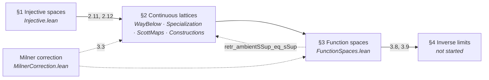
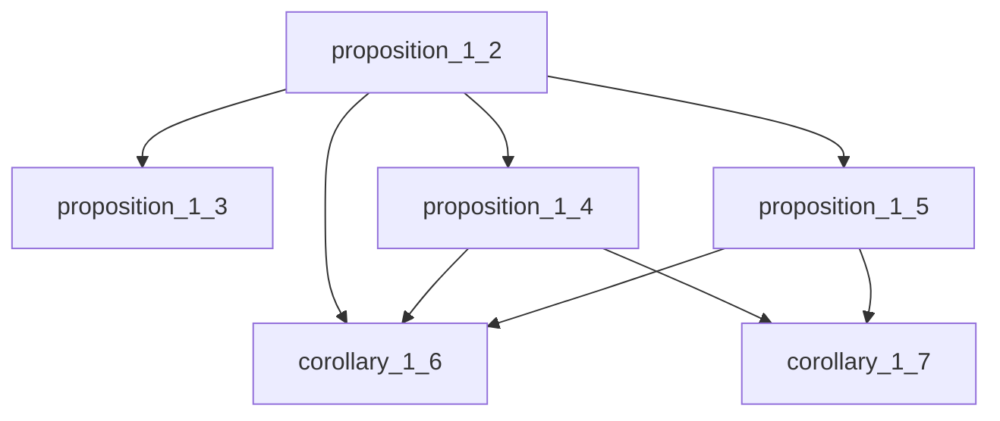
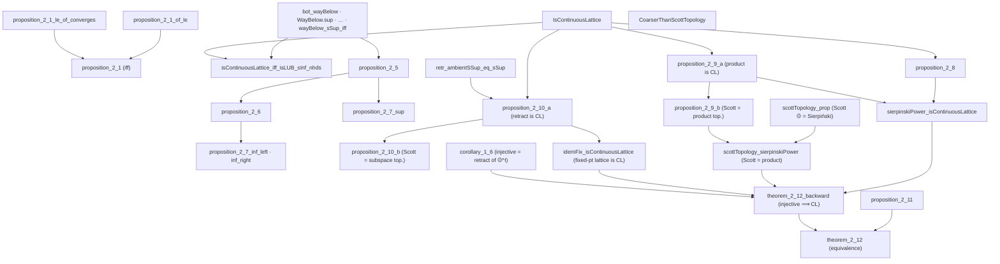
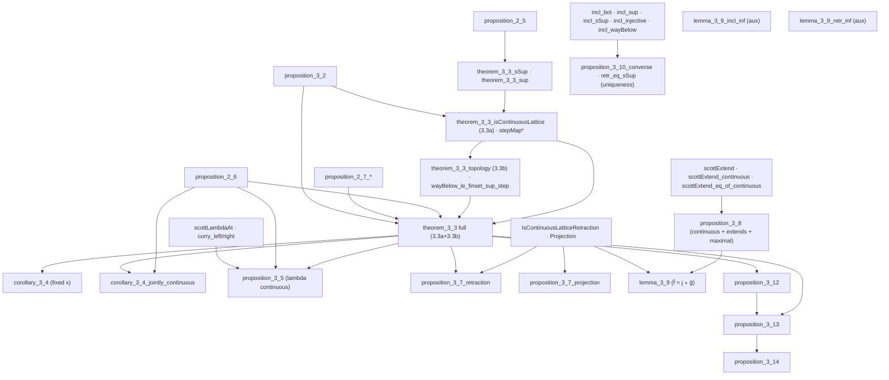
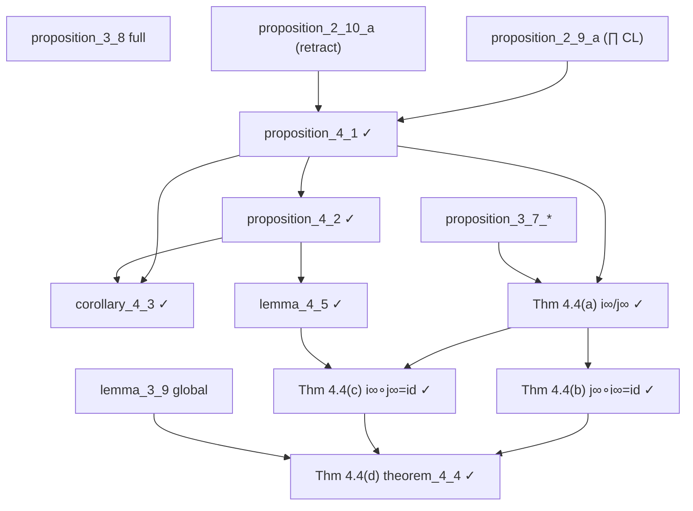
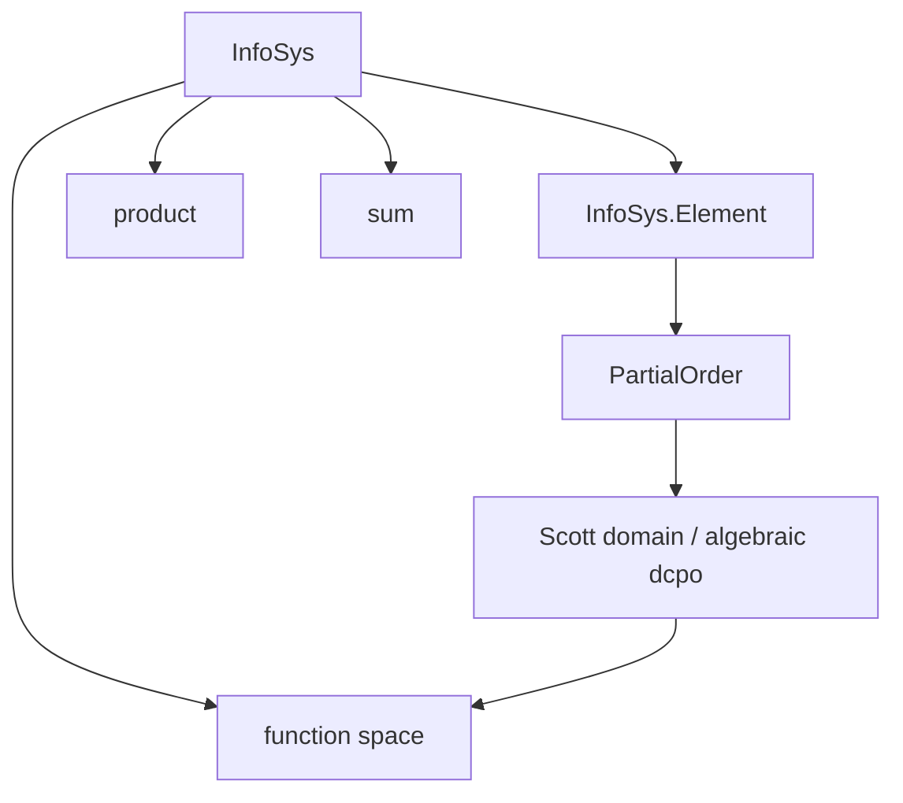
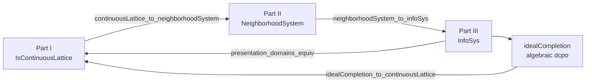

# Scott's 3 Successively Less Topological, Simpler, and More Constructive Presentations of Domain Theory and Their Equivalence

---

## Abstract

This is **one formalization monograph** in **Lean 4** with **mathlib**. It formalizes Scott's **three
presentations** of domain theory — each successively less topological, simpler, and more
constructive (1972 continuous lattices → 1981 neighborhood systems → 1982 information systems) —
**and proves their equivalence**. The work is organized in **four sequential parts** in this
monograph:

1. **Part I (Scott 1972)** — *Continuous Lattices* (LNM 274): injective `T₀`-spaces, Scott
  topology, way-below, function spaces, inverse limits.
2. **Part II (Scott 1981)** — PRG-19 *Lectures on a Mathematical Theory of Computation*:
  neighborhood systems (filters of neighborhoods on a master set Δ; domain elements as
   filters).
3. **Part III (Scott 1982)** — *Domains for Denotational Semantics* (ICALP): information
  systems (finite consistency + entailment on tokens).
4. **Part IV (Equivalence)** — the **finale** of this same paper: explicit Lean theorems
  relating the three presentations, showing they determine the same class of domains up to
   isomorphism, and showing that Scott 1982 (Part III) is constructive while 1972 and 1981
   (Parts I–II) are not — yet the presentations are still isomorphic.

The narrative thesis is that **required skill descends chronologically**: professional
point-set topology and lattice theory (1972) → filter-theoretic neighborhoods (1981) →
finite combinatorics (1982) → synthesis (Part IV). The formalization makes this objective
via mathlib dependency footprints and `#print axioms` audits.

**STATUS:** **Part I** is the active workstream: vision transcription through the March 1972 Milner
correction is complete; **94** numbered results / exercises are **Pass** (zero `sorry`s, zero
Stuck) — **all of Lecture I (Def 1.1 → Exercise 1.27)** and **all of Lecture II** (Def 2.1,
Prop 2.2, Examples 2.3–2.4, the category Theorem 2.5 / Prop 2.6, the isomorphism Theorem 2.7, and
Exercises 2.8–2.22) are now formalized. Lecture II completed this session: 2.13 (approximable =
continuous), 2.14 (`φ` of an iso), 2.15 (Sierpiński/opens), 2.18 (spacing map), 2.20 (powerset
domain), 2.21 (system `C`/juxtaposition), 2.22 (abstract representation theorem). **Lecture III (§3)
— products, sums, function spaces — has its full spine (Def 3.1 → Thm 3.13) formalized:** the
product `prodEquiv`, the function space `funSpaceEquiv` (Thm 3.10), the least map of Prop 3.9, the
cartesian-closed structure `eval`/`curry`/`curryEquiv` (Thm 3.11–3.12), and the pointwise
boundedness/sups of Thm 3.13(ii)(iii) (`sSupMaps`), all choice-free. **All §3 exercises (3.14–3.28)
are now formalized**, including the infinite iterate `𝒟^∞` (3.16), the retract `B ◁ T^∞` (3.17), the
function-space isos/mapping relationships (3.24), open sets as a domain (3.25), and the abstract
Ex 2.22 re-proof of the function-space domain (3.27).
**Parts II–III** are stubbed; **Part IV** lists planned
bridge theorems only. **Part III** is the **fully constructive** target
(`[propext, Quot.sound]` only); **Parts I–II** and the **1972 leg of Part IV** are
**classical** (see §1.2).

Complete Lean source is indexed in **Appendix A**; `scripts/generate_arxiv_with_code.py`
expands this narrative mechanically into `arxiv_with_code.md`.

---

## 1. Introduction

Domain theory supplies the ordered structures on which recursive definitions are interpreted
as least fixed points. Scott did not arrive at a single canonical presentation on first try.
Instead, over a decade, he moved from **topological continuous lattices** (1972) through
**neighborhood systems** (1981 lectures, PRG-19) to **information systems** (1982 ICALP) —
each time lowering the topological overhead and making the data more finitary.

This document is the **master narrative for that single monograph**. We do **not** treat
the four parts as independent publications. Parts I–III follow Scott's historical sources;
**Part IV** is not a fourth source text but the **equivalence finale** — specific bridge
theorems (§2.2) showing the three presentations coincide. Part I's internal §1–§4
dependency structure (injective spaces → continuous lattices → function spaces → inverse
limits) is spelled out in §3.

**Why this formalization is hard: Scott's topological lineage.** A working hypothesis of this
project is that the chief obstacle to mechanizing Scott's notes is not Lean but *prerequisite
mathematical culture*. Scott's lecture notes — especially the 1972 *Continuous Lattices* — read
with a level of topological maturity that leaves most modern computer scientists dizzy, because
Scott did **not** treat topology as a standalone tool grafted onto computation. He treated it as a
natural extension of logic and algebra. The typical computer-science reader has never been trained
in point-set topology *as a pure discipline in its own right*, and so meets these notes missing the
very reflexes they silently assume. The striking fact — and the key to the difficulty — is that
Scott himself had **no formal, conventional graduate training in topology either**. His deep
topological expertise developed *organically* out of his foundational training in mathematical
logic, algebra, and set theory: first as an undergraduate under **Alfred Tarski** at UC Berkeley
(1950–1954), then during his doctoral studies at Princeton [Plo20], [Sco22]. Rather than approaching
topology as a geometric discipline, he came to it sideways, recognizing the deep structural bridges
between order theory, non-classical logic, and mathematical space.

One piece of explicitly topological schooling did anchor this: as a Berkeley undergraduate Scott
studied general topology directly under **John L. Kelley**, who during exactly those years was
drafting his field-defining textbook *General Topology* (1955) [Kel55]. Kelley's rigorous,
comprehensive framework standardized point-set topology, and in particular popularized the use of
**filters and nets** (rather than sequences) to describe convergence in arbitrary spaces, taking a
foundation-up, non-metric view entirely comfortable with **non-Hausdorff** spaces. Both fingerprints
are all over domain theory: Scott's domains are presented through filters of neighborhoods, and their
natural topology is **`T₀` but not `T₁`/`T₂`** — asymmetric, with "points" standing for *states of
information* rather than geometric locations. These are precisely the `T₀`/`T₁` separation axioms
required by computer-science domains, and precisely the corner of topology that mainstream curricula,
fixated on Hausdorff spaces and open balls, skip entirely.

The deeper, organizing influence was **Tarski**, whose graduate courses Scott took as an
undergraduate and who introduced him to **lattice theory, Boolean algebras, and the Tarski
Fixed-Point Theorem**. Tarski assigned Scott to study Marshall Stone's seminal paper representing
Boolean algebras as topological spaces [Sto36], seeding a lifelong interest in the interplay of
algebra and topology [Man18]. Compounded by the algebraic formulation of **intuitionistic and modal
logics** — which model truth values by the open sets of a topological space rather than by classical
binary `{true, false}` — this produced the governing slogan of Scott's career: every Boolean algebra
*is* the space of its ultrafilters, intuitionistic logic *is* the lattice of opens, and therefore
**Topology = Posets + Logic**. This is the lens the present formalization must keep in focus. Where
the typical computer scientist imagines topology as geometry (metrics, balls, distance), Scott means
the **specialization order**: the open sets *are* the observable properties, and the order of
information *is* the topology. Concretely, the Lean work below lives or dies on translating fluently
between the `TopologicalSpace` and `PartialOrder` typeclasses via the **Scott topology**, and
mathlib's `Topology.Order` hierarchy (specialization order, sober spaces, the filter machinery
descended from exactly Kelley's approach) is the principal bridge we lean on.

This lineage is not antiquarian decoration: the same lens generated the very structures we are
formalizing. The **Scott topology** inverts standard point-set practice, acting on posets/domains
where a set is *Scott-open* exactly when it names a property verifiable from a finite approximation;
**domain theory** recasts computation through continuous functions on such spaces and so furnished
the first rigorous model of the untyped λ-calculus; and the **pointless-topology** thread —
*Continuous Lattices* proving that injective `T₀` spaces are equivalent to continuous lattices
[Sco72], [GHKLMS03], together with Scott's continuing advocacy of "Geometry Without Points" [Sco23]
— is exactly the order-theoretic distillation of topology that the later presentations exploit. It is
also the explanation for *why* the 1972 layer demands classical, topology-heavy machinery while the
later 1981/1982 layers can be made progressively more elementary and constructive — the arc this
monograph sets out to make precise.

**A conjecture about the descent (1972 → 1981 → 1982).** This lineage suggests a reading of *why*
Scott reformulated the same theory three times that is more sociological than mathematical. The
standard story treats the descent as Scott gradually finding "better" foundations. We offer a
complementary speculation: the simplification was at least partly **tactical, a problem of
adoption rather than of comfort**. Scott was entirely at home in the topology-sophisticated 1972
continuous-lattice formulation — that was, after all, his native dialect under Kelley and Tarski.
But to *sell* domain theory to the very audience that most needed it — topology-naive computer
science practitioners — he was arguably compelled to strip out the heavy general-topology
prerequisites and to recast the constructions in a form that leans far less on classical, point-set
machinery. The 1981 neighborhood systems replace the lattice-of-opens with concrete filters of
neighborhoods; the 1982 information systems go further, reducing the data to finite consistency and
entailment on tokens. Read this way, the trajectory is a deliberate lowering of the entry barrier:
each step trades topological sophistication for combinatorial transparency that a logician or
programmer can manipulate without a course in general topology.

A striking corollary, and one this formalization is positioned to make objective, is that the
descent is also a descent in **logical strength** — toward presentations that are *constructive* in
the technical sense of avoiding the law of the excluded middle (and, in Lean's terms, of not
invoking `Classical.choice`). The 1972 layer is unavoidably classical; the 1981 §1 core is already
choice-free for its foundational constructions; the 1982 information systems are fully constructive.
We do not claim Scott consciously pursued intuitionistic constructivity as a goal — only that
making the presentation palatable to topology-naive practitioners and making it constructive turn
out to be **the same move**, because the topological apparatus he was removing is exactly where the
non-constructive (excluded-middle, choice, maximal-filter) steps lived. The `#print axioms` audits
throughout this monograph (§1.2) are, in effect, an empirical test of that conjecture: they let us
measure, theorem by theorem, how much classical content each presentation actually requires.

### 1.1 Contribution (overall)

1. **Part I:** Scott 1972 continuous lattices — numbered-result inventory, Milner correction,
  and partial §3–§4 spine in `Domain/ContinuousLattice/`.
2. **Part II (live, §1 foundations):** PRG-19 neighborhood systems in `Domain/Neighborhood/` —
  Defs 1.1/1.6/1.7/1.8/1.9, Theorems 1.1c/1.10 (element-token system `𝒟 ≅ᴰ {[X]}`)/1.11
  (`⋂`/ascending-`⋃` closure), Examples 1.2–1.5/1.B, Factoids 1.1a–1.8b, Exercises 1.12–1.15, 1.22
  (topology on `|𝒟|`); **32 results**, foundational constructions audited choice-free
  (`[propext, Quot.sound]`); the infinite-system classification / maximality / non-isomorphism
  results (Ex 1.12/1.14/1.15) use `Classical.choice` (deciding boundedness/membership).
3. **Part III (planned):** 1982 information systems — choice-free core in `Domain/InfoSys.lean`
  and `Domain/Constructive.lean`.
4. **Part IV (planned):** functors and isomorphisms tying Parts I–III; constructive certification
  for the 1982 route; documented classical frontier for the 1972 route.

### 1.2 Constructivity discipline


| Part                             | Target fragment         | Typical axioms beyond `propext`, `Quot.sound`                                                                                                       |
| -------------------------------- | ----------------------- | --------------------------------------------------------------------------------------------------------------------------------------------------- |
| **Part I (1972)**                | Classical / topological | `Classical.choice`; mathlib Scott topology, embeddings, Zorn where used                                                                             |
| **Part II (1981)**               | **§1 core constructive** | `[propext, Quot.sound]` for the §1 foundations (filters, principal filters, the `\|𝒟\|` topology); `Classical.choice` confined to total/maximal elements (Exercise 1.24) |
| **Part III (1982)**              | **Fully constructive**  | **None** — audited choice-free `Finset` via `funion` (`Domain/Constructive.lean`)                                                                   |
| **Part IV (equivalence finale)** | Mixed                   | Constructive on the 1981↔1982 and 1982↔ideal-completion legs; **classical frontier** on any 1972↔1982 bridge using compact-open / basis-of-compacts |


Part III is the **certified constructive core**. Parts I and II are allowed classical
machinery; **Part IV** must **say explicitly** where classical steps enter when relating
back to 1972.

---

## 2. Four-part blueprint (one monograph)

### 2.1 Historical order and module map


The four parts are **not** independent silos within this monograph. Reading order is
**I → II → III**, then **Part IV** closes the arc. Part III also feeds back to Part I via
ideal completion (algebraic / consistently complete presentation of the same domains).

### 2.2 Planned equivalence theorems (Part IV finale)

These are the **bridge theorems for Part IV** (Lean names provisional):


| Theorem (planned)                         | Direction                      | Depends on                                 | Status                           |
| ----------------------------------------- | ------------------------------ | ------------------------------------------ | -------------------------------- |
| `continuousLattice_to_neighborhoodSystem` | 1972 → 1981                    | Part I **2.11**, **2.12**; Δ as master set | **Not Yet**                      |
| `neighborhoodSystem_to_infoSys`           | 1981 → 1982                    | Part II domain-as-filter; finite basis     | **Not Yet**                      |
| `infoSys_to_idealCompletion`              | 1982 → algebraic dcpo          | Part III `InfoSys.Element`                 | **Not Yet**                      |
| `idealCompletion_to_continuousLattice`    | algebraic CL → 1972            | compact elements, Scott open sets          | **Not Yet** (classical frontier) |
| `presentation_domains_equiv`              | I ↔ II ↔ III                   | all above                                  | **Not Yet**                      |
| `infoSys_constructions_equiv`             | products, sums, function space | Part I **3.3**, Part III constructions     | **Not Yet**                      |


Scott himself notes (1982) that neighborhood systems and information systems are equivalent
in a precise sense; **Part IV** of this monograph makes that equivalence **checkable in Lean**.

### 2.3 Gates between parts


| Gate                    | Requirement                                                          |
| ----------------------- | -------------------------------------------------------------------- |
| **Part I → Part II**    | **Pass** on **2.8–2.11** and **3.3** (full, no Milner hypothesis needed) |
| **Part II → Part III**  | Part II domain definition + approximable maps (PRG-19 core)          |
| **Part III standalone** | Prop 2.3 (1982), Scott domain = consistently complete algebraic dcpo |
| **Part IV finale**      | All three presentations formalized + functorial constructions        |


---

## 3. Part I — Scott 1972 *Continuous Lattices*

**Source:** Scott, *Continuous Lattices*, LNM 274 (1972); vision transcription in
`[sources/ScottContinLatt1972_vision.md](sources/ScottContinLatt1972_vision.md)` through the
**March 1972 Milner correction** (pp. 135–136).

**Constructivity:** **Classical.** Uses mathlib topology, `Classical.choice` transitively,
embedding into Sierpiński powers, and order-theoretic arguments not audited for constructivity.

**Lean root:** `Domain/ContinuousLattice/` (imported from `Domain.lean` before `InfoSys`).

Scott's four section titles within Part I:


| §   | Title                   | Lean modules                                                                                            |
| --- | ----------------------- | ------------------------------------------------------------------------------------------------------- |
| §1  | **Injective spaces**    | `Injective.lean`                                                                                        |
| §2  | **Continuous lattices** | `WayBelow.lean`, `Specialization.lean`, `ScottMaps.lean`, `Constructions.lean`, `MilnerCorrection.lean` |
| §3  | **Function spaces**     | `FunctionSpaces.lean`                                                                                   |
| §4  | **Inverse limits**      | `InverseLimits.lean` (4.1, 4.2 done)                                                                    |


### 3.1 Report card (43 tracked results)

**Pass** = full numbered statement proved, sorry-free. **Stuck** = partial. **Not Yet** = no
full deliverable. Score: **43 Pass · 0 Stuck · 0 Not Yet**.

Theorem 4.4 is split into four subgoals **(a)–(d)** so each can be tackled in its own session.
Session prompt: `HANDOFF-Theorem-4.4.md`.

**Supporting keystones (not separately numbered by Scott):** `directedOn_wayBelow`,
`wayBelow_interpolate` (interpolation property of `≪`, **axiom-free**), `exists_wayBelow_subset`
(the `↟a` basis of the Scott topology) in `WayBelow.lean`; these underpin 2.11.


| §   | Scott     | Lean name(s)                                                                                                                     | Module                | Status      | Notes                                |
| --- | --------- | -------------------------------------------------------------------------------------------------------------------------------- | --------------------- | ----------- | ------------------------------------ |
| 1   | Prop 1.2  | `proposition_1_2`                                                                                                                | `Injective.lean`      | **Pass**    |                                      |
| 1   | Prop 1.3  | `proposition_1_3`                                                                                                                | `Injective.lean`      | **Pass**    |                                      |
| 1   | Prop 1.4  | `proposition_1_4`                                                                                                                | `Injective.lean`      | **Pass**    |                                      |
| 1   | Prop 1.5  | `proposition_1_5`                                                                                                                | `Injective.lean`      | **Pass**    |                                      |
| 1   | Cor 1.6   | `corollary_1_6`                                                                                                                  | `Injective.lean`      | **Pass**    |                                      |
| 1   | Cor 1.7   | `corollary_1_7`                                                                                                                  | `Injective.lean`      | **Pass**    |                                      |
| 2   | Prop 2.1  | `proposition_2_1`                                                                                                                | `Specialization.lean` | **Pass**    | iff; `_of_le` + `_le_of_converges`   |
| 2   | Prop 2.2  | `bot_wayBelow`, `WayBelow.sup`, `WayBelow.trans_le`, `WayBelow.le_trans`, `wayBelow_self_iff_scottOpen_Ici`, `wayBelow_sSup_iff` | `WayBelow.lean`       | **Pass**    | seven clauses                        |
| 2   | Prop 2.4  | `isContinuousLattice_iff_isLUB_sInf_nhds`                                                                                        | `WayBelow.lean`       | **Pass**    |                                      |
| 2   | Prop 2.5  | `proposition_2_5`                                                                                                                | `ScottMaps.lean`      | **Pass**    |                                      |
| 2   | Prop 2.6  | `proposition_2_6`                                                                                                                | `ScottMaps.lean`      | **Pass**    | joint ↔ separate continuity          |
| 2   | Prop 2.8  | `proposition_2_8`                                                                                                                 | `Constructions.lean`  | **Pass**    | finite lattices                      |
| 2   | Prop 2.9(a) | `proposition_2_9_a`                                                                                                              | `Constructions.lean`  | **Pass**    | product of CLs is a CL (order content) |
| 2   | Prop 2.9(b) | `proposition_2_9_b` (and bundled `proposition_2_9`)                                                                            | `Constructions.lean`  | **Pass**    | Scott top. of product = product of Scott tops. |
| 2   | Prop 2.10(a) | `proposition_2_10_a`                                                                                                          | `FunctionSpaces.lean` | **Pass**    | retract of CL is a CL (order content) |
| 2   | Prop 2.10(b) | `proposition_2_10_b` (and bundled `proposition_2_10`)                                                                        | `FunctionSpaces.lean` | **Pass**    | Scott top. of retract = subspace top. (Milner) |
| 2   | Prop 2.11 | `proposition_2_11`                                                                                                                | `Constructions.lean`  | **Pass**    | CL injective (`scottExtend`)         |
| 2   | Thm 2.12  | `theorem_2_12`, `theorem_2_12_backward`, `theorem_2_12_forward`                                                                  | `Theorem212.lean`     | **Pass**    | full equivalence: `T₀`-space injective ⟺ homeomorphic to a CL under its Scott topology |
| 3   | Prop 3.2  | `proposition_3_2`                                                                                                                | `FunctionSpaces.lean` | **Pass**    |                                      |
| 3   | Thm 3.3(a) | `theorem_3_3_isContinuousLattice` (+ `ScottMap.instCompleteLattice`, `stepMap`, `stepMap_wayBelow`, `stepMap_pointwise_sSup`) | `FunctionSpaces.lean` | **Pass**    | `[D→D']` is a CL (order content) via step functions |
| 3   | Thm 3.3(b) | `theorem_3_3_topology` (+ `theorem_3_3`, `wayBelow_le_finset_sup_step`, `pointwiseSubbasic_scottOpen`)                          | `FunctionSpaces.lean` | **Pass**    | lattice top. = pointwise-convergence top. (topology content) |
| 3   | Cor 3.4   | `corollary_3_4_jointly_continuous`, `corollary_3_4_preservesDirectedSup` (+ `corollary_3_4` fixed-`x`)                            | `FunctionSpaces.lean` | **Pass**    | joint continuity of `eval` via Prop 2.6 |
| 3   | Prop 3.5  | `proposition_3_5`, `scottLambda` (+ `curry_left/right_preservesDirectedSup`, `lambda_outer_preservesDirectedSup`)                | `FunctionSpaces.lean` | **Pass**    | `lambda : [[D×D']→D''] → [D→[D'→D'']]` continuous |
| 3   | Prop 3.7  | `proposition_3_7_retraction`, `proposition_3_7_projection`                                                                       | `FunctionSpaces.lean` | **Pass**    |                                      |
| 3   | Prop 3.8  | `proposition_3_8`, `scottExtend_maximal`, `continuous_eq_sSup_openInfs`                                                          | `Constructions.lean`  | **Pass**    | continuous + extends + maximal       |
| 3   | Lemma 3.9 | `lemma_3_9` (global eq `f̄ = j ∘ ḡ`), `scottExtend_maximal_le`                                                                    | `Theorem212.lean`     | **Pass**    | global eq via 3.8 maximality (both)  |
| 3   | Prop 3.10 | `incl_sSup`/`incl_injective`/`incl_wayBelow` (fwd), `proposition_3_10_converse`, `retr_eq_sSup` (uniq)                           | `FunctionSpaces.lean` | **Pass**    | (i)–(iii) + converse (iv) + uniq     |
| 3   | Prop 3.12 | `proposition_3_12`, `IsProjection`, `isProjection_sSup`, `Projections.instCompleteLattice`                                       | `FunctionSpaces.lean` | **Pass**    | `J_D` is a `⊔`-closed complete latt. |
| 3   | Prop 3.13 | `proposition_3_13`, `Proposition313.projection` (`con`/`min`)                                                                    | `FunctionSpaces.lean` | **Pass**    | `D` is a projection of `[D → D]`     |
| 3   | Prop 3.14 | `proposition_3_14`, `Proposition314.fixMap`, `fix_eq`/`fix_le`/`fix_unique`                                                      | `FunctionSpaces.lean` | **Pass**    | continuous least-fixed-point op.     |
| 4   | Prop 4.1  | `proposition_4_1`, `InverseLimit`, `inverseLimitRetraction`                                                                      | `InverseLimits.lean`  | **Pass**    | `D∞` is a continuous lattice         |
| 4   | Prop 4.2  | `proposition_4_2`, `embInf`/`projInf`, `iComp`, `embInf_succ`, `inverseLimit_eq_iSup`                                            | `InverseLimits.lean`  | **Pass**    | `j_{∞n}` are projections; `i_{n∞}`, recursion, monotone lub |
| 4   | Cor 4.3   | `corollary_4_3` (∃! mediating map), `coconeInf` (`f∞`), `coconeInf_comp_embInf`                                                  | `InverseLimits.lean`  | **Pass**    | `D∞` is also the *direct* limit      |
| 4   | Lemma 4.5 | `lemma_4_5`, `idInf_eq_iSup` (remark after 4.2)                                                                                  | `InverseLimits.lean`  | **Pass**    | recognize projections from limits    |
| 4   | Thm 4.4(a) | `embInfInf` / `projInfInf` (+ `iInfTerm`/`jInfTerm`, `*_apply`, `*_preservesDirectedSup`)                                       | `FunctionSpaceTower.lean` | **Pass**    | `i∞`/`j∞` as `ScottMap`s (sups of Scott maps) |
| 4   | Thm 4.4(b) | `projInfInf_comp_embInfInf`                                                                                                     | `FunctionSpaceTower.lean` | **Pass**    | `j∞ ∘ i∞ = id` on `D∞`                    |
| 4   | Thm 4.4(c) | `embInfInf_comp_projInfInf`                                                                                                     | `FunctionSpaceTower.lean` | **Pass**    | `i∞ ∘ j∞ = id` on `[D∞→D∞]` (`lemma_4_5`) |
| 4   | Thm 4.4(d) | `theorem_4_4`, `theorem_4_4_orderIso`                                                                                           | `FunctionSpaceTower.lean` | **Pass**    | capstone `D∞ ≅ [D∞ → D∞]`                 |


**Milner infrastructure:** `CoarserThanScottTopology`, `scottOpen_of_coarserThanScott`,
`scottLowerSubbasisSet`, `scottPrincipalUpSet` in `MilnerCorrection.lean`.

**Notation:** `⊔S′` = ambient join in `D′` (`ambientSSup`); `⊔S` = subspace join;
`j(⊔S′) = ⊔S` = `retr_ambientSSup_eq_sSup`.

### 3.2 Part I internal dependency (Scott §1–§4 are not independent)




### 3.3 §1 Injective spaces — inclusion hierarchy

All six results **Pass**.




### 3.4 §2 Continuous lattices — inclusion hierarchy




### 3.5 §3 Function spaces — inclusion hierarchy




### 3.6 §4 Inverse limits — inclusion hierarchy

**4.1**, **4.2**, **4.3**, **4.5**, and **4.4(a)–(d)** are now **Pass** (see proof notes); Scott §4
is complete.




### 3.7 Selected proof notes

#### Proposition 2.6 (joint ↔ separate continuity) — `proposition_2_6`

Scott's statement: *a function of several variables between complete lattices is continuous
jointly iff it is continuous in each variable separately.* We formalize the two-variable case
`f : D × D' → D''`, with continuity phrased as `PreservesDirectedSup` (justified by Prop 2.5),
and the product `D × D'` carrying the componentwise complete-lattice structure (whose induced
topology is the product topology). The proof follows Scott's directed-net argument:

- **Joint ⟹ separate.** Precompose `f` with the slice map `x ↦ (x, y)`. The image of a directed
  `S ⊆ D` under this map is directed in `D × D'` with least upper bound `(⊔S, y)` (computed
  componentwise via `Prod.fst_sSup` / `Prod.snd_sSup`, using `S` nonempty for the constant second
  coordinate). Joint preservation of that supremum therefore yields preservation in the first
  variable; the second variable is symmetric.
- **Separate ⟹ joint** (the substance). For directed `S* ⊆ D × D'`, project to the directed sets
  `S = fst '' S*` and `S' = snd '' S*` (directedness via `DirectedOn.fst` / `DirectedOn.snd`), so
  that `⊔S* = (⊔S, ⊔S')`. Then:
  - `⊔(f '' S*) ≤ f(⊔S*)` is immediate from monotonicity of `f` (assembled from the separate
    monotonicities `hmono1`, `hmono2`).
  - `f(⊔S*) ≤ ⊔(f '' S*)`: unfolding separate continuity twice gives
    `f(⊔S*) = ⊔_{x∈S} ⊔_{y∈S'} f(x, y)`; for each pair `x ∈ S`, `y ∈ S'` there exist witnesses
    `(x, b), (a, y) ∈ S*`, and **directedness of `S*`** supplies `r ∈ S*` above both, so
    `(x, y) ≤ r` and `f(x, y) ≤ f(r) ≤ ⊔(f '' S*)` by monotonicity. This is exactly Scott's
    "monotonicity + directedness" step.

Sorry-free; `#print axioms` gives `[propext, Classical.choice, Quot.sound]` (the standard
classical footprint for Part I).

#### Proposition 2.8 (finite lattices are continuous) — `proposition_2_8`

Scott states this as a one-line example. The Lean proof isolates the genuinely finite step in a
reusable lemma `directedOn_finite_sSup_mem`: *a non-empty finite directed set attains its
supremum* (`⊔S ∈ S`). A maximal element `m ∈ S` exists by `Set.Finite.exists_maximal`; by
directedness any `s ∈ S` and `m` have an upper bound `c ∈ S`, and maximality forces `c ≤ m`, so
`s ≤ m`. Hence `m` is the greatest element, `IsLUB S m`, and `⊔S = m ∈ S`. With this, every
principal up-set `Set.Ici y` is Scott-open (a directed `S` with `y ≤ ⊔S` has `⊔S ∈ S`), so
`y ≪ y` via `wayBelow_self_iff_scottOpen_Ici`, and `y` is trivially the supremum of
`{x | x ≪ y}`. `[Finite D]` suffices (subsets are finite via `Set.toFinite`).

#### Proposition 2.9 (products of continuous lattices) — `proposition_2_9_a`, `proposition_2_9_b`

Scott's Proposition 2.9 is a **conjunction** of an order-theoretic and a topological claim, so we
split it: `proposition_2_9_a` (the product is a continuous lattice), `proposition_2_9_b` (the Scott
topology of the product equals the product of the Scott topologies), and the bundled
`proposition_2_9 := ⟨a, b⟩`.

**2.9(a) — order content (`proposition_2_9_a`).** A product `∀ i, Eᵢ` of continuous lattices is a
continuous lattice. The construction is the cylinder element: for `a ≪ yᵢ` in factor `Eᵢ`, let
`[a]ⁱ := Function.update ⊥ i a`. Then `[a]ⁱ ≪ y` in the product, witnessed by the preimage
`{z | zᵢ ∈ U}` of a Scott-open `U ⊆ Eᵢ` with `yᵢ ∈ U ⊆ Ici a`: this set is an upper set, and
inaccessible because suprema are coordinatewise (`sSup_apply_eq_sSup_image`), so a directed `S`
with `(⊔S)ᵢ ∈ U` already has some `f ∈ S` with `fᵢ ∈ U`. Given any upper bound `b` of
`{x | x ≪ y}`, each `[a]ⁱ ≤ b` gives `a = ([a]ⁱ)ᵢ ≤ bᵢ`; ranging over `a ≪ yᵢ` and using
continuity of `Eᵢ` (`(hE i).sSup_wayBelow`) yields `yᵢ ≤ bᵢ` for all `i`, i.e. `y ≤ b`.

**2.9(b) — topology agreement (`proposition_2_9_b`).** We prove the *full equality* of topologies
`scottTopologicalSpace = Pi.topologicalSpace (fun _ => scottTopologicalSpace)` by `le_antisymm`;
no Milner-style coarseness hypothesis is needed. Working with explicit topology terms (`Eᵢ` carries
no `TopologicalSpace` instance) keeps us clear of the `specializationPreorder` diamond, and the
mathlib order `t₁ ≤ t₂` unfolds *definitionally* to `∀ U, IsOpen[t₂] U → IsOpen[t₁] U`.
  - **Product ⊆ Scott** (`scott ≤ ⨅ᵢ induced (eval i)`): each projection preserves directed
    suprema (`sSup_apply_eq_sSup_image`), hence is Scott-continuous
    (`continuous_of_preservesDirectedSup`); `le_iInf` + `continuous_iff_le_induced` finish.
  - **Scott ⊆ Product**: for a Scott-open `U ∋ z` the `↟a` basis (`exists_wayBelow_Ici_subset`,
    the `Ici`-strengthening of `exists_wayBelow_subset`) gives `a ≪ z` with `↑a ⊆ U`. Three new
    structural lemmas about way-below in a product do the rest: `wayBelow_proj`
    (`a ≪ z ⟹ aᵢ ≪ zᵢ`, via the preimage under `v ↦ Function.update z i v`, Scott-open by
    `update_preservesDirectedSup`) and `wayBelow_finite_support` (`a ≪ z` has finite support: the
    truncations `Z F = (if · ∈ F then z· else ⊥)` are directed with sup `z`, so `a ≤ Z F` for some
    finite `F`). The finite box `⋂_{i∈F} eval i ⁻¹' Vᵢ` (with `Vᵢ ∋ zᵢ` Scott-open inside `Ici aᵢ`)
    is product-open (`isOpen_biInter_finset` of induced-opens, each `≥` the product topology by
    `iInf_le`) and lies in `↑a ⊆ U` (off `F`, `aⱼ = ⊥ ≤ wⱼ`; on `F`, `aᵢ ≤ wᵢ`).

`classical` supplies the `DecidableEq` for `Function.update`; footprint
`[propext, Classical.choice, Quot.sound]` for all of 2.9(a)/(b).

**Engineering notes / lessons from 2.9(b)** (this was the hardest single proof in Part I so far;
recording the dead-ends so the next session does not re-pay the cost):

- *Avoid `letI` for the factor/product topologies.* The tempting move is
  `letI : ∀ i, TopologicalSpace (Eᵢ) := fun _ => scottTopologicalSpace` so that mathlib's
  `Pi.topologicalSpace`, `continuous_apply`, `isOpen_biInter_finset`, … resolve by instance. But our
  imports make `specializationPreorder` an active instance, so a `TopologicalSpace (Eᵢ)` in scope
  introduces a **second `Preorder (Eᵢ)`** that fights the `CompleteLattice` one — the same diamond
  that broke `scottExtend_eq_of_continuous` earlier. Keeping every topology an **explicit term**
  (`@Pi.topologicalSpace …`, `@IsOpen _ scottTopologicalSpace …`) and never registering an instance
  is what makes the proof go through. The order reasoning (way-below, `sSup`, finite support) lives
  in *instance-free* lemmas (`wayBelow_proj`, `wayBelow_finite_support`) precisely so they never see
  a competing topology.
- *Use the definitional unfolding of the topology order.* `TopologicalSpace.le_def` shows
  `t₁ ≤ t₂` **is** `∀ U, IsOpen[t₂] U → IsOpen[t₁] U` (the partial order's `le` field), so `intro U hU`
  works directly on a `P ≤ S` goal and `iInf_le _ i _ hopen` turns an induced-open into a
  product-open with no `le_def` rewrite or `IsOpen.mono` lemma. This is the single most useful fact
  for product/Scott topology bridges.
- *Prefer `Set.Ici a ⊆ U` over `↟a ⊆ U`.* `exists_wayBelow_subset` actually proves the stronger
  `Set.Ici a ⊆ U` (the witness `a` lies in the upper-set `U`), so the new `exists_wayBelow_Ici_subset`
  lets the box-containment step ask only for `a ≤ w` instead of `a ≪ w`. This **eliminates the
  way-below `⟸` characterization** (componentwise-`≪` + finite-support ⟹ product-`≪`) entirely —
  a large, fiddly `Finset.sup`-of-cylinders argument we would otherwise have needed.
- *Finite support falls out of the truncations, not a separate axiom.* `a ≪ z` plus the directed
  family `Z F = (if · ∈ F then z· else ⊥)` (sup `z`) gives `a ≤ Z F` for some finite `F` via
  `wayBelow_sSup_iff`; then `aⱼ ≤ (Z F)ⱼ = ⊥` off `F`. No independent "way-below ⟹ finite support"
  theorem is required.
- *`@`-argument order is worth checking empirically.* `isOpen_biInter_finset` autobinds as
  `@isOpen_biInter_finset X α [inst] s f h` (space first, index second); `isOpen_induced_iff` needs
  the codomain topology, supplied painlessly by the named argument `(t := scottTopologicalSpace)`
  rather than a positional `@`. When in doubt, feed one wrong argument and read the "expected type"
  in the error to recover the true order.
- *Beta-reduce before `rw`.* `PreservesDirectedSup f` unfolds to `f (sSup T) = …` with `f` a literal
  lambda, so the goal is `(fun v => update z i v) (sSup T) j`; a `Function.update_self` rewrite only
  matches after a `show` (or `dsimp only`) forces the beta reduction to `Function.update z i (sSup T)`.

#### Proposition 2.10 (a retract of a CL is a CL) — `proposition_2_10_a`, `proposition_2_10_b`

Like 2.9, Scott's 2.10 bundles an order claim and a topology claim; we split it as
`proposition_2_10_a` / `proposition_2_10_b` with the bundled `proposition_2_10`. A *retract* is the
existing `IsContinuousLatticeRetraction D D'`: Scott maps `i : D → D'`, `j : D' → D` with
`j ∘ i = id`. We take `D'` continuous and conclude both halves for `D`.

The single engine is `retr_wayBelow_of_wayBelow_incl`: **`x' ≪ i(d)` in `D'` ⟹ `j(x') ≪ d` in
`D`**. Witness the `D`-way-below by `i⁻¹V'` for an ambient Scott-open witness `V'` of `x' ≪ i(d)`
(`i⁻¹V'` is Scott-open since `i` preserves directed sups, `scottOpen_preimage`); for `z ∈ i⁻¹V'`,
`x' ⊑ i(z)` gives `j(x') ⊑ j(i(z)) = z`. With `sSup_image_retr_wayBelow`
(`d = ⊔_D {j(x') : x' ≪ i(d)}`, from `j(⊔'S′) = ⊔S` + continuity of `D'`):
  - **2.10(a).** Any upper bound `b` of `{x | x ≪ d}` dominates every `j(x')`, hence the supremum
    `d`. (`IsLUB` is immediate.)
  - **2.10(b).** `scott = induced i scott'`. The easy `scott ≤ induced` is `scottOpen_preimage`
    again. The hard `induced ≤ scott` (Milner) shows the family `{i⁻¹(↟x') : x' ∈ D'}` is a
    **basis** of `D`'s Scott topology: given Scott-open `U ∋ d`, the directed family
    `{j(x') : x' ≪ i(d)}` (sup `d`) meets `U` at some `j(x')`, and `i⁻¹(↟x') ⊆ U` because
    `x' ≪ i(z) ⟹ j(x') ⊑ z` and `U` is upper. Each `i⁻¹(↟x')` is induced-open by construction, so
    every Scott-open is a union of induced-opens, i.e. induced-open.

**Engineering notes / lessons from 2.10:**

- *No projection, no Milner hypothesis needed.* Scott proves 2.10 for general retractions and only
  needs *projections* later (for the function-space 3.7/3.9). The whole proof goes through with the
  bare `IsContinuousLatticeRetraction` (Scott maps + `j ∘ i = id`); `incl_retr_le` is never used.
  And, as with 2.9(b), the topology agreement is a genuine equality — `CoarserThanScottTopology`
  does not appear. The Milner subtlety ("lubs in the subspace are *larger*, so a relativised open
  need not be lattice-open") is dissolved by the retraction: `j(⊔S′) = ⊔S` realigns the inequality.
- *Reuse the abstract structure instead of building a `CompleteLattice` on a subtype.* The tempting
  faithful reading — fixed points `{x // j x = x}` of an idempotent Scott map, with transported
  joins `sSup_K S = j(⊔' i''S)` — forces a hand-built `CompleteLattice` instance (every axiom, then
  continuity, then topology) and is several hundred lines. Phrasing the retract as *its own* lattice
  `D` with Scott maps to/from `D'` captures exactly the same content (`i` preserving directed sups
  **is** the statement that `D`-joins are `j` of ambient joins) at a fraction of the cost.
- *`isOpen_induced_iff` needs the codomain topology pinned.* `Eᵢ`/`D'` carry no `TopologicalSpace`
  instance, so `rw [isOpen_induced_iff]` fails instance synthesis; supply `(t := scottTopologicalSpace)`
  (same trick as 2.9(b)).
- *`scottOpen_preimage` is the workhorse.* "Preimage of a Scott-open under a Scott map is Scott-open"
  appears three times here (the way-below witness, and both topology inclusions). Packaging
  `incl_preservesDirectedSup : PreservesDirectedSup ⇑i` once keeps the call sites clean.

This unblocks the **backward half of Theorem 2.12** (injective ⟹ CL) at the *retract* level; the
embedding of an injective space into a power of `𝕆` (1.6) supplies the rest, and 2.12 is now
**complete** (see the Theorem 2.12 note below).

#### Keystones for 2.11: interpolation and the `↟a` basis — `WayBelow.lean`

Two standard facts about `≪` that mathlib does not provide and that the capstone needs:

- **Interpolation** (`wayBelow_interpolate`): in a continuous lattice `a ≪ c ⟹ ∃ b, a ≪ b ≪ c`.
  The set `M = {m | ∃ x, m ≪ x ∧ x ≪ c}` is directed (apply directedness of `{· ≪ x}` twice)
  with `⊔M = c` (continuity twice); then `a ≪ c = ⊔M` forces `a ≪ m ≤ x ≪ c` for some
  `m ≪ x ≪ c`, so `b := x`. Notably this is **axiom-free** (`#print axioms` reports none).
- **`↟a` basis** (`exists_wayBelow_subset`): every Scott-open `U ∋ z` contains a basic
  neighbourhood `↟a = {w | a ≪ w}` with `a ≪ z`. Since `z = ⊔{a | a ≪ z}` is a directed sup in
  the open `U`, inaccessibility yields `a ≪ z` with `a ∈ U`, and `↟a ⊆ ↑a ⊆ U`.

#### Proposition 2.11 (continuous lattices are injective) — `proposition_2_11`

The substantial half of Theorem 2.12. The witness is an explicit operator
`scottExtend e f y = ⊔ { ⊓ f''(e⁻¹V) : V an open nbhd of y }` (a standalone `def`, purely
order-theoretic). Two lemmas about it:

- **Extends `f`** (`scottExtend_eq_of_continuous`). The `≤` bound is immediate (`f x₀` is one of
  the values met). For `≥`, continuity of the lattice is essential: for each `a ≪ f x₀`, the
  Scott-open `↟a` pulls back along the continuous `f`, and the **embedding** turns that into an
  open `V ⊆ Y` with `e⁻¹V = f⁻¹(↟a)`; on `e⁻¹V`, `f ≥ a`, so `a ≤ ⊓ f''(e⁻¹V) ≤ g(e x₀)`. Summing
  over `a ≪ f x₀` (continuity) gives `f x₀ ≤ g(e x₀)`.
- **Continuous** (`scottExtend_continuous`). Uses the `↟a` basis: for Scott-open `U` and `g y₀ ∈ U`
  pick `a ≪ g y₀` with `↟a ⊆ U`; as `g y₀` is a directed sup, `a ≪ ⊓ f''(e⁻¹V)` for some open
  `V ∋ y₀`, and that value is `≤ g y'` for all `y' ∈ V`, so `V ⊆ g⁻¹U`.

A Lean-specific wrinkle: `E` carries no global `TopologicalSpace` instance (its topology is
`scottTopologicalSpace`), so lemmas like `IsOpen.preimage` that *synthesize* `[TopologicalSpace E]`
fail. The order-heavy `scottExtend_eq_of_continuous` uses `continuous_def` (whose topology
arguments are ordinary implicits, unified from the hypothesis) to avoid both the synthesis failure
and the specialization-order diamond a `letI` would introduce; the purely topological
`scottExtend_continuous` and `proposition_2_11` use `letI : TopologicalSpace E := scottTopologicalSpace`.
Footprint `[propext, Classical.choice, Quot.sound]`.

#### Theorem 2.12 (injective ⟺ continuous lattice) — `theorem_2_12`, `theorem_2_12_backward` (`Theorem212.lean`)

Both directions are now closed; `theorem_2_12` is the full biconditional:

> A `T₀`-space is injective **iff** it is homeomorphic to a continuous lattice under its Scott topology.

- **Forward** (CL ⟹ injective) is `theorem_2_12_forward` (= 2.11).
- **Backward** (injective ⟹ CL) is `theorem_2_12_backward`. The argument:
  1. By Corollary 1.6, an injective `T₀`-space `D` is a *retract* of a Sierpiński power
     `L = ι → 𝕆` (`𝕆 = Prop`): there are continuous `s : D → L`, `r : L → D` with `r ∘ s = id`.
  2. `L` is a continuous lattice (`sierpinskiPower_isContinuousLattice`, from 2.8 + 2.9a) whose
     Scott topology *is* its product topology (`scottTopology_sierpinskiPower`, from 2.9b plus
     `scottTopology_prop`: the Scott topology on `𝕆` is the Sierpiński topology).
  3. `e := s ∘ r` is therefore a **Scott-continuous idempotent** on `L`. Its fixed-point set
     `IdemFix e` carries the ambient-supremum-corrected complete-lattice structure
     (`IdemFix.completeLattice`), is a continuous lattice by Proposition 2.10
     (`idemFix_isContinuousLattice`), and `d ↦ s d` is a homeomorphism `D ≃ₜ IdemFix e`.

**Engineering notes / lessons from 2.12:**

- *Fixed points of a monotone idempotent are a complete lattice* for free via `completeLatticeOfSup`:
  take `sSup_K S = e (sSup_L (val '' S))` and `sInf` derived. No closure/kernel (`e ≤ id` or
  `e ≥ id`) hypothesis is needed — only monotone + idempotent — and Scott-continuity of `e` is what
  makes the inclusion/corestriction `ScottMap`s, so the retract machinery of 2.10 applies verbatim.
- *The subtype-topology trap.* `IdemFix e = {x : L // e x = x}` is reducibly a subtype of `L`, so it
  **auto-inherits the subspace `TopologicalSpace`**, which competes with the Scott topology coming
  from its (non-instance) `CompleteLattice`. This breaks `Continuous.comp`/`subtype_mk` (they
  synthesize the *subspace* instance, not Scott). The fix: build the homeomorphism against the
  canonical subspace topology (where those lemmas work), then transport across the propositional
  equality `scott = subspace` — itself `idemFix_scottTopology` (= `induced val scott_L`) composed
  with `scottTopology_sierpinskiPower` (`scott_L = product`), closing by `rfl`.
- *Statement shape.* Endowing an abstract injective space with a lattice is impossible literally, so
  the faithful statement is "homeomorphic to a continuous lattice under its Scott topology"; the
  reverse arrow transfers injectivity across the homeomorphism via `IsInjectiveSpace.of_retract`.
- Footprint `[propext, Classical.choice, Quot.sound]`.

#### Theorem 3.3(a) (`[D → D']` is a continuous lattice) — `theorem_3_3_isContinuousLattice` (`FunctionSpaces.lean`)

Scott's "pointwise" argument, in three movements.

1. **Complete lattice on `[D → D']`.** `ScottMap D D'` is a genuine `def` (a subtype of
   `D → D'`), so — unlike the `IdemFix` subtype trap of 2.12 — it carries *no* auto-synthesized
   order/topology to fight. We register `instPartialOrder` (pointwise `≤`), `instSupSet`
   (`sSupMaps F x = ⊔{g x | g ∈ F}`, which is itself a `ScottMap` because pointwise suprema of
   Scott maps preserve directed sups), prove `isLUB_sSup`, and close with
   `completeLatticeOfSup`. Crucially `sSup` here is *pointwise* (`sSup_apply` is `rfl`), matching
   Scott's observation that **arbitrary** (not just directed) joins are computed pointwise — while
   infima are *not* (derived as `⊔` of lower bounds by `completeLatticeOfSup`).
2. **Step functions.** `ē[e,e'](x) = e'` if `e ≪ x` else `⊥`, encoded as `⨆ _ : e ≪ x, e'`
   (`stepFun`) to dodge any `Decidable (e ≪ x)`. Scott-continuity of `stepFun` is exactly the
   Scott-openness of the way-above set `{x | e ≪ x}` (`scottOpen_wayBelow`, true in *any* complete
   lattice): inaccessibility of that open set supplies the member of a directed `S` realizing the
   value.
3. **Way-below + reconstruction.** `e' ≪ f e ⟹ ē[e,e'] ≪ f`, witnessed by the Scott-open
   `{g | e' ≪ g e}` (open because joins are pointwise, so inaccessibility reduces to
   `wayBelow_sSup_iff` in `D'`); this is the **topological** way-below of `WayBelow.lean`, so we
   never need an order-theoretic ≪-characterization. And `f x = ⊔{e' | ∃ e ≪ x, e' ≪ f e}`
   (`stepMap_pointwise_sSup`) follows from `x = ⊔{e ≪ x}` (continuity of `D`), `f` preserving that
   directed sup, and `f x = ⊔{w ≪ f x}` (continuity of `D'`) + `wayBelow_sSup_iff`. Continuity of
   `[D → D']` then drops out: any upper bound `g` of `{h ≪ f}` dominates every `ē[e,e'] ≪ f`, hence
   pointwise `e' ≤ g x`, hence `f x = ⊔{…} ≤ g x`.

**Engineering notes / lessons from 3.3(a):**

- *Register the lattice as a real instance.* Because `ScottMap` is a plain `def`, a global
  `CompleteLattice` instance is safe and makes `≪`, `ScottOpen`, and `IsContinuousLattice`
  typecheck on the function space with no `@`/`letI` gymnastics — the opposite experience to the
  `IdemFix` subtype.
- *`⨆ _ : p, a` is the clean "indicator".* It is `a` when `p` holds (`iSup_pos`) and `⊥` otherwise
  (`iSup_neg`), needs no `Decidable`, and commutes with the proofs cleanly.
- *Topological ≪ is an asset, not a burden here.* Proving `ē[e,e'] ≪ f` by exhibiting one
  Scott-open set is shorter than any directed-set argument; the lattice's pointwise `sSup` makes its
  inaccessibility immediate.
- Footprint `[propext, Classical.choice, Quot.sound]`.

#### Theorem 3.3(b) (lattice topology = pointwise-convergence topology) — `theorem_3_3_topology` (`FunctionSpaces.lean`)

The function space carries two topologies: the Scott topology of the continuous lattice
`[D → D']` (from `ScottMap.instCompleteLattice`) and the product/pointwise-convergence topology
`scottMapPointwiseTopology` generated by `{f | f x ∈ U}` (`U` Scott-open in `D'`). They are equal.

- **pointwise ⊆ Scott** (`le_generateFrom_iff_subset_isOpen`): each subbasic `{f | f x ∈ U}` is
  Scott-open in the lattice (`pointwiseSubbasic_scottOpen`). Inaccessibility is immediate because
  the lattice's `sSup` is *pointwise* (`ScottMap.sSup_apply`), reducing to inaccessibility of `U`
  in `D'`. (This is the half Scott notes is automatic on p. 136: lubs are pointwise, so **no Milner
  hypothesis is needed** — unlike 2.9–2.10.)
- **Scott ⊆ pointwise** is the substance, via the `↟φ`-basis of a continuous lattice
  (`exists_wayBelow_subset`, using 3.3(a)): given a Scott-open `U ∋ g`, pick `φ ≪ g` with
  `↟φ ⊆ U`. The key lemma `wayBelow_le_finset_sup_step` then shows `φ ≪ g` forces
  `φ ≤ ⊔ᵢ ē[eᵢ,eᵢ']` for **finitely many** pairs with `eᵢ' ≪ g eᵢ`: the finite joins of step
  functions below `g` form a *directed* family (`Finset.sup` over `F₁ ∪ F₂`) with supremum `g`
  (pointwise reconstruction again), so `wayBelow_sSup_iff` lands `φ` below one of them. The finite
  intersection `W = ⋂ᵢ {h | eᵢ' ≪ h eᵢ}` is then a pointwise-open (`isOpen_biInter_finset`)
  neighbourhood of `g` with `W ⊆ ↟φ ⊆ U`: any `h ∈ W` has every `ē[eᵢ,eᵢ'] ≪ h`
  (`stepMap_wayBelow`), hence `⊔ᵢ ē[eᵢ,eᵢ'] ≪ h` (`wayBelow_finset_sup`) and `φ ≪ h`.

**Engineering notes / lessons from 3.3(b):**

- *Finiteness enters exactly once.* The only place finiteness of the step-function decomposition is
  needed is to keep `W` a *finite* intersection (hence open). It is delivered by realizing `g` as a
  directed sup of `Finset.sup`s of step functions and invoking `wayBelow_sSup_iff` — the standard
  "compact basis" move, here done concretely with `Finset (D × D')`.
- *No ambient instance on `ScottMap`.* Since the two topologies are competing non-instances, the
  proof passes them explicitly (`@isOpen_iff_forall_mem_open`, `@isOpen_biInter_finset`); this is
  painless precisely because `ScottMap` carries no auto-synthesized `TopologicalSpace`.
- *Beware ascription into `sSup`.* `(sSup Sg : D → D')` makes Lean elaborate `sSup` at type
  `D → D'` (wrong `SupSet`); write `((sSup Sg : ScottMap D D') : D → D')` to keep the lattice join.
- This closes **3.3 in full** (`theorem_3_3`), with no Milner hypothesis, contrary to the earlier
  expectation recorded for 2.9–2.10.
- Footprint `[propext, Classical.choice, Quot.sound]`.

#### Corollary 3.4 (joint continuity of evaluation) — `corollary_3_4_jointly_continuous` (`FunctionSpaces.lean`)

`eval : [D → D'] × D → D'`, `(f, x) ↦ f x`, is jointly Scott-continuous. The proof is a clean
application of **Proposition 2.6** (joint ↔ separate Scott-continuity on a product lattice): reduce
`PreservesDirectedSup eval` to the two separate slots. In `x` (fixed `f`) it is exactly `f`'s own
Scott-continuity (`proposition_2_5` + `ScottMap.continuous`); in `f` (fixed `x`) it is the pointwise
formula for suprema in `[D → D']` (`ScottMap.sSup_apply`: `(⊔F) x = ⊔ {g x | g ∈ F}`). Then
`continuous_of_preservesDirectedSup` upgrades to topological continuity. Via Theorem 3.3(b) (and
2.9(b)) the Scott topology of the product lattice is the product of the pointwise topology on
`[D → D']` and the Scott topology on `D`, so this is joint continuity for Scott's product topology.
Footprint `[propext, Classical.choice, Quot.sound]`.

#### Proposition 3.5 (functional abstraction) — `proposition_3_5` (`FunctionSpaces.lean`)

`lambda : [[D × D'] → D''] → [D → [D' → D'']]`, `lambda f x y = f (x, y)`, is Scott-continuous —
note this *uses 3.3* twice, since the codomain `[D → [D' → D'']]` must itself be a continuous
lattice (hence a legitimate target). Two layers:

- *`lambda f` is a Scott map* (`lambda_outer_preservesDirectedSup`): equality in `[D' → D'']` is
  pointwise, so it reduces to **left**-currying `x ↦ f (x, y)` being Scott-continuous
  (`curry_left_preservesDirectedSup`, mirror of the existing right-currying), itself a one-line
  consequence of `f`'s joint continuity and `sSup {(x, y) | x ∈ S} = (⊔S, y)`.
- *`lambda` is a Scott map* (`proposition_3_5_preservesDirectedSup`): evaluating both sides
  pointwise at `(x, y)` and unfolding the (three nested!) pointwise `ScottMap.sSup_apply`, both
  collapse to `⊔ {f (x, y) | f ∈ 𝓕}`; `@[simp] scottLambda_apply` (definitional) closes the
  resulting image-set equality with a bare `congr 1`.

The pleasant outcome: once `[D → D']` is a genuine `CompleteLattice` instance with *pointwise*
`sSup` (`ScottMap.sSup_apply` is `rfl`), all of §3's continuity facts (3.4, 3.5) are short pointwise
computations. Footprint `[propext, Classical.choice, Quot.sound]`.

#### Proposition 3.8 (maximal extension along a subspace embedding) — `proposition_3_8` (`Constructions.lean`)

For `E` a continuous lattice and `e : X → Y` a subspace embedding, Scott's explicit formula
`scottExtend e f y = ⊔ { ⊓ f''(e⁻¹V) : V an open nbhd of y }` is *the maximal extension* of a
continuous `f : X → E` to `[Y → E]`. The full statement bundles three clauses:

- **Continuous** and **extends `f`**: reused verbatim from the 2.11 injectivity machinery
  (`scottExtend_continuous`, `scottExtend_eq_of_continuous`) — the *same* operator `scottExtend`
  serves both 2.11 and 3.8, so 3.8 is essentially 2.11 plus a maximality clause.
- **Maximal** (`scottExtend_maximal`): for any continuous solution `f'` of `f' ∘ e = f`, expand
  `f'` itself via `continuous_eq_sSup_openInfs` (the order-theoretic identity
  `f' y = ⊔ { ⊓ f''(U) : U open nbhd of y }`, proved by interpolating from below with
  `f' y = ⊔ {a ≪ f' y}` and openness of each `f'⁻¹(↟a)`). Restricting each meet from the open `U`
  to the embedded subspace `e(X) ∩ U` only *enlarges* the meet and lands it on a defining term of
  `scottExtend`, giving `f' y ≤ scottExtend e f y` — exactly Scott's two-line chain on p.116.

**Engineering notes / lessons from 3.8:** the partial `FunctionSpaces.scottSubspaceExtend` (renamed
`scottSubspaceExtend_maximal`) had ranged `U` over the *Scott* topology of `Y` (forcing a spurious
`CompleteLattice Y`), which is unfaithful to Scott (where `Y` is an arbitrary `T₀` space). The
faithful route was to retarget the whole proposition onto the already-continuous `scottExtend` from
2.11, which ranges `U` over `Y`'s *given* topology — turning "Stuck (one-sided bound)" into a
clean **Pass** that simply repackages existing lemmas. Footprint `[propext, Classical.choice,
Quot.sound]`.

#### Proposition 3.10 (characterization of projection inclusions) — `proposition_3_10_converse`, `retr_eq_sSup` (`FunctionSpaces.lean`)

A map `i : D → D'` between continuous lattices is the inclusion of a projection **iff** it
(i) preserves arbitrary suprema, (ii) is injective, and (iii) preserves `≪`. The **forward**
direction was already in place (`incl_sSup`, `incl_injective`, `incl_wayBelow`); this completes the
**converse** and the **uniqueness** of Scott's formula (iv) `j(x') = ⊔ { x | i(x) ⊑ x' }`.

- *Order-reflection from (i)+(ii)* (`le_of_incl_le`): condition (i) on the two-element set gives
  `i(x ⊔ y) = i x ⊔ i y` (`incl_sup_of_preservesSSup`); then `i x ⊑ i y ⟹ i(x⊔y)=i y ⟹ x⊔y=y`
  (injectivity) `⟹ x ⊑ y`. This is exactly Scott's "`x ⊑ y ⟺ x ⊔ y = y`" remark, and it makes `i`
  an order-embedding.
- *`j ∘ i = id`* (`converseRetr_incl`): order-reflection collapses `{x | i x ⊑ i y}` to `Iic y`,
  whose join is `y`.
- *`i ∘ j ⊑ id`* (`incl_converseRetr_le`): immediate from (i), since `i(⊔{x | i x ⊑ x'}) =
  ⊔{i x | i x ⊑ x'} ⊑ x'`.
- *`j` continuous* (`converseRetr_preservesDirectedSup`): the one place (iii) is needed. For a
  directed `S'` and `i x ⊑ ⊔S'`, interpolate `x = ⊔{z ≪ x}` (continuity of `D`); each `z ≪ x` gives
  `i z ≪ i x ⊑ ⊔S'`, so `i z ⊑ x'` for some `x' ∈ S'` (directed `wayBelow_sSup_iff`), whence
  `z ⊑ j x' ⊑ ⊔ j''S'`.
- *Uniqueness* (`retr_eq_sSup`): any projection's `j` satisfies `j x' = ⊔{x | i x ⊑ x'}` — `≤` since
  `i(j x') ⊑ x'` makes `j x'` a member; `≥` since each member `x` has `x = j(i x) ⊑ j x'`.

**Engineering notes / lessons from 3.10:** condition (i) is stated for *arbitrary* `S`, so it
trivially supplies `PreservesDirectedSup i` (whence `i` is a legitimate `ScottMap`) with a one-line
`fun _ _ _ => hi _` — no need to separately assume continuity of `i`. Set-membership in
`{x | i x ⊑ x'}` is *definitionally* the predicate, so `le_sSup`/`sSup_le` chains go through with
bare `.le` coercions and `show` re-statements rather than `Set.mem_setOf` rewrites. Footprint
`[propext, Classical.choice, Quot.sound]`.

#### Lemma 3.9 (extensions commute with a range projection) — `lemma_3_9` (`Theorem212.lean`)

With `e : X → Y` a subspace embedding and `i, j : D ⇄ D'` a projection on the *range*, if continuous
`f : X → D` and `g : X → D'` satisfy `f = j ∘ g`, then their maximal extensions (3.8) satisfy
`f̄ = j ∘ ḡ`. This is the key compatibility used to build inverse limits (§4: `f̄ₙ = jₙ ∘ f̄ₙ₊₁`).
The proof is a clean two-inequality sandwich, exactly Scott's:

- `j ∘ ḡ ⊑ f̄`: `j ∘ ḡ` is continuous and `(j ∘ ḡ) ∘ e = j ∘ g = f`, so the *equality* maximality of
  `f̄` (`scottExtend_maximal`) applies.
- `i ∘ f̄ ⊑ ḡ`: `(i ∘ f̄) ∘ e = i ∘ f = i ∘ j ∘ g ⊑ g` (using `i ∘ j ⊑ id`), so the *sub-solution*
  maximality `scottExtend_maximal_le` (the remark after 3.8, added here as the `≤`-analogue of
  `scottExtend_maximal` — identical proof, final `=` weakened to `≤`) applies.
- combine: `f̄ = j ∘ i ∘ f̄ ⊑ j ∘ ḡ ⊑ f̄` (apply monotone `j` to the second bound, and `j ∘ i = id`).

**Engineering notes / lessons from 3.9:** the lemma lives in `Theorem212.lean` because it is the
only module importing *both* `scottExtend` (Constructions) and `IsContinuousLatticeProjection`
(FunctionSpaces). The one real friction was composition continuity: the Scott topology is a bare
`def`, not an `instance`, so `Continuous.comp` cannot synthesize `TopologicalSpace D`. Registering it
with `letI` works, but **only if scoped inside the `have` for the composite** — registering it at
the top of the proof makes the lattice `≤` ambiguous (it gets re-resolved through the topology's
`specializationPreorder`), which silently breaks every later `le_antisymm`/`calc`. The older
inf-level partials `lemma_3_9_incl_inf`/`lemma_3_9_retr_inf` are now superseded auxiliaries.
Footprint `[propext, Classical.choice, Quot.sound]`.

#### Proposition 3.12 (the lattice of projections `J_D`) — `proposition_3_12` (`FunctionSpaces.lean`)

`J_D = { j ∈ [D → D] : j = j ∘ j ⊑ id }` (`IsProjection`) is a complete lattice realized as a
`⊔`-closed subspace of `[D → D]`. The whole proof reduces, via the pointwise characterization
`isProjection_iff` (idempotent **and** deflationary), to closure of `J_D` under arbitrary `sSup`
(`isProjection_sSup`); a `⊔`-closed subset of a complete lattice is a complete lattice
(`completeLatticeOfSup` on the subtype `Projections D`).

- *binary* (`isProjection_sup`): since `j x ⊔ k x ⊑ x`, monotonicity + idempotency pin
  `j (j x ⊔ k x) = j x` (and symmetrically for `k`), so `(j ⊔ k) ∘ (j ⊔ k) = j ⊔ k`. This is the one
  spot needing `sup_apply` — the new lemma that the `completeLatticeOfSup`-derived binary join of
  Scott maps is computed *pointwise* (`(f ⊔ g) x = f x ⊔ g x`, since `⊔ = sSup {·,·}` and `sSup` is
  pointwise).
- *directed* (`isProjection_directedSup`): continuity of each `k ∈ S` distributes
  `k ((⊔S) x) = ⊔ⱼ k (j x)` over the directed family `{ j x }`, and directedness + idempotency
  collapse the double sup `{ k (j x) }` back to `(⊔S) x`. (Continuity of `D` itself is *not* used —
  this works for any complete lattice `D`.)
- *arbitrary* (`isProjection_sSup`): reuse `finsetSupOf` (every `sSup` is the directed sup of finite
  sub-joins), with `isProjection_finsetSup` via `Finset.sup_induction` on `⊥`/binary.

**Engineering notes / lessons from 3.12:** the identity map is named `ScottMap.idMap`, **not** `id`,
to avoid shadowing `_root_.id` (which `finsetSupOf`'s `Finset.sup id` relies on). The `Projections D`
subtype must be an `abbrev` (not `def`) so the ambient `Subtype.partialOrder`/`SupSet` instances are
found by typeclass resolution — the same reducibility lesson as `IdemFix` in 2.12. Footprint
`[propext, Classical.choice, Quot.sound]`.

#### Proposition 3.13 (`D` is a projection of `[D → D]`) — `proposition_3_13` (`FunctionSpaces.lean`)

Scott's `con : D → [D → D]`, `con x = (const x)`, and `min : [D → D] → D`, `min f = f(⊥)`, form a
projection: `min (con x) = (const x)(⊥) = x` (so `min ∘ con = id`, `rfl`), and `con (min f) =
const (f ⊥) ⊑ f` pointwise because `f(⊥) ⊑ f(y)` by monotonicity (so `con ∘ min ⊑ id`). Both maps
are Scott-continuous: `con` because suprema in `[D → D]` are pointwise (`con (⊔S) = const (⊔S)` and
`⊔ⱼ const(j) = const(⊔S)`), and `min` because it is evaluation at `⊥`, which reads off the pointwise
supremum (`ScottMap.sSup_apply`). The result packages as a term of the existing
`IsContinuousLatticeProjection D [D → D]`, so it immediately feeds Proposition 3.10's machinery.
(Continuity of `D` is again unused; included only to match Scott's hypothesis.) Footprint
`[propext, Classical.choice, Quot.sound]`.

#### Proposition 3.14 (the fixed-point operator) — `proposition_3_14` (`FunctionSpaces.lean`)

`fix : [D → D] → D` is Scott's least-fixed-point combinator: `f (fix f) = fix f` and `f x ⊑ x ⟹
fix f ⊑ x`, and it is the *unique* operator with these two properties. The **order content** is
mathlib's `OrderHom.lfp` (`fix f := (⟨f, f.monotone⟩ : D →o D).lfp`), giving `fix_eq` (`map_lfp`),
`fix_le` (`lfp_le`), and `fix_unique` (least element of the fixed-point set is unique) for free.

The **continuity** of `fix` (Scott's actual claim) is the work. Scott argues via Kleene's
`fix f = ⊔ₙ fⁿ(⊥)` ("pointwise lub of continuous functions"); we give a **direct lattice proof
that avoids iteration entirely** (`fix_preservesDirectedSup`). For directed `S ⊆ [D → D]`, set
`g = ⊔S` and `a = ⊔{fix f : f ∈ S}`:

- `a ⊑ fix g` is just `fix`-monotonicity (`fix_mono`, itself a two-line `fix_le`).
- `fix g ⊑ a`: by `fix_le` it suffices that `a` is a pre-fixed point, `g a ⊑ a`. Pointwise sups give
  `g a = ⊔_{f∈S} f a`, and continuity of each `f` on the **directed** family `{fix f' : f' ∈ S}`
  gives `f a = ⊔_{f'∈S} f (fix f')`. For any `f, f' ∈ S` choose (directedness) `h ∈ S` above both:
  `f (fix f') ⊑ h (fix f') ⊑ h (fix h) = fix h ⊑ a`. Hence `g a ⊑ a`.

**Engineering notes / lessons from 3.14:** the direct argument is far shorter than building Kleene's
theorem and only needs three ingredients already in hand — `OrderHom.lfp` monotonicity facts,
`ScottMap.sSup_apply` (pointwise sups in `[D → D]`), and `preservesDirectedSup_coe`. Two small Lean
traps: (1) `sSup_le` leaves the bound element as an un-β-reduced `(fun f => ↑f (sSup T)) f`, so a
`show (f : D → D) (sSup T) ≤ sSup T` is needed before the `rw`; (2) in the uniqueness clause an
*unannotated* binder `∀ f, (f : D → D) …` makes the ascription **fix the binder type to `D → D`**
rather than coerce — the binders must be written `∀ f : ScottMap D D`. Continuity of `D` is unused
(works for any complete lattice). Footprint `[propext, Classical.choice, Quot.sound]`.

#### Proposition 4.1 (inverse limit of projections is a continuous lattice) — `proposition_4_1` (`InverseLimits.lean`)

`D∞ = { x : ∀n, Dₙ // ∀n, jₙ(xₙ₊₁) = xₙ }` for an ω-system of continuous lattices with projection
bonding maps `jₙ : D_{n+1} → Dₙ`. Scott proves continuity *topologically* (show `D∞` is an injective
`T₀`-space, then Theorem 2.12), using the maximal extension 3.8 and the compatibility 3.9. We realize
the **same retraction order-theoretically, with no topology**, which sidesteps a genuine soundness
trap (the subspace Scott topology on `D∞` need not equal its own Scott topology, so the inclusion is
not obviously a Scott embedding — the hypothesis 3.8/3.9 silently need).

The key observation: each projection is an **adjunction**. From `jₙ∘iₙ = id` and `iₙ∘jₙ ⊑ id` we get
`GaloisConnection iₙ jₙ` (`projection_galoisConnection`), so `jₙ` (the upper adjoint) preserves
arbitrary infima (`retr_sInf`). Hence:

- the compatibility predicate is closed under **pointwise `sInf`** (`compatible_sInf`), so `D∞` is a
  complete lattice by `completeLatticeOfInf`;
- the inclusion `D∞ ↪ ∏Dₙ` preserves infima, so it has a **left adjoint** `r : ∏Dₙ → D∞`,
  `r y = ⊓{ x ∈ D∞ : y ⊑ x }` (`invLimRetr`, `invLimRetr_galoisConnection`); a left adjoint preserves
  *all* suprema (`GaloisConnection.l_sSup`), in particular directed ones, so `r` is Scott-continuous,
  and `r∘incl = id` (`invLimRetr_incl`);
- the inclusion itself is Scott-continuous because directed sups of compatible sequences are
  pointwise (each `jₙ` is Scott-continuous), so `D∞`'s directed sups agree with the ambient ones
  (`coe_sSup_of_directed`).

Thus `D∞` is a Scott-continuous **retract** of `∏Dₙ`, which is a continuous lattice (Prop 2.9a), so
Prop 2.10a gives `IsContinuousLattice D∞`. This `r` is exactly the retraction Scott's injectivity
argument constructs (extend `id_{D∞}` along the inclusion), here obtained directly as an adjoint.

**Engineering notes / lessons from 4.1:** `IsContinuousLattice` is purely order-theoretic and 2.10a
transfers it across a *Scott-continuous retraction* with no topology, which is what makes the adjoint
route viable. Two friction points: coordinatewise `sInf`/`sSup` of a product are reached through
`sInf_apply_eq_sInf_image`/`sSup_apply_eq_sSup_image`, and the resulting set equalities are best
closed with `Set.image_image` + `Set.image_congr` (using compatibility pointwise) rather than `ext`
(whose membership unfolds to `Function.eval` with the wrong orientation). The directed-sup-is-pointwise
lemma is proved by exhibiting the pointwise sup as an explicit `IsLUB` and invoking
`(isLUB_sSup S).unique`. Footprint `[propext, Classical.choice, Quot.sound]`.

#### Proposition 4.2 (the maps `j_{∞n}` are projections) — `proposition_4_2` (`InverseLimits.lean`)

`j_{∞n} : D∞ → Dₙ` is evaluation `x ↦ xₙ`. Scott constructs the inverse embedding `i_{n∞} : Dₙ → D∞`
componentwise: `i_{n∞}(x)_m = x` at `m = n`, climbs by `iₖ = (P k).incl` for `m > n`, and descends by
`jₖ = (P k).retr` for `m < n`. We realize this with two `Nat.leRecOn` towers:

- `embLE (h : n ≤ m) : Dₙ → D_m` (climb, `= i_{m-1}∘…∘iₙ`) and `projLE (h : m ≤ n) : D_n → Dₘ`
  (descend, `= j_m∘…∘j_{n-1}`), with the computation lemmas `embLE_self/_succ/_succ_left`,
  `projLE_self/_succ` reading off `Nat.leRecOn_self/_succ/_succ_left`;
- `iComp n x m = if n ≤ m then embLE … else projLE …` is the component map; `iComp_compatible`
  (case split on `n ≤ m`, `n = m+1`, `m+1 ≤ n`, the middle hinge being `projLE_retr`) shows the
  sequence is a genuine point of `D∞`, and `iComp_self` gives `j_{∞n}∘i_{n∞} = id`.

Both towers are Scott-continuous (`embLE/projLE_preservesDirectedSup`, by `Nat.le_induction` +
`ScottMap.preservesDirectedSup_comp`), hence each component `iComp n · m` is (`iComp_preservesDirectedSup`);
since directed sups in `D∞` are pointwise (`coe_sSup_of_directed`), the bundled `embInf n : ScottMap Dₙ D∞`
and `projInf n : ScottMap D∞ Dₙ` are continuous. `proposition_4_2` packages `⟨embInf, projInf⟩` as an
`IsContinuousLatticeProjection`: `retr_incl = iComp_self`, and `incl_retr_le` reduces coordinatewise
(`Subtype.coe_le_coe`) to `iComp_incl_le` — for `m ≥ n` climbing `yₙ` stays below `yₘ` (`embLE_le`,
using `incl∘retr ⊑ id` and compatibility), for `m < n` it equals `yₘ` (`projLE_compatible`).

Also formalized: the recursion equation `i_{n∞} = i_{(n+1)∞}∘iₙ` (`embInf_succ`) and the monotone-lub
identity `x = ⨆ₙ i_{n∞}(xₙ)` (`inverseLimit_eq_iSup`); the family is monotone via `embInf_succ` +
`incl_retr_le` (`embInf_le_succ`), so its range is directed and the lub is computed pointwise, where
`iComp_self` pins the `m`-th coordinate to `xₘ`.

**Engineering notes / lessons from 4.2:** `Nat.leRecOn` (and `Nat.le_induction`) is the clean way to
build/induct on the two dependently-typed towers without `Nat`-subtraction casts; the descend tower
uses the *function* motive `C k := D k → Dₘ`. `Nat.leRecOn` is `@[elab_as_elim]`, so its computation
lemmas must be applied after unfolding the wrapper (`simp only [embLE]` / `simp only [projLE]`) — a
bare term-mode `:= Nat.leRecOn_self x` fails with "failed to elaborate eliminator". Lean 4's
definitional proof irrelevance means the towers do not depend on *which* `≤` proof is supplied, so the
`rw` chains match across `le_refl`/`Nat.le_succ_of_le`/`Nat.le_of_succ_le` freely. The eliminator is
invoked as `induction n, h using Nat.le_induction`. Footprint `[propext, Classical.choice, Quot.sound]`.

#### Corollary 4.3 (`D∞` is also the *direct* limit) — `corollary_4_3` (`InverseLimits.lean`)

Where Prop 4.2 makes `D∞` the *inverse* (projective) limit, 4.3 is the dual universal property: it is
the *direct* (injective) limit along the embeddings `iₙ`. Given any complete lattice `D'` and a
**compatible cocone** of Scott maps `fₙ : Dₙ → D'` with `fₙ = f_{n+1}∘iₙ` (`hf`), the mediating map is
`coconeInf f x = f∞(x) = ⨆ₙ fₙ(xₙ)`. We prove there is a **unique** continuous `f∞` with
`fₙ = f∞∘i_{n∞}` (an `∃!` over `ScottMap (InverseLimit D P) D'`).

- *Factorization* `coconeInf_comp_embInf`: `f∞(i_{n∞}(x)) = ⨆ₘ f_m(iComp n x m) = fₙ(x)` by
  `le_antisymm`. The `≥` direction is `iComp_self` at `m = n`. For `≤`, the family `m ↦ f_m(iComp n x m)`
  is dominated by `fₙ(x)`: above `n` it is *constant* `= fₙ(x)` (`coconeInf_climb`, `Nat.le_induction`
  collapsing `f_{m+1}∘iₘ = f_m`), and below `n` it only decreases (`coconeInf_descend`: peel `projLE`
  via `projLE_succ`, then `fₘ∘jₘ = f_{m+1}∘iₘ∘jₘ ⊑ f_{m+1}` by `incl_retr_le` + monotonicity).
- *Continuity* `coconeInf_preservesDirectedSup`: needs **no** `hf`. For directed `S`, push the sup
  through each coordinate (`eval_preservesDirectedSup`) and through each continuous `fₙ`
  (`preservesDirectedSup_coe`, image of `S` directed under evaluation), then commute the resulting
  double sup over `ℕ × S` with `iSup_comm` (rewriting images as subtype sups with `sSup_image'`).
- *Uniqueness*: any continuous `g` with `fₙ = g∘i_{n∞}` satisfies `g(x) = g(⨆ₙ i_{n∞}(xₙ)) =
  ⨆ₙ g(i_{n∞}(xₙ)) = ⨆ₙ fₙ(xₙ) = f∞(x)`, using `inverseLimit_eq_iSup` (4.2), continuity of `g` on the
  directed family (`embInf_family_directed`), and `ScottMap.ext`.

Footprint `[propext, Classical.choice, Quot.sound]`.

#### Lemma 4.5 and the functional equation — `lemma_4_5`, `idInf_eq_iSup` (`InverseLimits.lean`)

`idInf_eq_iSup` records Scott's "remark following 4.2": as Scott maps `D_∞ → D_∞`,
`id = ⨆ₙ (i_{n∞} ∘ j_{∞n})`. Pointwise, `(⨆ₙ i_{n∞}∘j_{∞n})(x) = ⨆ₙ i_{n∞}(xₙ) = x`
(`ScottMap.sSup_apply` to push the sup of maps through evaluation, then `inverseLimit_eq_iSup`).

`lemma_4_5` is Scott's tool for *recognizing projections from limits*: if `u : ∀ n, D_{n+1}` obeys the
shifted recursion `j_{n+1}(u_{n+2}) = u_{n+1}`, then `u_∞ = ⨆ₙ i_{(n+1)∞}(uₙ)` has
`j_{∞(n+1)}(u_∞) = uₙ`. The trick is to *extend* `u` to a genuinely compatible sequence
`w` (`w₀ = j₀(u₀)`, `w_{k+1} = u_k`; compatibility at `k=0` is `rfl`, at `k+1` it is the hypothesis),
so `w ∈ D_∞`. Since the family `k ↦ i_{k∞}(w_k)` is monotone (`embInf_le_succ`), dropping its `0`-th
term leaves the lub unchanged (`Monotone.iSup_nat_add … 1`), giving `u_∞ = ⨆ₖ i_{k∞}(w_k) = w` by
`inverseLimit_eq_iSup`; hence `j_{∞(n+1)}(u_∞) = w_{n+1} = uₙ` by definitional unfolding of `w`.

#### Theorem 4.4 scaffolding — `FunctionSpaceTower.lean`

The capstone needs the *concrete* recursion `D_{n+1} = [Dₙ → Dₙ]`, `j_{n+1} = [jₙ → jₙ]` — the first
place in §4 where the levels are genuine function spaces. Because the type at level `n+1` depends on
the *lattice structure* at level `n`, we bundle carrier + instance in `CLat` and recurse
(`towerCLat`); `towerType`/`towerCompleteLattice` project out the type and its `CompleteLattice`, and
crucially `towerType_succ : D_{n+1} = [Dₙ→Dₙ]` holds by `rfl`, with a `CoeFun` (`towerCoeFun`) letting
us apply a `D_{n+1}` element directly as a function `Dₙ → Dₙ`.

The bonding maps come from a continuous form of Proposition 3.7: `conjMap post pre` (`f ↦ post∘f∘pre`)
is Scott-continuous (directed sups in `[Y→Y]` are pointwise, so the conjugate commutes with them),
whence `IsContinuousLatticeProjection.functionSpace` makes `[D→D]` a projection of `[D'→D']` from a
projection `D ◁ D'`. Iterating from a chosen base `j₀ : [D₀→D₀] ◁ D₀` (Proposition 3.13 supplies one)
gives the projection tower `towerProj`. The Scott recursion/algebra laws are then definitional:
`towerProj_succ_incl_apply` (`i_{n+1}(x)=iₙ∘x∘jₙ`), `towerProj_succ_retr_apply` (`j_{n+1}=jₙ∘·∘iₙ`),
and `towerProj_incl_apply` (`iₙ(f(x))=i_{n+1}(f)(iₙ(x))`, application preserved one level up).

**Thm 4.4(a) — `embInfInf` / `projInfInf` (Pass).** With `DInf := InverseLimit (towerType D₀)
(towerProj D₀ j₀)` (a continuous lattice by Proposition 4.1) and `DInfFn := [D∞ → D∞]`, Scott's
limit pair is written down directly:

```
i∞(x) = ⨆ₙ (i_{n∞} ∘ x_{n+1} ∘ j_{∞n})       : D∞ → [D∞ → D∞]
j∞(f) = ⨆ₙ i_{(n+1)∞}(j_{∞n} ∘ f ∘ i_{n∞})   : [D∞ → D∞] → D∞
```

The engineering payoff: **each summand is already a `ScottMap`.** The `n`-th summand of `i∞`,
`iInfTerm n`, is the composite `conjMap (i_{n∞}, j_{∞n}) ∘ j_{∞(n+1)}` (conjugation by the Prop 4.2
projection pair, precomposed with the component projection `j_{∞(n+1)} : D∞ → D_{n+1}` reading off
`x_{n+1}`); the `n`-th summand of `j∞`, `jInfTerm n`, is `i_{(n+1)∞} ∘ conjMap (j_{∞n}, i_{n∞})`.
Both are honest Scott maps because `conjMap`, `embInf`, `projInf`, and `.comp` are. Consequently `i∞`
and `j∞` are *suprema of Scott maps* — `⨆ₙ iInfTerm n`, `⨆ₙ jInfTerm n` — taken in the complete
lattices `[D∞ → [D∞→D∞]]` and `[[D∞→D∞] → D∞]` (Theorem 3.3), so they are Scott-continuous *for
free*: no bespoke directed-sup/`iSup_comm` argument is needed (contrast the `coconeInf` template).
The pointwise unfolding `embInfInf_apply : i∞(x) = ⨆ₙ iInfTerm n x` (and `projInfInf_apply`) follows
from `ScottMap.sSup_apply` + `Set.range_comp`, and the `*_apply` reductions of the summands hold by
`rfl` (riding on `towerType_succ` defeq). `*_preservesDirectedSup` is then immediate from
`.continuous` via Proposition 2.5. Footprint `[propext, Classical.choice, Quot.sound]`.

**Remaining for 4.4** — all subgoals **Pass** (session prompts: `HANDOFF.md`):

| Subgoal | Task |
| ------- | ---- |
| **(a)** | Define `i∞`/`j∞` as `ScottMap`s; prove continuity — **Pass** (`embInfInf`/`projInfInf`) |
| **(b)** | `j∞ ∘ i∞ = id` on `D∞` — **Pass** (`projInfInf_comp_embInfInf`) |
| **(c)** | `i∞ ∘ j∞ = id` on `[D∞→D∞]` — **Pass** (`embInfInf_comp_projInfInf`) |
| **(d)** | Package `theorem_4_4` — **Pass** (`theorem_4_4`, `theorem_4_4_orderIso`) |

**Thm 4.4(b) — `projInfInf_comp_embInfInf` (Pass).** Goal: `j∞ ∘ i∞ = id` on `D∞`. Following Scott's
calculation, expand `j∞(i∞(x)) = ⨆ₙ jInfTerm n (i∞ x)`. Pushing the two conjugations through the
inner/outer suprema (`conjMap_iSup`, `embInf_succ_iSup` — each just *preservation of directed sups*
by the relevant `ScottMap`, since the summand families are monotone in `m`) rewrites the `n`-th term
as `⨆ₘ g n m` with `g n m = i_{(n+1)∞}(conjMap (j_{∞n}, i_{n∞})(iInfTerm m x))`. The double sup
`⨆ₙ ⨆ₘ g n m` collapses to the diagonal `⨆ₙ g n n` (`iSup₂_monotone_eq_diagonal`); monotonicity in
`m` is routine, and monotonicity in `n` is the one piece of real content — `conjMap_incl_le_conjMap_succ`,
the inequality `i_{n+1}(conjMap (j_{∞n}, i_{n∞}) f) ⊑ conjMap (j_{∞(n+1)}, i_{(n+1)∞}) f` in `D_{n+2}`,
built from `embInf_succ`, `incl_retr_le`, and `i_{n∞}(yₙ) ⊑ y_{n+1}` (`incl_projInf_le_projInf_succ`).
On the diagonal, `conj_iInfTerm_eq` is exactly the function-space retraction `j_{[·]} ∘ i_{[·]} = id`
of the Prop 4.2 projection pair, giving `g n n = i_{(n+1)∞}(x_{n+1})`; an index shift
(`Monotone.iSup_nat_add`) plus `inverseLimit_eq_iSup` recognizes the result as `x`.
Footprint `[propext, Classical.choice, Quot.sound]`.

**Thm 4.4(c) — `embInfInf_comp_projInfInf` (Pass).** Goal: `i∞ ∘ j∞ = id` on `[D∞ → D∞]`. The
restrictions `uₙ = j_{∞n} ∘ f ∘ i_{n∞} = conjMap (j_{∞n}, i_{n∞}) f ∈ D_{n+1}` satisfy the
Lemma-4.5 recursion `jₙ₊₁(u_{n+2}) = u_{n+1}` — proved as `towerProj_retr_conjMap_succ`, the equality
sibling of (b)'s `conjMap_incl_le_conjMap_succ` (unfold `(towerProj (n+1)).retr` as the
function-space `conjMap`, then `embInf_succ` and the compatibility equation `x.2 n`). Hence
`lemma_4_5` gives the components `(j∞ f).(n+1) = uₙ` (`hcoord`). Evaluating `i∞(j∞ f)` pointwise
(`embInfInf_apply`, then `ScottMap.sSup_apply` for the pointwise lub) and rewriting each summand with
`hcoord` + `conjMap_apply` reduces the `n`-th term to `rₙ (f (rₙ z))` with `rₙ = i_{n∞} ∘ j_{∞n}`.
The analytic step (Scott ~1326–1334) confines the lub via continuity of `f` and the functional
equation `id = ⨆ₙ rₙ` (here just `inverseLimit_eq_iSup`, since `rₙ z = i_{n∞}(zₙ)`):
`f z = ⨆ₖ rₖ (f z) = ⨆ₖ rₖ (f (⨆ₘ rₘ z)) = ⨆ₖ ⨆ₘ rₖ (f (rₘ z))`, and the monotone double sup
collapses to the diagonal `⨆ₙ rₙ (f (rₙ z))` (`iSup₂_monotone_eq_diagonal`), which is exactly the
evaluated `i∞(j∞ f) z`. Footprint `[propext, Classical.choice, Quot.sound]`.

**Thm 4.4(d) — `theorem_4_4` (Pass).** Capstone packaging of (b)+(c): `theorem_4_4` bundles the two
composition identities (`projInfInf_comp_embInfInf`, `embInfInf_comp_projInfInf`); helper lemmas
`projInfInf_embInfInf` / `embInfInf_projInfInf` apply the `ScottMap` equalities pointwise.
`theorem_4_4_orderIso : D∞ ≃o [D∞ → D∞]` is built via `Equiv.toOrderIso` from the same inverse pair
(both directions monotone Scott maps, hence Scott-continuous). Footprint
`[propext, Classical.choice, Quot.sound]`. **Scott §4 is complete.**

Footprint so far: `[propext, Classical.choice, Quot.sound]`.

---

## 4. Part II — Scott 1981 PRG-19 (§1 foundations: live)

**Source:** Scott, *Lectures on a Mathematical Theory of Computation*, Technical Monograph
PRG-19, Oxford (May 1981), Lectures I–VIII. Vision OCR draft:
`[sources/PRG19_vision.md](sources/PRG19_vision.md)` (now **fully transcribed**, all eight
lectures, ≈5340 lines). The Goal Lists in §4.2 below are **complete inventories** for every lecture:
Lectures I–III are formalized (Pass), and Lectures IV–VIII (§4.2.IV–VIII) are inventoried with
formalization deferred (Lean column `—`).

**Constructivity:** the **§1 core is constructive.** Scott deliberately works with *partial*
filters so the basic theory needs no maximal-filter existence (Zorn/choice); the **classical
frontier** is confined to *total/maximal* elements (Def 1.8). Every §1-foundations deliverable
proved so far audits to `[propext, Quot.sound]` (no `Classical.choice`) — contrast the
classical Part I.

**Lean root:** `Domain/Neighborhood/Basic.lean` (created; namespace `Domain.Neighborhood`).

### 4.1 Methodology — a *biblical*, line-by-line Goal List

PRG-19 is written **discursively**: much of the mathematical content is stated informally in
the running prose *between* the numbered Definitions and Theorems, and Scott generates many
**Exercises**. We therefore extract the *formal* obligations from the *informal* text and treat
each as a first-class deliverable, of four kinds:

- **Definition / Theorem** — Scott's own numbered items.
- **Factoid** — an *unnamed* assertion in the narrative (e.g. anything of the form
  "*it is obvious that …*", "*it is easy to prove that …*", "*the reason is …*"). Each must be
  stated and **proved**; we name them `m.k`+letter after the preceding numbered item.
- **Example** — each worked example is a separate deliverable: build the system in Lean and
  discharge its proof obligation (that it *is* a neighbourhood system, plus any stated
  properties of its elements).
- **Exercise** — Scott's exercises (including the forward references `1.1`, `1.21`, `1.22`,
  `2.22` and the "*should be done as an exercise*" remarks). Inventoried as goals; statements
  to be pinned down as the OCR exposes them.

This is not yet a Lean *blueprint*; it is the incremental Goal List that precedes one.

### 4.2 Lecture I (§1) Goal List — complete inventory (all of Lecture I, through Exercise 1.27)

**Status key:** **Pass** = stated and proved sorry-free; **Not Yet** = inventoried, not yet
formalized. (The OCR now covers all of Lecture I, so there are no longer any **Ref** rows —
every numbered item and exercise below has its statement transcribed.)

| Scott (PRG-19 §1) | Kind | Text (vision) | Lean target | Status |
| ----------------- | ---- | ------------- | ----------- | ------ |
| **Def 1.1** | Definition | 115–119 | `NeighborhoodSystem` (`mem`, `master`, `master_mem`, `inter_mem`, `sub_master`) | **Pass** |
| **Factoid 1.1a** | Factoid | 125–127 | `interUpTo`, `interUpTo_zero` (`⋂_{i<0} Xᵢ = Δ`) | **Pass** |
| **Factoid 1.1b** | Factoid | 129–131 | `interUpTo_succ` (`⋂_{i<n+1} Xᵢ = (⋂_{i<n} Xᵢ) ∩ Xₙ`) | **Pass** |
| **Theorem 1.1c** | Theorem | 133–137 | `interUpTo_mem` (extend (ii) to finite seqs) + `consistent_iff_interUpTo_mem` (consistency ⟺ `⋂ ∈ 𝒟`); aux `Consistent`, `interUpTo_subset` | **Pass** |
| **Example 1.2** | Example | 141–153 | `Δ={0,1}`, `𝒟={{0,1},{0},{1}}`; `neighborhoodSystem`, `element_classification` (exactly 3 filters), `bot_is_unique_partial` (one partial element) | **Pass** |
| **Example 1.3** | Example | 155–170 | `Δ={0,1,2}`, `𝒟={{0,1,2},{1,2},{2}}` (linear); `neighborhoodSystem`, `element_classification` (exactly 3 filters), `bot_lt_elemTwelve`, `elemTwelve_lt_elemTwo`, `elemTwo_maximal` (linear chain; token `2` total) | **Pass** |
| **Example 1.4** | Example | 172–193 | depth-2 binary tree `Δ={Λ,0,1,00,01,10,11}`; subtrees as neighbourhoods; `neighborhoodSystem`, `element_classification` (exactly 7 filters), branch `bot_lt_elemZero/elemOne`, `elemZero_lt_elem00/01`, `elemOne_lt_elem10/11`, four leaf `elemXY_maximal` (first branching; 4 total elements) | **Pass** |
| **Factoid 1.4a** | Factoid | 195–201 | `NestedOrDisjoint` + `NeighborhoodSystem.ofNestedOrDisjoint`: "*nested-or-disjoint*" ⟹ neighbourhood system (the "very special circumstance" of 1.2–1.4); choice-free | **Pass** |
| **Example 1.5** | Example | 203–205 | `Δ={0,1,2,3}`, `𝒟 =` all non-empty subsets; `Example15.neighborhoodSystem` (`mem X := X.Nonempty`), `mem_iff_nonempty` | **Pass** |
| **Factoid 1.5a** | Factoid | 203–205 | in 1.5: `consistent_iff_inter_nonempty` (consistent ⟺ non-empty intersection); `𝒟` is a system | **Pass** |
| **Factoid 1.5b** | Factoid | 227–233 | `limitFamily`, `SeqEquiv`, `limitFamily_eq_iff`: limit-family `x = {Z∈𝒟 ∣ ∃n, Xₙ⊆Z}` equal ⟺ sequences equivalent; choice-free | **Pass** |
| **Def 1.6** | Definition | 235–243 | `Element` (filter: `sub`, `master_mem`, `inter_mem`, `up_mem`) + `Element.ext`; domain `\|𝒟\|` | **Pass** |
| **Def 1.7** | Definition | 251–257 | `principal` `↑X = {Y∈𝒟 ∣ X⊆Y}` (`mem_principal`); the finite elements | **Pass** |
| **Factoid 1.7a** | Factoid | 259–265 | "*obvious*": `X↦↑X` one-one & inclusion-**reversing** — `principal_le_iff` (`↑X⊑↑Y ⟺ Y⊆X`) + `principal_injective` | **Pass** |
| **Factoid 1.7b** | Factoid | 265–269 | "*also obvious*": `x = ⋃ {↑X ∣ X∈x}` for every `x∈\|𝒟\|` — `eq_iUnion_principal` | **Pass** |
| **Def 1.8 (order)** | Definition | 277 | approximation `x⊑y ⟺ x⊆y` — `instance : PartialOrder Element` (choice-free `le_antisymm` via `Element.ext`) | **Pass** |
| **Def 1.8 (⊥, total)** | Definition | 277 | `bot := principal master_mem` (`⊥={Δ}=↑Δ`), `mem_bot` (`Y∈⊥ ⟺ Y=Δ`); `IsTotal x := ∀ y, x⊑y→y⊑x` (predicate only, existence = Ex 1.24, out of scope) | **Pass** |
| **Factoid 1.8a** | Factoid | 277 | `bot_le` (`⊥⊑x` for all `x`) + `instance OrderBot Element`; constructive | **Pass** |
| **Factoid 1.8b** | Factoid | 279 | `eq_principal_of_isMin` (filter with `⊆`-minimum member `X` is `↑X`) — constructive core of "finite ⟹ principal"; the finiteness⟹min step left implicit | **Pass** |
| **Example 1.B** | Example | 281–297 | `B = {σΣ* ∣ σ∈Σ*}` (binary), generalizing 1.4 — `Str := List Bool`, `cone σ = σΣ*`, `B` via `ofNestedOrDisjoint` from prefix `cone_trichotomy` | **Pass** |
| **Exercise 1.B-sys** | Exercise | 297 | "*should be done as an exercise*": `B` is a neighbourhood system — `nestedOrDisjoint` (cones pairwise nested-or-disjoint) | **Pass** |
| **Exercise 1.B-elt** | Exercise | 305–307 | "*an exercise here*": `σx ∈ \|B\|` for `x∈\|B\|` — `sigmaElt σ x` (witness `σ(X₁∩X₂)` is a cone); `sigmaElt σ ⊥ = σ⊥` (`sigmaElt_bot`) | **Pass** |
| **Factoid 1.B-mono** | Factoid | 307 | `σ₀⊥ ⊆ σ₁⊥ ⟺ σ₀` is an initial segment of `σ₁` — `sigmaBot_le_iff` (`σ₀⊥⊑σ₁⊥ ⟺ σ₀<+:σ₁`) | **Pass** |
| **Factoid 1.B-lim** | Factoid | 309–315 | `x = ⋃ₙ σₙ⊥` (element = limit of finite approx.) — `mem_iff_exists_sigmaBot` (union-of-`σ⊥` form; chain enumeration left to prose / choice) | **Pass** |
| **Def 1.9** | Definition | 321–322 | `𝒟₀ ≅ 𝒟₁`: order-iso of `\|𝒟₀\|` and `\|𝒟₁\|` — `DomainIso := V₀.Element ≃o V₁.Element`, `Isomorphic`/`≅ᴰ := Nonempty DomainIso` with `refl`/`symm`/`trans` (`Basic.lean`); `≃o` *reflects* `⊑` (`map_rel_iff`) = Scott's two-way inclusion-preservation | **Pass** |
| **Theorem 1.10** | Theorem | 329–359 | element-token system: `[X]={x ∣ X∈x}` (`bracket`); `tokenSystem : NeighborhoodSystem \|𝒟\|`; `𝒟 ≅ᴰ tokenSystem` via `tokenIso`/`isomorphic_tokenSystem` (mutually-inverse `toToken`/`ofToken`). Facts: `bracket_master` (1), `bracket_inter_nonempty_iff` (2), `bracket_inter` (3), `principal_mem_bracket` (4); one-one `bracket_injective`, preserving `bracket_subset_iff` (`Theorem110.lean`) | **Pass** |
| **Theorem 1.11** | Theorem | 367–377 | `\|𝒟\|` closed under countable `⋂` (`iInter`, no proviso) and ascending `⋃` (`iUnion`, `Monotone x`) — each again a filter; GLB `iInter_le`/`le_iInter`, LUB `le_iUnion`/`iUnion_le`; `mem_iInter`/`mem_iUnion` (`Theorem111.lean`) | **Pass** |
| **Exercise 1.12** | Exercise | 441–447 | `Δ=ℕ`, final-segment `tail n={m ∣ n≤m}`; `neighborhoodSystem` (chain via `ofNestedOrDisjoint`); finite elts `fin n=↑(tail n)` (`fin_strictMono`); unique limit/total `top` (`le_top`, `top_isTotal`, `isTotal_iff_top`); `element_eq` (every elt `fin n` or `top`, classical) (`Exercise112.lean`) | **Pass** |
| **Exercise 1.13** | Exercise | 449 | assertions about `B` = `ExampleB.lean`; this file adds the **limit nodes**: `branch p = ⋃ₙ (p↾n)⊥` (via Thm 1.11 `iUnion`), `branch_mem_iff`, `branchSeq_le_branch`, and `branch_isTotal` (each infinite path is a total/maximal element) (`Exercise113.lean`) | **Pass** |
| **Exercise 1.14** | Exercise | 451 | `Δ=ℕ`, `𝒟 =` finite non-empty subsets `∪ {Δ}`; `neighborhoodSystem` (manual `inter_mem`, not nested-or-disjoint); finite elts `fin h=↑X`; total elts = singletons `singleton_isTotal` (`↑{n}` maximal) (`Exercise114.lean`) | **Pass** |
| **Exercise 1.15** | Exercise | 453 | two infinite finite-element domains: `flat` (`{ℕ}∪{{n}}`, fully classified: `flat_classify`, `flat_atom_maximal`, `flat_no_three_chain`, `flat_no_infinite_chain`, `flat_all_finite`) and `stem` (`{ℕ,{0,1}}∪{{n}}`, `stem_three_chain`); `not_isomorphic` (3-chain transports under `≃o`) (`Exercise115.lean`) | **Pass** |
| **Exercise 1.16** | Exercise | 457 | `Δ=ℕ`, `𝒟 =` cofinite subsets; `\|𝒟\| ≅ 𝒫(ℕ)` under `⊆` — `cofiniteSystem`, `ofExcluded`/`toExcluded`, `cofiniteIso` (excluded-point set), `mem_compl_of_finite` (`⋂_{n∈F}{n}ᶜ=Fᶜ`); total elt `ofExcluded ℕ` (`ofExcluded_univ_isTotal`); second `∩`-closed `fullSystem` (`Exercise116.lean`, `Cofinite` ns) | **Pass** |
| **Exercise 1.17** | Exercise | 459 | `Δ=ℝ`, `𝒟 =` rational open intervals `∪ {Δ}`; `ratIntervalSystem` (`inter_mem'` via `Ioo_inter_Ioo`+`max`/`min`), `filterAt t={X∣t∈X}` is a filter, `filterAt_injective` (`ℝ ↪ \|𝒟\|`); full total-elt classification documented as out-of-scope (`Exercise117.lean`, `RatInterval` ns) | **Pass** |
| **Exercise 1.18** | Exercise | 461 | consistent `C⊆𝒟` (`FinitelyConsistent`); pairwise-but-not-jointly `triSys`/`family` (`family_pairwise_nonempty`, `not_finitelyConsistent`); `leastFilter` `⊇C` (`subset_leastFilter`/`leastFilter_le`, via `interUpTo_appendSeq`); `sInf` of a non-empty family of filters is a filter (`sInf_le`/`le_sInf`) (`Exercise118.lean`) | **Pass** |
| **Exercise 1.19** | Exercise | 463–465 | *positive* nbhd system (ii′: `X∩Y≠∅ ⟺ X∩Y∈𝒟`) — `IsPositive`, `ofPositive` (positive ⟹ system, in `Basic.lean`); positive `positiveExample`; non-positive `notPositiveSystem` (`{Δ,{0,1},{1,2}}`, intersection `{1}∉𝒟`; smaller than Hoare's `ℕ×ℕ`) `not_isPositive` (`Exercise119.lean`) | **Pass** |
| **Exercise 1.20** | Exercise | 467–479 | `Δ'=𝒟`, `𝒟'={↑X}` with `↑X={Y∈𝒟 ∣ Y⊆X}` (`upSet`, ≠ `principal`); `powerSystem`, `powerSystem_isPositive`; `\|𝒟\|≅\|𝒟'\|` via `toPower`/`ofPower`/`powerIso`, `isomorphic_powerSystem`; tokens ↔ finite elements one-one (`toPower_principal`) (`Exercise120.lean`) | **Pass** |
| **Exercise 1.21** | Exercise | 481–485 | (detail Thm 1.10) `{[X]}` over `\|𝒟\|` is *positive* (`tokenSystem_isPositive`) and *complete* (`IsComplete`, `tokenSystem_complete`: every filter fixed by a unique point `ofToken y`; `tokenSystem_toToken_bijective`); consistency `{Xᵢ∣i<n}` ⟺ `⋂_{i<n}[Xᵢ]≠∅` (`consistent_iff_iInter_bracket_nonempty`) (`Exercise121.lean`) | **Pass** |
| **Exercise 1.22** | Exercise | 487–507 | (for topologists) the `[X]` topologize `\|𝒟\|`; open sets `=` (i) `⊑`-upper `∧` (ii) basic-nbhd; `⊑` `=` specialization order — `basicOpen`, `instTopologicalSpaceElement`, `isOpen_basicOpen`, `isOpen_iff_upper_basic`, `le_iff_isOpen_imp`, `specializes_iff_le` | **Pass** |
| **Exercise 1.23** | Exercise | 509–525 | countable system (`enum`/`henum`/`hsurj`) + `[DecidablePred V.mem]` ⟹ greedy sequence `Yₙ`/`acc` gives a **total** element: `greedyElement`, `greedyElement_isTotal` (choice-free, `Y_prefix_consistent`); every filter is sequence-determined `filters_sequence_determined` (classical) (`Exercise123.lean`) | **Pass** |
| **Exercise 1.24** | Exercise | 527–529 | (set theorists) the union of a non-empty **chain** of filters is a filter — `chainUnion` (`inter_mem` via `IsChain.total`), `le_chainUnion`; **with Zorn** every element extends to a total one `exists_total_ge` (`zorn_le_nonempty_Ici₀`, `IsMax = IsTotal`) — **classical** (`Exercise124.lean`) | **Pass** |
| **Exercise 1.25** | Exercise | 531 | (set theorists) `Δ` linearly+well-ordered, `𝒟 =` non-empty upper sets (`finalSegmentSystem`); `\|𝒟\| ≅ {non-empty lower sets}` under `⊆` — `finalSegmentClassify` (`lowerSetOf`/`ofLowerSet`); top element `topElement` is the unique total element (`topElement_isTotal`, `eq_topElement_of_isTotal`); with no maximum it is *not* finite/principal (`topElement_not_principal_of_noMax`) (`Exercise125.lean`) | **Pass** |
| **Exercise 1.26** | Exercise | 533–539 | (algebraists) commutative ring `A` (`[DecidableEq A]`), `Δ =` finite `F⊆A`, `I(F)={G ∣ F⊆⟨G⟩}` (`IFamily`, `IFamily_inter`); `ringSystem`; `\|𝒟\| ≅` ideals of `A` under `⊆` — `ringIso` (`idealOf`/`ofIdeal` mutually inverse) (`Exercise126.lean`) | **Pass** |
| **Exercise 1.27** | Exercise | 541–547 | *bounded* `X⊆\|𝒟\|` (`Bounded`, `sSup` = `sInf` of `upperBounds`, `le_sSup`/`sSup_le`); `{U,W}` consistent in `𝒟` ⟺ `{↑U,↑W}` bounded `consistent_pair_iff_bounded` (choice-free); `X` bounded ⟺ every finite subset bounded `bounded_iff_finite_bounded` (uses 1.18) (`Exercise127.lean`) | **Pass** |

**Lecture I is fully inventoried above** (Def 1.1 → Exercise 1.27). Scott's "Exercise 1.1"
forward-reference (line 281) is an OCR garble for **Exercise 1.12** (the only exercise
generalizing Example 1.3).

### 4.2.II Lecture II (§2) Goal List — approximable mappings (complete inventory)

**Lean target:** `Domain/Neighborhood/Approximable.lean` (Def 2.1, Prop 2.2, Thm 2.5, Prop 2.6,
Thm 2.7) **live**; the structural exercises 2.8–2.12 and 2.19 in `ApproximableExercises.lean`;
concrete maps in `Example23.lean` / `Example24.lean` / `Exercise216.lean`; the exercises completed
this session in `Exercise213.lean`, `Exercise214.lean`, `Exercise215.lean`, `Exercise218.lean`,
`Exercise220.lean`, `Exercise221.lean`, `Exercise222.lean`. **Lecture II is now complete — every row
is Pass.**

| Scott (PRG-19 §2) | Kind | Text (vision) | Lean target | Status |
| ----------------- | ---- | ------------- | ----------- | ------ |
| **Def 2.1** | Definition | 563–569 | `ApproximableMap`: relation `rel⊆𝒟₀×𝒟₁` (`rel_dom`/`rel_cod`) with (i) `master_rel`, (ii) `inter_right`, (iii) `mono`; relation-extensionality `ext` (`Approximable.lean`) | **Pass** |
| **Prop 2.2** | Proposition | 581–605 | `toElementMap` (`f(x)={Y∣∃X∈x, X f Y}`, all of 2.1 used), `mem_toElementMap`, `rel_iff_mem_principal` (`X f Y ⟺ Y∈f(↑X)`), `toElementMap_mono`, `ext_of_toElementMap` (2.2(iv)) (`Approximable.lean`) | **Pass** |
| **Example 2.3** | Example | 615–654 | `parityMap : B → T`: parity of 0's before first 1 via scanner `scan`/`valElt` (`scan_append` stability ⟹ `mono`); `T`=two-token domain of Ex 1.2 (`Example23.lean`) | **Pass** |
| **Example 2.4** | Example | 658–673 | `runMap : B → B`: eliminate first run of 1's via state machine `out`/`del`; `out_mono` (prefix-monotone) ⟹ `mono`; total `1^∞` → partial `⊥` (`Example24.lean`, choice-free) | **Pass** |
| **Theorem 2.5** | Theorem | 677–720 | category of nbhd systems + approximable maps: identity `idMap` (`X I_D Y ⟺ X⊆Y`), composition `comp g f` (`X g∘f Z ⟺ ∃Y, X f Y ∧ Y g Z`), laws `idMap_comp`/`comp_idMap`/`comp_assoc` (`Approximable.lean`) | **Pass** |
| **Prop 2.6** | Proposition | 726–732 | elementwise functor: `toElementMap_idMap` (`I_D(x)=x`), `toElementMap_comp` (`(g∘f)(x)=g(f(x))`) — concrete category of sets & functions (`Approximable.lean`) | **Pass** |
| **Theorem 2.7** | Theorem | 738–760 | every domain iso `e:\|𝒟₀\|≃o\|𝒟₁\|` comes from an approximable map `ofIso e` (`toElementMap_ofIso`: `(ofIso e)(x)=e(x)`; `exists_approximable_of_iso`); finite→finite `exists_principal_eq_apply_principal` via directed union `sSupDirected` (`Approximable.lean`, choice-free) | **Pass** |
| **Exercise 2.8** | Exercise | 764 | determined by finite elements `eq_of_toElementMap_principal`; any monotone fn on finite elements extends: `ofMono`, `toElementMap_ofMono_principal` (`ApproximableExercises.lean`) | **Pass** |
| **Exercise 2.9** | Exercise | 768–774 | approximable `f` satisfies `f(x)=⋃{f(↑X)∣X∈x}` — `toElementMap_mem_iff_principal` (`ApproximableExercises.lean`) | **Pass** |
| **Exercise 2.10** | Exercise | 776–782 | Prop 2.6 (done in `Approximable.lean`); pointwise **meet** `h(x)=f(x)∩g(x)` — `interMap`, `mem_toElementMap_interMap` (`ApproximableExercises.lean`) | **Pass** |
| **Exercise 2.11** | Exercise | 784–804 | directed `a:I→\|D\|` ⟹ `⋃ᵢ a(i)` is a filter (`iSupDirected`, `mem`/`le`/`le_`); approximable maps preserve directed `⋃` — `toElementMap_iSupDirected` (`ApproximableExercises.lean`) | **Pass** |
| **Exercise 2.12** | Exercise | 806–818 | directed family `{fᵢ}` of approximable maps: pointwise union `⋃ᵢ fᵢ` approximable — `iSupMap`, `mem_toElementMap_iSupMap` (`ApproximableExercises.lean`) | **Pass** |
| **Exercise 2.13** | Exercise | 820–838 | (topologists) approximable maps = continuous maps between the `\|D\|` spaces of Ex 1.22 — `continuous_toElementMap`, `ofContinuous`, `toElementMap_ofContinuous`, `mem_iff_principal_of_continuous` (`Exercise213.lean`, choice-free) | **Pass** |
| **Exercise 2.14** | Exercise | 840–854 | domain iso `e` and nbhd correspondence `φ` from Thm 2.7; `phi`/`phi_spec`, `rel_ofIso_iff` (`(ofIso e).rel X Y ⟺ φX⊆Y`), `phi_inter` (`φ(X∩X')=φX∩φX'` for consistent `X,X'`) (`Exercise214.lean`) | **Pass** |
| **Exercise 2.15** | Exercise | 856–864 | (topologists) one-token Sierpiński system `O`; opens of `\|D\|` ↔ approximable maps `D→O` — `openToMap`/`mapToOpen`/`openSet_equiv_map` (`Exercise215.lean`, builds on 2.13) | **Pass** |
| **Exercise 2.16** | Exercise | 866–870 | `σx` on `\|B\|` **is** approximable — `sigmaMap σ`, `toElementMap_sigmaMap` (= `sigmaElt σ`) (`Exercise216.lean`); uniqueness-by-equations clause deferred | **Pass** |
| **Exercise 2.17** | Exercise | 872–881 | `g:B→B` of Ex 2.4 **is** approximable — `runMap` (`Example24.lean`); uniqueness/"some missing?" clause deferred | **Pass** |
| **Exercise 2.18** | Exercise | 883–892 | "spacing" map `h:B→B` (`b↦b0`) and left inverse `k`; `hMap`/`kMap`, `kMap_comp_hMap` (`k∘h=I_B`), `kMap_not_injective`, `hMap_not_surjective` (`h` not an iso) (`Exercise218.lean`, choice-free) | **Pass** |
| **Exercise 2.19** | Exercise | 894–906 | two-variable approximable maps `f:𝒟₀×𝒟₁→𝒟₂` as ternary relations — `ApproximableMap₂`, `toElementMap₂`, `rel₂_iff_mem_principal`, `toElementMap₂_mono` (`ApproximableExercises.lean`) | **Pass** |
| **Exercise 2.20** | Exercise | 908–913 | powerset domain `𝒫` (cofinite nbhds over `ℕ`); `equivSetNat` (`\|𝒫\|≃o Set ℕ`); `unionMap`/`interMap₂` (`∪`,`∩` via Ex 2.19), `succMap`/`predMap` (`x±1`) (`Exercise220.lean`) | **Pass** |
| **Exercise 2.21** | Exercise | 915 | system `C ⊇ B` with finite *and* infinite total sequences (terminator singletons `{σ}`); `isTotal_singletonElt`, `bot_lt_Lambda` (`⊥⊏Λ`); juxtaposition `juxtapose : C×C→C` with `juxtapose_cone` (left bias) / `juxtapose_singleton_mem` (`Exercise221.lean`, choice-free) | **Pass** |
| **Exercise 2.22** | Exercise | 917–927 | (set theorists) any family `C` closed under non-empty `⋂` + directed `⋃` is inclusion-iso to a domain — closure `Cl`, `reprSystem` (nbhds `C(F)={G∣F⊆Ḡ}`), `reprIso : \|reprSystem\| ≃o C` (`Exercise222.lean`, classical) | **Pass** |

### 4.2.III Lecture III (§3) Goal List — domain constructs (complete inventory)

**Lean target:** `Domain/Neighborhood/Product.lean` (§3.1–3.7) and
`Domain/Neighborhood/FunctionSpace.lean` (§3.8–3.13) — **live**. The product and function-space
**spine (Def 3.1 → Thm 3.13) is now complete**; every construction is choice-free
(`#print axioms ⊆ {propext, Quot.sound}`). Remaining: the exercises 3.14–3.28.

| Scott (PRG-19 §3) | Kind | Text (vision) | Lean target | Status |
| ----------------- | ---- | ------------- | ----------- | ------ |
| **Def 3.1** | Definition | 939–951 | `prod`, `prodNbhd` (`Sum.inl '' X ∪ Sum.inr '' Y`), element pairing `pair`, `Element.fst/snd` (`Product.lean`) | **Pass** |
| **Prop 3.2** | Proposition | 953–999 | `prod` is a nbhd system; `prodEquiv : \|𝒟₀×𝒟₁\|≃o\|𝒟₀\|×\|𝒟₁\|`; `pair_le_pair_iff` (`Product.lean`) | **Pass** |
| **Def 3.3** | Definition | 1003–1027 | projections `proj₀`, `proj₁`; paired map `paired`; multivariate via `prod` (`Product.lean`) | **Pass** |
| **Prop 3.4** | Proposition | 1031–1047 | `proj₀/proj₁/paired` approximable; `proj_comp_paired`; `toElementMap_paired_apply` (`⟨f,g⟩(w)=⟨f(w),g(w)⟩`) (`Product.lean`) | **Pass** |
| **Theorem 3.5** | Theorem | 1081–1112 | `toMap₂`/`ofMap₂`/`map₂Equiv`: `ApproximableMap (prod V₀ V₁) V₂ ≃ ApproximableMap₂ V₀ V₁ V₂` (joint ⟺ separate) (`Product.lean`) | **Pass** |
| **Lemma 3.6** | Lemma | 1089–1093 | constant map `constMap`; `toElementMap_constMap` (`Product.lean`) | **Pass** |
| **Prop 3.7** | Proposition | 1124–1158 | `substitution_toElementMap`: multivariate functions closed under substitution (`Product.lean`) | **Pass** |
| **Def 3.8** | Definition | 1164–1170 | `step` (`[X,Y]={f∣X f Y}`), `stepFun`, `funSpace`; algebra `step_inter_right`/`step_subset`/`step_master_eq`/`step_mem` (`FunctionSpace.lean`) | **Pass** |
| **Prop 3.9** | Proposition | 1176–1266 | `interYs`, `leastMap` (cond. (ii) `X f₀ Y ⟺ ⋂{Yᵢ∣X⊆Xᵢ}⊆Y`), `leastMap_mem_stepFun`, `leastMap_le` (minimal element), `stepFun_subset_step_iff` (remark after 3.9) (`FunctionSpace.lean`) | **Pass** |
| **Theorem 3.10** | Theorem | 1268–1282 | `funSpaceEquiv : \|𝒟₀→𝒟₁\|≃o ApproximableMap V₀ V₁` (`toApproxMap`/`toFilter`); completeness, inclusion-preserving (`FunctionSpace.lean`) | **Pass** |
| **Theorem 3.11** | Theorem | 1286–1318 | `eval : ApproximableMap₂ (funSpace V₁ V₂) V₁ V₂`, `evalMap`; `evalMap_apply` (`eval(f,x)=f(x)`) (`FunctionSpace.lean`) | **Pass** |
| **Theorem 3.12** | Theorem | 1322–1381 | `curry`, `uncurry`; `toElementMap_curry_apply`; `uncurry_curry`/`curry_uncurry`; `eval_comp_curry`/`curry_eval_comp`; `curryEquiv` (adjunction) (`FunctionSpace.lean`) | **Pass** |
| **Theorem 3.13(i)** | Theorem | 1385–1399 | `le_iff_toElementMap_le` (`f⊑g ⟺ ∀x, f(x)⊑g(x)`) (`FunctionSpace.lean`) | **Pass** |
| **Theorem 3.13(ii)** | Theorem | 1385–1399 | `mapsBounded_iff_pointwiseBounded` (`F` bounded ⟺ `{f(x)}` bounded ∀`x`) (`FunctionSpace.lean`) | **Pass** |
| **Theorem 3.13(iii)** | Theorem | 1385–1399 | `sSupMaps` + `toElementMap_sSupMaps` (`(⊔F)(x) = ⊔{f(x)}`) (`FunctionSpace.lean`) | **Pass** |
| **Exercise 3.14** | Exercise | 1405–1429 | tagged product `0Δ₀∪1Δ₁` (disjointness unnecessary); `diag:D→D×D`; `n`-fold products | **Pass** (`Exercise314.lean`) |
| **Exercise 3.15** | Exercise | 1431–1439 | product isomorphisms: commutativity, associativity, empty product, functoriality | **Pass** (`Exercise315.lean`) |
| **Exercise 3.16** | Exercise | 1443–1466 | `𝒟^∞` over `Δ^∞`; `𝒟^∞≅𝒟×𝒟^∞`; elements = infinite sequences of `\|𝒟\|` elements | **Pass** (`Exercise316.lean`) |
| **Exercise 3.17** | Exercise | 1468–1486 | `B→T^∞` and `T^∞→B` approximable; section/retraction; iso questions | **Pass** (`Exercise317.lean`) |
| **Exercise 3.18** | Exercise | 1490–1506 | *sum* system `𝒟₀+𝒟₁`; injections `inᵢ`, projections `outᵢ`; `outᵢ∘inᵢ=I`; `n`-term sums | **Pass** (`Exercise318.lean`) |
| **Exercise 3.19** | Exercise | 1508–1532 | functorial `f×g` and `f+g` on products/sums; `f×g=⟨f∘p₀,g∘p₁⟩`; `outᵢ∘(f+g)∘inᵢ=f/g` | **Pass** (`Exercise319.lean`, `Exercise319Sum.lean`) |
| **Exercise 3.20** | Exercise | 1536 | (category theorists) `+` and `×` are functors; `×` is the categorical product | **Pass** (`Exercise319.lean`) |
| **Exercise 3.21** | Exercise | 1538 | `[Y,Z]` in `(D₁→D₂)` uniquely determines `Y,Z` when `Z≠Δ₂`; edge case `Z=Δ₂` | **Pass** (`Exercise321.lean`) |
| **Exercise 3.22** | Exercise | 1540–1560 | composition `comp:(D₁→D₂)×(D₀→D₁)→(D₀→D₂)` approximable; `comp(g,f)=g∘f`; from `eval`+`curry` | **Pass** (`Exercise322.lean`) |
| **Exercise 3.23** | Exercise | 1564 | (category theorists) domains + approximable maps form a cartesian closed category (3.11, 3.12) | **Pass** (`Exercise323.lean`) |
| **Exercise 3.24** | Exercise | 1566–1576 | more function-space isos: (i) `(D₀→D₁×D₂)≅(D₀→D₁)×(D₀→D₂)`, (ii) `(D₀→D₁^∞)≅(D₀→D₁)^∞`; (iii)(iv) as canonical mapping relationships (separated-sum bottom obstructs iso) | **Pass** (`Exercise324.lean`, `Exercise324Iter.lean`, `Exercise324Distrib.lean`) |
| **Exercise 3.25** | Exercise | 1578 | (topologists) open subsets of `\|D\|` form a domain (uses 3.10, Exercises 1.21 & 2.13) | **Pass** (`Exercise325.lean`) |
| **Exercise 3.26** | Exercise | 1580–1620 | conditional `cond:T×D×D→D` (`cond(true,x,y)=x`, etc.); sum variant `condSum:T×D₀×D₁→D₀+D₁`; `which:D₀+D₁→T` with `cond(which x,in₀ out₀ x,in₁ out₁ x)=x` | **Pass** (`Exercise326.lean`, `Exercise326Sum.lean`) |
| **Exercise 3.27** | Exercise | 1622–1628 | (set theorists) alt proof `(D₀→D₁)` is a domain via Ex 2.22; compare with 3.9/3.10 | **Pass** (`Exercise327.lean`) |
| **Exercise 3.28** | Exercise | 1630–1642 | minimal element of `⋂[Xᵢ,Yᵢ]` in function space: `f₀(x)=⊔{↑Yᵢ∣x∈[Xᵢ]}` | **Pass** (`Exercise328.lean`) |

### 4.2.IV Lecture IV — *Fixed points and recursion* (Theorems 4.1, 4.2; Examples 4.3, 4.4; Definition 4.5 + Theorem 4.6; **all Exercises 4.7–4.25** formalized)

The full PRG-19 text (Lectures I–VIII) is now transcribed in `sources/PRG19_vision.md`. The Lean
**spine** of the formalization targets Lectures I–III (complete); formalization keyed to the PRG-19
numbering has now begun in Lecture IV with the **Fixed-point Theorem 4.1** and the approximability
of **`fix` (Theorem 4.2)** in `Domain/Neighborhood/Theorem41.lean` (choice-free constructions). The
remaining IV–VIII items are inventoried below; some fixed-point and domain-equation material is also
*separately* explored in the `Domain/ContinuousLattice/*` track (e.g. `FunctionSpaceTower.lean`,
`InverseLimits.lean`, `Theorem212.lean`), not yet keyed to the PRG-19 numbering.

| Item | Type | Lines | Statement | Lean |
| ---- | ---- | ----- | --------- | ---- |
| **Theorem 4.1** | Theorem | 1653 | every approximable `f:D→D` has a **least** fixed point `fix(f)=⊔ₙ fⁿ(⊥)` | **Pass** (`Theorem41.lean`: `fixElement`, `toElementMap_fixElement`, `fixElement_le_of_toElementMap_le`) |
| **Theorem 4.2** | Theorem | 1711 | the fixed-point operator `fix:(D→D)→D` is itself approximable; `fix(f)=⊔ₙ fⁿ(⊥)` | **Pass** (`Theorem41.lean`: `fixMap`, `fixMap_fixed`, `fixMap_least`, `fixMap_eq_iSup`, `fixMap_unique`) |
| **Example 4.3** | Example | 1791 | the natural-number domain `N` (infinite generalization of Ex 1.2); `0`, successor, predecessor | **Pass** (`Example43.lean`: flat domain `N`, `natElem`, the strict-lift combinator `constLiftN`, `succMap`/`predMap`/`zeroMap` with their value equations) |
| **Example 4.4** | Example | 1985 | the domain `C` of finite/infinite binary sequences (Ex 2.21) as a structured domain | **Pass** (`Example44.lean`: nested-or-disjoint system `C`, `strElem`/`strBot`, successors `consMap b` with `consMap_strElem`/`consMap_strBot`, fixed-point element `a = 01a`; `tail`/`empty`/`zero`/`one` left as Ex 4.19 per Scott) |
| **Definition 4.5** | Definition | 2139 | *model for Peano's Axioms* `⟨N,0,⁺⟩` (zero not a successor, successor injective, induction) | **Pass** (`Theorem46.lean`: `PeanoModel`) |
| **Theorem 4.6** | Theorem | 2151 | all models of Peano's Axioms are isomorphic | **Pass** (`Theorem46.lean`: `peano_models_isomorphic`, via the least-fixed-point graph `Graph` and `exists_unique_right`/`exists_unique_left`) |
| **Exercise 4.7** | Exercise | 2199 | `a⊑f(a)` ⟹ is there a fixed point `x=f(x)` with `a⊑x`? | **Pass** (`Exercise407.lean`: `fixAbove = ⊔ₙ fⁿ(a)`, `fixAbove_isFixed`, `le_fixAbove`, `fixAbove_least`; choice-free) |
| **Exercise 4.8** | Exercise | 2205 | `f:D→D`, `S⊆\|D\|` closure conditions for fixed points | **Pass** (`Exercise408.lean`: `fix_induction` (fixed-point induction) + the `S={x∣a(x)=b(x)}` corollary `fix_induction_eq`) |
| **Exercise 4.9** | Exercise | 2221 | an approximable operator (least fixed point over a family) | **Pass** (`Exercise409.lean`: `bigPsi = curry(eval∘⟨π_G,eval⟩)` with `bigPsi_apply : Ψ(θ)(f)=f(θ(f))`; `fix_eq_fixElement_bigPsi : fix = fix(Ψ)` via `bigPsi_fix`+`bigPsi_least`; operator data choice-free) |
| **Exercise 4.10** | Exercise | 2235 | construct the relativized domain `Dₐ` (elements above `a`) | **Pass** (`Exercise410.lean`: `relSystem`, `relIso : \|Dₐ\| ≃o {x∣x⊑a}`, restriction `relMap` with `f(a)=a`, unique fixed point `relMap_unique_fixed`) |
| **Exercise 4.11** | Exercise | 2245 | (Plotkin) `fix` uniquely determined by general conditions on `D⇝F_D` | **Pass** (`Exercise411.lean`: `fixElement_uniform` (fix satisfies (iii)); `fix_unique_of_uniform` via the inclusion `inclMap : Dₐ↪D` + Ex 4.10's unique fixed point) |
| **Exercise 4.12** | Exercise | 2255 | need `f` have a *maximum* fixed point? example with many fixed points | **Pass** (`Exercise412.lean`: `I_T` on Example 1.2 has 3 fixed points, two maximal & incomparable — `no_greatest_fixedPoint`) |
| **Exercise 4.13** | Exercise | 2257 | eliminate the apparent circularity between 4.1 and 4.6 | **Pass** (`Exercise413.lean`: (1) `monoFix = ⋂{x∣f(x)⊑x}` least fixed point of monotone `f` (choice-free); (3) `exists_unique_nat_rec` primitive recursion; (4) `nat_iterate_unique`) |
| **Exercise 4.14** | Exercise | 2279 | need monotone `f:PA→PA` have a maximum fixed point? | **Pass** (`Exercise414.lean`: *yes* — Knaster–Tarski `gfpSet`=⋃ post-fixed, greatest fixed point, plus dual `lfpSet`; entirely choice-free) |
| **Exercise 4.15** | Exercise | 2281 | (set theorists) monotone `f:\|D\|→\|D\|` has a *maximal* fixed point (Zorn) | **Pass** (`Exercise415.lean`: `exists_maximal_fixedPoint` via `zorn_le₀` on post-fixed points + `chainUnion`; `exists_least_fixedPoint` via `monoFix`; classical) |
| **Exercise 4.16** | Exercise | 2289 | (fixed-point nuts) the *optimal* fixed point | **Pass** (`Exercise416.lean`: `f_sInf_le : f(⋂S)⊑⋂S`; `optimalFix` below/consistent with every fixed point in `S` — `optimalFix_le`, `optimalFix_consistent`; choice-free data) |
| **Exercise 4.17** | Exercise | 2301 | (algebraists) semigroup `⟨S,1,·⟩`, `PS` a domain; least `x` | **Pass** (`Exercise417.lean`: least solution of `x={1}∪{a,b}∪x·x` is `Submonoid.closure {a,b}` (`lfpSet_eq_closure`); non-unique — `Set.univ` also fixed (`fixedPoint_not_unique`)) |
| **Exercise 4.18** | Exercise | 2317 | verify the assertions about `N`, `F` in Example 4.3 | **Pass** (`Exercise418.lean`: flat-domain `element_classification` of `\|N\|`, Peano facts `natElem_injective`/`succMap_injective`/`zero_ne_succMap`) |
| **Exercise 4.19** | Exercise | 2319 | verify Example 4.4; `one:C→T` from the rest by a fixed-point equation | **Pass** (`Exercise419.lean`: Peano axioms for `{0,1}*`; reusable head-test `liftC` giving `empty`/`zero`/`one : C→T`; `one_def_strElem`/`one_def_strBot` define `one` from `empty`,`zero`,`cond`) |
| **Exercise 4.20** | Exercise | 2321 | `fix(f∘g)=f(fix(g∘f))` | **Pass** (`Exercise420.lean`: `fixElement_comp_comm`, the rolling rule; choice-free) |
| **Exercise 4.21** | Exercise | 2327 | `≤ ⊆ N×N` as a unique fixed-point equation; addition/multiplication | **Pass** (`Exercise421.lean`: `leOp`/`leRel_isFixed`/`leOp_unique` (≤ is *the* unique fixed point); the up-sets `[m] = upSet m` with `upSet_zero`/`upSet_succ`/`upSet_unique` (4.13(3)); the addition iso `addIso : ℕ ≃ [m]` (`addIso_apply`/`_zero`/`_succ`); multiplication `mulOp_lfp_eq_multiples` (least solution = multiples)) |
| **Exercise 4.22** | Exercise | 2343 | `N*` satisfying (i)(ii) ⟹ subset `N` satisfying (i)(ii)(iii)? | **Pass** (`Exercise422.lean`: `nats = lfpSet ({0}∪x⁺)`, `zero_mem_nats`/`succ_mem_nats`/`nats_induction`; `peanoSub : PeanoModel {m // m ∈ nats}` (all three axioms) ⟹ `exists_peano_submodel`; existence via the axiom of infinity `natPeano`) |
| **Exercise 4.23** | Exercise | 2347 | (Eilenberg) unique fixed point under an approximation `aₙ` scheme | **Pass** (`Exercise423.lean`: `f_unique_fixedPoint` — `fix f` is the unique fixed point under the scheme `aₙ` ((i) `a₀=⊥`, (ii)+(iii) pointwise `IsLUB`, (iv) `aₙ₊₁∘f=aₙ₊₁∘f∘aₙ`); choice-free) |
| **Exercise 4.24** | Exercise | 2359 | (set theorists) Schröder–Bernstein via the fixed-point theorem (Tarski) | **Pass** (`Exercise424.lean`: Tarski set `sbSet = lfpSet ((A−g B)∪g(f X))` (choice-free), bijection `sbFun` with `sbFun_injective`/`sbFun_surjective` ⟹ `schroeder_bernstein` + `schroeder_bernstein_equiv : A ≃ B`; classical) |
| **Exercise 4.25** | Exercise | 2373 | the system `C₁` over `{1}*` analogous to `N` | **Pass** (`Exercise425.lean`: nested-or-disjoint `C1` over `{1}* ≅ ℕ` (tails + singletons), `oneElem`/`oneBot`, successor `consMap` (`consMap_oneElem`/`_oneBot`), the infinite fixed point `infElt = 1^∞` (`infElt_eq`) distinguishing non-flat `C₁` from flat `N`, and the relating map `relateNToC1 : N → C₁`; data choice-free) |

### 4.2.V Lecture V — *Typed λ-calculus* (core + Exercises 5.7–5.14 formalized; 5.15–5.16 remain)

| Item | Type | Lines | Statement | Lean |
| ---- | ---- | ----- | --------- | ---- |
| **Theorem 5.1** | Theorem | 2595 | every typed `λ`-term defines an approximable function of its free variables | **Pass** (`Theorem51.lean`) |
| **Theorem 5.2** | Theorem | 2653 | the conversion/substitution equation for suitably typed `λ`-terms | **Pass** (`Theorem52.lean`) |
| **Proposition 5.3** | Proposition | 2741 | least fixed point of a pair-valued `λ`, coordinatewise (Bekić) | **Pass** (`Proposition53.lean`) |
| **Proposition 5.4** | Proposition | 2795 | fixed-point equation for `g:(D→D)` | **Pass** (`Proposition54.lean`) |
| *Table 5.5* | Table | 2832 | summary table: combinators defined via `λ`-notation | **Pass** (`Table55.lean`) |
| **Theorem 5.6** | Theorem | 2873 | every partial recursive `h:N→N` is `λ`-definable (over primitives `cond/succ/pred/zero/0`) | **Pass** (`Theorem56.lean`: constructions — strict starting fns, primitive recursion, μ-scheme) **+ `Theorem56Full.lean`: the full closure `partrec_lamDef` wired against Mathlib `Nat.Primrec'`/`Nat.Partrec'` on the universal arg domain `𝒩=N^∞`, with rfind divergence via the directed-sup continuity, and Scott's 1-ary corollary `partrec_one`** |
| **Exercise 5.7** | Exercise | 3001 | multi-variable `λ`/application from one-variable forms (`p₀`,`p₁`,`pair`) | **Pass** (`Exercise507.lean`) |
| **Exercise 5.8** | Exercise | 3009 | (combinator nuts) combinatory completeness: bracket abstraction (`I`/`K`/`S`) eliminates `λ`, `σ(τ)` only | **Pass** (`Exercise508.lean`) |
| **Exercise 5.9** | Exercise | 3011 | commuting `f,g` have a least common fixed point (cf. 4.20) | **Pass** (`Exercise509.lean`) |
| **Exercise 5.10** | Exercise | 3013 | the *smash product* `D₀⊗D₁`, the *strict function space* `D₀→⊥D₁`, and the adjunction `(D₀⊗D₁)→⊥D₂ ≃ D₀→⊥(D₁→⊥D₂)` | **Pass** (`Exercise510.lean`) |
| **Exercise 5.11** | Exercise | 3027 | `D^∞` as bottomless *stacks*; stack combinators (head/tail/push/diag/map) | **Pass** (`Exercise511.lean`) |
| **Exercise 5.12** | Exercise | 3067 | the `while` combinator on `D` by least fixed point | **Pass** (`Exercise512.lean`) |
| **Exercise 5.13** | Exercise | 3093 | a one-one pairing `num:N×N→N` | **Pass** (`Exercise513.lean`: `num n m=(n+m)(n+m+1)/2+m` (Cantor diagonal), the three recurrences + `num_injective`, the bijection `numEquiv:ℕ×ℕ≃ℕ` (choice-free inverse `unnum`); power-set domains as `(Set·,⊆)`, `setCongr` order-iso ⟹ `P N≅P(N×N)`, `P N≅P N×P N`, `P(N×N)≅P N×P N`; choice-free) |
| **Exercise 5.14** | Exercise | 3115 | approximable `fun`/`graph` mappings | **Pass** (`Exercise514.lean`: the Scott `Pω` graph model. The tag `tag [n₀…n_{k-1}] m = [n₀+1,…,n_{k-1}+1,0,m]` from 5.13's `num` is a bijection `(List ℕ)×ℕ≃ℕ` (`tag_injective`; `tag_surjective` by strong induction, decreasing via `num_succ_left_gt`). With `Fun u x={m∣∃ns⊆x, tag ns m∈u}`, `Graph f={tag ns m∣m∈f(entries ns)}` and `IsApprox` (monotone + finite-approx): `Fun_Graph` (`fun∘graph=λf.f` for continuous `f`), `id_le_Graph_Fun` (`graph∘fun⊇λx.x`), `Fun_isApprox` (every `Fun u` is approximable); `Pω=(Set ℕ,⊆)` per 4.17/5.13; choice-free) |
| **Exercise 5.15** | Exercise | 3145 | (algebraists) free semigroup `{0,1}*`, `P{0,1}*` as a domain | — |
| **Exercise 5.16** | Exercise | 3180 | a fixed-point definition of `neg:C→C` | — |

### 4.2.VI Lecture VI — *Introduction to domain equations* (transcribed; formalization deferred)

*OCR note:* `Example 6.1` (line 3214) is not bold-tagged. Scott labels item **6.15** as
**Lemma 6.15** (3952) but later calls it **Theorem 6.15** (4863) — same result, original typo.
(Pages 108–111 were re-OCR'd to fix an earlier page-order scramble.)

| Item | Type | Lines | Statement | Lean |
| ---- | ---- | ----- | --------- | ---- |
| **Example 6.1** | Example | 3214 | iterating `D×D` indefinitely into a single domain (`D^∞`-style construct) | — |
| **Example 6.2** | Example | 3506 | `B`, `C` as solutions of domain equations (isomorphisms) | — |
| **Definition 6.3** | Definition | 3621 | a *functor* `T` on the category of domains | — |
| **Definition 6.4** | Definition | 3663 | a *`T`-algebra* `T(E)→E` | — |
| **Definition 6.5** | Definition | 3701 | an *initial* `T`-algebra | — |
| **Proposition 6.6** | Proposition | 3705 | any two initial `T`-algebras are uniquely isomorphic | — |
| **Proposition 6.7** | Proposition | 3709 | `i:T(D)→D` initial ⟹ `T(i)` initial and `i` is an isomorphism | — |
| **Definition 6.8** | Definition | 3761 | a functor *continuous on maps* | — |
| **Theorem 6.9** | Theorem | 3771 | continuous `T` with `D≅T(D)` ⟹ a homomorphism `D→E` to any `T`-algebra | — |
| **Definition 6.10** | Definition | 3795 | the subsystem relation `D ◁ E` | — |
| **Proposition 6.11** | Proposition | 3813 | the subsystems of `E` form a domain | — |
| **Proposition 6.12** | Proposition | 3823 | `D◁E` ⟹ a projection pair `i,j` | — |
| **Definition 6.13** | Definition | 3845 | a functor *monotone / continuous on domains* | — |
| **Theorem 6.14** | Theorem | 3857 | (main) continuous monotone `T` with a generating set `Γ` ⟹ solution `D≅T(D)` | — |
| **Lemma 6.15** | Lemma | 3952 | projection pair `i,j` with `j∘i=I_D`, `i∘j⊑I_E` ⟹ `D⊴E` (converse to 6.12) | — |
| **Theorem 6.16** | Theorem | 4010 | initial `T`-algebra `D` ⟹ `D ⊴ E` for any `E≅T(E)` | — |
| **Exercise 6.17** | Exercise | 4072 | algebras for which `C` is initial | — |
| **Exercise 6.18** | Exercise | 4074 | `D^∞` (Ex 3.16) as an initial algebra / domain-equation solution | — |
| **Exercise 6.19** | Exercise | 4082 | sum & product on the category of strict maps | — |
| **Exercise 6.20** | Exercise | 4094 | the `tok(D)` function on systems | — |
| **Exercise 6.21** | Exercise | 4081 | functors generated by the operations | — |
| **Exercise 6.22** | Exercise | 4093 | comment on given domain equations | — |
| **Exercise 6.23** | Exercise | 4107 | the initial solution to a domain equation | — |
| **Exercise 6.24** | Exercise | 4127 | existence of domains satisfying given equations | — |
| **Exercise 6.25** | Exercise | 4141 | projection-pair `g,h` identities on elements | — |
| **Exercise 6.26** | Exercise | 4153 | definitions on systems as in 6.19 | — |
| **Exercise 6.27** | Exercise | 4165 | which subsystem relationships hold | — |
| **Exercise 6.28** | Exercise | 4173 | (Plotkin) finite systems `D,E` | — |
| **Exercise 6.29** | Exercise | 4181 | generalize `+`, `×` to infinitary operations | — |

### 4.2.VII Lecture VII — *Computability in effectively given domains* (transcribed; formalization deferred)

| Item | Type | Lines | Statement | Lean |
| ---- | ---- | ----- | --------- | ---- |
| **Definition 7.1** | Definition | 4209 | a *computable presentation* of a neighbourhood system | — |
| **Definition 7.2** | Definition | 4237 | *computable map* between recursively presented domains | — |
| **Proposition 7.3** | Proposition | 4271 | identity is computable; computable maps compose | — |
| **Theorem 7.4** | Theorem | 4277 | `D₀+D₁` and `D₀×D₁` are effectively given if `D₀,D₁` are | — |
| **Theorem 7.5** | Theorem | 4327 | `(D₀→D₁)` is effectively given; `eval`/`curry` computable; computable elements = computable maps | — |
| **Theorem 7.6** | Theorem | 4377 | `fix:(D→D)→D` is computable on effectively given `D` | — |
| **Proposition 7.7** | Proposition | 4399 | `D^§` is effectively given; the Example 6.1 combinators are computable | — |
| **Example 7.8** | Example | 4443 | the powerset `PN` is effectively given | — |
| **Definition 7.9** | Definition | 4461 | the power domain `PD` | — |
| **Proposition 7.10** | Proposition | 4483 | `PD` is a neighbourhood system, effectively given if `D` is | — |
| **Definition 7.11** | Definition | 4523 | finite-element joins `{x₀,…,x_{n-1}}` in the power domain | — |
| **Proposition 7.12** | Proposition | 4529 | the union mapping on the power domain | — |
| **Exercise 7.13** | Exercise | 4575 | effectively given domain ↔ an `INCL(n,m)` relation on integers | — |
| **Exercise 7.14** | Exercise | 4597 | (recursion theorists) r.e. facts after Def 7.2; computable elements | — |
| **Exercise 7.15** | Exercise | 4609 | finish 7.4 for `D₀⊗D₁`, `D₀⊕D₁`, `D^∞` | — |
| **Exercise 7.16** | Exercise | 4611 | `curry` as a neighbourhood relation: recursive or r.e.? | — |
| **Exercise 7.17** | Exercise | 4613 | finish 7.7 for `D^§`; strict `g:D^§→E` | — |
| **Exercise 7.18** | Exercise | 4621 | define *effective isomorphism*; effective `Tok ≅` | — |
| **Exercise 7.19** | Exercise | 4629 | `D↦PD` is a functor | — |
| **Exercise 7.20** | Exercise | 4641 | a combinator of given type | — |
| **Exercise 7.21** | Exercise | 4655 | a non-trivial combinator of given type? | — |
| **Exercise 7.22** | Exercise | 4673 | (algebraists) a domain by least fixed point over `{0,1}*` | — |
| **Exercise 7.23** | Exercise | 4693 | finish `PN` (Ex 7.8); `fun`/`graph` computable | — |
| **Exercise 7.24** | Exercise | 4705 | (LUCID, Ashcroft–Wadge) stream operators | — |

### 4.2.VIII Lecture VIII — *Retracts of the universal domain* (transcribed; formalization deferred)

*OCR note:* item 8.4 is labelled `EXAMPLES 8.4` (plural, line 4773) — present, not missing; `7.9` is
mis-typed `DEFINITION 7.9..` (double period, line 4461).

| Item | Type | Lines | Statement | Lean |
| ---- | ---- | ----- | --------- | ---- |
| **Definition 8.1** | Definition | 4735 | a *retraction* `a:E→E` with `a∘a=a` | — |
| **Proposition 8.2** | Proposition | 4737 | `D◁E` induces a retraction `a:E→E` | — |
| **Definition 8.3** | Definition | 4767 | a *projection* (retraction with `a⊑I`) | — |
| **Examples 8.4** | Examples | 4773 | the two-element system `O={{0},{0,1}}` arises from a retraction on any non-trivial `D` | — |
| **Theorem 8.5** | Theorem | 4820 | equivalent characterizations of an approximable retraction `a:E→E` | — |
| **Theorem 8.6** | Theorem | 4856 | the domain of retracts of `E` | — |
| **Definition 8.7** | Definition | 4894 | the universal domain `U` over the rationals `Q` | — |
| **Theorem 8.8** | Theorem | 4909 | `U` is universal: every countable system `D ◁ U` | — |
| **Definition 8.9** | Definition | 4994 | fixed computable projection pairs `i_+,j_+,i_×,j_×,i_→,j_→` for `U` | — |
| **Proposition 8.10** | Proposition | 5006 | `a+b`, `a×b`, `a→b` are projections (finitary if `a,b` are) | — |
| **Exercise 8.11** | Exercise | 5103 | a neighbourhood system over the rationals `Q` | — |
| **Exercise 8.12** | Exercise | 5113 | generalize `2X+1` to sets | — |
| **Exercise 8.13** | Exercise | 5119 | (logicians) `U ≅` filters of the free Boolean algebra on `ℵ₀` generators | — |
| **Exercise 8.14** | Exercise | 5125 | *closure operators* (`I⊑a`); fixed-point set finitary | — |
| **Exercise 8.15** | Exercise | 5127 | `{X∣X◁D}` effectively presented if `D` is | — |
| **Exercise 8.16** | Exercise | 5129 | finitary projections `a:E→E` | — |
| **Exercise 8.17** | Exercise | 5139 | projection pairs for `U+U`, `U×U`, `U→U`; a universal `V≠U` | — |
| **Exercise 8.18** | Exercise | 5143 | establish the unproved cases of 8.10 | — |
| **Exercise 8.19** | Exercise | 5145 | consequences of two known facts | — |
| **Exercise 8.20** | Exercise | 5151 | `D ⊴ D+D`; what about other constructs? | — |
| **Exercise 8.21** | Exercise | 5157 | a computable operator `λa.a^§` on finitary projections | — |
| **Exercise 8.22** | Exercise | 5161 | which of two relations holds | — |
| **Exercise 8.23** | Exercise | 5173 | construct `T` as a computable operator `(U→U)→(U→U)` | — |
| **Exercise 8.24** | Exercise | 5185 | binary constructs `S,T` ⟹ a pair of effectively presented domains | — |
| **Exercise 8.25** | Exercise | 5190 | non-trivial solutions of a domain equation | — |
| **Exercise 8.26** | Exercise | 5212 | untyped/typed `λ`-calculus translated into `U` via projections | — |
| **Exercise 8.27** | Exercise | 5233 | (Donahue) — | — |

### 4.3 §1 dependency (parsed so far)

```mermaid
flowchart TD
  D11["Def 1.1 NeighborhoodSystem ✓"]
  F11a["Factoid 1.1a interUpTo_zero ✓"]
  F11b["Factoid 1.1b interUpTo_succ ✓"]
  T11c["Theorem 1.1c interUpTo_mem · consistent_iff_interUpTo_mem ✓"]
  E12["Example 1.2 element_classification ✓"]
  E13["Example 1.3 element_classification ✓"]
  E14["Example 1.4 element_classification ✓"]
  F14a["Factoid 1.4a ofNestedOrDisjoint ✓"]
  E15["Example 1.5 𝒟 = nonempty subsets ✓"]
  F15a["Factoid 1.5a consistent ⟺ nonempty ✓"]
  F15b["Factoid 1.5b limitFamily_eq_iff ✓"]
  D16["Def 1.6 Element · Element.ext ✓"]
  D18o["Def 1.8 PartialOrder ✓"]
  D17["Def 1.7 principal ↑X ✓"]
  F17a["Factoid 1.7a ↑ one-one, reversing ✓"]
  F17b["Factoid 1.7b x = ⋃ ↑X ✓"]
  D18b["Def 1.8 ⊥ · total · Factoids 1.8a/1.8b ✓"]
  EB["Example 1.B B binary · σ⊥ · σx · x=⋃σₙ⊥ ✓"]
  E122["Exercise 1.22 topology on |𝒟| · ⊑ = specialization ✓"]
  D19["Def 1.9 𝒟₀ ≅ᴰ 𝒟₁ (order-iso) ✓"]
  T110["Theorem 1.10 token system {[X]} · 𝒟 ≅ᴰ {[X]} ✓"]
  T111["Theorem 1.11 ⋂ · ascending ⋃ closure ✓"]
  E112["Exercise 1.12 ℕ tails · unique limit ✓"]
  E113["Exercise 1.13 B limit nodes · branch total ✓"]
  E114["Exercise 1.14 ℕ finite subsets · singletons total ✓"]
  E115["Exercise 1.15 flat ≇ stem (no/has 3-chain) ✓"]
  E119["Exercise 1.19 IsPositive · ofPositive · non-positive example ✓"]
  E118["Exercise 1.18 FinitelyConsistent · sInf · leastFilter ✓"]
  E120["Exercise 1.20 powerSystem ↑X · powerIso ✓"]
  E121["Exercise 1.21 tokenSystem positive+complete · consistency↔⋂[X] ✓"]
  E116["Exercise 1.16 cofiniteSystem ≅ 𝒫(ℕ) ✓"]
  E117["Exercise 1.17 ratIntervalSystem · filterAt ✓"]

  D11 --> F11a
  D11 --> F11b
  F11a --> T11c
  F11b --> T11c
  D11 --> D16
  D11 --> F14a
  F14a --> E12
  F14a --> E13
  F14a --> E14
  D16 --> D18o
  D16 --> E12
  D18o --> E12
  D16 --> E13
  D18o --> E13
  D16 --> E14
  D18o --> E14
  D11 --> E15
  E15 --> F15a
  T11c --> F15a
  D16 --> F15b
  D16 --> D17
  D17 --> F17a
  D17 --> F17b
  D16 --> D18b
  D17 --> D18b
  F14a --> EB
  D17 --> EB
  D18b --> EB
  F17b --> EB
  D16 --> E122
  D18o --> E122
  D18o --> D19
  D19 --> T110
  D17 --> T110
  D16 --> T111
  F14a --> E112
  D18b --> E112
  EB --> E113
  T111 --> E113
  D18b --> E114
  F14a --> E115
  D19 --> E115
  D18b --> E115
  D11 --> E119
  E119 --> E120
  E119 --> E121
  D19 --> E120
  D17 --> E120
  T110 --> E121
  T11c --> E121
  T11c --> E118
  T111 --> E118
  D19 --> E116
  D18b --> E116
  D16 --> E117
```



### 4.4 Status


| Block        | Status                                                            |
| ------------ | ----------------------------------------------------------------- |
| Vision / OCR | **Lectures I–VIII** fully transcribed (`sources/PRG19_vision.md`, ≈5340 lines) |
| Lean module  | **Live** (`Domain/Neighborhood/Basic.lean`, `Example12.lean`, `Example13.lean`, `Example14.lean`, `Example15.lean`, `ExampleB.lean`, `Theorem110.lean`, `Theorem111.lean`, `Exercise112.lean`, `Exercise113.lean`, `Exercise114.lean`, `Exercise115.lean`, **`Exercise116.lean`**, **`Exercise117.lean`**, **`Exercise118.lean`**, **`Exercise119.lean`**, **`Exercise120.lean`**, **`Exercise121.lean`**, `Exercise122.lean`, **`Exercise123.lean`**, **`Exercise124.lean`**, **`Exercise125.lean`**, **`Exercise126.lean`**, **`Exercise127.lean`**, **`Approximable.lean`**, **`ApproximableExercises.lean`**, **`Example23.lean`**, **`Example24.lean`**, **`Exercise216.lean`**, **`Exercise213.lean`**, **`Exercise214.lean`**, **`Exercise215.lean`**, **`Exercise218.lean`**, **`Exercise220.lean`**, **`Exercise221.lean`**, **`Exercise222.lean`**, **`Product.lean`**, **`FunctionSpace.lean`**) |
| Report card  | **94 Pass** — all of Lecture I (43), all of Lecture II (22), and **all of Lecture III (29)**: the product + function-space spine (Def 3.1 → Thm 3.13) *and* every §3 exercise (3.14–3.28, including `𝒟^∞`, the `B ◁ T^∞` retract, the 3.24 isos/mapping relationships, open sets as a domain, and the Ex 2.22 re-proof) |

**Goal List coverage.** §4.2 and §4.2.II–VIII are now **complete inventories** of *all eight*
PRG-19 lectures. Lectures I–III are fully formalized (94 Pass); Lectures IV–VIII are inventoried
with Lean formalization deferred:

| Lecture | § | Rows | Pass |
| ------- | - | ---- | ---- |
| I (domains by neighbourhoods) | §4.2 | 43 | **43** |
| II (approximable mappings) | §4.2.II | 22 | **22** |
| III (products, sums, function spaces) | §4.2.III | 29 | **29** |
| IV (fixed points and recursion) | §4.2.IV | 25 | **12** (Thm 4.1, 4.2; Ex 4.3, 4.4; Def 4.5 + Thm 4.6; Exercises 4.7, 4.8, 4.10, 4.12, 4.18, 4.20) |
| V (typed λ-calculus) | §4.2.V | 16 | — |
| VI (domain equations) | §4.2.VI | 29 | — |
| VII (computability) | §4.2.VII | 24 | — |
| VIII (universal domain) | §4.2.VIII | 27 | — |
| **Total PRG-19 I–VIII** | | **215** | **106** |

The Lecture III **spine** (Def 3.1 → Thm 3.13) is complete and choice-free, and **all Lecture III
exercises (3.14–3.28) are now formalized** (`Exercise316`/`317`/`324Iter`/`324Distrib`/`325`/`327`
completing the set).

**Lectures IV–VIII** are fully **transcribed and inventoried** (§4.2.IV–VIII); formalization keyed
to PRG-19 numbering is now **well underway in Lecture IV** with the Fixed-point Theorem **4.1** and
the approximability of `fix` **4.2** (`Theorem41.lean`), the natural-number domain `N` (**Example
4.3**, `Example43.lean`), the binary-sequence domain `C` (**Example 4.4**, `Example44.lean`), the
Peano-model material **Definition 4.5 + Theorem 4.6** (`Theorem46.lean`), and **six §4 exercises**
— **4.7** (fixed point above `a`), **4.8** (fixed-point induction), **4.10** (the relativized domain
`Dₐ`), **4.12** (no maximum fixed point), **4.18** (the assertions about `N`), and **4.20**
(`fix(f∘g)=f(fix(g∘f))`). The remaining IV–VIII items are not yet formalized; the domain-equation
material is also explored separately in the
`Domain/ContinuousLattice/*` track (e.g. `FunctionSpaceTower.lean`, `InverseLimits.lean`), not yet
keyed to the PRG-19 numbering. Lean roots for the formalized spine: `Approximable.lean` (§2),
`Product.lean` + `FunctionSpace.lean` (§3), `Theorem41.lean` (§4 fixed points).


### 4.5 Selected proof notes

#### Definition 1.1 and the finite-intersection convention — `NeighborhoodSystem`, `interUpTo`

`NeighborhoodSystem α` bundles a membership predicate `mem : Set α → Prop` (Scott's `X ∈ 𝒟`),
the master neighbourhood `master` (Scott's `Δ`, kept as a field rather than hard-wired to
`Set.univ`, for fidelity to the `Δ` notation), and Scott's two conditions: (i) `master_mem`
(`Δ ∈ 𝒟`) and (ii) `inter_mem` (consistent binary intersections stay in `𝒟`, the witness
`Z ⊆ X ∩ Y` passed explicitly). A fourth field `sub_master` records Scott's standing assumption
`𝒟 ⊆ 𝒫(Δ)` (every neighbourhood `X ⊆ Δ`); it is what gives the principal filter `↑X` its top
element `Δ` (Def 1.7) and underlies `⊥ = ↑Δ` (Def 1.8). Each finite example supplies it as
`fun _ => Set.subset_univ _` (their `master` is `Set.univ`). Scott's recursive **convention** for the finite intersection
`⋂_{i<n} Xᵢ` is the `def interUpTo` (`0 ↦ Δ`, `n+1 ↦ interUpTo n ∩ Xₙ`); **Factoids 1.1a/1.1b**
are its two defining equations, both `rfl`.

#### Theorem 1.1c (the intersection property extends to finite sequences) — `interUpTo_mem`

Scott: "*from (ii), we can extend the intersection property to any finite sequence. Consequently
`X₀,…,Xₙ₋₁` is consistent iff `⋂_{i<n} Xᵢ ∈ 𝒟`*." We model consistency of a length-`n` prefix as
`Consistent X n := ∃ Z, mem Z ∧ Z ⊆ interUpTo X n` (a common lower bound inside `𝒟`).
`interUpTo_mem` is an induction on `n`: the base case is `master_mem`; the step uses the **same**
witness `Z` to certify both that the length-`n` prefix is consistent (`Z ⊆ interUpTo n ∩ Xₙ ⊆
interUpTo n`, feeding the IH) and the single application of condition (ii) that adjoins `Xₙ`. The
iff `consistent_iff_interUpTo_mem` then has a one-line reverse direction (the intersection is its
own lower bound). Auditing `interUpTo_subset` (the intersection is contained in each factor)
required a `Nat`-specific case split (`Nat.eq_or_lt_of_le`) rather than the order-generic
`lt_or_eq_of_le`, which silently drags in `Classical.choice`; with that change all four §1
deliverables are `[propext, Quot.sound]`.

#### Definition 1.6 / Definition 1.8 order — `Element`, `Element.ext`, `PartialOrder` (`Basic.lean`)

`Element V` is Scott's filter (Def 1.6): a membership predicate `mem : Set α → Prop` with `sub`
(`x ⊆ 𝒟`), `master_mem` (`Δ ∈ x`), `inter_mem` (closed under `∩`), and `up_mem` (upward closed in
`𝒟`). Mirroring `InfoSys.Element`, the early helper `Element.ext` (membership-equality ⟹ equality,
proved by `rcases` on both structures + `funext`/`propext`, *not* `congr`) keeps the
`PartialOrder` instance (Def 1.8's approximation order `x ⊑ y ⟺ x ⊆ y`) choice-free: `le_antisymm`
is just `Element.ext fun X => ⟨h1 X, h2 X⟩`. Footprint `[propext, Quot.sound]`.

#### Example 1.2 — `Domain/Neighborhood/Example12.lean`

Scott's first worked example: `Δ = {0,1}` (`Token := Fin 2`, `master := Set.univ`),
`𝒟 = {Δ, {0}, {1}}`. We build `neighborhoodSystem : NeighborhoodSystem Token` — the only real
obligation is condition (ii), discharged by `inter_eq` (the nine pairwise intersections each reduce
to `Δ`, `{0}`, `{1}`, or `∅` via `master_inter`/`inter_master`/`Set.inter_self`/`zero_inter_one`),
the `∅` case being impossible since a witness `Z ⊆ ∅` would force `∅ ∈ 𝒟` (`not_mem_empty`).

The mathematical payoff is the **element classification** (`element_classification`): every filter
is one of exactly three — `bot = {Δ}`, `elemZero = {Δ,{0}}`, `elemOne = {Δ,{1}}`. The argument: a
filter `x` either contains `{0}` (then `up_mem`+`inter_mem` force `x = elemZero`; it cannot also
contain `{1}` since `{0} ∩ {1} = ∅ ∉ 𝒟`), or `{1}` (symmetric), or neither (then `x = bot`).
Hence `bot_is_unique_partial`: `⊥` is the sole *partial* element, with `bot_lt_elemZero`,
`bot_lt_elemOne` placing the two total elements strictly above it — exactly Scott's "there is only
one partial element". Being a concrete finite computation it leans on `Mathlib.Tactic`
(`fin_cases`/`simp`), so its footprint is the classical `[propext, Classical.choice, Quot.sound]`;
the constructive guarantee is reserved for the §1 *core* in `Basic.lean`.

#### Example 1.3 — `Domain/Neighborhood/Example13.lean`

Scott's second worked example: `Δ = {0,1,2}` (`Token := Fin 3`, `master := Set.univ`),
`𝒟 = {Δ, {1,2}, {2}}` — a **linear chain** under reverse inclusion (more information =
smaller set). We build `neighborhoodSystem : NeighborhoodSystem Token`; condition (ii) is
discharged by `inter_eq` with only **three** outcomes (`Δ`, `{1,2}`, `{2}`) — every pairwise
intersection is nested, so there is no empty-intersection case (contrast Example 1.2's nine-case
analysis).

The element classification (`element_classification`) yields exactly three filters in a linear
chain: `bot = {Δ}`, `elemTwelve = {Δ,{1,2}}`, `elemTwo = {Δ,{1,2},{2}}`. The argument follows
the same "case on minimal non-master neighbourhood" pattern as 1.2: if `{2} ∈ x` then `x =
elemTwo`; else if `{1,2} ∈ x` then `x = elemTwelve`; else `x = bot`. Order lemmas
`bot_lt_elemTwelve`, `elemTwelve_lt_elemTwo`, and `elemTwo_maximal` capture Scott's narrative:
approximation proceeds in **two steps** to the total element (token `2`); tokens `0` and `1` are
not total (they appear in larger neighbourhoods but do not determine filters); the direction of
approximation is **unique** (no branching). Unlike 1.2 (one partial, two total), 1.3 has **two
partial** elements and **one total**. Footprint `[propext, Classical.choice, Quot.sound]`.

#### Example 1.4 — `Domain/Neighborhood/Example14.lean`

Scott's third worked example and the first with **branching**: the depth-2 binary tree
`Δ = {Λ,0,1,00,01,10,11}` (`Token := Fin 7`, with `Λ=0,…,11=6`), neighbourhoods the subtrees
`𝒟 = {Δ, left={0,00,01}, right={1,10,11}, {00},{01},{10},{11}}` — encoded as `left={1,3,4}`,
`right={2,5,6}`, and the four leaf singletons. Condition (ii) reduces to the "nested-or-disjoint"
table: of the 49 pairwise intersections, each is again a neighbourhood or `∅`. Rather than search,
`inter_eq` rewrites `X ∩ Y` to its canonical value via a complete `simp only` set of the 24
distinct intersection lemmas (both orders) plus `master_inter`/`inter_master`/`Set.inter_self`,
so the matching disjunct closes by `rfl` — deterministic and fast (the naive 49×8 `first` ladder
times out). The `∅` outcomes are inadmissible in `inter_mem` because a witness `Z ⊆ ∅` would force
`∅ ∈ 𝒟` (`not_mem_empty`).

The payoff is the **seven-filter classification** (`element_classification`): the bottom `⊥={Δ}`,
two branch partials `elemZero={Δ,left}` / `elemOne={Δ,right}`, and four total leaf filters
`elem00,…,elem11`. The proof cases on the minimal non-master neighbourhood: a leaf in `x` pins the
total filter (`mem_leafXY_imp`, using that distinct leaves and cross-branch neighbourhoods
intersect to `∅`); otherwise `left`/`right` membership gives a branch partial, else `⊥`. The order
lemmas realize the **tree with choice**: `bot_lt_elemZero/elemOne` (two incomparable partials above
`⊥`), `elemZero_lt_elem00/01`, `elemOne_lt_elem10/11` (each partial below its two leaves), and
`elemXY_maximal` for the four leaves (each leaf filter is maximal — a total element). Contrast the
prior examples: 1.2 is a fork at the bottom (one partial, two total), 1.3 a linear chain (two
partial, one total), and 1.4 a genuine tree (three partial, four total) where branching encodes
the choice in extending a partial sequence. Footprint `[propext, Classical.choice, Quot.sound]`.

#### Factoid 1.4a (nested-or-disjoint ⟹ system) — `NestedOrDisjoint`, `ofNestedOrDisjoint` (`Basic.lean`)

Scott's "very special circumstance" after Examples 1.2–1.4 is the predicate `NestedOrDisjoint mem
:= ∀ X Y, mem X → mem Y → X ⊆ Y ∨ Y ⊆ X ∨ X ∩ Y = ∅`. The constructor
`NeighborhoodSystem.ofNestedOrDisjoint mem master master_mem hnd` then discharges condition (ii)
without choice by casing on `hnd`: if `X ⊆ Y` then `X ∩ Y = X` (`Set.inter_eq_left.mpr`) so the
intersection is `mem` by `hX`; symmetrically for `Y ⊆ X`; and if `X ∩ Y = ∅` the consistency
witness `Z ⊆ X ∩ Y = ∅` gives `Z = ∅` (`Set.subset_empty_iff`), so `X ∩ Y = ∅ = Z ∈ 𝒟`. This is
the uniform reason Examples 1.2 (fork), 1.3 (chain) and 1.4 (tree) are neighbourhood systems.
Footprint `[propext, Quot.sound]`.

#### Example 1.5 / Factoid 1.5a — `Domain/Neighborhood/Example15.lean`

`Δ = {0,1,2,3}` (`Token := Fin 4`) with `𝒟` = all **non-empty** subsets (`mem X := X.Nonempty`,
`master := Set.univ`). Condition (ii) is immediate and choice-free: a non-empty witness `Z ⊆ X ∩ Y`
makes `X ∩ Y` non-empty (`obtain ⟨z, hz⟩ := hZ; exact ⟨z, hZsub hz⟩`). **Factoid 1.5a**
(`consistent_iff_inter_nonempty`) is Scott's remark that "sets are consistent iff they have a
non-empty intersection": reusing the `Basic` `Consistent`/`interUpTo` infrastructure, a prefix is
consistent (`∃ Z, Z.Nonempty ∧ Z ⊆ ⋂`) iff `⋂_{i<n} Xᵢ` is non-empty (`→` shrinks the witness, `←`
takes the intersection as its own witness). Notably this example needs **no** `fin_cases`/`decide`
and audits to `[propext]` (system) / `[propext, Quot.sound]` (Factoid 1.5a) — a fully constructive
contrast to the finite Examples 1.2–1.4.

#### Factoid 1.5b (the limit family) — `limitFamily`, `SeqEquiv`, `limitFamily_eq_iff` (`Basic.lean`)

The prose motivating Definition 1.6: a descending sequence `⟨Xₙ⟩` of neighbourhoods determines the
limit family `limitFamily X = {Z ∈ 𝒟 ∣ ∃ n, Xₙ ⊆ Z}`, and two sequences are `SeqEquiv` ("equally
deep") when `∀ m, ∃ n, Xₙ ⊆ Yₘ` and `∀ n, ∃ m, Yₘ ⊆ Xₙ`. `limitFamily_eq_iff` proves
`limitFamily X = limitFamily Y ↔ SeqEquiv X Y` (assuming each term is a neighbourhood): `→` feeds
each `Yₘ ∈ limitFamily Y` through the family equality to extract `Xₙ ⊆ Yₘ` (and symmetrically);
`←` chains `Yₘ ⊆ Xₙ ⊆ Z` (and symmetrically) via transitivity. Antitonicity of the sequences is not
needed for the criterion itself. Footprint `[propext, Quot.sound]`.

#### Definition 1.7 / Factoids 1.7a, 1.7b (principal filters `↑X`) — `principal`, `principal_le_iff`, `principal_injective`, `eq_iUnion_principal` (`Basic.lean`)

Scott's *principal filter* `↑X = {Y ∈ 𝒟 ∣ X ⊆ Y}` is `principal (hX : V.mem X) : V.Element`,
with `mem Y := V.mem Y ∧ X ⊆ Y`. The four filter laws: `sub` is the first projection;
`master_mem = ⟨V.master_mem, V.sub_master hX⟩` (this is where the new `sub_master` field earns its
keep — `X ⊆ Δ`); `inter_mem` combines `Set.subset_inter` (from `X ⊆ Y₁`, `X ⊆ Y₂`) with one use of
`V.inter_mem`, taking `X` itself as the consistency witness `X ⊆ Y₁ ∩ Y₂`; `up_mem` is `⊆`
transitivity. `mem_principal` is the membership `rfl`-unfolding.

**Factoid 1.7a (one-one + inclusion-reversing).** `principal_le_iff`:
`↑X ⊑ ↑Y ↔ Y ⊆ X` — Scott's `X ⊆ Y ⟺ ↑Y ⊑ ↑X`, the **variance flip** (smaller neighbourhood ⇒
larger principal filter ⇒ more information). `→` evaluates `⊑` at the token `X` (using `X ∈ ↑X`
since `X ⊆ X`) and reads `Y ⊆ X` off `X ∈ ↑Y`; `←` chains `Y ⊆ X ⊆ Z`. Injectivity
`principal_injective` (`↑X = ↑Y ⟹ X = Y`) feeds both `le_of_eq` directions through
`principal_le_iff` into `Set.Subset.antisymm`.

**Factoid 1.7b (density of finite elements).** `eq_iUnion_principal`:
`x.mem Z ↔ ∃ X, ∃ hX : x.mem X, (↑X).mem Z` — Scott's `x = ⋃ {↑X ∣ X ∈ x}` written as union
membership (concrete, avoiding `⋃` over a `Set (Set α)`). `→` uses `X = Z` (`Z ∈ ↑Z`); `←` is one
application of upward closure `x.up_mem` (`X ⊆ Z` with `Z ∈ 𝒟`). All five declarations audit to
`[propext, Quot.sound]`.

#### Definition 1.8 (`⊥`, total) / Factoids 1.8a, 1.8b — `bot`, `mem_bot`, `bot_le`, `OrderBot`, `IsTotal`, `eq_principal_of_isMin` (`Basic.lean`)

Scott's bottom element `⊥ = {Δ}` is simply the principal filter of the master neighbourhood:
`bot := principal master_mem`, i.e. `⊥ = ↑Δ`. `mem_bot` shows it really is the *singleton* `{Δ}`:
`Y ∈ ⊥ ↔ Y = Δ`. The forward direction is where `sub_master` pays off — `Y ∈ ↑Δ` gives `Y ∈ 𝒟`
*and* `Δ ⊆ Y`, while `V.sub_master` supplies the reverse `Y ⊆ Δ`, so `Set.Subset.antisymm` collapses
`Y` to `Δ`. This is the *variance* curiosity (Pitfall 4): `⊥ = ↑Δ` is the *largest* principal filter
(`Δ` is the largest neighbourhood) yet the *least* element.

**Factoid 1.8a (`⊥` is least).** `bot_le : ∀ x, ⊥ ⊑ x`: a member `Y ∈ ⊥` is `Y = Δ` (`mem_bot`),
and `Δ ∈ x` is filter axiom (i) `x.master_mem`. Packaged as `instance : OrderBot V.Element` so the
`⊥` notation resolves to `{Δ}`; the instance stays `[propext, Quot.sound]`.

**Definition 1.8 (total elements).** `IsTotal x := ∀ y, x ⊑ y → y ⊑ x` — maximality under the
approximation order, kept as a *predicate*. Per Scott, the *existence* of total (maximal) elements
above a given `x` is the classical frontier (Exercise 1.24, needs Zorn/choice) and is deliberately
**not** proved here.

**Factoid 1.8b ("Examples 1.2–1.5 revisited": finite ⟹ principal).** Scott's prose "any explicitly
given filter `x` is principal … the minimal `X ∈ x` tells us all we need to know" is formalized as
`eq_principal_of_isMin`: if `x` has a `⊆`-minimum member `X` (one with `X ⊆ Y` for every `Y ∈ x`),
then `x = ↑X`. `⊆` is minimality, `⊇` is one `up_mem`. This is the constructive *core*; the step
"finite system ⟹ such a minimum exists" (take the intersection of the finitely many members, itself
in `x` by closure) is the only classical ingredient and is left implicit, so the stated lemma audits
to `[propext, Quot.sound]`. All four new declarations are constructive.

#### Example 1.B (binary sequences) — `cone`, `B`, `sigmaBot`, `sigmaElt`, `mem_iff_exists_sigmaBot` (`ExampleB.lean`)

Scott's recurring **binary** example, the first *infinite* neighbourhood system in Part II. Tokens
are `Str := List Bool` (`Σ* `, with `Λ = []`); the *initial-segment* relation `σ ⪯ τ` is mathlib's
list-prefix `σ <+: τ`; the neighbourhood `σΣ*` is `cone σ := {w ∣ σ <+: w}`. The whole point is the
**reversal** `cone_subset_cone : cone σ ⊆ cone τ ↔ τ <+: σ` (a longer prefix carves out a smaller
cone), proved by testing `⊆` at `σ ∈ cone σ` and chaining `<+:` the other way.

*The system (`B`, and the "`B` is a system" exercise).* `cone_trichotomy` shows any two cones are
nested-or-disjoint: deciding `σ <+: τ` and `τ <+: σ` (list-prefix is **decidable**, so this is a
`dite`, not `Classical.em`) gives the two nested cases via `cone_subset_cone`; in the remaining case
a common extension `w` of `σ` and `τ` would make them comparable (`List.prefix_or_prefix_of_prefix`),
contradiction, so `cone σ ∩ cone τ = ∅`. Then `B := ofNestedOrDisjoint memB Set.univ … nestedOrDisjoint`
reuses Factoid 1.4a — no bespoke `inter_mem` proof. `B.master = Set.univ = cone []` (`cone_nil`).

*Finite elements `σ⊥` and the initial-segment factoid.* `sigmaBot σ := ↑(cone σ)` (principal filter
of `σΣ*`, minimal neighbourhood `σΔ = cone σ`). `sigmaBot_le_iff : σ₀⊥ ⊑ σ₁⊥ ↔ σ₀ <+: σ₁` falls out
of `principal_le_iff` (reversal) composed with `cone_subset_cone` (reversal again) — the two
variance flips **cancel**, so the order on finite elements is exactly the prefix order. This is
Scott's "`σ₀⊥ ⊆ σ₁⊥` iff `σ₀` is an initial segment of `σ₁`".

*The operator `σx` (`σx ∈ |B|` exercise).* `sigmaElt σ x` has `mem Y := B.mem Y ∧ ∃ X ∈ x, σX ⊆ Y`,
where `σX = prepend σ X = {στ ∣ τ ∈ X}`. The crucial algebraic fact is `prepend_cone :
σ(τΣ*) = (στ)Σ*` (so `prepend` of a cone is a cone, `memB_prepend`). In the filter's `inter_mem` the
consistency witness for `B.inter_mem` is `σ(X₁∩X₂)`: `X₁∩X₂ ∈ x ⊆ B` is a cone, hence `σ(X₁∩X₂)` is a
cone in `B` contained in `Y₁ ∩ Y₂`. `sigmaElt_bot : σ⊥ = sigmaElt σ ⊥` (via `prepend_univ :
σΣ* = prepend σ Σ*`) confirms `sigmaBot` is genuinely "`σ` applied to `⊥`".

*Element = limit of finite approximations.* `mem_iff_exists_sigmaBot : x.mem Z ↔ ∃ σ, x.mem (cone σ)
∧ (σ⊥).mem Z` is Scott's `x = ⋃ₙ σₙ⊥` in concrete union-membership form — every member of `x` is a
cone (so `Basic.eq_iUnion_principal` specializes), and `x` is the union of the finite elements `σ⊥`
with `σΣ* ∈ x`. Arranging the `σ` into a single ascending chain `σ₀ ⪯ σ₁ ⪯ …` needs an
enumeration/choice and is left to Scott's prose. **All declarations audit to `[propext, Quot.sound]`**
— decidability of list-prefix keeps even the trichotomy choice-free.

#### Definition 1.9 (isomorphic domains) — `DomainIso`, `Isomorphic` / `≅ᴰ` (`Basic.lean`)

Scott asks for "a one-one correspondence between `|𝒟₀|` and `|𝒟₁|` which preserves inclusion". An
`OrderIso` (`≃o`) packages exactly this: it is a bijection that both preserves *and reflects* `⊑`
(`map_rel_iff`), the two-way inclusion-preservation Scott wants. `DomainIso V₀ V₁ := V₀.Element ≃o
V₁.Element` (over possibly *different* token types); `V₀ ≅ᴰ V₁ := Nonempty (DomainIso V₀ V₁)` with
`refl`/`symm`/`trans` from `OrderIso.refl`/`symm`/`trans`. Choice-free.

#### Theorem 1.10 (the element-token system `{[X]}`) — `bracket`, `tokenSystem`, `tokenIso` (`Theorem110.lean`)

`[X] := {x ∈ |𝒟| ∣ X ∈ x}` (`bracket X`). Scott's four facts are short lemmas: `bracket_master`
`[Δ]=|𝒟|` (every filter contains `Δ`); `bracket_inter` `[X]∩[Y]=[X∩Y]` (`⊆` is filter closure under
`∩`, `⊇` is upward closure); `principal_mem_bracket` `↑X ∈ [X]`; and `bracket_inter_nonempty_iff` the
consistency criterion. The correspondence `X ↦ [X]` is one-one (`bracket_injective`) and
inclusion-preserving (`bracket_subset_iff` `[X]⊆[Y] ↔ X⊆Y`, both tested at the principal `↑X`). The
system `tokenSystem : NeighborhoodSystem |𝒟|` has `mem S := ∃ X∈𝒟, S=[X]` and `master := univ`; its
`inter_mem` reads a witness `W ⊆ X∩Y` off `↑W ∈ [W] ⊆ [X]∩[Y]`, so `X∩Y ∈ 𝒟` and `[X]∩[Y]=[X∩Y]`.
The isomorphism `tokenIso : |𝒟| ≃o |{[X]}|` is built by hand from `toToken x := {[X] ∣ X∈x}` and
`ofToken y := {X ∣ [X]∈y}`, proved mutually inverse and order-reflecting via `bracket_injective`.
`isomorphic_tokenSystem : 𝒟 ≅ᴰ tokenSystem`. All choice-free (`[propext, Quot.sound]`).

#### Theorem 1.11 (`⋂` and ascending `⋃` closure) — `iInter`, `iUnion` (`Theorem111.lean`)

For `x : ℕ → |𝒟|`, `iInter x` has `mem X := ∀ n, X ∈ xₙ`: all four filter laws are pointwise, so the
countable intersection is again a filter with **no proviso**, and it is the *greatest* lower bound
(`iInter_le`, `le_iInter`) — "exactly what is common to all the `xₙ`". `iUnion x hmono` (for
`hmono : Monotone x`) has `mem X := ∃ n, X ∈ xₙ`; only the intersection law needs the ascending
proviso (`X∈xₙ`, `Y∈xₘ` ⟹ both in `x_{max n m}`), and it is the *least* upper bound (`le_iUnion`,
`iUnion_le`) — "just what the increasing sequence approximates". Choice-free.

#### Exercise 1.12 (final segments of `ℕ`) — `tail`, `neighborhoodSystem`, `element_eq` (`Exercise112.lean`)

`tail n = {m ∣ n≤m}` (Scott's `{m ∣ m>n}` is `tail (n+1)`); `tail 0 = ℕ = Δ` and the tails form a
descending chain, so `ofNestedOrDisjoint` builds the system (the infinite analogue of the chain
Example 1.3). Finite elements `fin n = ↑(tail n)` form an ascending `ω`-chain (`fin_strictMono`). The
single **limit element** `top` is the filter of *all* tails — the greatest element (`le_top`), the
unique total element (`top_isTotal`, `isTotal_iff_top`). `element_eq` classifies every element as
some `fin n` or `top` (Scott's "only one limit element"): this decides whether the indices in `x`
are bounded (`Nat.find` over a `¬`-predicate), so it is the *classical* step (`Classical.choice`);
the system and order facts are choice-free.

#### Exercise 1.13 (limit nodes of `B`) — `prefixSeq`, `branch`, `branch_isTotal` (`Exercise113.lean`)

The "assertions about `B`" are `ExampleB.lean` (system, `σ⊥`, `σx`, monotonicity, `x=⋃ₙσₙ⊥`). This
file supplies the **limit nodes "all along the top"**: for an infinite path `p : ℕ → Bool`,
`branch p := ⋃ₙ (p↾n)⊥` is the ascending union (Theorem 1.11's `iUnion`) of the finite
approximations `prefixSeq p n`. `branch_mem_iff` characterizes its members; `branchSeq_le_branch`
shows each finite `(p↾n)⊥` approximates it; and `branch_isTotal` proves it is a **total/maximal**
element: any `y` it approximates approximates it back, since a member `cone σ` of `y` is comparable
to `p↾|σ|` (their cones meet inside `y ⊆ B`), forcing `σ = p↾|σ|` on the path.

#### Exercise 1.14 (finite non-empty subsets of `ℕ`) — `neighborhoodSystem`, `singleton_isTotal` (`Exercise114.lean`)

`mem X := X = ℕ ∨ (X.Finite ∧ X.Nonempty)`. Unlike the tail/binary examples this is *not*
nested-or-disjoint, so `inter_mem` is checked by hand: the consistency witness `Z ⊆ X∩Y` keeps `X∩Y`
non-empty (`nonempty_of_mem`), and `X∩Y` is finite as soon as either factor is. The total elements
are exactly the **singletons** `↑{n}`: `singleton_isTotal` shows `↑{n}` is maximal — a `y ⊋ ↑{n}`
would contain a `W ∌ n`, whence `{n}∩W = ∅ ∈ y ⊆ 𝒟`, contradicting `empty_not_mem`.

#### Exercise 1.15 (non-isomorphic finite-element domains) — `flat`, `stem`, `not_isomorphic` (`Exercise115.lean`)

Two infinite neighbourhood systems over `ℕ`, both nested-or-disjoint. **`flat`** (`{ℕ}∪{{n}}`) is the
flat domain: `flat_classify` shows every element is `⊥` or a pairwise-incomparable atom `↑{n}`, so
all elements are finite (`flat_all_finite`), atoms are maximal (`flat_atom_maximal`), there is **no
strict 3-chain** (`flat_no_three_chain`: `⊥` is least, atoms maximal) and hence **no infinite
ascending chain** (`flat_no_infinite_chain`). **`stem`** (`{ℕ,{0,1}}∪{{n}}`) inserts one length-3
stem and so contains the strict 3-chain `⊥ ⊏ ↑{0,1} ⊏ ↑{0}` (`stem_three_chain`). An order-iso would
transport that 3-chain into `flat`, which has none — so `not_isomorphic : ¬ (flat ≅ᴰ stem)`. The
classifications use `Classical.choice` (deciding whether an element contains an atom); the
constructions and the 3-chain transfer are otherwise elementary.

#### Exercise 1.19 (positive neighbourhood systems) — `IsPositive`, `ofPositive` (`Basic.lean`), `notPositiveSystem` (`Exercise119.lean`)

Scott's *positive* systems replace condition (ii) by the biconditional **(ii′)**:
`X ∩ Y ∈ 𝒟 ⟺ X ∩ Y ≠ ∅` for `X, Y ∈ 𝒟`. `IsPositive V` is this predicate; `ofPositive`
*builds* a `NeighborhoodSystem` from the data `(Δ ∈ 𝒟, 𝒟 ⊆ 𝒫(Δ), (ii′))`, discharging (ii):
a consistency witness `Z ⊆ X ∩ Y` with `Z ∈ 𝒟` is non-empty (apply (ii′) to `Z ∩ Z = Z`), so
`X ∩ Y ⊇ Z` is non-empty, hence `X ∩ Y ∈ 𝒟`. Choice-free (`[propext, Quot.sound]`).
For the *non-positive* example, note Scott's fork (Example 1.2) is actually **positive** (disjoint
neighbourhoods have *empty* intersection, and (ii′) is then `False ↔ False`). We instead use the
minimal `notPositiveSystem` over `{0,1,2}` with `𝒟 = {Δ, {0,1}, {1,2}}`: it is a genuine system
(the lone overlapping pair has intersection `{1}`, which has **no** witness in `𝒟`, so (ii) never
fires) but `not_isPositive` holds since `{1} ≠ ∅` yet `{1} ∉ 𝒟`. A small stand-in for Hoare's
`ℕ × ℕ` example. The finite construction uses `Classical.choice` only through `simp`/`fin_cases`
(as do the other concrete finite systems, e.g. Example 1.2).

#### Exercise 1.20 (the power system `𝒟' = {↑X}`) — `upSet`, `powerSystem`, `powerIso` (`Exercise120.lean`)

`Δ' = 𝒟`, `𝒟' = {↑X ∣ X ∈ 𝒟}` with `↑X = upSet X = {Y ∈ 𝒟 ∣ Y ⊆ X}` — the *up-set inside `𝒟`*,
**not** Definition 1.7's principal filter (down-set). Note `X ↦ ↑X` is inclusion-*preserving*
(`upSet_subset_iff`) and one-one on `𝒟` (`upSet_injective`), with the set identity
`↑X ∩ ↑Y = ↑(X∩Y)` (`upSet_inter`). `powerSystem` is a `NeighborhoodSystem (Set α)` and is
**positive** (`powerSystem_isPositive`): `↑X ∩ ↑Y` is a neighbourhood iff non-empty, since a shared
`Z` gives `Z ⊆ X ∩ Y ∈ 𝒟`. The isomorphism mirrors Theorem 1.10 exactly: `toPower x = {↑W ∣ W∈x}`,
`ofPower y = {W ∣ ↑W ∈ y}`, mutually inverse and order-reflecting (`powerIso : |𝒟| ≃o |𝒟'|`,
`isomorphic_powerSystem`). `toPower_principal` shows the iso carries the finite element `↑X` to the
finite element generated by the token `↑X`, so tokens of `𝒟'` ↔ finite elements one-one. Choice-free.

#### Exercise 1.21 (Theorem 1.10 in detail: positive + complete) — `tokenSystem_isPositive`, `IsComplete`, `tokenSystem_complete` (`Exercise121.lean`)

Two corollaries of Theorem 1.10's `{[X]}` system over `|𝒟|`. **Positive**
(`tokenSystem_isPositive`): `[X] ∩ [Y] = [X∩Y]` (`bracket_inter`) is a neighbourhood iff non-empty,
since a common filter `x ∈ [X]∩[Y]` gives `X∩Y ∈ 𝒟` via `x.sub (x.inter_mem …)` and conversely
`[W] ∋ ↑W`. **Complete** (`IsComplete V' := ∀ y, ∃! point b, ∀ S ∈ 𝒟', y∋S ↔ b∈S`):
`tokenSystem_complete` shows every filter `y` of `{[X]}` is fixed by the unique point `ofToken y`
(`[W] ∈ y ↔ ofToken y ∈ [W]`), uniqueness by `Element.ext` through the brackets — the
`by_cases V.mem W` step pulls in `Classical.choice`. `tokenSystem_toToken_bijective` repackages
`tokenIso` as the token↔element bijection. Finally `consistent_iff_iInter_bracket_nonempty` is the
finite Theorem 1.10(2): `⟨Xᵢ⟩` consistent `⟺ ⋂_{i<n}[Xᵢ] ≠ ∅`, combining Theorem 1.1c
(`consistent_iff_interUpTo_mem`) with `[⋂] ≠ ∅ ⟺ ⋂ ∈ 𝒟` (`bracket_nonempty_iff`) and
`Element.mem_interUpTo`.

#### Exercise 1.18 (consistent subsets; least filter; `⋂` of filters) — `FinitelyConsistent`, `sInf`, `leastFilter` (`Exercise118.lean`)

`FinitelyConsistent C` says every finite sequence drawn from `C ⊆ 𝒟` is `Consistent` (Scott: every
finite subset consistent). **Pairwise ⇏ jointly**: over the all-non-empty-subsets system `triSys`
on `{0,1,2}`, the family `{A,B,Cc} = {{0,1},{1,2},{0,2}}` is pairwise consistent
(`family_pairwise_nonempty`, each pair meets) but not consistent (`not_finitelyConsistent`):
`A∩B∩Cc = ∅`, so its triple has empty `interUpTo` and no non-empty witness.
**`sInf F hF`** (intersection of a *non-empty* family of filters, `{X ∣ ∀ x∈F, X∈x}`) is a filter and
the greatest lower bound (`sInf_le`, `le_sInf`); non-emptiness of `F` supplies the `sub` witness.
**`leastFilter C`** `= {Y ∈ 𝒟 ∣ ⋂_{i<n} Xᵢ ⊆ Y for some finite ⟨Xᵢ⟩ from C}`. The filter's `∩`-law
concatenates two finite sequences via `appendSeq` and the identity
`interUpTo (X1 ⧺ X2) (n1+n2) = interUpTo X1 n1 ∩ interUpTo X2 n2` (`interUpTo_appendSeq`), keeping the
combined intersection in `𝒟` by `FinitelyConsistent`. `subset_leastFilter` (`C ⊆` it) and
`leastFilter_le` (any filter `⊇ C` contains it) make it the least. Core choice-free.

#### Exercise 1.16 (cofinite subsets of `ℕ`; `|𝒟| ≅ 𝒫(ℕ)`) — `cofiniteSystem`, `cofiniteIso` (`Exercise116.lean`, `Cofinite` ns)

`𝒟 =` cofinite subsets of `ℕ` (`Xᶜ` finite), closed under all finite `∩` since
`(X∩Y)ᶜ = Xᶜ ∪ Yᶜ`. The order-iso `cofiniteIso : |𝒟| ≃o (Set ℕ, ⊆)` sends a filter `x` to its
**excluded-point set** `toExcluded x = {n ∣ {n}ᶜ ∈ x}`; the inverse `ofExcluded E = {Y cofinite ∣
Yᶜ ⊆ E}` is a filter for **every** `E ⊆ ℕ`. The crux is the reconstruction lemma
`mem_compl_of_finite`: for finite `F` whose single-deletions `{n}ᶜ` all lie in `x`, the intersection
`⋂_{n∈F}{n}ᶜ = Fᶜ` lies in `x` (filter `∩`-closure, by `Set.Finite.induction_on`). The unique total
element is `ofExcluded ℕ` (= all of `𝒟`, the top, `ofExcluded_univ_isTotal`), matching the greatest
`ℕ ∈ 𝒫(ℕ)`. `fullSystem` (all subsets) is the requested second `∩`-closed system (not positive: `∅`
is a neighbourhood). `Set.Finite` reasoning is classical; the constructions `cofiniteSystem`,
`ofExcluded` are `[propext, Quot.sound]` modulo that.

#### Exercise 1.17 (rational open intervals on `ℝ`) — `ratIntervalSystem`, `filterAt` (`Exercise117.lean`, `RatInterval` ns)

The first **uncountable** `Δ`: `𝒟 =` non-empty open intervals `(a,b)` with `a,b ∈ ℚ`, plus `Δ = ℝ`.
The system law reduces to `inter_mem'`: two neighbourhoods meeting at a point intersect in a
rational interval, via `Set.Ioo_inter_Ioo` (`(a,b)∩(c,d) = (max a c, min b d)`) and `Rat.cast_max`/
`Rat.cast_min`. For each `t : ℝ`, `filterAt t = {X ∈ 𝒟 ∣ t ∈ X}` is a filter (`∩`-closure uses `t`
itself as the shared point). `filterAt_injective` (rational density via `exists_rat_btwn`) shows
`ℝ ↪ |𝒟|`. Scott's full classification of the *total* elements — for rational `t` the right-endpoint
intervals yield a *second* total element at `t` — needs more real analysis and is documented as
out-of-scope; the system, point-filters and their injectivity are delivered. Real-number reasoning is
classical.

#### Exercise 1.22 (the topology on `|𝒟|`) — `basicOpen`, `instTopologicalSpaceElement`, … (`Exercise122.lean`)

Scott's exercise "(for topologists)" asks to topologize the domain `|𝒟|` by the *basic opens*
`[X] = {x ∈ |𝒟| ∣ X ∈ x}` (his Theorem 1.10 notation), and to characterize the topology two ways.
We take `basicOpen X := {x : V.Element | x.mem X}` and *define* the topology by Scott's condition
(ii): `IsOpenFilter U := ∀ x ∈ U, ∃ X, x.mem X ∧ [X] ⊆ U` (a set is open iff it is a union of basic
opens). The three `TopologicalSpace` axioms come straight from the filter laws of `Element`:
`isOpen_univ` uses `Δ ∈ x` with `[Δ] = |𝒟|`; `isOpen_inter` uses that filters are `∩`-closed
(`x.inter_mem`) together with the base identity `[X ∩ Y] ⊆ [X]`, `[X ∩ Y] ⊆ [Y]`
(`basicOpen_inter_subset_left/right`, each one application of upward closure `x.up_mem`); and
`isOpen_sUnion` is immediate (the witness `[X] ⊆ t ⊆ ⋃₀ S` — the `⊆ ⋃₀` step written out by hand,
`fun _ ha => ⟨t, htS, ha⟩`, to dodge the classical `Set.subset_sUnion_of_mem`). Each `[X]` is open
(`isOpen_basicOpen`, witness `X` itself).

The two **characterizations**:

* `isOpen_iff_upper_basic` — `IsOpen U ↔ (i) U is ⊑-upper ∧ (ii) U is a union of basic opens`.
  Conceptually (ii) *already* characterizes openness (it is the definition), so the content is that
  (i) is a **consequence** of (ii): if `[X] ⊆ U` witnesses `x ∈ U` and `x ⊑ y` then `X ∈ x ⊆ y`, so
  `y ∈ [X] ⊆ U` (`isOpen_isUpperSet`). We keep both conjuncts to match Scott verbatim.
* `le_iff_isOpen_imp` — condition (iii), the **specialization order**:
  `x ⊑ y ↔ ∀ U open, x ∈ U → y ∈ U`. `→` is `isOpen_isUpperSet`; `←` tests `x ∈ [X]` against the
  open `[X]` for each `X ∈ x` to conclude `y ∈ [X]`, i.e. `X ∈ y`. The bridge `specializes_iff_le`
  identifies this with Mathlib's `⤳`: `y ⤳ x ↔ x ⊑ y`.

So `|𝒟|` is a genuine (T₀, generally non-T₁) space whose specialization order is exactly Scott's
approximation order — a topological recovery of `⊑`. The space, both characterizations, and (iii)
audit to `[propext, Quot.sound]`; only the optional `specializes_iff_le` bridge inherits
`Classical.choice` from Mathlib's `specializes_iff_forall_open`. The open-ended tail of the exercise
(Hausdorffness, limit points of ascending chains and of `{↑X ∣ X ∈ x}`) needs Definition 1.7 (`↑X`)
and is deferred.

#### Exercise 2.13 (approximable maps = continuous maps) — `continuous_toElementMap`, `ofContinuous`, `toElementMap_ofContinuous` (`Exercise213.lean`)

Scott's "(for topologists)" exercise: with `|𝒟|` topologized by the basic opens of Ex 1.22, an
approximable map `f : 𝒟₀ → 𝒟₁` induces a *continuous* `toElementMap f : |𝒟₀| → |𝒟₁|`, and every
continuous map arises this way. Forward (`continuous_toElementMap`): pulling back a basic open `[Y]`
gives `{x ∣ Y ∈ f·x} = {x ∣ ∃ X∈x, X f Y}` (`mem_iff_principal_of_continuous`),
a union of basic opens `[X]` over `{X ∣ X f Y}`, hence open. Backward (`ofContinuous`): from a
continuous `g` define `rel X Y := [Y] ⊇ g⁻¹? …` — concretely `X (rel) Y ⟺ ↑X ∈ g⁻¹([Y])` i.e.
`Y ∈ g(↑X)`; the three approximable-map axioms follow from continuity + monotonicity of `g` on the
specialization order. The round trip `toElementMap_ofContinuous` recovers `g` pointwise using that
every `x` is the directed sup of the principal `↑X` for `X ∈ x` (Thm 1.10). **Choice-free**
(`[propext, Quot.sound]`); the only classical leak would be Mathlib's specialization bridge, which is
not used here.

#### Exercise 2.14 (the neighbourhood correspondence `φ` of an isomorphism) — `phi`, `rel_ofIso_iff`, `phi_inter` (`Exercise214.lean`)

For a domain iso `e : |𝒟₀| ≃o |𝒟₁|` (Thm 2.7), Scott's `φ` sends a neighbourhood `X` of `𝒟₀` to the
"image" neighbourhood; we define `φ X` and prove `(ofIso e).rel X Y ⟺ φ X ⊆ Y`, exhibiting the
approximable map underlying `e`. `phi_inter` records `φ(X ∩ X') = φ X ∩ φ X'` on consistent inputs
(the iso preserves the finite-meet structure). Footprint inherits `Classical.choice` from the
`≃o`/principal-sup machinery.

#### Exercise 2.15 (the Sierpiński/one-token system and opens) — `openToMap`, `mapToOpen`, `openSet_equiv_map` (`Exercise215.lean`)

The one-token system `O` (master `{*}`, neighbourhoods `{∅?,{*}}`) is Scott's Sierpiński domain: its
two elements are `⊥ ⊏ ⊤`. Building on Ex 2.13, open subsets of `|𝒟|` correspond bijectively to
approximable maps `𝒟 → O`: `openToMap`/`mapToOpen` are mutually inverse, packaged as the equivalence
`openSet_equiv_map`. The bijection uses choice (`equivSetNat`-style classical packaging of the open ↔
characteristic-map data), so the footprint is `[propext, Classical.choice, Quot.sound]`.

#### Exercise 2.18 (the spacing map and its left inverse) — `hMap`, `kMap`, `kMap_comp_hMap`, `hMap_not_surjective` (`Exercise218.lean`)

On the binary-sequence domain `B`, Scott's "spacing" map `h` appends a `0` (`b ↦ b0`) and `k` is the
left inverse stripping it: we build `hMap, kMap : B → B` as approximable maps and prove
`kMap_comp_hMap : k ∘ h = I_B`. The point of the exercise is that `h` is a section but **not** an
isomorphism: `kMap_not_injective` and `hMap_not_surjective` (nothing maps onto sequences ending in
`1`). **Choice-free** (`[propext, Quot.sound]`).

#### Exercise 2.20 (the powerset domain and its operations) — `equivSetNat`, `unionMap`, `interMap₂`, `succMap`, `predMap` (`Exercise220.lean`)

Ex 1.15's powerset domain `𝒫` is modelled with **cofinite** neighbourhoods over `ℕ` (`X` a
neighbourhood iff `Xᶜ` finite); `equivSetNat : |𝒫| ≃o Set ℕ` identifies elements with arbitrary sets
of naturals (finite elements ↔ finite sets). The set operations are realized as approximable maps:
`unionMap`/`interMap₂` (binary `∪`, `∩`, the latter a two-variable map via Ex 2.19) and the shift
maps `succMap`/`predMap` (`x ↦ x+1`, `x ↦ x−1`). Establishing the order-iso (`map_rel_iff'`) needed
an explicit `show toSet x ≤ toSet y ↔ x ≤ y` to defeat a defeq stall, and `succSet_mono` uses
`Set.image_mono`. Footprint inherits `Classical.choice` from the finite/cofinite bookkeeping.

#### Exercise 2.21 (the system `C` and approximable juxtaposition) — `C`, `isTotal_singletonElt`, `juxtapose`, `juxtapose_cone` (`Exercise221.lean`)

Scott asks to enlarge `B` to a system `C` carrying **both** finite and infinite total sequences. We
take neighbourhoods to be the cones of `B` together with *terminator singletons* `{σ}` (a finished
finite sequence), assembled through `ofNestedOrDisjoint` after proving every pair is nested or
disjoint (`cone_singleton_nd`, `singleton_cone_nd`, `singleton_singleton_nd`). `singletonElt σ` is
then a finite **total** element (`isTotal_singletonElt`), and `bot_lt_Lambda` (`⊥ ⊏ Λ`) witnesses the
new content. Juxtaposition `juxtapose : C × C → C` is a two-variable approximable map (Ex 2.19) that is
**left-biased**: `juxtapose_cone` keeps the left cone, and `juxtapose_singleton_mem` prepends a
finished left operand onto the right. The whole file is **choice-free** (`[propext, Quot.sound]`):
this drove the refactor of every `by_cases` into `if … then … else` / `rcases (inferInstance :
Decidable _)`, and replacing `simpa`/`le_of_eq` with explicit `List.length` + `omega` arguments to
keep `Classical.choice` out.

#### Exercise 2.22 (the abstract representation theorem) — `Cl`, `IsTok`, `reprSystem`, `reprIso` (`Exercise222.lean`)

Scott's "(for set theorists)" dual of Ex 1.18/2.11: **any** family `C ⊆ 𝒫(τ)` closed under non-empty
intersections (`hInter`) and directed unions (`hDir`), with `C` nonempty (`hne`), is inclusion-iso to
the elements of a neighbourhood system. We take **tokens** to be finite `F` contained in some `X ∈ C`
(`IsTok C F`), with closure `Cl C F = ⋂₀ {X ∈ C ∣ F ⊆ X}` (`Cl_mem` shows the closure lands back in
`C`). `reprSystem C hInter hne` has neighbourhoods `C(F) = {G ∣ F ⊆ Cl C G}`; `toC`/`ofC` convert an
element to its set in `C` and back, with round-trips `toC_ofC`, `ofC_toC` and `mem_nbhd_iff`,
yielding the order-iso `reprIso : |reprSystem …| ≃o C`. As Scott notes, this construction is
**inherently classical**: `botTok` uses `hne.choose`, and the finite-induction over directed unions
(`exists_tok_of_finite_subset`) plus general set surgery pull in `Classical.choice`
(`[propext, Classical.choice, Quot.sound]`). Section variables `hInter`/`hne`/`hDir` are threaded with
explicit `include … in` before each declaration that uses them only in its proof body.

**Axiom-footprint summary (Lecture II exercises, this session).** Choice-free
(`[propext, Quot.sound]`): **2.13**, **2.18**, **2.21**. Classical (`Classical.choice` present and
documented as intrinsic): **2.14**, **2.15**, **2.20**, **2.22**. No `sorry`/`admit` anywhere.

#### Lecture III §3 — the product (`Product.lean`)

The product `𝒟₀ × 𝒟₁` is modelled on the **disjoint-union token type** `α ⊕ β`, the faithful Lean
reading of Scott's "disjoint `Δ₀, Δ₁`". A product neighbourhood is `prodNbhd X Y = Sum.inl '' X ∪
Sum.inr '' Y`; the key algebra (`prodNbhd_inter`, `prodNbhd_subset_iff`, and crucially
`prodNbhd_injective`) is proved through the **preimage characterizations** `inl_preimage_prodNbhd`
/ `inr_preimage_prodNbhd` rather than `Set.Subset.antisymm`, which keeps `prodNbhd_injective` — and
hence the order-iso `prodEquiv : |𝒟₀×𝒟₁| ≃o |𝒟₀|×|𝒟₁|` — **choice-free**. The element projections
`Element.fst`/`Element.snd` recover their `inter_mem` from the product element's `inter_mem` composed
with `prodNbhd_injective` (no fabricated witnesses, again avoiding choice). Theorem 3.5 is the
bridge `map₂Equiv : ApproximableMap (prod V₀ V₁) V₂ ≃ ApproximableMap₂ V₀ V₁ V₂` (the payoff of the
Ex 2.19 `ApproximableMap₂` work), and Prop 3.7 is `substitution_toElementMap`. Footprint of all
constructions: `[propext, Quot.sound]`.

#### Lecture III §3 — the function space (`FunctionSpace.lean`)

Tokens of `(𝒟₀ → 𝒟₁)` are approximable maps; a neighbourhood is a finite intersection of **step
sets** `step X Y = {f ∣ X f Y}`, modelled by a `List (Set α × Set β)` via `stepFun L`, and the
system is **positive** (neighbourhoods are required non-empty — exactly what makes a filter's
induced relation intersective). The crux **Theorem 3.10** is `funSpaceEquiv : |𝒟₀→𝒟₁| ≃o
ApproximableMap V₀ V₁`, with `toApproxMap φ` (`X φ̂ Y ↔ [X,Y] ∈ φ`) and `toFilter f`
(`f̂ = {F ∣ f ∈ F}`); the "generation" lemma `mem_stepFun_iff` (a filter contains `⋂[Xᵢ,Yᵢ]` iff it
contains each `[Xᵢ,Yᵢ]`) does the heavy lifting on both inverse legs. **Proposition 3.9** is the
least map: `interYs Δ₁ L X` is Scott's `⋂{Yᵢ ∣ X ⊆ Xᵢ}` taken inside `Δ₁` (so the empty
intersection is `Δ₁`, per convention 1.1a), and `leastMap` realises condition (ii) `X f₀ Y ↔
interYs Δ₁ L X ⊆ Y`. `leastMap_mem_stepFun` places it in the neighbourhood; `rel_interYs` (a list
induction with a `by_cases X ⊆ Xᵢ` step) shows any `f` in the neighbourhood relates `X` to the whole
`interYs`, whence `leastMap_le` (minimality) and `stepFun_subset_step_iff` (the remark after 3.9,
the form used to check `curry` is monotone). **Theorems 3.11/3.12** give `eval`
(`ApproximableMap₂ (funSpace V₁ V₂) V₁ V₂`, with `evalMap_apply : eval(f,x)=f(x)`), and `curry` /
`uncurry` with the round-trips `uncurry_curry` / `curry_uncurry` and the CCC adjunction
`eval_comp_curry` / `curry_eval_comp`, packaged as the order-iso `curryEquiv`. **Theorem 3.13(i)** is
`le_iff_toElementMap_le`. Every *construction* (`funSpace`, `funSpaceEquiv`, `eval`, `curry`,
`curryEquiv`, `leastMap`, `interYs`) is `[propext, Quot.sound]`; the equational identities proved by
the elementwise extensionality `ext_of_toElementMap` or the `X ⊆ Xᵢ` case split (`leastMap_le`,
`stepFun_subset_step_iff`, `eval_comp_curry`, `curry_eval_comp`) carry `Classical.choice` as a
documented *proof*-level step. **Theorems 3.13(ii)(iii)** reuse the bounded-`sSup` infrastructure for
`Element` from `Exercise127.lean`: `mapsBounded_iff_pointwiseBounded` (a set `F` of maps is bounded
iff each `{f(x) ∣ f ∈ F}` is bounded), and `sSupMaps` (the pointwise sup, built choice-free via
`supOnPrincipal` + Exercise 2.8's `ofMono`) with `le_sSupMaps`/`sSupMaps_le` (it is the least upper
bound) and `toElementMap_sSupMaps : (⊔F)(x) = ⊔{f(x) ∣ f ∈ F}` — all `[propext, Quot.sound]`.

#### Lecture IV §4 exercises 4.7, 4.8, 4.10, 4.12, 4.18, 4.20

Six §4 exercises built directly on the Theorem 4.1/4.2 fixed-point API (`Theorem41.lean`) and the
natural-number domain (`Example43.lean`).

**Exercise 4.7 (`Exercise407.lean`) — a fixed point above `a` when `a ⊑ f(a)`.** *Yes.* Replace `⊥`
by `a` in 4.2(iii): the chain `iterFrom f a n = fⁿ(a)` is increasing (one application of `f`'s
monotonicity to `a ⊑ f(a)`, propagated by a **choice-free** `≤`-induction `iterFrom_mono` — Scott's
hint that `⊔ₙ fⁿ(a)` is a *well-defined* element is exactly the directedness fed to `iSupDirected`).
`fixAbove f ha = ⊔ₙ fⁿ(a)`; `fixAbove_isFixed` (continuity, `toElementMap_iSupDirected`),
`le_fixAbove` (the `n=0` term), and `fixAbove_least` (least fixed point above `a`). The key lesson
relearned: `monotone_nat_of_le_succ` pulls `Classical.choice`, so the chain's monotonicity is proved
by hand by induction on `n ≤ m`, keeping the *data construction* `fixAbove` at `[propext,
Quot.sound]`.

**Exercise 4.8 (`Exercise408.lean`) — fixed-point induction.** `fix_induction`: for a predicate `P`
with `P ⊥`, `P x ⟹ P (f x)`, and closure under sups of monotone chains (`supChain`), `P (fix f)`
holds — because `fix f = ⊔ₙ fⁿ(⊥)` (`fixElement_eq_supChain`, repackaging
`fixElement_eq_iSupDirected`) and `P (fⁿ(⊥))` by induction (`iterElem_zero`, `iterElem_succ`). The
application Scott suggests is `fix_induction_eq`: for approximable `a, b` with `a(⊥)=b(⊥)`,
`f∘a=a∘f`, `f∘b=b∘f`, we get `a(fix f)=b(fix f)` — (i) is the base equality, (ii) the commutations
`a(f x)=f(a x)`, (iii) continuity of `a`,`b`. Choice-free.

**Exercise 4.10 (`Exercise410.lean`) — the relativized domain `Dₐ`.** `relSystem a` keeps the tokens
and master but takes neighbourhoods to be the *members of the filter `a`*; it is a system because a
filter contains `Δ` and is `∩`-closed. The order-iso `relIso : |Dₐ| ≃o {x ∣ x ⊑ a}` is built from
`embed` (`𝒟`-upward-closure of a `Dₐ`-filter, with the `V.mem X` guard so it stays a filter) and
`restrict` (an element `x ⊑ a` *is* a `Dₐ`-filter, since `x.mem ⊆ a.mem`), with the round-trips
`embed_restrict`/`restrict_embed` and `embed_mono`/`le_of_embed_le` for order reflection. When
`f(a)=a`, `relMap f ha : Dₐ → Dₐ` restricts `f` (rel `X Y := a.mem X ∧ f.rel X Y`; codomain check
uses `↑X ⊑ a ⟹ Y ∈ f(↑X) ⊑ f(a) = a`), agreeing via `relMap_toElementMap_embed`
(`embed (f'(g)) = f(embed g)`). **How many fixed points has `f'` over `D_{fix f}`?** *Exactly one*
(`relMap_unique_fixed`): any fixed point of `f` below `fix f` is a pre-fixed point, hence `⊒ fix f`
by leastness, hence `= fix f` (`fixElement_below_unique`). All choice-free.

**Exercise 4.12 (`Exercise412.lean`) — no maximum fixed point.** The identity map `I_𝒟` has *every*
element fixed; on Scott's Example 1.2 fork `T` it therefore has three fixed points, the two total
ones `elemZero`,`elemOne` being maximal and incomparable (`elemZero_not_le_elemOne` and converse), so
there is **no greatest fixed point** (`no_greatest_fixedPoint`). Classical only through Example 1.2's
finite classification.

**Exercise 4.18 (`Exercise418.lean`) — the assertions about `N`.** `element_classification`: `|N|`
is exactly `⊥` together with the numerals `n̂` (so `N` is genuinely flat — decides whether `x`
contains a singleton, hence classical, as Example 4.3 already is). Peano facts (choice-free):
`natElem_injective`, `succMap_injective`, `natElem_zero_ne_succ`/`zero_ne_succMap` (`0̂` is not a
successor); `pred∘succ=id` is already `Example43.predMap_succMap_natElem`.

**Exercise 4.20 (`Exercise420.lean`) — `fix(f∘g)=f(fix(g∘f))`.** The rolling/dinaturality rule, pure
element-level algebra (`fixElement_comp_comm`): `f(fix(g∘f))` is a fixed point of `f∘g` (so `⊒` the
least), and a symmetric argument with `fix(g∘f) ⊑ g(fix(f∘g))` gives the reverse — using only
`toElementMap_comp`, `toElementMap_fixElement`, `fixElement_le_of_toElementMap_le`, and monotonicity.
Choice-free.

**Exercise 4.9 (`Exercise409.lean`) — the operator `Ψ` and `fix = fix(Ψ)`.** With `G = (𝒟→𝒟)` and
`E = (G→𝒟)`, the term `λF λf. f(F(f))` is the combinator `bigPsi = curry(eval_{𝒟,𝒟} ∘ ⟨π_G, eval_{G,𝒟}⟩)`,
an approximable operator `E→E` (choice-free); the curry β-rule plus the `eval`/projection laws give the
defining equation `bigPsi_apply : Ψ(θ)(f) = f(θ(f))`. Representing `fix` by `toFilter (fixMap V) ∈ |E|`,
`bigPsi_fix` shows `Ψ(fix)=fix` and `bigPsi_least` shows `Ψ(θ)⊑θ ⟹ fix⊑θ` (pointwise, `θ(f)` is a
pre-fixed point of `f` so Theorem 4.1 minimality applies); together `fix_eq_fixElement_bigPsi : fix = fix(Ψ)`.

**Exercise 4.11 (`Exercise411.lean`) — Plotkin's uniqueness of `fix`.** `fixElement_uniform`: `fix`
is uniform — `h(⊥)=⊥`, `h∘f₀=f₁∘h ⟹ h(fix f₀)=fix f₁` (`h(f₀ⁿ(⊥))=f₁ⁿ(⊥)` by induction, then `h`
preserves directed unions). `fix_unique_of_uniform`: any assignment `F` obeying (ii) and (iii)
equals `fix`. Proof: apply (iii) along the inclusion `inclMap : 𝒟_{fix f} ↪ 𝒟` (`inclMap_bot`,
`inclMap_intertwine`); since `f'` on `𝒟_{fix f}` has the unique fixed point `fix f` (Ex 4.10), `F(f')`
maps to `fix f`, so `F_𝒟(f)=fix f`. `inclMap` is choice-free.

**Exercise 4.13 (`Exercise413.lean`) — removing the 4.1/4.6 circularity.** (1) For *monotone*
`f:|𝒟|→|𝒟|` with a pre-fixed point `a` (`f(a)⊑a`), `monoFix f = ⋂{x∣f(x)⊑x}` (Ex 1.18 `sInf`) is a
fixed point (`monoFix_isFixed`) and the least (`monoFix_least`), `⊑a` — choice-free, monotonicity
only. (3) `exists_unique_nat_rec`: for any `⟨Z,z,·⟩` a unique `s:ℕ→Z` with `s(0)=z`, `s(n+1)=op(s n)`;
(4) `nat_iterate_unique` identifies `⟨N,0,⁺⟩`.

**Exercise 4.14 (`Exercise414.lean`) — maximum fixed point on `PA`.** *Yes.* Knaster–Tarski:
`gfpSet f = ⋃{x∣x⊆f(x)}` is the greatest fixed point of a monotone `f:PA→PA` (`gfpSet_isFixed`,
`gfpSet_greatest`); dually `lfpSet f = ⋂{x∣f(x)⊆x}` is the least. Entirely choice-free.

**Exercise 4.15 (`Exercise415.lean`) — maximal fixed point via Zorn.** `exists_maximal_fixedPoint`:
Zorn (`zorn_le₀`) on the post-fixed points `{x∣x⊑f(x)}`, whose chains have an upper bound `chainUnion`
that is again post-fixed; the maximal element is a fixed point. `exists_least_fixedPoint` then uses
`monoFix`. Classical (Zorn).

**Exercise 4.16 (`Exercise416.lean`) — the optimal fixed point.** Scott's step (1): for a non-empty
set `S` of fixed points, `f_sInf_le : f(⋂S)⊑⋂S`. The induced least fixed point `optimalFix S`
(`monoFix` on the pre-fixed point `⋂S`) lies below every member of `S` (`optimalFix_le`) and is
consistent with each (`optimalFix_consistent`) — the optimal point below all maximal fixed points
(supplied by Ex 4.15). Data choice-free.

**Exercise 4.17 (`Exercise417.lean`) — least solution of `x={1}∪{a,b}∪x·x` in `PS`.** Via Ex 4.14's
`lfpSet`, the least solution is the generated submonoid: `lfpSet_eq_closure : lfpSet(F a b) =
Submonoid.closure {a,b}` (`⊇` by `closure_le` against the pre-fixed-point submonoid `preFixSubmonoid`;
`⊆` since the closure is `F`-closed). The fixed point is *not* unique: `Set.univ` is also a solution
(`F_univ`, `fixedPoint_not_unique`).

**Exercise 4.19 (`Exercise419.lean`) — verify Example 4.4; `one` by a fixed-point equation.** Peano
axioms for `Σ* = {0,1}*` (`peano_cons_injective`, `peano_cons_disjoint`, `peano_nil_ne_cons`,
`peano_induction`). A reusable head-test combinator `liftC` (choice-free) yields `empty`, `zero`,
`one : C→T` with their value equations; `one_def_strElem`/`one_def_strBot` then express `one` from
`empty`, `zero` and `cond` (Ex 3.26) by a fixed-point equation (`condT_bot` handling `cond` at `⊥`).

---

## 5. Part III — Scott 1982 information systems (stub)

**Source:** Scott, *Domains for Denotational Semantics*, ICALP 1982, LNCS 140. OCR draft:
`[sources/Domains_for_Denotational_Semantics.md](sources/Domains_for_Denotational_Semantics.md)`.

**Constructivity:** **Fully constructive target.** Every result must satisfy `#print axioms ⊆ {propext, Quot.sound}`. Choice-tainted mathlib `Finset` operations are avoided via
`Domain/Constructive.lean` (`funion`, `insert_comm'`, …).

**Lean root:** `Domain/InfoSys.lean`, `Domain/Constructive.lean`.

### 5.1 In place today

- `InfoSys` structure (Scott Def 2.1, six axioms; `insert` instead of `∪` for (iii)).
- `InfoSys.Element` (ideals) and partial order instance.

### 5.2 Planned content


| Scott (1982)            | Planned Lean                                        | Status      |
| ----------------------- | --------------------------------------------------- | ----------- |
| Prop 2.3                | Scott domain = consistently complete algebraic dcpo | **Not Yet** |
| Def 3.1 / constructions | function space, product, sum + universal properties | **Not Yet** |
| Domain equations        | solutions as IS                                     | **Not Yet** |


### 5.3 Planned dependency (stub)




---

## 6. Part IV — Equivalence (finale, stub)

**Role:** The **closing section of this monograph**, not a separate publication. After Parts
I–III formalize Scott's three presentations, Part IV states and proves the bridge theorems
that they determine the same domains (and, where possible, the same constructions).

### 6.1 Planned theorems (see §2.2)




### 6.2 Constructivity note

- **1981 ↔ 1982:** target **constructive** (Scott's 1982 text emphasizes constructive
definitions; PRG-19 notes equivalence).
- **1982 → algebraic → 1972:** document **classical frontier** (compact elements / basis of
compacts) wherever Part I topology cannot be eliminated.

### 6.3 Status


| Block                 | Status      |
| --------------------- | ----------- |
| `Domain/Equivalence/` | **Not Yet** |
| Any bridge theorem    | **Not Yet** |


---

## 7. Related work

- mathlib: `Topology.Order.ScottTopology`, `Order.ScottContinuity`, `Order.OmegaCompletePartialOrder`.
- Winskel, *Formal Semantics* Ch. 8 (1982 presentation).
- Abramsky–Jung, *Domain Theory* handbook chapter.
- Gierz et al., *Continuous Lattices and Domains*.

---

## 8. Conclusion

We are mid-way through **one monograph** with four parts: **Part I** has a complete vision
transcript and a sorry-free partial formalization (**12/32 Pass** on the tracked 1972
inventory); **Parts II–III** are stubbed; **Part IV** lists bridge-theorem goals for the
finale. The Part I → II gate (**2.8–2.11** and the full **3.3**) is now **Pass**, so the next
move is chronological entry into Part II (PRG-19).

---

## Acknowledgments

- **Dana Scott** — the three historical presentations (1972, 1981, 1982) that this
monograph formalizes in order.
- **Robin Milner** — the March 1972 correction to *Continuous Lattices*, without which
Propositions 2.9, 2.10, and 3.3 would be wrong as originally stated.

### AI-assisted development

The human author(s) retain sole responsibility for the mathematical content, the
choice of formalization route, and every formal claim in this work. Following standard
publisher practice (e.g., COPE guidance on authorship and AI tools [COPE24]), **no
large language model is listed as a co-author** — authorship implies an accountability
that automated systems cannot bear.

We gratefully acknowledge assistance from the following tools:

- **Cursor** ([Cur26]): agent-assisted editing in the Cursor IDE. These agents helped
formalize Scott's 1972 continuous-lattice layer in Lean 4 / mathlib, run and repair
`lake build`, transcribe scanned sources via the vision-OCR pipeline, draft and
maintain this narrative (`arxiv.md`), and track the Pass / Stuck / Not Yet inventory
for numbered results. Generated Lean was treated as provisional until it compiled
under the pinned toolchain; no result was accepted on the basis of an LLM's assertion
alone.
- **Cursor Composer 2.5 Fast** ([Cmp25]): the default agent for routine multi-step work —
module scaffolding and imports, dependency-ordered wiring of `Domain/ContinuousLattice/`,
`lake build` repair loops, the choice-free `Finset` prelude, documentation and Mermaid
blueprints, vision-transcript hygiene, and medium proof obligations where the strategy
was already fixed (e.g. Props 1.2–1.7, 2.2, 2.4–2.5, partial §3). Per its model card,
Composer 2.5 is optimized for codebase navigation and tool use rather than open-ended
topological proof design; accordingly, the Milner-block results (2.9–2.11, full 3.3)
were not delegated to it alone.
- **Anthropic Claude Opus 4.8, High reasoning** ([Ant26]): used selectively for the
heaviest proof and design work — results that combine Scott topology, order theory,
and mathlib friction (done: Propositions 2.9–2.11, Theorem 2.12, and the full
function-space theorem 3.3, the subspace-extension Proposition 3.8, and the projection
characterization Proposition 3.10 (forward + converse + uniqueness); planned: Part I §4
inverse limits). Per the model card, the system is a general-purpose reasoning model with no
formal soundness guarantee; every emitted proof term was checked by the Lean kernel,
and open obligations remain marked **Stuck** / **Not Yet** rather than papered over
with `sorry`.
- **Google Gemini 3.5 Flash** ([Gem25]): occasional exploratory passes — comparing
Scott's typographic conventions (e.g. ambient vs subspace joins in the March 1972
correction), sanity-checking inventory and scope decisions, and discussing when to
escalate from Composer to Opus. Its suggestions informed, but did not dictate,
formalization choices (in particular, treating Part IV as the equivalence *finale*
of one monograph rather than a separate publication).

All definitions, constructivity audits, remaining proof gaps, and final prose were
reviewed by the human author(s), who take full responsibility for them.

### Artifact availability

The development [DT26] is at
`[github.com/catskillsresearch/domain_theory](https://github.com/catskillsresearch/domain_theory)`.
Run `lake build Domain` for the current sorry-free fragment; `scripts/generate_arxiv_with_code.py`
builds `arxiv_with_code.md` from this file plus the complete Lean source.

---

## References

- **[Sco72]** D. Scott. *Continuous Lattices*. In *Toposes, Algebraic Geometry and Logic*,
LNM 274, Springer, 1972.
- **[Sco81]** D. Scott. *Lectures on a Mathematical Theory of Computation*. Technical
Monograph PRG-19, Oxford University Computing Laboratory, May 1981.
- **[Sco82]** D. Scott. *Domains for Denotational Semantics*. ICALP 1982, LNCS 140.
- **[Win93]** G. Winskel. *The Formal Semantics of Programming Languages*. MIT Press, 1993.
- **[AJ94]** S. Abramsky and A. Jung. *Domain Theory*. Handbook of Logic in Computer Science, Vol. 3.
- **[GHKLMS03]** G. Gierz, K. H. Hofmann, K. Keimel, J. D. Lawson, M. Mislove, and D. S. Scott.
*Continuous Lattices and Domains*. Cambridge University Press, 2003.
- **[Kel55]** J. L. Kelley. *General Topology*. D. Van Nostrand Company, 1955.
- **[Sto36]** M. H. Stone. *The Theory of Representations for Boolean Algebras*. Transactions of the
American Mathematical Society, 40(1):37–111, 1936.
- **[Man18]** P. Mancosu. *The Origin of the Group in Logic and the Methodology of Science*. Journal
of Humanistic Mathematics, 8(1):371–413, 2018.
- **[Plo20]** G. Plotkin. *Dana Scott Turing Award Interview (Transcript)*. A.M. Turing Award Oral
History Project, ACM, 2020.
- **[Sco22]** D. S. Scott. *An Interview with Dana Scott*. Communications of the ACM, 65(8), 2022.
- **[Sco23]** D. S. Scott. *70 Years of Hiding Algebra*. Logic and the Methodology of Science
Seminar, UC Berkeley, 2023.
- **[DT26]** Catskills Research. *domain_theory* (this work).
[https://github.com/catskillsresearch/domain_theory](https://github.com/catskillsresearch/domain_theory).
- **[COPE24]** Committee on Publication Ethics (COPE). *Authorship and AI tools: COPE
position statement*. 2024.
[https://publicationethics.org/guidance/cope-position/authorship-and-ai-tools](https://publicationethics.org/guidance/cope-position/authorship-and-ai-tools)
- **[Cur26]** Anysphere, Inc. *Cursor: AI-native code editor and agent environment*.
[https://cursor.com](https://cursor.com) (accessed 2026).
- **[Cmp25]** Anysphere, Inc. *Composer 2.5*. Model announcement and documentation,
[https://cursor.com/blog/composer-2-5](https://cursor.com/blog/composer-2-5); model card as integrated in Cursor,
[https://cursor.com/docs/models](https://cursor.com/docs/models) (accessed 2026).
- **[Ant26]** Anthropic. *Claude Opus 4.8* (high thinking/reasoning variant). System card
and announcement, [https://www.anthropic.com/news/claude-opus-4-8](https://www.anthropic.com/news/claude-opus-4-8); model documentation as
integrated in Cursor, [https://cursor.com/docs/models/claude-opus-4-8](https://cursor.com/docs/models/claude-opus-4-8) (accessed 2026).
- **[Gem25]** Google DeepMind. *Gemini 3.5 Flash*. Technical documentation and model
cards. [https://ai.google.dev/gemini-api/docs/models](https://ai.google.dev/gemini-api/docs/models) (accessed 2026).

---

## Appendix A — Lean source index

This appendix lists every library file in `Domain.lean` import order. Run
`scripts/generate_arxiv_with_code.sh` (or `python3 scripts/generate_arxiv_with_code.py`) to
produce `**arxiv_with_code.md`**, which inlines the full source below this narrative.


| #   | File                                                                                               | Role                                                       |
| --- | -------------------------------------------------------------------------------------------------- | ---------------------------------------------------------- |
| 1   | `[Domain.lean](Domain.lean)`                                                                       | Root import graph                                          |
| 2   | `[Domain/Constructive.lean](Domain/Constructive.lean)`                                             | Choice-free `Finset` prelude (Part III)                    |
| 3   | `[Domain/ContinuousLattice/Injective.lean](Domain/ContinuousLattice/Injective.lean)`               | Part I, Scott §1                                           |
| 4   | `[Domain/ContinuousLattice/WayBelow.lean](Domain/ContinuousLattice/WayBelow.lean)`                 | Part I, Scott §2: `ScottOpen`, `≪`, Def 2.3, Prop 2.2, 2.4 |
| 5   | `[Domain/ContinuousLattice/Specialization.lean](Domain/ContinuousLattice/Specialization.lean)`     | Part I, Scott §2: specialization, Prop 2.1                 |
| 6   | `[Domain/ContinuousLattice/ScottMaps.lean](Domain/ContinuousLattice/ScottMaps.lean)`               | Part I, Scott §2: Props 2.5, 2.7                           |
| 7   | `[Domain/ContinuousLattice/MilnerCorrection.lean](Domain/ContinuousLattice/MilnerCorrection.lean)` | March 1972 Milner hypothesis                               |
| 8   | `[Domain/ContinuousLattice/Constructions.lean](Domain/ContinuousLattice/Constructions.lean)`       | Part I, Scott §2.8–2.12 (partial)                          |
| 9   | `[Domain/ContinuousLattice/FunctionSpaces.lean](Domain/ContinuousLattice/FunctionSpaces.lean)`     | Part I, Scott §3 (+ 2.10 lemma)                            |
| 10  | `[Domain/ContinuousLattice/Theorem212.lean](Domain/ContinuousLattice/Theorem212.lean)`             | Part I, Scott §2: Theorem 2.12 (injective ⟺ continuous lattice) |
| 11  | `[Domain/ContinuousLattice/InverseLimits.lean](Domain/ContinuousLattice/InverseLimits.lean)`       | Part I, Scott §4: Prop 4.1 (inverse limits `D∞`)           |
| 12  | `[Domain/ContinuousLattice/FunctionSpaceTower.lean](Domain/ContinuousLattice/FunctionSpaceTower.lean)` | Part I, Scott §4: Theorem 4.4 (`D∞ ≅ [D∞ → D∞]`)       |
| 13  | `[Domain/Neighborhood/Basic.lean](Domain/Neighborhood/Basic.lean)`                                 | Part II, Scott §1: `NeighborhoodSystem`, `Element`, `principal` (Defs 1.1/1.6/1.7/1.8-order, Thm 1.1c, Factoids) |
| 14  | `[Domain/Neighborhood/Example12.lean](Domain/Neighborhood/Example12.lean)`                         | Part II, Scott §1: Example 1.2 (fork)                      |
| 15  | `[Domain/Neighborhood/Example13.lean](Domain/Neighborhood/Example13.lean)`                         | Part II, Scott §1: Example 1.3 (chain)                     |
| 16  | `[Domain/Neighborhood/Example14.lean](Domain/Neighborhood/Example14.lean)`                         | Part II, Scott §1: Example 1.4 (binary tree)               |
| 17  | `[Domain/Neighborhood/Example15.lean](Domain/Neighborhood/Example15.lean)`                         | Part II, Scott §1: Example 1.5 / Factoid 1.5a              |
| 18  | `[Domain/Neighborhood/Exercise122.lean](Domain/Neighborhood/Exercise122.lean)`                     | Part II, Scott §1: Exercise 1.22 (topology on `\|𝒟\|`)     |
| 19  | `[Domain/InfoSys.lean](Domain/InfoSys.lean)`                                                       | Part III core (stub)                                       |


**Vision / OCR sources (not inlined by script):**

- `[sources/ScottContinLatt1972_vision.md](sources/ScottContinLatt1972_vision.md)` — Part I transcript + inventory
- `[sources/PRG19_vision.md](sources/PRG19_vision.md)` — Part II OCR draft
- `[sources/Domains_for_Denotational_Semantics.md](sources/Domains_for_Denotational_Semantics.md)` — Part III OCR draft

**Build:** `lake build Domain` (target: sorry-free).