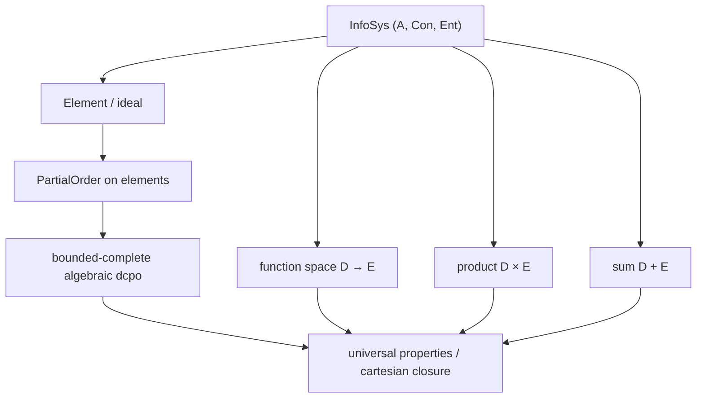

# Scott Information Systems in Lean 4

---

## Abstract

We develop, in **Lean 4** with **mathlib**, a formalization of Dana Scott's *information
systems* and the Scott domains they determine. Information systems present domains
discretely and combinatorially — as a type of *tokens* together with a consistency
predicate on finite token sets and an entailment relation — sidestepping much of the
order-theoretic and topological overhead of building domains from the Scott topology and
directed-complete partial orders directly. We define information systems, construct the
poset of *elements* (ideals) ordered by inclusion, and (planned) show that this poset is
a bounded-complete algebraic dcpo — a Scott domain — together with the function-space,
product, and sum constructions and their universal properties. The development follows
Scott's *"Domains for Denotational Semantics"* (ICALP 1982) and the compact presentation
of information systems in Winskel's *The Formal Semantics of Programming Languages*
(Chapter 8).

---

## 1. Introduction

Domain theory underpins denotational semantics: it supplies the ordered structures on
which recursive definitions are interpreted as least fixed points. The classical route
builds domains as directed-complete partial orders (dcpos) carrying the Scott topology.
Elegant on paper, this route is heavy to mechanize: it asks a proof assistant to carry a
substantial amount of order theory and point-set topology before any domain is in hand.

Scott's *information systems* offer a lighter path. A domain is presented not by its
points but by a logic of *tokens*: finite, observable units of information, a notion of
which finite token sets are jointly *consistent*, and an *entailment* relation recording
when a token is forced by a finite set. The points of the domain — its *elements*, or
*ideals* — are then recovered as the consistent, entailment-closed sets of tokens,
ordered by inclusion. Because the data is finite and inductive, the constructions and
their proofs are largely set-theoretic and combinatorial, which suits a proof assistant
well.

This paper reports a Lean 4 formalization of this development.

### 1.1 Contribution

This paper:

1. Formalizes Scott information systems and their elements in Lean 4 / mathlib.
2. Establishes the partial order on elements (the Scott ordering).
3. (Planned) Proves the elements form a bounded-complete algebraic dcpo.
4. (Planned) Constructs the function space `D → E`, product `D × E`, and sum `D + E`,
   with their universal properties, entirely in the information-system presentation.

---

## 2. Information systems

An **information system** is a triple `(A, Con, Ent)`:

- `A` is a type of *tokens*;
- `Con` is a set of finite subsets of `A`, the *consistent* sets; and
- `Ent X a` ("`X` entails `a`") relates a finite set `X` to a token `a`.

subject to: consistency is downward closed; singletons are consistent; if `X` entails
`a` then `X ∪ {a}` is consistent; entailment is reflexive on members of a consistent
set; and entailment satisfies cut (transitivity). The Lean encoding is the structure
`InfoSys` in `Domain/InfoSys.lean`.

---

## 3. The domain of elements

An **element** (ideal) of an information system is a set of tokens that is consistent on
every finite subset and closed under entailment. Elements ordered by inclusion form a
poset — the Scott ordering — encoded as the `PartialOrder` instance on `InfoSys.Element`.

The plan for the remaining structure is the standard one:

---

## 4. Related work

- mathlib already provides `Order.OmegaCompletePartialOrder`, `Order.CompletePartialOrder`,
  and `Topology.Order.ScottTopology`; we relate the information-system domain to these.
- The information-system presentation is due to Dana Scott (ICALP 1982); the compact
  construction we follow is Winskel, Chapter 8.

---

## 5. Conclusion and further work

(To be written as the formalization proceeds.)

---

## References

- **[Sco82]** D. Scott. *Domains for Denotational Semantics*. ICALP 1982, LNCS 140.
- **[Win93]** G. Winskel. *The Formal Semantics of Programming Languages*. MIT Press,
  1993. (Chapter 8, *Information Systems*.)
- **[AJ94]** S. Abramsky and A. Jung. *Domain Theory*. In *Handbook of Logic in Computer
  Science*, Vol. 3, Oxford University Press, 1994.
- **[GHKLMS03]** G. Gierz, K. H. Hofmann, K. Keimel, J. D. Lawson, M. W. Mislove, D. S.
  Scott. *Continuous Lattices and Domains*. Cambridge University Press, 2003.
- **[AC98]** R. M. Amadio and P.-L. Curien. *Domains and Lambda-Calculi*. Cambridge
  University Press, 1998.
- **[Sco81]** D. Scott. *Lectures on a Mathematical Theory of Computation*. Technical
  Monograph PRG-19, Oxford University Computing Laboratory, 1981.
