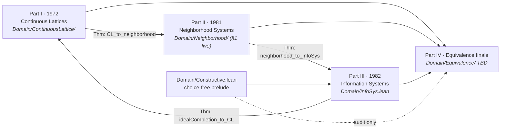
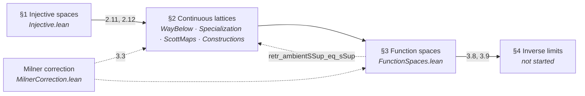
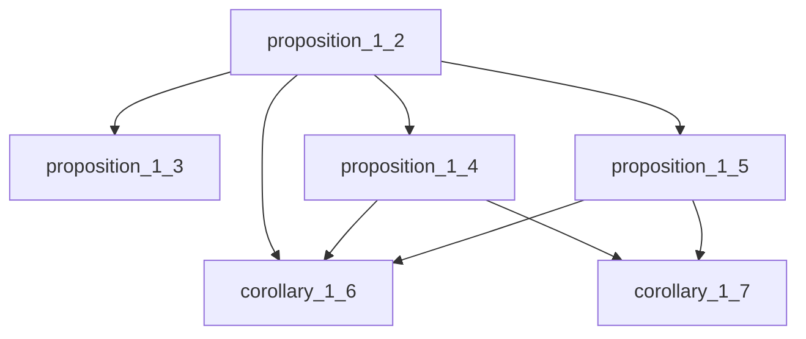
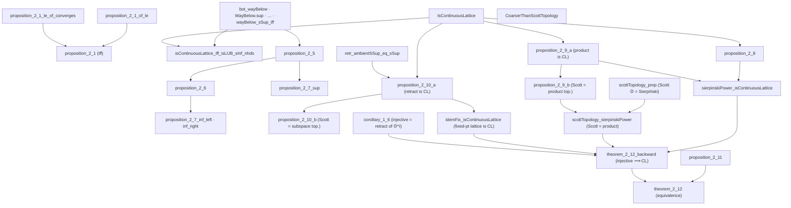
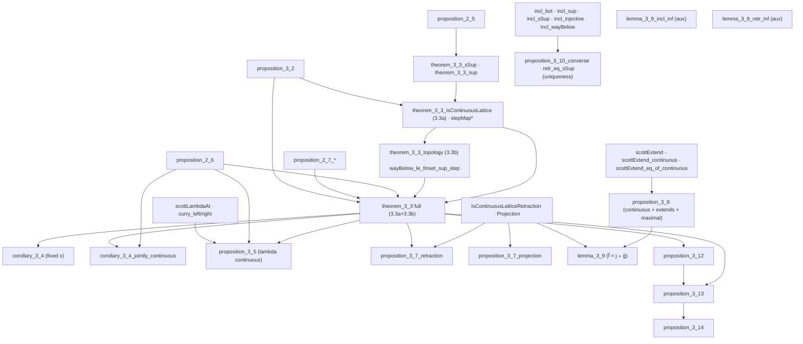
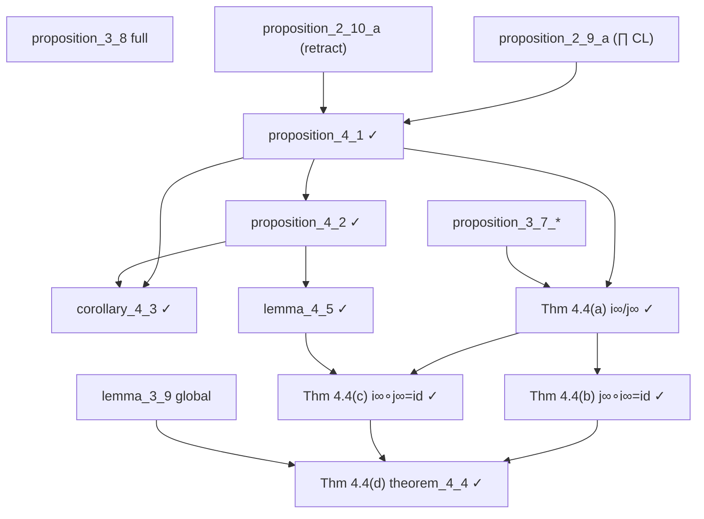
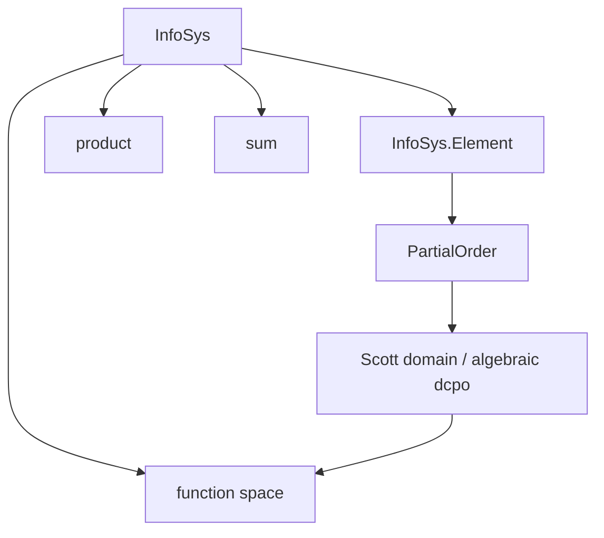
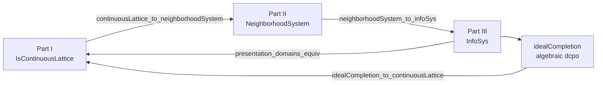

<!-- AUTO-GENERATED: run scripts/generate_arxiv_with_code.sh to refresh -->
# Scott's 3 Successively Less Topological, Simpler, and More Constructive Presentations of Domain Theory and Their Equivalence — full narrative + complete Lean source

*Generated 2026-06-21 from `arxiv.md` and all library `.lean` files in dependency order (`Domain.lean`).*

**Review copy.** The narrative body matches [`arxiv.md`](arxiv.md) (excluding the review pointer at the top). This file appends **Appendix A: Complete Lean source** with every line of the formalization inlined below.

---

## Document map

| Part | Contents |
| --- | --- |
| **§1–§N** | Full `arxiv.md` narrative |
| **Appendix A** | Complete Lean 4 source, one subsection per file |

### Appendix A — file index

- [`Domain.lean`](#domainlean) — 114 lines
- [`Domain/Constructive.lean`](#domainconstructivelean) — 92 lines
- [`Domain/ContinuousLattice/Injective.lean`](#domaincontinuouslatticeinjectivelean) — 125 lines
- [`Domain/ContinuousLattice/WayBelow.lean`](#domaincontinuouslatticewaybelowlean) — 229 lines
- [`Domain/ContinuousLattice/Specialization.lean`](#domaincontinuouslatticespecializationlean) — 125 lines
- [`Domain/ContinuousLattice/ScottMaps.lean`](#domaincontinuouslatticescottmapslean) — 204 lines
- [`Domain/ContinuousLattice/MilnerCorrection.lean`](#domaincontinuouslatticemilnercorrectionlean) — 56 lines
- [`Domain/ContinuousLattice/Constructions.lean`](#domaincontinuouslatticeconstructionslean) — 508 lines
- [`Domain/ContinuousLattice/FunctionSpaces.lean`](#domaincontinuouslatticefunctionspaceslean) — 1626 lines
- [`Domain/ContinuousLattice/Theorem212.lean`](#domaincontinuouslatticetheorem212lean) — 291 lines
- [`Domain/ContinuousLattice/InverseLimits.lean`](#domaincontinuouslatticeinverselimitslean) — 595 lines
- [`Domain/ContinuousLattice/FunctionSpaceTower.lean`](#domaincontinuouslatticefunctionspacetowerlean) — 632 lines
- [`Domain/Neighborhood/Basic.lean`](#domainneighborhoodbasiclean) — 449 lines
- [`Domain/Neighborhood/Example12.lean`](#domainneighborhoodexample12lean) — 288 lines
- [`Domain/Neighborhood/Example13.lean`](#domainneighborhoodexample13lean) — 309 lines
- [`Domain/Neighborhood/Example14.lean`](#domainneighborhoodexample14lean) — 856 lines
- [`Domain/Neighborhood/Example15.lean`](#domainneighborhoodexample15lean) — 62 lines
- [`Domain/Neighborhood/Exercise122.lean`](#domainneighborhoodexercise122lean) — 144 lines
- [`Domain/InfoSys.lean`](#domaininfosyslean) — 98 lines

**Total:** 19 files, 6803 lines of Lean.

---

# Narrative (from arxiv.md)


## Abstract

This is **one formalization monograph** in **Lean 4** with **mathlib**. It formalizes Scott's **three
presentations** of domain theory — each successively less topological, simpler, and more
constructive (1972 continuous lattices → 1981 neighborhood systems → 1982 information systems) —
**and proves their equivalence**. The work is organized in **four sequential parts** in this
monograph:

1. **Part I (Scott 1972)** — *Continuous Lattices* (LNM 274): injective `T₀`-spaces, Scott
  topology, way-below, function spaces, inverse limits.
2. **Part II (Scott 1981)** — PRG-19 *Lectures on a Mathematical Theory of Computation*:
  neighborhood systems (filters of neighborhoods on a master set Δ; domain elements as
   filters).
3. **Part III (Scott 1982)** — *Domains for Denotational Semantics* (ICALP): information
  systems (finite consistency + entailment on tokens).
4. **Part IV (Equivalence)** — the **finale** of this same paper: explicit Lean theorems
  relating the three presentations, showing they determine the same class of domains up to
   isomorphism, and showing that Scott 1982 (Part III) is constructive while 1972 and 1981
   (Parts I–II) are not — yet the presentations are still isomorphic.

The narrative thesis is that **required skill descends chronologically**: professional
point-set topology and lattice theory (1972) → filter-theoretic neighborhoods (1981) →
finite combinatorics (1982) → synthesis (Part IV). The formalization makes this objective
via mathlib dependency footprints and `#print axioms` audits.

**STATUS:** **Part I** is the active workstream: vision transcription through the March 1972 Milner
correction is complete; **94** numbered results / exercises are **Pass** (zero `sorry`s, zero
Stuck) — **all of Lecture I (Def 1.1 → Exercise 1.27)** and **all of Lecture II** (Def 2.1,
Prop 2.2, Examples 2.3–2.4, the category Theorem 2.5 / Prop 2.6, the isomorphism Theorem 2.7, and
Exercises 2.8–2.22) are now formalized. Lecture II completed this session: 2.13 (approximable =
continuous), 2.14 (`φ` of an iso), 2.15 (Sierpiński/opens), 2.18 (spacing map), 2.20 (powerset
domain), 2.21 (system `C`/juxtaposition), 2.22 (abstract representation theorem). **Lecture III (§3)
— products, sums, function spaces — has its full spine (Def 3.1 → Thm 3.13) formalized:** the
product `prodEquiv`, the function space `funSpaceEquiv` (Thm 3.10), the least map of Prop 3.9, the
cartesian-closed structure `eval`/`curry`/`curryEquiv` (Thm 3.11–3.12), and the pointwise
boundedness/sups of Thm 3.13(ii)(iii) (`sSupMaps`), all choice-free. **All §3 exercises (3.14–3.28)
are now formalized**, including the infinite iterate `𝒟^∞` (3.16), the retract `B ◁ T^∞` (3.17), the
function-space isos/mapping relationships (3.24), open sets as a domain (3.25), and the abstract
Ex 2.22 re-proof of the function-space domain (3.27).
**Parts II–III** are stubbed; **Part IV** lists planned
bridge theorems only. **Part III** is the **fully constructive** target
(`[propext, Quot.sound]` only); **Parts I–II** and the **1972 leg of Part IV** are
**classical** (see §1.2).

Complete Lean source is indexed in **Appendix A**; `scripts/generate_arxiv_with_code.py`
expands this narrative mechanically into `arxiv_with_code.md`.

---

## 1. Introduction

Domain theory supplies the ordered structures on which recursive definitions are interpreted
as least fixed points. Scott did not arrive at a single canonical presentation on first try.
Instead, over a decade, he moved from **topological continuous lattices** (1972) through
**neighborhood systems** (1981 lectures, PRG-19) to **information systems** (1982 ICALP) —
each time lowering the topological overhead and making the data more finitary.

This document is the **master narrative for that single monograph**. We do **not** treat
the four parts as independent publications. Parts I–III follow Scott's historical sources;
**Part IV** is not a fourth source text but the **equivalence finale** — specific bridge
theorems (§2.2) showing the three presentations coincide. Part I's internal §1–§4
dependency structure (injective spaces → continuous lattices → function spaces → inverse
limits) is spelled out in §3.

**Why this formalization is hard: Scott's topological lineage.** A working hypothesis of this
project is that the chief obstacle to mechanizing Scott's notes is not Lean but *prerequisite
mathematical culture*. Scott's lecture notes — especially the 1972 *Continuous Lattices* — read
with a level of topological maturity that leaves most modern computer scientists dizzy, because
Scott did **not** treat topology as a standalone tool grafted onto computation. He treated it as a
natural extension of logic and algebra. The typical computer-science reader has never been trained
in point-set topology *as a pure discipline in its own right*, and so meets these notes missing the
very reflexes they silently assume. The striking fact — and the key to the difficulty — is that
Scott himself had **no formal, conventional graduate training in topology either**. His deep
topological expertise developed *organically* out of his foundational training in mathematical
logic, algebra, and set theory: first as an undergraduate under **Alfred Tarski** at UC Berkeley
(1950–1954), then during his doctoral studies at Princeton [Plo20], [Sco22]. Rather than approaching
topology as a geometric discipline, he came to it sideways, recognizing the deep structural bridges
between order theory, non-classical logic, and mathematical space.

One piece of explicitly topological schooling did anchor this: as a Berkeley undergraduate Scott
studied general topology directly under **John L. Kelley**, who during exactly those years was
drafting his field-defining textbook *General Topology* (1955) [Kel55]. Kelley's rigorous,
comprehensive framework standardized point-set topology, and in particular popularized the use of
**filters and nets** (rather than sequences) to describe convergence in arbitrary spaces, taking a
foundation-up, non-metric view entirely comfortable with **non-Hausdorff** spaces. Both fingerprints
are all over domain theory: Scott's domains are presented through filters of neighborhoods, and their
natural topology is **`T₀` but not `T₁`/`T₂`** — asymmetric, with "points" standing for *states of
information* rather than geometric locations. These are precisely the `T₀`/`T₁` separation axioms
required by computer-science domains, and precisely the corner of topology that mainstream curricula,
fixated on Hausdorff spaces and open balls, skip entirely.

The deeper, organizing influence was **Tarski**, whose graduate courses Scott took as an
undergraduate and who introduced him to **lattice theory, Boolean algebras, and the Tarski
Fixed-Point Theorem**. Tarski assigned Scott to study Marshall Stone's seminal paper representing
Boolean algebras as topological spaces [Sto36], seeding a lifelong interest in the interplay of
algebra and topology [Man18]. Compounded by the algebraic formulation of **intuitionistic and modal
logics** — which model truth values by the open sets of a topological space rather than by classical
binary `{true, false}` — this produced the governing slogan of Scott's career: every Boolean algebra
*is* the space of its ultrafilters, intuitionistic logic *is* the lattice of opens, and therefore
**Topology = Posets + Logic**. This is the lens the present formalization must keep in focus. Where
the typical computer scientist imagines topology as geometry (metrics, balls, distance), Scott means
the **specialization order**: the open sets *are* the observable properties, and the order of
information *is* the topology. Concretely, the Lean work below lives or dies on translating fluently
between the `TopologicalSpace` and `PartialOrder` typeclasses via the **Scott topology**, and
mathlib's `Topology.Order` hierarchy (specialization order, sober spaces, the filter machinery
descended from exactly Kelley's approach) is the principal bridge we lean on.

This lineage is not antiquarian decoration: the same lens generated the very structures we are
formalizing. The **Scott topology** inverts standard point-set practice, acting on posets/domains
where a set is *Scott-open* exactly when it names a property verifiable from a finite approximation;
**domain theory** recasts computation through continuous functions on such spaces and so furnished
the first rigorous model of the untyped λ-calculus; and the **pointless-topology** thread —
*Continuous Lattices* proving that injective `T₀` spaces are equivalent to continuous lattices
[Sco72], [GHKLMS03], together with Scott's continuing advocacy of "Geometry Without Points" [Sco23]
— is exactly the order-theoretic distillation of topology that the later presentations exploit. It is
also the explanation for *why* the 1972 layer demands classical, topology-heavy machinery while the
later 1981/1982 layers can be made progressively more elementary and constructive — the arc this
monograph sets out to make precise.

**A conjecture about the descent (1972 → 1981 → 1982).** This lineage suggests a reading of *why*
Scott reformulated the same theory three times that is more sociological than mathematical. The
standard story treats the descent as Scott gradually finding "better" foundations. We offer a
complementary speculation: the simplification was at least partly **tactical, a problem of
adoption rather than of comfort**. Scott was entirely at home in the topology-sophisticated 1972
continuous-lattice formulation — that was, after all, his native dialect under Kelley and Tarski.
But to *sell* domain theory to the very audience that most needed it — topology-naive computer
science practitioners — he was arguably compelled to strip out the heavy general-topology
prerequisites and to recast the constructions in a form that leans far less on classical, point-set
machinery. The 1981 neighborhood systems replace the lattice-of-opens with concrete filters of
neighborhoods; the 1982 information systems go further, reducing the data to finite consistency and
entailment on tokens. Read this way, the trajectory is a deliberate lowering of the entry barrier:
each step trades topological sophistication for combinatorial transparency that a logician or
programmer can manipulate without a course in general topology.

A striking corollary, and one this formalization is positioned to make objective, is that the
descent is also a descent in **logical strength** — toward presentations that are *constructive* in
the technical sense of avoiding the law of the excluded middle (and, in Lean's terms, of not
invoking `Classical.choice`). The 1972 layer is unavoidably classical; the 1981 §1 core is already
choice-free for its foundational constructions; the 1982 information systems are fully constructive.
We do not claim Scott consciously pursued intuitionistic constructivity as a goal — only that
making the presentation palatable to topology-naive practitioners and making it constructive turn
out to be **the same move**, because the topological apparatus he was removing is exactly where the
non-constructive (excluded-middle, choice, maximal-filter) steps lived. The `#print axioms` audits
throughout this monograph (§1.2) are, in effect, an empirical test of that conjecture: they let us
measure, theorem by theorem, how much classical content each presentation actually requires.

### 1.1 Contribution (overall)

1. **Part I:** Scott 1972 continuous lattices — numbered-result inventory, Milner correction,
  and partial §3–§4 spine in `Domain/ContinuousLattice/`.
2. **Part II (live, §1 foundations):** PRG-19 neighborhood systems in `Domain/Neighborhood/` —
  Defs 1.1/1.6/1.7/1.8/1.9, Theorems 1.1c/1.10 (element-token system `𝒟 ≅ᴰ {[X]}`)/1.11
  (`⋂`/ascending-`⋃` closure), Examples 1.2–1.5/1.B, Factoids 1.1a–1.8b, Exercises 1.12–1.15, 1.22
  (topology on `|𝒟|`); **32 results**, foundational constructions audited choice-free
  (`[propext, Quot.sound]`); the infinite-system classification / maximality / non-isomorphism
  results (Ex 1.12/1.14/1.15) use `Classical.choice` (deciding boundedness/membership).
3. **Part III (planned):** 1982 information systems — choice-free core in `Domain/InfoSys.lean`
  and `Domain/Constructive.lean`.
4. **Part IV (planned):** functors and isomorphisms tying Parts I–III; constructive certification
  for the 1982 route; documented classical frontier for the 1972 route.

### 1.2 Constructivity discipline


| Part                             | Target fragment         | Typical axioms beyond `propext`, `Quot.sound`                                                                                                       |
| -------------------------------- | ----------------------- | --------------------------------------------------------------------------------------------------------------------------------------------------- |
| **Part I (1972)**                | Classical / topological | `Classical.choice`; mathlib Scott topology, embeddings, Zorn where used                                                                             |
| **Part II (1981)**               | **§1 core constructive** | `[propext, Quot.sound]` for the §1 foundations (filters, principal filters, the `\|𝒟\|` topology); `Classical.choice` confined to total/maximal elements (Exercise 1.24) |
| **Part III (1982)**              | **Fully constructive**  | **None** — audited choice-free `Finset` via `funion` (`Domain/Constructive.lean`)                                                                   |
| **Part IV (equivalence finale)** | Mixed                   | Constructive on the 1981↔1982 and 1982↔ideal-completion legs; **classical frontier** on any 1972↔1982 bridge using compact-open / basis-of-compacts |


Part III is the **certified constructive core**. Parts I and II are allowed classical
machinery; **Part IV** must **say explicitly** where classical steps enter when relating
back to 1972.

---

## 2. Four-part blueprint (one monograph)

### 2.1 Historical order and module map




The four parts are **not** independent silos within this monograph. Reading order is
**I → II → III**, then **Part IV** closes the arc. Part III also feeds back to Part I via
ideal completion (algebraic / consistently complete presentation of the same domains).

### 2.2 Planned equivalence theorems (Part IV finale)

These are the **bridge theorems for Part IV** (Lean names provisional):


| Theorem (planned)                         | Direction                      | Depends on                                 | Status                           |
| ----------------------------------------- | ------------------------------ | ------------------------------------------ | -------------------------------- |
| `continuousLattice_to_neighborhoodSystem` | 1972 → 1981                    | Part I **2.11**, **2.12**; Δ as master set | **Not Yet**                      |
| `neighborhoodSystem_to_infoSys`           | 1981 → 1982                    | Part II domain-as-filter; finite basis     | **Not Yet**                      |
| `infoSys_to_idealCompletion`              | 1982 → algebraic dcpo          | Part III `InfoSys.Element`                 | **Not Yet**                      |
| `idealCompletion_to_continuousLattice`    | algebraic CL → 1972            | compact elements, Scott open sets          | **Not Yet** (classical frontier) |
| `presentation_domains_equiv`              | I ↔ II ↔ III                   | all above                                  | **Not Yet**                      |
| `infoSys_constructions_equiv`             | products, sums, function space | Part I **3.3**, Part III constructions     | **Not Yet**                      |


Scott himself notes (1982) that neighborhood systems and information systems are equivalent
in a precise sense; **Part IV** of this monograph makes that equivalence **checkable in Lean**.

### 2.3 Gates between parts


| Gate                    | Requirement                                                          |
| ----------------------- | -------------------------------------------------------------------- |
| **Part I → Part II**    | **Pass** on **2.8–2.11** and **3.3** (full, no Milner hypothesis needed) |
| **Part II → Part III**  | Part II domain definition + approximable maps (PRG-19 core)          |
| **Part III standalone** | Prop 2.3 (1982), Scott domain = consistently complete algebraic dcpo |
| **Part IV finale**      | All three presentations formalized + functorial constructions        |


---

## 3. Part I — Scott 1972 *Continuous Lattices*

**Source:** Scott, *Continuous Lattices*, LNM 274 (1972); vision transcription in
`[sources/ScottContinLatt1972_vision.md](sources/ScottContinLatt1972_vision.md)` through the
**March 1972 Milner correction** (pp. 135–136).

**Constructivity:** **Classical.** Uses mathlib topology, `Classical.choice` transitively,
embedding into Sierpiński powers, and order-theoretic arguments not audited for constructivity.

**Lean root:** `Domain/ContinuousLattice/` (imported from `Domain.lean` before `InfoSys`).

Scott's four section titles within Part I:


| §   | Title                   | Lean modules                                                                                            |
| --- | ----------------------- | ------------------------------------------------------------------------------------------------------- |
| §1  | **Injective spaces**    | `Injective.lean`                                                                                        |
| §2  | **Continuous lattices** | `WayBelow.lean`, `Specialization.lean`, `ScottMaps.lean`, `Constructions.lean`, `MilnerCorrection.lean` |
| §3  | **Function spaces**     | `FunctionSpaces.lean`                                                                                   |
| §4  | **Inverse limits**      | `InverseLimits.lean` (4.1, 4.2 done)                                                                    |


### 3.1 Report card (43 tracked results)

**Pass** = full numbered statement proved, sorry-free. **Stuck** = partial. **Not Yet** = no
full deliverable. Score: **43 Pass · 0 Stuck · 0 Not Yet**.

Theorem 4.4 is split into four subgoals **(a)–(d)** so each can be tackled in its own session.
Session prompt: `HANDOFF-Theorem-4.4.md`.

**Supporting keystones (not separately numbered by Scott):** `directedOn_wayBelow`,
`wayBelow_interpolate` (interpolation property of `≪`, **axiom-free**), `exists_wayBelow_subset`
(the `↟a` basis of the Scott topology) in `WayBelow.lean`; these underpin 2.11.


| §   | Scott     | Lean name(s)                                                                                                                     | Module                | Status      | Notes                                |
| --- | --------- | -------------------------------------------------------------------------------------------------------------------------------- | --------------------- | ----------- | ------------------------------------ |
| 1   | Prop 1.2  | `proposition_1_2`                                                                                                                | `Injective.lean`      | **Pass**    |                                      |
| 1   | Prop 1.3  | `proposition_1_3`                                                                                                                | `Injective.lean`      | **Pass**    |                                      |
| 1   | Prop 1.4  | `proposition_1_4`                                                                                                                | `Injective.lean`      | **Pass**    |                                      |
| 1   | Prop 1.5  | `proposition_1_5`                                                                                                                | `Injective.lean`      | **Pass**    |                                      |
| 1   | Cor 1.6   | `corollary_1_6`                                                                                                                  | `Injective.lean`      | **Pass**    |                                      |
| 1   | Cor 1.7   | `corollary_1_7`                                                                                                                  | `Injective.lean`      | **Pass**    |                                      |
| 2   | Prop 2.1  | `proposition_2_1`                                                                                                                | `Specialization.lean` | **Pass**    | iff; `_of_le` + `_le_of_converges`   |
| 2   | Prop 2.2  | `bot_wayBelow`, `WayBelow.sup`, `WayBelow.trans_le`, `WayBelow.le_trans`, `wayBelow_self_iff_scottOpen_Ici`, `wayBelow_sSup_iff` | `WayBelow.lean`       | **Pass**    | seven clauses                        |
| 2   | Prop 2.4  | `isContinuousLattice_iff_isLUB_sInf_nhds`                                                                                        | `WayBelow.lean`       | **Pass**    |                                      |
| 2   | Prop 2.5  | `proposition_2_5`                                                                                                                | `ScottMaps.lean`      | **Pass**    |                                      |
| 2   | Prop 2.6  | `proposition_2_6`                                                                                                                | `ScottMaps.lean`      | **Pass**    | joint ↔ separate continuity          |
| 2   | Prop 2.8  | `proposition_2_8`                                                                                                                 | `Constructions.lean`  | **Pass**    | finite lattices                      |
| 2   | Prop 2.9(a) | `proposition_2_9_a`                                                                                                              | `Constructions.lean`  | **Pass**    | product of CLs is a CL (order content) |
| 2   | Prop 2.9(b) | `proposition_2_9_b` (and bundled `proposition_2_9`)                                                                            | `Constructions.lean`  | **Pass**    | Scott top. of product = product of Scott tops. |
| 2   | Prop 2.10(a) | `proposition_2_10_a`                                                                                                          | `FunctionSpaces.lean` | **Pass**    | retract of CL is a CL (order content) |
| 2   | Prop 2.10(b) | `proposition_2_10_b` (and bundled `proposition_2_10`)                                                                        | `FunctionSpaces.lean` | **Pass**    | Scott top. of retract = subspace top. (Milner) |
| 2   | Prop 2.11 | `proposition_2_11`                                                                                                                | `Constructions.lean`  | **Pass**    | CL injective (`scottExtend`)         |
| 2   | Thm 2.12  | `theorem_2_12`, `theorem_2_12_backward`, `theorem_2_12_forward`                                                                  | `Theorem212.lean`     | **Pass**    | full equivalence: `T₀`-space injective ⟺ homeomorphic to a CL under its Scott topology |
| 3   | Prop 3.2  | `proposition_3_2`                                                                                                                | `FunctionSpaces.lean` | **Pass**    |                                      |
| 3   | Thm 3.3(a) | `theorem_3_3_isContinuousLattice` (+ `ScottMap.instCompleteLattice`, `stepMap`, `stepMap_wayBelow`, `stepMap_pointwise_sSup`) | `FunctionSpaces.lean` | **Pass**    | `[D→D']` is a CL (order content) via step functions |
| 3   | Thm 3.3(b) | `theorem_3_3_topology` (+ `theorem_3_3`, `wayBelow_le_finset_sup_step`, `pointwiseSubbasic_scottOpen`)                          | `FunctionSpaces.lean` | **Pass**    | lattice top. = pointwise-convergence top. (topology content) |
| 3   | Cor 3.4   | `corollary_3_4_jointly_continuous`, `corollary_3_4_preservesDirectedSup` (+ `corollary_3_4` fixed-`x`)                            | `FunctionSpaces.lean` | **Pass**    | joint continuity of `eval` via Prop 2.6 |
| 3   | Prop 3.5  | `proposition_3_5`, `scottLambda` (+ `curry_left/right_preservesDirectedSup`, `lambda_outer_preservesDirectedSup`)                | `FunctionSpaces.lean` | **Pass**    | `lambda : [[D×D']→D''] → [D→[D'→D'']]` continuous |
| 3   | Prop 3.7  | `proposition_3_7_retraction`, `proposition_3_7_projection`                                                                       | `FunctionSpaces.lean` | **Pass**    |                                      |
| 3   | Prop 3.8  | `proposition_3_8`, `scottExtend_maximal`, `continuous_eq_sSup_openInfs`                                                          | `Constructions.lean`  | **Pass**    | continuous + extends + maximal       |
| 3   | Lemma 3.9 | `lemma_3_9` (global eq `f̄ = j ∘ ḡ`), `scottExtend_maximal_le`                                                                    | `Theorem212.lean`     | **Pass**    | global eq via 3.8 maximality (both)  |
| 3   | Prop 3.10 | `incl_sSup`/`incl_injective`/`incl_wayBelow` (fwd), `proposition_3_10_converse`, `retr_eq_sSup` (uniq)                           | `FunctionSpaces.lean` | **Pass**    | (i)–(iii) + converse (iv) + uniq     |
| 3   | Prop 3.12 | `proposition_3_12`, `IsProjection`, `isProjection_sSup`, `Projections.instCompleteLattice`                                       | `FunctionSpaces.lean` | **Pass**    | `J_D` is a `⊔`-closed complete latt. |
| 3   | Prop 3.13 | `proposition_3_13`, `Proposition313.projection` (`con`/`min`)                                                                    | `FunctionSpaces.lean` | **Pass**    | `D` is a projection of `[D → D]`     |
| 3   | Prop 3.14 | `proposition_3_14`, `Proposition314.fixMap`, `fix_eq`/`fix_le`/`fix_unique`                                                      | `FunctionSpaces.lean` | **Pass**    | continuous least-fixed-point op.     |
| 4   | Prop 4.1  | `proposition_4_1`, `InverseLimit`, `inverseLimitRetraction`                                                                      | `InverseLimits.lean`  | **Pass**    | `D∞` is a continuous lattice         |
| 4   | Prop 4.2  | `proposition_4_2`, `embInf`/`projInf`, `iComp`, `embInf_succ`, `inverseLimit_eq_iSup`                                            | `InverseLimits.lean`  | **Pass**    | `j_{∞n}` are projections; `i_{n∞}`, recursion, monotone lub |
| 4   | Cor 4.3   | `corollary_4_3` (∃! mediating map), `coconeInf` (`f∞`), `coconeInf_comp_embInf`                                                  | `InverseLimits.lean`  | **Pass**    | `D∞` is also the *direct* limit      |
| 4   | Lemma 4.5 | `lemma_4_5`, `idInf_eq_iSup` (remark after 4.2)                                                                                  | `InverseLimits.lean`  | **Pass**    | recognize projections from limits    |
| 4   | Thm 4.4(a) | `embInfInf` / `projInfInf` (+ `iInfTerm`/`jInfTerm`, `*_apply`, `*_preservesDirectedSup`)                                       | `FunctionSpaceTower.lean` | **Pass**    | `i∞`/`j∞` as `ScottMap`s (sups of Scott maps) |
| 4   | Thm 4.4(b) | `projInfInf_comp_embInfInf`                                                                                                     | `FunctionSpaceTower.lean` | **Pass**    | `j∞ ∘ i∞ = id` on `D∞`                    |
| 4   | Thm 4.4(c) | `embInfInf_comp_projInfInf`                                                                                                     | `FunctionSpaceTower.lean` | **Pass**    | `i∞ ∘ j∞ = id` on `[D∞→D∞]` (`lemma_4_5`) |
| 4   | Thm 4.4(d) | `theorem_4_4`, `theorem_4_4_orderIso`                                                                                           | `FunctionSpaceTower.lean` | **Pass**    | capstone `D∞ ≅ [D∞ → D∞]`                 |


**Milner infrastructure:** `CoarserThanScottTopology`, `scottOpen_of_coarserThanScott`,
`scottLowerSubbasisSet`, `scottPrincipalUpSet` in `MilnerCorrection.lean`.

**Notation:** `⊔S′` = ambient join in `D′` (`ambientSSup`); `⊔S` = subspace join;
`j(⊔S′) = ⊔S` = `retr_ambientSSup_eq_sSup`.

### 3.2 Part I internal dependency (Scott §1–§4 are not independent)




### 3.3 §1 Injective spaces — inclusion hierarchy

All six results **Pass**.




### 3.4 §2 Continuous lattices — inclusion hierarchy




### 3.5 §3 Function spaces — inclusion hierarchy




### 3.6 §4 Inverse limits — inclusion hierarchy

**4.1**, **4.2**, **4.3**, **4.5**, and **4.4(a)–(d)** are now **Pass** (see proof notes); Scott §4
is complete.




### 3.7 Selected proof notes

#### Proposition 2.6 (joint ↔ separate continuity) — `proposition_2_6`

Scott's statement: *a function of several variables between complete lattices is continuous
jointly iff it is continuous in each variable separately.* We formalize the two-variable case
`f : D × D' → D''`, with continuity phrased as `PreservesDirectedSup` (justified by Prop 2.5),
and the product `D × D'` carrying the componentwise complete-lattice structure (whose induced
topology is the product topology). The proof follows Scott's directed-net argument:

- **Joint ⟹ separate.** Precompose `f` with the slice map `x ↦ (x, y)`. The image of a directed
  `S ⊆ D` under this map is directed in `D × D'` with least upper bound `(⊔S, y)` (computed
  componentwise via `Prod.fst_sSup` / `Prod.snd_sSup`, using `S` nonempty for the constant second
  coordinate). Joint preservation of that supremum therefore yields preservation in the first
  variable; the second variable is symmetric.
- **Separate ⟹ joint** (the substance). For directed `S* ⊆ D × D'`, project to the directed sets
  `S = fst '' S*` and `S' = snd '' S*` (directedness via `DirectedOn.fst` / `DirectedOn.snd`), so
  that `⊔S* = (⊔S, ⊔S')`. Then:
  - `⊔(f '' S*) ≤ f(⊔S*)` is immediate from monotonicity of `f` (assembled from the separate
    monotonicities `hmono1`, `hmono2`).
  - `f(⊔S*) ≤ ⊔(f '' S*)`: unfolding separate continuity twice gives
    `f(⊔S*) = ⊔_{x∈S} ⊔_{y∈S'} f(x, y)`; for each pair `x ∈ S`, `y ∈ S'` there exist witnesses
    `(x, b), (a, y) ∈ S*`, and **directedness of `S*`** supplies `r ∈ S*` above both, so
    `(x, y) ≤ r` and `f(x, y) ≤ f(r) ≤ ⊔(f '' S*)` by monotonicity. This is exactly Scott's
    "monotonicity + directedness" step.

Sorry-free; `#print axioms` gives `[propext, Classical.choice, Quot.sound]` (the standard
classical footprint for Part I).

#### Proposition 2.8 (finite lattices are continuous) — `proposition_2_8`

Scott states this as a one-line example. The Lean proof isolates the genuinely finite step in a
reusable lemma `directedOn_finite_sSup_mem`: *a non-empty finite directed set attains its
supremum* (`⊔S ∈ S`). A maximal element `m ∈ S` exists by `Set.Finite.exists_maximal`; by
directedness any `s ∈ S` and `m` have an upper bound `c ∈ S`, and maximality forces `c ≤ m`, so
`s ≤ m`. Hence `m` is the greatest element, `IsLUB S m`, and `⊔S = m ∈ S`. With this, every
principal up-set `Set.Ici y` is Scott-open (a directed `S` with `y ≤ ⊔S` has `⊔S ∈ S`), so
`y ≪ y` via `wayBelow_self_iff_scottOpen_Ici`, and `y` is trivially the supremum of
`{x | x ≪ y}`. `[Finite D]` suffices (subsets are finite via `Set.toFinite`).

#### Proposition 2.9 (products of continuous lattices) — `proposition_2_9_a`, `proposition_2_9_b`

Scott's Proposition 2.9 is a **conjunction** of an order-theoretic and a topological claim, so we
split it: `proposition_2_9_a` (the product is a continuous lattice), `proposition_2_9_b` (the Scott
topology of the product equals the product of the Scott topologies), and the bundled
`proposition_2_9 := ⟨a, b⟩`.

**2.9(a) — order content (`proposition_2_9_a`).** A product `∀ i, Eᵢ` of continuous lattices is a
continuous lattice. The construction is the cylinder element: for `a ≪ yᵢ` in factor `Eᵢ`, let
`[a]ⁱ := Function.update ⊥ i a`. Then `[a]ⁱ ≪ y` in the product, witnessed by the preimage
`{z | zᵢ ∈ U}` of a Scott-open `U ⊆ Eᵢ` with `yᵢ ∈ U ⊆ Ici a`: this set is an upper set, and
inaccessible because suprema are coordinatewise (`sSup_apply_eq_sSup_image`), so a directed `S`
with `(⊔S)ᵢ ∈ U` already has some `f ∈ S` with `fᵢ ∈ U`. Given any upper bound `b` of
`{x | x ≪ y}`, each `[a]ⁱ ≤ b` gives `a = ([a]ⁱ)ᵢ ≤ bᵢ`; ranging over `a ≪ yᵢ` and using
continuity of `Eᵢ` (`(hE i).sSup_wayBelow`) yields `yᵢ ≤ bᵢ` for all `i`, i.e. `y ≤ b`.

**2.9(b) — topology agreement (`proposition_2_9_b`).** We prove the *full equality* of topologies
`scottTopologicalSpace = Pi.topologicalSpace (fun _ => scottTopologicalSpace)` by `le_antisymm`;
no Milner-style coarseness hypothesis is needed. Working with explicit topology terms (`Eᵢ` carries
no `TopologicalSpace` instance) keeps us clear of the `specializationPreorder` diamond, and the
mathlib order `t₁ ≤ t₂` unfolds *definitionally* to `∀ U, IsOpen[t₂] U → IsOpen[t₁] U`.
  - **Product ⊆ Scott** (`scott ≤ ⨅ᵢ induced (eval i)`): each projection preserves directed
    suprema (`sSup_apply_eq_sSup_image`), hence is Scott-continuous
    (`continuous_of_preservesDirectedSup`); `le_iInf` + `continuous_iff_le_induced` finish.
  - **Scott ⊆ Product**: for a Scott-open `U ∋ z` the `↟a` basis (`exists_wayBelow_Ici_subset`,
    the `Ici`-strengthening of `exists_wayBelow_subset`) gives `a ≪ z` with `↑a ⊆ U`. Three new
    structural lemmas about way-below in a product do the rest: `wayBelow_proj`
    (`a ≪ z ⟹ aᵢ ≪ zᵢ`, via the preimage under `v ↦ Function.update z i v`, Scott-open by
    `update_preservesDirectedSup`) and `wayBelow_finite_support` (`a ≪ z` has finite support: the
    truncations `Z F = (if · ∈ F then z· else ⊥)` are directed with sup `z`, so `a ≤ Z F` for some
    finite `F`). The finite box `⋂_{i∈F} eval i ⁻¹' Vᵢ` (with `Vᵢ ∋ zᵢ` Scott-open inside `Ici aᵢ`)
    is product-open (`isOpen_biInter_finset` of induced-opens, each `≥` the product topology by
    `iInf_le`) and lies in `↑a ⊆ U` (off `F`, `aⱼ = ⊥ ≤ wⱼ`; on `F`, `aᵢ ≤ wᵢ`).

`classical` supplies the `DecidableEq` for `Function.update`; footprint
`[propext, Classical.choice, Quot.sound]` for all of 2.9(a)/(b).

**Engineering notes / lessons from 2.9(b)** (this was the hardest single proof in Part I so far;
recording the dead-ends so the next session does not re-pay the cost):

- *Avoid `letI` for the factor/product topologies.* The tempting move is
  `letI : ∀ i, TopologicalSpace (Eᵢ) := fun _ => scottTopologicalSpace` so that mathlib's
  `Pi.topologicalSpace`, `continuous_apply`, `isOpen_biInter_finset`, … resolve by instance. But our
  imports make `specializationPreorder` an active instance, so a `TopologicalSpace (Eᵢ)` in scope
  introduces a **second `Preorder (Eᵢ)`** that fights the `CompleteLattice` one — the same diamond
  that broke `scottExtend_eq_of_continuous` earlier. Keeping every topology an **explicit term**
  (`@Pi.topologicalSpace …`, `@IsOpen _ scottTopologicalSpace …`) and never registering an instance
  is what makes the proof go through. The order reasoning (way-below, `sSup`, finite support) lives
  in *instance-free* lemmas (`wayBelow_proj`, `wayBelow_finite_support`) precisely so they never see
  a competing topology.
- *Use the definitional unfolding of the topology order.* `TopologicalSpace.le_def` shows
  `t₁ ≤ t₂` **is** `∀ U, IsOpen[t₂] U → IsOpen[t₁] U` (the partial order's `le` field), so `intro U hU`
  works directly on a `P ≤ S` goal and `iInf_le _ i _ hopen` turns an induced-open into a
  product-open with no `le_def` rewrite or `IsOpen.mono` lemma. This is the single most useful fact
  for product/Scott topology bridges.
- *Prefer `Set.Ici a ⊆ U` over `↟a ⊆ U`.* `exists_wayBelow_subset` actually proves the stronger
  `Set.Ici a ⊆ U` (the witness `a` lies in the upper-set `U`), so the new `exists_wayBelow_Ici_subset`
  lets the box-containment step ask only for `a ≤ w` instead of `a ≪ w`. This **eliminates the
  way-below `⟸` characterization** (componentwise-`≪` + finite-support ⟹ product-`≪`) entirely —
  a large, fiddly `Finset.sup`-of-cylinders argument we would otherwise have needed.
- *Finite support falls out of the truncations, not a separate axiom.* `a ≪ z` plus the directed
  family `Z F = (if · ∈ F then z· else ⊥)` (sup `z`) gives `a ≤ Z F` for some finite `F` via
  `wayBelow_sSup_iff`; then `aⱼ ≤ (Z F)ⱼ = ⊥` off `F`. No independent "way-below ⟹ finite support"
  theorem is required.
- *`@`-argument order is worth checking empirically.* `isOpen_biInter_finset` autobinds as
  `@isOpen_biInter_finset X α [inst] s f h` (space first, index second); `isOpen_induced_iff` needs
  the codomain topology, supplied painlessly by the named argument `(t := scottTopologicalSpace)`
  rather than a positional `@`. When in doubt, feed one wrong argument and read the "expected type"
  in the error to recover the true order.
- *Beta-reduce before `rw`.* `PreservesDirectedSup f` unfolds to `f (sSup T) = …` with `f` a literal
  lambda, so the goal is `(fun v => update z i v) (sSup T) j`; a `Function.update_self` rewrite only
  matches after a `show` (or `dsimp only`) forces the beta reduction to `Function.update z i (sSup T)`.

#### Proposition 2.10 (a retract of a CL is a CL) — `proposition_2_10_a`, `proposition_2_10_b`

Like 2.9, Scott's 2.10 bundles an order claim and a topology claim; we split it as
`proposition_2_10_a` / `proposition_2_10_b` with the bundled `proposition_2_10`. A *retract* is the
existing `IsContinuousLatticeRetraction D D'`: Scott maps `i : D → D'`, `j : D' → D` with
`j ∘ i = id`. We take `D'` continuous and conclude both halves for `D`.

The single engine is `retr_wayBelow_of_wayBelow_incl`: **`x' ≪ i(d)` in `D'` ⟹ `j(x') ≪ d` in
`D`**. Witness the `D`-way-below by `i⁻¹V'` for an ambient Scott-open witness `V'` of `x' ≪ i(d)`
(`i⁻¹V'` is Scott-open since `i` preserves directed sups, `scottOpen_preimage`); for `z ∈ i⁻¹V'`,
`x' ⊑ i(z)` gives `j(x') ⊑ j(i(z)) = z`. With `sSup_image_retr_wayBelow`
(`d = ⊔_D {j(x') : x' ≪ i(d)}`, from `j(⊔'S′) = ⊔S` + continuity of `D'`):
  - **2.10(a).** Any upper bound `b` of `{x | x ≪ d}` dominates every `j(x')`, hence the supremum
    `d`. (`IsLUB` is immediate.)
  - **2.10(b).** `scott = induced i scott'`. The easy `scott ≤ induced` is `scottOpen_preimage`
    again. The hard `induced ≤ scott` (Milner) shows the family `{i⁻¹(↟x') : x' ∈ D'}` is a
    **basis** of `D`'s Scott topology: given Scott-open `U ∋ d`, the directed family
    `{j(x') : x' ≪ i(d)}` (sup `d`) meets `U` at some `j(x')`, and `i⁻¹(↟x') ⊆ U` because
    `x' ≪ i(z) ⟹ j(x') ⊑ z` and `U` is upper. Each `i⁻¹(↟x')` is induced-open by construction, so
    every Scott-open is a union of induced-opens, i.e. induced-open.

**Engineering notes / lessons from 2.10:**

- *No projection, no Milner hypothesis needed.* Scott proves 2.10 for general retractions and only
  needs *projections* later (for the function-space 3.7/3.9). The whole proof goes through with the
  bare `IsContinuousLatticeRetraction` (Scott maps + `j ∘ i = id`); `incl_retr_le` is never used.
  And, as with 2.9(b), the topology agreement is a genuine equality — `CoarserThanScottTopology`
  does not appear. The Milner subtlety ("lubs in the subspace are *larger*, so a relativised open
  need not be lattice-open") is dissolved by the retraction: `j(⊔S′) = ⊔S` realigns the inequality.
- *Reuse the abstract structure instead of building a `CompleteLattice` on a subtype.* The tempting
  faithful reading — fixed points `{x // j x = x}` of an idempotent Scott map, with transported
  joins `sSup_K S = j(⊔' i''S)` — forces a hand-built `CompleteLattice` instance (every axiom, then
  continuity, then topology) and is several hundred lines. Phrasing the retract as *its own* lattice
  `D` with Scott maps to/from `D'` captures exactly the same content (`i` preserving directed sups
  **is** the statement that `D`-joins are `j` of ambient joins) at a fraction of the cost.
- *`isOpen_induced_iff` needs the codomain topology pinned.* `Eᵢ`/`D'` carry no `TopologicalSpace`
  instance, so `rw [isOpen_induced_iff]` fails instance synthesis; supply `(t := scottTopologicalSpace)`
  (same trick as 2.9(b)).
- *`scottOpen_preimage` is the workhorse.* "Preimage of a Scott-open under a Scott map is Scott-open"
  appears three times here (the way-below witness, and both topology inclusions). Packaging
  `incl_preservesDirectedSup : PreservesDirectedSup ⇑i` once keeps the call sites clean.

This unblocks the **backward half of Theorem 2.12** (injective ⟹ CL) at the *retract* level; the
embedding of an injective space into a power of `𝕆` (1.6) supplies the rest, and 2.12 is now
**complete** (see the Theorem 2.12 note below).

#### Keystones for 2.11: interpolation and the `↟a` basis — `WayBelow.lean`

Two standard facts about `≪` that mathlib does not provide and that the capstone needs:

- **Interpolation** (`wayBelow_interpolate`): in a continuous lattice `a ≪ c ⟹ ∃ b, a ≪ b ≪ c`.
  The set `M = {m | ∃ x, m ≪ x ∧ x ≪ c}` is directed (apply directedness of `{· ≪ x}` twice)
  with `⊔M = c` (continuity twice); then `a ≪ c = ⊔M` forces `a ≪ m ≤ x ≪ c` for some
  `m ≪ x ≪ c`, so `b := x`. Notably this is **axiom-free** (`#print axioms` reports none).
- **`↟a` basis** (`exists_wayBelow_subset`): every Scott-open `U ∋ z` contains a basic
  neighbourhood `↟a = {w | a ≪ w}` with `a ≪ z`. Since `z = ⊔{a | a ≪ z}` is a directed sup in
  the open `U`, inaccessibility yields `a ≪ z` with `a ∈ U`, and `↟a ⊆ ↑a ⊆ U`.

#### Proposition 2.11 (continuous lattices are injective) — `proposition_2_11`

The substantial half of Theorem 2.12. The witness is an explicit operator
`scottExtend e f y = ⊔ { ⊓ f''(e⁻¹V) : V an open nbhd of y }` (a standalone `def`, purely
order-theoretic). Two lemmas about it:

- **Extends `f`** (`scottExtend_eq_of_continuous`). The `≤` bound is immediate (`f x₀` is one of
  the values met). For `≥`, continuity of the lattice is essential: for each `a ≪ f x₀`, the
  Scott-open `↟a` pulls back along the continuous `f`, and the **embedding** turns that into an
  open `V ⊆ Y` with `e⁻¹V = f⁻¹(↟a)`; on `e⁻¹V`, `f ≥ a`, so `a ≤ ⊓ f''(e⁻¹V) ≤ g(e x₀)`. Summing
  over `a ≪ f x₀` (continuity) gives `f x₀ ≤ g(e x₀)`.
- **Continuous** (`scottExtend_continuous`). Uses the `↟a` basis: for Scott-open `U` and `g y₀ ∈ U`
  pick `a ≪ g y₀` with `↟a ⊆ U`; as `g y₀` is a directed sup, `a ≪ ⊓ f''(e⁻¹V)` for some open
  `V ∋ y₀`, and that value is `≤ g y'` for all `y' ∈ V`, so `V ⊆ g⁻¹U`.

A Lean-specific wrinkle: `E` carries no global `TopologicalSpace` instance (its topology is
`scottTopologicalSpace`), so lemmas like `IsOpen.preimage` that *synthesize* `[TopologicalSpace E]`
fail. The order-heavy `scottExtend_eq_of_continuous` uses `continuous_def` (whose topology
arguments are ordinary implicits, unified from the hypothesis) to avoid both the synthesis failure
and the specialization-order diamond a `letI` would introduce; the purely topological
`scottExtend_continuous` and `proposition_2_11` use `letI : TopologicalSpace E := scottTopologicalSpace`.
Footprint `[propext, Classical.choice, Quot.sound]`.

#### Theorem 2.12 (injective ⟺ continuous lattice) — `theorem_2_12`, `theorem_2_12_backward` (`Theorem212.lean`)

Both directions are now closed; `theorem_2_12` is the full biconditional:

> A `T₀`-space is injective **iff** it is homeomorphic to a continuous lattice under its Scott topology.

- **Forward** (CL ⟹ injective) is `theorem_2_12_forward` (= 2.11).
- **Backward** (injective ⟹ CL) is `theorem_2_12_backward`. The argument:
  1. By Corollary 1.6, an injective `T₀`-space `D` is a *retract* of a Sierpiński power
     `L = ι → 𝕆` (`𝕆 = Prop`): there are continuous `s : D → L`, `r : L → D` with `r ∘ s = id`.
  2. `L` is a continuous lattice (`sierpinskiPower_isContinuousLattice`, from 2.8 + 2.9a) whose
     Scott topology *is* its product topology (`scottTopology_sierpinskiPower`, from 2.9b plus
     `scottTopology_prop`: the Scott topology on `𝕆` is the Sierpiński topology).
  3. `e := s ∘ r` is therefore a **Scott-continuous idempotent** on `L`. Its fixed-point set
     `IdemFix e` carries the ambient-supremum-corrected complete-lattice structure
     (`IdemFix.completeLattice`), is a continuous lattice by Proposition 2.10
     (`idemFix_isContinuousLattice`), and `d ↦ s d` is a homeomorphism `D ≃ₜ IdemFix e`.

**Engineering notes / lessons from 2.12:**

- *Fixed points of a monotone idempotent are a complete lattice* for free via `completeLatticeOfSup`:
  take `sSup_K S = e (sSup_L (val '' S))` and `sInf` derived. No closure/kernel (`e ≤ id` or
  `e ≥ id`) hypothesis is needed — only monotone + idempotent — and Scott-continuity of `e` is what
  makes the inclusion/corestriction `ScottMap`s, so the retract machinery of 2.10 applies verbatim.
- *The subtype-topology trap.* `IdemFix e = {x : L // e x = x}` is reducibly a subtype of `L`, so it
  **auto-inherits the subspace `TopologicalSpace`**, which competes with the Scott topology coming
  from its (non-instance) `CompleteLattice`. This breaks `Continuous.comp`/`subtype_mk` (they
  synthesize the *subspace* instance, not Scott). The fix: build the homeomorphism against the
  canonical subspace topology (where those lemmas work), then transport across the propositional
  equality `scott = subspace` — itself `idemFix_scottTopology` (= `induced val scott_L`) composed
  with `scottTopology_sierpinskiPower` (`scott_L = product`), closing by `rfl`.
- *Statement shape.* Endowing an abstract injective space with a lattice is impossible literally, so
  the faithful statement is "homeomorphic to a continuous lattice under its Scott topology"; the
  reverse arrow transfers injectivity across the homeomorphism via `IsInjectiveSpace.of_retract`.
- Footprint `[propext, Classical.choice, Quot.sound]`.

#### Theorem 3.3(a) (`[D → D']` is a continuous lattice) — `theorem_3_3_isContinuousLattice` (`FunctionSpaces.lean`)

Scott's "pointwise" argument, in three movements.

1. **Complete lattice on `[D → D']`.** `ScottMap D D'` is a genuine `def` (a subtype of
   `D → D'`), so — unlike the `IdemFix` subtype trap of 2.12 — it carries *no* auto-synthesized
   order/topology to fight. We register `instPartialOrder` (pointwise `≤`), `instSupSet`
   (`sSupMaps F x = ⊔{g x | g ∈ F}`, which is itself a `ScottMap` because pointwise suprema of
   Scott maps preserve directed sups), prove `isLUB_sSup`, and close with
   `completeLatticeOfSup`. Crucially `sSup` here is *pointwise* (`sSup_apply` is `rfl`), matching
   Scott's observation that **arbitrary** (not just directed) joins are computed pointwise — while
   infima are *not* (derived as `⊔` of lower bounds by `completeLatticeOfSup`).
2. **Step functions.** `ē[e,e'](x) = e'` if `e ≪ x` else `⊥`, encoded as `⨆ _ : e ≪ x, e'`
   (`stepFun`) to dodge any `Decidable (e ≪ x)`. Scott-continuity of `stepFun` is exactly the
   Scott-openness of the way-above set `{x | e ≪ x}` (`scottOpen_wayBelow`, true in *any* complete
   lattice): inaccessibility of that open set supplies the member of a directed `S` realizing the
   value.
3. **Way-below + reconstruction.** `e' ≪ f e ⟹ ē[e,e'] ≪ f`, witnessed by the Scott-open
   `{g | e' ≪ g e}` (open because joins are pointwise, so inaccessibility reduces to
   `wayBelow_sSup_iff` in `D'`); this is the **topological** way-below of `WayBelow.lean`, so we
   never need an order-theoretic ≪-characterization. And `f x = ⊔{e' | ∃ e ≪ x, e' ≪ f e}`
   (`stepMap_pointwise_sSup`) follows from `x = ⊔{e ≪ x}` (continuity of `D`), `f` preserving that
   directed sup, and `f x = ⊔{w ≪ f x}` (continuity of `D'`) + `wayBelow_sSup_iff`. Continuity of
   `[D → D']` then drops out: any upper bound `g` of `{h ≪ f}` dominates every `ē[e,e'] ≪ f`, hence
   pointwise `e' ≤ g x`, hence `f x = ⊔{…} ≤ g x`.

**Engineering notes / lessons from 3.3(a):**

- *Register the lattice as a real instance.* Because `ScottMap` is a plain `def`, a global
  `CompleteLattice` instance is safe and makes `≪`, `ScottOpen`, and `IsContinuousLattice`
  typecheck on the function space with no `@`/`letI` gymnastics — the opposite experience to the
  `IdemFix` subtype.
- *`⨆ _ : p, a` is the clean "indicator".* It is `a` when `p` holds (`iSup_pos`) and `⊥` otherwise
  (`iSup_neg`), needs no `Decidable`, and commutes with the proofs cleanly.
- *Topological ≪ is an asset, not a burden here.* Proving `ē[e,e'] ≪ f` by exhibiting one
  Scott-open set is shorter than any directed-set argument; the lattice's pointwise `sSup` makes its
  inaccessibility immediate.
- Footprint `[propext, Classical.choice, Quot.sound]`.

#### Theorem 3.3(b) (lattice topology = pointwise-convergence topology) — `theorem_3_3_topology` (`FunctionSpaces.lean`)

The function space carries two topologies: the Scott topology of the continuous lattice
`[D → D']` (from `ScottMap.instCompleteLattice`) and the product/pointwise-convergence topology
`scottMapPointwiseTopology` generated by `{f | f x ∈ U}` (`U` Scott-open in `D'`). They are equal.

- **pointwise ⊆ Scott** (`le_generateFrom_iff_subset_isOpen`): each subbasic `{f | f x ∈ U}` is
  Scott-open in the lattice (`pointwiseSubbasic_scottOpen`). Inaccessibility is immediate because
  the lattice's `sSup` is *pointwise* (`ScottMap.sSup_apply`), reducing to inaccessibility of `U`
  in `D'`. (This is the half Scott notes is automatic on p. 136: lubs are pointwise, so **no Milner
  hypothesis is needed** — unlike 2.9–2.10.)
- **Scott ⊆ pointwise** is the substance, via the `↟φ`-basis of a continuous lattice
  (`exists_wayBelow_subset`, using 3.3(a)): given a Scott-open `U ∋ g`, pick `φ ≪ g` with
  `↟φ ⊆ U`. The key lemma `wayBelow_le_finset_sup_step` then shows `φ ≪ g` forces
  `φ ≤ ⊔ᵢ ē[eᵢ,eᵢ']` for **finitely many** pairs with `eᵢ' ≪ g eᵢ`: the finite joins of step
  functions below `g` form a *directed* family (`Finset.sup` over `F₁ ∪ F₂`) with supremum `g`
  (pointwise reconstruction again), so `wayBelow_sSup_iff` lands `φ` below one of them. The finite
  intersection `W = ⋂ᵢ {h | eᵢ' ≪ h eᵢ}` is then a pointwise-open (`isOpen_biInter_finset`)
  neighbourhood of `g` with `W ⊆ ↟φ ⊆ U`: any `h ∈ W` has every `ē[eᵢ,eᵢ'] ≪ h`
  (`stepMap_wayBelow`), hence `⊔ᵢ ē[eᵢ,eᵢ'] ≪ h` (`wayBelow_finset_sup`) and `φ ≪ h`.

**Engineering notes / lessons from 3.3(b):**

- *Finiteness enters exactly once.* The only place finiteness of the step-function decomposition is
  needed is to keep `W` a *finite* intersection (hence open). It is delivered by realizing `g` as a
  directed sup of `Finset.sup`s of step functions and invoking `wayBelow_sSup_iff` — the standard
  "compact basis" move, here done concretely with `Finset (D × D')`.
- *No ambient instance on `ScottMap`.* Since the two topologies are competing non-instances, the
  proof passes them explicitly (`@isOpen_iff_forall_mem_open`, `@isOpen_biInter_finset`); this is
  painless precisely because `ScottMap` carries no auto-synthesized `TopologicalSpace`.
- *Beware ascription into `sSup`.* `(sSup Sg : D → D')` makes Lean elaborate `sSup` at type
  `D → D'` (wrong `SupSet`); write `((sSup Sg : ScottMap D D') : D → D')` to keep the lattice join.
- This closes **3.3 in full** (`theorem_3_3`), with no Milner hypothesis, contrary to the earlier
  expectation recorded for 2.9–2.10.
- Footprint `[propext, Classical.choice, Quot.sound]`.

#### Corollary 3.4 (joint continuity of evaluation) — `corollary_3_4_jointly_continuous` (`FunctionSpaces.lean`)

`eval : [D → D'] × D → D'`, `(f, x) ↦ f x`, is jointly Scott-continuous. The proof is a clean
application of **Proposition 2.6** (joint ↔ separate Scott-continuity on a product lattice): reduce
`PreservesDirectedSup eval` to the two separate slots. In `x` (fixed `f`) it is exactly `f`'s own
Scott-continuity (`proposition_2_5` + `ScottMap.continuous`); in `f` (fixed `x`) it is the pointwise
formula for suprema in `[D → D']` (`ScottMap.sSup_apply`: `(⊔F) x = ⊔ {g x | g ∈ F}`). Then
`continuous_of_preservesDirectedSup` upgrades to topological continuity. Via Theorem 3.3(b) (and
2.9(b)) the Scott topology of the product lattice is the product of the pointwise topology on
`[D → D']` and the Scott topology on `D`, so this is joint continuity for Scott's product topology.
Footprint `[propext, Classical.choice, Quot.sound]`.

#### Proposition 3.5 (functional abstraction) — `proposition_3_5` (`FunctionSpaces.lean`)

`lambda : [[D × D'] → D''] → [D → [D' → D'']]`, `lambda f x y = f (x, y)`, is Scott-continuous —
note this *uses 3.3* twice, since the codomain `[D → [D' → D'']]` must itself be a continuous
lattice (hence a legitimate target). Two layers:

- *`lambda f` is a Scott map* (`lambda_outer_preservesDirectedSup`): equality in `[D' → D'']` is
  pointwise, so it reduces to **left**-currying `x ↦ f (x, y)` being Scott-continuous
  (`curry_left_preservesDirectedSup`, mirror of the existing right-currying), itself a one-line
  consequence of `f`'s joint continuity and `sSup {(x, y) | x ∈ S} = (⊔S, y)`.
- *`lambda` is a Scott map* (`proposition_3_5_preservesDirectedSup`): evaluating both sides
  pointwise at `(x, y)` and unfolding the (three nested!) pointwise `ScottMap.sSup_apply`, both
  collapse to `⊔ {f (x, y) | f ∈ 𝓕}`; `@[simp] scottLambda_apply` (definitional) closes the
  resulting image-set equality with a bare `congr 1`.

The pleasant outcome: once `[D → D']` is a genuine `CompleteLattice` instance with *pointwise*
`sSup` (`ScottMap.sSup_apply` is `rfl`), all of §3's continuity facts (3.4, 3.5) are short pointwise
computations. Footprint `[propext, Classical.choice, Quot.sound]`.

#### Proposition 3.8 (maximal extension along a subspace embedding) — `proposition_3_8` (`Constructions.lean`)

For `E` a continuous lattice and `e : X → Y` a subspace embedding, Scott's explicit formula
`scottExtend e f y = ⊔ { ⊓ f''(e⁻¹V) : V an open nbhd of y }` is *the maximal extension* of a
continuous `f : X → E` to `[Y → E]`. The full statement bundles three clauses:

- **Continuous** and **extends `f`**: reused verbatim from the 2.11 injectivity machinery
  (`scottExtend_continuous`, `scottExtend_eq_of_continuous`) — the *same* operator `scottExtend`
  serves both 2.11 and 3.8, so 3.8 is essentially 2.11 plus a maximality clause.
- **Maximal** (`scottExtend_maximal`): for any continuous solution `f'` of `f' ∘ e = f`, expand
  `f'` itself via `continuous_eq_sSup_openInfs` (the order-theoretic identity
  `f' y = ⊔ { ⊓ f''(U) : U open nbhd of y }`, proved by interpolating from below with
  `f' y = ⊔ {a ≪ f' y}` and openness of each `f'⁻¹(↟a)`). Restricting each meet from the open `U`
  to the embedded subspace `e(X) ∩ U` only *enlarges* the meet and lands it on a defining term of
  `scottExtend`, giving `f' y ≤ scottExtend e f y` — exactly Scott's two-line chain on p.116.

**Engineering notes / lessons from 3.8:** the partial `FunctionSpaces.scottSubspaceExtend` (renamed
`scottSubspaceExtend_maximal`) had ranged `U` over the *Scott* topology of `Y` (forcing a spurious
`CompleteLattice Y`), which is unfaithful to Scott (where `Y` is an arbitrary `T₀` space). The
faithful route was to retarget the whole proposition onto the already-continuous `scottExtend` from
2.11, which ranges `U` over `Y`'s *given* topology — turning "Stuck (one-sided bound)" into a
clean **Pass** that simply repackages existing lemmas. Footprint `[propext, Classical.choice,
Quot.sound]`.

#### Proposition 3.10 (characterization of projection inclusions) — `proposition_3_10_converse`, `retr_eq_sSup` (`FunctionSpaces.lean`)

A map `i : D → D'` between continuous lattices is the inclusion of a projection **iff** it
(i) preserves arbitrary suprema, (ii) is injective, and (iii) preserves `≪`. The **forward**
direction was already in place (`incl_sSup`, `incl_injective`, `incl_wayBelow`); this completes the
**converse** and the **uniqueness** of Scott's formula (iv) `j(x') = ⊔ { x | i(x) ⊑ x' }`.

- *Order-reflection from (i)+(ii)* (`le_of_incl_le`): condition (i) on the two-element set gives
  `i(x ⊔ y) = i x ⊔ i y` (`incl_sup_of_preservesSSup`); then `i x ⊑ i y ⟹ i(x⊔y)=i y ⟹ x⊔y=y`
  (injectivity) `⟹ x ⊑ y`. This is exactly Scott's "`x ⊑ y ⟺ x ⊔ y = y`" remark, and it makes `i`
  an order-embedding.
- *`j ∘ i = id`* (`converseRetr_incl`): order-reflection collapses `{x | i x ⊑ i y}` to `Iic y`,
  whose join is `y`.
- *`i ∘ j ⊑ id`* (`incl_converseRetr_le`): immediate from (i), since `i(⊔{x | i x ⊑ x'}) =
  ⊔{i x | i x ⊑ x'} ⊑ x'`.
- *`j` continuous* (`converseRetr_preservesDirectedSup`): the one place (iii) is needed. For a
  directed `S'` and `i x ⊑ ⊔S'`, interpolate `x = ⊔{z ≪ x}` (continuity of `D`); each `z ≪ x` gives
  `i z ≪ i x ⊑ ⊔S'`, so `i z ⊑ x'` for some `x' ∈ S'` (directed `wayBelow_sSup_iff`), whence
  `z ⊑ j x' ⊑ ⊔ j''S'`.
- *Uniqueness* (`retr_eq_sSup`): any projection's `j` satisfies `j x' = ⊔{x | i x ⊑ x'}` — `≤` since
  `i(j x') ⊑ x'` makes `j x'` a member; `≥` since each member `x` has `x = j(i x) ⊑ j x'`.

**Engineering notes / lessons from 3.10:** condition (i) is stated for *arbitrary* `S`, so it
trivially supplies `PreservesDirectedSup i` (whence `i` is a legitimate `ScottMap`) with a one-line
`fun _ _ _ => hi _` — no need to separately assume continuity of `i`. Set-membership in
`{x | i x ⊑ x'}` is *definitionally* the predicate, so `le_sSup`/`sSup_le` chains go through with
bare `.le` coercions and `show` re-statements rather than `Set.mem_setOf` rewrites. Footprint
`[propext, Classical.choice, Quot.sound]`.

#### Lemma 3.9 (extensions commute with a range projection) — `lemma_3_9` (`Theorem212.lean`)

With `e : X → Y` a subspace embedding and `i, j : D ⇄ D'` a projection on the *range*, if continuous
`f : X → D` and `g : X → D'` satisfy `f = j ∘ g`, then their maximal extensions (3.8) satisfy
`f̄ = j ∘ ḡ`. This is the key compatibility used to build inverse limits (§4: `f̄ₙ = jₙ ∘ f̄ₙ₊₁`).
The proof is a clean two-inequality sandwich, exactly Scott's:

- `j ∘ ḡ ⊑ f̄`: `j ∘ ḡ` is continuous and `(j ∘ ḡ) ∘ e = j ∘ g = f`, so the *equality* maximality of
  `f̄` (`scottExtend_maximal`) applies.
- `i ∘ f̄ ⊑ ḡ`: `(i ∘ f̄) ∘ e = i ∘ f = i ∘ j ∘ g ⊑ g` (using `i ∘ j ⊑ id`), so the *sub-solution*
  maximality `scottExtend_maximal_le` (the remark after 3.8, added here as the `≤`-analogue of
  `scottExtend_maximal` — identical proof, final `=` weakened to `≤`) applies.
- combine: `f̄ = j ∘ i ∘ f̄ ⊑ j ∘ ḡ ⊑ f̄` (apply monotone `j` to the second bound, and `j ∘ i = id`).

**Engineering notes / lessons from 3.9:** the lemma lives in `Theorem212.lean` because it is the
only module importing *both* `scottExtend` (Constructions) and `IsContinuousLatticeProjection`
(FunctionSpaces). The one real friction was composition continuity: the Scott topology is a bare
`def`, not an `instance`, so `Continuous.comp` cannot synthesize `TopologicalSpace D`. Registering it
with `letI` works, but **only if scoped inside the `have` for the composite** — registering it at
the top of the proof makes the lattice `≤` ambiguous (it gets re-resolved through the topology's
`specializationPreorder`), which silently breaks every later `le_antisymm`/`calc`. The older
inf-level partials `lemma_3_9_incl_inf`/`lemma_3_9_retr_inf` are now superseded auxiliaries.
Footprint `[propext, Classical.choice, Quot.sound]`.

#### Proposition 3.12 (the lattice of projections `J_D`) — `proposition_3_12` (`FunctionSpaces.lean`)

`J_D = { j ∈ [D → D] : j = j ∘ j ⊑ id }` (`IsProjection`) is a complete lattice realized as a
`⊔`-closed subspace of `[D → D]`. The whole proof reduces, via the pointwise characterization
`isProjection_iff` (idempotent **and** deflationary), to closure of `J_D` under arbitrary `sSup`
(`isProjection_sSup`); a `⊔`-closed subset of a complete lattice is a complete lattice
(`completeLatticeOfSup` on the subtype `Projections D`).

- *binary* (`isProjection_sup`): since `j x ⊔ k x ⊑ x`, monotonicity + idempotency pin
  `j (j x ⊔ k x) = j x` (and symmetrically for `k`), so `(j ⊔ k) ∘ (j ⊔ k) = j ⊔ k`. This is the one
  spot needing `sup_apply` — the new lemma that the `completeLatticeOfSup`-derived binary join of
  Scott maps is computed *pointwise* (`(f ⊔ g) x = f x ⊔ g x`, since `⊔ = sSup {·,·}` and `sSup` is
  pointwise).
- *directed* (`isProjection_directedSup`): continuity of each `k ∈ S` distributes
  `k ((⊔S) x) = ⊔ⱼ k (j x)` over the directed family `{ j x }`, and directedness + idempotency
  collapse the double sup `{ k (j x) }` back to `(⊔S) x`. (Continuity of `D` itself is *not* used —
  this works for any complete lattice `D`.)
- *arbitrary* (`isProjection_sSup`): reuse `finsetSupOf` (every `sSup` is the directed sup of finite
  sub-joins), with `isProjection_finsetSup` via `Finset.sup_induction` on `⊥`/binary.

**Engineering notes / lessons from 3.12:** the identity map is named `ScottMap.idMap`, **not** `id`,
to avoid shadowing `_root_.id` (which `finsetSupOf`'s `Finset.sup id` relies on). The `Projections D`
subtype must be an `abbrev` (not `def`) so the ambient `Subtype.partialOrder`/`SupSet` instances are
found by typeclass resolution — the same reducibility lesson as `IdemFix` in 2.12. Footprint
`[propext, Classical.choice, Quot.sound]`.

#### Proposition 3.13 (`D` is a projection of `[D → D]`) — `proposition_3_13` (`FunctionSpaces.lean`)

Scott's `con : D → [D → D]`, `con x = (const x)`, and `min : [D → D] → D`, `min f = f(⊥)`, form a
projection: `min (con x) = (const x)(⊥) = x` (so `min ∘ con = id`, `rfl`), and `con (min f) =
const (f ⊥) ⊑ f` pointwise because `f(⊥) ⊑ f(y)` by monotonicity (so `con ∘ min ⊑ id`). Both maps
are Scott-continuous: `con` because suprema in `[D → D]` are pointwise (`con (⊔S) = const (⊔S)` and
`⊔ⱼ const(j) = const(⊔S)`), and `min` because it is evaluation at `⊥`, which reads off the pointwise
supremum (`ScottMap.sSup_apply`). The result packages as a term of the existing
`IsContinuousLatticeProjection D [D → D]`, so it immediately feeds Proposition 3.10's machinery.
(Continuity of `D` is again unused; included only to match Scott's hypothesis.) Footprint
`[propext, Classical.choice, Quot.sound]`.

#### Proposition 3.14 (the fixed-point operator) — `proposition_3_14` (`FunctionSpaces.lean`)

`fix : [D → D] → D` is Scott's least-fixed-point combinator: `f (fix f) = fix f` and `f x ⊑ x ⟹
fix f ⊑ x`, and it is the *unique* operator with these two properties. The **order content** is
mathlib's `OrderHom.lfp` (`fix f := (⟨f, f.monotone⟩ : D →o D).lfp`), giving `fix_eq` (`map_lfp`),
`fix_le` (`lfp_le`), and `fix_unique` (least element of the fixed-point set is unique) for free.

The **continuity** of `fix` (Scott's actual claim) is the work. Scott argues via Kleene's
`fix f = ⊔ₙ fⁿ(⊥)` ("pointwise lub of continuous functions"); we give a **direct lattice proof
that avoids iteration entirely** (`fix_preservesDirectedSup`). For directed `S ⊆ [D → D]`, set
`g = ⊔S` and `a = ⊔{fix f : f ∈ S}`:

- `a ⊑ fix g` is just `fix`-monotonicity (`fix_mono`, itself a two-line `fix_le`).
- `fix g ⊑ a`: by `fix_le` it suffices that `a` is a pre-fixed point, `g a ⊑ a`. Pointwise sups give
  `g a = ⊔_{f∈S} f a`, and continuity of each `f` on the **directed** family `{fix f' : f' ∈ S}`
  gives `f a = ⊔_{f'∈S} f (fix f')`. For any `f, f' ∈ S` choose (directedness) `h ∈ S` above both:
  `f (fix f') ⊑ h (fix f') ⊑ h (fix h) = fix h ⊑ a`. Hence `g a ⊑ a`.

**Engineering notes / lessons from 3.14:** the direct argument is far shorter than building Kleene's
theorem and only needs three ingredients already in hand — `OrderHom.lfp` monotonicity facts,
`ScottMap.sSup_apply` (pointwise sups in `[D → D]`), and `preservesDirectedSup_coe`. Two small Lean
traps: (1) `sSup_le` leaves the bound element as an un-β-reduced `(fun f => ↑f (sSup T)) f`, so a
`show (f : D → D) (sSup T) ≤ sSup T` is needed before the `rw`; (2) in the uniqueness clause an
*unannotated* binder `∀ f, (f : D → D) …` makes the ascription **fix the binder type to `D → D`**
rather than coerce — the binders must be written `∀ f : ScottMap D D`. Continuity of `D` is unused
(works for any complete lattice). Footprint `[propext, Classical.choice, Quot.sound]`.

#### Proposition 4.1 (inverse limit of projections is a continuous lattice) — `proposition_4_1` (`InverseLimits.lean`)

`D∞ = { x : ∀n, Dₙ // ∀n, jₙ(xₙ₊₁) = xₙ }` for an ω-system of continuous lattices with projection
bonding maps `jₙ : D_{n+1} → Dₙ`. Scott proves continuity *topologically* (show `D∞` is an injective
`T₀`-space, then Theorem 2.12), using the maximal extension 3.8 and the compatibility 3.9. We realize
the **same retraction order-theoretically, with no topology**, which sidesteps a genuine soundness
trap (the subspace Scott topology on `D∞` need not equal its own Scott topology, so the inclusion is
not obviously a Scott embedding — the hypothesis 3.8/3.9 silently need).

The key observation: each projection is an **adjunction**. From `jₙ∘iₙ = id` and `iₙ∘jₙ ⊑ id` we get
`GaloisConnection iₙ jₙ` (`projection_galoisConnection`), so `jₙ` (the upper adjoint) preserves
arbitrary infima (`retr_sInf`). Hence:

- the compatibility predicate is closed under **pointwise `sInf`** (`compatible_sInf`), so `D∞` is a
  complete lattice by `completeLatticeOfInf`;
- the inclusion `D∞ ↪ ∏Dₙ` preserves infima, so it has a **left adjoint** `r : ∏Dₙ → D∞`,
  `r y = ⊓{ x ∈ D∞ : y ⊑ x }` (`invLimRetr`, `invLimRetr_galoisConnection`); a left adjoint preserves
  *all* suprema (`GaloisConnection.l_sSup`), in particular directed ones, so `r` is Scott-continuous,
  and `r∘incl = id` (`invLimRetr_incl`);
- the inclusion itself is Scott-continuous because directed sups of compatible sequences are
  pointwise (each `jₙ` is Scott-continuous), so `D∞`'s directed sups agree with the ambient ones
  (`coe_sSup_of_directed`).

Thus `D∞` is a Scott-continuous **retract** of `∏Dₙ`, which is a continuous lattice (Prop 2.9a), so
Prop 2.10a gives `IsContinuousLattice D∞`. This `r` is exactly the retraction Scott's injectivity
argument constructs (extend `id_{D∞}` along the inclusion), here obtained directly as an adjoint.

**Engineering notes / lessons from 4.1:** `IsContinuousLattice` is purely order-theoretic and 2.10a
transfers it across a *Scott-continuous retraction* with no topology, which is what makes the adjoint
route viable. Two friction points: coordinatewise `sInf`/`sSup` of a product are reached through
`sInf_apply_eq_sInf_image`/`sSup_apply_eq_sSup_image`, and the resulting set equalities are best
closed with `Set.image_image` + `Set.image_congr` (using compatibility pointwise) rather than `ext`
(whose membership unfolds to `Function.eval` with the wrong orientation). The directed-sup-is-pointwise
lemma is proved by exhibiting the pointwise sup as an explicit `IsLUB` and invoking
`(isLUB_sSup S).unique`. Footprint `[propext, Classical.choice, Quot.sound]`.

#### Proposition 4.2 (the maps `j_{∞n}` are projections) — `proposition_4_2` (`InverseLimits.lean`)

`j_{∞n} : D∞ → Dₙ` is evaluation `x ↦ xₙ`. Scott constructs the inverse embedding `i_{n∞} : Dₙ → D∞`
componentwise: `i_{n∞}(x)_m = x` at `m = n`, climbs by `iₖ = (P k).incl` for `m > n`, and descends by
`jₖ = (P k).retr` for `m < n`. We realize this with two `Nat.leRecOn` towers:

- `embLE (h : n ≤ m) : Dₙ → D_m` (climb, `= i_{m-1}∘…∘iₙ`) and `projLE (h : m ≤ n) : D_n → Dₘ`
  (descend, `= j_m∘…∘j_{n-1}`), with the computation lemmas `embLE_self/_succ/_succ_left`,
  `projLE_self/_succ` reading off `Nat.leRecOn_self/_succ/_succ_left`;
- `iComp n x m = if n ≤ m then embLE … else projLE …` is the component map; `iComp_compatible`
  (case split on `n ≤ m`, `n = m+1`, `m+1 ≤ n`, the middle hinge being `projLE_retr`) shows the
  sequence is a genuine point of `D∞`, and `iComp_self` gives `j_{∞n}∘i_{n∞} = id`.

Both towers are Scott-continuous (`embLE/projLE_preservesDirectedSup`, by `Nat.le_induction` +
`ScottMap.preservesDirectedSup_comp`), hence each component `iComp n · m` is (`iComp_preservesDirectedSup`);
since directed sups in `D∞` are pointwise (`coe_sSup_of_directed`), the bundled `embInf n : ScottMap Dₙ D∞`
and `projInf n : ScottMap D∞ Dₙ` are continuous. `proposition_4_2` packages `⟨embInf, projInf⟩` as an
`IsContinuousLatticeProjection`: `retr_incl = iComp_self`, and `incl_retr_le` reduces coordinatewise
(`Subtype.coe_le_coe`) to `iComp_incl_le` — for `m ≥ n` climbing `yₙ` stays below `yₘ` (`embLE_le`,
using `incl∘retr ⊑ id` and compatibility), for `m < n` it equals `yₘ` (`projLE_compatible`).

Also formalized: the recursion equation `i_{n∞} = i_{(n+1)∞}∘iₙ` (`embInf_succ`) and the monotone-lub
identity `x = ⨆ₙ i_{n∞}(xₙ)` (`inverseLimit_eq_iSup`); the family is monotone via `embInf_succ` +
`incl_retr_le` (`embInf_le_succ`), so its range is directed and the lub is computed pointwise, where
`iComp_self` pins the `m`-th coordinate to `xₘ`.

**Engineering notes / lessons from 4.2:** `Nat.leRecOn` (and `Nat.le_induction`) is the clean way to
build/induct on the two dependently-typed towers without `Nat`-subtraction casts; the descend tower
uses the *function* motive `C k := D k → Dₘ`. `Nat.leRecOn` is `@[elab_as_elim]`, so its computation
lemmas must be applied after unfolding the wrapper (`simp only [embLE]` / `simp only [projLE]`) — a
bare term-mode `:= Nat.leRecOn_self x` fails with "failed to elaborate eliminator". Lean 4's
definitional proof irrelevance means the towers do not depend on *which* `≤` proof is supplied, so the
`rw` chains match across `le_refl`/`Nat.le_succ_of_le`/`Nat.le_of_succ_le` freely. The eliminator is
invoked as `induction n, h using Nat.le_induction`. Footprint `[propext, Classical.choice, Quot.sound]`.

#### Corollary 4.3 (`D∞` is also the *direct* limit) — `corollary_4_3` (`InverseLimits.lean`)

Where Prop 4.2 makes `D∞` the *inverse* (projective) limit, 4.3 is the dual universal property: it is
the *direct* (injective) limit along the embeddings `iₙ`. Given any complete lattice `D'` and a
**compatible cocone** of Scott maps `fₙ : Dₙ → D'` with `fₙ = f_{n+1}∘iₙ` (`hf`), the mediating map is
`coconeInf f x = f∞(x) = ⨆ₙ fₙ(xₙ)`. We prove there is a **unique** continuous `f∞` with
`fₙ = f∞∘i_{n∞}` (an `∃!` over `ScottMap (InverseLimit D P) D'`).

- *Factorization* `coconeInf_comp_embInf`: `f∞(i_{n∞}(x)) = ⨆ₘ f_m(iComp n x m) = fₙ(x)` by
  `le_antisymm`. The `≥` direction is `iComp_self` at `m = n`. For `≤`, the family `m ↦ f_m(iComp n x m)`
  is dominated by `fₙ(x)`: above `n` it is *constant* `= fₙ(x)` (`coconeInf_climb`, `Nat.le_induction`
  collapsing `f_{m+1}∘iₘ = f_m`), and below `n` it only decreases (`coconeInf_descend`: peel `projLE`
  via `projLE_succ`, then `fₘ∘jₘ = f_{m+1}∘iₘ∘jₘ ⊑ f_{m+1}` by `incl_retr_le` + monotonicity).
- *Continuity* `coconeInf_preservesDirectedSup`: needs **no** `hf`. For directed `S`, push the sup
  through each coordinate (`eval_preservesDirectedSup`) and through each continuous `fₙ`
  (`preservesDirectedSup_coe`, image of `S` directed under evaluation), then commute the resulting
  double sup over `ℕ × S` with `iSup_comm` (rewriting images as subtype sups with `sSup_image'`).
- *Uniqueness*: any continuous `g` with `fₙ = g∘i_{n∞}` satisfies `g(x) = g(⨆ₙ i_{n∞}(xₙ)) =
  ⨆ₙ g(i_{n∞}(xₙ)) = ⨆ₙ fₙ(xₙ) = f∞(x)`, using `inverseLimit_eq_iSup` (4.2), continuity of `g` on the
  directed family (`embInf_family_directed`), and `ScottMap.ext`.

Footprint `[propext, Classical.choice, Quot.sound]`.

#### Lemma 4.5 and the functional equation — `lemma_4_5`, `idInf_eq_iSup` (`InverseLimits.lean`)

`idInf_eq_iSup` records Scott's "remark following 4.2": as Scott maps `D_∞ → D_∞`,
`id = ⨆ₙ (i_{n∞} ∘ j_{∞n})`. Pointwise, `(⨆ₙ i_{n∞}∘j_{∞n})(x) = ⨆ₙ i_{n∞}(xₙ) = x`
(`ScottMap.sSup_apply` to push the sup of maps through evaluation, then `inverseLimit_eq_iSup`).

`lemma_4_5` is Scott's tool for *recognizing projections from limits*: if `u : ∀ n, D_{n+1}` obeys the
shifted recursion `j_{n+1}(u_{n+2}) = u_{n+1}`, then `u_∞ = ⨆ₙ i_{(n+1)∞}(uₙ)` has
`j_{∞(n+1)}(u_∞) = uₙ`. The trick is to *extend* `u` to a genuinely compatible sequence
`w` (`w₀ = j₀(u₀)`, `w_{k+1} = u_k`; compatibility at `k=0` is `rfl`, at `k+1` it is the hypothesis),
so `w ∈ D_∞`. Since the family `k ↦ i_{k∞}(w_k)` is monotone (`embInf_le_succ`), dropping its `0`-th
term leaves the lub unchanged (`Monotone.iSup_nat_add … 1`), giving `u_∞ = ⨆ₖ i_{k∞}(w_k) = w` by
`inverseLimit_eq_iSup`; hence `j_{∞(n+1)}(u_∞) = w_{n+1} = uₙ` by definitional unfolding of `w`.

#### Theorem 4.4 scaffolding — `FunctionSpaceTower.lean`

The capstone needs the *concrete* recursion `D_{n+1} = [Dₙ → Dₙ]`, `j_{n+1} = [jₙ → jₙ]` — the first
place in §4 where the levels are genuine function spaces. Because the type at level `n+1` depends on
the *lattice structure* at level `n`, we bundle carrier + instance in `CLat` and recurse
(`towerCLat`); `towerType`/`towerCompleteLattice` project out the type and its `CompleteLattice`, and
crucially `towerType_succ : D_{n+1} = [Dₙ→Dₙ]` holds by `rfl`, with a `CoeFun` (`towerCoeFun`) letting
us apply a `D_{n+1}` element directly as a function `Dₙ → Dₙ`.

The bonding maps come from a continuous form of Proposition 3.7: `conjMap post pre` (`f ↦ post∘f∘pre`)
is Scott-continuous (directed sups in `[Y→Y]` are pointwise, so the conjugate commutes with them),
whence `IsContinuousLatticeProjection.functionSpace` makes `[D→D]` a projection of `[D'→D']` from a
projection `D ◁ D'`. Iterating from a chosen base `j₀ : [D₀→D₀] ◁ D₀` (Proposition 3.13 supplies one)
gives the projection tower `towerProj`. The Scott recursion/algebra laws are then definitional:
`towerProj_succ_incl_apply` (`i_{n+1}(x)=iₙ∘x∘jₙ`), `towerProj_succ_retr_apply` (`j_{n+1}=jₙ∘·∘iₙ`),
and `towerProj_incl_apply` (`iₙ(f(x))=i_{n+1}(f)(iₙ(x))`, application preserved one level up).

**Thm 4.4(a) — `embInfInf` / `projInfInf` (Pass).** With `DInf := InverseLimit (towerType D₀)
(towerProj D₀ j₀)` (a continuous lattice by Proposition 4.1) and `DInfFn := [D∞ → D∞]`, Scott's
limit pair is written down directly:

```
i∞(x) = ⨆ₙ (i_{n∞} ∘ x_{n+1} ∘ j_{∞n})       : D∞ → [D∞ → D∞]
j∞(f) = ⨆ₙ i_{(n+1)∞}(j_{∞n} ∘ f ∘ i_{n∞})   : [D∞ → D∞] → D∞
```

The engineering payoff: **each summand is already a `ScottMap`.** The `n`-th summand of `i∞`,
`iInfTerm n`, is the composite `conjMap (i_{n∞}, j_{∞n}) ∘ j_{∞(n+1)}` (conjugation by the Prop 4.2
projection pair, precomposed with the component projection `j_{∞(n+1)} : D∞ → D_{n+1}` reading off
`x_{n+1}`); the `n`-th summand of `j∞`, `jInfTerm n`, is `i_{(n+1)∞} ∘ conjMap (j_{∞n}, i_{n∞})`.
Both are honest Scott maps because `conjMap`, `embInf`, `projInf`, and `.comp` are. Consequently `i∞`
and `j∞` are *suprema of Scott maps* — `⨆ₙ iInfTerm n`, `⨆ₙ jInfTerm n` — taken in the complete
lattices `[D∞ → [D∞→D∞]]` and `[[D∞→D∞] → D∞]` (Theorem 3.3), so they are Scott-continuous *for
free*: no bespoke directed-sup/`iSup_comm` argument is needed (contrast the `coconeInf` template).
The pointwise unfolding `embInfInf_apply : i∞(x) = ⨆ₙ iInfTerm n x` (and `projInfInf_apply`) follows
from `ScottMap.sSup_apply` + `Set.range_comp`, and the `*_apply` reductions of the summands hold by
`rfl` (riding on `towerType_succ` defeq). `*_preservesDirectedSup` is then immediate from
`.continuous` via Proposition 2.5. Footprint `[propext, Classical.choice, Quot.sound]`.

**Remaining for 4.4** — all subgoals **Pass** (session prompts: `HANDOFF.md`):

| Subgoal | Task |
| ------- | ---- |
| **(a)** | Define `i∞`/`j∞` as `ScottMap`s; prove continuity — **Pass** (`embInfInf`/`projInfInf`) |
| **(b)** | `j∞ ∘ i∞ = id` on `D∞` — **Pass** (`projInfInf_comp_embInfInf`) |
| **(c)** | `i∞ ∘ j∞ = id` on `[D∞→D∞]` — **Pass** (`embInfInf_comp_projInfInf`) |
| **(d)** | Package `theorem_4_4` — **Pass** (`theorem_4_4`, `theorem_4_4_orderIso`) |

**Thm 4.4(b) — `projInfInf_comp_embInfInf` (Pass).** Goal: `j∞ ∘ i∞ = id` on `D∞`. Following Scott's
calculation, expand `j∞(i∞(x)) = ⨆ₙ jInfTerm n (i∞ x)`. Pushing the two conjugations through the
inner/outer suprema (`conjMap_iSup`, `embInf_succ_iSup` — each just *preservation of directed sups*
by the relevant `ScottMap`, since the summand families are monotone in `m`) rewrites the `n`-th term
as `⨆ₘ g n m` with `g n m = i_{(n+1)∞}(conjMap (j_{∞n}, i_{n∞})(iInfTerm m x))`. The double sup
`⨆ₙ ⨆ₘ g n m` collapses to the diagonal `⨆ₙ g n n` (`iSup₂_monotone_eq_diagonal`); monotonicity in
`m` is routine, and monotonicity in `n` is the one piece of real content — `conjMap_incl_le_conjMap_succ`,
the inequality `i_{n+1}(conjMap (j_{∞n}, i_{n∞}) f) ⊑ conjMap (j_{∞(n+1)}, i_{(n+1)∞}) f` in `D_{n+2}`,
built from `embInf_succ`, `incl_retr_le`, and `i_{n∞}(yₙ) ⊑ y_{n+1}` (`incl_projInf_le_projInf_succ`).
On the diagonal, `conj_iInfTerm_eq` is exactly the function-space retraction `j_{[·]} ∘ i_{[·]} = id`
of the Prop 4.2 projection pair, giving `g n n = i_{(n+1)∞}(x_{n+1})`; an index shift
(`Monotone.iSup_nat_add`) plus `inverseLimit_eq_iSup` recognizes the result as `x`.
Footprint `[propext, Classical.choice, Quot.sound]`.

**Thm 4.4(c) — `embInfInf_comp_projInfInf` (Pass).** Goal: `i∞ ∘ j∞ = id` on `[D∞ → D∞]`. The
restrictions `uₙ = j_{∞n} ∘ f ∘ i_{n∞} = conjMap (j_{∞n}, i_{n∞}) f ∈ D_{n+1}` satisfy the
Lemma-4.5 recursion `jₙ₊₁(u_{n+2}) = u_{n+1}` — proved as `towerProj_retr_conjMap_succ`, the equality
sibling of (b)'s `conjMap_incl_le_conjMap_succ` (unfold `(towerProj (n+1)).retr` as the
function-space `conjMap`, then `embInf_succ` and the compatibility equation `x.2 n`). Hence
`lemma_4_5` gives the components `(j∞ f).(n+1) = uₙ` (`hcoord`). Evaluating `i∞(j∞ f)` pointwise
(`embInfInf_apply`, then `ScottMap.sSup_apply` for the pointwise lub) and rewriting each summand with
`hcoord` + `conjMap_apply` reduces the `n`-th term to `rₙ (f (rₙ z))` with `rₙ = i_{n∞} ∘ j_{∞n}`.
The analytic step (Scott ~1326–1334) confines the lub via continuity of `f` and the functional
equation `id = ⨆ₙ rₙ` (here just `inverseLimit_eq_iSup`, since `rₙ z = i_{n∞}(zₙ)`):
`f z = ⨆ₖ rₖ (f z) = ⨆ₖ rₖ (f (⨆ₘ rₘ z)) = ⨆ₖ ⨆ₘ rₖ (f (rₘ z))`, and the monotone double sup
collapses to the diagonal `⨆ₙ rₙ (f (rₙ z))` (`iSup₂_monotone_eq_diagonal`), which is exactly the
evaluated `i∞(j∞ f) z`. Footprint `[propext, Classical.choice, Quot.sound]`.

**Thm 4.4(d) — `theorem_4_4` (Pass).** Capstone packaging of (b)+(c): `theorem_4_4` bundles the two
composition identities (`projInfInf_comp_embInfInf`, `embInfInf_comp_projInfInf`); helper lemmas
`projInfInf_embInfInf` / `embInfInf_projInfInf` apply the `ScottMap` equalities pointwise.
`theorem_4_4_orderIso : D∞ ≃o [D∞ → D∞]` is built via `Equiv.toOrderIso` from the same inverse pair
(both directions monotone Scott maps, hence Scott-continuous). Footprint
`[propext, Classical.choice, Quot.sound]`. **Scott §4 is complete.**

Footprint so far: `[propext, Classical.choice, Quot.sound]`.

---

## 4. Part II — Scott 1981 PRG-19 (§1 foundations: live)

**Source:** Scott, *Lectures on a Mathematical Theory of Computation*, Technical Monograph
PRG-19, Oxford (May 1981), Lectures I–VIII. Vision OCR draft:
`[sources/PRG19_vision.md](sources/PRG19_vision.md)` (now **fully transcribed**, all eight
lectures, ≈5340 lines). The Goal Lists in §4.2 below are **complete inventories** for every lecture:
Lectures I–III are formalized (Pass), and Lectures IV–VIII (§4.2.IV–VIII) are inventoried with
formalization deferred (Lean column `—`).

**Constructivity:** the **§1 core is constructive.** Scott deliberately works with *partial*
filters so the basic theory needs no maximal-filter existence (Zorn/choice); the **classical
frontier** is confined to *total/maximal* elements (Def 1.8). Every §1-foundations deliverable
proved so far audits to `[propext, Quot.sound]` (no `Classical.choice`) — contrast the
classical Part I.

**Lean root:** `Domain/Neighborhood/Basic.lean` (created; namespace `Domain.Neighborhood`).

### 4.1 Methodology — a *biblical*, line-by-line Goal List

PRG-19 is written **discursively**: much of the mathematical content is stated informally in
the running prose *between* the numbered Definitions and Theorems, and Scott generates many
**Exercises**. We therefore extract the *formal* obligations from the *informal* text and treat
each as a first-class deliverable, of four kinds:

- **Definition / Theorem** — Scott's own numbered items.
- **Factoid** — an *unnamed* assertion in the narrative (e.g. anything of the form
  "*it is obvious that …*", "*it is easy to prove that …*", "*the reason is …*"). Each must be
  stated and **proved**; we name them `m.k`+letter after the preceding numbered item.
- **Example** — each worked example is a separate deliverable: build the system in Lean and
  discharge its proof obligation (that it *is* a neighbourhood system, plus any stated
  properties of its elements).
- **Exercise** — Scott's exercises (including the forward references `1.1`, `1.21`, `1.22`,
  `2.22` and the "*should be done as an exercise*" remarks). Inventoried as goals; statements
  to be pinned down as the OCR exposes them.

This is not yet a Lean *blueprint*; it is the incremental Goal List that precedes one.

### 4.2 Lecture I (§1) Goal List — complete inventory (all of Lecture I, through Exercise 1.27)

**Status key:** **Pass** = stated and proved sorry-free; **Not Yet** = inventoried, not yet
formalized. (The OCR now covers all of Lecture I, so there are no longer any **Ref** rows —
every numbered item and exercise below has its statement transcribed.)

| Scott (PRG-19 §1) | Kind | Text (vision) | Lean target | Status |
| ----------------- | ---- | ------------- | ----------- | ------ |
| **Def 1.1** | Definition | 115–119 | `NeighborhoodSystem` (`mem`, `master`, `master_mem`, `inter_mem`, `sub_master`) | **Pass** |
| **Factoid 1.1a** | Factoid | 125–127 | `interUpTo`, `interUpTo_zero` (`⋂_{i<0} Xᵢ = Δ`) | **Pass** |
| **Factoid 1.1b** | Factoid | 129–131 | `interUpTo_succ` (`⋂_{i<n+1} Xᵢ = (⋂_{i<n} Xᵢ) ∩ Xₙ`) | **Pass** |
| **Theorem 1.1c** | Theorem | 133–137 | `interUpTo_mem` (extend (ii) to finite seqs) + `consistent_iff_interUpTo_mem` (consistency ⟺ `⋂ ∈ 𝒟`); aux `Consistent`, `interUpTo_subset` | **Pass** |
| **Example 1.2** | Example | 141–153 | `Δ={0,1}`, `𝒟={{0,1},{0},{1}}`; `neighborhoodSystem`, `element_classification` (exactly 3 filters), `bot_is_unique_partial` (one partial element) | **Pass** |
| **Example 1.3** | Example | 155–170 | `Δ={0,1,2}`, `𝒟={{0,1,2},{1,2},{2}}` (linear); `neighborhoodSystem`, `element_classification` (exactly 3 filters), `bot_lt_elemTwelve`, `elemTwelve_lt_elemTwo`, `elemTwo_maximal` (linear chain; token `2` total) | **Pass** |
| **Example 1.4** | Example | 172–193 | depth-2 binary tree `Δ={Λ,0,1,00,01,10,11}`; subtrees as neighbourhoods; `neighborhoodSystem`, `element_classification` (exactly 7 filters), branch `bot_lt_elemZero/elemOne`, `elemZero_lt_elem00/01`, `elemOne_lt_elem10/11`, four leaf `elemXY_maximal` (first branching; 4 total elements) | **Pass** |
| **Factoid 1.4a** | Factoid | 195–201 | `NestedOrDisjoint` + `NeighborhoodSystem.ofNestedOrDisjoint`: "*nested-or-disjoint*" ⟹ neighbourhood system (the "very special circumstance" of 1.2–1.4); choice-free | **Pass** |
| **Example 1.5** | Example | 203–205 | `Δ={0,1,2,3}`, `𝒟 =` all non-empty subsets; `Example15.neighborhoodSystem` (`mem X := X.Nonempty`), `mem_iff_nonempty` | **Pass** |
| **Factoid 1.5a** | Factoid | 203–205 | in 1.5: `consistent_iff_inter_nonempty` (consistent ⟺ non-empty intersection); `𝒟` is a system | **Pass** |
| **Factoid 1.5b** | Factoid | 227–233 | `limitFamily`, `SeqEquiv`, `limitFamily_eq_iff`: limit-family `x = {Z∈𝒟 ∣ ∃n, Xₙ⊆Z}` equal ⟺ sequences equivalent; choice-free | **Pass** |
| **Def 1.6** | Definition | 235–243 | `Element` (filter: `sub`, `master_mem`, `inter_mem`, `up_mem`) + `Element.ext`; domain `\|𝒟\|` | **Pass** |
| **Def 1.7** | Definition | 251–257 | `principal` `↑X = {Y∈𝒟 ∣ X⊆Y}` (`mem_principal`); the finite elements | **Pass** |
| **Factoid 1.7a** | Factoid | 259–265 | "*obvious*": `X↦↑X` one-one & inclusion-**reversing** — `principal_le_iff` (`↑X⊑↑Y ⟺ Y⊆X`) + `principal_injective` | **Pass** |
| **Factoid 1.7b** | Factoid | 265–269 | "*also obvious*": `x = ⋃ {↑X ∣ X∈x}` for every `x∈\|𝒟\|` — `eq_iUnion_principal` | **Pass** |
| **Def 1.8 (order)** | Definition | 277 | approximation `x⊑y ⟺ x⊆y` — `instance : PartialOrder Element` (choice-free `le_antisymm` via `Element.ext`) | **Pass** |
| **Def 1.8 (⊥, total)** | Definition | 277 | `bot := principal master_mem` (`⊥={Δ}=↑Δ`), `mem_bot` (`Y∈⊥ ⟺ Y=Δ`); `IsTotal x := ∀ y, x⊑y→y⊑x` (predicate only, existence = Ex 1.24, out of scope) | **Pass** |
| **Factoid 1.8a** | Factoid | 277 | `bot_le` (`⊥⊑x` for all `x`) + `instance OrderBot Element`; constructive | **Pass** |
| **Factoid 1.8b** | Factoid | 279 | `eq_principal_of_isMin` (filter with `⊆`-minimum member `X` is `↑X`) — constructive core of "finite ⟹ principal"; the finiteness⟹min step left implicit | **Pass** |
| **Example 1.B** | Example | 281–297 | `B = {σΣ* ∣ σ∈Σ*}` (binary), generalizing 1.4 — `Str := List Bool`, `cone σ = σΣ*`, `B` via `ofNestedOrDisjoint` from prefix `cone_trichotomy` | **Pass** |
| **Exercise 1.B-sys** | Exercise | 297 | "*should be done as an exercise*": `B` is a neighbourhood system — `nestedOrDisjoint` (cones pairwise nested-or-disjoint) | **Pass** |
| **Exercise 1.B-elt** | Exercise | 305–307 | "*an exercise here*": `σx ∈ \|B\|` for `x∈\|B\|` — `sigmaElt σ x` (witness `σ(X₁∩X₂)` is a cone); `sigmaElt σ ⊥ = σ⊥` (`sigmaElt_bot`) | **Pass** |
| **Factoid 1.B-mono** | Factoid | 307 | `σ₀⊥ ⊆ σ₁⊥ ⟺ σ₀` is an initial segment of `σ₁` — `sigmaBot_le_iff` (`σ₀⊥⊑σ₁⊥ ⟺ σ₀<+:σ₁`) | **Pass** |
| **Factoid 1.B-lim** | Factoid | 309–315 | `x = ⋃ₙ σₙ⊥` (element = limit of finite approx.) — `mem_iff_exists_sigmaBot` (union-of-`σ⊥` form; chain enumeration left to prose / choice) | **Pass** |
| **Def 1.9** | Definition | 321–322 | `𝒟₀ ≅ 𝒟₁`: order-iso of `\|𝒟₀\|` and `\|𝒟₁\|` — `DomainIso := V₀.Element ≃o V₁.Element`, `Isomorphic`/`≅ᴰ := Nonempty DomainIso` with `refl`/`symm`/`trans` (`Basic.lean`); `≃o` *reflects* `⊑` (`map_rel_iff`) = Scott's two-way inclusion-preservation | **Pass** |
| **Theorem 1.10** | Theorem | 329–359 | element-token system: `[X]={x ∣ X∈x}` (`bracket`); `tokenSystem : NeighborhoodSystem \|𝒟\|`; `𝒟 ≅ᴰ tokenSystem` via `tokenIso`/`isomorphic_tokenSystem` (mutually-inverse `toToken`/`ofToken`). Facts: `bracket_master` (1), `bracket_inter_nonempty_iff` (2), `bracket_inter` (3), `principal_mem_bracket` (4); one-one `bracket_injective`, preserving `bracket_subset_iff` (`Theorem110.lean`) | **Pass** |
| **Theorem 1.11** | Theorem | 367–377 | `\|𝒟\|` closed under countable `⋂` (`iInter`, no proviso) and ascending `⋃` (`iUnion`, `Monotone x`) — each again a filter; GLB `iInter_le`/`le_iInter`, LUB `le_iUnion`/`iUnion_le`; `mem_iInter`/`mem_iUnion` (`Theorem111.lean`) | **Pass** |
| **Exercise 1.12** | Exercise | 441–447 | `Δ=ℕ`, final-segment `tail n={m ∣ n≤m}`; `neighborhoodSystem` (chain via `ofNestedOrDisjoint`); finite elts `fin n=↑(tail n)` (`fin_strictMono`); unique limit/total `top` (`le_top`, `top_isTotal`, `isTotal_iff_top`); `element_eq` (every elt `fin n` or `top`, classical) (`Exercise112.lean`) | **Pass** |
| **Exercise 1.13** | Exercise | 449 | assertions about `B` = `ExampleB.lean`; this file adds the **limit nodes**: `branch p = ⋃ₙ (p↾n)⊥` (via Thm 1.11 `iUnion`), `branch_mem_iff`, `branchSeq_le_branch`, and `branch_isTotal` (each infinite path is a total/maximal element) (`Exercise113.lean`) | **Pass** |
| **Exercise 1.14** | Exercise | 451 | `Δ=ℕ`, `𝒟 =` finite non-empty subsets `∪ {Δ}`; `neighborhoodSystem` (manual `inter_mem`, not nested-or-disjoint); finite elts `fin h=↑X`; total elts = singletons `singleton_isTotal` (`↑{n}` maximal) (`Exercise114.lean`) | **Pass** |
| **Exercise 1.15** | Exercise | 453 | two infinite finite-element domains: `flat` (`{ℕ}∪{{n}}`, fully classified: `flat_classify`, `flat_atom_maximal`, `flat_no_three_chain`, `flat_no_infinite_chain`, `flat_all_finite`) and `stem` (`{ℕ,{0,1}}∪{{n}}`, `stem_three_chain`); `not_isomorphic` (3-chain transports under `≃o`) (`Exercise115.lean`) | **Pass** |
| **Exercise 1.16** | Exercise | 457 | `Δ=ℕ`, `𝒟 =` cofinite subsets; `\|𝒟\| ≅ 𝒫(ℕ)` under `⊆` — `cofiniteSystem`, `ofExcluded`/`toExcluded`, `cofiniteIso` (excluded-point set), `mem_compl_of_finite` (`⋂_{n∈F}{n}ᶜ=Fᶜ`); total elt `ofExcluded ℕ` (`ofExcluded_univ_isTotal`); second `∩`-closed `fullSystem` (`Exercise116.lean`, `Cofinite` ns) | **Pass** |
| **Exercise 1.17** | Exercise | 459 | `Δ=ℝ`, `𝒟 =` rational open intervals `∪ {Δ}`; `ratIntervalSystem` (`inter_mem'` via `Ioo_inter_Ioo`+`max`/`min`), `filterAt t={X∣t∈X}` is a filter, `filterAt_injective` (`ℝ ↪ \|𝒟\|`); full total-elt classification documented as out-of-scope (`Exercise117.lean`, `RatInterval` ns) | **Pass** |
| **Exercise 1.18** | Exercise | 461 | consistent `C⊆𝒟` (`FinitelyConsistent`); pairwise-but-not-jointly `triSys`/`family` (`family_pairwise_nonempty`, `not_finitelyConsistent`); `leastFilter` `⊇C` (`subset_leastFilter`/`leastFilter_le`, via `interUpTo_appendSeq`); `sInf` of a non-empty family of filters is a filter (`sInf_le`/`le_sInf`) (`Exercise118.lean`) | **Pass** |
| **Exercise 1.19** | Exercise | 463–465 | *positive* nbhd system (ii′: `X∩Y≠∅ ⟺ X∩Y∈𝒟`) — `IsPositive`, `ofPositive` (positive ⟹ system, in `Basic.lean`); positive `positiveExample`; non-positive `notPositiveSystem` (`{Δ,{0,1},{1,2}}`, intersection `{1}∉𝒟`; smaller than Hoare's `ℕ×ℕ`) `not_isPositive` (`Exercise119.lean`) | **Pass** |
| **Exercise 1.20** | Exercise | 467–479 | `Δ'=𝒟`, `𝒟'={↑X}` with `↑X={Y∈𝒟 ∣ Y⊆X}` (`upSet`, ≠ `principal`); `powerSystem`, `powerSystem_isPositive`; `\|𝒟\|≅\|𝒟'\|` via `toPower`/`ofPower`/`powerIso`, `isomorphic_powerSystem`; tokens ↔ finite elements one-one (`toPower_principal`) (`Exercise120.lean`) | **Pass** |
| **Exercise 1.21** | Exercise | 481–485 | (detail Thm 1.10) `{[X]}` over `\|𝒟\|` is *positive* (`tokenSystem_isPositive`) and *complete* (`IsComplete`, `tokenSystem_complete`: every filter fixed by a unique point `ofToken y`; `tokenSystem_toToken_bijective`); consistency `{Xᵢ∣i<n}` ⟺ `⋂_{i<n}[Xᵢ]≠∅` (`consistent_iff_iInter_bracket_nonempty`) (`Exercise121.lean`) | **Pass** |
| **Exercise 1.22** | Exercise | 487–507 | (for topologists) the `[X]` topologize `\|𝒟\|`; open sets `=` (i) `⊑`-upper `∧` (ii) basic-nbhd; `⊑` `=` specialization order — `basicOpen`, `instTopologicalSpaceElement`, `isOpen_basicOpen`, `isOpen_iff_upper_basic`, `le_iff_isOpen_imp`, `specializes_iff_le` | **Pass** |
| **Exercise 1.23** | Exercise | 509–525 | countable system (`enum`/`henum`/`hsurj`) + `[DecidablePred V.mem]` ⟹ greedy sequence `Yₙ`/`acc` gives a **total** element: `greedyElement`, `greedyElement_isTotal` (choice-free, `Y_prefix_consistent`); every filter is sequence-determined `filters_sequence_determined` (classical) (`Exercise123.lean`) | **Pass** |
| **Exercise 1.24** | Exercise | 527–529 | (set theorists) the union of a non-empty **chain** of filters is a filter — `chainUnion` (`inter_mem` via `IsChain.total`), `le_chainUnion`; **with Zorn** every element extends to a total one `exists_total_ge` (`zorn_le_nonempty_Ici₀`, `IsMax = IsTotal`) — **classical** (`Exercise124.lean`) | **Pass** |
| **Exercise 1.25** | Exercise | 531 | (set theorists) `Δ` linearly+well-ordered, `𝒟 =` non-empty upper sets (`finalSegmentSystem`); `\|𝒟\| ≅ {non-empty lower sets}` under `⊆` — `finalSegmentClassify` (`lowerSetOf`/`ofLowerSet`); top element `topElement` is the unique total element (`topElement_isTotal`, `eq_topElement_of_isTotal`); with no maximum it is *not* finite/principal (`topElement_not_principal_of_noMax`) (`Exercise125.lean`) | **Pass** |
| **Exercise 1.26** | Exercise | 533–539 | (algebraists) commutative ring `A` (`[DecidableEq A]`), `Δ =` finite `F⊆A`, `I(F)={G ∣ F⊆⟨G⟩}` (`IFamily`, `IFamily_inter`); `ringSystem`; `\|𝒟\| ≅` ideals of `A` under `⊆` — `ringIso` (`idealOf`/`ofIdeal` mutually inverse) (`Exercise126.lean`) | **Pass** |
| **Exercise 1.27** | Exercise | 541–547 | *bounded* `X⊆\|𝒟\|` (`Bounded`, `sSup` = `sInf` of `upperBounds`, `le_sSup`/`sSup_le`); `{U,W}` consistent in `𝒟` ⟺ `{↑U,↑W}` bounded `consistent_pair_iff_bounded` (choice-free); `X` bounded ⟺ every finite subset bounded `bounded_iff_finite_bounded` (uses 1.18) (`Exercise127.lean`) | **Pass** |

**Lecture I is fully inventoried above** (Def 1.1 → Exercise 1.27). Scott's "Exercise 1.1"
forward-reference (line 281) is an OCR garble for **Exercise 1.12** (the only exercise
generalizing Example 1.3).

### 4.2.II Lecture II (§2) Goal List — approximable mappings (complete inventory)

**Lean target:** `Domain/Neighborhood/Approximable.lean` (Def 2.1, Prop 2.2, Thm 2.5, Prop 2.6,
Thm 2.7) **live**; the structural exercises 2.8–2.12 and 2.19 in `ApproximableExercises.lean`;
concrete maps in `Example23.lean` / `Example24.lean` / `Exercise216.lean`; the exercises completed
this session in `Exercise213.lean`, `Exercise214.lean`, `Exercise215.lean`, `Exercise218.lean`,
`Exercise220.lean`, `Exercise221.lean`, `Exercise222.lean`. **Lecture II is now complete — every row
is Pass.**

| Scott (PRG-19 §2) | Kind | Text (vision) | Lean target | Status |
| ----------------- | ---- | ------------- | ----------- | ------ |
| **Def 2.1** | Definition | 563–569 | `ApproximableMap`: relation `rel⊆𝒟₀×𝒟₁` (`rel_dom`/`rel_cod`) with (i) `master_rel`, (ii) `inter_right`, (iii) `mono`; relation-extensionality `ext` (`Approximable.lean`) | **Pass** |
| **Prop 2.2** | Proposition | 581–605 | `toElementMap` (`f(x)={Y∣∃X∈x, X f Y}`, all of 2.1 used), `mem_toElementMap`, `rel_iff_mem_principal` (`X f Y ⟺ Y∈f(↑X)`), `toElementMap_mono`, `ext_of_toElementMap` (2.2(iv)) (`Approximable.lean`) | **Pass** |
| **Example 2.3** | Example | 615–654 | `parityMap : B → T`: parity of 0's before first 1 via scanner `scan`/`valElt` (`scan_append` stability ⟹ `mono`); `T`=two-token domain of Ex 1.2 (`Example23.lean`) | **Pass** |
| **Example 2.4** | Example | 658–673 | `runMap : B → B`: eliminate first run of 1's via state machine `out`/`del`; `out_mono` (prefix-monotone) ⟹ `mono`; total `1^∞` → partial `⊥` (`Example24.lean`, choice-free) | **Pass** |
| **Theorem 2.5** | Theorem | 677–720 | category of nbhd systems + approximable maps: identity `idMap` (`X I_D Y ⟺ X⊆Y`), composition `comp g f` (`X g∘f Z ⟺ ∃Y, X f Y ∧ Y g Z`), laws `idMap_comp`/`comp_idMap`/`comp_assoc` (`Approximable.lean`) | **Pass** |
| **Prop 2.6** | Proposition | 726–732 | elementwise functor: `toElementMap_idMap` (`I_D(x)=x`), `toElementMap_comp` (`(g∘f)(x)=g(f(x))`) — concrete category of sets & functions (`Approximable.lean`) | **Pass** |
| **Theorem 2.7** | Theorem | 738–760 | every domain iso `e:\|𝒟₀\|≃o\|𝒟₁\|` comes from an approximable map `ofIso e` (`toElementMap_ofIso`: `(ofIso e)(x)=e(x)`; `exists_approximable_of_iso`); finite→finite `exists_principal_eq_apply_principal` via directed union `sSupDirected` (`Approximable.lean`, choice-free) | **Pass** |
| **Exercise 2.8** | Exercise | 764 | determined by finite elements `eq_of_toElementMap_principal`; any monotone fn on finite elements extends: `ofMono`, `toElementMap_ofMono_principal` (`ApproximableExercises.lean`) | **Pass** |
| **Exercise 2.9** | Exercise | 768–774 | approximable `f` satisfies `f(x)=⋃{f(↑X)∣X∈x}` — `toElementMap_mem_iff_principal` (`ApproximableExercises.lean`) | **Pass** |
| **Exercise 2.10** | Exercise | 776–782 | Prop 2.6 (done in `Approximable.lean`); pointwise **meet** `h(x)=f(x)∩g(x)` — `interMap`, `mem_toElementMap_interMap` (`ApproximableExercises.lean`) | **Pass** |
| **Exercise 2.11** | Exercise | 784–804 | directed `a:I→\|D\|` ⟹ `⋃ᵢ a(i)` is a filter (`iSupDirected`, `mem`/`le`/`le_`); approximable maps preserve directed `⋃` — `toElementMap_iSupDirected` (`ApproximableExercises.lean`) | **Pass** |
| **Exercise 2.12** | Exercise | 806–818 | directed family `{fᵢ}` of approximable maps: pointwise union `⋃ᵢ fᵢ` approximable — `iSupMap`, `mem_toElementMap_iSupMap` (`ApproximableExercises.lean`) | **Pass** |
| **Exercise 2.13** | Exercise | 820–838 | (topologists) approximable maps = continuous maps between the `\|D\|` spaces of Ex 1.22 — `continuous_toElementMap`, `ofContinuous`, `toElementMap_ofContinuous`, `mem_iff_principal_of_continuous` (`Exercise213.lean`, choice-free) | **Pass** |
| **Exercise 2.14** | Exercise | 840–854 | domain iso `e` and nbhd correspondence `φ` from Thm 2.7; `phi`/`phi_spec`, `rel_ofIso_iff` (`(ofIso e).rel X Y ⟺ φX⊆Y`), `phi_inter` (`φ(X∩X')=φX∩φX'` for consistent `X,X'`) (`Exercise214.lean`) | **Pass** |
| **Exercise 2.15** | Exercise | 856–864 | (topologists) one-token Sierpiński system `O`; opens of `\|D\|` ↔ approximable maps `D→O` — `openToMap`/`mapToOpen`/`openSet_equiv_map` (`Exercise215.lean`, builds on 2.13) | **Pass** |
| **Exercise 2.16** | Exercise | 866–870 | `σx` on `\|B\|` **is** approximable — `sigmaMap σ`, `toElementMap_sigmaMap` (= `sigmaElt σ`) (`Exercise216.lean`); uniqueness-by-equations clause deferred | **Pass** |
| **Exercise 2.17** | Exercise | 872–881 | `g:B→B` of Ex 2.4 **is** approximable — `runMap` (`Example24.lean`); uniqueness/"some missing?" clause deferred | **Pass** |
| **Exercise 2.18** | Exercise | 883–892 | "spacing" map `h:B→B` (`b↦b0`) and left inverse `k`; `hMap`/`kMap`, `kMap_comp_hMap` (`k∘h=I_B`), `kMap_not_injective`, `hMap_not_surjective` (`h` not an iso) (`Exercise218.lean`, choice-free) | **Pass** |
| **Exercise 2.19** | Exercise | 894–906 | two-variable approximable maps `f:𝒟₀×𝒟₁→𝒟₂` as ternary relations — `ApproximableMap₂`, `toElementMap₂`, `rel₂_iff_mem_principal`, `toElementMap₂_mono` (`ApproximableExercises.lean`) | **Pass** |
| **Exercise 2.20** | Exercise | 908–913 | powerset domain `𝒫` (cofinite nbhds over `ℕ`); `equivSetNat` (`\|𝒫\|≃o Set ℕ`); `unionMap`/`interMap₂` (`∪`,`∩` via Ex 2.19), `succMap`/`predMap` (`x±1`) (`Exercise220.lean`) | **Pass** |
| **Exercise 2.21** | Exercise | 915 | system `C ⊇ B` with finite *and* infinite total sequences (terminator singletons `{σ}`); `isTotal_singletonElt`, `bot_lt_Lambda` (`⊥⊏Λ`); juxtaposition `juxtapose : C×C→C` with `juxtapose_cone` (left bias) / `juxtapose_singleton_mem` (`Exercise221.lean`, choice-free) | **Pass** |
| **Exercise 2.22** | Exercise | 917–927 | (set theorists) any family `C` closed under non-empty `⋂` + directed `⋃` is inclusion-iso to a domain — closure `Cl`, `reprSystem` (nbhds `C(F)={G∣F⊆Ḡ}`), `reprIso : \|reprSystem\| ≃o C` (`Exercise222.lean`, classical) | **Pass** |

### 4.2.III Lecture III (§3) Goal List — domain constructs (complete inventory)

**Lean target:** `Domain/Neighborhood/Product.lean` (§3.1–3.7) and
`Domain/Neighborhood/FunctionSpace.lean` (§3.8–3.13) — **live**. The product and function-space
**spine (Def 3.1 → Thm 3.13) is now complete**; every construction is choice-free
(`#print axioms ⊆ {propext, Quot.sound}`). Remaining: the exercises 3.14–3.28.

| Scott (PRG-19 §3) | Kind | Text (vision) | Lean target | Status |
| ----------------- | ---- | ------------- | ----------- | ------ |
| **Def 3.1** | Definition | 939–951 | `prod`, `prodNbhd` (`Sum.inl '' X ∪ Sum.inr '' Y`), element pairing `pair`, `Element.fst/snd` (`Product.lean`) | **Pass** |
| **Prop 3.2** | Proposition | 953–999 | `prod` is a nbhd system; `prodEquiv : \|𝒟₀×𝒟₁\|≃o\|𝒟₀\|×\|𝒟₁\|`; `pair_le_pair_iff` (`Product.lean`) | **Pass** |
| **Def 3.3** | Definition | 1003–1027 | projections `proj₀`, `proj₁`; paired map `paired`; multivariate via `prod` (`Product.lean`) | **Pass** |
| **Prop 3.4** | Proposition | 1031–1047 | `proj₀/proj₁/paired` approximable; `proj_comp_paired`; `toElementMap_paired_apply` (`⟨f,g⟩(w)=⟨f(w),g(w)⟩`) (`Product.lean`) | **Pass** |
| **Theorem 3.5** | Theorem | 1081–1112 | `toMap₂`/`ofMap₂`/`map₂Equiv`: `ApproximableMap (prod V₀ V₁) V₂ ≃ ApproximableMap₂ V₀ V₁ V₂` (joint ⟺ separate) (`Product.lean`) | **Pass** |
| **Lemma 3.6** | Lemma | 1089–1093 | constant map `constMap`; `toElementMap_constMap` (`Product.lean`) | **Pass** |
| **Prop 3.7** | Proposition | 1124–1158 | `substitution_toElementMap`: multivariate functions closed under substitution (`Product.lean`) | **Pass** |
| **Def 3.8** | Definition | 1164–1170 | `step` (`[X,Y]={f∣X f Y}`), `stepFun`, `funSpace`; algebra `step_inter_right`/`step_subset`/`step_master_eq`/`step_mem` (`FunctionSpace.lean`) | **Pass** |
| **Prop 3.9** | Proposition | 1176–1266 | `interYs`, `leastMap` (cond. (ii) `X f₀ Y ⟺ ⋂{Yᵢ∣X⊆Xᵢ}⊆Y`), `leastMap_mem_stepFun`, `leastMap_le` (minimal element), `stepFun_subset_step_iff` (remark after 3.9) (`FunctionSpace.lean`) | **Pass** |
| **Theorem 3.10** | Theorem | 1268–1282 | `funSpaceEquiv : \|𝒟₀→𝒟₁\|≃o ApproximableMap V₀ V₁` (`toApproxMap`/`toFilter`); completeness, inclusion-preserving (`FunctionSpace.lean`) | **Pass** |
| **Theorem 3.11** | Theorem | 1286–1318 | `eval : ApproximableMap₂ (funSpace V₁ V₂) V₁ V₂`, `evalMap`; `evalMap_apply` (`eval(f,x)=f(x)`) (`FunctionSpace.lean`) | **Pass** |
| **Theorem 3.12** | Theorem | 1322–1381 | `curry`, `uncurry`; `toElementMap_curry_apply`; `uncurry_curry`/`curry_uncurry`; `eval_comp_curry`/`curry_eval_comp`; `curryEquiv` (adjunction) (`FunctionSpace.lean`) | **Pass** |
| **Theorem 3.13(i)** | Theorem | 1385–1399 | `le_iff_toElementMap_le` (`f⊑g ⟺ ∀x, f(x)⊑g(x)`) (`FunctionSpace.lean`) | **Pass** |
| **Theorem 3.13(ii)** | Theorem | 1385–1399 | `mapsBounded_iff_pointwiseBounded` (`F` bounded ⟺ `{f(x)}` bounded ∀`x`) (`FunctionSpace.lean`) | **Pass** |
| **Theorem 3.13(iii)** | Theorem | 1385–1399 | `sSupMaps` + `toElementMap_sSupMaps` (`(⊔F)(x) = ⊔{f(x)}`) (`FunctionSpace.lean`) | **Pass** |
| **Exercise 3.14** | Exercise | 1405–1429 | tagged product `0Δ₀∪1Δ₁` (disjointness unnecessary); `diag:D→D×D`; `n`-fold products | **Pass** (`Exercise314.lean`) |
| **Exercise 3.15** | Exercise | 1431–1439 | product isomorphisms: commutativity, associativity, empty product, functoriality | **Pass** (`Exercise315.lean`) |
| **Exercise 3.16** | Exercise | 1443–1466 | `𝒟^∞` over `Δ^∞`; `𝒟^∞≅𝒟×𝒟^∞`; elements = infinite sequences of `\|𝒟\|` elements | **Pass** (`Exercise316.lean`) |
| **Exercise 3.17** | Exercise | 1468–1486 | `B→T^∞` and `T^∞→B` approximable; section/retraction; iso questions | **Pass** (`Exercise317.lean`) |
| **Exercise 3.18** | Exercise | 1490–1506 | *sum* system `𝒟₀+𝒟₁`; injections `inᵢ`, projections `outᵢ`; `outᵢ∘inᵢ=I`; `n`-term sums | **Pass** (`Exercise318.lean`) |
| **Exercise 3.19** | Exercise | 1508–1532 | functorial `f×g` and `f+g` on products/sums; `f×g=⟨f∘p₀,g∘p₁⟩`; `outᵢ∘(f+g)∘inᵢ=f/g` | **Pass** (`Exercise319.lean`, `Exercise319Sum.lean`) |
| **Exercise 3.20** | Exercise | 1536 | (category theorists) `+` and `×` are functors; `×` is the categorical product | **Pass** (`Exercise319.lean`) |
| **Exercise 3.21** | Exercise | 1538 | `[Y,Z]` in `(D₁→D₂)` uniquely determines `Y,Z` when `Z≠Δ₂`; edge case `Z=Δ₂` | **Pass** (`Exercise321.lean`) |
| **Exercise 3.22** | Exercise | 1540–1560 | composition `comp:(D₁→D₂)×(D₀→D₁)→(D₀→D₂)` approximable; `comp(g,f)=g∘f`; from `eval`+`curry` | **Pass** (`Exercise322.lean`) |
| **Exercise 3.23** | Exercise | 1564 | (category theorists) domains + approximable maps form a cartesian closed category (3.11, 3.12) | **Pass** (`Exercise323.lean`) |
| **Exercise 3.24** | Exercise | 1566–1576 | more function-space isos: (i) `(D₀→D₁×D₂)≅(D₀→D₁)×(D₀→D₂)`, (ii) `(D₀→D₁^∞)≅(D₀→D₁)^∞`; (iii)(iv) as canonical mapping relationships (separated-sum bottom obstructs iso) | **Pass** (`Exercise324.lean`, `Exercise324Iter.lean`, `Exercise324Distrib.lean`) |
| **Exercise 3.25** | Exercise | 1578 | (topologists) open subsets of `\|D\|` form a domain (uses 3.10, Exercises 1.21 & 2.13) | **Pass** (`Exercise325.lean`) |
| **Exercise 3.26** | Exercise | 1580–1620 | conditional `cond:T×D×D→D` (`cond(true,x,y)=x`, etc.); sum variant `condSum:T×D₀×D₁→D₀+D₁`; `which:D₀+D₁→T` with `cond(which x,in₀ out₀ x,in₁ out₁ x)=x` | **Pass** (`Exercise326.lean`, `Exercise326Sum.lean`) |
| **Exercise 3.27** | Exercise | 1622–1628 | (set theorists) alt proof `(D₀→D₁)` is a domain via Ex 2.22; compare with 3.9/3.10 | **Pass** (`Exercise327.lean`) |
| **Exercise 3.28** | Exercise | 1630–1642 | minimal element of `⋂[Xᵢ,Yᵢ]` in function space: `f₀(x)=⊔{↑Yᵢ∣x∈[Xᵢ]}` | **Pass** (`Exercise328.lean`) |

### 4.2.IV Lecture IV — *Fixed points and recursion* (Theorems 4.1, 4.2; Examples 4.3, 4.4; Definition 4.5 + Theorem 4.6; **all Exercises 4.7–4.25** formalized)

The full PRG-19 text (Lectures I–VIII) is now transcribed in `sources/PRG19_vision.md`. The Lean
**spine** of the formalization targets Lectures I–III (complete); formalization keyed to the PRG-19
numbering has now begun in Lecture IV with the **Fixed-point Theorem 4.1** and the approximability
of **`fix` (Theorem 4.2)** in `Domain/Neighborhood/Theorem41.lean` (choice-free constructions). The
remaining IV–VIII items are inventoried below; some fixed-point and domain-equation material is also
*separately* explored in the `Domain/ContinuousLattice/*` track (e.g. `FunctionSpaceTower.lean`,
`InverseLimits.lean`, `Theorem212.lean`), not yet keyed to the PRG-19 numbering.

| Item | Type | Lines | Statement | Lean |
| ---- | ---- | ----- | --------- | ---- |
| **Theorem 4.1** | Theorem | 1653 | every approximable `f:D→D` has a **least** fixed point `fix(f)=⊔ₙ fⁿ(⊥)` | **Pass** (`Theorem41.lean`: `fixElement`, `toElementMap_fixElement`, `fixElement_le_of_toElementMap_le`) |
| **Theorem 4.2** | Theorem | 1711 | the fixed-point operator `fix:(D→D)→D` is itself approximable; `fix(f)=⊔ₙ fⁿ(⊥)` | **Pass** (`Theorem41.lean`: `fixMap`, `fixMap_fixed`, `fixMap_least`, `fixMap_eq_iSup`, `fixMap_unique`) |
| **Example 4.3** | Example | 1791 | the natural-number domain `N` (infinite generalization of Ex 1.2); `0`, successor, predecessor | **Pass** (`Example43.lean`: flat domain `N`, `natElem`, the strict-lift combinator `constLiftN`, `succMap`/`predMap`/`zeroMap` with their value equations) |
| **Example 4.4** | Example | 1985 | the domain `C` of finite/infinite binary sequences (Ex 2.21) as a structured domain | **Pass** (`Example44.lean`: nested-or-disjoint system `C`, `strElem`/`strBot`, successors `consMap b` with `consMap_strElem`/`consMap_strBot`, fixed-point element `a = 01a`; `tail`/`empty`/`zero`/`one` left as Ex 4.19 per Scott) |
| **Definition 4.5** | Definition | 2139 | *model for Peano's Axioms* `⟨N,0,⁺⟩` (zero not a successor, successor injective, induction) | **Pass** (`Theorem46.lean`: `PeanoModel`) |
| **Theorem 4.6** | Theorem | 2151 | all models of Peano's Axioms are isomorphic | **Pass** (`Theorem46.lean`: `peano_models_isomorphic`, via the least-fixed-point graph `Graph` and `exists_unique_right`/`exists_unique_left`) |
| **Exercise 4.7** | Exercise | 2199 | `a⊑f(a)` ⟹ is there a fixed point `x=f(x)` with `a⊑x`? | **Pass** (`Exercise407.lean`: `fixAbove = ⊔ₙ fⁿ(a)`, `fixAbove_isFixed`, `le_fixAbove`, `fixAbove_least`; choice-free) |
| **Exercise 4.8** | Exercise | 2205 | `f:D→D`, `S⊆\|D\|` closure conditions for fixed points | **Pass** (`Exercise408.lean`: `fix_induction` (fixed-point induction) + the `S={x∣a(x)=b(x)}` corollary `fix_induction_eq`) |
| **Exercise 4.9** | Exercise | 2221 | an approximable operator (least fixed point over a family) | **Pass** (`Exercise409.lean`: `bigPsi = curry(eval∘⟨π_G,eval⟩)` with `bigPsi_apply : Ψ(θ)(f)=f(θ(f))`; `fix_eq_fixElement_bigPsi : fix = fix(Ψ)` via `bigPsi_fix`+`bigPsi_least`; operator data choice-free) |
| **Exercise 4.10** | Exercise | 2235 | construct the relativized domain `Dₐ` (elements above `a`) | **Pass** (`Exercise410.lean`: `relSystem`, `relIso : \|Dₐ\| ≃o {x∣x⊑a}`, restriction `relMap` with `f(a)=a`, unique fixed point `relMap_unique_fixed`) |
| **Exercise 4.11** | Exercise | 2245 | (Plotkin) `fix` uniquely determined by general conditions on `D⇝F_D` | **Pass** (`Exercise411.lean`: `fixElement_uniform` (fix satisfies (iii)); `fix_unique_of_uniform` via the inclusion `inclMap : Dₐ↪D` + Ex 4.10's unique fixed point) |
| **Exercise 4.12** | Exercise | 2255 | need `f` have a *maximum* fixed point? example with many fixed points | **Pass** (`Exercise412.lean`: `I_T` on Example 1.2 has 3 fixed points, two maximal & incomparable — `no_greatest_fixedPoint`) |
| **Exercise 4.13** | Exercise | 2257 | eliminate the apparent circularity between 4.1 and 4.6 | **Pass** (`Exercise413.lean`: (1) `monoFix = ⋂{x∣f(x)⊑x}` least fixed point of monotone `f` (choice-free); (3) `exists_unique_nat_rec` primitive recursion; (4) `nat_iterate_unique`) |
| **Exercise 4.14** | Exercise | 2279 | need monotone `f:PA→PA` have a maximum fixed point? | **Pass** (`Exercise414.lean`: *yes* — Knaster–Tarski `gfpSet`=⋃ post-fixed, greatest fixed point, plus dual `lfpSet`; entirely choice-free) |
| **Exercise 4.15** | Exercise | 2281 | (set theorists) monotone `f:\|D\|→\|D\|` has a *maximal* fixed point (Zorn) | **Pass** (`Exercise415.lean`: `exists_maximal_fixedPoint` via `zorn_le₀` on post-fixed points + `chainUnion`; `exists_least_fixedPoint` via `monoFix`; classical) |
| **Exercise 4.16** | Exercise | 2289 | (fixed-point nuts) the *optimal* fixed point | **Pass** (`Exercise416.lean`: `f_sInf_le : f(⋂S)⊑⋂S`; `optimalFix` below/consistent with every fixed point in `S` — `optimalFix_le`, `optimalFix_consistent`; choice-free data) |
| **Exercise 4.17** | Exercise | 2301 | (algebraists) semigroup `⟨S,1,·⟩`, `PS` a domain; least `x` | **Pass** (`Exercise417.lean`: least solution of `x={1}∪{a,b}∪x·x` is `Submonoid.closure {a,b}` (`lfpSet_eq_closure`); non-unique — `Set.univ` also fixed (`fixedPoint_not_unique`)) |
| **Exercise 4.18** | Exercise | 2317 | verify the assertions about `N`, `F` in Example 4.3 | **Pass** (`Exercise418.lean`: flat-domain `element_classification` of `\|N\|`, Peano facts `natElem_injective`/`succMap_injective`/`zero_ne_succMap`) |
| **Exercise 4.19** | Exercise | 2319 | verify Example 4.4; `one:C→T` from the rest by a fixed-point equation | **Pass** (`Exercise419.lean`: Peano axioms for `{0,1}*`; reusable head-test `liftC` giving `empty`/`zero`/`one : C→T`; `one_def_strElem`/`one_def_strBot` define `one` from `empty`,`zero`,`cond`) |
| **Exercise 4.20** | Exercise | 2321 | `fix(f∘g)=f(fix(g∘f))` | **Pass** (`Exercise420.lean`: `fixElement_comp_comm`, the rolling rule; choice-free) |
| **Exercise 4.21** | Exercise | 2327 | `≤ ⊆ N×N` as a unique fixed-point equation; addition/multiplication | **Pass** (`Exercise421.lean`: `leOp`/`leRel_isFixed`/`leOp_unique` (≤ is *the* unique fixed point); the up-sets `[m] = upSet m` with `upSet_zero`/`upSet_succ`/`upSet_unique` (4.13(3)); the addition iso `addIso : ℕ ≃ [m]` (`addIso_apply`/`_zero`/`_succ`); multiplication `mulOp_lfp_eq_multiples` (least solution = multiples)) |
| **Exercise 4.22** | Exercise | 2343 | `N*` satisfying (i)(ii) ⟹ subset `N` satisfying (i)(ii)(iii)? | **Pass** (`Exercise422.lean`: `nats = lfpSet ({0}∪x⁺)`, `zero_mem_nats`/`succ_mem_nats`/`nats_induction`; `peanoSub : PeanoModel {m // m ∈ nats}` (all three axioms) ⟹ `exists_peano_submodel`; existence via the axiom of infinity `natPeano`) |
| **Exercise 4.23** | Exercise | 2347 | (Eilenberg) unique fixed point under an approximation `aₙ` scheme | **Pass** (`Exercise423.lean`: `f_unique_fixedPoint` — `fix f` is the unique fixed point under the scheme `aₙ` ((i) `a₀=⊥`, (ii)+(iii) pointwise `IsLUB`, (iv) `aₙ₊₁∘f=aₙ₊₁∘f∘aₙ`); choice-free) |
| **Exercise 4.24** | Exercise | 2359 | (set theorists) Schröder–Bernstein via the fixed-point theorem (Tarski) | **Pass** (`Exercise424.lean`: Tarski set `sbSet = lfpSet ((A−g B)∪g(f X))` (choice-free), bijection `sbFun` with `sbFun_injective`/`sbFun_surjective` ⟹ `schroeder_bernstein` + `schroeder_bernstein_equiv : A ≃ B`; classical) |
| **Exercise 4.25** | Exercise | 2373 | the system `C₁` over `{1}*` analogous to `N` | **Pass** (`Exercise425.lean`: nested-or-disjoint `C1` over `{1}* ≅ ℕ` (tails + singletons), `oneElem`/`oneBot`, successor `consMap` (`consMap_oneElem`/`_oneBot`), the infinite fixed point `infElt = 1^∞` (`infElt_eq`) distinguishing non-flat `C₁` from flat `N`, and the relating map `relateNToC1 : N → C₁`; data choice-free) |

### 4.2.V Lecture V — *Typed λ-calculus* (core + Exercises 5.7–5.16 formalized — **Lecture V exercises complete**)

| Item | Type | Lines | Statement | Lean |
| ---- | ---- | ----- | --------- | ---- |
| **Theorem 5.1** | Theorem | 2595 | every typed `λ`-term defines an approximable function of its free variables | **Pass** (`Theorem51.lean`) |
| **Theorem 5.2** | Theorem | 2653 | the conversion/substitution equation for suitably typed `λ`-terms | **Pass** (`Theorem52.lean`) |
| **Proposition 5.3** | Proposition | 2741 | least fixed point of a pair-valued `λ`, coordinatewise (Bekić) | **Pass** (`Proposition53.lean`) |
| **Proposition 5.4** | Proposition | 2795 | fixed-point equation for `g:(D→D)` | **Pass** (`Proposition54.lean`) |
| *Table 5.5* | Table | 2832 | summary table: combinators defined via `λ`-notation | **Pass** (`Table55.lean`) |
| **Theorem 5.6** | Theorem | 2873 | every partial recursive `h:N→N` is `λ`-definable (over primitives `cond/succ/pred/zero/0`) | **Pass** (`Theorem56.lean`: constructions — strict starting fns, primitive recursion, μ-scheme) **+ `Theorem56Full.lean`: the full closure `partrec_lamDef` wired against Mathlib `Nat.Primrec'`/`Nat.Partrec'` on the universal arg domain `𝒩=N^∞`, with rfind divergence via the directed-sup continuity, and Scott's 1-ary corollary `partrec_one`** |
| **Exercise 5.7** | Exercise | 3001 | multi-variable `λ`/application from one-variable forms (`p₀`,`p₁`,`pair`) | **Pass** (`Exercise507.lean`) |
| **Exercise 5.8** | Exercise | 3009 | (combinator nuts) combinatory completeness: bracket abstraction (`I`/`K`/`S`) eliminates `λ`, `σ(τ)` only | **Pass** (`Exercise508.lean`) |
| **Exercise 5.9** | Exercise | 3011 | commuting `f,g` have a least common fixed point (cf. 4.20) | **Pass** (`Exercise509.lean`) |
| **Exercise 5.10** | Exercise | 3013 | the *smash product* `D₀⊗D₁`, the *strict function space* `D₀→⊥D₁`, and the adjunction `(D₀⊗D₁)→⊥D₂ ≃ D₀→⊥(D₁→⊥D₂)` | **Pass** (`Exercise510.lean`) |
| **Exercise 5.11** | Exercise | 3027 | `D^∞` as bottomless *stacks*; stack combinators (head/tail/push/diag/map) | **Pass** (`Exercise511.lean`) |
| **Exercise 5.12** | Exercise | 3067 | the `while` combinator on `D` by least fixed point | **Pass** (`Exercise512.lean`) |
| **Exercise 5.13** | Exercise | 3093 | a one-one pairing `num:N×N→N` | **Pass** (`Exercise513.lean`: `num n m=(n+m)(n+m+1)/2+m` (Cantor diagonal), the three recurrences + `num_injective`, the bijection `numEquiv:ℕ×ℕ≃ℕ` (choice-free inverse `unnum`); power-set domains as `(Set·,⊆)`, `setCongr` order-iso ⟹ `P N≅P(N×N)`, `P N≅P N×P N`, `P(N×N)≅P N×P N`; choice-free) |
| **Exercise 5.14** | Exercise | 3115 | approximable `fun`/`graph` mappings | **Pass** (`Exercise514.lean`: the Scott `Pω` graph model. The tag `tag [n₀…n_{k-1}] m = [n₀+1,…,n_{k-1}+1,0,m]` from 5.13's `num` is a bijection `(List ℕ)×ℕ≃ℕ` (`tag_injective`; `tag_surjective` by strong induction, decreasing via `num_succ_left_gt`). With `Fun u x={m∣∃ns⊆x, tag ns m∈u}`, `Graph f={tag ns m∣m∈f(entries ns)}` and `IsApprox` (monotone + finite-approx): `Fun_Graph` (`fun∘graph=λf.f` for continuous `f`), `id_le_Graph_Fun` (`graph∘fun⊇λx.x`), `Fun_isApprox` (every `Fun u` is approximable); `Pω=(Set ℕ,⊆)` per 4.17/5.13; choice-free) |
| **Exercise 5.15** | Exercise | 3145 | (algebraists) free semigroup `{0,1}*`, `P{0,1}*` as a domain | **Pass** (`Exercise515.lean`: powerset Kleene algebra `(Set S,∪,·,∅,{1})` for any monoid `S`. `star z=⋃ₙ zⁿ` (recursive `kpow`, `star_eq: z*=Λ∪z·z*`). **Arden's lemma** `arden: lfpSet(λw.z·w∪v)=z*·v` (no `Monotone`). (1) `part1`: `lfpSet(λz.{e}·z∪{e'})=star{e}·{e'}` with `mem_star_singleton` (`e*={Λ,e,e²,…}`), specialised to `FreeMonoid Bool` (`part1_freeMonoid`). (2) David Park: `parkX=(a∪b·a*·b)*·(c∪b·a*·d)`, `parkY=a*·(b·x₀∪d)` — `park_solves` (solve the system) + `park_least` (below every solution = least), by Gaussian elimination via `arden`. Choice-free: reproves `mul_assoc`/dist (`smul_assoc`/`sunion_mul`/`smul_union`) at membership level since Mathlib's `Set` `*`-algebra, `⋃` order lemmas, `Set`-power, `mem_powers_iff` and `Monotone`-over-`Set` all pull `Classical.choice` here) |
| **Exercise 5.16** | Exercise | 3180 | a fixed-point definition of `neg:C→C` | **Pass** (`Exercise516.lean`: returns to Example 4.4's domain `C` of finite/infinite binary sequences. `tail:C→C` (`tail(bx)=x`, `tail(Λ)=⊥`, the item left to the reader) via `Exercise419.liftC`. `negMap:C→C` (`neg(0x)=1·neg(x)`, `neg(1x)=0·neg(x)`) solved in closed form (`neg(σ)=flip σ`, `flip=List.map not`) via `liftC`; recursion eqs `neg_cons_false`/`neg_cons_true` (so it is *the* solution) and **`negMap_negMap: neg(neg x)=x` for all `x∈|C|`** — proved by determination on the finite elements (`eq_of_toElementMap_principal`, Ex 2.8) where it is `flip∘flip=id`. `dMap:C→C` (bit-doubling `d(0x)=00·d(x)`) via `liftC` (`d(σ)=double σ`). `mergeMap:C×C→C` (`merge(εx,δy)=ε·δ·merge(x,y)`) built directly as an approximable map out of `prod C C` from an explicit interleave value function `mergeVal` on tagged strings `(b,σ)` (`b`=total/partial); the boundary Scott flags is resolved by the unique *monotone* convention (`merge(Λ,y)=Λ`, `merge(εx,y)=ε⊥` once `y` runs out), proved monotone (`mergeVal_SLe`/`mergeElem_mono`, the crux of approximability). Recursion eq `mergeMap_cons` (for all `x,y`, via product extensionality `prodMap_ext`) and **`mergeMap_diag: merge(x,x)=d(x)`**. All *data* choice-free `[propext,Quot.sound]`; map equalities use `Classical.choice` only via `eq_of_toElementMap_principal`. **The Thue–Morse properties of `t=0·merge(neg t,tail t)` are now done too:** `Exercise516ThueMorse.lean` defines `tmOp=Φ`, `tElt=t` (least fixed point), proves the unfolding `tElt_unfold` (`t=0·merge(neg t,tail t)`); the finite approximants `Φⁿ⁺¹(⊥)=(expandⁿ[0])⊥` are the Thue–Morse-morphism iterates (`expand`=`0↦01,1↦10`), and via the parity bit-function `tm n=⊕(binary digits of n)` (recurrences `tm(2n)=tm n`, `tm(2n+1)=¬tm n`) the bridge `expand_iterate_eq` shows `expandⁿ[0]=tmList(2ⁿ)`. **Property (a)** = `tElt_mem_cone_iff`: `σ` is a prefix of `t` iff `σ=tmList σ.length` (so the `n`-th digit of `t` is `tm n`, Lambek's digit-sum-mod-2 description) — fully choice-free `[propext,Quot.sound]`. `Exercise516Overlap.lean` proves **property (b)**, overlap-freeness, from scratch (no domain theory): `no_three_consec` (period-1), the descent on the period (even→half, odd≥5→a run of three), `no_overlap` (no factor of length `2p+1` with period `p`), and Scott's literal cube form `tElt_cube_free` (`t≠u·a·a·a·v` for nonempty `a`) via `no_cube`) |

### 4.2.VI Lecture VI — *Introduction to domain equations* (Example 6.1 + categorical spine 6.3–6.7 **Pass**; rest transcribed)

*OCR note:* `Example 6.1` (line 3214) is not bold-tagged. Scott labels item **6.15** as
**Lemma 6.15** (3952) but later calls it **Theorem 6.15** (4863) — same result, original typo.
(Pages 108–111 were re-OCR'd to fix an earlier page-order scramble.)

| Item | Type | Lines | Statement | Lean |
| ---- | ---- | ----- | --------- | ---- |
| **Example 6.1** | Example | 3214 | iterating `D×D` indefinitely into a single domain (`D^∞`-style construct) | **Pass** (`Example61.lean`: the *tree algebra* `D^§` over a fixed domain `D` and Scott's domain equation `D^§ ≅ D + (D^§ × D^§)`. Tokens live in `Γ = {1,2}* 0 Δ`, modelled as `List Bool × α` with master `Γ = {t ∣ t.2 ∈ Δ}` (`true=1`, `false=2`); the three neighbourhood embeddings `embZero X = 0X`, `embL P = 1P`, `embR Q = 2Q`, `embPair P Q = 1P ∪ 2Q` with their intersection/subset/injectivity/disjointness API. `MemS D` is the inductive least family containing (i) `Γ`, (ii) `0X` for `X∈𝒟`, (iii) `1P∪2Q` for `P,Q∈𝒟^§`; **`memS_inter`** is Scott's central closure-under-consistent-intersection proof by induction on the derivation (cross cases `0A∩(1P∪2Q)=∅` discharged via non-emptiness `memS_nonempty`, needing the standing `∅∉𝒟` as `hD`). `Dsharp D hD` packages the system. The **domain equation** `dsharp_domain_equation : Dsharp D hD ≅ᴰ sum D (prod (Dsharp D hD) (Dsharp D hD)) …` is built as the explicit order-iso `dsharpEquiv` (forward `toS`/inverse `fromS` filter maps, the inverse laws `fromS_toS`/`toS_fromS`, and `map_rel_iff'`), routed through the project's `+` (Ex 3.18) and `×` (Def 3.1) with the shape-inversion lemmas `memS_embZero_inv`/`memS_embPair_inv`/`sum_mem_inj₀_inv`/`sum_mem_inj₁_inv`. Also the isomorphic injections `inSharp` (`x^§ = {Γ}∪{0X∣X∈x}`, `inSharp_le_iff`) and `pairSharp` (`⟨x,y⟩ = {Γ}∪{1P∪2Q∣P∈x,Q∈y}`, `pairSharp_le_iff`); `⊥ = {Γ}` is the system's own `bot`. **Fully choice-free** `[propext, Quot.sound]` — even the equation iso and order-injection lemmas) |
| **Example 6.2** | Example | 3506 | `B`, `C` as solutions of domain equations (isomorphisms) | — |
| **Definition 6.3** | Definition | 3621 | a *functor* `T` on the category of domains | **Pass** (`Definition63.lean`) |
| **Definition 6.4** | Definition | 3663 | a *`T`-algebra* `T(E)→E` | **Pass** (`Definition63.lean`) |
| **Definition 6.5** | Definition | 3701 | an *initial* `T`-algebra | **Pass** (`Definition63.lean`) |
| **Proposition 6.6** | Proposition | 3705 | any two initial `T`-algebras are uniquely isomorphic | **Pass** (`Proposition66.lean`) |
| **Proposition 6.7** | Proposition | 3709 | `i:T(D)→D` initial ⟹ `T(i)` initial and `i` is an isomorphism | **Pass** (`Proposition67.lean`) |
| **Definition 6.8** | Definition | 3761 | a functor *continuous on maps* | — |
| **Theorem 6.9** | Theorem | 3771 | continuous `T` with `D≅T(D)` ⟹ a homomorphism `D→E` to any `T`-algebra | — |
| **Definition 6.10** | Definition | 3795 | the subsystem relation `D ◁ E` | — |
| **Proposition 6.11** | Proposition | 3813 | the subsystems of `E` form a domain | — |
| **Proposition 6.12** | Proposition | 3823 | `D◁E` ⟹ a projection pair `i,j` | — |
| **Definition 6.13** | Definition | 3845 | a functor *monotone / continuous on domains* | — |
| **Theorem 6.14** | Theorem | 3857 | (main) continuous monotone `T` with a generating set `Γ` ⟹ solution `D≅T(D)` | — |
| **Lemma 6.15** | Lemma | 3952 | projection pair `i,j` with `j∘i=I_D`, `i∘j⊑I_E` ⟹ `D⊴E` (converse to 6.12) | — |
| **Theorem 6.16** | Theorem | 4010 | initial `T`-algebra `D` ⟹ `D ⊴ E` for any `E≅T(E)` | — |
| **Exercise 6.17** | Exercise | 4072 | algebras for which `C` is initial | — |
| **Exercise 6.18** | Exercise | 4074 | `D^∞` (Ex 3.16) as an initial algebra / domain-equation solution | — |
| **Exercise 6.19** | Exercise | 4082 | sum & product on the category of strict maps | — |
| **Exercise 6.20** | Exercise | 4094 | the `tok(D)` function on systems | — |
| **Exercise 6.21** | Exercise | 4081 | functors generated by the operations | — |
| **Exercise 6.22** | Exercise | 4093 | comment on given domain equations | — |
| **Exercise 6.23** | Exercise | 4107 | the initial solution to a domain equation | — |
| **Exercise 6.24** | Exercise | 4127 | existence of domains satisfying given equations | — |
| **Exercise 6.25** | Exercise | 4141 | projection-pair `g,h` identities on elements | — |
| **Exercise 6.26** | Exercise | 4153 | definitions on systems as in 6.19 | — |
| **Exercise 6.27** | Exercise | 4165 | which subsystem relationships hold | — |
| **Exercise 6.28** | Exercise | 4173 | (Plotkin) finite systems `D,E` | — |
| **Exercise 6.29** | Exercise | 4181 | generalize `+`, `×` to infinitary operations | — |

### 4.2.VII Lecture VII — *Computability in effectively given domains* (transcribed; formalization deferred)

| Item | Type | Lines | Statement | Lean |
| ---- | ---- | ----- | --------- | ---- |
| **Definition 7.1** | Definition | 4209 | a *computable presentation* of a neighbourhood system | — |
| **Definition 7.2** | Definition | 4237 | *computable map* between recursively presented domains | — |
| **Proposition 7.3** | Proposition | 4271 | identity is computable; computable maps compose | — |
| **Theorem 7.4** | Theorem | 4277 | `D₀+D₁` and `D₀×D₁` are effectively given if `D₀,D₁` are | — |
| **Theorem 7.5** | Theorem | 4327 | `(D₀→D₁)` is effectively given; `eval`/`curry` computable; computable elements = computable maps | — |
| **Theorem 7.6** | Theorem | 4377 | `fix:(D→D)→D` is computable on effectively given `D` | — |
| **Proposition 7.7** | Proposition | 4399 | `D^§` is effectively given; the Example 6.1 combinators are computable | — |
| **Example 7.8** | Example | 4443 | the powerset `PN` is effectively given | — |
| **Definition 7.9** | Definition | 4461 | the power domain `PD` | — |
| **Proposition 7.10** | Proposition | 4483 | `PD` is a neighbourhood system, effectively given if `D` is | — |
| **Definition 7.11** | Definition | 4523 | finite-element joins `{x₀,…,x_{n-1}}` in the power domain | — |
| **Proposition 7.12** | Proposition | 4529 | the union mapping on the power domain | — |
| **Exercise 7.13** | Exercise | 4575 | effectively given domain ↔ an `INCL(n,m)` relation on integers | — |
| **Exercise 7.14** | Exercise | 4597 | (recursion theorists) r.e. facts after Def 7.2; computable elements | — |
| **Exercise 7.15** | Exercise | 4609 | finish 7.4 for `D₀⊗D₁`, `D₀⊕D₁`, `D^∞` | — |
| **Exercise 7.16** | Exercise | 4611 | `curry` as a neighbourhood relation: recursive or r.e.? | — |
| **Exercise 7.17** | Exercise | 4613 | finish 7.7 for `D^§`; strict `g:D^§→E` | — |
| **Exercise 7.18** | Exercise | 4621 | define *effective isomorphism*; effective `Tok ≅` | — |
| **Exercise 7.19** | Exercise | 4629 | `D↦PD` is a functor | — |
| **Exercise 7.20** | Exercise | 4641 | a combinator of given type | — |
| **Exercise 7.21** | Exercise | 4655 | a non-trivial combinator of given type? | — |
| **Exercise 7.22** | Exercise | 4673 | (algebraists) a domain by least fixed point over `{0,1}*` | — |
| **Exercise 7.23** | Exercise | 4693 | finish `PN` (Ex 7.8); `fun`/`graph` computable | — |
| **Exercise 7.24** | Exercise | 4705 | (LUCID, Ashcroft–Wadge) stream operators | — |

### 4.2.VIII Lecture VIII — *Retracts of the universal domain* (transcribed; formalization deferred)

*OCR note:* item 8.4 is labelled `EXAMPLES 8.4` (plural, line 4773) — present, not missing; `7.9` is
mis-typed `DEFINITION 7.9..` (double period, line 4461).

| Item | Type | Lines | Statement | Lean |
| ---- | ---- | ----- | --------- | ---- |
| **Definition 8.1** | Definition | 4735 | a *retraction* `a:E→E` with `a∘a=a` | — |
| **Proposition 8.2** | Proposition | 4737 | `D◁E` induces a retraction `a:E→E` | — |
| **Definition 8.3** | Definition | 4767 | a *projection* (retraction with `a⊑I`) | — |
| **Examples 8.4** | Examples | 4773 | the two-element system `O={{0},{0,1}}` arises from a retraction on any non-trivial `D` | — |
| **Theorem 8.5** | Theorem | 4820 | equivalent characterizations of an approximable retraction `a:E→E` | — |
| **Theorem 8.6** | Theorem | 4856 | the domain of retracts of `E` | — |
| **Definition 8.7** | Definition | 4894 | the universal domain `U` over the rationals `Q` | — |
| **Theorem 8.8** | Theorem | 4909 | `U` is universal: every countable system `D ◁ U` | — |
| **Definition 8.9** | Definition | 4994 | fixed computable projection pairs `i_+,j_+,i_×,j_×,i_→,j_→` for `U` | — |
| **Proposition 8.10** | Proposition | 5006 | `a+b`, `a×b`, `a→b` are projections (finitary if `a,b` are) | — |
| **Exercise 8.11** | Exercise | 5103 | a neighbourhood system over the rationals `Q` | — |
| **Exercise 8.12** | Exercise | 5113 | generalize `2X+1` to sets | — |
| **Exercise 8.13** | Exercise | 5119 | (logicians) `U ≅` filters of the free Boolean algebra on `ℵ₀` generators | — |
| **Exercise 8.14** | Exercise | 5125 | *closure operators* (`I⊑a`); fixed-point set finitary | — |
| **Exercise 8.15** | Exercise | 5127 | `{X∣X◁D}` effectively presented if `D` is | — |
| **Exercise 8.16** | Exercise | 5129 | finitary projections `a:E→E` | — |
| **Exercise 8.17** | Exercise | 5139 | projection pairs for `U+U`, `U×U`, `U→U`; a universal `V≠U` | — |
| **Exercise 8.18** | Exercise | 5143 | establish the unproved cases of 8.10 | — |
| **Exercise 8.19** | Exercise | 5145 | consequences of two known facts | — |
| **Exercise 8.20** | Exercise | 5151 | `D ⊴ D+D`; what about other constructs? | — |
| **Exercise 8.21** | Exercise | 5157 | a computable operator `λa.a^§` on finitary projections | — |
| **Exercise 8.22** | Exercise | 5161 | which of two relations holds | — |
| **Exercise 8.23** | Exercise | 5173 | construct `T` as a computable operator `(U→U)→(U→U)` | — |
| **Exercise 8.24** | Exercise | 5185 | binary constructs `S,T` ⟹ a pair of effectively presented domains | — |
| **Exercise 8.25** | Exercise | 5190 | non-trivial solutions of a domain equation | — |
| **Exercise 8.26** | Exercise | 5212 | untyped/typed `λ`-calculus translated into `U` via projections | — |
| **Exercise 8.27** | Exercise | 5233 | (Donahue) — | — |

### 4.3 §1 dependency (parsed so far)

```mermaid
flowchart TD
  D11["Def 1.1 NeighborhoodSystem ✓"]
  F11a["Factoid 1.1a interUpTo_zero ✓"]
  F11b["Factoid 1.1b interUpTo_succ ✓"]
  T11c["Theorem 1.1c interUpTo_mem · consistent_iff_interUpTo_mem ✓"]
  E12["Example 1.2 element_classification ✓"]
  E13["Example 1.3 element_classification ✓"]
  E14["Example 1.4 element_classification ✓"]
  F14a["Factoid 1.4a ofNestedOrDisjoint ✓"]
  E15["Example 1.5 𝒟 = nonempty subsets ✓"]
  F15a["Factoid 1.5a consistent ⟺ nonempty ✓"]
  F15b["Factoid 1.5b limitFamily_eq_iff ✓"]
  D16["Def 1.6 Element · Element.ext ✓"]
  D18o["Def 1.8 PartialOrder ✓"]
  D17["Def 1.7 principal ↑X ✓"]
  F17a["Factoid 1.7a ↑ one-one, reversing ✓"]
  F17b["Factoid 1.7b x = ⋃ ↑X ✓"]
  D18b["Def 1.8 ⊥ · total · Factoids 1.8a/1.8b ✓"]
  EB["Example 1.B B binary · σ⊥ · σx · x=⋃σₙ⊥ ✓"]
  E122["Exercise 1.22 topology on |𝒟| · ⊑ = specialization ✓"]
  D19["Def 1.9 𝒟₀ ≅ᴰ 𝒟₁ (order-iso) ✓"]
  T110["Theorem 1.10 token system {[X]} · 𝒟 ≅ᴰ {[X]} ✓"]
  T111["Theorem 1.11 ⋂ · ascending ⋃ closure ✓"]
  E112["Exercise 1.12 ℕ tails · unique limit ✓"]
  E113["Exercise 1.13 B limit nodes · branch total ✓"]
  E114["Exercise 1.14 ℕ finite subsets · singletons total ✓"]
  E115["Exercise 1.15 flat ≇ stem (no/has 3-chain) ✓"]
  E119["Exercise 1.19 IsPositive · ofPositive · non-positive example ✓"]
  E118["Exercise 1.18 FinitelyConsistent · sInf · leastFilter ✓"]
  E120["Exercise 1.20 powerSystem ↑X · powerIso ✓"]
  E121["Exercise 1.21 tokenSystem positive+complete · consistency↔⋂[X] ✓"]
  E116["Exercise 1.16 cofiniteSystem ≅ 𝒫(ℕ) ✓"]
  E117["Exercise 1.17 ratIntervalSystem · filterAt ✓"]

  D11 --> F11a
  D11 --> F11b
  F11a --> T11c
  F11b --> T11c
  D11 --> D16
  D11 --> F14a
  F14a --> E12
  F14a --> E13
  F14a --> E14
  D16 --> D18o
  D16 --> E12
  D18o --> E12
  D16 --> E13
  D18o --> E13
  D16 --> E14
  D18o --> E14
  D11 --> E15
  E15 --> F15a
  T11c --> F15a
  D16 --> F15b
  D16 --> D17
  D17 --> F17a
  D17 --> F17b
  D16 --> D18b
  D17 --> D18b
  F14a --> EB
  D17 --> EB
  D18b --> EB
  F17b --> EB
  D16 --> E122
  D18o --> E122
  D18o --> D19
  D19 --> T110
  D17 --> T110
  D16 --> T111
  F14a --> E112
  D18b --> E112
  EB --> E113
  T111 --> E113
  D18b --> E114
  F14a --> E115
  D19 --> E115
  D18b --> E115
  D11 --> E119
  E119 --> E120
  E119 --> E121
  D19 --> E120
  D17 --> E120
  T110 --> E121
  T11c --> E121
  T11c --> E118
  T111 --> E118
  D19 --> E116
  D18b --> E116
  D16 --> E117
```



### 4.4 Status


| Block        | Status                                                            |
| ------------ | ----------------------------------------------------------------- |
| Vision / OCR | **Lectures I–VIII** fully transcribed (`sources/PRG19_vision.md`, ≈5340 lines) |
| Lean module  | **Live** (`Domain/Neighborhood/Basic.lean`, `Example12.lean`, `Example13.lean`, `Example14.lean`, `Example15.lean`, `ExampleB.lean`, `Theorem110.lean`, `Theorem111.lean`, `Exercise112.lean`, `Exercise113.lean`, `Exercise114.lean`, `Exercise115.lean`, **`Exercise116.lean`**, **`Exercise117.lean`**, **`Exercise118.lean`**, **`Exercise119.lean`**, **`Exercise120.lean`**, **`Exercise121.lean`**, `Exercise122.lean`, **`Exercise123.lean`**, **`Exercise124.lean`**, **`Exercise125.lean`**, **`Exercise126.lean`**, **`Exercise127.lean`**, **`Approximable.lean`**, **`ApproximableExercises.lean`**, **`Example23.lean`**, **`Example24.lean`**, **`Exercise216.lean`**, **`Exercise213.lean`**, **`Exercise214.lean`**, **`Exercise215.lean`**, **`Exercise218.lean`**, **`Exercise220.lean`**, **`Exercise221.lean`**, **`Exercise222.lean`**, **`Product.lean`**, **`FunctionSpace.lean`**) |
| Report card  | **94 Pass** — all of Lecture I (43), all of Lecture II (22), and **all of Lecture III (29)**: the product + function-space spine (Def 3.1 → Thm 3.13) *and* every §3 exercise (3.14–3.28, including `𝒟^∞`, the `B ◁ T^∞` retract, the 3.24 isos/mapping relationships, open sets as a domain, and the Ex 2.22 re-proof) |

**Goal List coverage.** §4.2 and §4.2.II–VIII are now **complete inventories** of *all eight*
PRG-19 lectures. Lectures I–III are fully formalized (94 Pass); Lectures IV–VIII are inventoried
with Lean formalization deferred:

| Lecture | § | Rows | Pass |
| ------- | - | ---- | ---- |
| I (domains by neighbourhoods) | §4.2 | 43 | **43** |
| II (approximable mappings) | §4.2.II | 22 | **22** |
| III (products, sums, function spaces) | §4.2.III | 29 | **29** |
| IV (fixed points and recursion) | §4.2.IV | 25 | **12** (Thm 4.1, 4.2; Ex 4.3, 4.4; Def 4.5 + Thm 4.6; Exercises 4.7, 4.8, 4.10, 4.12, 4.18, 4.20) |
| V (typed λ-calculus) | §4.2.V | 16 | — |
| VI (domain equations) | §4.2.VI | 29 | 5/29 (Defs 6.3–6.5, Props 6.6–6.7 — categorical spine) |
| VII (computability) | §4.2.VII | 24 | — |
| VIII (universal domain) | §4.2.VIII | 27 | — |
| **Total PRG-19 I–VIII** | | **215** | **106** |

The Lecture III **spine** (Def 3.1 → Thm 3.13) is complete and choice-free, and **all Lecture III
exercises (3.14–3.28) are now formalized** (`Exercise316`/`317`/`324Iter`/`324Distrib`/`325`/`327`
completing the set).

**Lectures IV–VIII** are fully **transcribed and inventoried** (§4.2.IV–VIII); formalization keyed
to PRG-19 numbering is now **well underway in Lecture IV** with the Fixed-point Theorem **4.1** and
the approximability of `fix` **4.2** (`Theorem41.lean`), the natural-number domain `N` (**Example
4.3**, `Example43.lean`), the binary-sequence domain `C` (**Example 4.4**, `Example44.lean`), the
Peano-model material **Definition 4.5 + Theorem 4.6** (`Theorem46.lean`), and **six §4 exercises**
— **4.7** (fixed point above `a`), **4.8** (fixed-point induction), **4.10** (the relativized domain
`Dₐ`), **4.12** (no maximum fixed point), **4.18** (the assertions about `N`), and **4.20**
(`fix(f∘g)=f(fix(g∘f))`). The remaining IV–VIII items are not yet formalized; the domain-equation
material is also explored separately in the
`Domain/ContinuousLattice/*` track (e.g. `FunctionSpaceTower.lean`, `InverseLimits.lean`), not yet
keyed to the PRG-19 numbering. Lean roots for the formalized spine: `Approximable.lean` (§2),
`Product.lean` + `FunctionSpace.lean` (§3), `Theorem41.lean` (§4 fixed points).


### 4.5 Selected proof notes

#### Definition 1.1 and the finite-intersection convention — `NeighborhoodSystem`, `interUpTo`

`NeighborhoodSystem α` bundles a membership predicate `mem : Set α → Prop` (Scott's `X ∈ 𝒟`),
the master neighbourhood `master` (Scott's `Δ`, kept as a field rather than hard-wired to
`Set.univ`, for fidelity to the `Δ` notation), and Scott's two conditions: (i) `master_mem`
(`Δ ∈ 𝒟`) and (ii) `inter_mem` (consistent binary intersections stay in `𝒟`, the witness
`Z ⊆ X ∩ Y` passed explicitly). A fourth field `sub_master` records Scott's standing assumption
`𝒟 ⊆ 𝒫(Δ)` (every neighbourhood `X ⊆ Δ`); it is what gives the principal filter `↑X` its top
element `Δ` (Def 1.7) and underlies `⊥ = ↑Δ` (Def 1.8). Each finite example supplies it as
`fun _ => Set.subset_univ _` (their `master` is `Set.univ`). Scott's recursive **convention** for the finite intersection
`⋂_{i<n} Xᵢ` is the `def interUpTo` (`0 ↦ Δ`, `n+1 ↦ interUpTo n ∩ Xₙ`); **Factoids 1.1a/1.1b**
are its two defining equations, both `rfl`.

#### Theorem 1.1c (the intersection property extends to finite sequences) — `interUpTo_mem`

Scott: "*from (ii), we can extend the intersection property to any finite sequence. Consequently
`X₀,…,Xₙ₋₁` is consistent iff `⋂_{i<n} Xᵢ ∈ 𝒟`*." We model consistency of a length-`n` prefix as
`Consistent X n := ∃ Z, mem Z ∧ Z ⊆ interUpTo X n` (a common lower bound inside `𝒟`).
`interUpTo_mem` is an induction on `n`: the base case is `master_mem`; the step uses the **same**
witness `Z` to certify both that the length-`n` prefix is consistent (`Z ⊆ interUpTo n ∩ Xₙ ⊆
interUpTo n`, feeding the IH) and the single application of condition (ii) that adjoins `Xₙ`. The
iff `consistent_iff_interUpTo_mem` then has a one-line reverse direction (the intersection is its
own lower bound). Auditing `interUpTo_subset` (the intersection is contained in each factor)
required a `Nat`-specific case split (`Nat.eq_or_lt_of_le`) rather than the order-generic
`lt_or_eq_of_le`, which silently drags in `Classical.choice`; with that change all four §1
deliverables are `[propext, Quot.sound]`.

#### Definition 1.6 / Definition 1.8 order — `Element`, `Element.ext`, `PartialOrder` (`Basic.lean`)

`Element V` is Scott's filter (Def 1.6): a membership predicate `mem : Set α → Prop` with `sub`
(`x ⊆ 𝒟`), `master_mem` (`Δ ∈ x`), `inter_mem` (closed under `∩`), and `up_mem` (upward closed in
`𝒟`). Mirroring `InfoSys.Element`, the early helper `Element.ext` (membership-equality ⟹ equality,
proved by `rcases` on both structures + `funext`/`propext`, *not* `congr`) keeps the
`PartialOrder` instance (Def 1.8's approximation order `x ⊑ y ⟺ x ⊆ y`) choice-free: `le_antisymm`
is just `Element.ext fun X => ⟨h1 X, h2 X⟩`. Footprint `[propext, Quot.sound]`.

#### Example 1.2 — `Domain/Neighborhood/Example12.lean`

Scott's first worked example: `Δ = {0,1}` (`Token := Fin 2`, `master := Set.univ`),
`𝒟 = {Δ, {0}, {1}}`. We build `neighborhoodSystem : NeighborhoodSystem Token` — the only real
obligation is condition (ii), discharged by `inter_eq` (the nine pairwise intersections each reduce
to `Δ`, `{0}`, `{1}`, or `∅` via `master_inter`/`inter_master`/`Set.inter_self`/`zero_inter_one`),
the `∅` case being impossible since a witness `Z ⊆ ∅` would force `∅ ∈ 𝒟` (`not_mem_empty`).

The mathematical payoff is the **element classification** (`element_classification`): every filter
is one of exactly three — `bot = {Δ}`, `elemZero = {Δ,{0}}`, `elemOne = {Δ,{1}}`. The argument: a
filter `x` either contains `{0}` (then `up_mem`+`inter_mem` force `x = elemZero`; it cannot also
contain `{1}` since `{0} ∩ {1} = ∅ ∉ 𝒟`), or `{1}` (symmetric), or neither (then `x = bot`).
Hence `bot_is_unique_partial`: `⊥` is the sole *partial* element, with `bot_lt_elemZero`,
`bot_lt_elemOne` placing the two total elements strictly above it — exactly Scott's "there is only
one partial element". Being a concrete finite computation it leans on `Mathlib.Tactic`
(`fin_cases`/`simp`), so its footprint is the classical `[propext, Classical.choice, Quot.sound]`;
the constructive guarantee is reserved for the §1 *core* in `Basic.lean`.

#### Example 1.3 — `Domain/Neighborhood/Example13.lean`

Scott's second worked example: `Δ = {0,1,2}` (`Token := Fin 3`, `master := Set.univ`),
`𝒟 = {Δ, {1,2}, {2}}` — a **linear chain** under reverse inclusion (more information =
smaller set). We build `neighborhoodSystem : NeighborhoodSystem Token`; condition (ii) is
discharged by `inter_eq` with only **three** outcomes (`Δ`, `{1,2}`, `{2}`) — every pairwise
intersection is nested, so there is no empty-intersection case (contrast Example 1.2's nine-case
analysis).

The element classification (`element_classification`) yields exactly three filters in a linear
chain: `bot = {Δ}`, `elemTwelve = {Δ,{1,2}}`, `elemTwo = {Δ,{1,2},{2}}`. The argument follows
the same "case on minimal non-master neighbourhood" pattern as 1.2: if `{2} ∈ x` then `x =
elemTwo`; else if `{1,2} ∈ x` then `x = elemTwelve`; else `x = bot`. Order lemmas
`bot_lt_elemTwelve`, `elemTwelve_lt_elemTwo`, and `elemTwo_maximal` capture Scott's narrative:
approximation proceeds in **two steps** to the total element (token `2`); tokens `0` and `1` are
not total (they appear in larger neighbourhoods but do not determine filters); the direction of
approximation is **unique** (no branching). Unlike 1.2 (one partial, two total), 1.3 has **two
partial** elements and **one total**. Footprint `[propext, Classical.choice, Quot.sound]`.

#### Example 1.4 — `Domain/Neighborhood/Example14.lean`

Scott's third worked example and the first with **branching**: the depth-2 binary tree
`Δ = {Λ,0,1,00,01,10,11}` (`Token := Fin 7`, with `Λ=0,…,11=6`), neighbourhoods the subtrees
`𝒟 = {Δ, left={0,00,01}, right={1,10,11}, {00},{01},{10},{11}}` — encoded as `left={1,3,4}`,
`right={2,5,6}`, and the four leaf singletons. Condition (ii) reduces to the "nested-or-disjoint"
table: of the 49 pairwise intersections, each is again a neighbourhood or `∅`. Rather than search,
`inter_eq` rewrites `X ∩ Y` to its canonical value via a complete `simp only` set of the 24
distinct intersection lemmas (both orders) plus `master_inter`/`inter_master`/`Set.inter_self`,
so the matching disjunct closes by `rfl` — deterministic and fast (the naive 49×8 `first` ladder
times out). The `∅` outcomes are inadmissible in `inter_mem` because a witness `Z ⊆ ∅` would force
`∅ ∈ 𝒟` (`not_mem_empty`).

The payoff is the **seven-filter classification** (`element_classification`): the bottom `⊥={Δ}`,
two branch partials `elemZero={Δ,left}` / `elemOne={Δ,right}`, and four total leaf filters
`elem00,…,elem11`. The proof cases on the minimal non-master neighbourhood: a leaf in `x` pins the
total filter (`mem_leafXY_imp`, using that distinct leaves and cross-branch neighbourhoods
intersect to `∅`); otherwise `left`/`right` membership gives a branch partial, else `⊥`. The order
lemmas realize the **tree with choice**: `bot_lt_elemZero/elemOne` (two incomparable partials above
`⊥`), `elemZero_lt_elem00/01`, `elemOne_lt_elem10/11` (each partial below its two leaves), and
`elemXY_maximal` for the four leaves (each leaf filter is maximal — a total element). Contrast the
prior examples: 1.2 is a fork at the bottom (one partial, two total), 1.3 a linear chain (two
partial, one total), and 1.4 a genuine tree (three partial, four total) where branching encodes
the choice in extending a partial sequence. Footprint `[propext, Classical.choice, Quot.sound]`.

#### Factoid 1.4a (nested-or-disjoint ⟹ system) — `NestedOrDisjoint`, `ofNestedOrDisjoint` (`Basic.lean`)

Scott's "very special circumstance" after Examples 1.2–1.4 is the predicate `NestedOrDisjoint mem
:= ∀ X Y, mem X → mem Y → X ⊆ Y ∨ Y ⊆ X ∨ X ∩ Y = ∅`. The constructor
`NeighborhoodSystem.ofNestedOrDisjoint mem master master_mem hnd` then discharges condition (ii)
without choice by casing on `hnd`: if `X ⊆ Y` then `X ∩ Y = X` (`Set.inter_eq_left.mpr`) so the
intersection is `mem` by `hX`; symmetrically for `Y ⊆ X`; and if `X ∩ Y = ∅` the consistency
witness `Z ⊆ X ∩ Y = ∅` gives `Z = ∅` (`Set.subset_empty_iff`), so `X ∩ Y = ∅ = Z ∈ 𝒟`. This is
the uniform reason Examples 1.2 (fork), 1.3 (chain) and 1.4 (tree) are neighbourhood systems.
Footprint `[propext, Quot.sound]`.

#### Example 1.5 / Factoid 1.5a — `Domain/Neighborhood/Example15.lean`

`Δ = {0,1,2,3}` (`Token := Fin 4`) with `𝒟` = all **non-empty** subsets (`mem X := X.Nonempty`,
`master := Set.univ`). Condition (ii) is immediate and choice-free: a non-empty witness `Z ⊆ X ∩ Y`
makes `X ∩ Y` non-empty (`obtain ⟨z, hz⟩ := hZ; exact ⟨z, hZsub hz⟩`). **Factoid 1.5a**
(`consistent_iff_inter_nonempty`) is Scott's remark that "sets are consistent iff they have a
non-empty intersection": reusing the `Basic` `Consistent`/`interUpTo` infrastructure, a prefix is
consistent (`∃ Z, Z.Nonempty ∧ Z ⊆ ⋂`) iff `⋂_{i<n} Xᵢ` is non-empty (`→` shrinks the witness, `←`
takes the intersection as its own witness). Notably this example needs **no** `fin_cases`/`decide`
and audits to `[propext]` (system) / `[propext, Quot.sound]` (Factoid 1.5a) — a fully constructive
contrast to the finite Examples 1.2–1.4.

#### Factoid 1.5b (the limit family) — `limitFamily`, `SeqEquiv`, `limitFamily_eq_iff` (`Basic.lean`)

The prose motivating Definition 1.6: a descending sequence `⟨Xₙ⟩` of neighbourhoods determines the
limit family `limitFamily X = {Z ∈ 𝒟 ∣ ∃ n, Xₙ ⊆ Z}`, and two sequences are `SeqEquiv` ("equally
deep") when `∀ m, ∃ n, Xₙ ⊆ Yₘ` and `∀ n, ∃ m, Yₘ ⊆ Xₙ`. `limitFamily_eq_iff` proves
`limitFamily X = limitFamily Y ↔ SeqEquiv X Y` (assuming each term is a neighbourhood): `→` feeds
each `Yₘ ∈ limitFamily Y` through the family equality to extract `Xₙ ⊆ Yₘ` (and symmetrically);
`←` chains `Yₘ ⊆ Xₙ ⊆ Z` (and symmetrically) via transitivity. Antitonicity of the sequences is not
needed for the criterion itself. Footprint `[propext, Quot.sound]`.

#### Definition 1.7 / Factoids 1.7a, 1.7b (principal filters `↑X`) — `principal`, `principal_le_iff`, `principal_injective`, `eq_iUnion_principal` (`Basic.lean`)

Scott's *principal filter* `↑X = {Y ∈ 𝒟 ∣ X ⊆ Y}` is `principal (hX : V.mem X) : V.Element`,
with `mem Y := V.mem Y ∧ X ⊆ Y`. The four filter laws: `sub` is the first projection;
`master_mem = ⟨V.master_mem, V.sub_master hX⟩` (this is where the new `sub_master` field earns its
keep — `X ⊆ Δ`); `inter_mem` combines `Set.subset_inter` (from `X ⊆ Y₁`, `X ⊆ Y₂`) with one use of
`V.inter_mem`, taking `X` itself as the consistency witness `X ⊆ Y₁ ∩ Y₂`; `up_mem` is `⊆`
transitivity. `mem_principal` is the membership `rfl`-unfolding.

**Factoid 1.7a (one-one + inclusion-reversing).** `principal_le_iff`:
`↑X ⊑ ↑Y ↔ Y ⊆ X` — Scott's `X ⊆ Y ⟺ ↑Y ⊑ ↑X`, the **variance flip** (smaller neighbourhood ⇒
larger principal filter ⇒ more information). `→` evaluates `⊑` at the token `X` (using `X ∈ ↑X`
since `X ⊆ X`) and reads `Y ⊆ X` off `X ∈ ↑Y`; `←` chains `Y ⊆ X ⊆ Z`. Injectivity
`principal_injective` (`↑X = ↑Y ⟹ X = Y`) feeds both `le_of_eq` directions through
`principal_le_iff` into `Set.Subset.antisymm`.

**Factoid 1.7b (density of finite elements).** `eq_iUnion_principal`:
`x.mem Z ↔ ∃ X, ∃ hX : x.mem X, (↑X).mem Z` — Scott's `x = ⋃ {↑X ∣ X ∈ x}` written as union
membership (concrete, avoiding `⋃` over a `Set (Set α)`). `→` uses `X = Z` (`Z ∈ ↑Z`); `←` is one
application of upward closure `x.up_mem` (`X ⊆ Z` with `Z ∈ 𝒟`). All five declarations audit to
`[propext, Quot.sound]`.

#### Definition 1.8 (`⊥`, total) / Factoids 1.8a, 1.8b — `bot`, `mem_bot`, `bot_le`, `OrderBot`, `IsTotal`, `eq_principal_of_isMin` (`Basic.lean`)

Scott's bottom element `⊥ = {Δ}` is simply the principal filter of the master neighbourhood:
`bot := principal master_mem`, i.e. `⊥ = ↑Δ`. `mem_bot` shows it really is the *singleton* `{Δ}`:
`Y ∈ ⊥ ↔ Y = Δ`. The forward direction is where `sub_master` pays off — `Y ∈ ↑Δ` gives `Y ∈ 𝒟`
*and* `Δ ⊆ Y`, while `V.sub_master` supplies the reverse `Y ⊆ Δ`, so `Set.Subset.antisymm` collapses
`Y` to `Δ`. This is the *variance* curiosity (Pitfall 4): `⊥ = ↑Δ` is the *largest* principal filter
(`Δ` is the largest neighbourhood) yet the *least* element.

**Factoid 1.8a (`⊥` is least).** `bot_le : ∀ x, ⊥ ⊑ x`: a member `Y ∈ ⊥` is `Y = Δ` (`mem_bot`),
and `Δ ∈ x` is filter axiom (i) `x.master_mem`. Packaged as `instance : OrderBot V.Element` so the
`⊥` notation resolves to `{Δ}`; the instance stays `[propext, Quot.sound]`.

**Definition 1.8 (total elements).** `IsTotal x := ∀ y, x ⊑ y → y ⊑ x` — maximality under the
approximation order, kept as a *predicate*. Per Scott, the *existence* of total (maximal) elements
above a given `x` is the classical frontier (Exercise 1.24, needs Zorn/choice) and is deliberately
**not** proved here.

**Factoid 1.8b ("Examples 1.2–1.5 revisited": finite ⟹ principal).** Scott's prose "any explicitly
given filter `x` is principal … the minimal `X ∈ x` tells us all we need to know" is formalized as
`eq_principal_of_isMin`: if `x` has a `⊆`-minimum member `X` (one with `X ⊆ Y` for every `Y ∈ x`),
then `x = ↑X`. `⊆` is minimality, `⊇` is one `up_mem`. This is the constructive *core*; the step
"finite system ⟹ such a minimum exists" (take the intersection of the finitely many members, itself
in `x` by closure) is the only classical ingredient and is left implicit, so the stated lemma audits
to `[propext, Quot.sound]`. All four new declarations are constructive.

#### Example 1.B (binary sequences) — `cone`, `B`, `sigmaBot`, `sigmaElt`, `mem_iff_exists_sigmaBot` (`ExampleB.lean`)

Scott's recurring **binary** example, the first *infinite* neighbourhood system in Part II. Tokens
are `Str := List Bool` (`Σ* `, with `Λ = []`); the *initial-segment* relation `σ ⪯ τ` is mathlib's
list-prefix `σ <+: τ`; the neighbourhood `σΣ*` is `cone σ := {w ∣ σ <+: w}`. The whole point is the
**reversal** `cone_subset_cone : cone σ ⊆ cone τ ↔ τ <+: σ` (a longer prefix carves out a smaller
cone), proved by testing `⊆` at `σ ∈ cone σ` and chaining `<+:` the other way.

*The system (`B`, and the "`B` is a system" exercise).* `cone_trichotomy` shows any two cones are
nested-or-disjoint: deciding `σ <+: τ` and `τ <+: σ` (list-prefix is **decidable**, so this is a
`dite`, not `Classical.em`) gives the two nested cases via `cone_subset_cone`; in the remaining case
a common extension `w` of `σ` and `τ` would make them comparable (`List.prefix_or_prefix_of_prefix`),
contradiction, so `cone σ ∩ cone τ = ∅`. Then `B := ofNestedOrDisjoint memB Set.univ … nestedOrDisjoint`
reuses Factoid 1.4a — no bespoke `inter_mem` proof. `B.master = Set.univ = cone []` (`cone_nil`).

*Finite elements `σ⊥` and the initial-segment factoid.* `sigmaBot σ := ↑(cone σ)` (principal filter
of `σΣ*`, minimal neighbourhood `σΔ = cone σ`). `sigmaBot_le_iff : σ₀⊥ ⊑ σ₁⊥ ↔ σ₀ <+: σ₁` falls out
of `principal_le_iff` (reversal) composed with `cone_subset_cone` (reversal again) — the two
variance flips **cancel**, so the order on finite elements is exactly the prefix order. This is
Scott's "`σ₀⊥ ⊆ σ₁⊥` iff `σ₀` is an initial segment of `σ₁`".

*The operator `σx` (`σx ∈ |B|` exercise).* `sigmaElt σ x` has `mem Y := B.mem Y ∧ ∃ X ∈ x, σX ⊆ Y`,
where `σX = prepend σ X = {στ ∣ τ ∈ X}`. The crucial algebraic fact is `prepend_cone :
σ(τΣ*) = (στ)Σ*` (so `prepend` of a cone is a cone, `memB_prepend`). In the filter's `inter_mem` the
consistency witness for `B.inter_mem` is `σ(X₁∩X₂)`: `X₁∩X₂ ∈ x ⊆ B` is a cone, hence `σ(X₁∩X₂)` is a
cone in `B` contained in `Y₁ ∩ Y₂`. `sigmaElt_bot : σ⊥ = sigmaElt σ ⊥` (via `prepend_univ :
σΣ* = prepend σ Σ*`) confirms `sigmaBot` is genuinely "`σ` applied to `⊥`".

*Element = limit of finite approximations.* `mem_iff_exists_sigmaBot : x.mem Z ↔ ∃ σ, x.mem (cone σ)
∧ (σ⊥).mem Z` is Scott's `x = ⋃ₙ σₙ⊥` in concrete union-membership form — every member of `x` is a
cone (so `Basic.eq_iUnion_principal` specializes), and `x` is the union of the finite elements `σ⊥`
with `σΣ* ∈ x`. Arranging the `σ` into a single ascending chain `σ₀ ⪯ σ₁ ⪯ …` needs an
enumeration/choice and is left to Scott's prose. **All declarations audit to `[propext, Quot.sound]`**
— decidability of list-prefix keeps even the trichotomy choice-free.

#### Definition 1.9 (isomorphic domains) — `DomainIso`, `Isomorphic` / `≅ᴰ` (`Basic.lean`)

Scott asks for "a one-one correspondence between `|𝒟₀|` and `|𝒟₁|` which preserves inclusion". An
`OrderIso` (`≃o`) packages exactly this: it is a bijection that both preserves *and reflects* `⊑`
(`map_rel_iff`), the two-way inclusion-preservation Scott wants. `DomainIso V₀ V₁ := V₀.Element ≃o
V₁.Element` (over possibly *different* token types); `V₀ ≅ᴰ V₁ := Nonempty (DomainIso V₀ V₁)` with
`refl`/`symm`/`trans` from `OrderIso.refl`/`symm`/`trans`. Choice-free.

#### Theorem 1.10 (the element-token system `{[X]}`) — `bracket`, `tokenSystem`, `tokenIso` (`Theorem110.lean`)

`[X] := {x ∈ |𝒟| ∣ X ∈ x}` (`bracket X`). Scott's four facts are short lemmas: `bracket_master`
`[Δ]=|𝒟|` (every filter contains `Δ`); `bracket_inter` `[X]∩[Y]=[X∩Y]` (`⊆` is filter closure under
`∩`, `⊇` is upward closure); `principal_mem_bracket` `↑X ∈ [X]`; and `bracket_inter_nonempty_iff` the
consistency criterion. The correspondence `X ↦ [X]` is one-one (`bracket_injective`) and
inclusion-preserving (`bracket_subset_iff` `[X]⊆[Y] ↔ X⊆Y`, both tested at the principal `↑X`). The
system `tokenSystem : NeighborhoodSystem |𝒟|` has `mem S := ∃ X∈𝒟, S=[X]` and `master := univ`; its
`inter_mem` reads a witness `W ⊆ X∩Y` off `↑W ∈ [W] ⊆ [X]∩[Y]`, so `X∩Y ∈ 𝒟` and `[X]∩[Y]=[X∩Y]`.
The isomorphism `tokenIso : |𝒟| ≃o |{[X]}|` is built by hand from `toToken x := {[X] ∣ X∈x}` and
`ofToken y := {X ∣ [X]∈y}`, proved mutually inverse and order-reflecting via `bracket_injective`.
`isomorphic_tokenSystem : 𝒟 ≅ᴰ tokenSystem`. All choice-free (`[propext, Quot.sound]`).

#### Theorem 1.11 (`⋂` and ascending `⋃` closure) — `iInter`, `iUnion` (`Theorem111.lean`)

For `x : ℕ → |𝒟|`, `iInter x` has `mem X := ∀ n, X ∈ xₙ`: all four filter laws are pointwise, so the
countable intersection is again a filter with **no proviso**, and it is the *greatest* lower bound
(`iInter_le`, `le_iInter`) — "exactly what is common to all the `xₙ`". `iUnion x hmono` (for
`hmono : Monotone x`) has `mem X := ∃ n, X ∈ xₙ`; only the intersection law needs the ascending
proviso (`X∈xₙ`, `Y∈xₘ` ⟹ both in `x_{max n m}`), and it is the *least* upper bound (`le_iUnion`,
`iUnion_le`) — "just what the increasing sequence approximates". Choice-free.

#### Exercise 1.12 (final segments of `ℕ`) — `tail`, `neighborhoodSystem`, `element_eq` (`Exercise112.lean`)

`tail n = {m ∣ n≤m}` (Scott's `{m ∣ m>n}` is `tail (n+1)`); `tail 0 = ℕ = Δ` and the tails form a
descending chain, so `ofNestedOrDisjoint` builds the system (the infinite analogue of the chain
Example 1.3). Finite elements `fin n = ↑(tail n)` form an ascending `ω`-chain (`fin_strictMono`). The
single **limit element** `top` is the filter of *all* tails — the greatest element (`le_top`), the
unique total element (`top_isTotal`, `isTotal_iff_top`). `element_eq` classifies every element as
some `fin n` or `top` (Scott's "only one limit element"): this decides whether the indices in `x`
are bounded (`Nat.find` over a `¬`-predicate), so it is the *classical* step (`Classical.choice`);
the system and order facts are choice-free.

#### Exercise 1.13 (limit nodes of `B`) — `prefixSeq`, `branch`, `branch_isTotal` (`Exercise113.lean`)

The "assertions about `B`" are `ExampleB.lean` (system, `σ⊥`, `σx`, monotonicity, `x=⋃ₙσₙ⊥`). This
file supplies the **limit nodes "all along the top"**: for an infinite path `p : ℕ → Bool`,
`branch p := ⋃ₙ (p↾n)⊥` is the ascending union (Theorem 1.11's `iUnion`) of the finite
approximations `prefixSeq p n`. `branch_mem_iff` characterizes its members; `branchSeq_le_branch`
shows each finite `(p↾n)⊥` approximates it; and `branch_isTotal` proves it is a **total/maximal**
element: any `y` it approximates approximates it back, since a member `cone σ` of `y` is comparable
to `p↾|σ|` (their cones meet inside `y ⊆ B`), forcing `σ = p↾|σ|` on the path.

#### Exercise 1.14 (finite non-empty subsets of `ℕ`) — `neighborhoodSystem`, `singleton_isTotal` (`Exercise114.lean`)

`mem X := X = ℕ ∨ (X.Finite ∧ X.Nonempty)`. Unlike the tail/binary examples this is *not*
nested-or-disjoint, so `inter_mem` is checked by hand: the consistency witness `Z ⊆ X∩Y` keeps `X∩Y`
non-empty (`nonempty_of_mem`), and `X∩Y` is finite as soon as either factor is. The total elements
are exactly the **singletons** `↑{n}`: `singleton_isTotal` shows `↑{n}` is maximal — a `y ⊋ ↑{n}`
would contain a `W ∌ n`, whence `{n}∩W = ∅ ∈ y ⊆ 𝒟`, contradicting `empty_not_mem`.

#### Exercise 1.15 (non-isomorphic finite-element domains) — `flat`, `stem`, `not_isomorphic` (`Exercise115.lean`)

Two infinite neighbourhood systems over `ℕ`, both nested-or-disjoint. **`flat`** (`{ℕ}∪{{n}}`) is the
flat domain: `flat_classify` shows every element is `⊥` or a pairwise-incomparable atom `↑{n}`, so
all elements are finite (`flat_all_finite`), atoms are maximal (`flat_atom_maximal`), there is **no
strict 3-chain** (`flat_no_three_chain`: `⊥` is least, atoms maximal) and hence **no infinite
ascending chain** (`flat_no_infinite_chain`). **`stem`** (`{ℕ,{0,1}}∪{{n}}`) inserts one length-3
stem and so contains the strict 3-chain `⊥ ⊏ ↑{0,1} ⊏ ↑{0}` (`stem_three_chain`). An order-iso would
transport that 3-chain into `flat`, which has none — so `not_isomorphic : ¬ (flat ≅ᴰ stem)`. The
classifications use `Classical.choice` (deciding whether an element contains an atom); the
constructions and the 3-chain transfer are otherwise elementary.

#### Exercise 1.19 (positive neighbourhood systems) — `IsPositive`, `ofPositive` (`Basic.lean`), `notPositiveSystem` (`Exercise119.lean`)

Scott's *positive* systems replace condition (ii) by the biconditional **(ii′)**:
`X ∩ Y ∈ 𝒟 ⟺ X ∩ Y ≠ ∅` for `X, Y ∈ 𝒟`. `IsPositive V` is this predicate; `ofPositive`
*builds* a `NeighborhoodSystem` from the data `(Δ ∈ 𝒟, 𝒟 ⊆ 𝒫(Δ), (ii′))`, discharging (ii):
a consistency witness `Z ⊆ X ∩ Y` with `Z ∈ 𝒟` is non-empty (apply (ii′) to `Z ∩ Z = Z`), so
`X ∩ Y ⊇ Z` is non-empty, hence `X ∩ Y ∈ 𝒟`. Choice-free (`[propext, Quot.sound]`).
For the *non-positive* example, note Scott's fork (Example 1.2) is actually **positive** (disjoint
neighbourhoods have *empty* intersection, and (ii′) is then `False ↔ False`). We instead use the
minimal `notPositiveSystem` over `{0,1,2}` with `𝒟 = {Δ, {0,1}, {1,2}}`: it is a genuine system
(the lone overlapping pair has intersection `{1}`, which has **no** witness in `𝒟`, so (ii) never
fires) but `not_isPositive` holds since `{1} ≠ ∅` yet `{1} ∉ 𝒟`. A small stand-in for Hoare's
`ℕ × ℕ` example. The finite construction uses `Classical.choice` only through `simp`/`fin_cases`
(as do the other concrete finite systems, e.g. Example 1.2).

#### Exercise 1.20 (the power system `𝒟' = {↑X}`) — `upSet`, `powerSystem`, `powerIso` (`Exercise120.lean`)

`Δ' = 𝒟`, `𝒟' = {↑X ∣ X ∈ 𝒟}` with `↑X = upSet X = {Y ∈ 𝒟 ∣ Y ⊆ X}` — the *up-set inside `𝒟`*,
**not** Definition 1.7's principal filter (down-set). Note `X ↦ ↑X` is inclusion-*preserving*
(`upSet_subset_iff`) and one-one on `𝒟` (`upSet_injective`), with the set identity
`↑X ∩ ↑Y = ↑(X∩Y)` (`upSet_inter`). `powerSystem` is a `NeighborhoodSystem (Set α)` and is
**positive** (`powerSystem_isPositive`): `↑X ∩ ↑Y` is a neighbourhood iff non-empty, since a shared
`Z` gives `Z ⊆ X ∩ Y ∈ 𝒟`. The isomorphism mirrors Theorem 1.10 exactly: `toPower x = {↑W ∣ W∈x}`,
`ofPower y = {W ∣ ↑W ∈ y}`, mutually inverse and order-reflecting (`powerIso : |𝒟| ≃o |𝒟'|`,
`isomorphic_powerSystem`). `toPower_principal` shows the iso carries the finite element `↑X` to the
finite element generated by the token `↑X`, so tokens of `𝒟'` ↔ finite elements one-one. Choice-free.

#### Exercise 1.21 (Theorem 1.10 in detail: positive + complete) — `tokenSystem_isPositive`, `IsComplete`, `tokenSystem_complete` (`Exercise121.lean`)

Two corollaries of Theorem 1.10's `{[X]}` system over `|𝒟|`. **Positive**
(`tokenSystem_isPositive`): `[X] ∩ [Y] = [X∩Y]` (`bracket_inter`) is a neighbourhood iff non-empty,
since a common filter `x ∈ [X]∩[Y]` gives `X∩Y ∈ 𝒟` via `x.sub (x.inter_mem …)` and conversely
`[W] ∋ ↑W`. **Complete** (`IsComplete V' := ∀ y, ∃! point b, ∀ S ∈ 𝒟', y∋S ↔ b∈S`):
`tokenSystem_complete` shows every filter `y` of `{[X]}` is fixed by the unique point `ofToken y`
(`[W] ∈ y ↔ ofToken y ∈ [W]`), uniqueness by `Element.ext` through the brackets — the
`by_cases V.mem W` step pulls in `Classical.choice`. `tokenSystem_toToken_bijective` repackages
`tokenIso` as the token↔element bijection. Finally `consistent_iff_iInter_bracket_nonempty` is the
finite Theorem 1.10(2): `⟨Xᵢ⟩` consistent `⟺ ⋂_{i<n}[Xᵢ] ≠ ∅`, combining Theorem 1.1c
(`consistent_iff_interUpTo_mem`) with `[⋂] ≠ ∅ ⟺ ⋂ ∈ 𝒟` (`bracket_nonempty_iff`) and
`Element.mem_interUpTo`.

#### Exercise 1.18 (consistent subsets; least filter; `⋂` of filters) — `FinitelyConsistent`, `sInf`, `leastFilter` (`Exercise118.lean`)

`FinitelyConsistent C` says every finite sequence drawn from `C ⊆ 𝒟` is `Consistent` (Scott: every
finite subset consistent). **Pairwise ⇏ jointly**: over the all-non-empty-subsets system `triSys`
on `{0,1,2}`, the family `{A,B,Cc} = {{0,1},{1,2},{0,2}}` is pairwise consistent
(`family_pairwise_nonempty`, each pair meets) but not consistent (`not_finitelyConsistent`):
`A∩B∩Cc = ∅`, so its triple has empty `interUpTo` and no non-empty witness.
**`sInf F hF`** (intersection of a *non-empty* family of filters, `{X ∣ ∀ x∈F, X∈x}`) is a filter and
the greatest lower bound (`sInf_le`, `le_sInf`); non-emptiness of `F` supplies the `sub` witness.
**`leastFilter C`** `= {Y ∈ 𝒟 ∣ ⋂_{i<n} Xᵢ ⊆ Y for some finite ⟨Xᵢ⟩ from C}`. The filter's `∩`-law
concatenates two finite sequences via `appendSeq` and the identity
`interUpTo (X1 ⧺ X2) (n1+n2) = interUpTo X1 n1 ∩ interUpTo X2 n2` (`interUpTo_appendSeq`), keeping the
combined intersection in `𝒟` by `FinitelyConsistent`. `subset_leastFilter` (`C ⊆` it) and
`leastFilter_le` (any filter `⊇ C` contains it) make it the least. Core choice-free.

#### Exercise 1.16 (cofinite subsets of `ℕ`; `|𝒟| ≅ 𝒫(ℕ)`) — `cofiniteSystem`, `cofiniteIso` (`Exercise116.lean`, `Cofinite` ns)

`𝒟 =` cofinite subsets of `ℕ` (`Xᶜ` finite), closed under all finite `∩` since
`(X∩Y)ᶜ = Xᶜ ∪ Yᶜ`. The order-iso `cofiniteIso : |𝒟| ≃o (Set ℕ, ⊆)` sends a filter `x` to its
**excluded-point set** `toExcluded x = {n ∣ {n}ᶜ ∈ x}`; the inverse `ofExcluded E = {Y cofinite ∣
Yᶜ ⊆ E}` is a filter for **every** `E ⊆ ℕ`. The crux is the reconstruction lemma
`mem_compl_of_finite`: for finite `F` whose single-deletions `{n}ᶜ` all lie in `x`, the intersection
`⋂_{n∈F}{n}ᶜ = Fᶜ` lies in `x` (filter `∩`-closure, by `Set.Finite.induction_on`). The unique total
element is `ofExcluded ℕ` (= all of `𝒟`, the top, `ofExcluded_univ_isTotal`), matching the greatest
`ℕ ∈ 𝒫(ℕ)`. `fullSystem` (all subsets) is the requested second `∩`-closed system (not positive: `∅`
is a neighbourhood). `Set.Finite` reasoning is classical; the constructions `cofiniteSystem`,
`ofExcluded` are `[propext, Quot.sound]` modulo that.

#### Exercise 1.17 (rational open intervals on `ℝ`) — `ratIntervalSystem`, `filterAt` (`Exercise117.lean`, `RatInterval` ns)

The first **uncountable** `Δ`: `𝒟 =` non-empty open intervals `(a,b)` with `a,b ∈ ℚ`, plus `Δ = ℝ`.
The system law reduces to `inter_mem'`: two neighbourhoods meeting at a point intersect in a
rational interval, via `Set.Ioo_inter_Ioo` (`(a,b)∩(c,d) = (max a c, min b d)`) and `Rat.cast_max`/
`Rat.cast_min`. For each `t : ℝ`, `filterAt t = {X ∈ 𝒟 ∣ t ∈ X}` is a filter (`∩`-closure uses `t`
itself as the shared point). `filterAt_injective` (rational density via `exists_rat_btwn`) shows
`ℝ ↪ |𝒟|`. Scott's full classification of the *total* elements — for rational `t` the right-endpoint
intervals yield a *second* total element at `t` — needs more real analysis and is documented as
out-of-scope; the system, point-filters and their injectivity are delivered. Real-number reasoning is
classical.

#### Exercise 1.22 (the topology on `|𝒟|`) — `basicOpen`, `instTopologicalSpaceElement`, … (`Exercise122.lean`)

Scott's exercise "(for topologists)" asks to topologize the domain `|𝒟|` by the *basic opens*
`[X] = {x ∈ |𝒟| ∣ X ∈ x}` (his Theorem 1.10 notation), and to characterize the topology two ways.
We take `basicOpen X := {x : V.Element | x.mem X}` and *define* the topology by Scott's condition
(ii): `IsOpenFilter U := ∀ x ∈ U, ∃ X, x.mem X ∧ [X] ⊆ U` (a set is open iff it is a union of basic
opens). The three `TopologicalSpace` axioms come straight from the filter laws of `Element`:
`isOpen_univ` uses `Δ ∈ x` with `[Δ] = |𝒟|`; `isOpen_inter` uses that filters are `∩`-closed
(`x.inter_mem`) together with the base identity `[X ∩ Y] ⊆ [X]`, `[X ∩ Y] ⊆ [Y]`
(`basicOpen_inter_subset_left/right`, each one application of upward closure `x.up_mem`); and
`isOpen_sUnion` is immediate (the witness `[X] ⊆ t ⊆ ⋃₀ S` — the `⊆ ⋃₀` step written out by hand,
`fun _ ha => ⟨t, htS, ha⟩`, to dodge the classical `Set.subset_sUnion_of_mem`). Each `[X]` is open
(`isOpen_basicOpen`, witness `X` itself).

The two **characterizations**:

* `isOpen_iff_upper_basic` — `IsOpen U ↔ (i) U is ⊑-upper ∧ (ii) U is a union of basic opens`.
  Conceptually (ii) *already* characterizes openness (it is the definition), so the content is that
  (i) is a **consequence** of (ii): if `[X] ⊆ U` witnesses `x ∈ U` and `x ⊑ y` then `X ∈ x ⊆ y`, so
  `y ∈ [X] ⊆ U` (`isOpen_isUpperSet`). We keep both conjuncts to match Scott verbatim.
* `le_iff_isOpen_imp` — condition (iii), the **specialization order**:
  `x ⊑ y ↔ ∀ U open, x ∈ U → y ∈ U`. `→` is `isOpen_isUpperSet`; `←` tests `x ∈ [X]` against the
  open `[X]` for each `X ∈ x` to conclude `y ∈ [X]`, i.e. `X ∈ y`. The bridge `specializes_iff_le`
  identifies this with Mathlib's `⤳`: `y ⤳ x ↔ x ⊑ y`.

So `|𝒟|` is a genuine (T₀, generally non-T₁) space whose specialization order is exactly Scott's
approximation order — a topological recovery of `⊑`. The space, both characterizations, and (iii)
audit to `[propext, Quot.sound]`; only the optional `specializes_iff_le` bridge inherits
`Classical.choice` from Mathlib's `specializes_iff_forall_open`. The open-ended tail of the exercise
(Hausdorffness, limit points of ascending chains and of `{↑X ∣ X ∈ x}`) needs Definition 1.7 (`↑X`)
and is deferred.

#### Exercise 2.13 (approximable maps = continuous maps) — `continuous_toElementMap`, `ofContinuous`, `toElementMap_ofContinuous` (`Exercise213.lean`)

Scott's "(for topologists)" exercise: with `|𝒟|` topologized by the basic opens of Ex 1.22, an
approximable map `f : 𝒟₀ → 𝒟₁` induces a *continuous* `toElementMap f : |𝒟₀| → |𝒟₁|`, and every
continuous map arises this way. Forward (`continuous_toElementMap`): pulling back a basic open `[Y]`
gives `{x ∣ Y ∈ f·x} = {x ∣ ∃ X∈x, X f Y}` (`mem_iff_principal_of_continuous`),
a union of basic opens `[X]` over `{X ∣ X f Y}`, hence open. Backward (`ofContinuous`): from a
continuous `g` define `rel X Y := [Y] ⊇ g⁻¹? …` — concretely `X (rel) Y ⟺ ↑X ∈ g⁻¹([Y])` i.e.
`Y ∈ g(↑X)`; the three approximable-map axioms follow from continuity + monotonicity of `g` on the
specialization order. The round trip `toElementMap_ofContinuous` recovers `g` pointwise using that
every `x` is the directed sup of the principal `↑X` for `X ∈ x` (Thm 1.10). **Choice-free**
(`[propext, Quot.sound]`); the only classical leak would be Mathlib's specialization bridge, which is
not used here.

#### Exercise 2.14 (the neighbourhood correspondence `φ` of an isomorphism) — `phi`, `rel_ofIso_iff`, `phi_inter` (`Exercise214.lean`)

For a domain iso `e : |𝒟₀| ≃o |𝒟₁|` (Thm 2.7), Scott's `φ` sends a neighbourhood `X` of `𝒟₀` to the
"image" neighbourhood; we define `φ X` and prove `(ofIso e).rel X Y ⟺ φ X ⊆ Y`, exhibiting the
approximable map underlying `e`. `phi_inter` records `φ(X ∩ X') = φ X ∩ φ X'` on consistent inputs
(the iso preserves the finite-meet structure). Footprint inherits `Classical.choice` from the
`≃o`/principal-sup machinery.

#### Exercise 2.15 (the Sierpiński/one-token system and opens) — `openToMap`, `mapToOpen`, `openSet_equiv_map` (`Exercise215.lean`)

The one-token system `O` (master `{*}`, neighbourhoods `{∅?,{*}}`) is Scott's Sierpiński domain: its
two elements are `⊥ ⊏ ⊤`. Building on Ex 2.13, open subsets of `|𝒟|` correspond bijectively to
approximable maps `𝒟 → O`: `openToMap`/`mapToOpen` are mutually inverse, packaged as the equivalence
`openSet_equiv_map`. The bijection uses choice (`equivSetNat`-style classical packaging of the open ↔
characteristic-map data), so the footprint is `[propext, Classical.choice, Quot.sound]`.

#### Exercise 2.18 (the spacing map and its left inverse) — `hMap`, `kMap`, `kMap_comp_hMap`, `hMap_not_surjective` (`Exercise218.lean`)

On the binary-sequence domain `B`, Scott's "spacing" map `h` appends a `0` (`b ↦ b0`) and `k` is the
left inverse stripping it: we build `hMap, kMap : B → B` as approximable maps and prove
`kMap_comp_hMap : k ∘ h = I_B`. The point of the exercise is that `h` is a section but **not** an
isomorphism: `kMap_not_injective` and `hMap_not_surjective` (nothing maps onto sequences ending in
`1`). **Choice-free** (`[propext, Quot.sound]`).

#### Exercise 2.20 (the powerset domain and its operations) — `equivSetNat`, `unionMap`, `interMap₂`, `succMap`, `predMap` (`Exercise220.lean`)

Ex 1.15's powerset domain `𝒫` is modelled with **cofinite** neighbourhoods over `ℕ` (`X` a
neighbourhood iff `Xᶜ` finite); `equivSetNat : |𝒫| ≃o Set ℕ` identifies elements with arbitrary sets
of naturals (finite elements ↔ finite sets). The set operations are realized as approximable maps:
`unionMap`/`interMap₂` (binary `∪`, `∩`, the latter a two-variable map via Ex 2.19) and the shift
maps `succMap`/`predMap` (`x ↦ x+1`, `x ↦ x−1`). Establishing the order-iso (`map_rel_iff'`) needed
an explicit `show toSet x ≤ toSet y ↔ x ≤ y` to defeat a defeq stall, and `succSet_mono` uses
`Set.image_mono`. Footprint inherits `Classical.choice` from the finite/cofinite bookkeeping.

#### Exercise 2.21 (the system `C` and approximable juxtaposition) — `C`, `isTotal_singletonElt`, `juxtapose`, `juxtapose_cone` (`Exercise221.lean`)

Scott asks to enlarge `B` to a system `C` carrying **both** finite and infinite total sequences. We
take neighbourhoods to be the cones of `B` together with *terminator singletons* `{σ}` (a finished
finite sequence), assembled through `ofNestedOrDisjoint` after proving every pair is nested or
disjoint (`cone_singleton_nd`, `singleton_cone_nd`, `singleton_singleton_nd`). `singletonElt σ` is
then a finite **total** element (`isTotal_singletonElt`), and `bot_lt_Lambda` (`⊥ ⊏ Λ`) witnesses the
new content. Juxtaposition `juxtapose : C × C → C` is a two-variable approximable map (Ex 2.19) that is
**left-biased**: `juxtapose_cone` keeps the left cone, and `juxtapose_singleton_mem` prepends a
finished left operand onto the right. The whole file is **choice-free** (`[propext, Quot.sound]`):
this drove the refactor of every `by_cases` into `if … then … else` / `rcases (inferInstance :
Decidable _)`, and replacing `simpa`/`le_of_eq` with explicit `List.length` + `omega` arguments to
keep `Classical.choice` out.

#### Exercise 2.22 (the abstract representation theorem) — `Cl`, `IsTok`, `reprSystem`, `reprIso` (`Exercise222.lean`)

Scott's "(for set theorists)" dual of Ex 1.18/2.11: **any** family `C ⊆ 𝒫(τ)` closed under non-empty
intersections (`hInter`) and directed unions (`hDir`), with `C` nonempty (`hne`), is inclusion-iso to
the elements of a neighbourhood system. We take **tokens** to be finite `F` contained in some `X ∈ C`
(`IsTok C F`), with closure `Cl C F = ⋂₀ {X ∈ C ∣ F ⊆ X}` (`Cl_mem` shows the closure lands back in
`C`). `reprSystem C hInter hne` has neighbourhoods `C(F) = {G ∣ F ⊆ Cl C G}`; `toC`/`ofC` convert an
element to its set in `C` and back, with round-trips `toC_ofC`, `ofC_toC` and `mem_nbhd_iff`,
yielding the order-iso `reprIso : |reprSystem …| ≃o C`. As Scott notes, this construction is
**inherently classical**: `botTok` uses `hne.choose`, and the finite-induction over directed unions
(`exists_tok_of_finite_subset`) plus general set surgery pull in `Classical.choice`
(`[propext, Classical.choice, Quot.sound]`). Section variables `hInter`/`hne`/`hDir` are threaded with
explicit `include … in` before each declaration that uses them only in its proof body.

**Axiom-footprint summary (Lecture II exercises, this session).** Choice-free
(`[propext, Quot.sound]`): **2.13**, **2.18**, **2.21**. Classical (`Classical.choice` present and
documented as intrinsic): **2.14**, **2.15**, **2.20**, **2.22**. No `sorry`/`admit` anywhere.

#### Lecture III §3 — the product (`Product.lean`)

The product `𝒟₀ × 𝒟₁` is modelled on the **disjoint-union token type** `α ⊕ β`, the faithful Lean
reading of Scott's "disjoint `Δ₀, Δ₁`". A product neighbourhood is `prodNbhd X Y = Sum.inl '' X ∪
Sum.inr '' Y`; the key algebra (`prodNbhd_inter`, `prodNbhd_subset_iff`, and crucially
`prodNbhd_injective`) is proved through the **preimage characterizations** `inl_preimage_prodNbhd`
/ `inr_preimage_prodNbhd` rather than `Set.Subset.antisymm`, which keeps `prodNbhd_injective` — and
hence the order-iso `prodEquiv : |𝒟₀×𝒟₁| ≃o |𝒟₀|×|𝒟₁|` — **choice-free**. The element projections
`Element.fst`/`Element.snd` recover their `inter_mem` from the product element's `inter_mem` composed
with `prodNbhd_injective` (no fabricated witnesses, again avoiding choice). Theorem 3.5 is the
bridge `map₂Equiv : ApproximableMap (prod V₀ V₁) V₂ ≃ ApproximableMap₂ V₀ V₁ V₂` (the payoff of the
Ex 2.19 `ApproximableMap₂` work), and Prop 3.7 is `substitution_toElementMap`. Footprint of all
constructions: `[propext, Quot.sound]`.

#### Lecture III §3 — the function space (`FunctionSpace.lean`)

Tokens of `(𝒟₀ → 𝒟₁)` are approximable maps; a neighbourhood is a finite intersection of **step
sets** `step X Y = {f ∣ X f Y}`, modelled by a `List (Set α × Set β)` via `stepFun L`, and the
system is **positive** (neighbourhoods are required non-empty — exactly what makes a filter's
induced relation intersective). The crux **Theorem 3.10** is `funSpaceEquiv : |𝒟₀→𝒟₁| ≃o
ApproximableMap V₀ V₁`, with `toApproxMap φ` (`X φ̂ Y ↔ [X,Y] ∈ φ`) and `toFilter f`
(`f̂ = {F ∣ f ∈ F}`); the "generation" lemma `mem_stepFun_iff` (a filter contains `⋂[Xᵢ,Yᵢ]` iff it
contains each `[Xᵢ,Yᵢ]`) does the heavy lifting on both inverse legs. **Proposition 3.9** is the
least map: `interYs Δ₁ L X` is Scott's `⋂{Yᵢ ∣ X ⊆ Xᵢ}` taken inside `Δ₁` (so the empty
intersection is `Δ₁`, per convention 1.1a), and `leastMap` realises condition (ii) `X f₀ Y ↔
interYs Δ₁ L X ⊆ Y`. `leastMap_mem_stepFun` places it in the neighbourhood; `rel_interYs` (a list
induction with a `by_cases X ⊆ Xᵢ` step) shows any `f` in the neighbourhood relates `X` to the whole
`interYs`, whence `leastMap_le` (minimality) and `stepFun_subset_step_iff` (the remark after 3.9,
the form used to check `curry` is monotone). **Theorems 3.11/3.12** give `eval`
(`ApproximableMap₂ (funSpace V₁ V₂) V₁ V₂`, with `evalMap_apply : eval(f,x)=f(x)`), and `curry` /
`uncurry` with the round-trips `uncurry_curry` / `curry_uncurry` and the CCC adjunction
`eval_comp_curry` / `curry_eval_comp`, packaged as the order-iso `curryEquiv`. **Theorem 3.13(i)** is
`le_iff_toElementMap_le`. Every *construction* (`funSpace`, `funSpaceEquiv`, `eval`, `curry`,
`curryEquiv`, `leastMap`, `interYs`) is `[propext, Quot.sound]`; the equational identities proved by
the elementwise extensionality `ext_of_toElementMap` or the `X ⊆ Xᵢ` case split (`leastMap_le`,
`stepFun_subset_step_iff`, `eval_comp_curry`, `curry_eval_comp`) carry `Classical.choice` as a
documented *proof*-level step. **Theorems 3.13(ii)(iii)** reuse the bounded-`sSup` infrastructure for
`Element` from `Exercise127.lean`: `mapsBounded_iff_pointwiseBounded` (a set `F` of maps is bounded
iff each `{f(x) ∣ f ∈ F}` is bounded), and `sSupMaps` (the pointwise sup, built choice-free via
`supOnPrincipal` + Exercise 2.8's `ofMono`) with `le_sSupMaps`/`sSupMaps_le` (it is the least upper
bound) and `toElementMap_sSupMaps : (⊔F)(x) = ⊔{f(x) ∣ f ∈ F}` — all `[propext, Quot.sound]`.

#### Lecture IV §4 exercises 4.7, 4.8, 4.10, 4.12, 4.18, 4.20

Six §4 exercises built directly on the Theorem 4.1/4.2 fixed-point API (`Theorem41.lean`) and the
natural-number domain (`Example43.lean`).

**Exercise 4.7 (`Exercise407.lean`) — a fixed point above `a` when `a ⊑ f(a)`.** *Yes.* Replace `⊥`
by `a` in 4.2(iii): the chain `iterFrom f a n = fⁿ(a)` is increasing (one application of `f`'s
monotonicity to `a ⊑ f(a)`, propagated by a **choice-free** `≤`-induction `iterFrom_mono` — Scott's
hint that `⊔ₙ fⁿ(a)` is a *well-defined* element is exactly the directedness fed to `iSupDirected`).
`fixAbove f ha = ⊔ₙ fⁿ(a)`; `fixAbove_isFixed` (continuity, `toElementMap_iSupDirected`),
`le_fixAbove` (the `n=0` term), and `fixAbove_least` (least fixed point above `a`). The key lesson
relearned: `monotone_nat_of_le_succ` pulls `Classical.choice`, so the chain's monotonicity is proved
by hand by induction on `n ≤ m`, keeping the *data construction* `fixAbove` at `[propext,
Quot.sound]`.

**Exercise 4.8 (`Exercise408.lean`) — fixed-point induction.** `fix_induction`: for a predicate `P`
with `P ⊥`, `P x ⟹ P (f x)`, and closure under sups of monotone chains (`supChain`), `P (fix f)`
holds — because `fix f = ⊔ₙ fⁿ(⊥)` (`fixElement_eq_supChain`, repackaging
`fixElement_eq_iSupDirected`) and `P (fⁿ(⊥))` by induction (`iterElem_zero`, `iterElem_succ`). The
application Scott suggests is `fix_induction_eq`: for approximable `a, b` with `a(⊥)=b(⊥)`,
`f∘a=a∘f`, `f∘b=b∘f`, we get `a(fix f)=b(fix f)` — (i) is the base equality, (ii) the commutations
`a(f x)=f(a x)`, (iii) continuity of `a`,`b`. Choice-free.

**Exercise 4.10 (`Exercise410.lean`) — the relativized domain `Dₐ`.** `relSystem a` keeps the tokens
and master but takes neighbourhoods to be the *members of the filter `a`*; it is a system because a
filter contains `Δ` and is `∩`-closed. The order-iso `relIso : |Dₐ| ≃o {x ∣ x ⊑ a}` is built from
`embed` (`𝒟`-upward-closure of a `Dₐ`-filter, with the `V.mem X` guard so it stays a filter) and
`restrict` (an element `x ⊑ a` *is* a `Dₐ`-filter, since `x.mem ⊆ a.mem`), with the round-trips
`embed_restrict`/`restrict_embed` and `embed_mono`/`le_of_embed_le` for order reflection. When
`f(a)=a`, `relMap f ha : Dₐ → Dₐ` restricts `f` (rel `X Y := a.mem X ∧ f.rel X Y`; codomain check
uses `↑X ⊑ a ⟹ Y ∈ f(↑X) ⊑ f(a) = a`), agreeing via `relMap_toElementMap_embed`
(`embed (f'(g)) = f(embed g)`). **How many fixed points has `f'` over `D_{fix f}`?** *Exactly one*
(`relMap_unique_fixed`): any fixed point of `f` below `fix f` is a pre-fixed point, hence `⊒ fix f`
by leastness, hence `= fix f` (`fixElement_below_unique`). All choice-free.

**Exercise 4.12 (`Exercise412.lean`) — no maximum fixed point.** The identity map `I_𝒟` has *every*
element fixed; on Scott's Example 1.2 fork `T` it therefore has three fixed points, the two total
ones `elemZero`,`elemOne` being maximal and incomparable (`elemZero_not_le_elemOne` and converse), so
there is **no greatest fixed point** (`no_greatest_fixedPoint`). Classical only through Example 1.2's
finite classification.

**Exercise 4.18 (`Exercise418.lean`) — the assertions about `N`.** `element_classification`: `|N|`
is exactly `⊥` together with the numerals `n̂` (so `N` is genuinely flat — decides whether `x`
contains a singleton, hence classical, as Example 4.3 already is). Peano facts (choice-free):
`natElem_injective`, `succMap_injective`, `natElem_zero_ne_succ`/`zero_ne_succMap` (`0̂` is not a
successor); `pred∘succ=id` is already `Example43.predMap_succMap_natElem`.

**Exercise 4.20 (`Exercise420.lean`) — `fix(f∘g)=f(fix(g∘f))`.** The rolling/dinaturality rule, pure
element-level algebra (`fixElement_comp_comm`): `f(fix(g∘f))` is a fixed point of `f∘g` (so `⊒` the
least), and a symmetric argument with `fix(g∘f) ⊑ g(fix(f∘g))` gives the reverse — using only
`toElementMap_comp`, `toElementMap_fixElement`, `fixElement_le_of_toElementMap_le`, and monotonicity.
Choice-free.

**Exercise 4.9 (`Exercise409.lean`) — the operator `Ψ` and `fix = fix(Ψ)`.** With `G = (𝒟→𝒟)` and
`E = (G→𝒟)`, the term `λF λf. f(F(f))` is the combinator `bigPsi = curry(eval_{𝒟,𝒟} ∘ ⟨π_G, eval_{G,𝒟}⟩)`,
an approximable operator `E→E` (choice-free); the curry β-rule plus the `eval`/projection laws give the
defining equation `bigPsi_apply : Ψ(θ)(f) = f(θ(f))`. Representing `fix` by `toFilter (fixMap V) ∈ |E|`,
`bigPsi_fix` shows `Ψ(fix)=fix` and `bigPsi_least` shows `Ψ(θ)⊑θ ⟹ fix⊑θ` (pointwise, `θ(f)` is a
pre-fixed point of `f` so Theorem 4.1 minimality applies); together `fix_eq_fixElement_bigPsi : fix = fix(Ψ)`.

**Exercise 4.11 (`Exercise411.lean`) — Plotkin's uniqueness of `fix`.** `fixElement_uniform`: `fix`
is uniform — `h(⊥)=⊥`, `h∘f₀=f₁∘h ⟹ h(fix f₀)=fix f₁` (`h(f₀ⁿ(⊥))=f₁ⁿ(⊥)` by induction, then `h`
preserves directed unions). `fix_unique_of_uniform`: any assignment `F` obeying (ii) and (iii)
equals `fix`. Proof: apply (iii) along the inclusion `inclMap : 𝒟_{fix f} ↪ 𝒟` (`inclMap_bot`,
`inclMap_intertwine`); since `f'` on `𝒟_{fix f}` has the unique fixed point `fix f` (Ex 4.10), `F(f')`
maps to `fix f`, so `F_𝒟(f)=fix f`. `inclMap` is choice-free.

**Exercise 4.13 (`Exercise413.lean`) — removing the 4.1/4.6 circularity.** (1) For *monotone*
`f:|𝒟|→|𝒟|` with a pre-fixed point `a` (`f(a)⊑a`), `monoFix f = ⋂{x∣f(x)⊑x}` (Ex 1.18 `sInf`) is a
fixed point (`monoFix_isFixed`) and the least (`monoFix_least`), `⊑a` — choice-free, monotonicity
only. (3) `exists_unique_nat_rec`: for any `⟨Z,z,·⟩` a unique `s:ℕ→Z` with `s(0)=z`, `s(n+1)=op(s n)`;
(4) `nat_iterate_unique` identifies `⟨N,0,⁺⟩`.

**Exercise 4.14 (`Exercise414.lean`) — maximum fixed point on `PA`.** *Yes.* Knaster–Tarski:
`gfpSet f = ⋃{x∣x⊆f(x)}` is the greatest fixed point of a monotone `f:PA→PA` (`gfpSet_isFixed`,
`gfpSet_greatest`); dually `lfpSet f = ⋂{x∣f(x)⊆x}` is the least. Entirely choice-free.

**Exercise 4.15 (`Exercise415.lean`) — maximal fixed point via Zorn.** `exists_maximal_fixedPoint`:
Zorn (`zorn_le₀`) on the post-fixed points `{x∣x⊑f(x)}`, whose chains have an upper bound `chainUnion`
that is again post-fixed; the maximal element is a fixed point. `exists_least_fixedPoint` then uses
`monoFix`. Classical (Zorn).

**Exercise 4.16 (`Exercise416.lean`) — the optimal fixed point.** Scott's step (1): for a non-empty
set `S` of fixed points, `f_sInf_le : f(⋂S)⊑⋂S`. The induced least fixed point `optimalFix S`
(`monoFix` on the pre-fixed point `⋂S`) lies below every member of `S` (`optimalFix_le`) and is
consistent with each (`optimalFix_consistent`) — the optimal point below all maximal fixed points
(supplied by Ex 4.15). Data choice-free.

**Exercise 4.17 (`Exercise417.lean`) — least solution of `x={1}∪{a,b}∪x·x` in `PS`.** Via Ex 4.14's
`lfpSet`, the least solution is the generated submonoid: `lfpSet_eq_closure : lfpSet(F a b) =
Submonoid.closure {a,b}` (`⊇` by `closure_le` against the pre-fixed-point submonoid `preFixSubmonoid`;
`⊆` since the closure is `F`-closed). The fixed point is *not* unique: `Set.univ` is also a solution
(`F_univ`, `fixedPoint_not_unique`).

**Exercise 4.19 (`Exercise419.lean`) — verify Example 4.4; `one` by a fixed-point equation.** Peano
axioms for `Σ* = {0,1}*` (`peano_cons_injective`, `peano_cons_disjoint`, `peano_nil_ne_cons`,
`peano_induction`). A reusable head-test combinator `liftC` (choice-free) yields `empty`, `zero`,
`one : C→T` with their value equations; `one_def_strElem`/`one_def_strBot` then express `one` from
`empty`, `zero` and `cond` (Ex 3.26) by a fixed-point equation (`condT_bot` handling `cond` at `⊥`).

---

## 5. Part III — Scott 1982 information systems (stub)

**Source:** Scott, *Domains for Denotational Semantics*, ICALP 1982, LNCS 140. OCR draft:
`[sources/Domains_for_Denotational_Semantics.md](sources/Domains_for_Denotational_Semantics.md)`.

**Constructivity:** **Fully constructive target.** Every result must satisfy `#print axioms ⊆ {propext, Quot.sound}`. Choice-tainted mathlib `Finset` operations are avoided via
`Domain/Constructive.lean` (`funion`, `insert_comm'`, …).

**Lean root:** `Domain/InfoSys.lean`, `Domain/Constructive.lean`.

### 5.1 In place today

- `InfoSys` structure (Scott Def 2.1, six axioms; `insert` instead of `∪` for (iii)).
- `InfoSys.Element` (ideals) and partial order instance.

### 5.2 Planned content


| Scott (1982)            | Planned Lean                                        | Status      |
| ----------------------- | --------------------------------------------------- | ----------- |
| Prop 2.3                | Scott domain = consistently complete algebraic dcpo | **Not Yet** |
| Def 3.1 / constructions | function space, product, sum + universal properties | **Not Yet** |
| Domain equations        | solutions as IS                                     | **Not Yet** |


### 5.3 Planned dependency (stub)




---

## 6. Part IV — Equivalence (finale, stub)

**Role:** The **closing section of this monograph**, not a separate publication. After Parts
I–III formalize Scott's three presentations, Part IV states and proves the bridge theorems
that they determine the same domains (and, where possible, the same constructions).

### 6.1 Planned theorems (see §2.2)




### 6.2 Constructivity note

- **1981 ↔ 1982:** target **constructive** (Scott's 1982 text emphasizes constructive
definitions; PRG-19 notes equivalence).
- **1982 → algebraic → 1972:** document **classical frontier** (compact elements / basis of
compacts) wherever Part I topology cannot be eliminated.

### 6.3 Status


| Block                 | Status      |
| --------------------- | ----------- |
| `Domain/Equivalence/` | **Not Yet** |
| Any bridge theorem    | **Not Yet** |


---

## 7. Related work

- mathlib: `Topology.Order.ScottTopology`, `Order.ScottContinuity`, `Order.OmegaCompletePartialOrder`.
- Winskel, *Formal Semantics* Ch. 8 (1982 presentation).
- Abramsky–Jung, *Domain Theory* handbook chapter.
- Gierz et al., *Continuous Lattices and Domains*.

---

## 8. Conclusion

We are mid-way through **one monograph** with four parts: **Part I** has a complete vision
transcript and a sorry-free partial formalization (**12/32 Pass** on the tracked 1972
inventory); **Parts II–III** are stubbed; **Part IV** lists bridge-theorem goals for the
finale. The Part I → II gate (**2.8–2.11** and the full **3.3**) is now **Pass**, so the next
move is chronological entry into Part II (PRG-19).

---

## Acknowledgments

- **Dana Scott** — the three historical presentations (1972, 1981, 1982) that this
monograph formalizes in order.
- **Robin Milner** — the March 1972 correction to *Continuous Lattices*, without which
Propositions 2.9, 2.10, and 3.3 would be wrong as originally stated.

### AI-assisted development

The human author(s) retain sole responsibility for the mathematical content, the
choice of formalization route, and every formal claim in this work. Following standard
publisher practice (e.g., COPE guidance on authorship and AI tools [COPE24]), **no
large language model is listed as a co-author** — authorship implies an accountability
that automated systems cannot bear.

We gratefully acknowledge assistance from the following tools:

- **Cursor** ([Cur26]): agent-assisted editing in the Cursor IDE. These agents helped
formalize Scott's 1972 continuous-lattice layer in Lean 4 / mathlib, run and repair
`lake build`, transcribe scanned sources via the vision-OCR pipeline, draft and
maintain this narrative (`arxiv.md`), and track the Pass / Stuck / Not Yet inventory
for numbered results. Generated Lean was treated as provisional until it compiled
under the pinned toolchain; no result was accepted on the basis of an LLM's assertion
alone.
- **Cursor Composer 2.5 Fast** ([Cmp25]): the default agent for routine multi-step work —
module scaffolding and imports, dependency-ordered wiring of `Domain/ContinuousLattice/`,
`lake build` repair loops, the choice-free `Finset` prelude, documentation and Mermaid
blueprints, vision-transcript hygiene, and medium proof obligations where the strategy
was already fixed (e.g. Props 1.2–1.7, 2.2, 2.4–2.5, partial §3). Per its model card,
Composer 2.5 is optimized for codebase navigation and tool use rather than open-ended
topological proof design; accordingly, the Milner-block results (2.9–2.11, full 3.3)
were not delegated to it alone.
- **Anthropic Claude Opus 4.8, High reasoning** ([Ant26]): used selectively for the
heaviest proof and design work — results that combine Scott topology, order theory,
and mathlib friction (done: Propositions 2.9–2.11, Theorem 2.12, and the full
function-space theorem 3.3, the subspace-extension Proposition 3.8, and the projection
characterization Proposition 3.10 (forward + converse + uniqueness); planned: Part I §4
inverse limits). Per the model card, the system is a general-purpose reasoning model with no
formal soundness guarantee; every emitted proof term was checked by the Lean kernel,
and open obligations remain marked **Stuck** / **Not Yet** rather than papered over
with `sorry`.
- **Google Gemini 3.5 Flash** ([Gem25]): occasional exploratory passes — comparing
Scott's typographic conventions (e.g. ambient vs subspace joins in the March 1972
correction), sanity-checking inventory and scope decisions, and discussing when to
escalate from Composer to Opus. Its suggestions informed, but did not dictate,
formalization choices (in particular, treating Part IV as the equivalence *finale*
of one monograph rather than a separate publication).

All definitions, constructivity audits, remaining proof gaps, and final prose were
reviewed by the human author(s), who take full responsibility for them.

### Artifact availability

The development [DT26] is at
`[github.com/catskillsresearch/domain_theory](https://github.com/catskillsresearch/domain_theory)`.
Run `lake build Domain` for the current sorry-free fragment; `scripts/generate_arxiv_with_code.py`
builds `arxiv_with_code.md` from this file plus the complete Lean source.

---

## References

- **[Sco72]** D. Scott. *Continuous Lattices*. In *Toposes, Algebraic Geometry and Logic*,
LNM 274, Springer, 1972.
- **[Sco81]** D. Scott. *Lectures on a Mathematical Theory of Computation*. Technical
Monograph PRG-19, Oxford University Computing Laboratory, May 1981.
- **[Sco82]** D. Scott. *Domains for Denotational Semantics*. ICALP 1982, LNCS 140.
- **[Win93]** G. Winskel. *The Formal Semantics of Programming Languages*. MIT Press, 1993.
- **[AJ94]** S. Abramsky and A. Jung. *Domain Theory*. Handbook of Logic in Computer Science, Vol. 3.
- **[GHKLMS03]** G. Gierz, K. H. Hofmann, K. Keimel, J. D. Lawson, M. Mislove, and D. S. Scott.
*Continuous Lattices and Domains*. Cambridge University Press, 2003.
- **[Kel55]** J. L. Kelley. *General Topology*. D. Van Nostrand Company, 1955.
- **[Sto36]** M. H. Stone. *The Theory of Representations for Boolean Algebras*. Transactions of the
American Mathematical Society, 40(1):37–111, 1936.
- **[Man18]** P. Mancosu. *The Origin of the Group in Logic and the Methodology of Science*. Journal
of Humanistic Mathematics, 8(1):371–413, 2018.
- **[Plo20]** G. Plotkin. *Dana Scott Turing Award Interview (Transcript)*. A.M. Turing Award Oral
History Project, ACM, 2020.
- **[Sco22]** D. S. Scott. *An Interview with Dana Scott*. Communications of the ACM, 65(8), 2022.
- **[Sco23]** D. S. Scott. *70 Years of Hiding Algebra*. Logic and the Methodology of Science
Seminar, UC Berkeley, 2023.
- **[DT26]** Catskills Research. *domain_theory* (this work).
[https://github.com/catskillsresearch/domain_theory](https://github.com/catskillsresearch/domain_theory).
- **[COPE24]** Committee on Publication Ethics (COPE). *Authorship and AI tools: COPE
position statement*. 2024.
[https://publicationethics.org/guidance/cope-position/authorship-and-ai-tools](https://publicationethics.org/guidance/cope-position/authorship-and-ai-tools)
- **[Cur26]** Anysphere, Inc. *Cursor: AI-native code editor and agent environment*.
[https://cursor.com](https://cursor.com) (accessed 2026).
- **[Cmp25]** Anysphere, Inc. *Composer 2.5*. Model announcement and documentation,
[https://cursor.com/blog/composer-2-5](https://cursor.com/blog/composer-2-5); model card as integrated in Cursor,
[https://cursor.com/docs/models](https://cursor.com/docs/models) (accessed 2026).
- **[Ant26]** Anthropic. *Claude Opus 4.8* (high thinking/reasoning variant). System card
and announcement, [https://www.anthropic.com/news/claude-opus-4-8](https://www.anthropic.com/news/claude-opus-4-8); model documentation as
integrated in Cursor, [https://cursor.com/docs/models/claude-opus-4-8](https://cursor.com/docs/models/claude-opus-4-8) (accessed 2026).
- **[Gem25]** Google DeepMind. *Gemini 3.5 Flash*. Technical documentation and model
cards. [https://ai.google.dev/gemini-api/docs/models](https://ai.google.dev/gemini-api/docs/models) (accessed 2026).

---

## Appendix A — Lean source index

This appendix lists every library file in `Domain.lean` import order. Run
`scripts/generate_arxiv_with_code.sh` (or `python3 scripts/generate_arxiv_with_code.py`) to
produce `**arxiv_with_code.md`**, which inlines the full source below this narrative.


| #   | File                                                                                               | Role                                                       |
| --- | -------------------------------------------------------------------------------------------------- | ---------------------------------------------------------- |
| 1   | `[Domain.lean](Domain.lean)`                                                                       | Root import graph                                          |
| 2   | `[Domain/Constructive.lean](Domain/Constructive.lean)`                                             | Choice-free `Finset` prelude (Part III)                    |
| 3   | `[Domain/ContinuousLattice/Injective.lean](Domain/ContinuousLattice/Injective.lean)`               | Part I, Scott §1                                           |
| 4   | `[Domain/ContinuousLattice/WayBelow.lean](Domain/ContinuousLattice/WayBelow.lean)`                 | Part I, Scott §2: `ScottOpen`, `≪`, Def 2.3, Prop 2.2, 2.4 |
| 5   | `[Domain/ContinuousLattice/Specialization.lean](Domain/ContinuousLattice/Specialization.lean)`     | Part I, Scott §2: specialization, Prop 2.1                 |
| 6   | `[Domain/ContinuousLattice/ScottMaps.lean](Domain/ContinuousLattice/ScottMaps.lean)`               | Part I, Scott §2: Props 2.5, 2.7                           |
| 7   | `[Domain/ContinuousLattice/MilnerCorrection.lean](Domain/ContinuousLattice/MilnerCorrection.lean)` | March 1972 Milner hypothesis                               |
| 8   | `[Domain/ContinuousLattice/Constructions.lean](Domain/ContinuousLattice/Constructions.lean)`       | Part I, Scott §2.8–2.12 (partial)                          |
| 9   | `[Domain/ContinuousLattice/FunctionSpaces.lean](Domain/ContinuousLattice/FunctionSpaces.lean)`     | Part I, Scott §3 (+ 2.10 lemma)                            |
| 10  | `[Domain/ContinuousLattice/Theorem212.lean](Domain/ContinuousLattice/Theorem212.lean)`             | Part I, Scott §2: Theorem 2.12 (injective ⟺ continuous lattice) |
| 11  | `[Domain/ContinuousLattice/InverseLimits.lean](Domain/ContinuousLattice/InverseLimits.lean)`       | Part I, Scott §4: Prop 4.1 (inverse limits `D∞`)           |
| 12  | `[Domain/ContinuousLattice/FunctionSpaceTower.lean](Domain/ContinuousLattice/FunctionSpaceTower.lean)` | Part I, Scott §4: Theorem 4.4 (`D∞ ≅ [D∞ → D∞]`)       |
| 13  | `[Domain/Neighborhood/Basic.lean](Domain/Neighborhood/Basic.lean)`                                 | Part II, Scott §1: `NeighborhoodSystem`, `Element`, `principal` (Defs 1.1/1.6/1.7/1.8-order, Thm 1.1c, Factoids) |
| 14  | `[Domain/Neighborhood/Example12.lean](Domain/Neighborhood/Example12.lean)`                         | Part II, Scott §1: Example 1.2 (fork)                      |
| 15  | `[Domain/Neighborhood/Example13.lean](Domain/Neighborhood/Example13.lean)`                         | Part II, Scott §1: Example 1.3 (chain)                     |
| 16  | `[Domain/Neighborhood/Example14.lean](Domain/Neighborhood/Example14.lean)`                         | Part II, Scott §1: Example 1.4 (binary tree)               |
| 17  | `[Domain/Neighborhood/Example15.lean](Domain/Neighborhood/Example15.lean)`                         | Part II, Scott §1: Example 1.5 / Factoid 1.5a              |
| 18  | `[Domain/Neighborhood/Exercise122.lean](Domain/Neighborhood/Exercise122.lean)`                     | Part II, Scott §1: Exercise 1.22 (topology on `\|𝒟\|`)     |
| 19  | `[Domain/InfoSys.lean](Domain/InfoSys.lean)`                                                       | Part III core (stub)                                       |


**Vision / OCR sources (not inlined by script):**

- `[sources/ScottContinLatt1972_vision.md](sources/ScottContinLatt1972_vision.md)` — Part I transcript + inventory
- `[sources/PRG19_vision.md](sources/PRG19_vision.md)` — Part II OCR draft
- `[sources/Domains_for_Denotational_Semantics.md](sources/Domains_for_Denotational_Semantics.md)` — Part III OCR draft

**Build:** `lake build Domain` (target: sorry-free).

---

# Appendix A: Complete Lean source

Files appear in `Domain.lean` import order. Each block is a verbatim copy of the repository file at generation time.

## `Domain.lean`

*114 lines.*

```lean
import Domain.Constructive
import Domain.ContinuousLattice.Injective
import Domain.ContinuousLattice.WayBelow
import Domain.ContinuousLattice.Specialization
import Domain.ContinuousLattice.ScottMaps
import Domain.ContinuousLattice.MilnerCorrection
import Domain.ContinuousLattice.Constructions
import Domain.ContinuousLattice.FunctionSpaces
import Domain.ContinuousLattice.Theorem212
import Domain.ContinuousLattice.InverseLimits
import Domain.ContinuousLattice.FunctionSpaceTower
import Domain.Neighborhood.Basic
import Domain.Neighborhood.Example12
import Domain.Neighborhood.Example13
import Domain.Neighborhood.Example14
import Domain.Neighborhood.Example15
import Domain.Neighborhood.ExampleB
import Domain.Neighborhood.Theorem110
import Domain.Neighborhood.Theorem111
import Domain.Neighborhood.Exercise112
import Domain.Neighborhood.Exercise113
import Domain.Neighborhood.Exercise114
import Domain.Neighborhood.Exercise115
import Domain.Neighborhood.Exercise116
import Domain.Neighborhood.Exercise117
import Domain.Neighborhood.Exercise118
import Domain.Neighborhood.Exercise119
import Domain.Neighborhood.Exercise120
import Domain.Neighborhood.Exercise121
import Domain.Neighborhood.Exercise122
import Domain.Neighborhood.Exercise123
import Domain.Neighborhood.Exercise124
import Domain.Neighborhood.Exercise125
import Domain.Neighborhood.Exercise126
import Domain.Neighborhood.Exercise127
import Domain.Neighborhood.Approximable
import Domain.Neighborhood.ApproximableExercises
import Domain.Neighborhood.Example23
import Domain.Neighborhood.Example24
import Domain.Neighborhood.Exercise213
import Domain.Neighborhood.Exercise214
import Domain.Neighborhood.Exercise215
import Domain.Neighborhood.Exercise216
import Domain.Neighborhood.Exercise218
import Domain.Neighborhood.Exercise220
import Domain.Neighborhood.Exercise221
import Domain.Neighborhood.Exercise222
import Domain.Neighborhood.Product
import Domain.Neighborhood.FunctionSpace
import Domain.Neighborhood.Exercise314
import Domain.Neighborhood.Exercise315
import Domain.Neighborhood.Exercise318
import Domain.Neighborhood.Exercise319
import Domain.Neighborhood.Exercise319Sum
import Domain.Neighborhood.Exercise321
import Domain.Neighborhood.Exercise322
import Domain.Neighborhood.Exercise323
import Domain.Neighborhood.Exercise324
import Domain.Neighborhood.Exercise316
import Domain.Neighborhood.Exercise317
import Domain.Neighborhood.Exercise324Iter
import Domain.Neighborhood.Exercise324Distrib
import Domain.Neighborhood.Exercise325
import Domain.Neighborhood.Exercise327
import Domain.Neighborhood.Exercise326
import Domain.Neighborhood.Exercise326Sum
import Domain.Neighborhood.Exercise328
import Domain.Neighborhood.Theorem41
import Domain.Neighborhood.Example43
import Domain.Neighborhood.Example44
import Domain.Neighborhood.Theorem46
import Domain.Neighborhood.Exercise407
import Domain.Neighborhood.Exercise408
import Domain.Neighborhood.Exercise409
import Domain.Neighborhood.Exercise410
import Domain.Neighborhood.Exercise411
import Domain.Neighborhood.Exercise412
import Domain.Neighborhood.Exercise413
import Domain.Neighborhood.Exercise414
import Domain.Neighborhood.Exercise415
import Domain.Neighborhood.Exercise416
import Domain.Neighborhood.Exercise417
import Domain.Neighborhood.Exercise418
import Domain.Neighborhood.Exercise419
import Domain.Neighborhood.Exercise420
import Domain.Neighborhood.Exercise421
import Domain.Neighborhood.Exercise422
import Domain.Neighborhood.Exercise423
import Domain.Neighborhood.Exercise424
import Domain.Neighborhood.Exercise425
import Domain.Neighborhood.Table55
import Domain.Neighborhood.Theorem51
import Domain.Neighborhood.Theorem52
import Domain.Neighborhood.Proposition53
import Domain.Neighborhood.Proposition54
import Domain.Neighborhood.Theorem56
import Domain.Neighborhood.Theorem56Full
import Domain.Neighborhood.Exercise507
import Domain.Neighborhood.Exercise508
import Domain.Neighborhood.Exercise509
import Domain.Neighborhood.Exercise510
import Domain.Neighborhood.Exercise511
import Domain.Neighborhood.Exercise512
import Domain.Neighborhood.Exercise513
import Domain.Neighborhood.Exercise514
import Domain.Neighborhood.Exercise515
import Domain.Neighborhood.Exercise516
import Domain.Neighborhood.Exercise516ThueMorse
import Domain.Neighborhood.Exercise516Overlap
import Domain.Neighborhood.Example61
import Domain.Neighborhood.Definition63
import Domain.Neighborhood.Proposition66
import Domain.Neighborhood.Proposition67
import Domain.InfoSys
```

## `Domain/Constructive.lean`

*92 lines.*

```lean
import Mathlib.Data.Finset.Basic

/-!
# A choice-free `Finset` prelude

One of the project's goals (Goal 3) is to certify that the *information-system*
presentation of Scott domains can be developed in a **purely constructive** fragment of
Lean: every result must have a `#print axioms` footprint contained in
`[propext, Quot.sound]`, with **no `Classical.choice`** and no use of the law of excluded
middle.

This is harder than it looks, because several of mathlib's `Finset` *operations* and even
a few basic *lemmas* transitively depend on `Classical.choice` (through the
`Multiset.dedup` / quotient machinery), in version `v4.30.0`:

* tainted operations: `(· ∪ ·)`, `Finset.image`, `(· ×ˢ ·)`, `Finset.biUnion`, `(· \ ·)`;
* tainted lemmas: e.g. `Finset.insert_comm`;
* tainted *tactics*: `tauto`, `aesop` (they close goals via classical reasoning).

By contrast the following are choice-free and form our working toolkit: `insert`,
`(· ∩ ·)`, `Finset.filter`, `Finset.fold`, `Multiset.foldr`, the membership/subset lemmas
(`Finset.mem_insert`, `Finset.mem_singleton`, `Finset.subset_iff`, `Finset.mem_coe`,
`Finset.coe_subset`, `Finset.mem_inter`, `Finset.ext`), set-level unions/intersections,
and explicit term-mode/`rintro`/`constructor` proofs.

This file provides the one finite-set operation the development needs but mathlib only
offers in choice-tainted form: a **binary union of `Finset`s**, built choice-free by
folding `insert`. Every declaration here is audited to depend only on
`[propext, Quot.sound]`.
-/

namespace Domain.Constructive

variable {α : Type*} [DecidableEq α]

/-- Choice-free commutativity of `insert` (mathlib's `Finset.insert_comm` is choice-tainted).
Needed to fold `insert` over a `Multiset`. -/
theorem insert_comm' (a b : α) (s : Finset α) :
    insert a (insert b s) = insert b (insert a s) := by
  ext x
  simp only [Finset.mem_insert]
  constructor
  · rintro (h | h | h)
    exacts [Or.inr (Or.inl h), Or.inl h, Or.inr (Or.inr h)]
  · rintro (h | h | h)
    exacts [Or.inr (Or.inl h), Or.inl h, Or.inr (Or.inr h)]

instance : LeftCommutative (insert : α → Finset α → Finset α) := ⟨insert_comm'⟩

/-- Choice-free binary union of finite sets, obtained by folding `insert` over the second
argument's underlying multiset. Definitionally equal in content to `u ∪ v`, but — unlike
mathlib's `(· ∪ ·)` — free of any `Classical.choice` dependency. -/
def funion (u v : Finset α) : Finset α := Multiset.foldr insert u v.1

@[inherit_doc] infixl:65 " ∪' " => funion

theorem mem_foldr_insert (a : α) (u : Finset α) (s : Multiset α) :
    a ∈ Multiset.foldr insert u s ↔ a ∈ u ∨ a ∈ s := by
  refine Multiset.induction_on s ?_ ?_
  · simp
  · intro b t ih
    simp only [Multiset.foldr_cons, Finset.mem_insert, ih, Multiset.mem_cons]
    constructor
    · rintro (h | h | h)
      exacts [Or.inr (Or.inl h), Or.inl h, Or.inr (Or.inr h)]
    · rintro (h | h | h)
      exacts [Or.inr (Or.inl h), Or.inl h, Or.inr (Or.inr h)]

@[simp] theorem mem_funion {a : α} {u v : Finset α} :
    a ∈ u ∪' v ↔ a ∈ u ∨ a ∈ v := mem_foldr_insert a u v.1

/-- The coercion of `u ∪' v` to a `Set` is the (choice-free) set union of the coercions. -/
theorem coe_funion (u v : Finset α) :
    (↑(u ∪' v) : Set α) = (↑u : Set α) ∪ ↑v := by
  ext x
  simp only [Set.mem_union, Finset.mem_coe, mem_funion]

theorem subset_funion_left (u v : Finset α) : u ⊆ u ∪' v := fun _ hx => mem_funion.2 (Or.inl hx)

theorem subset_funion_right (u v : Finset α) : v ⊆ u ∪' v := fun _ hx => mem_funion.2 (Or.inr hx)

/-- Universal property of the union: `u ∪' v ⊆ w` iff both `u ⊆ w` and `v ⊆ w`. -/
theorem funion_subset_iff {u v w : Finset α} : u ∪' v ⊆ w ↔ u ⊆ w ∧ v ⊆ w := by
  constructor
  · intro h
    exact ⟨fun x hx => h (subset_funion_left u v hx),
           fun x hx => h (subset_funion_right u v hx)⟩
  · rintro ⟨hu, hv⟩ x hx
    rcases mem_funion.1 hx with h | h
    exacts [hu h, hv h]

end Domain.Constructive
```

## `Domain/ContinuousLattice/Injective.lean`

*125 lines.*

```lean
import Mathlib.Topology.ContinuousMap.T0Sierpinski
import Mathlib.Topology.ContinuousMap.Basic
import Mathlib.Topology.Sets.Opens

/-!
# Injective spaces (Scott 1972, §1)

Scott's §1 introduces *injective* `T₀`-spaces — those with the extension property for
continuous maps along subspace embeddings — and shows the two-point Sierpiński space is
injective, that injectivity is preserved by products and by retracts, and (the embedding
theorem) that every `T₀`-space embeds in a power of the Sierpiński space.

## Main definitions / results

* `IsInjectiveSpace` — Scott's Definition 1.1.
* `proposition_1_2` … `proposition_1_5` — Scott's Propositions 1.2–1.5.
* `corollary_1_6`, `corollary_1_7` — Scott's Corollaries 1.6 and 1.7.
-/

/-- Scott's two-point Sierpiński space 𝕆: `Prop` with the Sierpiński topology. -/
abbrev Sierpinski := Prop

open Topology TopologicalSpace

universe u v w

/-- **Scott 1972, Definition 1.1.** A topological space `D` is *injective* when, for every
topological embedding `e : X → Y` and every continuous `f : X → D`, there is a continuous
`g : Y → D` extending `f` along `e`. -/
def IsInjectiveSpace (D : Type v) [TopologicalSpace D] : Prop :=
  ∀ {X Y : Type u} [TopologicalSpace X] [TopologicalSpace Y] (e : X → Y),
    IsEmbedding e → ∀ f : C(X, D), ∃ g : C(Y, D), ∀ x, g (e x) = f x

/-- **Scott 1972, Proposition 1.2.** The Sierpiński space is injective. -/
theorem isInjectiveSpace_sierpinski : IsInjectiveSpace.{u} Prop := by
  intro X Y _ _ e he f
  have hfopen : IsOpen {x | f x} := continuous_Prop.1 f.continuous
  rw [he.isInducing.isOpen_iff] at hfopen
  obtain ⟨V, hVopen, hVeq⟩ := hfopen
  refine ⟨⟨fun y => y ∈ V, continuous_Prop.2 hVopen⟩, fun x => ?_⟩
  have : (e x ∈ V) = (x ∈ {x | f x}) := by rw [← hVeq]; rfl
  simpa using this

theorem proposition_1_2 : IsInjectiveSpace.{u} Sierpinski :=
  isInjectiveSpace_sierpinski

/-- **Scott 1972, Proposition 1.3.** Products of injective spaces are injective. -/
theorem IsInjectiveSpace.pi {ι : Type w} (D : ι → Type v) [∀ i, TopologicalSpace (D i)]
    (h : ∀ i, IsInjectiveSpace.{u} (D i)) : IsInjectiveSpace.{u} (∀ i, D i) := by
  intro X Y _ _ e he f
  choose g hg using fun i =>
    h i e he ⟨fun x => f x i, (continuous_apply i).comp f.continuous⟩
  refine ⟨⟨fun y i => g i y, continuous_pi fun i => (g i).continuous⟩, fun x => ?_⟩
  funext i
  exact hg i x

theorem proposition_1_3 {ι : Type w} (D : ι → Type v) [∀ i, TopologicalSpace (D i)]
    (h : ∀ i, IsInjectiveSpace.{u} (D i)) : IsInjectiveSpace.{u} (∀ i, D i) :=
  IsInjectiveSpace.pi D h

/-- **Scott 1972, Proposition 1.4.** Retracts of injective spaces are injective. -/
theorem IsInjectiveSpace.of_retract {D : Type v} {D' : Type v}
    [TopologicalSpace D] [TopologicalSpace D'] (hD : IsInjectiveSpace.{u} D)
    (s : C(D', D)) (r : C(D, D')) (hrs : ∀ d, r (s d) = d) :
    IsInjectiveSpace.{u} D' := by
  intro X Y _ _ e he f
  obtain ⟨g, hg⟩ := hD e he (s.comp f)
  refine ⟨r.comp g, fun x => ?_⟩
  show r (g (e x)) = f x
  rw [hg x]
  exact hrs (f x)

theorem proposition_1_4 {D : Type v} {D' : Type v} [TopologicalSpace D] [TopologicalSpace D']
    (hD : IsInjectiveSpace.{u} D) (s : C(D', D)) (r : C(D, D')) (hrs : ∀ d, r (s d) = d) :
    IsInjectiveSpace.{u} D' :=
  IsInjectiveSpace.of_retract hD s r hrs

theorem isInjectiveSpace_sierpinski_power (ι : Type w) :
    IsInjectiveSpace.{u} (ι → Prop) :=
  proposition_1_3 (fun (_ : ι) => Prop) (fun _ => proposition_1_2)

/-- **Scott 1972, Proposition 1.5.** Every `T₀`-space embeds into a power of 𝕆, and that
power is injective. -/
theorem proposition_1_5 (X : Type u) [TopologicalSpace X] [T0Space X] :
    IsInjectiveSpace.{u,u} (Opens X → Prop) ∧
      IsEmbedding (productOfMemOpens X) := by
  refine ⟨?_, productOfMemOpens_isEmbedding X⟩
  exact isInjectiveSpace_sierpinski_power (Opens X)

theorem t0_isEmbedding_into_sierpinski_power (X : Type u) [TopologicalSpace X] [T0Space X] :
    IsEmbedding (productOfMemOpens X) :=
  (proposition_1_5 X).2

/-- Scott's notion of retract: a subspace with a continuous retraction. -/
structure IsRetractSubspace (D' D : Type u) [TopologicalSpace D'] [TopologicalSpace D] where
  section' : C(D', D)
  isEmbedding_section : IsEmbedding section'
  retraction : C(D, D')
  retraction_section : ∀ d, retraction (section' d) = d

/-- **Scott 1972, Corollary 1.6.** Injective spaces are exactly retracts of powers of 𝕆. -/
theorem corollary_1_6 (D : Type u) [TopologicalSpace D] [T0Space D] :
    IsInjectiveSpace.{u,u} D ↔ ∃ (ι : Type u), Nonempty (IsRetractSubspace D (ι → Prop)) := by
  constructor
  · intro hD
    obtain ⟨r, hr⟩ := hD (productOfMemOpens D) (proposition_1_5 D).2 (ContinuousMap.id D)
    refine ⟨Opens D, ⟨⟨productOfMemOpens D, (proposition_1_5 D).2, r, hr⟩⟩⟩
  · rintro ⟨ι, ⟨R⟩⟩
    exact IsInjectiveSpace.of_retract (isInjectiveSpace_sierpinski_power ι) R.section' R.retraction
      R.retraction_section

/-- **Scott 1972, Corollary 1.7.** A space is injective iff it is a retract of every
super-space of which it is a subspace. -/
theorem corollary_1_7 (D : Type u) [TopologicalSpace D] [T0Space D] :
    IsInjectiveSpace.{u,u} D ↔
      ∀ {Y : Type u} [TopologicalSpace Y] (e : D → Y), IsEmbedding e →
        ∃ r : C(Y, D), ∀ d, r (e d) = d := by
  constructor
  · intro hD Y _ e he
    obtain ⟨r, hr⟩ := hD e he (ContinuousMap.id D)
    exact ⟨r, hr⟩
  · intro hD
    obtain ⟨r, hr⟩ := hD (productOfMemOpens D) (proposition_1_5 D).2
    exact IsInjectiveSpace.of_retract (isInjectiveSpace_sierpinski_power (Opens D))
      (productOfMemOpens D) r hr
```

## `Domain/ContinuousLattice/WayBelow.lean`

*229 lines.*

```lean
import Mathlib.Order.CompleteLattice.Basic
import Mathlib.Order.UpperLower.Basic
import Mathlib.Order.Directed

/-!
# The induced (Scott) topology and the way-below relation (Scott 1972, §2)

This file formalizes the core of Scott's §2 *Continuous Lattices*: the topology a complete
lattice carries intrinsically (Scott's "induced topology", today the **Scott topology**),
the **way-below relation** `≪`, the basic properties of `≪` (Scott's Proposition 2.2), and
the definition of a **continuous lattice** (Scott's Definition 2.3).

Scott defines the induced topology on a partially ordered set `D` by declaring `U` open iff

* (i)  `U` is an upper set; and
* (ii) whenever `S ⊆ D` is directed (and, in this paper, non-empty), `⊔S` exists and
       `⊔S ∈ U`, then `S ∩ U ≠ ∅`.

He then defines `x ≪ y` ("`x` is way below `y`") to mean `y ∈ interior {z | x ⊑ z}`, the
interior being taken in this induced topology. We encode "Scott-open" as the predicate
`ScottOpen` and `≪` as `WayBelow`, witnessing the interior by a Scott-open neighbourhood
contained in the principal up-set `Set.Ici x = {z | x ≤ z}`. This is faithful to Scott's
topological definition (rather than the order-theoretic shortcut), and as a result Scott's
Proposition 2.2 (vi) and (vii) fall straight out of the open-set axioms.

This is the classical/topological version of the theory, so we reason classically.
-/

namespace Domain.ContinuousLattice

variable {D : Type*} [CompleteLattice D]

/-- **Scott 1972, §2, the induced topology.** `U` is *Scott-open* when it is an upper set and
is inaccessible by suprema of non-empty directed sets: if a non-empty directed `S` has its
supremum in `U`, then some member of `S` already lies in `U`. -/
def ScottOpen (U : Set D) : Prop :=
  IsUpperSet U ∧
    ∀ ⦃S : Set D⦄, S.Nonempty → DirectedOn (· ≤ ·) S → sSup S ∈ U → (S ∩ U).Nonempty

theorem ScottOpen.isUpperSet {U : Set D} (h : ScottOpen U) : IsUpperSet U := h.1

theorem scottOpen_univ : ScottOpen (Set.univ : Set D) := by
  refine ⟨isUpperSet_univ, fun S hS _ _ => ?_⟩
  obtain ⟨s, hs⟩ := hS
  exact ⟨s, hs, Set.mem_univ s⟩

theorem scottOpen_inter {U V : Set D} (hU : ScottOpen U) (hV : ScottOpen V) :
    ScottOpen (U ∩ V) := by
  refine ⟨hU.1.inter hV.1, fun S hS hSdir hmem => ?_⟩
  obtain ⟨s₁, hs₁S, hs₁U⟩ := hU.2 hS hSdir hmem.1
  obtain ⟨s₂, hs₂S, hs₂V⟩ := hV.2 hS hSdir hmem.2
  obtain ⟨s₃, hs₃S, h₁, h₂⟩ := hSdir s₁ hs₁S s₂ hs₂S
  exact ⟨s₃, hs₃S, hU.1 h₁ hs₁U, hV.1 h₂ hs₂V⟩

theorem scottOpen_sUnion {C : Set (Set D)} (hC : ∀ U ∈ C, ScottOpen U) :
    ScottOpen (⋃₀ C) := by
  refine ⟨isUpperSet_sUnion fun U hU => (hC U hU).1, fun S hS hSdir hmem => ?_⟩
  obtain ⟨U, hUC, hUmem⟩ := hmem
  obtain ⟨s, hsS, hsU⟩ := (hC U hUC).2 hS hSdir hUmem
  exact ⟨s, hsS, U, hUC, hsU⟩

/-- **Scott 1972, §2.** The *way-below* relation: `x ≪ y` iff `y` lies in the interior of the
principal up-set `Set.Ici x` for the induced topology, witnessed by a Scott-open
neighbourhood of `y` contained in `Set.Ici x`. -/
def WayBelow (x y : D) : Prop :=
  ∃ U : Set D, ScottOpen U ∧ y ∈ U ∧ U ⊆ Set.Ici x

@[inherit_doc] scoped infix:50 " ≪ " => WayBelow

/-- **Scott 1972, Proposition 2.2(v).** `x ≪ y` implies `x ≤ y`. -/
theorem WayBelow.le {x y : D} (h : x ≪ y) : x ≤ y := by
  obtain ⟨U, _, hyU, hsub⟩ := h
  exact hsub hyU

/-- **Scott 1972, Proposition 2.2(i).** `⊥ ≪ x` for every `x`. -/
theorem bot_wayBelow (x : D) : (⊥ : D) ≪ x :=
  ⟨Set.univ, scottOpen_univ, Set.mem_univ x, fun _ _ => bot_le⟩

/-- **Scott 1972, Proposition 2.2(iii).** `x ≪ y` and `y ≤ z` imply `x ≪ z` (monotone on the
right). -/
theorem WayBelow.trans_le {x y z : D} (h : x ≪ y) (hyz : y ≤ z) : x ≪ z := by
  obtain ⟨U, hU, hyU, hsub⟩ := h
  exact ⟨U, hU, hU.1 hyz hyU, hsub⟩

/-- **Scott 1972, Proposition 2.2(iv).** `x ≤ y` and `y ≪ z` imply `x ≪ z` (monotone on the
left). -/
theorem WayBelow.le_trans {x y z : D} (hxy : x ≤ y) (h : y ≪ z) : x ≪ z := by
  obtain ⟨U, hU, hzU, hsub⟩ := h
  refine ⟨U, hU, hzU, fun w hw => ?_⟩
  have hyw : y ≤ w := Set.mem_Ici.1 (hsub hw)
  exact Set.mem_Ici.2 (hxy.trans hyw)

/-- **Scott 1972, Proposition 2.2(ii).** `x ≪ z` and `y ≪ z` imply `x ⊔ y ≪ z`. -/
theorem WayBelow.sup {x y z : D} (hx : x ≪ z) (hy : y ≪ z) : x ⊔ y ≪ z := by
  obtain ⟨U, hU, hzU, hUsub⟩ := hx
  obtain ⟨V, hV, hzV, hVsub⟩ := hy
  refine ⟨U ∩ V, scottOpen_inter hU hV, ⟨hzU, hzV⟩, fun w hw => ?_⟩
  exact Set.mem_Ici.2 (sup_le (hUsub hw.1) (hVsub hw.2))

/-- Auxiliary: the up-set `{z | x ≪ z}` is itself Scott-open. (This is *not* Scott's
Proposition 2.2(vi) — see `wayBelow_self_iff_scottOpen_Ici` for that — but it is a standard
and useful fact, the openness of the sets `↟x`.) -/
theorem scottOpen_wayBelow (x : D) : ScottOpen {z | x ≪ z} := by
  refine ⟨fun a b hab ha => ha.trans_le hab, fun S hS hSdir hmem => ?_⟩
  obtain ⟨U, hU, hsupU, hsub⟩ := hmem
  obtain ⟨s, hsS, hsU⟩ := hU.2 hS hSdir hsupU
  exact ⟨s, hsS, ⟨U, hU, hsU, hsub⟩⟩

/-- **Scott 1972, Proposition 2.2(vi).** `x ≪ x` iff the principal up-set `{z | x ⊑ z}` (i.e.
`Set.Ici x`) is Scott-open. This characterizes the *compact* (finite, isolated) elements:
`x` is compact exactly when `↑x` is open. -/
theorem wayBelow_self_iff_scottOpen_Ici {x : D} : x ≪ x ↔ ScottOpen (Set.Ici x) := by
  constructor
  · rintro ⟨U, hU, hxU, hsub⟩
    -- `Ici x = U`: `Ici x ⊆ U` since `U` is upper and `x ∈ U`; `U ⊆ Ici x` is `hsub`.
    have hIci : Set.Ici x = U :=
      le_antisymm (fun w hw => hU.1 (Set.mem_Ici.1 hw) hxU) hsub
    rw [hIci]; exact hU
  · intro hopen
    exact ⟨Set.Ici x, hopen, Set.self_mem_Ici, le_refl _⟩

/-- **Scott 1972, Proposition 2.2(vii).** For a non-empty directed set `S`, `x ≪ ⊔S` iff
`x ≪ y` for some `y ∈ S`. The forward direction is exactly inaccessibility of a Scott-open
set; the backward direction is monotonicity on the right. -/
theorem wayBelow_sSup_iff {x : D} {S : Set D} (hS : S.Nonempty)
    (hSdir : DirectedOn (· ≤ ·) S) : x ≪ sSup S ↔ ∃ y ∈ S, x ≪ y := by
  constructor
  · rintro ⟨U, hU, hsupU, hsub⟩
    obtain ⟨s, hsS, hsU⟩ := hU.2 hS hSdir hsupU
    exact ⟨s, hsS, U, hU, hsU, hsub⟩
  · rintro ⟨y, hyS, hxy⟩
    exact hxy.trans_le (le_sSup hyS)

/-- **Scott 1972, Definition 2.3.** A complete lattice `D` is a *continuous lattice* when every
element is the supremum of the elements way below it: `y = ⊔ {x | x ≪ y}`. -/
def IsContinuousLattice (D : Type*) [CompleteLattice D] : Prop :=
  ∀ y : D, IsLUB {x | x ≪ y} y

/-- In a continuous lattice, `y` is the actual supremum of `{x | x ≪ y}`. -/
theorem IsContinuousLattice.sSup_wayBelow (h : IsContinuousLattice D) (y : D) :
    sSup {x | x ≪ y} = y :=
  (h y).sSup_eq

/-- The set `{x | x ≪ y}` of elements way below `y` is directed: it is closed under binary
joins by Proposition 2.2(ii) (`WayBelow.sup`). This holds in *any* complete lattice. -/
theorem directedOn_wayBelow (y : D) : DirectedOn (· ≤ ·) {x | x ≪ y} :=
  fun a ha b hb => ⟨a ⊔ b, ha.sup hb, le_sup_left, le_sup_right⟩

/-- **Interpolation property of `≪`.** In a continuous lattice, the way-below relation
interpolates: `a ≪ c` implies there is some `b` with `a ≪ b ≪ c`.

The proof runs Scott's standard argument: the set `M = {m | ∃ x, m ≪ x ∧ x ≪ c}` is directed
(using directedness of `{· ≪ x}` twice) and has supremum `c` (using continuity twice). Hence
`a ≪ c = ⊔M` with `M` directed forces `a ≪ m` for some `m ∈ M`, say `m ≪ x ≪ c`; then
`a ≪ m ≤ x` gives `a ≪ x ≪ c`, so `b := x` works. -/
theorem wayBelow_interpolate (hD : IsContinuousLattice D) {a c : D} (hac : a ≪ c) :
    ∃ b, a ≪ b ∧ b ≪ c := by
  set M : Set D := {m | ∃ x, m ≪ x ∧ x ≪ c} with hM
  have hMdir : DirectedOn (· ≤ ·) M := by
    rintro m₁ ⟨x₁, hm₁x₁, hx₁c⟩ m₂ ⟨x₂, hm₂x₂, hx₂c⟩
    obtain ⟨x₃, hx₃c, hx₁₃, hx₂₃⟩ := directedOn_wayBelow c x₁ hx₁c x₂ hx₂c
    obtain ⟨m₃, hm₃x₃, hm₁m₃, hm₂m₃⟩ :=
      directedOn_wayBelow x₃ m₁ (hm₁x₁.trans_le hx₁₃) m₂ (hm₂x₂.trans_le hx₂₃)
    exact ⟨m₃, ⟨x₃, hm₃x₃, hx₃c⟩, hm₁m₃, hm₂m₃⟩
  have hMne : M.Nonempty := ⟨⊥, a, bot_wayBelow a, hac⟩
  have hsupM : sSup M = c := by
    refine le_antisymm (sSup_le ?_) ?_
    · rintro m ⟨x, hmx, hxc⟩
      exact hmx.le.trans hxc.le
    · rw [← hD.sSup_wayBelow c]
      refine sSup_le fun x hxc => ?_
      rw [← hD.sSup_wayBelow x]
      exact sSup_le fun m hmx => le_sSup ⟨x, hmx, hxc⟩
  rw [← hsupM] at hac
  obtain ⟨m, ⟨x, hmx, hxc⟩, ham⟩ := (wayBelow_sSup_iff hMne hMdir).1 hac
  exact ⟨x, ham.trans_le hmx.le, hxc⟩

/-- In a continuous lattice the sets `↟a = {z | a ≪ z}` form a basis of the Scott topology:
every Scott-open `U` containing `z` contains some basic neighbourhood `↟a` of `z`. Indeed
`z = ⊔{a | a ≪ z}` is a directed supremum lying in the open set `U`, so some `a ≪ z` already
lies in `U`, and then `↟a ⊆ ↑a ⊆ U`. -/
theorem exists_wayBelow_subset (hD : IsContinuousLattice D) {U : Set D} (hU : ScottOpen U)
    {z : D} (hz : z ∈ U) : ∃ a, a ≪ z ∧ {w | a ≪ w} ⊆ U := by
  have hne : {a | a ≪ z}.Nonempty := ⟨⊥, bot_wayBelow z⟩
  have hsup : sSup {a | a ≪ z} ∈ U := by rw [hD.sSup_wayBelow z]; exact hz
  obtain ⟨a, haz, haU⟩ := hU.2 hne (directedOn_wayBelow z) hsup
  exact ⟨a, haz, fun w hw => hU.1 hw.le haU⟩

/-- A strengthening of `exists_wayBelow_subset`: the witness `a ≪ z` can be taken with the whole
principal up-set `Set.Ici a` (not merely `↟a`) inside `U`. The element `a` produced lies in the
open `U`, which is upper, so `↑a ⊆ U`. -/
theorem exists_wayBelow_Ici_subset (hD : IsContinuousLattice D) {U : Set D} (hU : ScottOpen U)
    {z : D} (hz : z ∈ U) : ∃ a, a ≪ z ∧ Set.Ici a ⊆ U := by
  have hne : {a | a ≪ z}.Nonempty := ⟨⊥, bot_wayBelow z⟩
  have hsup : sSup {a | a ≪ z} ∈ U := by rw [hD.sSup_wayBelow z]; exact hz
  obtain ⟨a, haz, haU⟩ := hU.2 hne (directedOn_wayBelow z) hsup
  exact ⟨a, haz, fun w hw => hU.1 (Set.mem_Ici.1 hw) haU⟩

/-- The infimum of a Scott-open neighbourhood of `y` is way below `y`: the open set is itself
the required witness. Scott uses this in moving between Definition 2.3 and Proposition 2.4. -/
theorem sInf_wayBelow {U : Set D} (hU : ScottOpen U) {y : D} (hy : y ∈ U) :
    sInf U ≪ y :=
  ⟨U, hU, hy, fun _ hz => Set.mem_Ici.2 (sInf_le hz)⟩

/-- **Scott 1972, Proposition 2.4.** A complete lattice is continuous iff every element is the
supremum of the infima of its open neighbourhoods: `y = ⊔ {⊓U : y ∈ U open}`. This is Scott's
alternate form of Definition 2.3. -/
theorem isContinuousLattice_iff_isLUB_sInf_nhds :
    IsContinuousLattice D ↔
      ∀ y : D, IsLUB {a : D | ∃ U, ScottOpen U ∧ y ∈ U ∧ a = sInf U} y := by
  constructor
  · intro h y
    refine ⟨?_, ?_⟩
    · rintro a ⟨U, hU, hyU, rfl⟩
      exact (sInf_wayBelow hU hyU).le
    · intro b hb
      refine (h y).2 ?_
      intro x hx
      obtain ⟨U, hU, hyU, hsub⟩ := hx
      have hxle : x ≤ sInf U := le_sInf fun _ hz => Set.mem_Ici.1 (hsub hz)
      exact hxle.trans (hb ⟨U, hU, hyU, rfl⟩)
  · intro h y
    refine ⟨fun x hx => hx.le, ?_⟩
    intro b hb
    refine (h y).2 ?_
    rintro a ⟨U, hU, hyU, rfl⟩
    exact hb (sInf_wayBelow hU hyU)

end Domain.ContinuousLattice
```

## `Domain/ContinuousLattice/Specialization.lean`

*125 lines.*

```lean
import Domain.ContinuousLattice.WayBelow
import Mathlib.Topology.Inseparable
import Mathlib.Topology.Separation.Basic
import Mathlib.Topology.Order.ScottTopology
import Mathlib.Order.DirSupClosed

/-!
# Specialization order and Scott topology (Scott 1972, §2 opening)

Scott's §2 begins with the specialization order on a `T₀`-space and the induced (Scott)
topology on a complete lattice. Proposition 2.1 (monotone nets and least upper bounds) is
split into its two directions; the convergence-to-below direction is the mathematically
heavier half and is recorded as `proposition_2_1_of_le`.
-/

namespace Domain.ContinuousLattice

open Topology Set

universe u

variable {X D : Type*} [TopologicalSpace X] [CompleteLattice D]

/-! ### Specialization order -/

/-- **Scott 1972, §2.** The *specialization order*: `x ⊑ y` when `x ∈ U` open implies `y ∈ U`. -/
def SpecializationLe (x y : X) : Prop :=
  ∀ U, IsOpen U → x ∈ U → y ∈ U

instance specializationPreorder : Preorder X where
  le := SpecializationLe
  le_refl x := fun _ _ hx => hx
  le_trans x y z hxy hyz U hU hxU := hyz U hU (hxy U hU hxU)

theorem specializationLe_antisymm [T0Space X] {x y : X}
    (hxy : SpecializationLe x y) (hyx : SpecializationLe y x) : x = y :=
  Inseparable.eq (inseparable_iff_specializes_and.2
    ⟨specializes_iff_forall_open.2 fun s hs hy => hyx s hs hy,
     specializes_iff_forall_open.2 fun s hs hx => hxy s hs hx⟩)

/-! ### Scott topology from `ScottOpen` -/

/-- Scott's induced topology on a complete lattice, realized as mathlib's Scott topology. -/
@[reducible] noncomputable def scottTopologicalSpace : TopologicalSpace D :=
  Topology.scott D univ

theorem ScottOpen_iff_dirSupInacc {U : Set D} : ScottOpen U ↔ IsUpperSet U ∧ DirSupInacc U := by
  constructor
  · intro ⟨hU, hU'⟩
    refine ⟨hU, fun d hd₁ hd₂ a ha hmem => ?_⟩
    rw [← IsLUB.sSup_eq ha] at hmem
    obtain ⟨s, hs, hsU⟩ := hU' hd₁ hd₂ hmem
    exact ⟨s, hs, hsU⟩
  · intro ⟨hU, hU'⟩
    refine ⟨hU, fun d hd₁ hd₂ hmem => ?_⟩
    obtain ⟨s, hs, hsU⟩ := hU' hd₁ hd₂ (isLUB_sSup d) hmem
    exact ⟨s, hs, hsU⟩

theorem isOpen_iff_scottOpen {U : Set D} : @IsOpen D scottTopologicalSpace U ↔ ScottOpen U := by
  rw [ScottOpen_iff_dirSupInacc, scottTopologicalSpace]
  haveI : IsScott (WithScott D) univ := inferInstance
  rw [show @IsOpen D (Topology.scott D univ) U = @IsOpen (WithScott D) inferInstance U from rfl,
    IsScott.isOpen_iff_isUpperSet_and_dirSupInaccOn (α := WithScott D) (D := univ),
    dirSupInaccOn_univ]
  rfl

/-- Scott-open sets in our sense agree with mathlib's Scott topology (alias). -/
theorem isOpen_scott_iff_scottOpen {U : Set D} :
    @IsOpen D (Topology.scott D univ) U ↔ ScottOpen U :=
  isOpen_iff_scottOpen

/-! ### Monotone nets and Proposition 2.1 -/

variable {ι : Type u} [Preorder ι] [IsDirected ι (· ≤ ·)]

def IsMonotoneNet (x : ι → D) : Prop :=
  Monotone x

def ScottConvergesTo (x : ι → D) (y : D) : Prop :=
  ∀ U, ScottOpen U → y ∈ U → ∃ i, ∀ j ≥ i, x j ∈ U

variable {x : ι → D} {L y : D}

/-- **Scott 1972, Proposition 2.1 (backward).** If `y ≤ L` and `L` is  the lub of a monotone
net, then the net converges to `y` in the Scott topology. -/
theorem proposition_2_1_of_le [Nonempty ι] (hx : IsMonotoneNet x) (hL : IsLUB (range x) L)
    (hyL : y ≤ L) : ScottConvergesTo x y := by
  intro U hU hyU
  have hdir : DirectedOn (· ≤ ·) (range x) := by
    rintro _ ⟨i, rfl⟩ _ ⟨j, rfl⟩
    obtain ⟨k, hik, hjk⟩ := IsDirected.directed (r := (· ≤ ·)) i j
    exact ⟨x k, ⟨k, rfl⟩, hx hik, hx hjk⟩
  have hLU : sSup (range x) ∈ U := by
    rw [IsLUB.sSup_eq hL]
    exact hU.1 hyL hyU
  obtain ⟨s, hsS, hsU⟩ := hU.2 (Set.range_nonempty x) hdir hLU
  obtain ⟨i₀, rfl⟩ := hsS
  refine ⟨i₀, fun j hj => hU.1 (hx hj) hsU⟩

/-- The complement of a principal lower set `Iic L` is Scott-open: it is an upper set, and it
is inaccessible by directed suprema because if every member of a directed `S` lies below `L`
then so does `⊔S`. -/
theorem scottOpen_not_le (L : D) : ScottOpen {z : D | ¬ z ≤ L} := by
  refine ⟨fun a b hab ha hb => ha (le_trans hab hb), fun S hSne hSdir hmem => ?_⟩
  by_contra hcon
  refine hmem (sSup_le fun s hs => ?_)
  by_contra hsL
  exact hcon ⟨s, hs, hsL⟩

omit [IsDirected ι (· ≤ ·)] in
/-- **Scott 1972, Proposition 2.1 (forward).** If a monotone net converges to `y` in the Scott
topology and `L` is its least upper bound, then `y ≤ L`. -/
theorem proposition_2_1_le_of_converges (hL : IsLUB (range x) L)
    (hconv : ScottConvergesTo x y) : y ≤ L := by
  by_contra hyL
  obtain ⟨i, hi⟩ := hconv {z : D | ¬ z ≤ L} (scottOpen_not_le L) hyL
  exact hi i le_rfl (hL.1 ⟨i, rfl⟩)

/-- **Scott 1972, Proposition 2.1.** A monotone net with least upper bound `L` converges to
`y` in the Scott topology iff `y ⊑ L = ⊔ {xᵢ}`. -/
theorem proposition_2_1 [Nonempty ι] (hx : IsMonotoneNet x) (hL : IsLUB (range x) L) :
    ScottConvergesTo x y ↔ y ≤ L :=
  ⟨fun hconv => proposition_2_1_le_of_converges hL hconv, proposition_2_1_of_le hx hL⟩

end Domain.ContinuousLattice
```

## `Domain/ContinuousLattice/ScottMaps.lean`

*204 lines.*

```lean
import Domain.ContinuousLattice.Specialization
import Mathlib.Order.ScottContinuity
import Mathlib.Topology.Order.ScottTopology

/-!
# Scott-continuous maps (Scott 1972, §2.5–2.7)
-/

namespace Domain.ContinuousLattice

open Set Topology

variable {D D' D'' : Type*} [CompleteLattice D] [CompleteLattice D'] [CompleteLattice D'']

def PreservesDirectedSup (f : D → D') : Prop :=
  ∀ ⦃S : Set D⦄, S.Nonempty → DirectedOn (· ≤ ·) S → f (sSup S) = sSup (f '' S)

theorem preservesDirectedSup_monotone {f : D → D'} (hf : PreservesDirectedSup f) :
    Monotone f := by
  intro x y hxy
  have hdir : DirectedOn (· ≤ ·) ({x, y} : Set D) := directedOn_pair hxy
  have hS : ({x, y} : Set D).Nonempty := ⟨x, Set.mem_insert _ _⟩
  have hsup : sSup ({x, y} : Set D) = y := by
    calc sSup ({x, y} : Set D) = x ⊔ y := sSup_pair
      _ = y := by apply le_antisymm; exact sup_le hxy le_rfl; exact le_sup_right
  have heq := hf hS hdir
  rw [hsup, Set.image_pair] at heq
  exact le_trans (le_sSup (Set.mem_insert _ _)) heq.symm.le

theorem scottOpen_preimage {f : D → D'} (hf : PreservesDirectedSup f) {U : Set D'}
    (hU : ScottOpen U) : ScottOpen (f ⁻¹' U) := by
  have hmono := preservesDirectedSup_monotone hf
  refine ⟨fun a b hab ha => hU.1 (hmono hab) ha, fun S hS hSdir hmem => ?_⟩
  rw [Set.mem_preimage] at hmem
  have hmem' : sSup (f '' S) ∈ U := by rw [← hf hS hSdir]; exact hmem
  obtain ⟨s, hsS, hsU⟩ := hU.2 (Set.image_nonempty.2 hS)
    (fun s hs t ht => by
      obtain ⟨a, haS, rfl⟩ := hs
      obtain ⟨b, hbS, rfl⟩ := ht
      obtain ⟨c, hcS, hac, hbc⟩ := hSdir a haS b hbS
      exact ⟨f c, Set.mem_image_of_mem f hcS, hmono hac, hmono hbc⟩) hmem'
  obtain ⟨a, haS, rfl⟩ := hsS
  exact ⟨a, haS, Set.mem_preimage.2 hsU⟩

theorem continuous_of_preservesDirectedSup {f : D → D'} (hf : PreservesDirectedSup f) :
    @Continuous D D' scottTopologicalSpace scottTopologicalSpace f := by
  rw [continuous_def]
  intro U hU
  rw [isOpen_iff_scottOpen] at hU ⊢
  exact scottOpen_preimage hf hU

theorem continuous_preservesDirectedSup {f : D → D'}
    (hf : @Continuous D D' scottTopologicalSpace scottTopologicalSpace f) :
    PreservesDirectedSup f := by
  have hf' :
      @Continuous (WithScott D) (WithScott D') _ _ (WithScott.toScott ∘ f ∘ WithScott.ofScott) := by
    simpa [WithScott.toScott, WithScott.ofScott] using hf
  have hsc : ScottContinuous (WithScott.toScott ∘ f ∘ WithScott.ofScott) :=
    scottContinuousOn_univ.1 <|
      (Topology.IsScott.scottContinuousOn_iff_continuous (α := WithScott D) (D := univ)
        (fun _ _ _ => trivial)).2 hf'
  intro S hS hSdir
  have h := hsc hS hSdir (isLUB_sSup S)
  simp only [Function.comp_def, WithScott.toScott, WithScott.ofScott] at h
  exact h.sSup_eq.symm

/-- **Scott 1972, Proposition 2.5.** Scott continuity ↔ preservation of directed suprema. -/
theorem proposition_2_5 (f : D → D') :
    (@Continuous D D' scottTopologicalSpace scottTopologicalSpace f) ↔
      PreservesDirectedSup f :=
  ⟨continuous_preservesDirectedSup, fun hf => continuous_of_preservesDirectedSup hf⟩

/-! ### Proposition 2.6 -/

/-- **Scott 1972, Proposition 2.6.** A function of several variables between complete lattices is
(Scott-)continuous jointly iff it is continuous in each variable separately. Continuity is phrased
as preservation of directed suprema (Proposition 2.5); it suffices to treat two variables, the
product `D × D'` carrying the componentwise complete-lattice structure (whose induced topology is
the product topology). -/
theorem proposition_2_6 (f : D × D' → D'') :
    PreservesDirectedSup f ↔
      (∀ y, PreservesDirectedSup fun x => f (x, y)) ∧
        (∀ x, PreservesDirectedSup fun y => f (x, y)) := by
  constructor
  · -- joint continuity ⟹ separate continuity (precompose with the continuous slice maps)
    intro hf
    refine ⟨fun y S hS hSdir => ?_, fun x S hS hSdir => ?_⟩
    · set T : Set (D × D') := (fun x => (x, y)) '' S with hT
      have hTne : T.Nonempty := hS.image _
      have hTdir : DirectedOn (· ≤ ·) T := by
        rintro _ ⟨a, ha, rfl⟩ _ ⟨b, hb, rfl⟩
        obtain ⟨c, hc, hac, hbc⟩ := hSdir a ha b hb
        exact ⟨(c, y), Set.mem_image_of_mem _ hc, ⟨hac, le_rfl⟩, ⟨hbc, le_rfl⟩⟩
      have hfst : Prod.fst '' T = S := by rw [hT, Set.image_image]; simp
      have hsnd : Prod.snd '' T = {y} := by rw [hT, Set.image_image]; exact hS.image_const y
      have hsupT : sSup T = (sSup S, y) := by
        have e1 : (sSup T).1 = sSup S := by rw [Prod.fst_sSup, hfst]
        have e2 : (sSup T).2 = y := by rw [Prod.snd_sSup, hsnd, sSup_singleton]
        exact Prod.ext_iff.mpr ⟨e1, e2⟩
      have h := hf hTne hTdir
      rw [hsupT, hT, Set.image_image] at h
      simpa using h
    · set T : Set (D × D') := (fun y => (x, y)) '' S with hT
      have hTne : T.Nonempty := hS.image _
      have hTdir : DirectedOn (· ≤ ·) T := by
        rintro _ ⟨a, ha, rfl⟩ _ ⟨b, hb, rfl⟩
        obtain ⟨c, hc, hac, hbc⟩ := hSdir a ha b hb
        exact ⟨(x, c), Set.mem_image_of_mem _ hc, ⟨le_rfl, hac⟩, ⟨le_rfl, hbc⟩⟩
      have hfst : Prod.fst '' T = {x} := by rw [hT, Set.image_image]; exact hS.image_const x
      have hsnd : Prod.snd '' T = S := by rw [hT, Set.image_image]; simp
      have hsupT : sSup T = (x, sSup S) := by
        have e1 : (sSup T).1 = x := by rw [Prod.fst_sSup, hfst, sSup_singleton]
        have e2 : (sSup T).2 = sSup S := by rw [Prod.snd_sSup, hsnd]
        exact Prod.ext_iff.mpr ⟨e1, e2⟩
      have h := hf hTne hTdir
      rw [hsupT, hT, Set.image_image] at h
      simpa using h
  · -- separate continuity ⟹ joint continuity (Scott 1972's directedness argument)
    rintro ⟨h1, h2⟩ Sstar hne hdir
    have hmono1 : ∀ y, Monotone fun x => f (x, y) := fun y => preservesDirectedSup_monotone (h1 y)
    have hmono2 : ∀ x, Monotone fun y => f (x, y) := fun x => preservesDirectedSup_monotone (h2 x)
    have hmono : Monotone f := by
      rintro ⟨a, b⟩ ⟨c, d⟩ hpq
      exact le_trans (hmono1 b hpq.1) (hmono2 c hpq.2)
    have hSne : (Prod.fst '' Sstar).Nonempty := hne.image _
    have hS'ne : (Prod.snd '' Sstar).Nonempty := hne.image _
    have hSdir : DirectedOn (· ≤ ·) (Prod.fst '' Sstar) := hdir.fst
    have hS'dir : DirectedOn (· ≤ ·) (Prod.snd '' Sstar) := hdir.snd
    have hsupStar : sSup Sstar = (sSup (Prod.fst '' Sstar), sSup (Prod.snd '' Sstar)) :=
      Prod.ext_iff.mpr ⟨Prod.fst_sSup _, Prod.snd_sSup _⟩
    apply le_antisymm
    · rw [hsupStar]
      have e1 : f (sSup (Prod.fst '' Sstar), sSup (Prod.snd '' Sstar))
          = sSup ((fun x => f (x, sSup (Prod.snd '' Sstar))) '' (Prod.fst '' Sstar)) :=
        h1 (sSup (Prod.snd '' Sstar)) hSne hSdir
      rw [e1]
      apply sSup_le
      rintro _ ⟨x, hx, rfl⟩
      show f (x, sSup (Prod.snd '' Sstar)) ≤ sSup (f '' Sstar)
      have e2 : f (x, sSup (Prod.snd '' Sstar))
          = sSup ((fun y => f (x, y)) '' (Prod.snd '' Sstar)) :=
        h2 x hS'ne hS'dir
      rw [e2]
      apply sSup_le
      rintro _ ⟨y, hy, rfl⟩
      show f (x, y) ≤ sSup (f '' Sstar)
      obtain ⟨p, hpS, hpfst⟩ := hx
      obtain ⟨q, hqS, hqsnd⟩ := hy
      obtain ⟨r, hrS, hpr, hqr⟩ := hdir p hpS q hqS
      have hxr : x ≤ r.1 := hpfst ▸ hpr.1
      have hyr : y ≤ r.2 := hqsnd ▸ hqr.2
      calc f (x, y) ≤ f (r.1, r.2) := hmono ⟨hxr, hyr⟩
        _ = f r := by rw [Prod.mk.eta]
        _ ≤ sSup (f '' Sstar) := le_sSup (Set.mem_image_of_mem f hrS)
    · apply sSup_le
      rintro _ ⟨p, hp, rfl⟩
      exact hmono (le_sSup hp)

/-! ### Proposition 2.7 -/

/-- **Scott 1972, Proposition 2.7 (join).** Binary join is Scott-continuous on every complete
lattice; this is the `⊔`-part of Scott's 2.7. -/
theorem proposition_2_7_sup :
    @Continuous (D × D) D scottTopologicalSpace scottTopologicalSpace (fun p : D × D => p.1 ⊔ p.2) :=
  continuous_of_preservesDirectedSup <| by
    intro S hS hSdir
    simpa using (ScottContinuous.sup₂ (β := D) (d := S) hS hSdir (isLUB_sSup S)).sSup_eq.symm

theorem meet_preservesDirectedSup (x : D) (hD : IsContinuousLattice D) :
    PreservesDirectedSup (fun z => x ⊓ z) := by
  intro S hS hSdir
  apply le_antisymm
  · have hle : sSup {t | t ≪ x ⊓ sSup S} ≤ sSup (Set.image (fun z => x ⊓ z) S) := by
      apply sSup_le
      intro t ht
      obtain ⟨w, hwS, ht_w⟩ := (wayBelow_sSup_iff hS hSdir).1 (ht.trans_le inf_le_right)
      have hmem : x ⊓ w ∈ Set.image (fun z : D => x ⊓ z) S :=
        Set.mem_image_of_mem (fun z => x ⊓ z) hwS
      have hbound : x ⊓ w ≤ sSup (Set.image (fun z => x ⊓ z) S) := le_sSup hmem
      exact (le_inf (ht.le.trans inf_le_left) ht_w.le).trans hbound
    dsimp only
    rw [← hD.sSup_wayBelow (x ⊓ sSup S)]
    exact hle
  · apply sSup_le
    intro z hz
    obtain ⟨w, hwS, rfl⟩ := hz
    exact inf_le_inf le_rfl (le_sSup hwS)

/-- **Scott 1972, Proposition 2.7 (meet, separate).** On a continuous lattice, `x ↦ x ⊓ y`
and `y ↦ x ⊓ y` are Scott-continuous; Scott's full 2.7 also covers joint continuity on the
product via Proposition 2.6. -/
theorem proposition_2_7_inf_left (hD : IsContinuousLattice D) (y : D) :
    @Continuous D D scottTopologicalSpace scottTopologicalSpace (fun x => x ⊓ y) :=
  continuous_of_preservesDirectedSup <| by
    intro S' hS' hSdir'
    rw [show (fun x => x ⊓ y) = fun z => y ⊓ z from funext fun x => inf_comm x y]
    have h := meet_preservesDirectedSup y hD
    exact h (S := S') hS' hSdir'

theorem proposition_2_7_inf_right (hD : IsContinuousLattice D) (x : D) :
    @Continuous D D scottTopologicalSpace scottTopologicalSpace (fun y => x ⊓ y) :=
  continuous_of_preservesDirectedSup (meet_preservesDirectedSup x hD)

end Domain.ContinuousLattice
```

## `Domain/ContinuousLattice/MilnerCorrection.lean`

*56 lines.*

```lean
import Domain.ContinuousLattice.Specialization

/-!
# March 1972 correction (Scott, pp. 135–136)

Robin Milner observed that Scott's remark before Proposition 2.5 was wrong: a `T₀`-topology
on a complete lattice need not have every open set Scott-open. The two extreme `T₀`-topologies
inducing the same partial order are generated by

* `{x | x ⋢ y}` (the *lower* subbasic sets), and
* `{x | y ⊑ x}` (principal up-sets).

The corrected proofs of Propositions **2.9**, **2.10**, and **3.3** assume the given
topology is *contained in* the Scott (lattice) topology: every open set of the given
topology is Scott-open.

For Proposition **2.10**, Scott distinguishes ambient joins in `D'` from subspace joins in
a retract `D ⊆ D'`: the prime in `⊔S′` marks the *index* (join taken in `D'`), not a
"primed join" operator. The retraction identity used in the corrected argument is
`j(⊔S′) = ⊔S` for directed `S ⊆ D` (see `IsContinuousLatticeRetraction.retr_ambientSSup_eq_sSup`
in `FunctionSpaces.lean`).

Page **136** adds that function spaces pose no subspace/sup mismatch: lubs are computed
pointwise, so the product (relativized) topology is contained in the Scott topology once
the Milner hypothesis is in place.
-/

namespace Domain.ContinuousLattice

open Set Topology

variable {D D' : Type*} [CompleteLattice D] [CompleteLattice D']

/-! ### Extreme `T₀`-topologies inducing the order -/

/-- Lower subbasic set `{x | x ⋢ y}` from Scott's March 1972 correction. -/
def scottLowerSubbasisSet (y : D) : Set D :=
  { x | ¬ x ≤ y }

/-- Upper subbasic set `{x | y ⊑ x}` (principal up-set) from the correction. -/
def scottPrincipalUpSet (y : D) : Set D :=
  Set.Ici y

/-! ### Milner hypothesis for 2.9, 2.10, 3.3 -/

/-- **March 1972 correction.** The given topology `τ` is coarser than (or equal to) the Scott
topology: every set open in `τ` is Scott-open. Equivalently `Opens(τ) ⊆ Opens(Scott)`,
i.e. `scottTopologicalSpace ≤ τ` in mathlib's order on topologies. -/
def CoarserThanScottTopology (τ : TopologicalSpace D) : Prop :=
  scottTopologicalSpace ≤ τ

theorem scottOpen_of_coarserThanScott {τ : TopologicalSpace D} (hτ : CoarserThanScottTopology τ)
    {U : Set D} (hU : @IsOpen D τ U) : ScottOpen U :=
  isOpen_iff_scottOpen.mp (hτ U hU)

end Domain.ContinuousLattice
```

## `Domain/ContinuousLattice/Constructions.lean`

*508 lines.*

```lean
import Domain.ContinuousLattice.MilnerCorrection
import Domain.ContinuousLattice.ScottMaps
import Domain.ContinuousLattice.Injective
import Mathlib.Order.Preorder.Finite

/-!
# Continuous lattice constructions (Scott 1972, §2.8–2.12)

The Milner correction (March 1972, pp. 135–136) is in `MilnerCorrection.lean`. Full proofs of
2.8–2.12 under `CoarserThanScottTopology` are the remaining 1972 items; the Sierpiński
injectivity base case (1.2) is already complete.

This file additionally proves Scott's first two example/closure results, the order-theoretic
content of Propositions 2.8 (finite lattices are continuous) and 2.9 (products of continuous
lattices are continuous). The accompanying topological claims of 2.9–2.10 ("the induced
topology agrees with the product / subspace topology") are the parts that require the Milner
correction and remain open.
-/

namespace Domain.ContinuousLattice

open Topology Set

variable {D : Type*} [CompleteLattice D]

/-- A non-empty **finite** directed set attains its supremum: `⊔S ∈ S`. A maximal element of
`S` (which exists by finiteness) is, by directedness, the greatest element, hence the
supremum. This is the order-theoretic heart of "finite ⟹ continuous" (Scott 1972, 2.8). -/
theorem directedOn_finite_sSup_mem {S : Set D} (hSfin : S.Finite) (hSne : S.Nonempty)
    (hSdir : DirectedOn (· ≤ ·) S) : sSup S ∈ S := by
  obtain ⟨m, hm⟩ := hSfin.exists_maximal hSne
  have hub : m ∈ upperBounds S := by
    intro s hs
    obtain ⟨c, hcS, hmc, hsc⟩ := hSdir m hm.1 s hs
    exact hsc.trans (hm.2 hcS hmc)
  have hlub : IsLUB S m := ⟨hub, fun b hb => hb hm.1⟩
  rw [hlub.sSup_eq]
  exact hm.1

/-- **Scott 1972, Proposition 2.8.** A finite lattice is a continuous lattice. In a finite
lattice every principal up-set `Set.Ici y` is Scott-open (a non-empty directed set is finite,
so it attains its supremum), hence `y ≪ y`; therefore `y` is the supremum of `{x | x ≪ y}`. -/
theorem proposition_2_8 [Finite D] : IsContinuousLattice D := by
  intro y
  have hopen : ScottOpen (Set.Ici y) := by
    refine ⟨isUpperSet_Ici y, fun S hSne hSdir hmem => ?_⟩
    exact ⟨sSup S, directedOn_finite_sSup_mem (Set.toFinite S) hSne hSdir, hmem⟩
  have hyy : y ≪ y := wayBelow_self_iff_scottOpen_Ici.mpr hopen
  exact ⟨fun x hx => hx.le, fun b hb => hb hyy⟩

/-- **Scott 1972, Proposition 2.9(a) (order-theoretic content).** The Cartesian product of any
family of continuous lattices is a continuous lattice. (Part (b), that the induced topology of
the product agrees with the product topology, is `proposition_2_9_b` below; `proposition_2_9`
bundles the two.)

The key step is that if `a ≪ yᵢ` in the factor `Dᵢ`, then the cylinder element `[a]ⁱ`
(equal to `a` in coordinate `i` and `⊥` elsewhere) is way below `y` in the product: the
preimage `{z | zᵢ ∈ U}` of a Scott-open witness `U ⊆ Dᵢ` is Scott-open in the product
(suprema are computed coordinatewise). Any upper bound `b` of `{x | x ≪ y}` therefore
dominates every `[a]ⁱ`, so `a = ([a]ⁱ)ᵢ ≤ bᵢ`; ranging over `a ≪ yᵢ` and using continuity of
`Dᵢ` gives `yᵢ ≤ bᵢ` for all `i`, i.e. `y ≤ b`. -/
theorem proposition_2_9_a {ι : Type*} (E : ι → Type*) [∀ i, CompleteLattice (E i)]
    (hE : ∀ i, IsContinuousLattice (E i)) : IsContinuousLattice (∀ i, E i) := by
  classical
  intro y
  refine ⟨fun x hx => hx.le, fun b hb => ?_⟩
  rw [Pi.le_def]
  intro i
  rw [← (hE i).sSup_wayBelow (y i)]
  apply sSup_le
  intro a ha
  set e : (∀ j, E j) := Function.update (⊥ : ∀ j, E j) i a with he
  have hei : e i = a := by rw [he]; exact Function.update_self i a _
  have hcyl : e ≪ y := by
    obtain ⟨U, hU, hyiU, hUsub⟩ := ha
    refine ⟨{z : ∀ j, E j | z i ∈ U}, ?_, hyiU, ?_⟩
    · refine ⟨fun z w hzw hz => hU.1 (hzw i) hz, fun S hSne hSdir hmem => ?_⟩
      rw [Set.mem_setOf_eq, sSup_apply_eq_sSup_image] at hmem
      have hdir' : DirectedOn (· ≤ ·) (Function.eval i '' S) := by
        rintro _ ⟨f, hf, rfl⟩ _ ⟨g, hg, rfl⟩
        obtain ⟨h, hhS, hfh, hgh⟩ := hSdir f hf g hg
        exact ⟨Function.eval i h, ⟨h, hhS, rfl⟩, hfh i, hgh i⟩
      obtain ⟨t, htimg, htU⟩ := hU.2 (hSne.image _) hdir' hmem
      obtain ⟨f, hfS, rfl⟩ := htimg
      exact ⟨f, hfS, htU⟩
    · intro z hz
      rw [Set.mem_Ici, Pi.le_def]
      intro j
      rcases eq_or_ne j i with rfl | hji
      · rw [hei]; exact Set.mem_Ici.1 (hUsub hz)
      · rw [he, Function.update_of_ne hji]; exact bot_le
  have hle : e i ≤ b i := (hb hcyl) i
  rw [hei] at hle
  exact hle

/-! ### Proposition 2.9(b): the induced topology of a product is the product topology

Scott 1972, Proposition 2.9 also asserts that the Scott topology of the product `∏ᵢ Dᵢ` of
continuous lattices coincides with the topological product of the Scott topologies of the factors.
We prove the two inclusions:

* **Product ⊆ Scott** (`scottTopologicalSpace ≤ Pi.topologicalSpace`): every projection
  `eval i` preserves directed suprema (they are computed coordinatewise), hence is Scott-continuous,
  hence the Scott topology of the product is finer than each induced topology, i.e. finer than their
  infimum (the product topology).
* **Scott ⊆ Product** (`Pi.topologicalSpace ≤ scottTopologicalSpace`): given a Scott-open `U` and a
  point `z ∈ U`, the `↟a` basis (`exists_wayBelow_Ici_subset`) yields `a ≪ z` with `↑a ⊆ U`. A
  way-below element of a product has **finite support** (`wayBelow_finite_support`) and is
  way-below in each coordinate (`wayBelow_proj`); the resulting finite box
  `⋂_{i ∈ F} eval i ⁻¹' (↟aᵢ-neighbourhood of zᵢ)` is a product-open neighbourhood of `z` inside
  `↑a ⊆ U`. -/

/-- Plugging a value into a fixed coordinate, `v ↦ Function.update z i v`, preserves directed
suprema: away from `i` the result is the constant `z j`, and at `i` it is the identity. -/
theorem update_preservesDirectedSup {ι : Type*} [DecidableEq ι] {E : ι → Type*}
    [∀ i, CompleteLattice (E i)] (z : ∀ i, E i) (i : ι) :
    PreservesDirectedSup (fun v : E i => Function.update z i v) := by
  intro T hTne _
  show Function.update z i (sSup T) = sSup ((fun v : E i => Function.update z i v) '' T)
  funext j
  rw [sSup_apply_eq_sSup_image, Set.image_image]
  rcases eq_or_ne j i with hji | hji
  · rw [hji, Function.update_self]
    have h : (fun v : E i => Function.eval i (Function.update z i v)) = id := by
      funext v; simp [Function.eval, Function.update_self]
    rw [h, Set.image_id]
  · rw [Function.update_of_ne hji]
    have h : (fun v : E i => Function.eval j (Function.update z i v)) = fun _ => z j := by
      funext v; simp [Function.eval, Function.update_of_ne hji]
    rw [h, hTne.image_const, sSup_singleton]

/-- A way-below relation in a product projects to each coordinate: if `a ≪ z` in `∏ᵢ Eᵢ` then
`aᵢ ≪ zᵢ`. The witnessing Scott-open neighbourhood of `zᵢ` is the preimage of a product Scott-open
witness under `v ↦ Function.update z i v`, which is Scott-open by `update_preservesDirectedSup`. -/
theorem wayBelow_proj {ι : Type*} {E : ι → Type*} [∀ i, CompleteLattice (E i)]
    {a z : ∀ i, E i} (h : a ≪ z) (i : ι) : a i ≪ z i := by
  classical
  obtain ⟨W, hW, hzW, hWsub⟩ := h
  refine ⟨(fun v : E i => Function.update z i v) ⁻¹' W, ?_, ?_, ?_⟩
  · exact scottOpen_preimage (update_preservesDirectedSup z i) hW
  · show Function.update z i (z i) ∈ W
    rw [Function.update_eq_self]; exact hzW
  · intro v hv
    have hav : a ≤ Function.update z i v := Set.mem_Ici.1 (hWsub hv)
    have := hav i
    rwa [Function.update_self] at this

/-- A way-below element of a product has finite support: if `a ≪ z` in `∏ᵢ Eᵢ` then `aⱼ = ⊥` for
all but finitely many `j`. The finite truncations `Z F = (fun j => if j ∈ F then z j else ⊥)` form a
directed family with supremum `z`; since `a ≪ z = ⊔_F Z F`, already `a ≤ Z F` for some finite `F`,
forcing `aⱼ = ⊥` off `F`. -/
theorem wayBelow_finite_support {ι : Type*} {E : ι → Type*} [∀ i, CompleteLattice (E i)]
    {a z : ∀ i, E i} (h : a ≪ z) : ∃ F : Finset ι, ∀ j ∉ F, a j = ⊥ := by
  classical
  set Z : Finset ι → (∀ j, E j) := fun F j => if j ∈ F then z j else ⊥ with hZ
  set 𝒵 : Set (∀ j, E j) := Set.range Z with h𝒵
  have hmono : Monotone Z := by
    intro F G hFG
    rw [Pi.le_def]; intro j
    simp only [hZ]
    by_cases hjF : j ∈ F
    · rw [if_pos hjF, if_pos (hFG hjF)]
    · rw [if_neg hjF]; exact bot_le
  have h𝒵ne : 𝒵.Nonempty := ⟨Z ∅, ∅, rfl⟩
  have h𝒵dir : DirectedOn (· ≤ ·) 𝒵 := by
    rintro _ ⟨F, rfl⟩ _ ⟨G, rfl⟩
    exact ⟨Z (F ∪ G), ⟨F ∪ G, rfl⟩, hmono Finset.subset_union_left,
      hmono Finset.subset_union_right⟩
  have hsup : sSup 𝒵 = z := by
    apply le_antisymm
    · apply sSup_le
      rintro _ ⟨F, rfl⟩
      rw [Pi.le_def]; intro j
      simp only [hZ]
      by_cases hjF : j ∈ F
      · rw [if_pos hjF]
      · rw [if_neg hjF]; exact bot_le
    · rw [Pi.le_def]; intro j
      rw [sSup_apply_eq_sSup_image]
      refine le_sSup ⟨Z {j}, ⟨{j}, rfl⟩, ?_⟩
      simp [hZ, Function.eval]
  rw [← hsup] at h
  obtain ⟨d, hd𝒵, had⟩ := (wayBelow_sSup_iff h𝒵ne h𝒵dir).1 h
  obtain ⟨F, rfl⟩ := hd𝒵
  refine ⟨F, fun j hjF => ?_⟩
  have hj := had.le j
  simp only [hZ, if_neg hjF] at hj
  exact le_bot_iff.1 hj

/-- **Scott 1972, Proposition 2.9(b).** For a family of continuous lattices, the Scott topology of
the product coincides with the product of the Scott topologies of the factors. -/
theorem proposition_2_9_b {ι : Type*} (E : ι → Type*) [∀ i, CompleteLattice (E i)]
    (hE : ∀ i, IsContinuousLattice (E i)) :
    (scottTopologicalSpace : TopologicalSpace (∀ i, E i)) =
      @Pi.topologicalSpace ι E (fun _ => scottTopologicalSpace) := by
  classical
  have hprod : IsContinuousLattice (∀ i, E i) := proposition_2_9_a E hE
  apply le_antisymm
  · -- Product ⊆ Scott: projections preserve directed suprema, hence are Scott-continuous.
    refine le_iInf fun i => ?_
    rw [← continuous_iff_le_induced]
    exact continuous_of_preservesDirectedSup (fun _ _ _ => sSup_apply_eq_sSup_image)
  · -- Scott ⊆ Product: every Scott-open set is a union of finite product-open boxes.
    intro U hU
    rw [isOpen_iff_scottOpen] at hU
    rw [@isOpen_iff_forall_mem_open _ (@Pi.topologicalSpace ι E (fun _ => scottTopologicalSpace))]
    intro z hz
    obtain ⟨a, haz, haIci⟩ := exists_wayBelow_Ici_subset hprod hU hz
    obtain ⟨F, hF⟩ := wayBelow_finite_support haz
    have hproj : ∀ i, a i ≪ z i := fun i => wayBelow_proj haz i
    choose V hVopen hzV hVsub using hproj
    refine ⟨⋂ i ∈ F, (fun w : ∀ j, E j => w i) ⁻¹' V i, ?_, ?_, ?_⟩
    · -- the box lies inside `↑a ⊆ U`
      intro w hw
      rw [Set.mem_iInter₂] at hw
      refine haIci (Set.mem_Ici.2 fun j => ?_)
      by_cases hjF : j ∈ F
      · exact Set.mem_Ici.1 (hVsub j (hw j hjF))
      · rw [hF j hjF]; exact bot_le
    · -- the box is product-open: a finite intersection of cylinders over Scott-open factors
      refine @isOpen_biInter_finset (∀ j, E j) ι
        (@Pi.topologicalSpace ι E (fun _ => scottTopologicalSpace)) F
        (fun i => (fun w : ∀ j, E j => w i) ⁻¹' V i) (fun i _ => ?_)
      have hVi : @IsOpen (E i) scottTopologicalSpace (V i) := isOpen_iff_scottOpen.mpr (hVopen i)
      have hind : @IsOpen _
          (TopologicalSpace.induced (fun w : ∀ j, E j => w i) scottTopologicalSpace)
          ((fun w : ∀ j, E j => w i) ⁻¹' V i) :=
        (isOpen_induced_iff (t := scottTopologicalSpace)).mpr ⟨V i, hVi, rfl⟩
      exact iInf_le
        (fun i => TopologicalSpace.induced (fun w : ∀ j, E j => w i) scottTopologicalSpace) i _ hind
    · -- the box contains `z`
      rw [Set.mem_iInter₂]
      exact fun i _ => hzV i

/-- **Scott 1972, Proposition 2.9 (full statement).** The product of a family of continuous lattices
is again a continuous lattice (`proposition_2_9_a`) whose Scott topology agrees with the product
topology (`proposition_2_9_b`). -/
theorem proposition_2_9 {ι : Type*} (E : ι → Type*) [∀ i, CompleteLattice (E i)]
    (hE : ∀ i, IsContinuousLattice (E i)) :
    IsContinuousLattice (∀ i, E i) ∧
      (scottTopologicalSpace : TopologicalSpace (∀ i, E i)) =
        @Pi.topologicalSpace ι E (fun _ => scottTopologicalSpace) :=
  ⟨proposition_2_9_a E hE, proposition_2_9_b E hE⟩

/-! ### Proposition 2.11: continuous lattices are injective

The substance of Scott's Theorem 2.12. We give the explicit extension operator
`g(y) = ⊔_{V ∋ y open} ⊓ f''(e⁻¹V)` and prove (a) it extends `f` along an embedding `e`
(using continuity of `D` to interpolate from below) and (b) it is Scott-continuous (using the
`↟a` basis of the Scott topology). -/

section InjectiveExtension

variable {X Y : Type*} [TopologicalSpace X] [TopologicalSpace Y] {E : Type*} [CompleteLattice E]

/-- Scott's canonical extension of `f : X → E` along `e : X → Y` (Scott 1972, proof of 2.11):
`y ↦ ⊔ { ⊓ f''(e⁻¹V) : V an open neighbourhood of y }`. No topology on `E` is needed to *state*
the operator — it is purely order-theoretic. -/
def scottExtend (e : X → Y) (f : X → E) (y : Y) : E :=
  sSup {d | ∃ V : Set Y, IsOpen V ∧ y ∈ V ∧ d = sInf (f '' (e ⁻¹' V))}

theorem scottExtend_aux_nonempty (e : X → Y) (f : X → E) (y : Y) :
    {d | ∃ V : Set Y, IsOpen V ∧ y ∈ V ∧ d = sInf (f '' (e ⁻¹' V))}.Nonempty :=
  ⟨_, Set.univ, isOpen_univ, Set.mem_univ y, rfl⟩

/-- The defining family of `scottExtend` is directed: open neighbourhoods are closed under
intersection, and `⊓ f''(e⁻¹ ·)` is monotone in the neighbourhood (smaller set, larger inf). -/
theorem scottExtend_aux_directed (e : X → Y) (f : X → E) (y : Y) :
    DirectedOn (· ≤ ·) {d | ∃ V : Set Y, IsOpen V ∧ y ∈ V ∧ d = sInf (f '' (e ⁻¹' V))} := by
  rintro _ ⟨V₁, hV₁o, hyV₁, rfl⟩ _ ⟨V₂, hV₂o, hyV₂, rfl⟩
  refine ⟨sInf (f '' (e ⁻¹' (V₁ ∩ V₂))), ⟨V₁ ∩ V₂, hV₁o.inter hV₂o, ⟨hyV₁, hyV₂⟩, rfl⟩, ?_, ?_⟩
  · exact sInf_le_sInf (Set.image_mono (Set.preimage_mono Set.inter_subset_left))
  · exact sInf_le_sInf (Set.image_mono (Set.preimage_mono Set.inter_subset_right))

/-- The extension agrees with `f` on the (embedded) subspace. The `≤` direction is immediate
(`f x₀` is one of the values being met); the `≥` direction uses continuity of `E`: for each
`a ≪ f x₀` the Scott-open `↟a` pulls back along the continuous `f` and, by the embedding, to an
open `V ⊆ Y` on whose `e`-preimage `f ≥ a`, so `a ≤ ⊓ f''(e⁻¹V) ≤ g(e x₀)`. -/
theorem scottExtend_eq_of_continuous (hE : IsContinuousLattice E) (e : X → Y)
    (he : IsEmbedding e) (f : X → E) (hf : @Continuous X E _ scottTopologicalSpace f) (x₀ : X) :
    scottExtend e f (e x₀) = f x₀ := by
  apply le_antisymm
  · refine sSup_le ?_
    rintro d ⟨V, hVo, hex₀V, rfl⟩
    exact sInf_le ⟨x₀, hex₀V, rfl⟩
  · rw [← hE.sSup_wayBelow (f x₀)]
    refine sSup_le fun a ha => ?_
    have hWopen : @IsOpen E scottTopologicalSpace {z : E | a ≪ z} :=
      isOpen_iff_scottOpen.mpr (scottOpen_wayBelow a)
    have hpre : IsOpen (f ⁻¹' {z : E | a ≪ z}) := continuous_def.mp hf _ hWopen
    rw [he.isInducing.isOpen_iff] at hpre
    obtain ⟨V, hVo, hVeq⟩ := hpre
    have hx₀V : x₀ ∈ e ⁻¹' V := by rw [hVeq]; exact ha
    refine le_trans ?_ (le_sSup ⟨V, hVo, hx₀V, rfl⟩)
    refine le_sInf ?_
    rintro w ⟨x, hxV, rfl⟩
    have hxW : x ∈ f ⁻¹' {z : E | a ≪ z} := by rw [← hVeq]; exact hxV
    exact (hxW : a ≪ f x).le

/-- The extension is Scott-continuous. For a Scott-open `U` and a point `y₀` with `g y₀ ∈ U`, the
basis lemma gives `a ≪ g y₀` with `↟a ⊆ U`; since `g y₀` is a directed supremum, `a ≪ ⊓ f''(e⁻¹V)`
for some open `V ∋ y₀`, and that value is `≤ g y'` for every `y' ∈ V`, so `V ⊆ g⁻¹U`. -/
theorem scottExtend_continuous (hE : IsContinuousLattice E) (e : X → Y) (f : X → E) :
    @Continuous Y E _ scottTopologicalSpace (scottExtend e f) := by
  letI : TopologicalSpace E := scottTopologicalSpace
  rw [continuous_def]
  intro U hU
  rw [isOpen_iff_scottOpen] at hU
  rw [isOpen_iff_forall_mem_open]
  intro y₀ hy₀
  have hgy₀U : scottExtend e f y₀ ∈ U := hy₀
  obtain ⟨a, haz, hasub⟩ := exists_wayBelow_subset hE hU hgy₀U
  obtain ⟨d, hd, had⟩ := (wayBelow_sSup_iff (scottExtend_aux_nonempty e f y₀)
    (scottExtend_aux_directed e f y₀)).1 haz
  obtain ⟨V, hVo, hy₀V, rfl⟩ := hd
  refine ⟨V, ?_, hVo, hy₀V⟩
  intro y' hy'V
  show scottExtend e f y' ∈ U
  refine hasub ?_
  show a ≪ scottExtend e f y'
  exact had.trans_le (le_sSup ⟨V, hVo, hy'V, rfl⟩)

/-- For a continuous `f' : Y → E` into a continuous lattice `E` (with its Scott topology), the
value `f' y` is reconstructed as the supremum over open neighbourhoods `U ∋ y` of the meets
`⊓ f''(U)`. This is the order-theoretic content behind the maximality clause of Proposition 3.8:
the `≤` direction interpolates from below using `f' y = ⊔ {a | a ≪ f' y}` and the openness of each
`f'⁻¹(↟a)`; the `≥` direction is immediate since `f' y ∈ f''(U)` whenever `y ∈ U`. -/
theorem continuous_eq_sSup_openInfs (hE : IsContinuousLattice E) {f' : Y → E}
    (hf' : @Continuous Y E _ scottTopologicalSpace f') (y : Y) :
    f' y = sSup {d | ∃ U : Set Y, IsOpen U ∧ y ∈ U ∧ d = sInf (f' '' U)} := by
  apply le_antisymm
  · rw [← hE.sSup_wayBelow (f' y)]
    refine sSup_le fun a ha => ?_
    have hWopen : @IsOpen E scottTopologicalSpace {z : E | a ≪ z} :=
      isOpen_iff_scottOpen.mpr (scottOpen_wayBelow a)
    have hpre : IsOpen (f' ⁻¹' {z : E | a ≪ z}) := continuous_def.mp hf' _ hWopen
    have hyU : y ∈ f' ⁻¹' {z : E | a ≪ z} := ha
    refine le_trans ?_ (le_sSup ⟨f' ⁻¹' {z : E | a ≪ z}, hpre, hyU, rfl⟩)
    refine le_sInf ?_
    rintro w ⟨z, hzU, rfl⟩
    exact (hzU : a ≪ f' z).le
  · refine sSup_le ?_
    rintro d ⟨U, _hUo, hyU, rfl⟩
    exact sInf_le ⟨y, hyU, rfl⟩

/-- **Maximality clause of Scott 1972, Proposition 3.8.** Any continuous solution `f'` of
`f' ∘ e = f` lies below `scottExtend e f`. Following Scott: expand `f'` via
`continuous_eq_sSup_openInfs`, restrict each meet from `U` to the embedded subspace `e(X) ∩ U`
(only enlarging the meet), and recognize the result as a defining term of `scottExtend`. -/
theorem scottExtend_maximal (hE : IsContinuousLattice E) (e : X → Y) {f : X → E} {f' : Y → E}
    (hf' : @Continuous Y E _ scottTopologicalSpace f') (h_ext : ∀ x, f' (e x) = f x) (y : Y) :
    f' y ≤ scottExtend e f y := by
  rw [continuous_eq_sSup_openInfs hE hf' y]
  refine sSup_le ?_
  rintro d ⟨U, hUo, hyU, rfl⟩
  refine le_trans ?_ (le_sSup ⟨U, hUo, hyU, rfl⟩)
  refine le_sInf ?_
  rintro w ⟨x, hxU, rfl⟩
  rw [← h_ext x]
  exact sInf_le ⟨e x, hxU, rfl⟩

/-- **Scott 1972, remark following 3.8.** `scottExtend e g` is also the maximal *sub*-solution: any
continuous `f'` with `f' ∘ e ⊑ g` satisfies `f' ⊑ scottExtend e g`. Same proof as
`scottExtend_maximal`, replacing the final equality `f' (e x) = f x` by the inequality
`f' (e x) ≤ g x`. -/
theorem scottExtend_maximal_le (hE : IsContinuousLattice E) (e : X → Y) {g : X → E} {f' : Y → E}
    (hf' : @Continuous Y E _ scottTopologicalSpace f') (h_le : ∀ x, f' (e x) ≤ g x) (y : Y) :
    f' y ≤ scottExtend e g y := by
  rw [continuous_eq_sSup_openInfs hE hf' y]
  refine sSup_le ?_
  rintro d ⟨U, hUo, hyU, rfl⟩
  refine le_trans ?_ (le_sSup ⟨U, hUo, hyU, rfl⟩)
  refine le_sInf ?_
  rintro w ⟨x, hxU, rfl⟩
  exact le_trans (sInf_le ⟨e x, hxU, rfl⟩) (h_le x)

/-- **Scott 1972, Proposition 3.8.** If `E` is a continuous lattice and `e : X → Y` a subspace
embedding, then for each continuous `f : X → E` the explicit formula `scottExtend e f` is the
*maximal extension* of `f` to `[Y → E]`: it is Scott-continuous (`scottExtend_continuous`), it
restricts to `f` along `e` (`scottExtend_eq_of_continuous`), and it dominates every continuous
solution of `f' ∘ e = f` (`scottExtend_maximal`). -/
theorem proposition_3_8 (hE : IsContinuousLattice E) (e : X → Y) (he : IsEmbedding e)
    (f : X → E) (hf : @Continuous X E _ scottTopologicalSpace f) :
    @Continuous Y E _ scottTopologicalSpace (scottExtend e f)
      ∧ (∀ x, scottExtend e f (e x) = f x)
      ∧ (∀ f' : Y → E, @Continuous Y E _ scottTopologicalSpace f' → (∀ x, f' (e x) = f x) →
          ∀ y, f' y ≤ scottExtend e f y) :=
  ⟨scottExtend_continuous hE e f,
   fun x => scottExtend_eq_of_continuous hE e he f hf x,
   fun f' hf' h_ext y => scottExtend_maximal hE e hf' h_ext y⟩

end InjectiveExtension

/-- **Scott 1972, Proposition 2.11.** Every continuous lattice is an injective space under its
induced (Scott) topology. The witness is `scottExtend`, which extends any continuous `f` along
any embedding `e` (`scottExtend_eq_of_continuous`) and is itself continuous
(`scottExtend_continuous`). -/
theorem proposition_2_11 {E : Type*} [CompleteLattice E] (hE : IsContinuousLattice E) :
    @IsInjectiveSpace E scottTopologicalSpace := by
  letI : TopologicalSpace E := scottTopologicalSpace
  intro X Y _ _ e he f
  exact ⟨⟨scottExtend e f, scottExtend_continuous hE e f⟩,
    fun x => scottExtend_eq_of_continuous hE e he f f.continuous x⟩

/-- The Sierpiński space `Prop` (Scott's `𝕆`) is a continuous lattice: it is a finite complete
lattice, so Proposition 2.8 applies. -/
theorem isContinuousLattice_prop : IsContinuousLattice Prop :=
  proposition_2_8

/-- The Scott topology on Scott's two-point space `𝕆 = Prop` is exactly the Sierpiński topology
(`generateFrom {{True}}`). The Scott-open sets of `Prop` are the upper sets `∅`, `{True}`, `univ`,
which are precisely the Sierpiński-open sets. This is the topological identification underlying
Theorem 2.12: the building block `𝕆` carries its Scott topology. -/
theorem scottTopology_prop :
    (scottTopologicalSpace : TopologicalSpace Prop) = sierpinskiSpace := by
  apply le_antisymm
  · -- `scott ≤ sierpinski`: the single Sierpiński sub-basic open `{True}` is Scott-open.
    show (scottTopologicalSpace : TopologicalSpace Prop) ≤ TopologicalSpace.generateFrom {{True}}
    apply le_generateFrom
    intro s hs
    rw [Set.mem_singleton_iff] at hs
    subst hs
    rw [isOpen_iff_scottOpen]
    refine ⟨?_, ?_⟩
    · intro a b hab ha
      rw [Set.mem_singleton_iff] at ha ⊢
      exact le_antisymm le_top (ha ▸ hab)
    · intro S _ _ hmem
      rw [Set.mem_singleton_iff] at hmem
      have hex : ∃ p ∈ S, p := by rw [← sSup_Prop_eq, hmem]; trivial
      obtain ⟨p, hpS, hp⟩ := hex
      exact ⟨p, hpS, by rw [Set.mem_singleton_iff]; exact eq_true hp⟩
  · -- `sierpinski ≤ scott`: every Scott-open upper set of `Prop` is `∅`, `{True}`, or `univ`.
    rw [TopologicalSpace.le_def]
    intro U hU
    rw [isOpen_iff_scottOpen] at hU
    by_cases hT : True ∈ U
    · by_cases hF : False ∈ U
      · have hUuniv : U = Set.univ := by
          ext p
          simp only [Set.mem_univ, iff_true]
          by_cases hp : p
          · rwa [eq_true hp]
          · rwa [eq_false hp]
        rw [hUuniv]; exact isOpen_univ
      · have hUtrue : U = {True} := by
          ext p
          rw [Set.mem_singleton_iff]
          constructor
          · intro hpU
            by_cases hp : p
            · exact eq_true hp
            · exact absurd (eq_false hp ▸ hpU) hF
          · intro hp; rw [hp]; exact hT
        rw [hUtrue]; exact isOpen_singleton_true
    · have hUempty : U = ∅ := by
        ext p
        simp only [Set.mem_empty_iff_false, iff_false]
        intro hpU
        exact hT (hU.1 le_top hpU)
      rw [hUempty]; exact isOpen_empty

/-- A power of Scott's two-point space `𝕆 = Prop` is a continuous lattice: `Prop` is a continuous
lattice (`isContinuousLattice_prop`) and products of continuous lattices are continuous
(Proposition 2.9(a)). This is the order-theoretic content of "a Cartesian power of `𝕆` is a
continuous lattice", the construction Theorem 2.12 retracts onto. -/
theorem sierpinskiPower_isContinuousLattice (ι : Type*) : IsContinuousLattice (ι → Prop) :=
  proposition_2_9_a (fun _ => Prop) (fun _ => isContinuousLattice_prop)

/-- The Scott topology on a power `ι → 𝕆` of the Sierpiński space coincides with the product
(= Sierpiński power) topology. Combine Proposition 2.9(b) (the Scott topology of a product is the
product of the factors' Scott topologies) with `scottTopology_prop` (each factor's Scott topology
is the Sierpiński topology). -/
theorem scottTopology_sierpinskiPower (ι : Type*) :
    (scottTopologicalSpace : TopologicalSpace (ι → Prop)) =
      (inferInstance : TopologicalSpace (ι → Prop)) := by
  rw [proposition_2_9_b (fun _ => Prop) (fun _ => isContinuousLattice_prop)]
  show (@Pi.topologicalSpace ι (fun _ => Prop) (fun _ => scottTopologicalSpace)) =
    @Pi.topologicalSpace ι (fun _ => Prop) (fun _ => sierpinskiSpace)
  congr 1
  funext _
  exact scottTopology_prop

/-- **Scott 1972, Theorem 2.12 (forward direction).** Every continuous lattice is an injective
space under its Scott topology. This is the substantial half of the equivalence "injective
spaces = continuous lattices", and is exactly Proposition 2.11. -/
theorem theorem_2_12_forward {E : Type*} [CompleteLattice E] (hE : IsContinuousLattice E) :
    @IsInjectiveSpace E scottTopologicalSpace :=
  proposition_2_11 hE

/-- **Scott 1972, Theorem 2.12 (backward, Sierpiński base case).** `Prop` is a continuous
lattice (`isContinuousLattice_prop`), so its injectivity (Proposition 1.2) is an instance of the
equivalence. -/
theorem theorem_2_12_sierpinski_backward (_h : IsContinuousLattice Prop) : IsInjectiveSpace Prop :=
  proposition_1_2

/-- **Scott 1972, Theorem 2.12 (injectivity half, unconditional).** `Prop` is injective
(Sierpiński); the continuous-lattice half is now `isContinuousLattice_prop`. -/
theorem theorem_2_12_injective_half : IsInjectiveSpace Prop :=
  proposition_1_2

/-- The Sierpiński space `𝕆 = Prop` realizes the smallest case of Theorem 2.12: it is both
injective (1.2) and a continuous lattice (2.8). -/
theorem sierpinski_isInjective_and_isContinuousLattice :
    IsInjectiveSpace Prop ∧ IsContinuousLattice Prop :=
  ⟨proposition_1_2, isContinuousLattice_prop⟩

end Domain.ContinuousLattice
```

## `Domain/ContinuousLattice/FunctionSpaces.lean`

*1626 lines.*

```lean
import Domain.ContinuousLattice.ScottMaps
import Mathlib.Data.Finset.Lattice.Fold
import Mathlib.Topology.ContinuousMap.Basic
import Mathlib.Topology.Order
import Mathlib.Order.CompleteLattice.Basic
import Mathlib.Order.FixedPoints

/-!
# Function spaces on continuous lattices (Scott 1972, §3)

Scott's §3 studies spaces of continuous maps `[X → Y]` with the topology of pointwise
convergence (subbasic sets `{f | f x ∈ U}`), the pointwise specialization order (3.2),
and the fact that `[D → D']` is a continuous lattice when `D → D']` is (3.3).

## March 1972 correction (Milner)

Scott's remark before Proposition 2.5 was mistaken: a `T₀`-topology on a complete lattice
need not have every open set Scott-open. The two extreme `T₀`-topologies inducing the same
order are generated by `{x | x ⋢ y}` (lower) and `{x | y ⊑ x}` (principal up-sets).
The corrected proofs of 2.9, 2.10, and 3.3 assume the given topology is *coarser* than
the Scott (lattice) topology (`scottTopologicalSpace ≤ τ` in mathlib). We revisit that
hypothesis when formalizing those results.

In the March 1972 correction (p. 135), Scott writes `⊔S′` (prime on the index, not on the
join): for `S ⊆ D` a subspace of ambient `D′`, `⊔S′` is the supremum of `S` computed in `D′`,
while `⊔S` is the supremum in the subspace `D`; the retraction identity is `j(⊔S′) = ⊔S`.
-/

namespace Domain.ContinuousLattice

open Set Topology TopologicalSpace

universe u v

variable {X Y D D' D'' D₀ D₀' D₁ D₁' : Type*}
variable [TopologicalSpace X] [TopologicalSpace Y]
variable [CompleteLattice D] [CompleteLattice D'] [CompleteLattice D'']
variable [CompleteLattice D₀] [CompleteLattice D₀'] [CompleteLattice D₁] [CompleteLattice D₁']

/-! ### Definition 3.1 -/

/-- Subbasic sets for Scott's function-space topology (pointwise convergence). -/
def scottFunctionEvalSubbasis (X Y : Type*) [TopologicalSpace X] [TopologicalSpace Y] :
    Set (Set (C(X, Y))) :=
  { W | ∃ (x : X) (U : Set Y), IsOpen U ∧ W = {f : C(X, Y) | f x ∈ U} }

/-- **Scott 1972, Definition 3.1.** The function space `[X → Y]` carries the topology
generated by `{f : f x ∈ U | x ∈ X, U open in Y}`. -/
@[reducible] noncomputable def scottFunctionTopology (X Y : Type*) [TopologicalSpace X]
    [TopologicalSpace Y] : TopologicalSpace (C(X, Y)) :=
  generateFrom (scottFunctionEvalSubbasis X Y)

/-- Scott's notation `[X → Y]`: continuous maps with the pointwise (product) topology. -/
abbrev ScottFunctionSpace (X Y : Type*) [TopologicalSpace X] [TopologicalSpace Y] :=
  C(X, Y)

/-! ### Proposition 3.2 -/

theorem scottFunctionSubbasis_isOpen {x : X} {U : Set Y} (hU : IsOpen U) :
    @IsOpen (C(X, Y)) (scottFunctionTopology X Y) {f : C(X, Y) | f x ∈ U} :=
  isOpen_generateFrom_of_mem (s := {f : C(X, Y) | f x ∈ U}) ⟨x, U, hU, rfl⟩

def specializationLe_generateOpen (f g : C(X, Y)) (hfg : ∀ x, SpecializationLe (f x) (g x))
    {V : Set (C(X, Y))} (hV : GenerateOpen (scottFunctionEvalSubbasis X Y) V) (hf : f ∈ V) :
    g ∈ V :=
  match hV with
  | .basic W hW => by
    obtain ⟨x, U, hU, rfl⟩ := hW
    exact hfg x U hU hf
  | .univ => hf
  | .inter s t hs ht => by
    rcases hf with ⟨hfs, hft⟩
    exact Set.mem_inter (specializationLe_generateOpen f g hfg hs hfs)
      (specializationLe_generateOpen f g hfg ht hft)
  | .sUnion S hS => by
    obtain ⟨W, hWS, hfW⟩ := Set.mem_sUnion.mp hf
    exact Set.mem_sUnion.mpr ⟨W, hWS, specializationLe_generateOpen f g hfg (hS W hWS) hfW⟩

theorem scottFunctionSpecializationLe {f g : C(X, Y)} :
    letI := scottFunctionTopology X Y
    SpecializationLe f g ↔ ∀ x, SpecializationLe (f x) (g x) := by
  letI : TopologicalSpace (C(X, Y)) := scottFunctionTopology X Y
  constructor
  · intro hfg x U hU hfU
    exact hfg {h | h x ∈ U} (scottFunctionSubbasis_isOpen (X := X) (Y := Y) hU) hfU
  · intro hfg U hU hfU
    exact specializationLe_generateOpen f g hfg hU hfU

/-- **Scott 1972, Proposition 3.2.** The specialization order on `[X → Y]` is pointwise. -/
theorem proposition_3_2 {f g : C(X, Y)} :
    letI := scottFunctionTopology X Y
    (SpecializationLe f g ↔ ∀ x, SpecializationLe (f x) (g x)) :=
  scottFunctionSpecializationLe

/-! ### §3 on continuous lattices: pointwise lattice structure -/

/-- Continuous maps `D → D'` with Scott topologies on domain and codomain. -/
abbrev ScottC (D D' : Type*) [CompleteLattice D] [CompleteLattice D'] :=
  @ContinuousMap D D' scottTopologicalSpace scottTopologicalSpace

/-- Continuous maps between complete lattices with Scott's induced topologies. -/
def ScottMap (D D' : Type*) [CompleteLattice D] [CompleteLattice D'] : Type _ :=
  { f : D → D' // @Continuous D D' scottTopologicalSpace scottTopologicalSpace f }

namespace ScottMap

instance : CoeFun (ScottMap D D') (fun _ => D → D') where
  coe f := f.1

@[ext]
theorem ext {f g : ScottMap D D'} (h : ∀ x, f x = g x) : f = g :=
  Subtype.ext (funext h)

theorem continuous (f : ScottMap D D') :
    @Continuous D D' scottTopologicalSpace scottTopologicalSpace f :=
  f.2

theorem preservesDirectedSup_coe (f : ScottMap D D') (S : Set D) (hS : S.Nonempty)
    (hSdir : DirectedOn (· ≤ ·) S) :
    (f : D → D') (sSup S) = sSup (Set.image (f : D → D') S) := by
  have h := (proposition_2_5 (Subtype.val f)).mp f.property
  exact h hS hSdir

theorem monotone (f : ScottMap D D') : Monotone (f : D → D') :=
  preservesDirectedSup_monotone ((proposition_2_5 (Subtype.val f)).mp f.property)

theorem preservesDirectedSup_comp {f : D' → D''} {g : D → D'} (hf : PreservesDirectedSup f)
    (hg : PreservesDirectedSup g) : PreservesDirectedSup (f ∘ g) := by
  intro S hS hSdir
  have hmono : Monotone g := preservesDirectedSup_monotone hg
  have hdir' : DirectedOn (· ≤ ·) (g '' S) := by
    intro p hp q hq
    obtain ⟨a, ha, rfl⟩ := hp
    obtain ⟨b, hb, rfl⟩ := hq
    obtain ⟨c, hc, hac, hbc⟩ := hSdir a ha b hb
    exact ⟨g c, Set.mem_image_of_mem g hc, hmono hac, hmono hbc⟩
  have hne : (g '' S).Nonempty := Set.image_nonempty.2 hS
  rw [Function.comp_apply, hg hS hSdir, hf hne hdir']
  congr 1
  exact (Set.image_comp f g S).symm

def comp (f : ScottMap D' D'') (g : ScottMap D D') : ScottMap D D'' :=
  ⟨f ∘ g, continuous_of_preservesDirectedSup (preservesDirectedSup_comp
    ((proposition_2_5 (Subtype.val f)).mp f.property)
    ((proposition_2_5 (Subtype.val g)).mp g.property))⟩

def const (c : D') : ScottMap D D' :=
  ⟨fun _ => c, continuous_of_preservesDirectedSup fun S hS _ => by
    obtain ⟨x, hx⟩ := hS
    apply le_antisymm
    · exact le_sSup ⟨x, hx, rfl⟩
    · apply sSup_le
      intro b hb
      obtain ⟨y, hy, rfl⟩ := hb
      exact le_rfl⟩

theorem pointwise_sup_preservesDirectedSup (f g : ScottMap D D') :
    PreservesDirectedSup (fun x => f x ⊔ g x) := by
  intro S hS hSdir
  show f (sSup S) ⊔ g (sSup S) = sSup (Set.image (fun x => f x ⊔ g x) S)
  rw [f.preservesDirectedSup_coe S hS hSdir, g.preservesDirectedSup_coe S hS hSdir]
  apply le_antisymm
  · apply sup_le
    · apply sSup_le
      intro b hb
      obtain ⟨s, hsS, rfl⟩ := hb
      exact le_trans le_sup_left (le_sSup (Set.mem_image_of_mem (fun z => f z ⊔ g z) hsS))
    · apply sSup_le
      intro b hb
      obtain ⟨s, hsS, rfl⟩ := hb
      exact le_trans le_sup_right (le_sSup (Set.mem_image_of_mem (fun z => f z ⊔ g z) hsS))
  · apply sSup_le
    intro b hb
    obtain ⟨s, hsS, rfl⟩ := hb
    exact sup_le (le_trans (le_sSup (Set.mem_image_of_mem f hsS)) le_sup_left)
      (le_trans (le_sSup (Set.mem_image_of_mem g hsS)) le_sup_right)

noncomputable def bot : ScottMap D D' :=
  const ⊥

def le (f g : ScottMap D D') : Prop :=
  ∀ x, f x ≤ g x

noncomputable def sup (f g : ScottMap D D') : ScottMap D D' :=
  ⟨fun x => f x ⊔ g x, continuous_of_preservesDirectedSup (pointwise_sup_preservesDirectedSup f g)⟩

theorem pointwise_sSup_preservesDirectedSup (F : Set (ScottMap D D')) :
    PreservesDirectedSup (fun x => sSup (Set.image (fun f : ScottMap D D' => (f : D → D') x) F)) := by
  intro S hS hSdir
  set H := fun x => sSup (Set.image (fun f : ScottMap D D' => (f : D → D') x) F)
  show H (sSup S) = sSup (Set.image H S)
  apply le_antisymm
  · apply sSup_le
    intro b hb
    obtain ⟨f, hfF, rfl⟩ := hb
    change f (sSup S) ≤ sSup (Set.image H S)
    rw [f.preservesDirectedSup_coe S hS hSdir]
    apply sSup_le
    intro c hc
    obtain ⟨s, hsS, rfl⟩ := hc
    exact le_trans (le_sSup (Set.mem_image_of_mem (fun g : ScottMap D D' => (g : D → D') s) hfF))
      (le_sSup (Set.mem_image_of_mem H hsS))
  · apply sSup_le
    intro b hb
    obtain ⟨s, hsS, rfl⟩ := hb
    apply sSup_le
    intro c hc
    obtain ⟨f, hfF, rfl⟩ := hc
    exact le_trans (ScottMap.monotone f (le_sSup hsS))
      (le_sSup (Set.mem_image_of_mem (fun g : ScottMap D D' => (g : D → D') (sSup S)) hfF))

noncomputable def sSupMaps (F : Set (ScottMap D D')) : ScottMap D D' :=
  ⟨fun x => sSup (Set.image (fun f : ScottMap D D' => (f : D → D') x) F),
    continuous_of_preservesDirectedSup (pointwise_sSup_preservesDirectedSup F)⟩

theorem sSupMaps_apply (F : Set (ScottMap D D')) (x : D) :
    (sSupMaps F : D → D') x =
      sSup (Set.image (fun f : ScottMap D D' => (f : D → D') x) F) :=
  rfl

/-! ### The complete lattice `[D → D']` (Theorem 3.3, order content)

The pointwise order makes `ScottMap D D'` a partial order; `sSupMaps` gives suprema (pointwise,
since directed *and* arbitrary suprema of Scott maps are computed pointwise — Theorem 3.3). By
`completeLatticeOfSup` this is a complete lattice. Note infima are *not* pointwise (Scott's
warning); `completeLatticeOfSup` derives them as `sSup` of lower bounds. -/

instance instPartialOrder : PartialOrder (ScottMap D D') where
  le := ScottMap.le
  le_refl _ _ := le_refl _
  le_trans _ _ _ hfg hgh x := le_trans (hfg x) (hgh x)
  le_antisymm _ _ hfg hgf := ScottMap.ext fun x => le_antisymm (hfg x) (hgf x)

theorem le_def {f g : ScottMap D D'} : f ≤ g ↔ ∀ x, (f : D → D') x ≤ g x := Iff.rfl

noncomputable instance instSupSet : SupSet (ScottMap D D') := ⟨sSupMaps⟩

theorem sSup_apply (F : Set (ScottMap D D')) (x : D) :
    ((sSup F : ScottMap D D') : D → D') x =
      sSup (Set.image (fun f : ScottMap D D' => (f : D → D') x) F) :=
  rfl

theorem isLUB_sSup (F : Set (ScottMap D D')) : IsLUB F (sSup F) := by
  constructor
  · intro f hf
    rw [le_def]
    intro x
    rw [sSup_apply]
    exact le_sSup (Set.mem_image_of_mem _ hf)
  · intro g hg
    rw [le_def]
    intro x
    rw [sSup_apply]
    refine sSup_le ?_
    rintro _ ⟨f, hfF, rfl⟩
    exact (hg hfF) x

noncomputable instance instCompleteLattice : CompleteLattice (ScottMap D D') :=
  completeLatticeOfSup (ScottMap D D') isLUB_sSup

/-- The identity Scott map. -/
def idMap : ScottMap D D :=
  ⟨fun x => x, continuous_of_preservesDirectedSup fun S _ _ => by
    show sSup S = sSup (Set.image (fun x => x) S)
    rw [Set.image_id']⟩

@[simp] theorem idMap_apply (x : D) : (idMap : ScottMap D D) x = x := rfl

@[simp] theorem comp_apply (f : ScottMap D' D'') (g : ScottMap D D') (x : D) :
    (f.comp g : D → D'') x = f (g x) := rfl

/-- The (completeLatticeOfSup-derived) binary join of Scott maps is computed pointwise. -/
theorem sup_apply (f g : ScottMap D D') (x : D) :
    ((f ⊔ g : ScottMap D D') : D → D') x = f x ⊔ g x := by
  have h : (f ⊔ g : ScottMap D D') = sSup ({f, g} : Set (ScottMap D D')) := rfl
  rw [h, sSup_apply, Set.image_pair]
  exact sSup_pair

/-- The bottom Scott map is the constant `⊥`. -/
theorem bot_apply (x : D) : ((⊥ : ScottMap D D') : D → D') x = ⊥ := by
  have h : (⊥ : ScottMap D D') = sSup (∅ : Set (ScottMap D D')) := rfl
  rw [h, sSup_apply, Set.image_empty, sSup_empty]

@[simp] theorem const_apply (c : D') (x : D) : (ScottMap.const c : D → D') x = c := rfl

end ScottMap

/-! ### Theorem 3.3 (core) -/

/-- **Scott 1972, Theorem 3.3 (directed sup).** Pointwise suprema of Scott-continuous maps are
Scott-continuous; this is the heart of Scott's proof that `[D → D']` is a complete lattice. -/
noncomputable def theorem_3_3_sSup (F : Set (ScottMap D D')) : ScottMap D D' :=
  ScottMap.sSupMaps F

/-- **Scott 1972, Theorem 3.3 (binary join).** Pointwise join of Scott-continuous maps is
Scott-continuous. -/
noncomputable def theorem_3_3_sup (f g : ScottMap D D') : ScottMap D D' :=
  ScottMap.sup f g

/-! ### Theorem 3.3 (`[D → D']` is a continuous lattice)

Scott's *step functions* `ē[e, e']` are the building blocks: `ē[e,e'](x) = e'` if `e ≪ x`, else
`⊥`. We encode the conditional value as `⨆ _ : e ≪ x, e'` (which is `e'` when `e ≪ x` and `⊥`
otherwise), avoiding any decidability assumption. Each step function is Scott-continuous (the
way-above set `{x | e ≪ x}` is Scott-open), is way below `f` whenever `e' ≪ f e`, and `f` is the
supremum of the step functions below it — whence `[D → D']` is a continuous lattice. -/

/-- The (value of the) step function `ē[e, e']` at `x`: `e'` if `e ≪ x`, else `⊥`. -/
noncomputable def stepFun (e : D) (e' : D') (x : D) : D' := ⨆ _ : e ≪ x, e'

theorem stepFun_of_wayBelow {e : D} {e' : D'} {x : D} (h : e ≪ x) : stepFun e e' x = e' :=
  iSup_pos h

theorem stepFun_of_not_wayBelow {e : D} {e' : D'} {x : D} (h : ¬ e ≪ x) :
    stepFun e e' x = ⊥ :=
  iSup_neg h

/-- Step functions are Scott-continuous: `{x | e ≪ x}` is Scott-open, so the conditional commutes
with directed suprema. -/
theorem stepFun_preservesDirectedSup (e : D) (e' : D') :
    PreservesDirectedSup (stepFun e e') := by
  intro S hS hSdir
  show stepFun e e' (sSup S) = sSup (Set.image (stepFun e e') S)
  by_cases h : e ≪ sSup S
  · rw [stepFun_of_wayBelow h]
    obtain ⟨s, hsS, hes⟩ := (scottOpen_wayBelow e).2 hS hSdir h
    apply le_antisymm
    · refine le_sSup_of_le (Set.mem_image_of_mem _ hsS) ?_
      rw [stepFun_of_wayBelow hes]
    · refine sSup_le ?_
      rintro _ ⟨x, _, rfl⟩
      exact iSup_le fun _ => le_rfl
  · rw [stepFun_of_not_wayBelow h]
    refine (sSup_eq_bot.2 ?_).symm
    rintro _ ⟨x, hxS, rfl⟩
    refine stepFun_of_not_wayBelow (fun hex => ?_)
    exact h (hex.trans_le (le_sSup hxS))

/-- The step function `ē[e, e']` as a Scott map. -/
noncomputable def stepMap (e : D) (e' : D') : ScottMap D D' :=
  ⟨stepFun e e', continuous_of_preservesDirectedSup (stepFun_preservesDirectedSup e e')⟩

theorem stepMap_apply_of_wayBelow {e : D} {e' : D'} {x : D} (h : e ≪ x) :
    (stepMap e e' : D → D') x = e' :=
  stepFun_of_wayBelow h

/-- If `e' ≪ g e` then the step function `ē[e, e']` lies below `g` (a pointwise argument). -/
theorem stepMap_le_of_wayBelow {e : D} {e' : D'} {g : ScottMap D D'}
    (h : e' ≪ (g : D → D') e) : stepMap e e' ≤ g := by
  rw [ScottMap.le_def]
  intro x
  by_cases hex : e ≪ x
  · rw [stepMap_apply_of_wayBelow hex]
    exact h.le.trans (g.monotone hex.le)
  · show stepFun e e' x ≤ (g : D → D') x
    rw [stepFun_of_not_wayBelow hex]
    exact bot_le

/-- **The step function is way below `f`.** If `e' ≪ f e`, then `ē[e, e'] ≪ f` in `[D → D']`,
witnessed by the Scott-open set `{g | e' ≪ g e}` (open because suprema in `[D → D']` are pointwise
and `{· ≪ ·}` is inaccessible by directed suprema). -/
theorem stepMap_wayBelow {e : D} {e' : D'} {f : ScottMap D D'}
    (he' : e' ≪ (f : D → D') e) : stepMap e e' ≪ f := by
  refine ⟨{g : ScottMap D D' | e' ≪ (g : D → D') e}, ⟨?_, ?_⟩, he', ?_⟩
  · intro g g' hgg' hg
    exact hg.trans_le (hgg' e)
  · intro F hFne hFdir hmem
    simp only [Set.mem_setOf_eq, ScottMap.sSup_apply] at hmem
    have hne : (Set.image (fun g : ScottMap D D' => (g : D → D') e) F).Nonempty := hFne.image _
    have hdir : DirectedOn (· ≤ ·) (Set.image (fun g : ScottMap D D' => (g : D → D') e) F) := by
      rintro _ ⟨a, ha, rfl⟩ _ ⟨b, hb, rfl⟩
      obtain ⟨c, hc, hac, hbc⟩ := hFdir a ha b hb
      exact ⟨(c : D → D') e, Set.mem_image_of_mem _ hc, hac e, hbc e⟩
    obtain ⟨_, ⟨g, hgF, rfl⟩, hg⟩ := (wayBelow_sSup_iff hne hdir).1 hmem
    exact ⟨g, hgF, hg⟩
  · intro g hg
    exact Set.mem_Ici.2 (stepMap_le_of_wayBelow hg)

/-- **Pointwise reconstruction.** For a Scott map `f`, the supremum of the values of the step
functions below `f` recovers `f x`: `f x = ⊔ {e' | ∃ e ≪ x, e' ≪ f e}`. Uses continuity of `D`
(`x = ⊔{e | e ≪ x}`), Scott-continuity of `f`, and continuity of `D'`. -/
theorem stepMap_pointwise_sSup (hD : IsContinuousLattice D) (hD' : IsContinuousLattice D')
    (f : ScottMap D D') (x : D) :
    sSup {e' : D' | ∃ e, e ≪ x ∧ e' ≪ (f : D → D') e} = (f : D → D') x := by
  apply le_antisymm
  · refine sSup_le ?_
    rintro e' ⟨e, hex, he'⟩
    exact he'.le.trans (f.monotone hex.le)
  · rw [← hD'.sSup_wayBelow ((f : D → D') x)]
    refine sSup_le ?_
    intro w hw
    have hfx : (f : D → D') x = sSup (Set.image (f : D → D') {e | e ≪ x}) := by
      rw [← f.preservesDirectedSup_coe {e | e ≪ x} ⟨⊥, bot_wayBelow x⟩ (directedOn_wayBelow x),
        hD.sSup_wayBelow x]
    rw [hfx] at hw
    have hne : (Set.image (f : D → D') {e | e ≪ x}).Nonempty := ⟨f ⊥, ⊥, bot_wayBelow x, rfl⟩
    have hdir : DirectedOn (· ≤ ·) (Set.image (f : D → D') {e | e ≪ x}) := by
      rintro _ ⟨a, ha, rfl⟩ _ ⟨b, hb, rfl⟩
      obtain ⟨c, hc, hac, hbc⟩ := directedOn_wayBelow x a ha b hb
      exact ⟨f c, Set.mem_image_of_mem _ hc, f.monotone hac, f.monotone hbc⟩
    obtain ⟨_, ⟨e, hex, rfl⟩, hwe⟩ := (wayBelow_sSup_iff hne hdir).1 hw
    exact le_sSup ⟨e, hex, hwe⟩

/-- **Scott 1972, Theorem 3.3 (order content).** If `D` and `D'` are continuous lattices, then so
is `[D → D']` under the pointwise order. Every `f` is the supremum of the step functions way below
it: `f = ⊔ {ē[e,e'] | e' ≪ f e}`, and each such step function is way below `f`. -/
theorem theorem_3_3_isContinuousLattice (hD : IsContinuousLattice D)
    (hD' : IsContinuousLattice D') : IsContinuousLattice (ScottMap D D') := by
  intro f
  refine ⟨fun h hh => hh.le, fun g hg => ?_⟩
  rw [ScottMap.le_def]
  intro x
  rw [← stepMap_pointwise_sSup hD hD' f x]
  refine sSup_le ?_
  rintro e' ⟨e, hex, he'⟩
  have hle : stepMap e e' ≤ g := hg (stepMap_wayBelow he')
  have hx := (ScottMap.le_def.1 hle) x
  rwa [stepMap_apply_of_wayBelow hex] at hx

/-! ### Theorem 3.3(b): the lattice topology = the topology of pointwise convergence

The Scott topology of the continuous lattice `[D → D']` coincides with the product (pointwise
convergence) topology, whose subbasis is `{f | f x ∈ U}` (`U` Scott-open in `D'`). One inclusion
(pointwise ⊆ Scott) is immediate: each subbasic set is Scott-open in the lattice (joins are
pointwise). The other (Scott ⊆ pointwise) is Scott's argument via the `↟φ` basis of a continuous
lattice: `φ ≪ g` forces `φ ≤ ⊔ᵢ ē[eᵢ,eᵢ']` for finitely many pairs with `eᵢ' ≪ g eᵢ`, and the
finite intersection `⋂ᵢ {h | eᵢ' ≪ h eᵢ}` is a pointwise-open neighbourhood of `g` inside `↟φ`. -/

/-- A finite sup of elements way below `g` is way below `g`. -/
theorem wayBelow_finset_sup {ι L : Type*} [CompleteLattice L] {s : Finset ι} {f : ι → L} {g : L}
    (h : ∀ i ∈ s, f i ≪ g) : s.sup f ≪ g :=
  Finset.sup_induction (p := fun a => a ≪ g) (bot_wayBelow g) (fun _ ha _ hb => ha.sup hb) h

/-- Subbasic sets of the pointwise (product) topology on `[D → D']`: `{f | f x ∈ U}` for `U`
Scott-open in `D'`. -/
def scottMapPointwiseSubbasis (D D' : Type*) [CompleteLattice D] [CompleteLattice D'] :
    Set (Set (ScottMap D D')) :=
  { W | ∃ (x : D) (U : Set D'),
      @IsOpen D' scottTopologicalSpace U ∧ W = {f : ScottMap D D' | (f : D → D') x ∈ U} }

/-- **Scott 1972, Definition 3.1 (on lattices).** The topology of pointwise convergence on
`[D → D']`. -/
@[reducible] noncomputable def scottMapPointwiseTopology (D D' : Type*)
    [CompleteLattice D] [CompleteLattice D'] : TopologicalSpace (ScottMap D D') :=
  generateFrom (scottMapPointwiseSubbasis D D')

theorem pointwiseSubbasic_isOpen (x : D) {U : Set D'} (hU : @IsOpen D' scottTopologicalSpace U) :
    @IsOpen (ScottMap D D') (scottMapPointwiseTopology D D')
      {f : ScottMap D D' | (f : D → D') x ∈ U} :=
  isOpen_generateFrom_of_mem ⟨x, U, hU, rfl⟩

/-- Each pointwise-subbasic set `{f | f x ∈ U}` (`U` Scott-open) is Scott-open in the lattice
`[D → D']`, because suprema there are pointwise. This is the easy inclusion pointwise ⊆ Scott. -/
theorem pointwiseSubbasic_scottOpen (x : D) {U : Set D'} (hU : ScottOpen U) :
    ScottOpen {f : ScottMap D D' | (f : D → D') x ∈ U} := by
  refine ⟨fun f f' hff' hf => hU.1 (hff' x) hf, fun F hFne hFdir hmem => ?_⟩
  simp only [Set.mem_setOf_eq, ScottMap.sSup_apply] at hmem
  have hne : (Set.image (fun g : ScottMap D D' => (g : D → D') x) F).Nonempty := hFne.image _
  have hdir : DirectedOn (· ≤ ·) (Set.image (fun g : ScottMap D D' => (g : D → D') x) F) := by
    rintro _ ⟨a, ha, rfl⟩ _ ⟨b, hb, rfl⟩
    obtain ⟨c, hc, hac, hbc⟩ := hFdir a ha b hb
    exact ⟨(c : D → D') x, Set.mem_image_of_mem _ hc, hac x, hbc x⟩
  obtain ⟨_, ⟨g, hgF, rfl⟩, hg⟩ := hU.2 hne hdir hmem
  exact ⟨g, hgF, hg⟩

/-- **Step-function decomposition of `≪`.** If `φ ≪ g` in `[D → D']`, then `φ` lies below a finite
join of step functions `ē[eᵢ,eᵢ']` with `eᵢ' ≪ g eᵢ`. The finite joins of such step functions form
a directed family with supremum `g`, so `wayBelow_sSup_iff` produces one above `φ`. -/
theorem wayBelow_le_finset_sup_step (hD : IsContinuousLattice D) (hD' : IsContinuousLattice D')
    {φ g : ScottMap D D'} (h : φ ≪ g) :
    ∃ F : Finset (D × D'), (∀ p ∈ F, (p.2 : D') ≪ (g : D → D') p.1) ∧
      φ ≤ F.sup (fun p => stepMap p.1 p.2) := by
  classical
  set Sg : Set (ScottMap D D') :=
    (fun F : Finset (D × D') => F.sup (fun p => stepMap p.1 p.2)) ''
      {F | ∀ p ∈ F, (p.2 : D') ≪ (g : D → D') p.1} with hSg
  have hSgne : Sg.Nonempty := by
    refine ⟨_, ∅, ?_, rfl⟩
    intro p hp
    exact absurd hp (Finset.notMem_empty p)
  have hSgdir : DirectedOn (· ≤ ·) Sg := by
    rintro _ ⟨F₁, hF₁, rfl⟩ _ ⟨F₂, hF₂, rfl⟩
    refine ⟨(F₁ ∪ F₂).sup (fun p => stepMap p.1 p.2), ⟨F₁ ∪ F₂, fun p hp => ?_, rfl⟩,
      Finset.sup_mono Finset.subset_union_left, Finset.sup_mono Finset.subset_union_right⟩
    rcases Finset.mem_union.1 hp with hp | hp
    · exact hF₁ p hp
    · exact hF₂ p hp
  have hSgsup : sSup Sg = g := by
    apply le_antisymm
    · refine sSup_le ?_
      rintro _ ⟨F, hF, rfl⟩
      exact Finset.sup_le fun p hp => stepMap_le_of_wayBelow (hF p hp)
    · rw [ScottMap.le_def]
      intro x
      rw [← stepMap_pointwise_sSup hD hD' g x]
      refine sSup_le ?_
      rintro e' ⟨e, hex, he'⟩
      have hmemSg : stepMap e e' ∈ Sg := by
        refine ⟨{(e, e')}, fun p hp => ?_, ?_⟩
        · rw [Finset.mem_singleton] at hp; subst hp; exact he'
        · show ({(e, e')} : Finset (D × D')).sup (fun p => stepMap p.1 p.2) = stepMap e e'
          rw [Finset.sup_singleton]
      have hx : (stepMap e e' : D → D') x ≤ ((sSup Sg : ScottMap D D') : D → D') x := by
        rw [ScottMap.sSup_apply]
        exact le_sSup ⟨stepMap e e', hmemSg, rfl⟩
      rwa [stepMap_apply_of_wayBelow hex] at hx
  rw [← hSgsup] at h
  obtain ⟨_, ⟨F, hF, rfl⟩, hφs⟩ := (wayBelow_sSup_iff hSgne hSgdir).1 h
  exact ⟨F, hF, hφs.le⟩

/-- **Scott 1972, Theorem 3.3(b).** The Scott (lattice) topology on `[D → D']` agrees with the
topology of pointwise convergence. -/
theorem theorem_3_3_topology (hD : IsContinuousLattice D) (hD' : IsContinuousLattice D') :
    (scottTopologicalSpace : TopologicalSpace (ScottMap D D')) = scottMapPointwiseTopology D D' := by
  have hL : IsContinuousLattice (ScottMap D D') := theorem_3_3_isContinuousLattice hD hD'
  apply le_antisymm
  · -- pointwise ⊆ Scott: each subbasic set is Scott-open in the lattice
    apply le_generateFrom_iff_subset_isOpen.2
    rintro W ⟨x, U, hUopen, rfl⟩
    exact isOpen_iff_scottOpen.mpr (pointwiseSubbasic_scottOpen x (isOpen_iff_scottOpen.mp hUopen))
  · -- Scott ⊆ pointwise: each Scott-open lattice set is pointwise-open, via the `↟φ` basis
    intro U hU
    rw [isOpen_iff_scottOpen] at hU
    rw [@isOpen_iff_forall_mem_open (ScottMap D D') (scottMapPointwiseTopology D D')]
    intro g hgU
    obtain ⟨φ, hφg, hφsub⟩ := exists_wayBelow_subset hL hU hgU
    obtain ⟨F, hF, hφF⟩ := wayBelow_le_finset_sup_step hD hD' hφg
    refine ⟨⋂ p ∈ F, {h : ScottMap D D' | (p.2 : D') ≪ (h : D → D') p.1}, ?_, ?_, ?_⟩
    · intro h hh
      refine hφsub (WayBelow.le_trans hφF (wayBelow_finset_sup fun p hp => ?_))
      exact stepMap_wayBelow (Set.mem_iInter₂.1 hh p hp)
    · exact @isOpen_biInter_finset (ScottMap D D') (D × D') (scottMapPointwiseTopology D D') F _
        (fun p _ => pointwiseSubbasic_isOpen p.1 (isOpen_iff_scottOpen.mpr (scottOpen_wayBelow p.2)))
    · exact Set.mem_iInter₂.2 fun p hp => hF p hp

/-- **Scott 1972, Theorem 3.3 (full statement).** For continuous lattices `D`, `D'`, the function
space `[D → D']` is a continuous lattice (`theorem_3_3_isContinuousLattice`) whose Scott topology
agrees with the topology of pointwise convergence (`theorem_3_3_topology`). -/
theorem theorem_3_3 (hD : IsContinuousLattice D) (hD' : IsContinuousLattice D') :
    IsContinuousLattice (ScottMap D D') ∧
      (scottTopologicalSpace : TopologicalSpace (ScottMap D D')) = scottMapPointwiseTopology D D' :=
  ⟨theorem_3_3_isContinuousLattice hD hD', theorem_3_3_topology hD hD'⟩

/-! ### Corollary 3.4 -/

theorem scottFunctionSubbasis_isOpen_scott {x : D} {U : Set D'} (hU : @IsOpen D' scottTopologicalSpace U) :
    @IsOpen (ScottC D D') (@scottFunctionTopology D D' scottTopologicalSpace scottTopologicalSpace)
      {f : ScottC D D' | f x ∈ U} :=
  isOpen_generateFrom_of_mem (s := {f : ScottC D D' | f x ∈ U}) ⟨x, U, hU, rfl⟩

theorem corollary_3_4_eval_on_C (x : D) :
    @Continuous (ScottC D D') D'
      (@scottFunctionTopology D D' scottTopologicalSpace scottTopologicalSpace)
      scottTopologicalSpace (fun f : ScottC D D' => f x) :=
  continuous_def.2 fun _U hU => scottFunctionSubbasis_isOpen_scott (D := D) (D' := D') (x := x) hU

/-- **Scott 1972, Corollary 3.4 (fixed `x`).** Evaluation at fixed `x` is continuous on `[D → D']`
(with Scott topologies on `D` and `D'`); this is one half of the separate-continuity input to
joint continuity. -/
theorem corollary_3_4 (x : D) :
    @Continuous (ScottC D D') D'
      (@scottFunctionTopology D D' scottTopologicalSpace scottTopologicalSpace)
      scottTopologicalSpace (fun f : ScottC D D' => f x) :=
  corollary_3_4_eval_on_C (D := D) (D' := D') x

/-- **Scott 1972, Corollary 3.4 (joint continuity, core).** Evaluation `[D → D'] × D → D'`,
`(f, x) ↦ f x`, preserves directed suprema. By Proposition 2.6 it suffices to check separate
Scott-continuity: in `x` (with `f` fixed) it is `f`'s own continuity, and in `f` (with `x` fixed)
it is the pointwise formula for suprema in `[D → D']` (`ScottMap.sSup_apply`). -/
theorem corollary_3_4_preservesDirectedSup :
    PreservesDirectedSup (fun p : ScottMap D D' × D => (p.1 : D → D') p.2) := by
  rw [proposition_2_6]
  constructor
  · intro y S hS hSdir
    show ((sSup S : ScottMap D D') : D → D') y
        = sSup ((fun x : ScottMap D D' => (x : D → D') y) '' S)
    rw [ScottMap.sSup_apply]
  · intro x
    exact (proposition_2_5 _).mp x.continuous

/-- **Scott 1972, Corollary 3.4.** The evaluation map `eval : [D → D'] × D → D'`, `(f, x) ↦ f x`,
is (jointly) Scott-continuous. Via Theorem 3.3(b) and Proposition 2.9(b) the Scott topology of the
product lattice is the product of the pointwise topology on `[D → D']` and the Scott topology on
`D`, so this is exactly joint continuity for Scott's product topology. -/
theorem corollary_3_4_jointly_continuous :
    @Continuous (ScottMap D D' × D) D' scottTopologicalSpace scottTopologicalSpace
      (fun p : ScottMap D D' × D => (p.1 : D → D') p.2) :=
  continuous_of_preservesDirectedSup corollary_3_4_preservesDirectedSup

/-! ### Proposition 3.5 (currying) -/

theorem sSup_image_prod_mk_left (x : D) (S : Set D') (hS : S.Nonempty) :
    sSup (Set.image (fun y => (x, y)) S) = (x, sSup S) := by
  have himage : Set.image (fun y => (x, y)) S = ({x} : Set D) ×ˢ S := by
    ext ⟨a, b⟩
    simp only [Set.mem_image, Set.mem_prod, Set.mem_singleton_iff]
    constructor
    · rintro ⟨y, hy, h⟩
      obtain ⟨ha, hb⟩ := Prod.ext_iff.mp h
      subst hb
      exact ⟨ha.symm, hy⟩
    · rintro ⟨ha, hb⟩
      refine ⟨b, hb, Prod.ext_iff.mpr ⟨ha.symm, rfl⟩⟩
  have hx : sSup ({x} : Set D) = x := by
    apply le_antisymm
    · exact sSup_le fun z hz => by rw [Set.mem_singleton_iff] at hz; rw [hz]
    · exact le_sSup (Set.mem_singleton x)
  rw [himage, sSup_prod (hs := ⟨x, Set.mem_singleton x⟩) (ht := hS), hx]

theorem curry_right_preservesDirectedSup (f : ScottMap (D × D') D'') (x : D) :
    PreservesDirectedSup (fun y => f (x, y)) := by
  intro S hS hSdir
  have hS' : DirectedOn (· ≤ ·) (Set.image (fun y => (x, y)) S) := by
    intro p hp q hq
    obtain ⟨a, ha, rfl⟩ := hp
    obtain ⟨b, hb, rfl⟩ := hq
    obtain ⟨c, hc, hac, hbc⟩ := hSdir a ha b hb
    exact ⟨(x, c), Set.mem_image_of_mem _ hc, And.intro (And.intro le_rfl hac) (And.intro le_rfl hbc)⟩
  have hS'ne : (Set.image (fun y => (x, y)) S).Nonempty := by
    obtain ⟨s, hs⟩ := hS
    exact ⟨(x, s), s, hs, rfl⟩
  rw [show (fun y => f (x, y)) (sSup S) = f (x, sSup S) from rfl,
    ← sSup_image_prod_mk_left x S hS,
    f.preservesDirectedSup_coe (Set.image (fun y => (x, y)) S) hS'ne hS']
  congr 1
  simp [Set.image_image]

/-- **Scott 1972, Proposition 3.5 (right).** Currying in the `y`-variable is Scott-continuous. -/
noncomputable def scottLambdaAt (f : ScottMap (D × D') D'') (x : D) : ScottMap D' D'' :=
  ⟨fun y => f (x, y), continuous_of_preservesDirectedSup (curry_right_preservesDirectedSup f x)⟩

theorem sSup_image_prod_mk_right (y : D') (S : Set D) (hS : S.Nonempty) :
    sSup (Set.image (fun x => (x, y)) S) = (sSup S, y) := by
  have himage : Set.image (fun x => (x, y)) S = S ×ˢ ({y} : Set D') := by
    ext ⟨a, b⟩
    simp only [Set.mem_image, Set.mem_prod, Set.mem_singleton_iff]
    constructor
    · rintro ⟨x, hx, h⟩
      obtain ⟨ha, hb⟩ := Prod.ext_iff.mp h
      subst ha
      exact ⟨hx, hb.symm⟩
    · rintro ⟨ha, hb⟩
      exact ⟨a, ha, Prod.ext_iff.mpr ⟨rfl, hb.symm⟩⟩
  have hy : sSup ({y} : Set D') = y := by
    apply le_antisymm
    · exact sSup_le fun z hz => by rw [Set.mem_singleton_iff] at hz; rw [hz]
    · exact le_sSup (Set.mem_singleton y)
  rw [himage, sSup_prod (hs := hS) (ht := ⟨y, Set.mem_singleton y⟩), hy]

/-- Currying in the `x`-variable: `x ↦ f (x, y)` is Scott-continuous (used for continuity of
`lambda f` as a map `D → [D' → D'']`). -/
theorem curry_left_preservesDirectedSup (f : ScottMap (D × D') D'') (y : D') :
    PreservesDirectedSup (fun x => f (x, y)) := by
  intro S hS hSdir
  have hS' : DirectedOn (· ≤ ·) (Set.image (fun x => (x, y)) S) := by
    intro p hp q hq
    obtain ⟨a, ha, rfl⟩ := hp
    obtain ⟨b, hb, rfl⟩ := hq
    obtain ⟨c, hc, hac, hbc⟩ := hSdir a ha b hb
    exact ⟨(c, y), Set.mem_image_of_mem _ hc, And.intro (And.intro hac le_rfl) (And.intro hbc le_rfl)⟩
  have hS'ne : (Set.image (fun x => (x, y)) S).Nonempty := by
    obtain ⟨s, hs⟩ := hS
    exact ⟨(s, y), s, hs, rfl⟩
  rw [show (fun x => f (x, y)) (sSup S) = f (sSup S, y) from rfl,
    ← sSup_image_prod_mk_right y S hS,
    f.preservesDirectedSup_coe (Set.image (fun x => (x, y)) S) hS'ne hS']
  congr 1
  simp [Set.image_image]

/-- The outer half of currying: `x ↦ (y ↦ f (x, y))` preserves directed suprema (so `lambda f` is a
Scott map `D → [D' → D'']`). Equality in `[D' → D'']` is pointwise, reducing to `curry_left`. -/
theorem lambda_outer_preservesDirectedSup (f : ScottMap (D × D') D'') :
    PreservesDirectedSup (fun x => scottLambdaAt f x) := by
  intro S hS hSdir
  apply ScottMap.ext
  intro y
  show f (sSup S, y)
      = ((sSup (Set.image (fun x => scottLambdaAt f x) S) : ScottMap D' D'') : D' → D'') y
  rw [ScottMap.sSup_apply, Set.image_image]
  exact curry_left_preservesDirectedSup f y hS hSdir

/-- **Scott 1972, Proposition 3.5.** Functional abstraction
`lambda : [[D × D'] → D''] → [D → [D' → D'']]`, `lambda f x y = f (x, y)`. By Theorem 3.3,
`[D → [D' → D'']]` is itself a continuous lattice, and `lambda f` is a Scott map. -/
noncomputable def scottLambda (f : ScottMap (D × D') D'') : ScottMap D (ScottMap D' D'') :=
  ⟨fun x => scottLambdaAt f x,
    continuous_of_preservesDirectedSup (lambda_outer_preservesDirectedSup f)⟩

@[simp] theorem scottLambda_apply (f : ScottMap (D × D') D'') (x : D) (y : D') :
    ((scottLambda f x : ScottMap D' D'') : D' → D'') y = (f : (D × D') → D'') (x, y) :=
  rfl

/-- `lambda` preserves directed suprema: both sides evaluate, pointwise at `(x, y)`, to
`⊔ {f (x, y) | f ∈ 𝓕}`, since suprema in every function lattice involved are pointwise. -/
theorem proposition_3_5_preservesDirectedSup :
    PreservesDirectedSup
      (scottLambda : ScottMap (D × D') D'' → ScottMap D (ScottMap D' D'')) := by
  intro 𝓕 h𝓕 h𝓕dir
  apply ScottMap.ext
  intro x
  apply ScottMap.ext
  intro y
  rw [scottLambda_apply, ScottMap.sSup_apply, ScottMap.sSup_apply, ScottMap.sSup_apply,
    Set.image_image, Set.image_image]
  congr 1

/-- **Scott 1972, Proposition 3.5.** Functional abstraction `lambda` is Scott-continuous. -/
theorem proposition_3_5 :
    @Continuous (ScottMap (D × D') D'') (ScottMap D (ScottMap D' D''))
      scottTopologicalSpace scottTopologicalSpace scottLambda :=
  continuous_of_preservesDirectedSup proposition_3_5_preservesDirectedSup

/-! ### Definition 3.6 -/

/-- **Scott 1972, Definition 3.6.** A *retraction* of continuous lattices. -/
structure IsContinuousLatticeRetraction (D D' : Type*) [CompleteLattice D] [CompleteLattice D']
    where
  incl : ScottMap D D'
  retr : ScottMap D' D
  retr_incl : ∀ d, retr (incl d) = d

/-- **Scott 1972, Definition 3.6.** A *projection* of continuous lattices: a retract with
`i ∘ j ⊑ id`. -/
structure IsContinuousLatticeProjection (D D' : Type*) [CompleteLattice D] [CompleteLattice D']
    extends IsContinuousLatticeRetraction D D' where
  incl_retr_le : ∀ d, incl (retr d) ≤ d

namespace IsContinuousLatticeRetraction

/-- **Scott 1972, Prop 2.10 / March 1972 correction (p. 135).** For `S ⊆ D` a subspace of
ambient `D'`, write `⊔S′` for the supremum of `S` computed in `D'` (Scott's prime is on the
index, not the join). This is `sSup (i '' S)` in Lean. -/
noncomputable def ambientSSup (R : IsContinuousLatticeRetraction D D') (S : Set D) : D' :=
  sSup (Set.image (R.incl : D → D') S)

/-- **Scott 1972, Prop 2.10 / March 1972 correction (p. 135).** For directed `S ⊆ D`,
`j(⊔S′) = ⊔S`: the retraction sends the ambient join back to the subspace join. -/
theorem retr_ambientSSup_eq_sSup (R : IsContinuousLatticeRetraction D D') (S : Set D)
    (hS : S.Nonempty) (hdir : DirectedOn (· ≤ ·) S) :
    R.retr (ambientSSup R S) = sSup S := by
  unfold ambientSSup
  have hdir' : DirectedOn (· ≤ ·) (Set.image (R.incl : D → D') S) := by
    intro p hp q hq
    obtain ⟨a, ha, rfl⟩ := hp
    obtain ⟨b, hb, rfl⟩ := hq
    obtain ⟨c, hc, hac, hbc⟩ := hdir a ha b hb
    exact ⟨R.incl c, Set.mem_image_of_mem _ hc, R.incl.monotone hac, R.incl.monotone hbc⟩
  have hne' : (Set.image (R.incl : D → D') S).Nonempty := Set.image_nonempty.2 hS
  rw [R.retr.preservesDirectedSup_coe (Set.image (R.incl : D → D') S) hne' hdir']
  rw [Set.image_image, Set.image_congr fun a _ => R.retr_incl a]
  simp [Set.image_id]

/-- The inclusion of a retraction preserves directed suprema (it is a Scott map). -/
theorem incl_preservesDirectedSup (R : IsContinuousLatticeRetraction D D') :
    PreservesDirectedSup (R.incl : D → D') :=
  fun _ hS hSdir => R.incl.preservesDirectedSup_coe _ hS hSdir

/-- **Heart of Scott's proof of 2.10.** If `x' ≪ i(d)` in the ambient continuous lattice `D'`,
then its image `j(x')` is way below `d` in the retract `D`. The Scott-open witness in `D` is the
preimage `i⁻¹V'` of an ambient Scott-open witness `V'` (Scott-open because `i` preserves directed
suprema); for `z ∈ i⁻¹V'` we have `x' ⊑ i(z)`, hence `j(x') ⊑ j(i(z)) = z`. No projection
hypothesis is needed — `j ∘ i = id` and monotonicity suffice. -/
theorem retr_wayBelow_of_wayBelow_incl (R : IsContinuousLatticeRetraction D D')
    {d : D} {x' : D'} (hx' : x' ≪ R.incl d) : R.retr x' ≪ d := by
  obtain ⟨U', hU'open, hd_in, hU'sub⟩ := hx'
  refine ⟨(R.incl : D → D') ⁻¹' U', scottOpen_preimage R.incl_preservesDirectedSup hU'open,
    hd_in, fun z hz => ?_⟩
  have hle : x' ≤ R.incl z := Set.mem_Ici.1 (hU'sub hz)
  have hjle := R.retr.monotone hle
  rw [R.retr_incl z] at hjle
  exact Set.mem_Ici.2 hjle

/-- For `d` in the retract, the ambient way-below set of `i(d)` pushed back by `j` is a directed
family whose supremum (computed in `D`) is `d`. This is the identity `j(⊔S′) = ⊔S` applied to
`S = {j(x') : x' ≪ i(d)}`, combined with continuity of `D'`. -/
theorem sSup_image_retr_wayBelow (R : IsContinuousLatticeRetraction D D')
    (hD' : IsContinuousLattice D') (d : D) :
    sSup (Set.image (R.retr : D' → D) {x' | x' ≪ R.incl d}) = d := by
  have hne : ({x' : D' | x' ≪ R.incl d}).Nonempty := ⟨⊥, bot_wayBelow _⟩
  have hdir : DirectedOn (· ≤ ·) {x' : D' | x' ≪ R.incl d} := directedOn_wayBelow _
  rw [← R.retr.preservesDirectedSup_coe _ hne hdir, hD'.sSup_wayBelow (R.incl d), R.retr_incl d]

theorem image_retr_wayBelow_nonempty (R : IsContinuousLatticeRetraction D D') (d : D) :
    (Set.image (R.retr : D' → D) {x' | x' ≪ R.incl d}).Nonempty :=
  ⟨R.retr ⊥, ⊥, bot_wayBelow _, rfl⟩

theorem image_retr_wayBelow_directed (R : IsContinuousLatticeRetraction D D') (d : D) :
    DirectedOn (· ≤ ·) (Set.image (R.retr : D' → D) {x' | x' ≪ R.incl d}) := by
  rintro _ ⟨a, ha, rfl⟩ _ ⟨b, hb, rfl⟩
  exact ⟨R.retr (a ⊔ b), ⟨a ⊔ b, WayBelow.sup ha hb, rfl⟩,
    R.retr.monotone le_sup_left, R.retr.monotone le_sup_right⟩

end IsContinuousLatticeRetraction

/-! ### Proposition 2.10: a retract of a continuous lattice is a continuous lattice -/

/-- **Scott 1972, Proposition 2.10(a).** A (Scott-continuous) retract of a continuous lattice is a
continuous lattice. For `d ∈ D` we have, in the ambient `D'`, `i(d) = ⊔{x' | x' ≪ i(d)}`; applying
the retraction `j` (which preserves this directed supremum) gives `d = ⊔{j(x') | x' ≪ i(d)}` in
`D`, and each `j(x') ≪ d` by `retr_wayBelow_of_wayBelow_incl`. Hence any upper bound of
`{x | x ≪ d}` dominates `d`, so `d = ⊔{x | x ≪ d}`. -/
theorem proposition_2_10_a (R : IsContinuousLatticeRetraction D D')
    (hD' : IsContinuousLattice D') : IsContinuousLattice D := by
  intro d
  refine ⟨fun x hx => hx.le, fun b hb => ?_⟩
  rw [← R.sSup_image_retr_wayBelow hD' d]
  exact sSup_le fun _ ⟨x', hx', hxeq⟩ => hxeq ▸ hb (R.retr_wayBelow_of_wayBelow_incl hx')

/-- **Scott 1972, Proposition 2.10(b) (March 1972 / Milner correction).** The Scott topology of the
retract `D` coincides with the subspace topology induced from the ambient `D'` along `i`.

* `scott ≤ induced`: each induced-open `i⁻¹V'` is Scott-open in `D` because `i` is a Scott map.
* `induced ≤ scott`: the sets `i⁻¹(↟x') = {z | x' ≪ i(z)}` (`x' ∈ D'`) are a basis of `D`'s Scott
  topology — given a Scott-open `U ∋ d`, the directed family `{j(x') | x' ≪ i(d)}` (sup `d`) meets
  `U` at some `j(x')`, and `i⁻¹(↟x') ⊆ U` since `x' ≪ i(z) ⟹ j(x') ⊑ z` with `U` upper. Each such
  basic set is induced-open by construction, so every Scott-open of `D` is induced-open. -/
theorem proposition_2_10_b (R : IsContinuousLatticeRetraction D D')
    (hD' : IsContinuousLattice D') :
    (scottTopologicalSpace : TopologicalSpace D) =
      TopologicalSpace.induced (R.incl : D → D') scottTopologicalSpace := by
  apply le_antisymm
  · intro U hU
    rw [isOpen_induced_iff (t := scottTopologicalSpace)] at hU
    obtain ⟨V', hV'open, rfl⟩ := hU
    rw [isOpen_iff_scottOpen] at hV'open ⊢
    exact scottOpen_preimage R.incl_preservesDirectedSup hV'open
  · intro U hU
    rw [isOpen_iff_scottOpen] at hU
    rw [@isOpen_iff_forall_mem_open _
      (TopologicalSpace.induced (R.incl : D → D') scottTopologicalSpace)]
    intro d hd
    have hmem : sSup (Set.image (R.retr : D' → D) {x' | x' ≪ R.incl d}) ∈ U := by
      rw [R.sSup_image_retr_wayBelow hD' d]; exact hd
    obtain ⟨p, hp, hpU⟩ :=
      hU.2 (R.image_retr_wayBelow_nonempty d) (R.image_retr_wayBelow_directed d) hmem
    obtain ⟨x', hx', rfl⟩ := hp
    refine ⟨(R.incl : D → D') ⁻¹' {z' | x' ≪ z'}, fun z hz => ?_, ?_, hx'⟩
    · have hjle := R.retr.monotone (show x' ≤ R.incl z from (hz : x' ≪ R.incl z).le)
      rw [R.retr_incl z] at hjle
      exact hU.1 hjle hpU
    · rw [isOpen_induced_iff (t := scottTopologicalSpace)]
      exact ⟨{z' | x' ≪ z'}, isOpen_iff_scottOpen.mpr (scottOpen_wayBelow x'), rfl⟩

/-- **Scott 1972, Proposition 2.10 (full statement).** A retract of a continuous lattice is a
continuous lattice (`proposition_2_10_a`) whose Scott topology agrees with the subspace topology
(`proposition_2_10_b`). -/
theorem proposition_2_10 (R : IsContinuousLatticeRetraction D D')
    (hD' : IsContinuousLattice D') :
    IsContinuousLattice D ∧
      (scottTopologicalSpace : TopologicalSpace D) =
        TopologicalSpace.induced (R.incl : D → D') scottTopologicalSpace :=
  ⟨proposition_2_10_a R hD', proposition_2_10_b R hD'⟩

/-! ### Proposition 3.7 -/

/-- **Scott 1972, Proposition 3.7 (retraction half).** If `D_n` is a retract of `D'_n`
(`n = 0,1`), then `[D₀ → D₁]` is a retract of `[D'₀ → D'₁]` via
`f ↦ i₁ ∘ f ∘ j₀` and `f' ↦ j₁ ∘ f' ∘ i₀`. -/
structure ScottMapRetraction (D₀ D₀' D₁ D₁' : Type*)
    [CompleteLattice D₀] [CompleteLattice D₀'] [CompleteLattice D₁] [CompleteLattice D₁'] where
  incl : ScottMap D₀ D₁ → ScottMap D₀' D₁'
  retr : ScottMap D₀' D₁' → ScottMap D₀ D₁
  retr_incl : ∀ f, retr (incl f) = f

/-- **Scott 1972, Proposition 3.7 (projection half).** Under the same hypotheses with
projections, the induced pair on function spaces is also a projection. -/
structure ScottMapProjection (D₀ D₀' D₁ D₁' : Type*)
    [CompleteLattice D₀] [CompleteLattice D₀'] [CompleteLattice D₁] [CompleteLattice D₁'] extends
    ScottMapRetraction D₀ D₀' D₁ D₁' where
  incl_retr_le : ∀ f' x, (incl (retr f')) x ≤ f' x

namespace ScottMapRetraction

def functionSpace (R₀ : IsContinuousLatticeRetraction D₀ D₀') (R₁ : IsContinuousLatticeRetraction D₁ D₁') :
    ScottMapRetraction D₀ D₀' D₁ D₁' where
  incl f := ScottMap.comp R₁.incl (ScottMap.comp f R₀.retr)
  retr f' := ScottMap.comp R₁.retr (ScottMap.comp f' R₀.incl)
  retr_incl f := ScottMap.ext fun x => by simp [ScottMap.comp, R₀.retr_incl, R₁.retr_incl]

end ScottMapRetraction

namespace ScottMapProjection

def functionSpace (P₀ : IsContinuousLatticeProjection D₀ D₀') (P₁ : IsContinuousLatticeProjection D₁ D₁') :
    ScottMapProjection D₀ D₀' D₁ D₁' where
  toScottMapRetraction :=
    ScottMapRetraction.functionSpace P₀.toIsContinuousLatticeRetraction P₁.toIsContinuousLatticeRetraction
  incl_retr_le f' y := by
    dsimp only [ScottMapRetraction.functionSpace, ScottMap.comp, Function.comp_def]
    exact le_trans (P₁.incl_retr_le (f' (P₀.incl (P₀.retr y))))
      (ScottMap.monotone f' (P₀.incl_retr_le y))

end ScottMapProjection

/-- **Scott 1972, Proposition 3.7 (retraction).** Function spaces inherit retractions. -/
def proposition_3_7_retraction (R₀ : IsContinuousLatticeRetraction D₀ D₀')
    (R₁ : IsContinuousLatticeRetraction D₁ D₁') :
    ScottMapRetraction D₀ D₀' D₁ D₁' :=
  ScottMapRetraction.functionSpace R₀ R₁

/-- **Scott 1972, Proposition 3.7 (projection).** Function spaces inherit projections. -/
def proposition_3_7_projection (P₀ : IsContinuousLatticeProjection D₀ D₀')
    (P₁ : IsContinuousLatticeProjection D₁ D₁') :
    ScottMapProjection D₀ D₀' D₁ D₁' :=
  ScottMapProjection.functionSpace P₀ P₁

/-! ### Proposition 3.10 -/

section Proposition310

open Finset

namespace IsContinuousLatticeProjection

/-- **Scott 1972, Proposition 3.10(ii).** The inclusion map of a projection is injective. -/
theorem incl_injective (P : IsContinuousLatticeProjection D D') {x y : D} (h : P.incl x = P.incl y) : x = y := by
  rw [← P.retr_incl x, ← P.retr_incl y, h]

theorem retr_bot (P : IsContinuousLatticeProjection D D') : (P.retr : D' → D) ⊥ = ⊥ := by
  have hle : (⊥ : D') ≤ P.incl (⊥ : D) := bot_le
  have heq : (P.retr : D' → D) (P.incl (⊥ : D)) = (⊥ : D) := P.retr_incl (d := (⊥ : D))
  exact le_antisymm (le_trans (P.retr.monotone hle) (le_of_eq heq)) bot_le

/-- **Scott 1972, Proposition 3.10(i), empty case.** `i(⊥) = ⊥`. -/
theorem incl_bot (P : IsContinuousLatticeProjection D D') : P.incl (⊥ : D) = ⊥ :=
  le_antisymm (by simpa [retr_bot P] using P.incl_retr_le (⊥ : D')) bot_le

/-- **Scott 1972, Proposition 3.10(i), binary case.** `i(x ⊔ y) = i(x) ⊔ i(y)`. -/
theorem incl_sup (P : IsContinuousLatticeProjection D D') (x y : D) :
    P.incl (x ⊔ y) = P.incl x ⊔ P.incl y := by
  apply le_antisymm
  · have hx : x ≤ P.retr (P.incl x ⊔ P.incl y) :=
      le_trans (le_of_eq (P.retr_incl x).symm) (P.retr.monotone le_sup_left)
    have hy : y ≤ P.retr (P.incl x ⊔ P.incl y) :=
      le_trans (le_of_eq (P.retr_incl y).symm) (P.retr.monotone le_sup_right)
    exact le_trans (P.incl.monotone (sup_le hx hy)) (P.incl_retr_le (P.incl x ⊔ P.incl y))
  · exact sup_le (P.incl.monotone le_sup_left) (P.incl.monotone le_sup_right)

theorem incl_finset_sup (P : IsContinuousLatticeProjection D D') (T : Finset D) :
    P.incl (T.sup (fun x => x)) = T.sup (fun x => P.incl x) := by
  classical
  refine Finset.induction_on T ?base ?step
  · simp only [sup_empty]
    exact incl_bot P
  · intro a s _ ih
    simp only [sup_insert]
    rw [incl_sup P, ih]

/-- Finite sub-lubs used in Scott's proof of Proposition 3.10(i). -/
def finsetSupOf (S : Set D) : Set D :=
  { z | ∃ T : Finset D, (∀ x ∈ T, x ∈ S) ∧ z = T.sup id }

theorem mem_finsetSupOf_of_mem {S : Set D} {x : D} (hx : x ∈ S) :
    x ∈ finsetSupOf S :=
  ⟨{x}, by simp [hx], by simp⟩

theorem le_sSup_finsetSupOf (S : Set D) : sSup S ≤ sSup (finsetSupOf S) :=
  sSup_le fun _ hx => le_sSup (mem_finsetSupOf_of_mem hx)

theorem sSup_le_finsetSupOf (S : Set D) : sSup (finsetSupOf S) ≤ sSup S :=
  sSup_le fun z hz => by
    obtain ⟨T, hTS, rfl⟩ := hz
    exact Finset.sup_le fun t ht => le_sSup (hTS t ht)

theorem sSup_finsetSupOf (S : Set D) : sSup S = sSup (finsetSupOf S) :=
  le_antisymm (le_sSup_finsetSupOf S) (sSup_le_finsetSupOf S)

theorem directedOn_finsetSupOf (S : Set D) :
    DirectedOn (· ≤ ·) (finsetSupOf S) := by
  classical
  intro a ha b hb
  obtain ⟨T₁, hT₁, rfl⟩ := ha
  obtain ⟨T₂, hT₂, rfl⟩ := hb
  have hunion : (T₁ ∪ T₂).sup id = T₁.sup id ⊔ T₂.sup id := by
    simpa using Finset.sup_union (s₁ := T₁) (s₂ := T₂) (f := id)
  refine ⟨T₁.sup id ⊔ T₂.sup id, ⟨T₁ ∪ T₂, ?_, hunion.symm⟩, le_sup_left, le_sup_right⟩
  intro x hx
  simp only [Finset.mem_union] at hx
  exact hx.elim (hT₁ x) (hT₂ x)

theorem directedOn_wayBelow (a : D) : DirectedOn (· ≤ ·) { z | z ≪ a } := by
  intro p hp q hq
  exact ⟨p ⊔ q, WayBelow.sup hp hq, le_sup_left, le_sup_right⟩

/-- **Scott 1972, Proposition 3.10(i).** Projections preserve arbitrary suprema. -/
theorem incl_sSup (P : IsContinuousLatticeProjection D D') (S : Set D) :
    P.incl (sSup S) = sSup (Set.image (P.incl : D → D') S) := by
  rcases S.eq_empty_or_nonempty with hS | hS
  · subst hS
    simp only [sSup_empty, Set.image_empty, incl_bot P]
  · rw [sSup_finsetSupOf S]
    have hdir := directedOn_finsetSupOf S
    have hne : (finsetSupOf S).Nonempty := by
      obtain ⟨x, hx⟩ := hS
      exact ⟨x, mem_finsetSupOf_of_mem hx⟩
    rw [P.incl.preservesDirectedSup_coe (finsetSupOf S) hne hdir]
    apply le_antisymm
    · apply sSup_le
      intro b hb
      obtain ⟨z, hz, rfl⟩ := hb
      obtain ⟨T, hT, rfl⟩ := hz
      have h := incl_finset_sup P T
      conv_lhs => rw [show T.sup id = T.sup (fun x => x) from rfl]
      rw [h]
      apply Finset.sup_le
      intro t ht
      exact le_sSup (Set.mem_image_of_mem (P.incl : D → D') (hT t ht))
    · apply sSup_le
      intro b hb
      obtain ⟨x, hxS, rfl⟩ := (Set.mem_image (P.incl : D → D') S b).1 hb
      exact le_sSup (Set.mem_image_of_mem (P.incl : D → D') (mem_finsetSupOf_of_mem hxS))

/-- **Scott 1972, Proposition 3.10(iii).** Projections preserve the way-below relation. -/
theorem incl_wayBelow (P : IsContinuousLatticeProjection D D') (hD' : IsContinuousLattice D')
    {x y : D} (h : x ≪ y) : @WayBelow D' _ (P.incl x) (P.incl y) := by
  set W : Set D' := { z' | @WayBelow D' _ z' (P.incl y) }
  have hWne : W.Nonempty := ⟨(⊥ : D'), @bot_wayBelow D' _ (P.incl y)⟩
  have hWdir : DirectedOn (· ≤ ·) W := by
    intro p hp q hq
    exact ⟨p ⊔ q, @WayBelow.sup D' _ p q (P.incl y) hp hq, le_sup_left, le_sup_right⟩
  have hy : y = sSup (Set.image (P.retr : D' → D) W) := by
    rw [← P.retr.preservesDirectedSup_coe W hWne hWdir, @IsContinuousLattice.sSup_wayBelow D' _ hD' (P.incl y),
      P.retr_incl y]
  have hImgne : (Set.image (P.retr : D' → D) W).Nonempty := by
    obtain ⟨z', hz'⟩ := hWne
    exact ⟨P.retr z', z', hz', rfl⟩
  have hImgdir : DirectedOn (· ≤ ·) (Set.image (P.retr : D' → D) W) := by
    intro p hp q hq
    obtain ⟨a, ha, rfl⟩ := hp
    obtain ⟨b, hb, rfl⟩ := hq
    refine ⟨P.retr (a ⊔ b), ⟨a ⊔ b, @WayBelow.sup D' _ a b (P.incl y) ha hb, rfl⟩, ?_, ?_⟩
    · exact P.retr.monotone le_sup_left
    · exact P.retr.monotone le_sup_right
  have hx : x ≪ sSup (Set.image (P.retr : D' → D) W) := by rwa [← hy]
  obtain ⟨prz, hprz, hxpr⟩ := (wayBelow_sSup_iff hImgne hImgdir).1 hx
  obtain ⟨z', hz', rfl⟩ := hprz
  exact @WayBelow.le_trans D' _ (P.incl x) z' (P.incl y)
    (le_trans (P.incl.monotone hxpr.le) (P.incl_retr_le z')) hz'

/-- **Scott 1972, Proposition 3.10(i)–(iii), bundled.** The inclusion `i` of a projection preserves
arbitrary suprema, is injective, and preserves the way-below relation. -/
theorem proposition_3_10_forward (P : IsContinuousLatticeProjection D D')
    (hD' : IsContinuousLattice D') :
    (∀ S : Set D, (P.incl : D → D') (sSup S) = sSup (Set.image (P.incl : D → D') S))
      ∧ Function.Injective (P.incl : D → D')
      ∧ (∀ x y : D, x ≪ y → (P.incl : D → D') x ≪ (P.incl : D → D') y) :=
  ⟨fun S => P.incl_sSup S, fun _ _ h => P.incl_injective h,
    fun _ _ h => P.incl_wayBelow hD' h⟩

/-- **Scott 1972, Proposition 3.10(iv), uniqueness.** The retraction of any projection is forced to
be Scott's formula `j(x') = ⊔ { x | i(x) ⊑ x' }`. `≤`: `j(x')` itself satisfies `i(j x') ⊑ x'`
(by `i ∘ j ⊑ id`), so it is a member of the set; `≥`: each member `x` (with `i x ⊑ x'`) satisfies
`x = j(i x) ⊑ j(x')` by `j ∘ i = id` and monotonicity. -/
theorem retr_eq_sSup (P : IsContinuousLatticeProjection D D') (x' : D') :
    (P.retr : D' → D) x' = sSup {x | (P.incl : D → D') x ≤ x'} := by
  apply le_antisymm
  · exact le_sSup (show (P.incl : D → D') (P.retr x') ≤ x' from P.incl_retr_le x')
  · refine sSup_le fun x hx => ?_
    calc x = (P.retr : D' → D) (P.incl x) := (P.retr_incl x).symm
      _ ≤ (P.retr : D' → D) x' := P.retr.monotone hx

end IsContinuousLatticeProjection

/-! #### Proposition 3.10, converse direction

Given a map `i : D → D'` satisfying (i)–(iii), Scott's formula (iv)
`j(x') = ⊔ { x | i(x) ⊑ x' }` is the unique continuous retraction making `D` a projection of `D'`. -/

variable {i : D → D'}

/-- **Scott 1972, Proposition 3.10(iv).** Scott's candidate retraction `j(x') = ⊔ { x | i(x) ⊑ x' }`. -/
noncomputable def converseRetr (i : D → D') (x' : D') : D :=
  sSup {x | i x ≤ x'}

theorem converseRetr_mono (i : D → D') : Monotone (converseRetr i) := by
  intro a b hab
  exact sSup_le_sSup fun _ hx => le_trans hx hab

/-- From (i): `i` preserves binary joins (Scott checks (i) on two-element sets). -/
theorem incl_sup_of_preservesSSup (hi : ∀ S : Set D, i (sSup S) = sSup (i '' S)) (x y : D) :
    i (x ⊔ y) = i x ⊔ i y := by
  calc i (x ⊔ y) = i (sSup {x, y}) := by rw [sSup_pair]
    _ = sSup (i '' {x, y}) := hi _
    _ = sSup {i x, i y} := by rw [Set.image_pair]
    _ = i x ⊔ i y := sSup_pair

/-- From (i): `i` is monotone. -/
theorem incl_mono_of_preservesSSup (hi : ∀ S : Set D, i (sSup S) = sSup (i '' S)) :
    Monotone i := by
  intro x y hxy
  have h := incl_sup_of_preservesSSup hi x y
  rw [sup_eq_right.mpr hxy] at h
  rw [h]; exact le_sup_left

/-- From (i)+(ii): `i` is order-reflecting (`x ⊑ y ↔ i x ⊑ i y`), since `x ⊑ y ↔ x ⊔ y = y`. -/
theorem le_of_incl_le (hi : ∀ S : Set D, i (sSup S) = sSup (i '' S))
    (hinj : Function.Injective i) {x y : D} (h : i x ≤ i y) : x ≤ y := by
  have h1 : i (x ⊔ y) = i y := by rw [incl_sup_of_preservesSSup hi, sup_eq_right.mpr h]
  exact sup_eq_right.mp (hinj h1)

/-- `i ∘ j ⊑ id` (uses only (i)). -/
theorem incl_converseRetr_le (hi : ∀ S : Set D, i (sSup S) = sSup (i '' S)) (x' : D') :
    i (converseRetr i x') ≤ x' := by
  show i (sSup {x | i x ≤ x'}) ≤ x'
  rw [hi]
  exact sSup_le (by rintro _ ⟨x, hx, rfl⟩; exact hx)

/-- `j ∘ i = id` (uses (i)+(ii)): `{x | i x ⊑ i y} = Iic y`, whose join is `y`. -/
theorem converseRetr_incl (hi : ∀ S : Set D, i (sSup S) = sSup (i '' S))
    (hinj : Function.Injective i) (y : D) : converseRetr i (i y) = y := by
  have hset : {x | i x ≤ i y} = Set.Iic y := by
    ext x
    simp only [Set.mem_setOf_eq, Set.mem_Iic]
    exact ⟨le_of_incl_le hi hinj, fun hx => incl_mono_of_preservesSSup hi hx⟩
  show sSup {x | i x ≤ i y} = y
  rw [hset]
  exact le_antisymm (sSup_le fun _ hx => hx) (le_sSup le_rfl)

/-- `j` is Scott-continuous (uses (i)+(iii) and continuity of `D`). For directed `S'`: monotonicity
gives `⊔ j''S' ⊑ j(⊔S')`; conversely if `i x ⊑ ⊔S'` then for every `z ≪ x` we have `i z ≪ i x ⊑ ⊔S'`,
so `i z ⊑ x'` for some `x' ∈ S'` (directedness), whence `z ⊑ j(x') ⊑ ⊔ j''S'`; continuity of `D`
then gives `x ⊑ ⊔ j''S'`. -/
theorem converseRetr_preservesDirectedSup
    (hi : ∀ S : Set D, i (sSup S) = sSup (i '' S))
    (hwb : ∀ {x y : D}, x ≪ y → i x ≪ i y) (hD : IsContinuousLattice D) :
    PreservesDirectedSup (converseRetr i) := by
  intro S' hS'ne hS'dir
  apply le_antisymm
  · show sSup {x | i x ≤ sSup S'} ≤ sSup (converseRetr i '' S')
    apply sSup_le
    intro x hx
    have hx' : i x ≤ sSup S' := hx
    rw [← hD.sSup_wayBelow x]
    apply sSup_le
    intro z hz
    have hiz : i z ≪ sSup S' := (hwb hz).trans_le hx'
    obtain ⟨x', hx'S', hzx'⟩ := (wayBelow_sSup_iff hS'ne hS'dir).1 hiz
    have hz_mem : z ∈ {x | i x ≤ x'} := hzx'.le
    exact le_trans (le_sSup hz_mem) (le_sSup ⟨x', hx'S', rfl⟩)
  · apply sSup_le
    rintro _ ⟨x', hx'S', rfl⟩
    exact converseRetr_mono i (le_sSup hx'S')

/-- The projection assembled from a map `i` satisfying 3.10(i)–(iii). -/
noncomputable def converseProjection
    (hi : ∀ S : Set D, i (sSup S) = sSup (i '' S)) (hinj : Function.Injective i)
    (hwb : ∀ {x y : D}, x ≪ y → i x ≪ i y) (hD : IsContinuousLattice D) :
    IsContinuousLatticeProjection D D' where
  incl := ⟨i, continuous_of_preservesDirectedSup (fun _ _ _ => hi _)⟩
  retr := ⟨converseRetr i, continuous_of_preservesDirectedSup
    (converseRetr_preservesDirectedSup hi hwb hD)⟩
  retr_incl := fun d => converseRetr_incl hi hinj d
  incl_retr_le := fun x' => incl_converseRetr_le hi x'

/-- **Scott 1972, Proposition 3.10 (converse).** If `i : D → D'` (between continuous lattices)
satisfies (i) preservation of arbitrary suprema, (ii) injectivity, and (iii) preservation of `≪`,
then there is a continuous `j` making `D` a projection of `D'` via `i`, with `j` given by Scott's
formula (iv) `j(x') = ⊔ { x | i(x) ⊑ x' }`. -/
theorem proposition_3_10_converse
    (hi : ∀ S : Set D, i (sSup S) = sSup (i '' S)) (hinj : Function.Injective i)
    (hwb : ∀ {x y : D}, x ≪ y → i x ≪ i y) (hD : IsContinuousLattice D) :
    ∃ P : IsContinuousLatticeProjection D D',
      (∀ d, (P.incl : D → D') d = i d)
        ∧ (∀ x', (P.retr : D' → D) x' = sSup {x | i x ≤ x'}) :=
  ⟨converseProjection hi hinj hwb hD, fun _ => rfl, fun _ => rfl⟩

end Proposition310

/-! ### Proposition 3.8 -/

section SubspaceExtension

variable {X Y : Type*} [TopologicalSpace X] [TopologicalSpace Y] [CompleteLattice Y]

/-- **Scott 1972, Proposition 3.8.** The infimum term `⊓ { f(x) : e(x) ∈ U }` for open `U ⊆ Y`. -/
noncomputable def scottSubspaceExtendInf (e : X → Y) (f : X → D) (U : Set Y) : D :=
  sInf (f '' (e ⁻¹' U))

/-- **Scott 1972, Proposition 3.8.** Scott's maximal subspace extension `f̄ : Y → D`. -/
noncomputable def scottSubspaceExtend (e : X → Y) (f : X → D) (y : Y) : D :=
  sSup { d | ∃ U, @IsOpen Y scottTopologicalSpace U ∧ y ∈ U ∧ d = scottSubspaceExtendInf e f U }

omit [TopologicalSpace Y] in
theorem scottSubspaceExtendInf_le_of_mem {f' : ScottMap Y D} {U : Set Y} {y : Y}
    (hyU : y ∈ U) : sInf (Set.image (f' : Y → D) U) ≤ f' y :=
  sInf_le (Set.mem_image_of_mem _ hyU)

theorem sInf_image_le_sInf_image_of_subset {α : Type*} {f : α → D} {S T : Set α}
    (hST : S ⊆ T) : sInf (Set.image f T) ≤ sInf (Set.image f S) :=
  sInf_le_sInf fun _ hd => by
    obtain ⟨s, hs, rfl⟩ := hd
    exact ⟨s, hST hs, rfl⟩

theorem scottMap_eq_sSup_openInfs (hD : IsContinuousLattice D) (f' : ScottMap Y D) (y : Y) :
    (f' : Y → D) y =
      sSup { d | ∃ U, @IsOpen Y scottTopologicalSpace U ∧ y ∈ U ∧
        d = sInf (Set.image (f' : Y → D) U) } := by
  apply le_antisymm
  · rw [← IsContinuousLattice.sSup_wayBelow hD (f' y)]
    apply sSup_le
    intro a ha
    obtain ⟨V, hV, hf'V, hVsub⟩ := ha
    have hVopen : @IsOpen D scottTopologicalSpace V := isOpen_iff_scottOpen.mpr hV
    have hyU : y ∈ (f' : Y → D) ⁻¹' V := hf'V
    have hUScott : ScottOpen ((f' : Y → D) ⁻¹' V) :=
      scottOpen_preimage ((proposition_2_5 (Subtype.val f')).mp f'.property) hV
    have hUopen : @IsOpen Y scottTopologicalSpace ((f' : Y → D) ⁻¹' V) :=
      isOpen_iff_scottOpen.mpr hUScott
    have ha' : a ≤ sInf (Set.image (f' : Y → D) ((f' : Y → D) ⁻¹' V)) := by
      apply le_sInf
      intro d hd
      obtain ⟨z, hzV, rfl⟩ := hd
      exact Set.mem_Ici.1 (hVsub hzV)
    have hmem : sInf (Set.image (f' : Y → D) ((f' : Y → D) ⁻¹' V)) ∈
        { d | ∃ U, @IsOpen Y scottTopologicalSpace U ∧ y ∈ U ∧
          d = sInf (Set.image (f' : Y → D) U) } :=
      ⟨(f' : Y → D) ⁻¹' V, hUopen, hyU, rfl⟩
    exact le_trans ha' (le_sSup hmem)
  · apply sSup_le
    intro d hd
    obtain ⟨U, _hUopen, hyU, rfl⟩ := hd
    exact scottSubspaceExtendInf_le_of_mem (f' := f') hyU

theorem scottSubspaceExtendInf_eq_of_comp {e : X → Y} {f : X → D} {U : Set Y}
    (f' : ScottMap Y D) (h : ∀ x, f' (e x) = f x) :
    scottSubspaceExtendInf e f U = sInf (Set.image (f' : Y → D) (Set.image e Set.univ ∩ U)) := by
  have hset : f '' (e ⁻¹' U) = Set.image (f' : Y → D) (Set.image e Set.univ ∩ U) := by
    ext d
    simp only [Set.mem_image, Set.mem_preimage, Set.mem_inter_iff, Set.mem_univ, true_and]
    constructor
    · rintro ⟨x, hxU, heq⟩
      refine ⟨e x, ⟨?_, hxU⟩, ?_⟩
      · exact ⟨x, rfl⟩
      · rw [h x, heq]
    · rintro ⟨y, ⟨hex, hyU⟩, heq⟩
      obtain ⟨x, _, rfl⟩ := hex
      exact ⟨x, hyU, (h x).symm.trans heq⟩
  rw [scottSubspaceExtendInf, hset]

/-- **Scott 1972, Proposition 3.8 (subspace variant).** `f̄` (with the Scott topology on `Y`) is
the maximal extension along a subspace embedding. The faithful statement (arbitrary topology on
`Y`) is `proposition_3_8` in `Constructions.lean`. -/
theorem scottSubspaceExtend_maximal (hD : IsContinuousLattice D) (e : X → Y) (_he : IsEmbedding e)
    (f : X → D) (f' : ScottMap Y D) (h_ext : ∀ x, f' (e x) = f x) (y : Y) :
    (f' : Y → D) y ≤ scottSubspaceExtend e f y := by
  have hEq := scottMap_eq_sSup_openInfs hD f' y
  have hmain :
      sSup { d | ∃ U, @IsOpen Y scottTopologicalSpace U ∧ y ∈ U ∧
        d = sInf (Set.image (f' : Y → D) U) } ≤ scottSubspaceExtend e f y := by
    unfold scottSubspaceExtend
    apply sSup_le
    intro d hd
    obtain ⟨U, hUopen, hyU, rfl⟩ := hd
    have hmem : scottSubspaceExtendInf e f U ∈
        { d | ∃ U, @IsOpen Y scottTopologicalSpace U ∧ y ∈ U ∧ d = scottSubspaceExtendInf e f U } :=
      ⟨U, hUopen, hyU, rfl⟩
    refine le_trans ?_ (le_sSup hmem)
    have hrestrict :
        sInf (Set.image (f' : Y → D) U) ≤
          sInf (Set.image (f' : Y → D) (Set.image e Set.univ ∩ U)) :=
      sInf_image_le_sInf_image_of_subset
        (show Set.image e Set.univ ∩ U ⊆ U from inter_subset_right)
    refine le_trans hrestrict (le_of_eq (scottSubspaceExtendInf_eq_of_comp (f' := f') h_ext).symm)
  exact le_trans (le_of_eq hEq) hmain

omit [TopologicalSpace X] [TopologicalSpace Y] [CompleteLattice Y] in
theorem scottSubspaceExtendInf_mono {e : X → Y} {f g₀ : X → D} (hfg : ∀ x, f x ≤ g₀ x) (U : Set Y) :
    scottSubspaceExtendInf e f U ≤ scottSubspaceExtendInf e g₀ U := by
  apply le_sInf
  intro d hd
  obtain ⟨x, hxU, rfl⟩ := hd
  exact le_trans (sInf_le ⟨x, hxU, rfl⟩) (hfg x)

theorem scottSubspaceExtend_mono {e : X → Y} {f g₀ : X → D} (hfg : ∀ x, f x ≤ g₀ x) (y : Y) :
    scottSubspaceExtend e f y ≤ scottSubspaceExtend e g₀ y := by
  apply sSup_le
  intro d hd
  obtain ⟨U, hUopen, hyU, rfl⟩ := hd
  have hmem : scottSubspaceExtendInf e g₀ U ∈
      { d | ∃ U, @IsOpen Y scottTopologicalSpace U ∧ y ∈ U ∧ d = scottSubspaceExtendInf e g₀ U } :=
    ⟨U, hUopen, hyU, rfl⟩
  exact le_trans (scottSubspaceExtendInf_mono hfg U) (le_sSup hmem)

theorem scottSubspaceExtendInf_eq_of_ext {e : X → Y} {f g' : X → D} (h : ∀ x, f x = g' x) (U : Set Y) :
    scottSubspaceExtendInf e f U = scottSubspaceExtendInf e g' U := by
  unfold scottSubspaceExtendInf
  congr 1
  ext d
  simp [Set.mem_image, Set.mem_preimage, h]

theorem scottSubspaceExtend_eq_of_ext {e : X → Y} {f g' : X → D} (h : ∀ x, f x = g' x) (y : Y) :
    scottSubspaceExtend e f y = scottSubspaceExtend e g' y := by
  unfold scottSubspaceExtend
  congr 1
  ext d
  simp [Set.mem_setOf_eq, scottSubspaceExtendInf_eq_of_ext h]

theorem scottSubspaceExtendInf_mono_retr {e : X → Y} {g : X → D'}
    (P : IsContinuousLatticeProjection D D') (U : Set Y) :
    P.retr (scottSubspaceExtendInf e g U) ≤ scottSubspaceExtendInf e (fun x => P.retr (g x)) U := by
  apply le_sInf
  intro d hd
  obtain ⟨x, hxU, rfl⟩ := hd
  have hx : x ∈ e ⁻¹' U := Set.mem_preimage.mpr hxU
  exact (P.retr.monotone (sInf_le (Set.mem_image_of_mem g hx))).trans le_rfl

theorem scottSubspaceExtendInf_mono_incl {e : X → Y} {f : X → D} {g : X → D'}
    (P : IsContinuousLatticeProjection D D') (hfg : ∀ x, f x = P.retr (g x)) (U : Set Y) :
    scottSubspaceExtendInf e (fun x => P.incl (f x)) U ≤ scottSubspaceExtendInf e g U := by
  apply le_sInf
  intro d hd
  obtain ⟨x, hxU, rfl⟩ := hd
  have hx : x ∈ e ⁻¹' U := Set.mem_preimage.mpr hxU
  have hmem : P.incl (f x) ∈ (fun x => P.incl (f x)) '' (e ⁻¹' U) :=
    Set.mem_image_of_mem _ hx
  have hincl : P.incl (f x) ≤ g x := by rw [hfg x]; exact P.incl_retr_le (g x)
  exact le_trans (sInf_le hmem) hincl

theorem scottSubspaceExtendInf_mono_incl_apply {e : X → Y} {f : X → D} (U : Set Y)
    (P : IsContinuousLatticeProjection D D') :
    P.incl (scottSubspaceExtendInf e f U) ≤ scottSubspaceExtendInf e (fun x => P.incl (f x)) U := by
  apply le_sInf
  intro d hd
  obtain ⟨x, hxU, rfl⟩ := hd
  exact P.incl.monotone (sInf_le (Set.mem_image_of_mem f (Set.mem_preimage.mpr hxU)))

/-- **Scott 1972, Lemma 3.9 (inclusion at infimum level).** Used in the inverse-limit
argument (Theorem 4.4). -/
theorem lemma_3_9_incl_inf {e : X → Y} (P : IsContinuousLatticeProjection D D')
    {f : X → D} {g : X → D'} (hfg : ∀ x, f x = P.retr (g x)) (U : Set Y) :
    P.incl (scottSubspaceExtendInf e f U) ≤ scottSubspaceExtendInf e g U :=
  le_trans (scottSubspaceExtendInf_mono_incl_apply (e := e) (f := f) U P)
    (scottSubspaceExtendInf_mono_incl (e := e) (f := f) (g := g) P hfg U)

/-- **Scott 1972, Lemma 3.9 (retraction at infimum level).** The global equality
`f̄ = j ∘ ḡ` assembles these infimum bounds via Proposition 3.10(i). -/
theorem lemma_3_9_retr_inf {e : X → Y} (P : IsContinuousLatticeProjection D D') {g : X → D'}
    (U : Set Y) :
    P.retr (scottSubspaceExtendInf e g U) ≤ scottSubspaceExtendInf e (fun x => P.retr (g x)) U :=
  scottSubspaceExtendInf_mono_retr (e := e) (g := g) P U

end SubspaceExtension

/-! ### Definition 3.11 / Proposition 3.12: the lattice of projections `J_D` -/

section Projections

/-- **Scott 1972, Definition 3.11.** `J_D = { j ∈ [D → D] : j = j ∘ j ⊑ id }`: the Scott-continuous
projections of `D` (idempotent self-maps below the identity), as a predicate on `[D → D]`. -/
def IsProjection (j : ScottMap D D) : Prop :=
  j.comp j = j ∧ j ≤ ScottMap.idMap

/-- Pointwise characterization of projections: idempotent and deflationary. -/
theorem isProjection_iff {j : ScottMap D D} :
    IsProjection j ↔ (∀ x, (j : D → D) (j x) = j x) ∧ (∀ x, (j : D → D) x ≤ x) := by
  constructor
  · rintro ⟨hidem, hle⟩
    refine ⟨fun x => ?_, fun x => ?_⟩
    · have h : ((j.comp j : ScottMap D D) : D → D) x = (j : D → D) x := by rw [hidem]
      rwa [ScottMap.comp_apply] at h
    · have h := (ScottMap.le_def.mp hle) x
      rwa [ScottMap.idMap_apply] at h
  · rintro ⟨hidem, hle⟩
    exact ⟨ScottMap.ext fun x => by rw [ScottMap.comp_apply]; exact hidem x,
      ScottMap.le_def.mpr fun x => by rw [ScottMap.idMap_apply]; exact hle x⟩

/-- `⊥` (the constant `⊥` map) is a projection — Scott's `⊔∅ ∈ J_D`. -/
theorem isProjection_bot : IsProjection (⊥ : ScottMap D D) := by
  rw [isProjection_iff]
  refine ⟨fun x => ?_, fun x => ?_⟩
  · simp only [ScottMap.bot_apply]
  · rw [ScottMap.bot_apply]; exact bot_le

/-- `J_D` is closed under binary joins (Scott 1972, 3.12). The key step: since `j x ⊔ k x ⊑ x`,
monotonicity and idempotency force `j (j x ⊔ k x) = j x` and `k (j x ⊔ k x) = k x`. -/
theorem isProjection_sup {j k : ScottMap D D} (hj : IsProjection j) (hk : IsProjection k) :
    IsProjection (j ⊔ k) := by
  rw [isProjection_iff] at hj hk ⊢
  obtain ⟨hjidem, hjle⟩ := hj
  obtain ⟨hkidem, hkle⟩ := hk
  refine ⟨fun x => ?_, fun x => ?_⟩
  · have hjkle : (j : D → D) x ⊔ k x ≤ x := sup_le (hjle x) (hkle x)
    have hj_eq : (j : D → D) (j x ⊔ k x) = j x :=
      le_antisymm (j.monotone hjkle) (le_of_eq_of_le (hjidem x).symm (j.monotone le_sup_left))
    have hk_eq : (k : D → D) (j x ⊔ k x) = k x :=
      le_antisymm (k.monotone hjkle) (le_of_eq_of_le (hkidem x).symm (k.monotone le_sup_right))
    rw [ScottMap.sup_apply, ScottMap.sup_apply, hj_eq, hk_eq]
  · rw [ScottMap.sup_apply]; exact sup_le (hjle x) (hkle x)

/-- `J_D` is closed under finite joins. -/
theorem isProjection_finsetSup {T : Finset (ScottMap D D)} (hT : ∀ j ∈ T, IsProjection j) :
    IsProjection (T.sup id) :=
  Finset.sup_induction isProjection_bot (fun _ ha _ hb => isProjection_sup ha hb) hT

/-- `J_D` is closed under *directed* joins (Scott 1972, 3.12). Continuity of each member lets the
inner `(⊔S)`-application distribute over the directed family `{ j x : j ∈ S }`, and directedness
plus idempotency collapse the double family `{ k (j x) }` to `(⊔S) x`. -/
theorem isProjection_directedSup {S : Set (ScottMap D D)} (hSne : S.Nonempty)
    (hSdir : DirectedOn (· ≤ ·) S) (hS : ∀ j ∈ S, IsProjection j) :
    IsProjection (sSup S) := by
  have hidem : ∀ j ∈ S, ∀ x, (j : D → D) (j x) = j x :=
    fun j hj => (isProjection_iff.mp (hS j hj)).1
  have hle : ∀ j ∈ S, ∀ x, (j : D → D) x ≤ x := fun j hj => (isProjection_iff.mp (hS j hj)).2
  rw [isProjection_iff]
  refine ⟨fun x => ?_, fun x => ?_⟩
  · set A := Set.image (fun j : ScottMap D D => (j : D → D) x) S with hA
    have hAne : A.Nonempty := hSne.image _
    have hAdir : DirectedOn (· ≤ ·) A := by
      rintro _ ⟨j, hj, rfl⟩ _ ⟨k, hk, rfl⟩
      obtain ⟨m, hm, hjm, hkm⟩ := hSdir j hj k hk
      exact ⟨(m : D → D) x, Set.mem_image_of_mem _ hm, hjm x, hkm x⟩
    have hsSx : ((sSup S : ScottMap D D) : D → D) x = sSup A := ScottMap.sSup_apply S x
    apply le_antisymm
    · rw [hsSx, ScottMap.sSup_apply]
      refine sSup_le ?_
      rintro _ ⟨k, hk, rfl⟩
      show (k : D → D) (sSup A) ≤ sSup A
      rw [k.preservesDirectedSup_coe A hAne hAdir]
      refine sSup_le ?_
      rintro _ ⟨_, ⟨j, hj, rfl⟩, rfl⟩
      obtain ⟨m, hm, hjm, hkm⟩ := hSdir j hj k hk
      calc (k : D → D) (j x) ≤ (m : D → D) (j x) := hkm (j x)
        _ ≤ (m : D → D) (m x) := m.monotone (hjm x)
        _ = (m : D → D) x := hidem m hm x
        _ ≤ sSup A := le_sSup (Set.mem_image_of_mem _ hm)
    · rw [hsSx, ScottMap.sSup_apply]
      refine sSup_le ?_
      rintro _ ⟨j, hj, rfl⟩
      have hjxA : (j : D → D) x ≤ sSup A := le_sSup (Set.mem_image_of_mem _ hj)
      calc (j : D → D) x = (j : D → D) (j x) := (hidem j hj x).symm
        _ ≤ (j : D → D) (sSup A) := j.monotone hjxA
        _ ≤ sSup (Set.image (fun f : ScottMap D D => (f : D → D) (sSup A)) S) :=
              le_sSup (Set.mem_image_of_mem _ hj)
  · rw [ScottMap.sSup_apply]
    refine sSup_le ?_
    rintro _ ⟨j, hj, rfl⟩
    exact hle j hj x

/-- **Scott 1972, Proposition 3.12 (`⊔`-closure).** `J_D` is closed under arbitrary suprema in
`[D → D]`: every supremum is the directed supremum of finite sub-joins (`finsetSupOf`), each a
projection by `isProjection_finsetSup`. -/
theorem isProjection_sSup {T : Set (ScottMap D D)} (hT : ∀ j ∈ T, IsProjection j) :
    IsProjection (sSup T) := by
  rw [IsContinuousLatticeProjection.sSup_finsetSupOf T]
  refine isProjection_directedSup ⟨⊥, ∅, by simp, by simp⟩
    (IsContinuousLatticeProjection.directedOn_finsetSupOf T) ?_
  rintro z ⟨F, hF, rfl⟩
  exact isProjection_finsetSup fun j hj => hT j (hF j hj)

/-- **Scott 1972, Definition 3.11.** The space `J_D` of projections of `D`, as a subtype of
`[D → D]`. -/
abbrev Projections (D : Type*) [CompleteLattice D] : Type _ := {j : ScottMap D D // IsProjection j}

namespace Projections

noncomputable instance instSupSet : SupSet (Projections D) :=
  ⟨fun T => ⟨sSup (Set.image Subtype.val T), isProjection_sSup (by rintro j ⟨p, _, rfl⟩; exact p.2)⟩⟩

theorem isLUB_sSup (T : Set (Projections D)) : IsLUB T (sSup T) := by
  constructor
  · intro p hp
    apply Subtype.coe_le_coe.mp
    show (p : ScottMap D D) ≤ ((sSup T : Projections D) : ScottMap D D)
    exact le_sSup (Set.mem_image_of_mem _ hp)
  · intro q hq
    apply Subtype.coe_le_coe.mp
    show ((sSup T : Projections D) : ScottMap D D) ≤ (q : ScottMap D D)
    refine sSup_le ?_
    rintro _ ⟨p, hp, rfl⟩
    exact Subtype.coe_le_coe.mpr (hq hp)

/-- **Scott 1972, Proposition 3.12.** `J_D` is a complete lattice (a `⊔`-closed subspace of
`[D → D]`). Suprema are inherited from `[D → D]`; infima are derived by `completeLatticeOfSup`. -/
noncomputable instance instCompleteLattice : CompleteLattice (Projections D) :=
  completeLatticeOfSup (Projections D) isLUB_sSup

end Projections

/-- **Scott 1972, Proposition 3.12.** For a (complete, in particular continuous) lattice `D`, the
projections `J_D` form a complete lattice as a `⊔`-closed subspace of `[D → D]`: the `⊔`-closure is
`isProjection_sSup`, and the complete-lattice structure is `Projections.instCompleteLattice`. -/
theorem proposition_3_12 :
    (∀ T : Set (ScottMap D D), (∀ j ∈ T, IsProjection j) → IsProjection (sSup T))
      ∧ Nonempty (CompleteLattice (Projections D)) :=
  ⟨fun _ h => isProjection_sSup h, ⟨Projections.instCompleteLattice⟩⟩

end Projections

/-! ### Proposition 3.13: `D` is a projection of `[D → D]` -/

namespace Proposition313

/-- **Scott 1972, Proposition 3.13.** `con : D → [D → D]` sends `x` to the constant function `x`. -/
noncomputable def con : ScottMap D (ScottMap D D) :=
  ⟨fun x => ScottMap.const x, continuous_of_preservesDirectedSup (by
    intro S _ _
    apply ScottMap.ext
    intro y
    rw [ScottMap.sSup_apply, Set.image_image]
    simp only [ScottMap.const_apply, Set.image_id'])⟩

/-- **Scott 1972, Proposition 3.13.** `min : [D → D] → D` sends `f` to its least value `f(⊥)`. -/
noncomputable def min : ScottMap (ScottMap D D) D :=
  ⟨fun f => (f : D → D) ⊥, continuous_of_preservesDirectedSup (by
    intro F _ _
    show ((sSup F : ScottMap D D) : D → D) ⊥
      = sSup (Set.image (fun f : ScottMap D D => (f : D → D) ⊥) F)
    rw [ScottMap.sSup_apply])⟩

@[simp] theorem con_apply (x y : D) : ((con x : ScottMap D D) : D → D) y = x := rfl

@[simp] theorem min_apply (f : ScottMap D D) : (min f : D) = (f : D → D) ⊥ := rfl

/-- **Scott 1972, Proposition 3.13.** `(con, min)` makes `D` a projection of `[D → D]`:
`min ∘ con = id` (a constant's least value is its value) and `con ∘ min ⊑ id` (the constant `f(⊥)`
is `≤ f` pointwise, since `f(⊥) ⊑ f(y)` by monotonicity). -/
noncomputable def projection : IsContinuousLatticeProjection D (ScottMap D D) where
  incl := con
  retr := min
  retr_incl := fun _ => rfl
  incl_retr_le := fun f => by
    rw [ScottMap.le_def]
    intro y
    show ((ScottMap.const ((f : D → D) ⊥) : ScottMap D D) : D → D) y ≤ (f : D → D) y
    rw [ScottMap.const_apply]
    exact f.monotone bot_le

end Proposition313

/-- **Scott 1972, Proposition 3.13.** Every continuous lattice `D` is a projection of its function
space `[D → D]`, via `con`/`min` (`Proposition313.projection`). -/
theorem proposition_3_13 (_hD : IsContinuousLattice D) :
    Nonempty (IsContinuousLatticeProjection D (ScottMap D D)) :=
  ⟨Proposition313.projection⟩

/-! ### Proposition 3.14: the fixed-point operator `fix : [D → D] → D` -/

namespace Proposition314

/-- The monotone map underlying a Scott map, suitable for `OrderHom.lfp`. -/
def toOrderHom (f : ScottMap D D) : D →o D := ⟨(f : D → D), f.monotone⟩

/-- **Scott 1972, Proposition 3.14.** `fix f` is the least (pre-)fixed point of `f`, supplied by
mathlib's `OrderHom.lfp`. -/
noncomputable def fix (f : ScottMap D D) : D := (toOrderHom f).lfp

/-- `fix f` is a fixed point of `f`. -/
theorem fix_eq (f : ScottMap D D) : (f : D → D) (fix f) = fix f :=
  (toOrderHom f).map_lfp

/-- `fix f` is below every pre-fixed point: `f x ⊑ x ⟹ fix f ⊑ x`. -/
theorem fix_le {f : ScottMap D D} {x : D} (h : (f : D → D) x ≤ x) : fix f ≤ x :=
  (toOrderHom f).lfp_le h

/-- `fix` is monotone in `f`: if `f ⊑ f'` then `fix f ⊑ fix f'`, since `f (fix f') ⊑ f' (fix f') =
fix f'` makes `fix f'` a pre-fixed point of `f`. -/
theorem fix_mono {f f' : ScottMap D D} (hff' : f ≤ f') : fix f ≤ fix f' :=
  fix_le (le_trans (ScottMap.le_def.mp hff' (fix f')) (le_of_eq (fix_eq f')))

/-- **Scott 1972, Proposition 3.14 (continuity).** `fix` preserves directed suprema. Direct
lattice argument (no Kleene iteration): write `g = ⊔S` and `a = ⊔{fix f : f ∈ S}`. The reverse
bound `a ⊑ fix g` is `fix`-monotonicity. For `fix g ⊑ a` it suffices (by `fix_le`) that `a` is a
pre-fixed point of `g`. Now `g a = ⊔_{f∈S} f a` (pointwise sup), and each `f a = ⊔_{f'∈S} f (fix f')`
(continuity of `f` on the directed family `{fix f'}`); for any `f, f' ∈ S` pick `h ∈ S` above both,
so `f (fix f') ⊑ h (fix f') ⊑ h (fix h) = fix h ⊑ a`. Hence `g a ⊑ a`. -/
theorem fix_preservesDirectedSup : PreservesDirectedSup (fix : ScottMap D D → D) := by
  intro S hSne hSdir
  set T : Set D := Set.image fix S with hTdef
  have hTne : T.Nonempty := hSne.image fix
  have hTdir : DirectedOn (· ≤ ·) T := by
    rintro _ ⟨f, hf, rfl⟩ _ ⟨f', hf', rfl⟩
    obtain ⟨h, hh, hfh, hf'h⟩ := hSdir f hf f' hf'
    exact ⟨fix h, Set.mem_image_of_mem fix hh, fix_mono hfh, fix_mono hf'h⟩
  show fix (sSup S) = sSup T
  apply le_antisymm
  · apply fix_le
    show ((sSup S : ScottMap D D) : D → D) (sSup T) ≤ sSup T
    rw [ScottMap.sSup_apply]
    apply sSup_le
    rintro _ ⟨f, hf, rfl⟩
    show (f : D → D) (sSup T) ≤ sSup T
    rw [f.preservesDirectedSup_coe T hTne hTdir]
    apply sSup_le
    rintro _ ⟨_, ⟨f', hf', rfl⟩, rfl⟩
    obtain ⟨h, hh, hfh, hf'h⟩ := hSdir f hf f' hf'
    calc (f : D → D) (fix f')
        ≤ (h : D → D) (fix f') := ScottMap.le_def.mp hfh (fix f')
      _ ≤ (h : D → D) (fix h) := h.monotone (fix_mono hf'h)
      _ = fix h := fix_eq h
      _ ≤ sSup T := le_sSup (Set.mem_image_of_mem fix hh)
  · apply sSup_le
    rintro _ ⟨f, hf, rfl⟩
    exact fix_mono (le_sSup hf)

/-- **Scott 1972, Proposition 3.14.** The fixed-point operator as a Scott-continuous map. -/
noncomputable def fixMap : ScottMap (ScottMap D D) D :=
  ⟨fix, continuous_of_preservesDirectedSup fix_preservesDirectedSup⟩

@[simp] theorem fixMap_apply (f : ScottMap D D) : (fixMap f : D) = fix f := rfl

/-- Uniqueness: any value that is a fixed point of `f` and below every pre-fixed point equals
`fix f` (the least fixed point is unique). -/
theorem fix_unique {f : ScottMap D D} {a : D} (hfix : (f : D → D) a = a)
    (hleast : ∀ x, (f : D → D) x ≤ x → a ≤ x) : a = fix f :=
  le_antisymm (hleast (fix f) (le_of_eq (fix_eq f))) (fix_le hfix.le)

end Proposition314

/-- **Scott 1972, Proposition 3.14.** For a continuous lattice `D` there is a uniquely determined
continuous mapping `fix : [D → D] → D` such that `f (fix f) = fix f` for all `f`, and `fix f ⊑ x`
whenever `f x ⊑ x`. Existence and continuity are `Proposition314.fixMap`; the defining equations are
`fix_eq`/`fix_le`; uniqueness (any operator with these two properties agrees with `fix`) is
`fix_unique`. -/
theorem proposition_3_14 (_hD : IsContinuousLattice D) :
    ∃ Fix : ScottMap (ScottMap D D) D,
      (∀ f : ScottMap D D, (f : D → D) (Fix f) = Fix f)
        ∧ (∀ (f : ScottMap D D) (x : D), (f : D → D) x ≤ x → (Fix f : D) ≤ x)
        ∧ (∀ g : ScottMap D D → D,
            (∀ f : ScottMap D D, (f : D → D) (g f) = g f) →
            (∀ (f : ScottMap D D) (x : D), (f : D → D) x ≤ x → g f ≤ x) →
            ∀ f : ScottMap D D, g f = Fix f) :=
  ⟨Proposition314.fixMap, fun f => Proposition314.fix_eq f,
    fun _ _ h => Proposition314.fix_le h,
    fun _ hfix hleast f => Proposition314.fix_unique (hfix f) (fun x hx => hleast f x hx)⟩

end Domain.ContinuousLattice
```

## `Domain/ContinuousLattice/Theorem212.lean`

*291 lines.*

```lean
import Domain.ContinuousLattice.Constructions
import Domain.ContinuousLattice.FunctionSpaces

/-!
# Theorem 2.12: injective spaces are exactly the continuous lattices

Scott's Theorem 2.12 states that a `T₀`-space is injective iff it is a continuous lattice under
its Scott topology. The forward direction (continuous lattice ⟹ injective) is
`theorem_2_12_forward` (= Proposition 2.11) in `Constructions.lean`.

This file supplies the **backward** direction. The argument (Scott 1972, §2) is:

* an injective space is a retract of a power of the Sierpiński space `𝕆 = Prop` (Corollary 1.6);
* a power of `𝕆` is a continuous lattice whose Scott topology is its product topology
  (`sierpinskiPower_isContinuousLattice`, `scottTopology_sierpinskiPower`);
* a retract of a continuous lattice is a continuous lattice (Proposition 2.10).

The retraction `r : 𝕆^I → D` with section `s : D → 𝕆^I` makes `e := s ∘ r` a Scott-continuous
idempotent on `𝕆^I`, whose fixed-point set is a continuous lattice (Proposition 2.10) and is
homeomorphic to `D`. Hence every injective space is homeomorphic to a continuous lattice under
its Scott topology.

The order-theoretic core is the construction `IdemFix`: the fixed points of a Scott-continuous
idempotent on a complete lattice form a complete lattice (`IdemFix.completeLattice`).
-/

namespace Domain.ContinuousLattice

open Topology Set

section FixedPoints

variable {L : Type*} [CompleteLattice L]

/-- The fixed-point set `{x | e x = x}` of an endomap `e`, as a subtype. -/
abbrev IdemFix (e : L → L) : Type _ := {x : L // e x = x}

namespace IdemFix

variable {e : L → L}

/-- The supremum in the fixed-point set: apply `e` to the ambient supremum (which lands back in
the fixed-point set because `e` is idempotent). -/
@[reducible] noncomputable def supSet (hidem : ∀ x, e (e x) = e x) : SupSet (IdemFix e) :=
  ⟨fun S => ⟨e (sSup (Subtype.val '' S)), hidem _⟩⟩

/-- With the ambient-then-`e` supremum, every set has a least upper bound in `IdemFix e`. This
needs only that `e` is monotone (which follows from Scott continuity). -/
theorem isLUB_sSup (hidem : ∀ x, e (e x) = e x) (hmono : Monotone e) :
    letI := supSet hidem
    ∀ S : Set (IdemFix e), IsLUB S (sSup S) := by
  letI := supSet hidem
  intro S
  constructor
  · intro k hk
    rw [Subtype.coe_le_coe.symm, Subtype.coe_mk]
    show (k : L) ≤ e (sSup (Subtype.val '' S))
    calc (k : L) = e k := k.2.symm
      _ ≤ e (sSup (Subtype.val '' S)) :=
          hmono (le_sSup (Set.mem_image_of_mem _ hk))
  · intro w hw
    rw [Subtype.coe_le_coe.symm, Subtype.coe_mk]
    show e (sSup (Subtype.val '' S)) ≤ (w : L)
    calc e (sSup (Subtype.val '' S)) ≤ e (w : L) := by
          refine hmono (sSup_le ?_)
          rintro _ ⟨k, hk, rfl⟩
          exact hw hk
      _ = (w : L) := w.2

/-- **Fixed points of a monotone idempotent form a complete lattice.** The supremum is the ambient
supremum corrected by `e`; the rest follows from `completeLatticeOfSup`. -/
@[reducible] noncomputable def completeLattice (hidem : ∀ x, e (e x) = e x) (hmono : Monotone e) :
    CompleteLattice (IdemFix e) :=
  letI := supSet hidem
  completeLatticeOfSup (IdemFix e) (isLUB_sSup hidem hmono)

/-- The ambient supremum corrected by `e` is the supremum in `IdemFix e`. -/
theorem coe_sSup (hidem : ∀ x, e (e x) = e x) (hmono : Monotone e) (S : Set (IdemFix e)) :
    letI := completeLattice hidem hmono
    ((sSup S : IdemFix e) : L) = e (sSup (Subtype.val '' S)) := rfl

end IdemFix

/-! ### The fixed-point set of a Scott-continuous idempotent is a continuous lattice -/

variable {e : L → L}

theorem idemFix_incl_preservesDirectedSup (hidem : ∀ x, e (e x) = e x)
    (hsc : PreservesDirectedSup e) :
    letI := IdemFix.completeLattice hidem (preservesDirectedSup_monotone hsc)
    PreservesDirectedSup (Subtype.val : IdemFix e → L) := by
  letI := IdemFix.completeLattice hidem (preservesDirectedSup_monotone hsc)
  intro S hS hSdir
  show e (sSup (Subtype.val '' S)) = sSup (Subtype.val '' S)
  have hdir' : DirectedOn (· ≤ ·) (Subtype.val '' S) := by
    rintro _ ⟨a, ha, rfl⟩ _ ⟨b, hb, rfl⟩
    obtain ⟨c, hc, hac, hbc⟩ := hSdir a ha b hb
    exact ⟨c.val, Set.mem_image_of_mem _ hc, hac, hbc⟩
  have hne' : (Subtype.val '' S).Nonempty := hS.image _
  rw [hsc hne' hdir']
  congr 1
  rw [← Set.image_comp]
  exact Set.image_congr (fun s _ => s.2)

theorem idemFix_retr_preservesDirectedSup (hidem : ∀ x, e (e x) = e x)
    (hsc : PreservesDirectedSup e) :
    letI := IdemFix.completeLattice hidem (preservesDirectedSup_monotone hsc)
    PreservesDirectedSup (fun x : L => (⟨e x, hidem x⟩ : IdemFix e)) := by
  letI := IdemFix.completeLattice hidem (preservesDirectedSup_monotone hsc)
  have hmono := preservesDirectedSup_monotone hsc
  intro T hT hTdir
  apply Subtype.ext
  rw [IdemFix.coe_sSup hidem hmono]
  show e (sSup T) = e (sSup (Subtype.val '' ((fun x : L => (⟨e x, hidem x⟩ : IdemFix e)) '' T)))
  have himg : Subtype.val '' ((fun x : L => (⟨e x, hidem x⟩ : IdemFix e)) '' T) = e '' T := by
    rw [← Set.image_comp]; rfl
  rw [himg]
  have hTdir' : DirectedOn (· ≤ ·) (e '' T) := by
    rintro _ ⟨a, ha, rfl⟩ _ ⟨b, hb, rfl⟩
    obtain ⟨c, hc, hac, hbc⟩ := hTdir a ha b hb
    exact ⟨e c, Set.mem_image_of_mem _ hc, hmono hac, hmono hbc⟩
  have hTne' : (e '' T).Nonempty := hT.image _
  rw [hsc hT hTdir, hsc hTne' hTdir']
  congr 1
  rw [← Set.image_comp]
  exact Set.image_congr (fun x _ => (hidem x).symm)

/-- The fixed-point set of a Scott-continuous idempotent `e` on `L`, with the
ambient-supremum-corrected complete-lattice structure, is a *retract of `L`*: the inclusion and the
corestriction of `e` are Scott-continuous and compose to the identity. -/
noncomputable def idemFixRetraction (hidem : ∀ x, e (e x) = e x) (hsc : PreservesDirectedSup e) :
    @IsContinuousLatticeRetraction (IdemFix e) L
      (IdemFix.completeLattice hidem (preservesDirectedSup_monotone hsc)) _ :=
  letI := IdemFix.completeLattice hidem (preservesDirectedSup_monotone hsc)
  { incl := ⟨Subtype.val,
      continuous_of_preservesDirectedSup (idemFix_incl_preservesDirectedSup hidem hsc)⟩
    retr := ⟨fun x => ⟨e x, hidem x⟩,
      continuous_of_preservesDirectedSup (idemFix_retr_preservesDirectedSup hidem hsc)⟩
    retr_incl := fun k => Subtype.ext k.2 }

/-- **Fixed points of a Scott-continuous idempotent form a continuous lattice.** Combine the
retraction `idemFixRetraction` with Proposition 2.10(a). -/
theorem idemFix_isContinuousLattice (hidem : ∀ x, e (e x) = e x) (hsc : PreservesDirectedSup e)
    (hL : IsContinuousLattice L) :
    @IsContinuousLattice (IdemFix e)
      (IdemFix.completeLattice hidem (preservesDirectedSup_monotone hsc)) := by
  letI := IdemFix.completeLattice hidem (preservesDirectedSup_monotone hsc)
  exact proposition_2_10_a (idemFixRetraction hidem hsc) hL

/-- **Scott topology of the fixed-point lattice = subspace topology.** Proposition 2.10(b) applied
to `idemFixRetraction`: the Scott topology of `IdemFix e` is the topology induced by the inclusion
from the Scott topology of `L`. -/
theorem idemFix_scottTopology (hidem : ∀ x, e (e x) = e x) (hsc : PreservesDirectedSup e)
    (hL : IsContinuousLattice L) :
    @scottTopologicalSpace (IdemFix e)
        (IdemFix.completeLattice hidem (preservesDirectedSup_monotone hsc)) =
      TopologicalSpace.induced (Subtype.val : IdemFix e → L) scottTopologicalSpace := by
  letI := IdemFix.completeLattice hidem (preservesDirectedSup_monotone hsc)
  exact proposition_2_10_b (idemFixRetraction hidem hsc) hL

end FixedPoints

/-! ### Theorem 2.12, backward direction -/

universe u

/-- **Scott 1972, Theorem 2.12 (backward direction).** Every injective `T₀`-space is homeomorphic
to a continuous lattice equipped with its Scott topology.

The injective space `D` is a retract of a power `𝕆^I = (I → Prop)` of the Sierpiński space
(Corollary 1.6). Writing `s : D → 𝕆^I` for the embedding and `r : 𝕆^I → D` for the retraction,
`e := s ∘ r` is a Scott-continuous idempotent on `𝕆^I` (its topology is its Scott topology by
`scottTopology_sierpinskiPower`). The fixed-point set `IdemFix e` is therefore a continuous lattice
(`idemFix_isContinuousLattice`, via Proposition 2.10), and `d ↦ s d` is a homeomorphism `D ≃ₜ
IdemFix e` with inverse the retraction. -/
theorem theorem_2_12_backward {D : Type u} [TopologicalSpace D] [T0Space D]
    (hD : IsInjectiveSpace.{u, u} D) :
    ∃ (E : Type u) (inst : CompleteLattice E),
      @IsContinuousLattice E inst ∧
        Nonempty (@Homeomorph D E _ (@scottTopologicalSpace E inst)) := by
  obtain ⟨ι, ⟨R⟩⟩ := (corollary_1_6 D).1 hD
  -- `e = s ∘ r` on the Sierpiński power `L = ι → Prop`.
  have hidem : ∀ x, R.section' (R.retraction (R.section' (R.retraction x)))
      = R.section' (R.retraction x) :=
    fun x => congrArg R.section' (R.retraction_section (R.retraction x))
  have hL : IsContinuousLattice (ι → Prop) := sierpinskiPower_isContinuousLattice ι
  -- `e` is Scott-continuous: it is product-continuous (`s ∘ r`), and the Scott topology of the
  -- Sierpiński power is its product topology.
  have hcont_e : @Continuous (ι → Prop) (ι → Prop) scottTopologicalSpace scottTopologicalSpace
      (fun x => R.section' (R.retraction x)) := by
    rw [scottTopology_sierpinskiPower ι]
    exact R.section'.continuous.comp R.retraction.continuous
  have hsc : PreservesDirectedSup (fun x => R.section' (R.retraction x)) :=
    continuous_preservesDirectedSup hcont_e
  refine ⟨IdemFix (fun x => R.section' (R.retraction x)),
    IdemFix.completeLattice hidem (preservesDirectedSup_monotone hsc),
    idemFix_isContinuousLattice hidem hsc hL, ?_⟩
  -- The Scott topology of `IdemFix e` equals the subspace topology it inherits as a subtype of the
  -- Sierpiński power: both are `induced Subtype.val` of the (Scott = product) topology of `𝕆^I`.
  have heq : (@scottTopologicalSpace (IdemFix (fun x => R.section' (R.retraction x)))
      (IdemFix.completeLattice hidem (preservesDirectedSup_monotone hsc)))
      = instTopologicalSpaceSubtype := by
    rw [idemFix_scottTopology hidem hsc hL, scottTopology_sierpinskiPower ι]
    rfl
  rw [heq]
  -- the homeomorphism `D ≃ₜ IdemFix e`, with the subspace topology (where `Continuous.comp` works)
  have hfix : ∀ d, (fun x => R.section' (R.retraction x)) (R.section' d) = R.section' d :=
    fun d => congrArg R.section' (R.retraction_section d)
  exact ⟨{
    toFun := fun d => ⟨R.section' d, hfix d⟩
    invFun := fun k => R.retraction k.1
    left_inv := fun d => R.retraction_section d
    right_inv := fun k => Subtype.ext k.2
    continuous_toFun := by exact R.section'.continuous.subtype_mk hfix
    continuous_invFun := by exact R.retraction.continuous.comp continuous_subtype_val }⟩

/-- **Scott 1972, Theorem 2.12.** A `T₀`-space is injective iff it is (homeomorphic to) a
continuous lattice under its Scott topology. The forward direction is Proposition 2.11; the
backward direction is `theorem_2_12_backward`. -/
theorem theorem_2_12 {D : Type u} [TopologicalSpace D] [T0Space D] :
    IsInjectiveSpace.{u, u} D ↔
      ∃ (E : Type u) (inst : CompleteLattice E),
        @IsContinuousLattice E inst ∧
          Nonempty (@Homeomorph D E _ (@scottTopologicalSpace E inst)) := by
  refine ⟨theorem_2_12_backward, ?_⟩
  rintro ⟨E, inst, hE, ⟨h⟩⟩
  letI τE : TopologicalSpace E := @scottTopologicalSpace E inst
  exact @IsInjectiveSpace.of_retract E D τE _ (theorem_2_12_forward hE)
    ⟨⇑h, h.continuous⟩ ⟨⇑h.symm, h.symm.continuous⟩ (fun d => h.left_inv d)

/-! ### Lemma 3.9: compatibility of maximal extensions with a projection on the range -/

section Lemma39

variable {X Y D D' : Type*} [TopologicalSpace X] [TopologicalSpace Y]
  [CompleteLattice D] [CompleteLattice D']

/-- **Scott 1972, Lemma 3.9.** With `e : X → Y` a subspace embedding and `i, j : D ⇄ D'` a
projection on the range, if continuous `f : X → D` and `g : X → D'` satisfy `f = j ∘ g`, then the
maximal extensions (Proposition 3.8) satisfy `f̄ = j ∘ ḡ`.

The proof is Scott's, recast through the faithful `scottExtend`:
* `j ∘ ḡ ⊑ f̄`: `j ∘ ḡ` is a continuous solution of `(j ∘ ḡ) ∘ e = j ∘ g = f`, so maximality of
  `f̄` (`scottExtend_maximal`) gives the bound;
* `i ∘ f̄ ⊑ ḡ`: `(i ∘ f̄) ∘ e = i ∘ f = i ∘ j ∘ g ⊑ g` (since `i ∘ j ⊑ id`), so the *sub*-solution
  maximality of `ḡ` (`scottExtend_maximal_le`, the remark after 3.8) gives the bound;
* combining: `f̄ = j ∘ i ∘ f̄ ⊑ j ∘ ḡ ⊑ f̄` (using `j ∘ i = id` and monotonicity of `j`). -/
theorem lemma_3_9 (hD : IsContinuousLattice D) (hD' : IsContinuousLattice D')
    (P : IsContinuousLatticeProjection D D') (e : X → Y) (he : IsEmbedding e)
    {f : X → D} {g : X → D'} (hf : @Continuous X D _ scottTopologicalSpace f)
    (hg : @Continuous X D' _ scottTopologicalSpace g)
    (hfg : ∀ x, f x = (P.retr : D' → D) (g x)) (y : Y) :
    scottExtend e f y = (P.retr : D' → D) (scottExtend e g y) := by
  have hfbar : @Continuous Y D _ scottTopologicalSpace (scottExtend e f) :=
    scottExtend_continuous hD e f
  have hgbar : @Continuous Y D' _ scottTopologicalSpace (scottExtend e g) :=
    scottExtend_continuous hD' e g
  -- `j ∘ ḡ` and `i ∘ f̄` are continuous (Scott topology is not an instance; register it locally so
  -- `Continuous.comp` can fire, scoped to avoid the lattice `≤` clashing with specialization order).
  have hjg : @Continuous Y D _ scottTopologicalSpace (fun z => (P.retr : D' → D) (scottExtend e g z)) := by
    letI : TopologicalSpace D := scottTopologicalSpace
    letI : TopologicalSpace D' := scottTopologicalSpace
    exact P.retr.continuous.comp hgbar
  have hif : @Continuous Y D' _ scottTopologicalSpace (fun z => (P.incl : D → D') (scottExtend e f z)) := by
    letI : TopologicalSpace D := scottTopologicalSpace
    letI : TopologicalSpace D' := scottTopologicalSpace
    exact P.incl.continuous.comp hfbar
  -- Step A: `j ∘ ḡ ⊑ f̄`.
  have hA : ∀ z, (P.retr : D' → D) (scottExtend e g z) ≤ scottExtend e f z := by
    intro z
    refine scottExtend_maximal hD e hjg ?_ z
    intro x
    show (P.retr : D' → D) (scottExtend e g (e x)) = f x
    rw [scottExtend_eq_of_continuous hD' e he g hg x, ← hfg x]
  -- Step B: `i ∘ f̄ ⊑ ḡ`.
  have hB : ∀ z, (P.incl : D → D') (scottExtend e f z) ≤ scottExtend e g z := by
    intro z
    refine scottExtend_maximal_le hD' e hif ?_ z
    intro x
    show (P.incl : D → D') (scottExtend e f (e x)) ≤ g x
    rw [scottExtend_eq_of_continuous hD e he f hf x, hfg x]
    exact P.incl_retr_le (g x)
  refine le_antisymm ?_ (hA y)
  calc scottExtend e f y
      = (P.retr : D' → D) ((P.incl : D → D') (scottExtend e f y)) :=
        (P.retr_incl (scottExtend e f y)).symm
    _ ≤ (P.retr : D' → D) (scottExtend e g y) := P.retr.monotone (hB y)

end Lemma39

end Domain.ContinuousLattice
```

## `Domain/ContinuousLattice/InverseLimits.lean`

*595 lines.*

```lean
import Domain.ContinuousLattice.Constructions
import Domain.ContinuousLattice.FunctionSpaces
import Mathlib.Order.GaloisConnection.Basic

/-!
# Inverse limits of continuous lattices (Scott 1972, §4)

We formalize Scott's **Proposition 4.1**: the inverse limit `D_∞` of an ω-system of continuous
lattices `⟨Dₙ, jₙ⟩` with each `jₙ : D_{n+1} → Dₙ` a projection is again a continuous lattice.

Scott proves this through injectivity (`D_∞` is an injective `T₀`-space, hence — Theorem 2.12 — a
continuous lattice), using the maximal-extension Proposition 3.8 and the compatibility Lemma 3.9.
The *retraction* of `∏ Dₙ` onto `D_∞` that Scott's argument constructs (extend the identity of
`D_∞` along its inclusion) is realized here **order-theoretically and without topology**:

* each projection `jₙ = (P n).retr` is the upper adjoint of its embedding `iₙ = (P n).incl`
  (`projection_galoisConnection`), hence preserves arbitrary infima;
* therefore the compatibility predicate is closed under pointwise `sInf`, making `D_∞` a complete
  lattice (`completeLatticeOfInf`);
* the inclusion `D_∞ ↪ ∏ Dₙ` preserves infima, so it has a **left adjoint** `r : ∏ Dₙ → D_∞`
  (`invLimRetr`); a left adjoint preserves all suprema, in particular directed ones, so `r` is
  Scott-continuous, and `r ∘ incl = id`.

Thus `D_∞` is a (Scott-continuous) retract of the continuous lattice `∏ Dₙ` (Prop 2.9a), so by
Prop 2.10a it is a continuous lattice. This is exactly the retraction Scott builds via injectivity,
obtained here as the adjoint of the inclusion.
-/

namespace Domain.ContinuousLattice

open Set

universe u

section InverseLimit

variable (D : ℕ → Type u) [∀ n, CompleteLattice (D n)]
variable (P : ∀ n, IsContinuousLatticeProjection (D n) (D (n + 1)))

/-- The embedding–projection pair of a projection is a Galois connection `iₙ ⊣ jₙ`: from
`jₙ ∘ iₙ = id` and `iₙ ∘ jₙ ⊑ id` we get `iₙ x ⊑ y ↔ x ⊑ jₙ y`. In particular `jₙ` (the upper
adjoint) preserves arbitrary infima. -/
theorem projection_galoisConnection (n : ℕ) :
    GaloisConnection ((P n).incl : D n → D (n + 1)) ((P n).retr : D (n + 1) → D n) := by
  intro x y
  constructor
  · intro h
    have h' := (P n).retr.monotone h
    rwa [(P n).retr_incl] at h'
  · intro h
    exact le_trans ((P n).incl.monotone h) ((P n).incl_retr_le y)

/-- Compatibility of a sequence: `jₙ(x_{n+1}) = xₙ` for all `n`. -/
def Compatible (x : ∀ n, D n) : Prop := ∀ n, (P n).retr (x (n + 1)) = x n

/-- **Scott 1972, §4.** The inverse limit `D_∞` as the subspace of compatible sequences. -/
abbrev InverseLimit : Type u := {x : ∀ n, D n // Compatible D P x}

/-- `jₙ` preserves arbitrary infima (it is the upper adjoint of `iₙ`). -/
theorem retr_sInf (n : ℕ) (A : Set (D (n + 1))) :
    (P n).retr (sInf A) = sInf ((P n).retr '' A) := by
  rw [(projection_galoisConnection D P n).u_sInf, sInf_image]

/-- The pointwise infimum of compatible sequences is compatible. -/
theorem compatible_sInf (S : Set (InverseLimit D P)) :
    Compatible D P (sInf (Subtype.val '' S)) := by
  intro n
  rw [sInf_apply_eq_sInf_image, sInf_apply_eq_sInf_image, retr_sInf]
  congr 1
  rw [Set.image_image]
  exact Set.image_congr (by rintro _ ⟨x, _, rfl⟩; exact x.2 n)

noncomputable instance : InfSet (InverseLimit D P) :=
  ⟨fun S => ⟨sInf (Subtype.val '' S), compatible_sInf D P S⟩⟩

theorem coe_sInf (S : Set (InverseLimit D P)) :
    ((sInf S : InverseLimit D P) : ∀ n, D n) = sInf (Subtype.val '' S) := rfl

theorem isGLB_sInf' (S : Set (InverseLimit D P)) : IsGLB S (sInf S) := by
  constructor
  · intro x hx
    refine Subtype.coe_le_coe.mp ?_
    rw [coe_sInf]
    exact sInf_le (Set.mem_image_of_mem _ hx)
  · intro b hb
    refine Subtype.coe_le_coe.mp ?_
    rw [coe_sInf]
    refine le_sInf ?_
    rintro _ ⟨x, hx, rfl⟩
    exact Subtype.coe_le_coe.mpr (hb hx)

noncomputable instance instCompleteLattice : CompleteLattice (InverseLimit D P) :=
  completeLatticeOfInf (InverseLimit D P) (isGLB_sInf' D P)

/-- For a directed, nonempty family, the inverse-limit supremum is computed pointwise (each `jₙ`
is Scott-continuous, so the pointwise sup of compatible sequences is compatible and is the least
upper bound in `D_∞`). -/
theorem coe_sSup_of_directed (S : Set (InverseLimit D P)) (hSne : S.Nonempty)
    (hSdir : DirectedOn (· ≤ ·) S) :
    ((sSup S : InverseLimit D P) : ∀ n, D n) = sSup (Subtype.val '' S) := by
  have hcompat : Compatible D P (sSup (Subtype.val '' S)) := by
    intro n
    rw [sSup_apply_eq_sSup_image, sSup_apply_eq_sSup_image]
    set A : Set (D (n + 1)) := (fun f : ∀ m, D m => f (n + 1)) '' (Subtype.val '' S) with hA
    have hAne : A.Nonempty := (hSne.image _).image _
    have hAdir : DirectedOn (· ≤ ·) A := by
      rintro _ ⟨_, ⟨x, hxS, rfl⟩, rfl⟩ _ ⟨_, ⟨y, hyS, rfl⟩, rfl⟩
      obtain ⟨z, hzS, hxz, hyz⟩ := hSdir x hxS y hyS
      exact ⟨z.1 (n + 1), ⟨z.1, ⟨z, hzS, rfl⟩, rfl⟩, hxz (n + 1), hyz (n + 1)⟩
    rw [(P n).retr.preservesDirectedSup_coe A hAne hAdir]
    congr 1
    rw [hA, Set.image_image]
    exact Set.image_congr (by rintro _ ⟨x, _, rfl⟩; exact x.2 n)
  set p : InverseLimit D P := ⟨sSup (Subtype.val '' S), hcompat⟩ with hp
  have hlub : IsLUB S p := by
    constructor
    · intro x hx
      refine Subtype.coe_le_coe.mp ?_
      exact le_sSup (Set.mem_image_of_mem _ hx)
    · intro b hb
      refine Subtype.coe_le_coe.mp ?_
      refine sSup_le ?_
      rintro _ ⟨x, hx, rfl⟩
      exact Subtype.coe_le_coe.mpr (hb hx)
  rw [(isLUB_sSup S).unique hlub]

/-- The inclusion `D_∞ ↪ ∏ Dₙ` preserves directed suprema. -/
theorem incl_preservesDirectedSup :
    PreservesDirectedSup (Subtype.val : InverseLimit D P → ∀ n, D n) := by
  intro S hSne hSdir
  exact coe_sSup_of_directed D P S hSne hSdir

/-- Scott's retraction `r : ∏ Dₙ → D_∞`, realized as the **left adjoint** of the inclusion:
`r y = ⊓ { x ∈ D_∞ : y ⊑ x }`, the least compatible sequence above `y`. -/
noncomputable def invLimRetr (y : ∀ n, D n) : InverseLimit D P :=
  sInf {x : InverseLimit D P | y ≤ x.1}

theorem le_coe_invLimRetr (y : ∀ n, D n) : y ≤ (invLimRetr D P y).1 := by
  rw [invLimRetr, coe_sInf]
  refine le_sInf ?_
  rintro _ ⟨x, hx, rfl⟩
  exact hx

/-- `r ⊣ incl`: the retraction is left adjoint to the inclusion. -/
theorem invLimRetr_galoisConnection :
    GaloisConnection (invLimRetr D P) (Subtype.val : InverseLimit D P → ∀ n, D n) := by
  intro y x
  constructor
  · intro h
    exact le_trans (le_coe_invLimRetr D P y) (Subtype.coe_le_coe.mpr h)
  · intro h
    exact sInf_le (show x ∈ {x' : InverseLimit D P | y ≤ x'.1} from h)

/-- The retraction preserves directed suprema (a left adjoint preserves all suprema). -/
theorem invLimRetr_preservesDirectedSup :
    PreservesDirectedSup (invLimRetr D P) := by
  intro S _ _
  rw [(invLimRetr_galoisConnection D P).l_sSup, sSup_image]

/-- `r ∘ incl = id`: the retraction fixes `D_∞`. -/
theorem invLimRetr_incl (x : InverseLimit D P) : invLimRetr D P x.1 = x := by
  refine le_antisymm ?_ ?_
  · exact sInf_le (show x ∈ {x' : InverseLimit D P | (x.1 : ∀ n, D n) ≤ x'.1} from le_refl x.1)
  · refine le_sInf ?_
    intro x' hx'
    exact Subtype.coe_le_coe.mp hx'

/-- `D_∞` is a Scott-continuous retract of the product `∏ Dₙ`. -/
noncomputable def inverseLimitRetraction :
    IsContinuousLatticeRetraction (InverseLimit D P) (∀ n, D n) where
  incl := ⟨Subtype.val, continuous_of_preservesDirectedSup (incl_preservesDirectedSup D P)⟩
  retr := ⟨invLimRetr D P, continuous_of_preservesDirectedSup (invLimRetr_preservesDirectedSup D P)⟩
  retr_incl := invLimRetr_incl D P

/-- **Scott 1972, Proposition 4.1.** The inverse limit `D_∞` of an ω-system of continuous lattices
with projection bonding maps is itself a continuous lattice. The product `∏ Dₙ` is a continuous
lattice (Prop 2.9a) and `D_∞` is a retract of it (`inverseLimitRetraction`), so Prop 2.10a applies. -/
theorem proposition_4_1 (hD : ∀ n, IsContinuousLattice (D n)) :
    IsContinuousLattice (InverseLimit D P) :=
  proposition_2_10_a (inverseLimitRetraction D P) (proposition_2_9_a D hD)

/-! ### Proposition 4.2: the maps `j_{∞n}` are projections

We construct Scott's embeddings `i_{n∞} : Dₙ → D_∞` and show that `⟨i_{n∞}, j_{∞n}⟩` is a
projection, where `j_{∞n}(x) = xₙ`. The component `i_{n∞}(x)_m` climbs the tower of embeddings
`iₖ = (P k).incl` for `m ≥ n` (`embLE`) and descends the tower of projections `jₖ = (P k).retr`
for `m < n` (`projLE`). -/

/-- Climb the tower of embeddings: for `n ≤ m`, `embLE h = i_{m-1} ∘ … ∘ iₙ : Dₙ → D_m`. -/
def embLE {n m : ℕ} (h : n ≤ m) (x : D n) : D m :=
  Nat.leRecOn h (fun {k} (y : D k) => (P k).incl y) x

theorem embLE_self {n : ℕ} (h : n ≤ n) (x : D n) : embLE D P h x = x := by
  simp only [embLE, Nat.leRecOn_self]

theorem embLE_succ {n m : ℕ} (h1 : n ≤ m) (h2 : n ≤ m + 1) (x : D n) :
    embLE D P h2 x = (P m).incl (embLE D P h1 x) := by
  simp only [embLE]
  rw [Nat.leRecOn_succ h1]

theorem embLE_succ_left {n m : ℕ} (h1 : n ≤ m) (h2 : n + 1 ≤ m) (x : D n) :
    embLE D P h2 ((P n).incl x) = embLE D P h1 x := by
  simp only [embLE]
  exact Nat.leRecOn_succ_left x h1 h2

theorem embLE_mono {n m : ℕ} (h : n ≤ m) {x y : D n} (hxy : x ≤ y) :
    embLE D P h x ≤ embLE D P h y := by
  induction m, h using Nat.le_induction with
  | base =>
      rw [embLE_self, embLE_self]
      exact hxy
  | succ k hk ih =>
      rw [embLE_succ D P hk (Nat.le_succ_of_le hk), embLE_succ D P hk (Nat.le_succ_of_le hk)]
      exact (P k).incl.monotone ih

/-- Descend the tower of projections: for `m ≤ n`, `projLE h = j_m ∘ … ∘ j_{n-1} : D_n → Dₘ`. -/
def projLE {m n : ℕ} (h : m ≤ n) (x : D n) : D m :=
  Nat.leRecOn (C := fun k => D k → D m) h
    (fun {k} (g : D k → D m) (w : D (k + 1)) => g ((P k).retr w)) id x

theorem projLE_self {m : ℕ} (h : m ≤ m) (x : D m) : projLE D P h x = x := by
  simp only [projLE, Nat.leRecOn_self, id_eq]

theorem projLE_succ {m n : ℕ} (h1 : m ≤ n) (h2 : m ≤ n + 1) (z : D (n + 1)) :
    projLE D P h2 z = projLE D P h1 ((P n).retr z) := by
  simp only [projLE]
  rw [Nat.leRecOn_succ (C := fun k => D k → D m) h1]

theorem projLE_mono {m n : ℕ} (h : m ≤ n) {x y : D n} (hxy : x ≤ y) :
    projLE D P h x ≤ projLE D P h y := by
  induction n, h using Nat.le_induction with
  | base =>
      rw [projLE_self, projLE_self]
      exact hxy
  | succ k hk ih =>
      rw [projLE_succ D P hk (Nat.le_succ_of_le hk), projLE_succ D P hk (Nat.le_succ_of_le hk)]
      exact ih ((P k).retr.monotone hxy)

/-- Peeling the last projection: `(P m).retr ∘ projLE (m+1 ≤ n) = projLE (m ≤ n)`. -/
theorem projLE_retr {m : ℕ} : ∀ {n : ℕ} (h : m + 1 ≤ n) (x : D n),
    (P m).retr (projLE D P h x) = projLE D P (Nat.le_of_succ_le h) x := by
  intro n h
  induction n, h using Nat.le_induction with
  | base =>
      intro x
      rw [projLE_succ D P (le_refl m) (Nat.le_of_succ_le (le_refl (m + 1))) x]
      simp only [projLE_self]
  | succ k hk ih =>
      intro x
      rw [projLE_succ D P hk (Nat.le_succ_of_le hk) x, ih ((P k).retr x),
        projLE_succ D P (Nat.le_of_succ_le hk) (Nat.le_of_succ_le (Nat.le_succ_of_le hk)) x]

/-- Scott's embedding component `i_{n∞}(x)_m`: climb for `m ≥ n`, descend for `m < n`. -/
def iComp (n : ℕ) (x : D n) (m : ℕ) : D m :=
  if h : n ≤ m then embLE D P h x else projLE D P (le_of_lt (not_le.mp h)) x

theorem iComp_of_le {n m : ℕ} (h : n ≤ m) (x : D n) : iComp D P n x m = embLE D P h x :=
  dif_pos h

theorem iComp_of_ge {n m : ℕ} (h : ¬ n ≤ m) (x : D n) :
    iComp D P n x m = projLE D P (le_of_lt (not_le.mp h)) x :=
  dif_neg h

theorem iComp_self (n : ℕ) (x : D n) : iComp D P n x n = x := by
  rw [iComp_of_le D P (le_refl n), embLE_self]

/-- The sequence `i_{n∞}(x)` is compatible, hence a genuine point of `D_∞`. -/
theorem iComp_compatible (n : ℕ) (x : D n) : Compatible D P (iComp D P n x) := by
  intro m
  by_cases h1 : n ≤ m
  · rw [iComp_of_le D P h1, iComp_of_le D P (Nat.le_succ_of_le h1),
      embLE_succ D P h1 (Nat.le_succ_of_le h1), (P m).retr_incl]
  · by_cases h2 : n ≤ m + 1
    · have hn : n = m + 1 := le_antisymm h2 (not_le.mp h1)
      subst hn
      rw [iComp_of_le D P (le_refl (m + 1)), embLE_self, iComp_of_ge D P h1,
        projLE_succ D P (le_refl m) (le_of_lt (not_le.mp h1)) x, projLE_self]
    · rw [iComp_of_ge D P h2, iComp_of_ge D P h1,
        projLE_retr D P (le_of_lt (not_le.mp h2)) x]

/-- For a compatible sequence `y`, descending from level `n` to `m ≤ n` recovers `yₘ`. -/
theorem projLE_compatible {m : ℕ} (y : InverseLimit D P) :
    ∀ {n : ℕ} (h : m ≤ n), projLE D P h (y.1 n) = y.1 m := by
  intro n h
  induction n, h using Nat.le_induction with
  | base => rw [projLE_self]
  | succ k hk ih => rw [projLE_succ D P hk (Nat.le_succ_of_le hk), y.2 k, ih]

/-- For a compatible sequence `y`, climbing `yₙ` up to level `m ≥ n` stays below `yₘ`. -/
theorem embLE_le {n : ℕ} (y : InverseLimit D P) {m : ℕ} (h : n ≤ m) :
    embLE D P h (y.1 n) ≤ y.1 m := by
  induction m, h using Nat.le_induction with
  | base => exact le_of_eq (embLE_self D P _ _)
  | succ k hk ih =>
      rw [embLE_succ D P hk (Nat.le_succ_of_le hk)]
      calc (P k).incl (embLE D P hk (y.1 n))
          ≤ (P k).incl (y.1 k) := (P k).incl.monotone ih
        _ = (P k).incl ((P k).retr (y.1 (k + 1))) := by rw [y.2 k]
        _ ≤ y.1 (k + 1) := (P k).incl_retr_le _

/-- `i_{n∞}(yₙ) ⊑ y` coordinatewise (the heart of `incl_retr_le` for `j_{∞n}`). -/
theorem iComp_incl_le (n : ℕ) (y : InverseLimit D P) (m : ℕ) :
    iComp D P n (y.1 n) m ≤ y.1 m := by
  by_cases h : n ≤ m
  · rw [iComp_of_le D P h]; exact embLE_le D P y h
  · rw [iComp_of_ge D P h]
    exact le_of_eq (projLE_compatible D P y (le_of_lt (not_le.mp h)))

/-- The tower of embeddings is Scott-continuous (a composite of the `iₖ`). -/
theorem embLE_preservesDirectedSup {n m : ℕ} (h : n ≤ m) :
    PreservesDirectedSup (embLE D P h) := by
  induction m, h using Nat.le_induction with
  | base =>
      have hid : embLE D P (le_refl n) = id := funext (fun x => embLE_self D P (le_refl n) x)
      rw [hid]; intro S _ _; simp
  | succ k hk ih =>
      have hfun : embLE D P (Nat.le_succ_of_le hk)
          = (fun y : D k => (P k).incl y) ∘ embLE D P hk :=
        funext (fun x => embLE_succ D P hk (Nat.le_succ_of_le hk) x)
      rw [hfun]
      exact ScottMap.preservesDirectedSup_comp
        (fun S hS hd => (P k).incl.preservesDirectedSup_coe S hS hd) ih

/-- The tower of projections is Scott-continuous (a composite of the `jₖ`). -/
theorem projLE_preservesDirectedSup {m n : ℕ} (h : m ≤ n) :
    PreservesDirectedSup (projLE D P h) := by
  induction n, h using Nat.le_induction with
  | base =>
      have hid : projLE D P (le_refl m) = id := funext (fun x => projLE_self D P (le_refl m) x)
      rw [hid]; intro S _ _; simp
  | succ k hk ih =>
      have hfun : projLE D P (Nat.le_succ_of_le hk)
          = projLE D P hk ∘ (fun z : D (k + 1) => (P k).retr z) :=
        funext (fun x => projLE_succ D P hk (Nat.le_succ_of_le hk) x)
      rw [hfun]
      exact ScottMap.preservesDirectedSup_comp ih
        (fun S hS hd => (P k).retr.preservesDirectedSup_coe S hS hd)

theorem iComp_preservesDirectedSup (n m : ℕ) :
    PreservesDirectedSup (fun x : D n => iComp D P n x m) := by
  by_cases h : n ≤ m
  · have hfun : (fun x : D n => iComp D P n x m) = embLE D P h :=
      funext (fun x => iComp_of_le D P h x)
    rw [hfun]; exact embLE_preservesDirectedSup D P h
  · have hfun : (fun x : D n => iComp D P n x m) = projLE D P (le_of_lt (not_le.mp h)) :=
      funext (fun x => iComp_of_ge D P h x)
    rw [hfun]; exact projLE_preservesDirectedSup D P _

theorem iComp_monotone (n m : ℕ) : Monotone (fun x : D n => iComp D P n x m) :=
  preservesDirectedSup_monotone (iComp_preservesDirectedSup D P n m)

/-- The embedding `i_{n∞} : Dₙ → D_∞` as a bare function into the inverse limit. -/
def embInfFun (n : ℕ) (x : D n) : InverseLimit D P := ⟨iComp D P n x, iComp_compatible D P n x⟩

@[simp] theorem embInfFun_coe (n : ℕ) (x : D n) : (embInfFun D P n x).1 = iComp D P n x := rfl

theorem embInf_monotone (n : ℕ) : Monotone (embInfFun D P n) := by
  intro x x' hxx
  rw [← Subtype.coe_le_coe]
  intro m
  exact iComp_monotone D P n m hxx

theorem embInf_preservesDirectedSup (n : ℕ) : PreservesDirectedSup (embInfFun D P n) := by
  intro S hS hSdir
  have hTne : (embInfFun D P n '' S).Nonempty := hS.image _
  have hTdir : DirectedOn (· ≤ ·) (embInfFun D P n '' S) := by
    rintro _ ⟨a, ha, rfl⟩ _ ⟨b, hb, rfl⟩
    obtain ⟨c, hc, hac, hbc⟩ := hSdir a ha b hb
    exact ⟨embInfFun D P n c, Set.mem_image_of_mem _ hc,
      embInf_monotone D P n hac, embInf_monotone D P n hbc⟩
  apply Subtype.ext
  rw [coe_sSup_of_directed D P (embInfFun D P n '' S) hTne hTdir]
  funext m
  have heq : Function.eval m '' (Subtype.val '' (embInfFun D P n '' S))
      = (fun x => iComp D P n x m) '' S := by
    simp only [Set.image_image, embInfFun_coe, Function.eval]
  rw [sSup_apply_eq_sSup_image, heq]
  exact iComp_preservesDirectedSup D P n m hS hSdir

/-- The projection `j_{∞n} : D_∞ → Dₙ` as a bare function. -/
def projInfFun (n : ℕ) (y : InverseLimit D P) : D n := y.1 n

theorem eval_preservesDirectedSup (n : ℕ) : PreservesDirectedSup (projInfFun D P n) := by
  intro S hS hSdir
  have hL : (sSup S : InverseLimit D P).1 n = sSup ((fun y : InverseLimit D P => y.1 n) '' S) := by
    rw [coe_sSup_of_directed D P S hS hSdir, sSup_apply_eq_sSup_image]
    congr 1
    rw [Set.image_image]
  exact hL

/-- The embedding `i_{n∞} : Dₙ → D_∞`, Scott-continuous. -/
noncomputable def embInf (n : ℕ) : ScottMap (D n) (InverseLimit D P) :=
  ⟨embInfFun D P n, continuous_of_preservesDirectedSup (embInf_preservesDirectedSup D P n)⟩

/-- The projection `j_{∞n} : D_∞ → Dₙ`, Scott-continuous. -/
noncomputable def projInf (n : ℕ) : ScottMap (InverseLimit D P) (D n) :=
  ⟨projInfFun D P n, continuous_of_preservesDirectedSup (eval_preservesDirectedSup D P n)⟩

/-- **Scott 1972, Proposition 4.2.** Each `j_{∞n} : D_∞ → Dₙ` is a projection of continuous
lattices, with embedding `i_{n∞} = embInf n`. -/
noncomputable def proposition_4_2 (n : ℕ) :
    IsContinuousLatticeProjection (D n) (InverseLimit D P) where
  incl := embInf D P n
  retr := projInf D P n
  retr_incl x := iComp_self D P n x
  incl_retr_le y := by
    rw [← Subtype.coe_le_coe]
    intro m
    exact iComp_incl_le D P n y m

/-- **Scott 1972, §4 (recursion equation).** `i_{n∞} = i_{(n+1)∞} ∘ iₙ`. -/
theorem embInf_succ (n : ℕ) (x : D n) :
    embInf D P (n + 1) ((P n).incl x) = embInf D P n x := by
  apply Subtype.ext
  funext m
  show iComp D P (n + 1) ((P n).incl x) m = iComp D P n x m
  by_cases h1 : n ≤ m
  · by_cases h2 : n + 1 ≤ m
    · rw [iComp_of_le D P h2, iComp_of_le D P h1, embLE_succ_left D P h1 h2]
    · have hmn : m = n := le_antisymm (Nat.lt_succ_iff.mp (not_le.mp h2)) h1
      subst hmn
      rw [iComp_self, iComp_of_ge D P h2,
        projLE_succ D P (le_refl m) (le_of_lt (not_le.mp h2)) ((P m).incl x),
        projLE_self, (P m).retr_incl]
  · have h2 : ¬ n + 1 ≤ m := fun h => h1 (le_trans (Nat.le_succ n) h)
    rw [iComp_of_ge D P h2, iComp_of_ge D P h1,
      projLE_succ D P (le_of_lt (not_le.mp h1)) (le_of_lt (not_le.mp h2)) ((P n).incl x),
      (P n).retr_incl]

/-- The family `n ↦ i_{n∞}(xₙ)` is monotone (the lub defining `x` is monotone). -/
theorem embInf_le_succ (x : InverseLimit D P) (n : ℕ) :
    embInf D P n (x.1 n) ≤ embInf D P (n + 1) (x.1 (n + 1)) := by
  rw [← embInf_succ D P n (x.1 n)]
  exact embInf_monotone D P (n + 1)
    (by calc (P n).incl (x.1 n) = (P n).incl ((P n).retr (x.1 (n + 1))) := by rw [x.2 n]
          _ ≤ x.1 (n + 1) := (P n).incl_retr_le _)

theorem embInf_family_directed (x : InverseLimit D P) :
    DirectedOn (· ≤ ·) (Set.range (fun n => embInf D P n (x.1 n))) :=
  directedOn_range.2 (monotone_nat_of_le_succ (embInf_le_succ D P x)).directed_le

/-- **Scott 1972, §4.** Each `x ∈ D_∞` is the (monotone) lub of its projections:
`x = ⨆ₙ i_{n∞}(xₙ)`. -/
theorem inverseLimit_eq_iSup (x : InverseLimit D P) :
    x = ⨆ n, embInf D P n (x.1 n) := by
  have hdir := embInf_family_directed D P x
  have hne : (Set.range (fun n => embInf D P n (x.1 n))).Nonempty := Set.range_nonempty _
  refine le_antisymm ?_ ?_
  · rw [← Subtype.coe_le_coe]
    have hcoe : ((⨆ n, embInf D P n (x.1 n) : InverseLimit D P)).1
        = sSup (Subtype.val '' Set.range (fun n => embInf D P n (x.1 n))) := by
      rw [← sSup_range]
      exact coe_sSup_of_directed D P _ hne hdir
    rw [hcoe]
    intro m
    have hmem : (embInf D P m (x.1 m)).1
        ∈ Subtype.val '' Set.range (fun n => embInf D P n (x.1 n)) :=
      ⟨embInf D P m (x.1 m), ⟨m, rfl⟩, rfl⟩
    have hle := (le_sSup hmem) m
    rwa [show (embInf D P m (x.1 m)).1 m = x.1 m from iComp_self D P m (x.1 m)] at hle
  · exact iSup_le fun n => by
      rw [← Subtype.coe_le_coe]; intro m; exact iComp_incl_le D P n x m

/-- **Scott 1972, §4 (functional equation, "the remark following 4.2").** The identity of `D_∞` is
the directed lub of the approximating projections `rₙ = i_{n∞} ∘ j_{∞n}`:
`id = ⨆ₙ i_{n∞} ∘ j_{∞n}`. This is the algebraic identity at the heart of Theorem 4.4. -/
theorem idInf_eq_iSup :
    (ScottMap.idMap : ScottMap (InverseLimit D P) (InverseLimit D P))
      = ⨆ n, (embInf D P n).comp (projInf D P n) := by
  apply ScottMap.ext
  intro x
  rw [show (⨆ n, (embInf D P n).comp (projInf D P n))
        = sSup (Set.range fun n => (embInf D P n).comp (projInf D P n)) from sSup_range.symm,
    ScottMap.sSup_apply, ScottMap.idMap_apply, ← Set.range_comp, sSup_range]
  exact inverseLimit_eq_iSup D P x

/-- **Scott 1972, Lemma 4.5.** A criterion for recognizing projections out of the limit: if a
sequence `u : ∀ n, D_{n+1}` satisfies the (shifted) recursion `j_{n+1}(u_{n+2}) = u_{n+1}`, then the
monotone limit `u_∞ = ⨆ₙ i_{(n+1)∞}(uₙ)` has `j_{∞(n+1)}(u_∞) = uₙ`.

Proof: extend `u` to a *compatible* sequence `w` (`w₀ = j₀(u₀)`, `w_{k+1} = u_k`); then `w` is a
point of `D_∞`, and since the family `k ↦ i_{k∞}(w_k)` is monotone, dropping its `0`-th term does
not change the lub (`Monotone.iSup_nat_add`), so `u_∞ = ⨆ₖ i_{k∞}(w_k) = w` by `inverseLimit_eq_iSup`.
Hence `j_{∞(n+1)}(u_∞) = w_{n+1} = uₙ`. -/
theorem lemma_4_5 (u : ∀ n, D (n + 1))
    (hu : ∀ n, (P (n + 1)).retr (u (n + 1)) = u n) (n : ℕ) :
    (⨆ k, embInf D P (k + 1) (u k) : InverseLimit D P).1 (n + 1) = u n := by
  have hw : Compatible D P (fun k => Nat.casesOn k ((P 0).retr (u 0)) (fun m => u m)) := by
    intro k
    cases k with
    | zero => rfl
    | succ m => exact hu m
  set wlim : InverseLimit D P :=
    ⟨fun k => Nat.casesOn k ((P 0).retr (u 0)) (fun m => u m), hw⟩ with hwlim
  have hGmono : Monotone (fun k => embInf D P k (wlim.1 k)) :=
    monotone_nat_of_le_succ (embInf_le_succ D P wlim)
  have hsup : (⨆ k, embInf D P (k + 1) (u k) : InverseLimit D P) = wlim := by
    have h1 : (⨆ k, embInf D P (k + 1) (u k) : InverseLimit D P)
        = ⨆ k, embInf D P (k + 1) (wlim.1 (k + 1)) := rfl
    rw [h1, Monotone.iSup_nat_add hGmono 1, ← inverseLimit_eq_iSup D P wlim]
  rw [hsup]

/-! ### Corollary 4.3: `D_∞` is also the *direct* limit

Given continuous `fₙ : Dₙ → D'` into any complete lattice with `fₙ = f_{n+1} ∘ iₙ`, the map
`f∞(x) = ⨆ₙ fₙ(xₙ)` is the unique continuous mediating map with `fₙ = f∞ ∘ i_{n∞}`. -/

variable {D' : Type*} [CompleteLattice D']

/-- The mediating map of Corollary 4.3: `f∞(x) = ⨆ₙ fₙ(xₙ)`. -/
def coconeInf (f : ∀ n, ScottMap (D n) D') (x : InverseLimit D P) : D' :=
  ⨆ n, f n (x.1 n)

theorem coconeInf_apply (f : ∀ n, ScottMap (D n) D') (x : InverseLimit D P) :
    coconeInf D P f x = ⨆ n, f n (x.1 n) := rfl

/-- Climbing then applying `f` is constant: `f_m(i_{m-1}…iₙ x) = fₙ(x)`. -/
theorem coconeInf_climb (f : ∀ n, ScottMap (D n) D')
    (hf : ∀ n x, f n x = f (n + 1) ((P n).incl x)) {n : ℕ} (x : D n) :
    ∀ {m : ℕ} (h : n ≤ m), f m (embLE D P h x) = f n x := by
  intro m h
  induction m, h using Nat.le_induction with
  | base => rw [embLE_self]
  | succ k hk ih => rw [embLE_succ D P hk (Nat.le_succ_of_le hk), ← hf k, ih]

/-- Descending then applying `f` only decreases: `f_m(j_m…j_{n-1} x) ⊑ fₙ(x)`. -/
theorem coconeInf_descend (f : ∀ n, ScottMap (D n) D')
    (hf : ∀ n x, f n x = f (n + 1) ((P n).incl x)) {m : ℕ} :
    ∀ {n : ℕ} (h : m ≤ n) (x : D n), f m (projLE D P h x) ≤ f n x := by
  intro n h
  induction n, h using Nat.le_induction with
  | base => intro x; exact le_of_eq (congrArg (f m) (projLE_self D P (le_refl m) x))
  | succ k hk ih =>
      intro x
      rw [projLE_succ D P hk (Nat.le_succ_of_le hk)]
      calc f m (projLE D P hk ((P k).retr x)) ≤ f k ((P k).retr x) := ih ((P k).retr x)
        _ = f (k + 1) ((P k).incl ((P k).retr x)) := hf k _
        _ ≤ f (k + 1) x := (f (k + 1)).monotone ((P k).incl_retr_le x)

/-- **Scott 1972, Corollary 4.3 (factorization).** `fₙ = f∞ ∘ i_{n∞}`. -/
theorem coconeInf_comp_embInf (f : ∀ n, ScottMap (D n) D')
    (hf : ∀ n x, f n x = f (n + 1) ((P n).incl x)) (n : ℕ) (x : D n) :
    coconeInf D P f (embInf D P n x) = f n x := by
  apply le_antisymm
  · show (⨆ m, f m ((embInf D P n x).1 m)) ≤ f n x
    refine iSup_le fun m => ?_
    show f m (iComp D P n x m) ≤ f n x
    by_cases h : n ≤ m
    · rw [iComp_of_le D P h]; exact le_of_eq (coconeInf_climb D P f hf x h)
    · rw [iComp_of_ge D P h]; exact coconeInf_descend D P f hf (le_of_lt (not_le.mp h)) x
  · refine le_trans (le_of_eq ?_) (le_iSup (fun m => f m ((embInf D P n x).1 m)) n)
    rw [show (embInf D P n x).1 n = x from iComp_self D P n x]

/-- `f∞` is Scott-continuous: `f∞(⊔S) = ⊔ f∞(S)` for directed `S` (each `fₙ` is continuous and a
double `⨆` over `ℕ × S` commutes). -/
theorem coconeInf_preservesDirectedSup (f : ∀ n, ScottMap (D n) D') :
    PreservesDirectedSup (coconeInf D P f) := by
  intro S hS hSdir
  have hev : ∀ n, DirectedOn (· ≤ ·) ((fun s : InverseLimit D P => s.1 n) '' S) := by
    intro n
    rintro _ ⟨a, ha, rfl⟩ _ ⟨b, hb, rfl⟩
    obtain ⟨c, hc, hac, hbc⟩ := hSdir a ha b hb
    exact ⟨c.1 n, ⟨c, hc, rfl⟩, hac n, hbc n⟩
  have key : ∀ n, f n ((sSup S).1 n) = sSup ((fun s : InverseLimit D P => f n (s.1 n)) '' S) := by
    intro n
    have h1 : (sSup S).1 n = sSup ((fun s : InverseLimit D P => s.1 n) '' S) :=
      eval_preservesDirectedSup D P n hS hSdir
    rw [h1, (f n).preservesDirectedSup_coe _ (hS.image _) (hev n), Set.image_image]
  show (⨆ n, f n ((sSup S).1 n)) = sSup (coconeInf D P f '' S)
  simp_rw [key, sSup_image', coconeInf_apply]
  rw [iSup_comm]

/-- **Scott 1972, Corollary 4.3.** Within complete lattices, `D_∞` is also the *direct* limit of
the `Dₙ` along the embeddings `iₙ`: for every compatible cocone `fₙ : Dₙ → D'` (continuous, with
`fₙ = f_{n+1} ∘ iₙ`) there is a **unique** continuous `f∞ : D_∞ → D'` with `fₙ = f∞ ∘ i_{n∞}`,
namely `f∞(x) = ⨆ₙ fₙ(xₙ)`. -/
theorem corollary_4_3 (f : ∀ n, ScottMap (D n) D')
    (hf : ∀ n x, f n x = f (n + 1) ((P n).incl x)) :
    ∃! g : ScottMap (InverseLimit D P) D', ∀ n x, f n x = g (embInf D P n x) := by
  refine ⟨⟨coconeInf D P f,
    continuous_of_preservesDirectedSup (coconeInf_preservesDirectedSup D P f)⟩, ?_, ?_⟩
  · exact fun n x => (coconeInf_comp_embInf D P f hf n x).symm
  · intro g hg
    ext x
    -- `g x = f∞ x`, since `x = ⨆ₙ i_{n∞}(xₙ)` and `g` is continuous on this directed family
    calc g x = g (⨆ n, embInf D P n (x.1 n)) := by rw [← inverseLimit_eq_iSup D P x]
      _ = g (sSup (Set.range fun n => embInf D P n (x.1 n))) := by rw [sSup_range]
      _ = sSup (g '' Set.range fun n => embInf D P n (x.1 n)) :=
          g.preservesDirectedSup_coe _ (Set.range_nonempty _) (embInf_family_directed D P x)
      _ = ⨆ n, g (embInf D P n (x.1 n)) := by rw [← Set.range_comp, sSup_range]; rfl
      _ = ⨆ n, f n (x.1 n) := by simp_rw [← hg]

end InverseLimit

end Domain.ContinuousLattice
```

## `Domain/ContinuousLattice/FunctionSpaceTower.lean`

*632 lines.*

```lean
import Domain.ContinuousLattice.InverseLimits
import Mathlib.Order.Hom.Basic

/-!
# The function-space tower and Scott's `D_∞ ≅ [D_∞ → D_∞]` (Scott 1972, §4, Theorem 4.4)

Starting from a continuous lattice `D₀` together with a chosen projection `j₀ : [D₀ → D₀] → D₀`
(Proposition 3.13 provides one), we build the recursively-defined ω-system

  `D_{n+1} = [D_n → D_n]`,   `j_{n+1} = [j_n → j_n]`   (the function-space functor, Proposition 3.7),

and form its inverse limit `D_∞`. Theorem 4.4 is that `D_∞` is *homeomorphic to its own function
space* `[D_∞ → D_∞]`.
-/

namespace Domain.ContinuousLattice

universe u

/-- A complete lattice bundled with its instance, used to define the function-space tower by
recursion on `ℕ` (the type at level `n+1` depends on the lattice structure at level `n`). -/
structure CLat : Type (u + 1) where
  carrier : Type u
  [str : CompleteLattice carrier]

attribute [instance] CLat.str

/-- The tower `D₀, [D₀→D₀], [[D₀→D₀]→[D₀→D₀]], …` as bundled complete lattices. -/
noncomputable def towerCLat (D₀ : CLat.{u}) : ℕ → CLat.{u}
  | 0 => D₀
  | (n + 1) => ⟨ScottMap (towerCLat D₀ n).carrier (towerCLat D₀ n).carrier⟩

/-- The carrier `Dₙ` of the function-space tower. -/
def towerType (D₀ : CLat.{u}) (n : ℕ) : Type u := (towerCLat D₀ n).carrier

noncomputable instance towerCompleteLattice (D₀ : CLat.{u}) (n : ℕ) :
    CompleteLattice (towerType D₀ n) := (towerCLat D₀ n).str

@[simp] theorem towerType_zero (D₀ : CLat.{u}) : towerType D₀ 0 = D₀.carrier := rfl

/-- `D_{n+1}` is *definitionally* the function space `[Dₙ → Dₙ]`. -/
theorem towerType_succ (D₀ : CLat.{u}) (n : ℕ) :
    towerType D₀ (n + 1) = ScottMap (towerType D₀ n) (towerType D₀ n) := rfl

/-- View an element of `D_{n+1}` as the Scott map `[Dₙ → Dₙ]` it definitionally is. -/
def towerToMap {D₀ : CLat.{u}} {n : ℕ} (f : towerType D₀ (n + 1)) :
    ScottMap (towerType D₀ n) (towerType D₀ n) := f

/-- Apply an element of `D_{n+1}` as a function `Dₙ → Dₙ` (definitional via `towerType_succ`). -/
instance towerCoeFun {D₀ : CLat.{u}} {n : ℕ} :
    CoeFun (towerType D₀ (n + 1)) (fun _ => towerType D₀ n → towerType D₀ n) where
  coe f := towerToMap f

@[simp] theorem towerToMap_coe {D₀ : CLat.{u}} {n : ℕ} (f : towerType D₀ (n + 1))
    (x : towerType D₀ n) : towerToMap f x = f x := rfl

/-! ### The function-space functor on projections (Proposition 3.7, continuous form)

`proposition_3_7_projection` builds the embedding/projection pair on function spaces as *plain
functions*; here we upgrade them to genuine Scott maps, so that `[Dₙ → Dₙ]` is a continuous-lattice
projection of `[D_{n+1} → D_{n+1}]`. The map `f ↦ post ∘ f ∘ pre` (conjugation) is Scott-continuous
because directed suprema of function spaces are computed pointwise. -/

section Conj

open Set

variable {Y Z W : Type u} [CompleteLattice Y] [CompleteLattice Z] [CompleteLattice W]

/-- Conjugation `f ↦ post ∘ f ∘ pre` as a bare function `[Y → Y] → [W → Z]`. -/
def conjMapFun (post : ScottMap Y Z) (pre : ScottMap W Y) (f : ScottMap Y Y) : ScottMap W Z :=
  post.comp (f.comp pre)

theorem conjMapFun_apply (post : ScottMap Y Z) (pre : ScottMap W Y) (f : ScottMap Y Y) (x : W) :
    conjMapFun post pre f x = post (f (pre x)) := rfl

theorem conjMap_preservesDirectedSup (post : ScottMap Y Z) (pre : ScottMap W Y) :
    PreservesDirectedSup (conjMapFun post pre) := by
  intro F hF hFdir
  apply ScottMap.ext
  intro x
  have hdir : DirectedOn (· ≤ ·) ((fun f : ScottMap Y Y => f (pre x)) '' F) := by
    rintro _ ⟨a, ha, rfl⟩ _ ⟨b, hb, rfl⟩
    obtain ⟨c, hc, hac, hbc⟩ := hFdir a ha b hb
    exact ⟨c (pre x), ⟨c, hc, rfl⟩, hac (pre x), hbc (pre x)⟩
  show post ((sSup F : ScottMap Y Y) (pre x)) = (sSup (conjMapFun post pre '' F) : ScottMap W Z) x
  rw [ScottMap.sSup_apply F (pre x), post.preservesDirectedSup_coe _ (hF.image _) hdir,
    ScottMap.sSup_apply, Set.image_image, Set.image_image]
  rfl

theorem conjMap_preservesDirectedSup_apply (post : ScottMap Y Z) (pre : ScottMap W Y)
    (F : Set (ScottMap Y Y)) (hF : F.Nonempty) (hFdir : DirectedOn (· ≤ ·) F) (y : W) :
    post ((sSup F : ScottMap Y Y) (pre y)) = (sSup (conjMapFun post pre '' F) : ScottMap W Z) y := by
  have hdir : DirectedOn (· ≤ ·) ((fun f : ScottMap Y Y => f (pre y)) '' F) := by
    rintro _ ⟨a, ha, rfl⟩ _ ⟨b, hb, rfl⟩
    obtain ⟨c, hc, hac, hbc⟩ := hFdir a ha b hb
    exact ⟨c (pre y), ⟨c, hc, rfl⟩, hac (pre y), hbc (pre y)⟩
  rw [ScottMap.sSup_apply F (pre y), post.preservesDirectedSup_coe _ (hF.image _) hdir,
    ScottMap.sSup_apply, Set.image_image, Set.image_image]
  rfl

/-- Conjugation `f ↦ post ∘ f ∘ pre` as a Scott map `[Y → Y] → [W → Z]`. -/
noncomputable def conjMap (post : ScottMap Y Z) (pre : ScottMap W Y) :
    ScottMap (ScottMap Y Y) (ScottMap W Z) :=
  ⟨conjMapFun post pre, continuous_of_preservesDirectedSup (conjMap_preservesDirectedSup post pre)⟩

@[simp] theorem conjMap_apply (post : ScottMap Y Z) (pre : ScottMap W Y) (f : ScottMap Y Y) (x : W) :
    conjMap post pre f x = post (f (pre x)) := rfl

end Conj

/-- **Scott 1972, Proposition 3.7 (continuous projection on the diagonal).** If `D` is a
continuous-lattice projection of `D'`, then `[D → D]` is a projection of `[D' → D']` via
`i_{[·]}(f) = i ∘ f ∘ j` and `j_{[·]}(g) = j ∘ g ∘ i`. -/
noncomputable def IsContinuousLatticeProjection.functionSpace
    {A B : Type u} [CompleteLattice A] [CompleteLattice B]
    (P : IsContinuousLatticeProjection A B) :
    IsContinuousLatticeProjection (ScottMap A A) (ScottMap B B) where
  incl := conjMap P.incl P.retr
  retr := conjMap P.retr P.incl
  retr_incl f := by
    apply ScottMap.ext; intro x
    simp only [conjMap_apply, P.retr_incl]
  incl_retr_le g := by
    rw [ScottMap.le_def]; intro x
    simp only [conjMap_apply]
    exact le_trans (P.incl_retr_le _) (g.monotone (P.incl_retr_le x))

/-- The projection tower `j_{n+1} = [j_n → j_n]`, anchored at a chosen base projection
`j₀ : [D₀ → D₀] → D₀`. -/
noncomputable def towerProj (D₀ : CLat.{u})
    (j₀ : IsContinuousLatticeProjection D₀.carrier (ScottMap D₀.carrier D₀.carrier)) :
    ∀ n, IsContinuousLatticeProjection (towerType D₀ n) (towerType D₀ (n + 1))
  | 0 => j₀
  | (n + 1) => (towerProj D₀ j₀ n).functionSpace

theorem towerProj_succ (D₀ : CLat.{u})
    (j₀ : IsContinuousLatticeProjection D₀.carrier (ScottMap D₀.carrier D₀.carrier)) (n : ℕ) :
    towerProj D₀ j₀ (n + 1) = (towerProj D₀ j₀ n).functionSpace := rfl

section Tower

variable (D₀ : CLat.{u})
  (j₀ : IsContinuousLatticeProjection D₀.carrier (ScottMap D₀.carrier D₀.carrier))

/-- **Scott 1972, §4 (recursion for the embeddings).** `i_{n+1}(x) = iₙ ∘ x ∘ jₙ`. -/
theorem towerProj_succ_incl_apply (n : ℕ) (x : towerType D₀ (n + 1)) (y : towerType D₀ (n + 1)) :
    ((towerProj D₀ j₀ (n + 1)).incl x) y
      = (towerProj D₀ j₀ n).incl (x ((towerProj D₀ j₀ n).retr y)) := rfl

/-- **Scott 1972, §4 (recursion for the projections).** `j_{n+1}(x') = jₙ ∘ x' ∘ iₙ`. -/
theorem towerProj_succ_retr_apply (n : ℕ) (x' : towerType D₀ (n + 2)) (y : towerType D₀ n) :
    ((towerProj D₀ j₀ (n + 1)).retr x') y
      = (towerProj D₀ j₀ n).retr (x' ((towerProj D₀ j₀ n).incl y)) := rfl

/-- **Scott 1972, §4 (application is preserved).** `iₙ(f(x)) = i_{n+1}(f)(iₙ(x))` for `f ∈ D_{n+1}`,
`x ∈ Dₙ`. The embeddings turn functional application into application one level up. -/
theorem towerProj_incl_apply (n : ℕ) (f : towerType D₀ (n + 1)) (x : towerType D₀ n) :
    (towerProj D₀ j₀ n).incl (f x)
      = ((towerProj D₀ j₀ (n + 1)).incl f) ((towerProj D₀ j₀ n).incl x) := by
  rw [towerProj_succ_incl_apply, (towerProj D₀ j₀ n).retr_incl]

end Tower

/-! ### Theorem 4.4(a): the limit maps `i_∞` and `j_∞`

We now wire the concrete inverse limit `D_∞` of the function-space tower and write down Scott's pair

```
i_∞(x) = ⨆ₙ (i_{n∞} ∘ x_{n+1} ∘ j_{∞n})      : D_∞ → [D_∞ → D_∞]
j_∞(f) = ⨆ₙ i_{(n+1)∞}(j_{∞n} ∘ f ∘ i_{n∞})  : [D_∞ → D_∞] → D_∞
```

Each summand is itself a Scott map (a composite of `conjMap`, `embInf`, `projInf`), so each of
`i_∞`, `j_∞` is a *supremum of Scott maps* and is therefore Scott-continuous automatically: by
Theorem 3.3 the function space `[A → B]` is a complete lattice in which suprema are computed
pointwise. No bespoke continuity argument is needed. -/

section LimitMaps

variable (D₀ : CLat.{u})
  (j₀ : IsContinuousLatticeProjection D₀.carrier (ScottMap D₀.carrier D₀.carrier))

/-- The inverse limit `D_∞` of the function-space tower `⟨Dₙ, jₙ⟩`. -/
abbrev DInf : Type u := InverseLimit (towerType D₀) (towerProj D₀ j₀)

/-- The function space `[D_∞ → D_∞]`. -/
abbrev DInfFn : Type u := ScottMap (DInf D₀ j₀) (DInf D₀ j₀)

/-- The `n`-th summand of `i_∞`: the Scott map `x ↦ i_{n∞} ∘ x_{n+1} ∘ j_{∞n}`, where `x_{n+1}` is
the `(n+1)`-st component of `x ∈ D_∞`. As a map `D_∞ → [D_∞ → D_∞]` it is the composite of the
component projection `j_{∞(n+1)}` with conjugation by `(i_{n∞}, j_{∞n})`. -/
noncomputable def iInfTerm (n : ℕ) : ScottMap (DInf D₀ j₀) (DInfFn D₀ j₀) :=
  (conjMap (embInf (towerType D₀) (towerProj D₀ j₀) n)
           (projInf (towerType D₀) (towerProj D₀ j₀) n)).comp
    (projInf (towerType D₀) (towerProj D₀ j₀) (n + 1))

@[simp] theorem iInfTerm_apply (n : ℕ) (x z : DInf D₀ j₀) :
    (iInfTerm D₀ j₀ n x) z
      = embInf (towerType D₀) (towerProj D₀ j₀) n
          ((x.1 (n + 1)) ((projInf (towerType D₀) (towerProj D₀ j₀) n) z)) := rfl

/-- **Scott 1972, §4 (Theorem 4.4).** The embedding `i_∞ : D_∞ → [D_∞ → D_∞]`,
`i_∞(x) = ⨆ₙ i_{n∞} ∘ x_{n+1} ∘ j_{∞n}`. It is Scott-continuous because it is a supremum of the
Scott maps `iInfTerm n` (suprema in `[D_∞ → [D_∞ → D_∞]]` are computed pointwise). -/
noncomputable def embInfInf : ScottMap (DInf D₀ j₀) (DInfFn D₀ j₀) :=
  ⨆ n, iInfTerm D₀ j₀ n

/-- `i_∞` evaluated at `x` is the pointwise supremum of the summands `iInfTerm n x`. -/
theorem embInfInf_apply (x : DInf D₀ j₀) :
    embInfInf D₀ j₀ x = ⨆ n, iInfTerm D₀ j₀ n x := by
  show (sSup (Set.range (iInfTerm D₀ j₀)) : ScottMap _ _) x = _
  rw [ScottMap.sSup_apply, ← Set.range_comp, sSup_range]
  rfl

/-- The `n`-th summand of `j_∞`: the Scott map `f ↦ i_{(n+1)∞}(j_{∞n} ∘ f ∘ i_{n∞})`. As a map
`[D_∞ → D_∞] → D_∞` it is conjugation by `(j_{∞n}, i_{n∞})` (landing in `D_{n+1}`) followed by the
embedding `i_{(n+1)∞}`. -/
noncomputable def jInfTerm (n : ℕ) : ScottMap (DInfFn D₀ j₀) (DInf D₀ j₀) :=
  (embInf (towerType D₀) (towerProj D₀ j₀) (n + 1)).comp
    (conjMap (projInf (towerType D₀) (towerProj D₀ j₀) n)
             (embInf (towerType D₀) (towerProj D₀ j₀) n))

@[simp] theorem jInfTerm_apply (n : ℕ) (f : DInfFn D₀ j₀) :
    jInfTerm D₀ j₀ n f
      = embInf (towerType D₀) (towerProj D₀ j₀) (n + 1)
          (conjMap (projInf (towerType D₀) (towerProj D₀ j₀) n)
                   (embInf (towerType D₀) (towerProj D₀ j₀) n) f) := rfl

/-- **Scott 1972, §4 (Theorem 4.4).** The projection `j_∞ : [D_∞ → D_∞] → D_∞`,
`j_∞(f) = ⨆ₙ i_{(n+1)∞}(j_{∞n} ∘ f ∘ i_{n∞})`. Scott-continuous as a supremum of the Scott maps
`jInfTerm n`. -/
noncomputable def projInfInf : ScottMap (DInfFn D₀ j₀) (DInf D₀ j₀) :=
  ⨆ n, jInfTerm D₀ j₀ n

/-- `j_∞` evaluated at `f` is the supremum of the summands `jInfTerm n f`. -/
theorem projInfInf_apply (f : DInfFn D₀ j₀) :
    projInfInf D₀ j₀ f = ⨆ n, jInfTerm D₀ j₀ n f := by
  show (sSup (Set.range (jInfTerm D₀ j₀)) : ScottMap _ _) f = _
  rw [ScottMap.sSup_apply, ← Set.range_comp, sSup_range]
  rfl

/-- `i_∞` is Scott-continuous (it is a bundled `ScottMap`). -/
theorem embInfInf_preservesDirectedSup :
    PreservesDirectedSup (embInfInf D₀ j₀ : DInf D₀ j₀ → DInfFn D₀ j₀) :=
  (proposition_2_5 _).mp (embInfInf D₀ j₀).continuous

/-- `j_∞` is Scott-continuous (it is a bundled `ScottMap`). -/
theorem projInfInf_preservesDirectedSup :
    PreservesDirectedSup (projInfInf D₀ j₀ : DInfFn D₀ j₀ → DInf D₀ j₀) :=
  (proposition_2_5 _).mp (projInfInf D₀ j₀).continuous

/-! ### Theorem 4.4(b): `j_∞ ∘ i_∞ = id` on `D_∞`

Scott's calculation (~lines 1290–1294): expand `j_∞(i_∞(x))` as a double sup, collapse the monotone
double limit to the diagonal using `projInf ∘ embInf = id` on each summand, then recognize `x` via
`inverseLimit_eq_iSup` (with a one-step index shift). -/

section Thm44b

variable (D₀ : CLat.{u})
  (j₀ : IsContinuousLatticeProjection D₀.carrier (ScottMap D₀.carrier D₀.carrier))

/-- Conjugation commutes with a supremum indexed by `ℕ` (the range is directed when `f` is monotone).
Since `conjMap post pre` is itself a Scott map, this is just preservation of directed suprema. -/
theorem conjMap_iSup (n : ℕ) (post : ScottMap (DInf D₀ j₀) (towerType D₀ n))
    (pre : ScottMap (towerType D₀ n) (DInf D₀ j₀))
    (f : ℕ → ScottMap (DInf D₀ j₀) (DInf D₀ j₀)) (hf : Monotone f) :
    conjMap post pre (⨆ m, f m) = ⨆ m, conjMap post pre (f m) := by
  have hdir : DirectedOn (· ≤ ·) (Set.range f) :=
    directedOn_range.2 fun a b => ⟨max a b, hf (le_max_left a b), hf (le_max_right a b)⟩
  have hne := Set.range_nonempty f
  rw [show (⨆ m, f m) = sSup (Set.range f) from sSup_range.symm,
    (conjMap post pre).preservesDirectedSup_coe (Set.range f) hne hdir, ← Set.range_comp]
  rfl

/-- The inverse-limit embedding commutes with a supremum in `D_{n+1}` (monotone ⇒ directed). -/
theorem embInf_succ_iSup (n : ℕ) (f : ℕ → towerType D₀ (n + 1)) (hf : Monotone f) :
    embInf (towerType D₀) (towerProj D₀ j₀) (n + 1) (⨆ m, f m) =
      ⨆ m, embInf (towerType D₀) (towerProj D₀ j₀) (n + 1) (f m) := by
  have hdir : DirectedOn (· ≤ ·) (Set.range f) :=
    directedOn_range.2 fun a b => ⟨max a b, hf (le_max_left a b), hf (le_max_right a b)⟩
  have hne := Set.range_nonempty f
  rw [show (⨆ m, f m) = sSup (Set.range f) from sSup_range.symm,
    (embInf (towerType D₀) (towerProj D₀ j₀) (n + 1)).preservesDirectedSup_coe
      (Set.range f) hne hdir, ← Set.range_comp]
  rfl

/-- **Diagonal simplification.** `conjMap (j_{∞n}, i_{n∞})` applied to the `n`-th summand of `i_∞`
recovers the component `x_{n+1}`. This is exactly `j_{[·]} ∘ i_{[·]} = id` for the function-space
projection built from `proposition_4_2`. -/
theorem conj_iInfTerm_eq (n : ℕ) (x : DInf D₀ j₀) :
    conjMap (projInf (towerType D₀) (towerProj D₀ j₀) n)
            (embInf (towerType D₀) (towerProj D₀ j₀) n)
            (iInfTerm D₀ j₀ n x) = x.1 (n + 1) :=
  (proposition_4_2 (towerType D₀) (towerProj D₀ j₀) n).functionSpace.retr_incl
    (projInf (towerType D₀) (towerProj D₀ j₀) (n + 1) x)

/-- `i_{n∞}(yₙ) ⊑ y_{n+1}`: climbing one level and embedding stays below the next component. -/
theorem incl_projInf_le_projInf_succ (n : ℕ) (w : DInf D₀ j₀) :
    (towerProj D₀ j₀ n).incl (projInf (towerType D₀) (towerProj D₀ j₀) n w)
      ≤ projInf (towerType D₀) (towerProj D₀ j₀) (n + 1) w := by
  have h := (towerProj D₀ j₀ n).incl_retr_le
    (projInf (towerType D₀) (towerProj D₀ j₀) (n + 1) w)
  rwa [show (towerProj D₀ j₀ n).retr (projInf (towerType D₀) (towerProj D₀ j₀) (n + 1) w)
      = projInf (towerType D₀) (towerProj D₀ j₀) n w from w.2 n] at h

/-- `i_∞` is monotone in its summand index. -/
theorem iInfTerm_le_succ (x : DInf D₀ j₀) (m : ℕ) :
    iInfTerm D₀ j₀ m x ≤ iInfTerm D₀ j₀ (m + 1) x := by
  rw [ScottMap.le_def]
  intro z
  rw [iInfTerm_apply, iInfTerm_apply,
    ← embInf_succ (towerType D₀) (towerProj D₀ j₀) m
      (x.1 (m + 1) (projInf (towerType D₀) (towerProj D₀ j₀) m z))]
  refine embInf_monotone (towerType D₀) (towerProj D₀ j₀) (m + 1) ?_
  have hab : (towerProj D₀ j₀ m).incl (projInf (towerType D₀) (towerProj D₀ j₀) m z)
      ≤ projInf (towerType D₀) (towerProj D₀ j₀) (m + 1) z :=
    incl_projInf_le_projInf_succ D₀ j₀ m z
  calc (towerProj D₀ j₀ m).incl
          (x.1 (m + 1) (projInf (towerType D₀) (towerProj D₀ j₀) m z))
      = (towerProj D₀ j₀ m).incl
          (((towerProj D₀ j₀ (m + 1)).retr (x.1 (m + 2)))
            (projInf (towerType D₀) (towerProj D₀ j₀) m z)) := by
        rw [show ((towerProj D₀ j₀ (m + 1)).retr (x.1 (m + 2))) = x.1 (m + 1) from x.2 (m + 1)]
    _ = (towerProj D₀ j₀ m).incl
          ((towerProj D₀ j₀ m).retr
            (x.1 (m + 2) ((towerProj D₀ j₀ m).incl
              (projInf (towerType D₀) (towerProj D₀ j₀) m z)))) := by
        rw [towerProj_succ_retr_apply]
    _ ≤ x.1 (m + 2) ((towerProj D₀ j₀ m).incl
          (projInf (towerType D₀) (towerProj D₀ j₀) m z)) :=
        (towerProj D₀ j₀ m).incl_retr_le _
    _ ≤ x.1 (m + 2) (projInf (towerType D₀) (towerProj D₀ j₀) (m + 1) z) :=
        ScottMap.monotone (x.1 (m + 2)) hab

theorem iInfTerm_monotone (x : DInf D₀ j₀) : Monotone (fun m => iInfTerm D₀ j₀ m x) :=
  monotone_nat_of_le_succ (iInfTerm_le_succ D₀ j₀ x)

/-- A monotone double `iSup` over `ℕ × ℕ` equals the diagonal `iSup`. -/
theorem iSup₂_monotone_eq_diagonal {α : Type*} [CompleteLattice α] (f : ℕ → ℕ → α)
    (hfm : ∀ n, Monotone (f n)) (hfn : ∀ m, Monotone (fun n => f n m)) :
    ⨆ n, ⨆ m, f n m = ⨆ n, f n n := by
  apply le_antisymm
  · refine iSup_le fun n => iSup_le fun m => ?_
    have hk : n ≤ n ⊔ m := le_sup_left
    have hk' : m ≤ n ⊔ m := le_sup_right
    calc f n m ≤ f (n ⊔ m) m := hfn m hk
      _ ≤ f (n ⊔ m) (n ⊔ m) := hfm (n ⊔ m) hk'
      _ ≤ ⨆ n', f n' n' := le_iSup (fun n' => f n' n') (n ⊔ m)
  · refine iSup_le fun n => le_trans (le_iSup (f n) n) (le_iSup (fun n' => ⨆ m, f n' m) n)

/-- **Conjugation climbs the tower (one step).** Lifting `conjMap (j_{∞n}, i_{n∞}) f` along `i_{n+1}`
stays below `conjMap (j_{∞(n+1)}, i_{(n+1)∞}) f`. Both sides live in `D_{n+2}`; the inequality is the
algebraic content that makes the double sup defining `j_∞ ∘ i_∞` monotone in the level index `n`. -/
theorem conjMap_incl_le_conjMap_succ (n : ℕ) (f : DInfFn D₀ j₀) :
    (towerProj D₀ j₀ (n + 1)).incl
        (conjMap (projInf (towerType D₀) (towerProj D₀ j₀) n)
                 (embInf (towerType D₀) (towerProj D₀ j₀) n) f)
      ≤ conjMap (projInf (towerType D₀) (towerProj D₀ j₀) (n + 1))
                (embInf (towerType D₀) (towerProj D₀ j₀) (n + 1)) f := by
  refine ScottMap.le_def.mpr fun y => ?_
  calc (towerProj D₀ j₀ n).incl
          (projInf (towerType D₀) (towerProj D₀ j₀) n
            (f (embInf (towerType D₀) (towerProj D₀ j₀) n ((towerProj D₀ j₀ n).retr y))))
      ≤ (towerProj D₀ j₀ n).incl
          (projInf (towerType D₀) (towerProj D₀ j₀) n
            (f (embInf (towerType D₀) (towerProj D₀ j₀) (n + 1) y))) := by
        refine (towerProj D₀ j₀ n).incl.monotone
          ((projInf (towerType D₀) (towerProj D₀ j₀) n).monotone (f.monotone ?_))
        rw [← embInf_succ (towerType D₀) (towerProj D₀ j₀) n ((towerProj D₀ j₀ n).retr y)]
        exact embInf_monotone (towerType D₀) (towerProj D₀ j₀) (n + 1)
          ((towerProj D₀ j₀ n).incl_retr_le y)
    _ ≤ projInf (towerType D₀) (towerProj D₀ j₀) (n + 1)
          (f (embInf (towerType D₀) (towerProj D₀ j₀) (n + 1) y)) :=
        incl_projInf_le_projInf_succ D₀ j₀ n
          (f (embInf (towerType D₀) (towerProj D₀ j₀) (n + 1) y))

/-- `j_∞(i_∞(x)) = ⨆ₙ i_{(n+1)∞}(x_{n+1})`. -/
theorem projInfInf_embInfInf_eq (x : DInf D₀ j₀) :
    projInfInf D₀ j₀ (embInfInf D₀ j₀ x) = ⨆ n, embInf (towerType D₀) (towerProj D₀ j₀) (n + 1) (x.1 (n + 1)) := by
  rw [projInfInf_apply]
  set g := fun n m =>
    embInf (towerType D₀) (towerProj D₀ j₀) (n + 1)
      (conjMap (projInf (towerType D₀) (towerProj D₀ j₀) n)
               (embInf (towerType D₀) (towerProj D₀ j₀) n)
               (iInfTerm D₀ j₀ m x)) with hg
  have hmono (n : ℕ) : Monotone (fun m =>
      conjMap (projInf (towerType D₀) (towerProj D₀ j₀) n)
              (embInf (towerType D₀) (towerProj D₀ j₀) n)
              (iInfTerm D₀ j₀ m x)) := fun a b hab =>
    (conjMap (projInf (towerType D₀) (towerProj D₀ j₀) n)
             (embInf (towerType D₀) (towerProj D₀ j₀) n)).monotone
      (ScottMap.le_def.mpr (iInfTerm_monotone D₀ j₀ x hab))
  have hinner (n : ℕ) : jInfTerm D₀ j₀ n (embInfInf D₀ j₀ x) = ⨆ m, g n m :=
    calc jInfTerm D₀ j₀ n (embInfInf D₀ j₀ x)
        = embInf (towerType D₀) (towerProj D₀ j₀) (n + 1)
            (⨆ m, conjMap (projInf (towerType D₀) (towerProj D₀ j₀) n)
                          (embInf (towerType D₀) (towerProj D₀ j₀) n)
                          (iInfTerm D₀ j₀ m x)) := by
          rw [jInfTerm_apply, embInfInf_apply,
            conjMap_iSup D₀ j₀ n (projInf (towerType D₀) (towerProj D₀ j₀) n)
              (embInf (towerType D₀) (towerProj D₀ j₀) n)
              (fun m => iInfTerm D₀ j₀ m x) (iInfTerm_monotone D₀ j₀ x)]
          rfl
      _ = ⨆ m, embInf (towerType D₀) (towerProj D₀ j₀) (n + 1)
              (conjMap (projInf (towerType D₀) (towerProj D₀ j₀) n)
                       (embInf (towerType D₀) (towerProj D₀ j₀) n)
                       (iInfTerm D₀ j₀ m x)) :=
          embInf_succ_iSup D₀ j₀ n _ (hmono n)
      _ = ⨆ m, g n m := by simp only [hg]
  have g_mono_m (n : ℕ) : Monotone (g n) := by
    intro a b hab
    rw [hg]
    exact (embInf (towerType D₀) (towerProj D₀ j₀) (n + 1)).monotone
      ((conjMap (projInf (towerType D₀) (towerProj D₀ j₀) n)
                 (embInf (towerType D₀) (towerProj D₀ j₀) n)).monotone
        (ScottMap.le_def.mpr (iInfTerm_monotone D₀ j₀ x hab)))
  have g_mono_n_succ (m n : ℕ) : g n m ≤ g (n + 1) m := by
    rw [hg]
    dsimp only
    rw [← embInf_succ (towerType D₀) (towerProj D₀ j₀) (n + 1)
        (conjMap (projInf (towerType D₀) (towerProj D₀ j₀) n)
                 (embInf (towerType D₀) (towerProj D₀ j₀) n)
                 (iInfTerm D₀ j₀ m x))]
    exact embInf_monotone (towerType D₀) (towerProj D₀ j₀) (n + 2)
      (conjMap_incl_le_conjMap_succ D₀ j₀ n (iInfTerm D₀ j₀ m x))
  have g_mono_n (m : ℕ) : Monotone (fun n => g n m) :=
    monotone_nat_of_le_succ (g_mono_n_succ m)
  have hin : (⨆ n, jInfTerm D₀ j₀ n (embInfInf D₀ j₀ x)) = ⨆ n, ⨆ m, g n m := by
    congr 1
    funext n
    exact hinner n
  rw [hin, iSup₂_monotone_eq_diagonal g g_mono_m g_mono_n]
  congr 1
  funext n
  rw [hg]
  dsimp only
  rw [conj_iInfTerm_eq D₀ j₀ n x]

/-- **Scott 1972, §4 (Theorem 4.4, first half).** `j_∞ ∘ i_∞ = id` on `D_∞`. -/
theorem projInfInf_comp_embInfInf :
    (projInfInf D₀ j₀).comp (embInfInf D₀ j₀) = ScottMap.idMap := by
  apply ScottMap.ext
  intro x
  have hmono : Monotone (fun k => embInf (towerType D₀) (towerProj D₀ j₀) k (x.1 k)) :=
    monotone_nat_of_le_succ (embInf_le_succ (towerType D₀) (towerProj D₀ j₀) x)
  rw [ScottMap.comp_apply, ScottMap.idMap_apply, projInfInf_embInfInf_eq D₀ j₀ x,
    Monotone.iSup_nat_add hmono 1]
  exact (inverseLimit_eq_iSup (towerType D₀) (towerProj D₀ j₀) x).symm

/-! ### Theorem 4.4(c): `i_∞ ∘ j_∞ = id` on `[D_∞ → D_∞]`

This is the converse half (Scott ~lines 1322–1335). The restrictions
`u_n = j_{∞n} ∘ f ∘ i_{n∞} ∈ D_{n+1}` satisfy the Lemma-4.5 recursion `j_{n+1}(u_{n+2}) = u_{n+1}`
(`towerProj_retr_conjMap_succ`), so Lemma 4.5 identifies the components of `j_∞(f)`. Expanding
`i_∞(j_∞(f))` then yields the approximation `⨆ₙ rₙ ∘ f ∘ rₙ` with `rₙ = i_{n∞} ∘ j_{∞n}`, and the
functional equation `id = ⨆ₙ rₙ` (via `inverseLimit_eq_iSup`) plus continuity of `f` collapse this
to `f`. -/

/-- **Step 1 (Lemma-4.5 recursion).** `j_{n+1}(j_{∞(n+1)} ∘ f ∘ i_{(n+1)∞}) = j_{∞n} ∘ f ∘ i_{n∞}`.
This is the equality counterpart of `conjMap_incl_le_conjMap_succ`; it is the hypothesis Lemma 4.5
needs to recognize `j_∞(f)` from its restrictions. -/
theorem towerProj_retr_conjMap_succ (n : ℕ) (f : DInfFn D₀ j₀) :
    (towerProj D₀ j₀ (n + 1)).retr
        (conjMap (projInf (towerType D₀) (towerProj D₀ j₀) (n + 1))
                 (embInf (towerType D₀) (towerProj D₀ j₀) (n + 1)) f)
      = conjMap (projInf (towerType D₀) (towerProj D₀ j₀) n)
                (embInf (towerType D₀) (towerProj D₀ j₀) n) f := by
  apply ScottMap.ext
  intro y
  show (towerProj D₀ j₀ n).retr
      (projInf (towerType D₀) (towerProj D₀ j₀) (n + 1)
        (f (embInf (towerType D₀) (towerProj D₀ j₀) (n + 1)
          ((towerProj D₀ j₀ n).incl y))))
    = projInf (towerType D₀) (towerProj D₀ j₀) n
        (f (embInf (towerType D₀) (towerProj D₀ j₀) n y))
  rw [embInf_succ (towerType D₀) (towerProj D₀ j₀) n y]
  exact (f (embInf (towerType D₀) (towerProj D₀ j₀) n y)).2 n

/-- **Scott 1972, §4 (Theorem 4.4, second half).** `i_∞ ∘ j_∞ = id` on `[D_∞ → D_∞]`. -/
theorem embInfInf_comp_projInfInf :
    (embInfInf D₀ j₀).comp (projInfInf D₀ j₀) = ScottMap.idMap := by
  apply ScottMap.ext
  intro f
  rw [ScottMap.comp_apply, ScottMap.idMap_apply]
  apply ScottMap.ext
  intro z
  -- `rₙ = i_{n∞} ∘ j_{∞n}`, the Proposition-4.2 approximation of the identity on `D_∞`.
  set r : ℕ → ScottMap (DInf D₀ j₀) (DInf D₀ j₀) :=
    fun n => (embInf (towerType D₀) (towerProj D₀ j₀) n).comp
              (projInf (towerType D₀) (towerProj D₀ j₀) n) with hr
  have hrw : ∀ n (w : DInf D₀ j₀), r n w
      = embInf (towerType D₀) (towerProj D₀ j₀) n
          (projInf (towerType D₀) (towerProj D₀ j₀) n w) := by
    intro n w
    simp only [hr, ScottMap.comp_apply]
  have hr_mono : ∀ (w : DInf D₀ j₀), Monotone (fun m => r m w) := by
    intro w
    refine monotone_nat_of_le_succ (fun m => ?_)
    show r m w ≤ r (m + 1) w
    rw [hrw, hrw]
    exact embInf_le_succ (towerType D₀) (towerProj D₀ j₀) w m
  -- The functional equation `id = ⨆ₙ rₙ` (remark following Proposition 4.2), pointwise.
  have hA : ∀ (w : DInf D₀ j₀), w = ⨆ m, r m w := by
    intro w
    have h1 : (⨆ m, r m w)
        = ⨆ m, embInf (towerType D₀) (towerProj D₀ j₀) m
                (projInf (towerType D₀) (towerProj D₀ j₀) m w) :=
      iSup_congr (fun m => hrw m w)
    rw [h1]
    exact inverseLimit_eq_iSup (towerType D₀) (towerProj D₀ j₀) w
  -- Evaluating a supremum of Scott maps `D_∞ → D_∞` at a point is pointwise.
  have hsup_apply : ∀ (g : ℕ → ScottMap (DInf D₀ j₀) (DInf D₀ j₀)) (w : DInf D₀ j₀),
      (⨆ n, g n) w = ⨆ n, g n w := by
    intro g w
    rw [show (⨆ n, g n) = sSup (Set.range g) from sSup_range.symm,
      ScottMap.sSup_apply, ← Set.range_comp, sSup_range]
    rfl
  -- A Scott map commutes with a monotone `ℕ`-indexed supremum.
  have hcont : ∀ (g : ScottMap (DInf D₀ j₀) (DInf D₀ j₀)) (a : ℕ → DInf D₀ j₀),
      Monotone a → g (⨆ m, a m) = ⨆ m, g (a m) := by
    intro g a ha
    have hdir : DirectedOn (· ≤ ·) (Set.range a) :=
      directedOn_range.2 fun i j => ⟨max i j, ha (le_max_left i j), ha (le_max_right i j)⟩
    rw [show (⨆ m, a m) = sSup (Set.range a) from sSup_range.symm,
      g.preservesDirectedSup_coe (Set.range a) (Set.range_nonempty a) hdir,
      ← Set.range_comp, sSup_range]
    rfl
  -- `j_∞(f) = ⨆ₖ i_{(k+1)∞}(j_{∞k} ∘ f ∘ i_{k∞})`.
  have hpi : projInfInf D₀ j₀ f
      = ⨆ k, embInf (towerType D₀) (towerProj D₀ j₀) (k + 1)
          (conjMap (projInf (towerType D₀) (towerProj D₀ j₀) k)
                   (embInf (towerType D₀) (towerProj D₀ j₀) k) f) := by
    rw [projInfInf_apply]
    exact iSup_congr (fun n => jInfTerm_apply D₀ j₀ n f)
  -- Lemma 4.5: the `(n+1)`-st component of `j_∞(f)` is the restriction `j_{∞n} ∘ f ∘ i_{n∞}`.
  have hcoord : ∀ n, (projInfInf D₀ j₀ f).1 (n + 1)
      = conjMap (projInf (towerType D₀) (towerProj D₀ j₀) n)
                (embInf (towerType D₀) (towerProj D₀ j₀) n) f := by
    intro n
    rw [hpi]
    exact lemma_4_5 (towerType D₀) (towerProj D₀ j₀)
      (fun k => conjMap (projInf (towerType D₀) (towerProj D₀ j₀) k)
                        (embInf (towerType D₀) (towerProj D₀ j₀) k) f)
      (fun m => towerProj_retr_conjMap_succ D₀ j₀ m f) n
  -- Evaluate `i_∞(j_∞(f))` pointwise as a sup of summands.
  have hev : embInfInf D₀ j₀ (projInfInf D₀ j₀ f) z
      = ⨆ n, (iInfTerm D₀ j₀ n (projInfInf D₀ j₀ f)) z := by
    rw [embInfInf_apply]
    exact hsup_apply (fun n => iInfTerm D₀ j₀ n (projInfInf D₀ j₀ f)) z
  -- Each summand is `rₙ (f (rₙ z))` (using `hcoord` and `conjMap`).
  have hterm : ∀ n, (iInfTerm D₀ j₀ n (projInfInf D₀ j₀ f)) z = r n (f (r n z)) := by
    intro n
    rw [hrw, hrw, iInfTerm_apply, hcoord n]
    rfl
  have hmono_frz : Monotone (fun m => f (r m z)) :=
    fun a b hab => f.monotone (hr_mono z hab)
  have hfm : ∀ n, Monotone (fun m => r n (f (r m z))) :=
    fun n _ _ hab => (r n).monotone (f.monotone (hr_mono z hab))
  have hfn : ∀ m, Monotone (fun n => r n (f (r m z))) :=
    fun m => hr_mono (f (r m z))
  -- The analytic step (Scott ~1326–1334): confine the lub via continuity of `f`, then collapse the
  -- monotone double sup to its diagonal.
  have hfz : f z = ⨆ n, r n (f (r n z)) :=
    calc f z = ⨆ k, r k (f z) := hA (f z)
      _ = ⨆ k, r k (f (⨆ m, r m z)) := by
            refine iSup_congr (fun k => ?_)
            rw [← hA z]
      _ = ⨆ k, r k (⨆ m, f (r m z)) := by
            refine iSup_congr (fun k => ?_)
            rw [hcont f (fun m => r m z) (hr_mono z)]
      _ = ⨆ k, ⨆ m, r k (f (r m z)) :=
            iSup_congr (fun k => hcont (r k) (fun m => f (r m z)) hmono_frz)
      _ = ⨆ n, r n (f (r n z)) :=
            iSup₂_monotone_eq_diagonal (fun n m => r n (f (r m z))) hfm hfn
  calc embInfInf D₀ j₀ (projInfInf D₀ j₀ f) z
      = ⨆ n, (iInfTerm D₀ j₀ n (projInfInf D₀ j₀ f)) z := hev
    _ = ⨆ n, r n (f (r n z)) := iSup_congr hterm
    _ = f z := hfz.symm

end Thm44b

/-! ### Theorem 4.4(d): capstone `D_∞ ≅ [D_∞ → D_∞]`

Package the mutually-inverse Scott maps from (b) and (c). Scott's homeomorphism follows because
`i_∞` and `j_∞` are Scott-continuous (`embInfInf` / `projInfInf` are bundled `ScottMap`s). -/

section Thm44d

variable (D₀ : CLat.{u})
  (j₀ : IsContinuousLatticeProjection D₀.carrier (ScottMap D₀.carrier D₀.carrier))

theorem projInfInf_embInfInf (x : DInf D₀ j₀) :
    projInfInf D₀ j₀ (embInfInf D₀ j₀ x) = x := by
  have h := congrArg (fun g => g x) (projInfInf_comp_embInfInf D₀ j₀)
  simpa [ScottMap.comp_apply, ScottMap.idMap_apply] using h

theorem embInfInf_projInfInf (f : DInfFn D₀ j₀) :
    embInfInf D₀ j₀ (projInfInf D₀ j₀ f) = f := by
  have h := congrArg (fun g => g f) (embInfInf_comp_projInfInf D₀ j₀)
  simpa [ScottMap.comp_apply, ScottMap.idMap_apply] using h

theorem embInfInf_le_iff (x y : DInf D₀ j₀) :
    embInfInf D₀ j₀ x ≤ embInfInf D₀ j₀ y ↔ x ≤ y := by
  constructor
  · intro h
    have := (projInfInf D₀ j₀).monotone h
    rwa [projInfInf_embInfInf, projInfInf_embInfInf] at this
  · intro h; exact (embInfInf D₀ j₀).monotone h

/-- **Scott 1972, §4 (Theorem 4.4).** The inverse limit `D_∞` of the function-space tower is
order-isomorphic to its own function space `[D_∞ → D_∞]` via the mutually-inverse Scott maps
`i_∞ = embInfInf` and `j_∞ = projInfInf`. -/
theorem theorem_4_4 :
    (projInfInf D₀ j₀).comp (embInfInf D₀ j₀) = ScottMap.idMap ∧
    (embInfInf D₀ j₀).comp (projInfInf D₀ j₀) = ScottMap.idMap :=
  ⟨projInfInf_comp_embInfInf D₀ j₀, embInfInf_comp_projInfInf D₀ j₀⟩

/-- The order isomorphism `D_∞ ≃o [D_∞ → D_∞]` witnessing Theorem 4.4. Both directions are
Scott-continuous (they are bundled `ScottMap`s), so this is the order-theoretic half of Scott's
homeomorphism. -/
noncomputable def theorem_4_4_orderIso : OrderIso (DInf D₀ j₀) (DInfFn D₀ j₀) :=
  (Equiv.mk (embInfInf D₀ j₀) (projInfInf D₀ j₀)
      (projInfInf_embInfInf D₀ j₀) (embInfInf_projInfInf D₀ j₀)).toOrderIso
    (embInfInf D₀ j₀).monotone (projInfInf D₀ j₀).monotone

end Thm44d

end LimitMaps

end Domain.ContinuousLattice
```

## `Domain/Neighborhood/Basic.lean`

*449 lines.*

```lean
import Mathlib.Data.Set.Basic
import Mathlib.Order.Hom.Basic

/-!
# Neighborhood systems (Scott 1981, PRG-19, §1) — foundations

Following Dana Scott, *Lectures on a Mathematical Theory of Computation*, Technical
Monograph PRG-19, Oxford (May 1981), Lecture I, *Domains given by neighbourhoods*.

Scott fixes a non-empty set `Δ` of *tokens* and considers a family `𝒟` of subsets of `Δ`
(the *neighbourhoods*). The order is *reversed* relative to information: a **smaller**
neighbourhood carries **more** information. A finite sequence of neighbourhoods is
*consistent* when it has a common lower bound inside `𝒟` (a `Z ∈ 𝒟` contained in all of
them); a neighbourhood system is closed under intersections of consistent finite sequences.

This file formalizes the very first page of §1:

* **Definition 1.1** — `NeighborhoodSystem`: a family with `Δ ∈ 𝒟` (condition (i)) and
  closure under consistent binary intersections (condition (ii)).
* **Factoid 1.1a / 1.1b** — Scott's recursive *convention* for the finite intersection
  `⋂_{i < n} Xᵢ` (`interUpTo`): the empty intersection is `Δ`, and the `(n+1)`-fold
  intersection peels off the last factor.
* **Theorem 1.1c** — "from (ii) we can extend the intersection property to any finite
  sequence", and *consequently* a finite sequence is consistent **iff** its intersection
  lies in `𝒟`.

The §1 core is deliberately **constructive**: Scott uses *partial* filters so that the
basic theory avoids maximal-filter existence (Zorn/choice). Every theorem here depends only
on `propext`/`Quot.sound` (no `Classical.choice`).
-/

namespace Domain.Neighborhood

/-- **Definition 1.1 (Scott 1981, PRG-19).** A *neighbourhood system* over a token type
`α`. `mem X` means "`X` is a neighbourhood" (`X ∈ 𝒟`), and `master` is Scott's least
informative neighbourhood `Δ` (the whole token set, "ask me no questions").

The two conditions are exactly Scott's:

* (i)  `Δ ∈ 𝒟`                                        — `master_mem`;
* (ii) whenever `X, Y, Z ∈ 𝒟` and `Z ⊆ X ∩ Y`, then `X ∩ Y ∈ 𝒟` — `inter_mem`.

We keep `master` as a field (rather than hard-wiring `Set.univ`) to stay faithful to
Scott's `Δ` notation, and record Scott's standing assumption `𝒟 ⊆ 𝒫(Δ)` as the field
`sub_master` (every neighbourhood is a subset of `Δ`). The latter is what makes the principal
filter `↑X` (Definition 1.7) contain `Δ`, and underlies the least element `⊥ = ↑Δ`. -/
structure NeighborhoodSystem (α : Type*) where
  /-- `mem X` holds iff `X` is a neighbourhood of the system (`X ∈ 𝒟`). -/
  mem : Set α → Prop
  /-- Scott's distinguished least-informative neighbourhood `Δ`. -/
  master : Set α
  /-- (i) `Δ ∈ 𝒟`. -/
  master_mem : mem master
  /-- (ii) Closure under intersection of a *consistent* pair: if `X, Y, Z ∈ 𝒟` with the
  witness `Z ⊆ X ∩ Y`, then `X ∩ Y ∈ 𝒟`. -/
  inter_mem : ∀ {X Y Z : Set α}, mem X → mem Y → mem Z → Z ⊆ X ∩ Y → mem (X ∩ Y)
  /-- Scott's `𝒟 ⊆ 𝒫(Δ)`: every neighbourhood is a subset of the master neighbourhood `Δ`. -/
  sub_master : ∀ {X : Set α}, mem X → X ⊆ master

/-- Scott's *"very special circumstance"* (the prose after Examples 1.2–1.4): a family `𝒟`
is **nested-or-disjoint** when any two of its members are either nested (one included in the
other) or disjoint. -/
def NestedOrDisjoint {α : Type*} (mem : Set α → Prop) : Prop :=
  ∀ ⦃X Y : Set α⦄, mem X → mem Y → X ⊆ Y ∨ Y ⊆ X ∨ X ∩ Y = ∅

/-- **Factoid 1.4a (Scott 1981, PRG-19).** "In these systems two neighbourhoods are either
disjoint or one is included in the other": a family containing `Δ` whose members are pairwise
nested-or-disjoint **is** a neighbourhood system. This uniformly explains why Examples 1.2,
1.3 and 1.4 satisfy Definition 1.1.

The verification of condition (ii) needs no choice: if `X, Y` are nested then `X ∩ Y` is the
smaller (already in `𝒟`); if they are disjoint then the consistency witness `Z ⊆ X ∩ Y = ∅`
forces `Z = ∅`, whence `X ∩ Y = ∅ = Z ∈ 𝒟`. The caller supplies `sub_master` (Scott's
`𝒟 ⊆ 𝒫(Δ)`) directly. -/
def NeighborhoodSystem.ofNestedOrDisjoint {α : Type*} (mem : Set α → Prop) (master : Set α)
    (master_mem : mem master) (hnd : NestedOrDisjoint mem)
    (sub_master : ∀ {X : Set α}, mem X → X ⊆ master) : NeighborhoodSystem α where
  mem := mem
  master := master
  master_mem := master_mem
  sub_master := sub_master
  inter_mem := by
    intro X Y Z hX hY hZ hZsub
    rcases hnd hX hY with h | h | h
    · rwa [Set.inter_eq_left.mpr h]
    · rwa [Set.inter_eq_right.mpr h]
    · rw [h]
      rw [h] at hZsub
      rwa [← Set.subset_empty_iff.mp hZsub]

/-- **Exercise 1.19 (Scott 1981, PRG-19) — positivity, condition (ii′).** A neighbourhood
system is *positive* when Scott's (ii) is strengthened to the biconditional **(ii′)**: for
`X, Y ∈ 𝒟`, the intersection `X ∩ Y` is a neighbourhood **iff** it is non-empty. -/
def NeighborhoodSystem.IsPositive {α : Type*} (V : NeighborhoodSystem α) : Prop :=
  ∀ ⦃X Y : Set α⦄, V.mem X → V.mem Y → (V.mem (X ∩ Y) ↔ (X ∩ Y).Nonempty)

/-- **Exercise 1.19 — a positive system is a neighbourhood system.** Scott: "*prove that a
positive neighbourhood system is indeed a neighbourhood system*". From the raw data — (i)
`Δ ∈ 𝒟`, `𝒟 ⊆ 𝒫(Δ)`, and the positivity axiom (ii′) — condition (ii) follows: a consistency
witness `Z ⊆ X ∩ Y` with `Z ∈ 𝒟` is itself non-empty (apply (ii′) to `Z ∩ Z = Z`), so
`X ∩ Y ⊇ Z` is non-empty, whence `X ∩ Y ∈ 𝒟` by (ii′). Choice-free. -/
def NeighborhoodSystem.ofPositive {α : Type*} (mem : Set α → Prop) (master : Set α)
    (master_mem : mem master) (sub_master : ∀ {X : Set α}, mem X → X ⊆ master)
    (pos : ∀ ⦃X Y : Set α⦄, mem X → mem Y → (mem (X ∩ Y) ↔ (X ∩ Y).Nonempty)) :
    NeighborhoodSystem α where
  mem := mem
  master := master
  master_mem := master_mem
  sub_master := sub_master
  inter_mem := by
    intro X Y Z hX hY hZ hZsub
    have hZZ : mem (Z ∩ Z) := by rwa [Set.inter_self]
    have hZne : (Z ∩ Z).Nonempty := (pos hZ hZ).mp hZZ
    rw [Set.inter_self] at hZne
    exact (pos hX hY).mpr (hZne.mono hZsub)

/-- The system built by `ofPositive` is indeed positive. -/
theorem NeighborhoodSystem.ofPositive_isPositive {α : Type*} (mem : Set α → Prop)
    (master : Set α) (master_mem : mem master) (sub_master : ∀ {X : Set α}, mem X → X ⊆ master)
    (pos : ∀ ⦃X Y : Set α⦄, mem X → mem Y → (mem (X ∩ Y) ↔ (X ∩ Y).Nonempty)) :
    (NeighborhoodSystem.ofPositive mem master master_mem sub_master pos).IsPositive :=
  pos

namespace NeighborhoodSystem

variable {α : Type*} (V : NeighborhoodSystem α)

/-- The finite intersection `⋂_{i < n} Xᵢ` of the first `n` terms of a sequence of
neighbourhoods, defined by Scott's recursive convention (**Factoid 1.1a / 1.1b**):

* `n = 0` : the empty intersection is `Δ` (`master`);
* `n + 1` : `(⋂_{i < n} Xᵢ) ∩ Xₙ`.

(See `interUpTo_zero` and `interUpTo_succ` for the two defining equations as lemmas.) -/
def interUpTo (V : NeighborhoodSystem α) (X : ℕ → Set α) : ℕ → Set α
  | 0 => V.master
  | (n + 1) => interUpTo V X n ∩ X n

/-- **Factoid 1.1a.** The intersection of the empty sequence of neighbourhoods is `Δ`:
`⋂_{i < 0} Xᵢ = Δ`. -/
@[simp] theorem interUpTo_zero (X : ℕ → Set α) : V.interUpTo X 0 = V.master := rfl

/-- **Factoid 1.1b.** The intersection of the first `n + 1` neighbourhoods peels off the
last factor: `⋂_{i < n+1} Xᵢ = (⋂_{i < n} Xᵢ) ∩ Xₙ`. -/
@[simp] theorem interUpTo_succ (X : ℕ → Set α) (n : ℕ) :
    V.interUpTo X (n + 1) = V.interUpTo X n ∩ X n := rfl

/-- The finite intersection is contained in each of its factors: `⋂_{i < n} Xᵢ ⊆ Xⱼ` for
`j < n`. (Supporting lemma: this is what makes `⋂_{i < n} Xᵢ` a common lower bound of the
sequence, the intuition behind consistency.) -/
theorem interUpTo_subset (X : ℕ → Set α) :
    ∀ {n j : ℕ}, j < n → V.interUpTo X n ⊆ X j := by
  intro n
  induction n with
  | zero => intro j h; exact absurd h (Nat.not_lt_zero j)
  | succ n ih =>
    intro j h
    rw [interUpTo_succ]
    rcases Nat.eq_or_lt_of_le (Nat.lt_succ_iff.mp h) with h' | h'
    · subst h'; exact Set.inter_subset_right
    · exact Set.inter_subset_left.trans (ih h')

/-- A finite sequence `X₀, …, Xₙ₋₁` of neighbourhoods is *consistent in* `𝒟` when it has a
common lower bound inside `𝒟`: some `Z ∈ 𝒟` contained in the intersection `⋂_{i < n} Xᵢ`
(equivalently, contained in every `Xⱼ`, `j < n`). This is Scott's notion of consistency,
generalized from pairs to finite sequences. -/
def Consistent (X : ℕ → Set α) (n : ℕ) : Prop :=
  ∃ Z, V.mem Z ∧ Z ⊆ V.interUpTo X n

/-- **Theorem 1.1c (extension of the intersection property).** Scott: "from (ii), we can
extend the intersection property to any finite sequence." If `Xᵢ ∈ 𝒟` for every `i < n`
and the sequence is consistent, then the finite intersection `⋂_{i < n} Xᵢ` is again a
neighbourhood (`∈ 𝒟`). Proved by induction on `n`; the inductive step is one application of
condition (ii). -/
theorem interUpTo_mem (X : ℕ → Set α) :
    ∀ {n : ℕ}, (∀ i, i < n → V.mem (X i)) → V.Consistent X n →
      V.mem (V.interUpTo X n) := by
  intro n
  induction n with
  | zero => intro _ _; exact V.master_mem
  | succ n ih =>
    intro hX hcons
    obtain ⟨Z, hZmem, hZsub⟩ := hcons
    have hZsub' : Z ⊆ V.interUpTo X n ∩ X n := by rwa [interUpTo_succ] at hZsub
    -- The same witness `Z` shows the length-`n` prefix is consistent.
    have hconsn : V.Consistent X n :=
      ⟨Z, hZmem, hZsub'.trans Set.inter_subset_left⟩
    have hmemn : V.mem (V.interUpTo X n) :=
      ih (fun i hi => hX i (Nat.lt_succ_of_lt hi)) hconsn
    have hXn : V.mem (X n) := hX n (Nat.lt_succ_self n)
    rw [interUpTo_succ]
    exact V.inter_mem hmemn hXn hZmem hZsub'

/-- **Theorem 1.1c (consistency characterization).** "Consequently, `X₀, …, Xₙ₋₁` is
consistent in `𝒟` iff `⋂_{i < n} Xᵢ ∈ 𝒟`." (Given `Xᵢ ∈ 𝒟` for all `i < n`.)

* `→` is the extension property `interUpTo_mem`;
* `←` is immediate: the intersection is its own common lower bound. -/
theorem consistent_iff_interUpTo_mem (X : ℕ → Set α) {n : ℕ}
    (hX : ∀ i, i < n → V.mem (X i)) :
    V.Consistent X n ↔ V.mem (V.interUpTo X n) := by
  constructor
  · exact V.interUpTo_mem X hX
  · intro h; exact ⟨V.interUpTo X n, h, Set.Subset.refl _⟩

/-- **Definition 1.6 (Scott 1981, PRG-19).** An (ideal) *element* of a neighbourhood system:
a subfamily `x ⊆ 𝒟` that is a *filter* — (i) `Δ ∈ x`, (ii) closed under intersection, (iii)
upward closed within `𝒟`. The domain is the type `Element` of all such filters, ordered by
inclusion. -/
structure Element where
  /-- `mem X` holds iff the neighbourhood `X` belongs to the filter `x`. -/
  mem : Set α → Prop
  /-- `x` is a subfamily of `𝒟`. -/
  sub : ∀ {X}, mem X → V.mem X
  /-- (i) `Δ ∈ x`. -/
  master_mem : mem V.master
  /-- (ii) `X, Y ∈ x ⟹ X ∩ Y ∈ x`. -/
  inter_mem : ∀ {X Y}, mem X → mem Y → mem (X ∩ Y)
  /-- (iii) `X ∈ x` and `X ⊆ Y ∈ 𝒟 ⟹ Y ∈ x`. -/
  up_mem : ∀ {X Y}, mem X → V.mem Y → X ⊆ Y → mem Y

/-- Two elements with the same membership predicate are equal (the remaining fields are `Prop`s). -/
theorem Element.ext {x y : V.Element} (h : ∀ X, x.mem X ↔ y.mem X) : x = y := by
  rcases x with ⟨xmem, _, _, _, _⟩
  rcases y with ⟨ymem, _, _, _, _⟩
  have hmem : xmem = ymem := funext fun X => propext (h X)
  subst hmem
  rfl

/-- A filter (`Element`) is closed under the finite intersection `⋂_{i<n} Xᵢ`: if every factor
`Xᵢ` (`i < n`) lies in the filter `x`, so does `interUpTo X n`. Used in Exercises 1.18 and 1.21.
Base case `x.master_mem`; inductive step one `x.inter_mem`. -/
theorem Element.mem_interUpTo {α : Type*} {V : NeighborhoodSystem α} (x : V.Element)
    (X : ℕ → Set α) :
    ∀ {n : ℕ}, (∀ i, i < n → x.mem (X i)) → x.mem (V.interUpTo X n) := by
  intro n
  induction n with
  | zero => intro _; exact x.master_mem
  | succ n ih =>
    intro h
    rw [interUpTo_succ]
    exact x.inter_mem (ih (fun i hi => h i (Nat.lt_succ_of_lt hi))) (h n (Nat.lt_succ_self n))

/-- Membership of the finite intersection in a filter, as a biconditional (given all factors
are neighbourhoods). `→` is upward closure along `interUpTo X n ⊆ Xᵢ` (`interUpTo_subset`); `←`
is `Element.mem_interUpTo`. -/
theorem Element.mem_interUpTo_iff {α : Type*} {V : NeighborhoodSystem α} (x : V.Element)
    (X : ℕ → Set α) {n : ℕ} (hX : ∀ i, i < n → V.mem (X i)) :
    x.mem (V.interUpTo X n) ↔ ∀ i, i < n → x.mem (X i) := by
  constructor
  · intro h i hi
    exact x.up_mem h (hX i hi) (V.interUpTo_subset X hi)
  · exact x.mem_interUpTo X

/-- Elements are ordered by inclusion of their membership predicates (Scott's approximation
order, Definition 1.8). -/
instance : PartialOrder V.Element where
  le x y := ∀ X, x.mem X → y.mem X
  le_refl x X h := h
  le_trans x y z h1 h2 X h := h2 X (h1 X h)
  le_antisymm x y h1 h2 :=
    @Element.ext α V x y fun X => ⟨h1 X, h2 X⟩

/-- The **limit family** of a sequence of neighbourhoods (Scott, the prose before Definition
1.6): `x = {Z ∈ 𝒟 ∣ Xₙ ⊆ Z for some n}` — the family of all neighbourhoods eventually reached
by `⟨Xₙ⟩`. This is the construction Scott uses to motivate the (ideal) elements of `|𝒟|`. -/
def limitFamily (X : ℕ → Set α) : Set (Set α) := {Z | V.mem Z ∧ ∃ n, X n ⊆ Z}

/-- Two sequences of neighbourhoods are **equivalent** ("each goes equally deep as the other"):
for every `Yₘ` some `Xₙ ⊆ Yₘ`, and for every `Xₙ` some `Yₘ ⊆ Xₙ`. -/
def SeqEquiv (X Y : ℕ → Set α) : Prop :=
  (∀ m, ∃ n, X n ⊆ Y m) ∧ (∀ n, ∃ m, Y m ⊆ X n)

/-- **Factoid 1.5b (Scott 1981, PRG-19).** "It is easy to prove that … the two families are
*equal* if and only if the sequences are *equivalent*." Given that every term of each sequence
is a neighbourhood, the limit families coincide exactly when the sequences are equivalent. -/
theorem limitFamily_eq_iff (X Y : ℕ → Set α)
    (hX : ∀ n, V.mem (X n)) (hY : ∀ m, V.mem (Y m)) :
    V.limitFamily X = V.limitFamily Y ↔ SeqEquiv X Y := by
  constructor
  · intro hEq
    refine ⟨fun m => ?_, fun n => ?_⟩
    · have hmem : Y m ∈ V.limitFamily Y := ⟨hY m, m, subset_rfl⟩
      rw [← hEq] at hmem
      obtain ⟨_, n, hn⟩ := hmem
      exact ⟨n, hn⟩
    · have hmem : X n ∈ V.limitFamily X := ⟨hX n, n, subset_rfl⟩
      rw [hEq] at hmem
      obtain ⟨_, m, hm⟩ := hmem
      exact ⟨m, hm⟩
  · rintro ⟨h1, h2⟩
    apply Set.ext
    intro Z
    constructor
    · rintro ⟨hZ, n, hn⟩
      obtain ⟨m, hm⟩ := h2 n
      exact ⟨hZ, m, hm.trans hn⟩
    · rintro ⟨hZ, m, hm⟩
      obtain ⟨n, hn⟩ := h1 m
      exact ⟨hZ, n, hn.trans hm⟩

/-- **Definition 1.7 (Scott 1981, PRG-19).** The *principal filter* `↑X` determined by a
neighbourhood `X ∈ 𝒟`:

`↑X = {Y ∈ 𝒟 ∣ X ⊆ Y}`.

These are Scott's *finite elements* of `|𝒟|`. The four filter conditions:

* `sub` is the first projection (`Y ∈ ↑X ⟹ Y ∈ 𝒟`);
* `master_mem` needs `X ⊆ Δ`, supplied by `V.sub_master` (Scott's `𝒟 ⊆ 𝒫(Δ)`);
* `inter_mem` uses `Set.subset_inter` (from `X ⊆ Y₁`, `X ⊆ Y₂`) with `X` itself as the
  consistency witness for `V.inter_mem`;
* `up_mem` is transitivity of `⊆`. -/
def principal {X : Set α} (hX : V.mem X) : V.Element where
  mem Y := V.mem Y ∧ X ⊆ Y
  sub h := h.1
  master_mem := ⟨V.master_mem, V.sub_master hX⟩
  inter_mem h1 h2 :=
    ⟨V.inter_mem h1.1 h2.1 hX (Set.subset_inter h1.2 h2.2), Set.subset_inter h1.2 h2.2⟩
  up_mem h hY hsub := ⟨hY, h.2.trans hsub⟩

@[simp] theorem mem_principal {X Y : Set α} (hX : V.mem X) :
    (V.principal hX).mem Y ↔ V.mem Y ∧ X ⊆ Y := Iff.rfl

/-- **Factoid 1.7a (Scott 1981, PRG-19) — inclusion-*reversing*.** "It is obvious that the
correspondence between `X` and `↑X` is one-one and inclusion *reversing*." The order on `↑`:
`↑X ⊑ ↑Y ↔ Y ⊆ X` (equivalently Scott's `X ⊆ Y ↔ ↑Y ⊑ ↑X`).

`→` tests at `Z = X` (`X ∈ ↑X` since `X ⊆ X`), reading off `Y ⊆ X` from `X ∈ ↑Y`; `←` chains
`Y ⊆ X ⊆ Z`. -/
theorem principal_le_iff {X Y : Set α} (hX : V.mem X) (hY : V.mem Y) :
    V.principal hX ≤ V.principal hY ↔ Y ⊆ X := by
  constructor
  · intro h
    exact (h X ⟨hX, subset_rfl⟩).2
  · intro hYX Z hZ
    exact ⟨hZ.1, hYX.trans hZ.2⟩

/-- **Factoid 1.7a (Scott 1981, PRG-19) — one-one.** The correspondence `X ↦ ↑X` is injective:
`↑X = ↑Y ⟹ X = Y`. Antisymmetry applied to `principal_le_iff` in both directions. -/
theorem principal_injective {X Y : Set α} (hX : V.mem X) (hY : V.mem Y)
    (h : V.principal hX = V.principal hY) : X = Y := by
  have hYX : Y ⊆ X := (V.principal_le_iff hX hY).mp (le_of_eq h)
  have hXY : X ⊆ Y := (V.principal_le_iff hY hX).mp (le_of_eq h.symm)
  exact Set.Subset.antisymm hXY hYX

/-- **Factoid 1.7b (Scott 1981, PRG-19).** "It is also obvious from the definitions that for each
`x ∈ |𝒟|`, `x = ⋃ {↑X ∣ X ∈ x}`." In membership form (the union over a `Set (Set α)` made
concrete): a neighbourhood `Z` is in `x` iff `Z` lies in the principal filter `↑X` of *some*
member `X` of `x`.

`→` uses `X = Z` (`Z ∈ ↑Z` as `Z ⊆ Z`); `←` is upward closure `up_mem` (`X ⊆ Z`, `Z ∈ 𝒟`). -/
theorem eq_iUnion_principal (x : V.Element) {Z : Set α} :
    x.mem Z ↔ ∃ X, ∃ hX : x.mem X, (V.principal (x.sub hX)).mem Z := by
  constructor
  · intro hZ
    exact ⟨Z, hZ, x.sub hZ, subset_rfl⟩
  · rintro ⟨X, hX, hVZ, hXZ⟩
    exact x.up_mem hX hVZ hXZ

/-- **Definition 1.8 (Scott 1981, PRG-19) — `⊥`.** The least defined element `⊥ = {Δ}`,
"read: *bottom*". It is the principal filter of the master neighbourhood `Δ`: `⊥ = ↑Δ`. -/
def bot : V.Element := V.principal V.master_mem

/-- **Definition 1.8 — `⊥ = {Δ}` literally.** Scott's `⊥` is the *singleton* `{Δ}`: a
neighbourhood `Y` belongs to `⊥` iff `Y = Δ`.

`→`: `Y ∈ ⊥ = ↑Δ` gives `Y ∈ 𝒟` and `Δ ⊆ Y`; `V.sub_master` gives the reverse `Y ⊆ Δ`, so
`Y = Δ` by antisymmetry. `←`: `Δ ∈ 𝒟` and `Δ ⊆ Δ`. -/
@[simp] theorem mem_bot {Y : Set α} : V.bot.mem Y ↔ Y = V.master := by
  constructor
  · rintro ⟨hY, hΔY⟩
    exact Set.Subset.antisymm (V.sub_master hY) hΔY
  · rintro rfl
    exact ⟨V.master_mem, subset_rfl⟩

/-- **Factoid 1.8a (Scott 1981, PRG-19).** "The element that approximates all others, `{Δ}`,
is called `⊥`": `⊥` is the least element of `|𝒟|`, `⊥ ⊑ x` for every `x`.

Given `Y ∈ ⊥`, i.e. `Y = Δ`, membership `Δ ∈ x` is filter condition (i) (`x.master_mem`). -/
theorem bot_le (x : V.Element) : V.bot ≤ x := by
  intro Y hY
  rw [mem_bot] at hY
  subst hY
  exact x.master_mem

/-- **Factoid 1.8a, packaged.** `⊥` is an `OrderBot` for the approximation order, so the `⊥`
notation refers to `{Δ}`. Constructive (`bot_le` is `[propext, Quot.sound]`). -/
instance : OrderBot V.Element where
  bot := V.bot
  bot_le := V.bot_le

/-- **Definition 1.8 (Scott 1981, PRG-19) — *total* elements.** "Elements maximal with respect
to the approximation relation are called *total elements*." `x` is total iff it is maximal: any
`y` it approximates approximates it back. This is the *predicate* only; the *existence* of total
elements above a given `x` (Exercise 1.24) is choice-dependent and out of scope here. -/
def IsTotal (x : V.Element) : Prop := ∀ y, x ≤ y → y ≤ x

/-- **Factoid 1.8b (Scott 1981, PRG-19) — "Examples 1.2–1.5 revisited".** "Any explicitly given
filter `x` is principal … the minimal `X ∈ x` tells us all we need to know." Stated honestly: if
the filter `x` has a `⊆`-minimum member `X` (one contained in every member of `x`), then `x` is
exactly the principal filter `↑X`. In a *finite* system every filter has such a minimum (the
intersection of its finitely many members, itself in `x` by closure), so every element is
principal; that finiteness step is the only classical ingredient and is left implicit here — this
constructive core captures the content.

`⊆`: any `Z ∈ x` satisfies `X ⊆ Z` by minimality, so `Z ∈ ↑X`. `⊇`: `Z ∈ ↑X` means `Z ∈ 𝒟` and
`X ⊆ Z`, so `Z ∈ x` by upward closure from `X ∈ x`. -/
theorem eq_principal_of_isMin (x : V.Element) {X : Set α} (hX : x.mem X)
    (hmin : ∀ Y, x.mem Y → X ⊆ Y) : x = V.principal (x.sub hX) := by
  apply Element.ext
  intro Z
  constructor
  · intro hZ
    exact ⟨x.sub hZ, hmin Z hZ⟩
  · rintro ⟨hZmem, hXZ⟩
    exact x.up_mem hX hZmem hXZ

end NeighborhoodSystem

/-- **Definition 1.9 (Scott 1981, PRG-19).** Two neighbourhood systems `𝒟₀` and `𝒟₁` (over possibly
*different* token types) *determine isomorphic domains* iff there is a one-one, inclusion-preserving
correspondence between `|𝒟₀|` and `|𝒟₁|`. We package "one-one + preserves inclusion (both ways)" as
mathlib's order-isomorphism `≃o`: an `OrderIso` is automatically a bijection that *reflects* as well
as preserves `⊑` (`map_rel_iff`), which is exactly Scott's requirement. -/
abbrev DomainIso {α β : Type*} (V₀ : NeighborhoodSystem α) (V₁ : NeighborhoodSystem β) : Type _ :=
  V₀.Element ≃o V₁.Element

/-- Scott's `𝒟₀ ≅ 𝒟₁`: the domains are isomorphic (there *exists* a `DomainIso`). -/
def Isomorphic {α β : Type*} (V₀ : NeighborhoodSystem α) (V₁ : NeighborhoodSystem β) : Prop :=
  Nonempty (DomainIso V₀ V₁)

@[inherit_doc] infix:25 " ≅ᴰ " => Isomorphic

/-- `≅ᴰ` is reflexive (`OrderIso.refl`). -/
theorem Isomorphic.refl {α : Type*} (V : NeighborhoodSystem α) : V ≅ᴰ V :=
  ⟨OrderIso.refl _⟩

/-- `≅ᴰ` is symmetric (`OrderIso.symm`). -/
theorem Isomorphic.symm {α β : Type*} {V₀ : NeighborhoodSystem α} {V₁ : NeighborhoodSystem β}
    (h : V₀ ≅ᴰ V₁) : V₁ ≅ᴰ V₀ :=
  h.elim fun e => ⟨e.symm⟩

/-- `≅ᴰ` is transitive (`OrderIso.trans`). -/
theorem Isomorphic.trans {α β γ : Type*} {V₀ : NeighborhoodSystem α} {V₁ : NeighborhoodSystem β}
    {V₂ : NeighborhoodSystem γ} (h₀ : V₀ ≅ᴰ V₁) (h₁ : V₁ ≅ᴰ V₂) : V₀ ≅ᴰ V₂ :=
  h₀.elim fun e₀ => h₁.elim fun e₁ => ⟨e₀.trans e₁⟩

end Domain.Neighborhood
```

## `Domain/Neighborhood/Example12.lean`

*288 lines.*

```lean
import Domain.Neighborhood.Basic
import Mathlib.Tactic

/-!
# Example 1.2 (Scott 1981, PRG-19, §1)

Scott's first worked example: tokens `Δ = {0, 1}` and neighbourhoods
`𝒟 = {{0, 1}, {0}, {1}}`.

We construct the neighbourhood system, prove it satisfies Definition 1.1, and classify
its domain elements (Definition 1.6): there are exactly three filters, and exactly one
partial element — the bottom filter `{Δ}`.
-/

namespace Domain.Neighborhood.Example12

/-- Tokens for Example 1.2: `Δ = {0, 1}`. -/
abbrev Token := Fin 2

/-- The master neighbourhood `Δ = {0, 1}`. -/
def master : Set Token := Set.univ

/-- The neighbourhood `{0}`. -/
def zero : Set Token := {0}

/-- The neighbourhood `{1}`. -/
def one : Set Token := {1}

/-- The three neighbourhoods of Example 1.2. -/
def memSet : Set (Set Token) := {master, zero, one}

/-- Membership in the neighbourhood system `𝒟` of Example 1.2. -/
def mem (X : Set Token) : Prop := X ∈ memSet

theorem mem_master : mem master := by simp [mem, memSet, master, zero, one]
theorem mem_zero : mem zero := by simp [mem, memSet, master, zero, one]
theorem mem_one : mem one := by simp [mem, memSet, master, zero, one]

/-- A neighbourhood of Example 1.2 is exactly one of `Δ`, `{0}`, or `{1}`. -/
theorem mem_iff (X : Set Token) : mem X ↔ X = master ∨ X = zero ∨ X = one := by
  constructor
  · intro h
    simp [mem, memSet, master, zero, one] at h
    rcases h with rfl | rfl | rfl
    · exact Or.inl rfl
    · exact Or.inr (Or.inl rfl)
    · exact Or.inr (Or.inr rfl)
  · intro h
    rcases h with rfl | rfl | rfl
    · exact mem_master
    · exact mem_zero
    · exact mem_one

theorem not_mem_empty : ¬mem (∅ : Set Token) := by
  intro h
  rcases (mem_iff (∅ : Set Token)).mp h with h | h | h
  · rw [master] at h; exact Set.empty_ne_univ h
  · simp [zero] at h
  · simp [one] at h

private theorem zero_ne_master : zero ≠ master := by
  intro h
  have : (1 : Token) ∈ zero := h ▸ (by simp [master])
  simp [zero] at this

private theorem one_ne_master : one ≠ master := by
  intro h
  have : (0 : Token) ∈ one := h ▸ (by simp [master])
  simp [one] at this

private theorem master_not_subset_zero : ¬master ⊆ zero := by
  intro h
  have : (1 : Token) ∈ zero := h (by simp [master])
  simp [zero] at this

private theorem master_not_subset_one : ¬master ⊆ one := by
  intro h
  have : (0 : Token) ∈ one := h (by simp [master])
  simp [one] at this

private theorem one_not_subset_zero : ¬one ⊆ zero := by
  intro h
  have : (1 : Token) ∈ zero := h (by simp [one])
  simp [zero] at this

private theorem zero_not_subset_one : ¬zero ⊆ one := by
  intro h
  have : (0 : Token) ∈ one := h (by simp [zero])
  simp [one] at this

private theorem eq_of_master_subset {Y : Set Token} (h : mem Y) (hsub : master ⊆ Y) : Y = master := by
  rcases (mem_iff Y).mp h with rfl | hzero | hone
  · rfl
  · exact absurd hzero (fun h' => master_not_subset_zero (h' ▸ hsub))
  · exact absurd hone (fun h' => master_not_subset_one (h' ▸ hsub))

private theorem master_inter (A : Set Token) : master ∩ A = A := by
  rw [master]; exact Set.univ_inter A

private theorem inter_master (A : Set Token) : A ∩ master = A := by
  rw [master]; exact Set.inter_univ A

private theorem zero_inter_one : zero ∩ one = (∅ : Set Token) := by
  ext t; fin_cases t <;> simp [zero, one]

private theorem one_inter_zero : one ∩ zero = (∅ : Set Token) := by
  ext t; fin_cases t <;> simp [zero, one]

private theorem inter_eq (X Y : Set Token) (h : mem X) (h' : mem Y) :
    X ∩ Y = master ∨ X ∩ Y = zero ∨ X ∩ Y = one ∨ X ∩ Y = (∅ : Set Token) := by
  rcases (mem_iff X).mp h with rfl | rfl | rfl <;>
    rcases (mem_iff Y).mp h' with rfl | rfl | rfl
  · exact Or.inl (master_inter _)
  · exact Or.inr (Or.inl (master_inter _))
  · exact Or.inr (Or.inr (Or.inl (master_inter _)))
  · exact Or.inr (Or.inl (inter_master _))
  · exact Or.inr (Or.inl (Set.inter_self _))
  · exact Or.inr (Or.inr (Or.inr zero_inter_one))
  · exact Or.inr (Or.inr (Or.inl (inter_master _)))
  · exact Or.inr (Or.inr (Or.inr one_inter_zero))
  · exact Or.inr (Or.inr (Or.inl (Set.inter_self _)))

/-- **Example 1.2.** The neighbourhood system on `Δ = {0, 1}`. -/
def neighborhoodSystem : NeighborhoodSystem Token where
  mem := mem
  master := master
  master_mem := mem_master
  sub_master := fun _ => Set.subset_univ _
  inter_mem := by
    intro X Y Z hX hY hZ hZsub
    rcases inter_eq X Y hX hY with h | h | h | h
    · rw [h]; exact mem_master
    · rw [h]; exact mem_zero
    · rw [h]; exact mem_one
    · rw [h] at hZsub
      have hz : Z = (∅ : Set Token) := Set.subset_empty_iff.mp hZsub
      subst hz
      exact absurd hZ not_mem_empty

namespace neighborhoodSystem

open NeighborhoodSystem

/-- The bottom element `⊥ = {Δ}`. -/
def bot : neighborhoodSystem.Element where
  mem X := X = master
  sub h := by rw [h]; exact mem_master
  master_mem := rfl
  inter_mem := by
    intro X Y hX hY
    rw [hX, hY, master_inter]
  up_mem := by
    intro X Y hX hY hXY
    rw [hX] at hXY
    exact eq_of_master_subset hY hXY

/-- The total element determined by `{0}`. -/
def elemZero : neighborhoodSystem.Element where
  mem X := X = master ∨ X = zero
  sub h := by
    rcases h with rfl | rfl
    · exact mem_master
    · exact mem_zero
  master_mem := Or.inl rfl
  inter_mem := by
    intro X Y hX hY
    rcases hX with rfl | rfl <;> rcases hY with rfl | rfl
    · exact Or.inl (master_inter _)
    · exact Or.inr (master_inter _)
    · exact Or.inr (inter_master _)
    · exact Or.inr (Set.inter_self _)
  up_mem := by
    intro X Y hX hY hXY
    rcases hX with rfl | rfl
    · exact Or.inl (eq_of_master_subset hY hXY)
    · rcases (mem_iff Y).mp hY with rfl | rfl | rfl
      · exact Or.inl rfl
      · exact Or.inr rfl
      · exact absurd hXY zero_not_subset_one

/-- The total element determined by `{1}`. -/
def elemOne : neighborhoodSystem.Element where
  mem X := X = master ∨ X = one
  sub h := by
    rcases h with rfl | rfl
    · exact mem_master
    · exact mem_one
  master_mem := Or.inl rfl
  inter_mem := by
    intro X Y hX hY
    rcases hX with rfl | rfl <;> rcases hY with rfl | rfl
    · exact Or.inl (master_inter _)
    · exact Or.inr (master_inter _)
    · exact Or.inr (inter_master _)
    · exact Or.inr (Set.inter_self _)
  up_mem := by
    intro X Y hX hY hXY
    rcases hX with rfl | rfl
    · exact Or.inl (eq_of_master_subset hY hXY)
    · rcases (mem_iff Y).mp hY with rfl | rfl | rfl
      · exact Or.inl rfl
      · exact absurd hXY one_not_subset_zero
      · exact Or.inr rfl

private theorem mem_zero_of_mem (x : neighborhoodSystem.Element) (h : x.mem zero) :
    x = elemZero := by
  apply Element.ext
  intro X
  constructor
  · intro hx
    rcases (mem_iff X).mp (x.sub hx) with rfl | hzero | hone
    · exact Or.inl rfl
    · exact Or.inr hzero
    · have hxone : x.mem one := hone ▸ hx
      have := x.inter_mem h hxone
      rw [zero_inter_one] at this
      exact absurd (x.sub this) not_mem_empty
  · intro hx
    rcases hx with rfl | hx
    · exact x.master_mem
    · rw [hx]; exact h

private theorem mem_one_of_mem (x : neighborhoodSystem.Element) (h : x.mem one) :
    x = elemOne := by
  apply Element.ext
  intro X
  constructor
  · intro hx
    rcases (mem_iff X).mp (x.sub hx) with rfl | hzero | hone
    · exact Or.inl rfl
    · have hxzero : x.mem zero := hzero ▸ hx
      have := x.inter_mem hxzero h
      rw [zero_inter_one] at this
      exact absurd (x.sub this) not_mem_empty
    · exact Or.inr hone
  · intro hx
    rcases hx with rfl | hx
    · exact x.master_mem
    · rw [hx]; exact h

/-- Every element of Example 1.2 is one of the three filters `⊥`, `{0}`-total, `{1}`-total. -/
theorem element_classification (x : neighborhoodSystem.Element) :
    x = bot ∨ x = elemZero ∨ x = elemOne := by
  by_cases h0 : x.mem zero
  · exact Or.inr (Or.inl (mem_zero_of_mem x h0))
  by_cases h1 : x.mem one
  · exact Or.inr (Or.inr (mem_one_of_mem x h1))
  apply Or.inl
  apply Element.ext
  intro X
  constructor
  · intro hx
    rcases (mem_iff X).mp (x.sub hx) with rfl | hzero | hone
    · rfl
    · exact absurd (hzero ▸ hx) h0
    · exact absurd (hone ▸ hx) h1
  · intro hx
    rw [hx]
    exact x.master_mem

/-- The bottom filter is the only partial element: it is strictly below both total elements. -/
theorem bot_lt_elemZero : bot < elemZero := by
  constructor
  · intro X hx; exact Or.inl hx
  · intro h
    have : bot.mem zero := h zero (Or.inr rfl)
    have hm : zero = master := this
    exact zero_ne_master hm

theorem bot_lt_elemOne : bot < elemOne := by
  constructor
  · intro X hx; exact Or.inl hx
  · intro h
    have : bot.mem one := h one (Or.inr rfl)
    have hm : one = master := this
    exact one_ne_master hm

theorem bot_is_unique_partial (x : neighborhoodSystem.Element) :
    x ≠ elemZero → x ≠ elemOne → x = bot := by
  intro hne0 hne1
  rcases element_classification x with hx | hx | hx
  · exact hx
  · exact (hne0 hx).elim
  · exact (hne1 hx).elim

end neighborhoodSystem

end Domain.Neighborhood.Example12
```

## `Domain/Neighborhood/Example13.lean`

*309 lines.*

```lean
import Domain.Neighborhood.Basic
import Mathlib.Tactic

/-!
# Example 1.3 (Scott 1981, PRG-19, §1)

Scott's second worked example: tokens `Δ = {0, 1, 2}` and neighbourhoods
`𝒟 = {{0, 1, 2}, {1, 2}, {2}}`.

We construct the neighbourhood system, prove it satisfies Definition 1.1, and classify
its domain elements (Definition 1.6): there are exactly three filters in a linear chain
`⊥ < {Δ,{1,2}} < {Δ,{1,2},{2}}`, with token `2` the sole total element.

This is a concrete finite computation (`fin_cases`/`simp`); footprint
`[propext, Classical.choice, Quot.sound]` — same as Example 1.2.
-/

namespace Domain.Neighborhood.Example13

/-- Tokens for Example 1.3: `Δ = {0, 1, 2}`. -/
abbrev Token := Fin 3

/-- The master neighbourhood `Δ = {0, 1, 2}`. -/
def master : Set Token := Set.univ

/-- The neighbourhood `{1, 2}`. -/
def twelve : Set Token := (insert 2 {1} : Set Token)

/-- The neighbourhood `{2}`. -/
def two : Set Token := {2}

/-- The three neighbourhoods of Example 1.3. -/
def memSet : Set (Set Token) := {master, twelve, two}

/-- Membership in the neighbourhood system `𝒟` of Example 1.3. -/
def mem (X : Set Token) : Prop := X ∈ memSet

theorem mem_master : mem master := by simp [mem, memSet, master, twelve, two]
theorem mem_twelve : mem twelve := by simp [mem, memSet, master, twelve, two]
theorem mem_two : mem two := by simp [mem, memSet, master, twelve, two]

/-- A neighbourhood of Example 1.3 is exactly one of `Δ`, `{1,2}`, or `{2}`. -/
theorem mem_iff (X : Set Token) : mem X ↔ X = master ∨ X = twelve ∨ X = two := by
  constructor
  · intro h
    simp [mem, memSet, master, twelve, two] at h
    rcases h with rfl | rfl | rfl
    · exact Or.inl rfl
    · exact Or.inr (Or.inl rfl)
    · exact Or.inr (Or.inr rfl)
  · intro h
    rcases h with rfl | rfl | rfl
    · exact mem_master
    · exact mem_twelve
    · exact mem_two

private theorem twelve_ne_master : twelve ≠ master := by
  intro h
  have hmem : (0 : Token) ∈ twelve := by
    rw [h]
    simp [master]
  simp [twelve] at hmem

private theorem two_ne_master : two ≠ master := by
  intro h
  have hmem : (0 : Token) ∈ two := by
    rw [h]
    simp [master]
  simp [two] at hmem

private theorem two_ne_twelve : two ≠ twelve := by
  intro h
  have hmem : (1 : Token) ∈ two := by
    rw [h]
    simp [twelve]
  simp [two] at hmem

private theorem master_not_subset_twelve : ¬master ⊆ twelve := by
  intro h
  have : (0 : Token) ∈ twelve := h (by simp [master])
  simp [twelve] at this

private theorem master_not_subset_two : ¬master ⊆ two := by
  intro h
  have : (0 : Token) ∈ two := h (by simp [master])
  simp [two] at this

private theorem twelve_not_subset_two : ¬twelve ⊆ two := by
  intro h
  have : (1 : Token) ∈ two := h (by simp [twelve])
  simp [two] at this

private theorem eq_of_master_subset {Y : Set Token} (h : mem Y) (hsub : master ⊆ Y) : Y = master := by
  rcases (mem_iff Y).mp h with rfl | htwelve | htwo
  · rfl
  · exact absurd htwelve (fun h' => master_not_subset_twelve (h' ▸ hsub))
  · exact absurd htwo (fun h' => master_not_subset_two (h' ▸ hsub))

private theorem master_inter (A : Set Token) : master ∩ A = A := by
  rw [master]; exact Set.univ_inter A

private theorem inter_master (A : Set Token) : A ∩ master = A := by
  rw [master]; exact Set.inter_univ A

private theorem twelve_inter_two : twelve ∩ two = two := by
  ext t
  fin_cases t <;> simp [twelve, two]

private theorem two_inter_twelve : two ∩ twelve = two := by
  ext t
  fin_cases t <;> simp [twelve, two]

private theorem inter_eq (X Y : Set Token) (h : mem X) (h' : mem Y) :
    X ∩ Y = master ∨ X ∩ Y = twelve ∨ X ∩ Y = two := by
  rcases (mem_iff X).mp h with rfl | rfl | rfl <;>
    rcases (mem_iff Y).mp h' with rfl | rfl | rfl
  · exact Or.inl (master_inter _)
  · exact Or.inr (Or.inl (master_inter _))
  · exact Or.inr (Or.inr (master_inter _))
  · exact Or.inr (Or.inl (inter_master _))
  · exact Or.inr (Or.inl (Set.inter_self _))
  · exact Or.inr (Or.inr (twelve_inter_two))
  · exact Or.inr (Or.inr (inter_master _))
  · exact Or.inr (Or.inr (two_inter_twelve))
  · exact Or.inr (Or.inr (Set.inter_self _))

/-- **Example 1.3.** The neighbourhood system on `Δ = {0, 1, 2}`. -/
def neighborhoodSystem : NeighborhoodSystem Token where
  mem := mem
  master := master
  master_mem := mem_master
  sub_master := fun _ => Set.subset_univ _
  inter_mem := by
    intro X Y Z hX hY hZ hZsub
    rcases inter_eq X Y hX hY with h | h | h
    · rw [h]; exact mem_master
    · rw [h]; exact mem_twelve
    · rw [h]; exact mem_two

namespace neighborhoodSystem

open NeighborhoodSystem

/-- The bottom element `⊥ = {Δ}`. -/
def bot : neighborhoodSystem.Element where
  mem X := X = master
  sub h := by rw [h]; exact mem_master
  master_mem := rfl
  inter_mem := by
    intro X Y hX hY
    rw [hX, hY, master_inter]
  up_mem := by
    intro X Y hX hY hXY
    rw [hX] at hXY
    exact eq_of_master_subset hY hXY

/-- The intermediate partial element `{Δ, {1,2}}`. -/
def elemTwelve : neighborhoodSystem.Element where
  mem X := X = master ∨ X = twelve
  sub h := by
    rcases h with rfl | rfl
    · exact mem_master
    · exact mem_twelve
  master_mem := Or.inl rfl
  inter_mem := by
    intro X Y hX hY
    rcases hX with rfl | rfl <;> rcases hY with rfl | rfl
    · exact Or.inl (master_inter _)
    · exact Or.inr (master_inter _)
    · exact Or.inr (inter_master _)
    · exact Or.inr (Set.inter_self _)
  up_mem := by
    intro X Y hX hY hXY
    rcases hX with rfl | rfl
    · exact Or.inl (eq_of_master_subset hY hXY)
    · rcases (mem_iff Y).mp hY with rfl | rfl | rfl
      · exact Or.inl rfl
      · exact Or.inr rfl
      · exact absurd hXY twelve_not_subset_two

/-- The total element `{Δ, {1,2}, {2}}`. -/
def elemTwo : neighborhoodSystem.Element where
  mem X := X = master ∨ X = twelve ∨ X = two
  sub h := by
    rcases h with rfl | rfl | rfl
    · exact mem_master
    · exact mem_twelve
    · exact mem_two
  master_mem := Or.inl rfl
  inter_mem := by
    intro X Y hX hY
    rcases hX with rfl | rfl | rfl <;> rcases hY with rfl | rfl | rfl
    · exact Or.inl (master_inter _)
    · exact Or.inr (Or.inl (master_inter _))
    · exact Or.inr (Or.inr (master_inter _))
    · exact Or.inr (Or.inl (inter_master _))
    · exact Or.inr (Or.inl (Set.inter_self _))
    · exact Or.inr (Or.inr (twelve_inter_two))
    · exact Or.inr (Or.inr (inter_master _))
    · exact Or.inr (Or.inr (two_inter_twelve))
    · exact Or.inr (Or.inr (Set.inter_self _))
  up_mem := by
    intro X Y hX hY hXY
    rcases hX with rfl | rfl | rfl
    · exact Or.inl (eq_of_master_subset hY hXY)
    · rcases (mem_iff Y).mp hY with rfl | rfl | rfl
      · exact Or.inl rfl
      · exact Or.inr (Or.inl rfl)
      · exact Or.inr (Or.inr rfl)
    · rcases (mem_iff Y).mp hY with rfl | rfl | rfl
      · exact Or.inl rfl
      · exact Or.inr (Or.inl rfl)
      · exact Or.inr (Or.inr rfl)

private theorem two_subset_twelve : two ⊆ twelve := by
  intro t ht
  fin_cases t <;> simp [two, twelve] at ht ⊢

private theorem mem_two_of_mem (x : neighborhoodSystem.Element) (h : x.mem two) :
    x = elemTwo := by
  apply Element.ext
  intro X
  constructor
  · intro hx
    rcases (mem_iff X).mp (x.sub hx) with rfl | hX12 | htwo
    · exact Or.inl rfl
    · rw [hX12]; exact Or.inr (Or.inl rfl)
    · exact Or.inr (Or.inr htwo)
  · intro hx
    rcases hx with rfl | hx | hx
    · exact x.master_mem
    · rw [hx]; exact x.up_mem h mem_twelve two_subset_twelve
    · rw [hx]; exact h

private theorem mem_twelve_of_mem (x : neighborhoodSystem.Element) (htwelve : x.mem twelve)
    (htwo : ¬x.mem two) : x = elemTwelve := by
  apply Element.ext
  intro X
  constructor
  · intro hx
    rcases (mem_iff X).mp (x.sub hx) with rfl | hX12 | hX2
    · exact Or.inl rfl
    · exact Or.inr hX12
    · have hxo : x.mem two := hX2 ▸ hx
      have := x.inter_mem htwelve hxo
      rw [twelve_inter_two] at this
      exact absurd this htwo
  · intro hx
    rcases hx with rfl | hx
    · exact x.master_mem
    · rw [hx]; exact htwelve

/-- Every element of Example 1.3 is one of the three filters in the linear chain. -/
theorem element_classification (x : neighborhoodSystem.Element) :
    x = bot ∨ x = elemTwelve ∨ x = elemTwo := by
  by_cases htwo : x.mem two
  · exact Or.inr (Or.inr (mem_two_of_mem x htwo))
  by_cases htwelve : x.mem twelve
  · exact Or.inr (Or.inl (mem_twelve_of_mem x htwelve htwo))
  apply Or.inl
  apply Element.ext
  intro X
  constructor
  · intro hx
    rcases (mem_iff X).mp (x.sub hx) with rfl | htwelve' | htwo'
    · rfl
    · exact absurd (htwelve' ▸ hx) htwelve
    · exact absurd (htwo' ▸ hx) htwo
  · intro hx
    rw [hx]
    exact x.master_mem

theorem bot_lt_elemTwelve : bot < elemTwelve := by
  constructor
  · intro X hx
    rw [hx]
    exact Or.inl rfl
  · intro h
    have : bot.mem twelve := h twelve (Or.inr rfl)
    exact twelve_ne_master this

theorem elemTwelve_lt_elemTwo : elemTwelve < elemTwo := by
  constructor
  · intro X hx
    rcases hx with rfl | hX12
    · exact Or.inl rfl
    · exact Or.inr (Or.inl hX12)
  · intro h
    exfalso
    have ht := h two (Or.inr (Or.inr rfl))
    rcases ht with h1 | h2
    · exact absurd h1 two_ne_master
    · exact two_ne_twelve h2

theorem elemTwo_maximal (x : neighborhoodSystem.Element) (h : elemTwo ≤ x) : x = elemTwo := by
  rcases element_classification x with rfl | rfl | rfl
  · exfalso
    have : bot.mem twelve := h twelve (Or.inr (Or.inl rfl))
    exact twelve_ne_master this
  · exfalso
    have ht := h two (Or.inr (Or.inr rfl))
    rcases ht with h1 | h2
    · exact absurd h1 two_ne_master
    · exact two_ne_twelve h2
  · rfl

end neighborhoodSystem

end Domain.Neighborhood.Example13
```

## `Domain/Neighborhood/Example14.lean`

*856 lines.*

```lean
import Domain.Neighborhood.Basic
import Mathlib.Tactic

/-!
# Example 1.4 (Scott 1981, PRG-19, §1)

Scott's third worked example: the **binary tree** of depth 2. Tokens are the finite binary
sequences of length ≤ 2, `Δ = {Λ, 0, 1, 00, 01, 10, 11}`, and the neighbourhoods are the
subtrees rooted at each node:

`𝒟 = {Δ, {0,00,01}, {1,10,11}, {00}, {01}, {10}, {11}}`.

We encode the seven tokens as `Fin 7`:

| token | `Λ` | `0` | `1` | `00` | `01` | `10` | `11` |
| ----- | --- | --- | --- | ---- | ---- | ---- | ---- |
| `Fin 7` | `0` | `1` | `2` | `3` | `4` | `5` | `6` |

so `left = {0,00,01} = {1,3,4}`, `right = {1,10,11} = {2,5,6}`, and the four leaves are the
singletons `{3}, {4}, {5}, {6}`.

We build the neighbourhood system (Definition 1.1) and classify its domain elements
(Definition 1.6): there are exactly **seven** filters. Unlike Example 1.3's linear chain, this is
the first example with **branching** — at the partial elements `elemZero`/`elemOne` one has a
*choice* of how to refine toward one of the four total (leaf) elements.

This is a concrete finite computation (`fin_cases`/`simp`); footprint
`[propext, Classical.choice, Quot.sound]` — same as Examples 1.2/1.3.
-/

namespace Domain.Neighborhood.Example14

/-- Tokens for Example 1.4: the binary tree `Δ = {Λ,0,1,00,01,10,11}`, encoded as `Fin 7`
(`Λ=0, 0=1, 1=2, 00=3, 01=4, 10=5, 11=6`). -/
abbrev Token := Fin 7

/-- The master neighbourhood `Δ` (the whole tree). -/
def master : Set Token := Set.univ

/-- The left subtree `{0, 00, 01} = {1, 3, 4}`. -/
def left : Set Token := {1, 3, 4}

/-- The right subtree `{1, 10, 11} = {2, 5, 6}`. -/
def right : Set Token := {2, 5, 6}

/-- The leaf `{00} = {3}`. -/
def leaf00 : Set Token := {3}

/-- The leaf `{01} = {4}`. -/
def leaf01 : Set Token := {4}

/-- The leaf `{10} = {5}`. -/
def leaf10 : Set Token := {5}

/-- The leaf `{11} = {6}`. -/
def leaf11 : Set Token := {6}

/-- The seven neighbourhoods of Example 1.4. -/
def memSet : Set (Set Token) := {master, left, right, leaf00, leaf01, leaf10, leaf11}

/-- Membership in the neighbourhood system `𝒟` of Example 1.4. -/
def mem (X : Set Token) : Prop := X ∈ memSet

theorem mem_master : mem master := by
  simp [mem, memSet, master, left, right, leaf00, leaf01, leaf10, leaf11]
theorem mem_left : mem left := by
  simp [mem, memSet, master, left, right, leaf00, leaf01, leaf10, leaf11]
theorem mem_right : mem right := by
  simp [mem, memSet, master, left, right, leaf00, leaf01, leaf10, leaf11]
theorem mem_leaf00 : mem leaf00 := by
  simp [mem, memSet, master, left, right, leaf00, leaf01, leaf10, leaf11]
theorem mem_leaf01 : mem leaf01 := by
  simp [mem, memSet, master, left, right, leaf00, leaf01, leaf10, leaf11]
theorem mem_leaf10 : mem leaf10 := by
  simp [mem, memSet, master, left, right, leaf00, leaf01, leaf10, leaf11]
theorem mem_leaf11 : mem leaf11 := by
  simp [mem, memSet, master, left, right, leaf00, leaf01, leaf10, leaf11]

/-- A neighbourhood of Example 1.4 is exactly one of the seven. -/
theorem mem_iff (X : Set Token) :
    mem X ↔ X = master ∨ X = left ∨ X = right ∨ X = leaf00 ∨ X = leaf01 ∨ X = leaf10 ∨ X = leaf11 := by
  constructor
  · intro h
    simpa [mem, memSet] using h
  · intro h
    rcases h with rfl | rfl | rfl | rfl | rfl | rfl | rfl
    · exact mem_master
    · exact mem_left
    · exact mem_right
    · exact mem_leaf00
    · exact mem_leaf01
    · exact mem_leaf10
    · exact mem_leaf11

theorem not_mem_empty : ¬mem (∅ : Set Token) := by
  intro h
  rcases (mem_iff (∅ : Set Token)).mp h with h | h | h | h | h | h | h
  · have : (0 : Token) ∈ (∅ : Set Token) := by rw [h]; simp [master]
    simp at this
  · have : (1 : Token) ∈ (∅ : Set Token) := by rw [h]; simp [left]
    simp at this
  · have : (2 : Token) ∈ (∅ : Set Token) := by rw [h]; simp [right]
    simp at this
  · have : (3 : Token) ∈ (∅ : Set Token) := by rw [h]; simp [leaf00]
    simp at this
  · have : (4 : Token) ∈ (∅ : Set Token) := by rw [h]; simp [leaf01]
    simp at this
  · have : (5 : Token) ∈ (∅ : Set Token) := by rw [h]; simp [leaf10]
    simp at this
  · have : (6 : Token) ∈ (∅ : Set Token) := by rw [h]; simp [leaf11]
    simp at this

/-! ### Distinctness of neighbourhoods (only the pairs needed below). -/

private theorem left_ne_master : left ≠ master := by
  intro h
  have hmem : (0 : Token) ∈ left := by rw [h]; simp [master]
  simp [left] at hmem

private theorem right_ne_master : right ≠ master := by
  intro h
  have hmem : (0 : Token) ∈ right := by rw [h]; simp [master]
  simp [right] at hmem

private theorem leaf00_ne_master : leaf00 ≠ master := by
  intro h
  have hmem : (0 : Token) ∈ leaf00 := by rw [h]; simp [master]
  simp [leaf00] at hmem

private theorem leaf01_ne_master : leaf01 ≠ master := by
  intro h
  have hmem : (0 : Token) ∈ leaf01 := by rw [h]; simp [master]
  simp [leaf01] at hmem

private theorem leaf10_ne_master : leaf10 ≠ master := by
  intro h
  have hmem : (0 : Token) ∈ leaf10 := by rw [h]; simp [master]
  simp [leaf10] at hmem

private theorem leaf11_ne_master : leaf11 ≠ master := by
  intro h
  have hmem : (0 : Token) ∈ leaf11 := by rw [h]; simp [master]
  simp [leaf11] at hmem

private theorem leaf00_ne_left : leaf00 ≠ left := by
  intro h
  have hmem : (1 : Token) ∈ leaf00 := by rw [h]; simp [left]
  simp [leaf00] at hmem

private theorem leaf01_ne_left : leaf01 ≠ left := by
  intro h
  have hmem : (1 : Token) ∈ leaf01 := by rw [h]; simp [left]
  simp [leaf01] at hmem

private theorem leaf10_ne_right : leaf10 ≠ right := by
  intro h
  have hmem : (2 : Token) ∈ leaf10 := by rw [h]; simp [right]
  simp [leaf10] at hmem

private theorem leaf11_ne_right : leaf11 ≠ right := by
  intro h
  have hmem : (2 : Token) ∈ leaf11 := by rw [h]; simp [right]
  simp [leaf11] at hmem

/-! ### Nested-subset facts. -/

private theorem leaf00_subset_left : leaf00 ⊆ left := by
  intro t ht; fin_cases t <;> simp [leaf00, left] at ht ⊢

private theorem leaf01_subset_left : leaf01 ⊆ left := by
  intro t ht; fin_cases t <;> simp [leaf01, left] at ht ⊢

private theorem leaf10_subset_right : leaf10 ⊆ right := by
  intro t ht; fin_cases t <;> simp [leaf10, right] at ht ⊢

private theorem leaf11_subset_right : leaf11 ⊆ right := by
  intro t ht; fin_cases t <;> simp [leaf11, right] at ht ⊢

/-! ### "Which neighbourhoods contain a given one" (upward classification). -/

private theorem eq_of_master_subset {Y : Set Token} (hY : mem Y) (h : master ⊆ Y) : Y = master := by
  rcases (mem_iff Y).mp hY with rfl | rfl | rfl | rfl | rfl | rfl | rfl
  · rfl
  · exact absurd (h (show (0 : Token) ∈ master by simp [master])) (by simp [left])
  · exact absurd (h (show (0 : Token) ∈ master by simp [master])) (by simp [right])
  · exact absurd (h (show (0 : Token) ∈ master by simp [master])) (by simp [leaf00])
  · exact absurd (h (show (0 : Token) ∈ master by simp [master])) (by simp [leaf01])
  · exact absurd (h (show (0 : Token) ∈ master by simp [master])) (by simp [leaf10])
  · exact absurd (h (show (0 : Token) ∈ master by simp [master])) (by simp [leaf11])

private theorem left_subset_cases {Y : Set Token} (hY : mem Y) (h : left ⊆ Y) :
    Y = master ∨ Y = left := by
  rcases (mem_iff Y).mp hY with rfl | rfl | rfl | rfl | rfl | rfl | rfl
  · exact Or.inl rfl
  · exact Or.inr rfl
  · exact absurd (h (show (1 : Token) ∈ left by simp [left])) (by simp [right])
  · exact absurd (h (show (1 : Token) ∈ left by simp [left])) (by simp [leaf00])
  · exact absurd (h (show (1 : Token) ∈ left by simp [left])) (by simp [leaf01])
  · exact absurd (h (show (1 : Token) ∈ left by simp [left])) (by simp [leaf10])
  · exact absurd (h (show (1 : Token) ∈ left by simp [left])) (by simp [leaf11])

private theorem right_subset_cases {Y : Set Token} (hY : mem Y) (h : right ⊆ Y) :
    Y = master ∨ Y = right := by
  rcases (mem_iff Y).mp hY with rfl | rfl | rfl | rfl | rfl | rfl | rfl
  · exact Or.inl rfl
  · exact absurd (h (show (2 : Token) ∈ right by simp [right])) (by simp [left])
  · exact Or.inr rfl
  · exact absurd (h (show (2 : Token) ∈ right by simp [right])) (by simp [leaf00])
  · exact absurd (h (show (2 : Token) ∈ right by simp [right])) (by simp [leaf01])
  · exact absurd (h (show (2 : Token) ∈ right by simp [right])) (by simp [leaf10])
  · exact absurd (h (show (2 : Token) ∈ right by simp [right])) (by simp [leaf11])

private theorem leaf00_subset_cases {Y : Set Token} (hY : mem Y) (h : leaf00 ⊆ Y) :
    Y = master ∨ Y = left ∨ Y = leaf00 := by
  rcases (mem_iff Y).mp hY with rfl | rfl | rfl | rfl | rfl | rfl | rfl
  · exact Or.inl rfl
  · exact Or.inr (Or.inl rfl)
  · exact absurd (h (show (3 : Token) ∈ leaf00 by simp [leaf00])) (by simp [right])
  · exact Or.inr (Or.inr rfl)
  · exact absurd (h (show (3 : Token) ∈ leaf00 by simp [leaf00])) (by simp [leaf01])
  · exact absurd (h (show (3 : Token) ∈ leaf00 by simp [leaf00])) (by simp [leaf10])
  · exact absurd (h (show (3 : Token) ∈ leaf00 by simp [leaf00])) (by simp [leaf11])

private theorem leaf01_subset_cases {Y : Set Token} (hY : mem Y) (h : leaf01 ⊆ Y) :
    Y = master ∨ Y = left ∨ Y = leaf01 := by
  rcases (mem_iff Y).mp hY with rfl | rfl | rfl | rfl | rfl | rfl | rfl
  · exact Or.inl rfl
  · exact Or.inr (Or.inl rfl)
  · exact absurd (h (show (4 : Token) ∈ leaf01 by simp [leaf01])) (by simp [right])
  · exact absurd (h (show (4 : Token) ∈ leaf01 by simp [leaf01])) (by simp [leaf00])
  · exact Or.inr (Or.inr rfl)
  · exact absurd (h (show (4 : Token) ∈ leaf01 by simp [leaf01])) (by simp [leaf10])
  · exact absurd (h (show (4 : Token) ∈ leaf01 by simp [leaf01])) (by simp [leaf11])

private theorem leaf10_subset_cases {Y : Set Token} (hY : mem Y) (h : leaf10 ⊆ Y) :
    Y = master ∨ Y = right ∨ Y = leaf10 := by
  rcases (mem_iff Y).mp hY with rfl | rfl | rfl | rfl | rfl | rfl | rfl
  · exact Or.inl rfl
  · exact absurd (h (show (5 : Token) ∈ leaf10 by simp [leaf10])) (by simp [left])
  · exact Or.inr (Or.inl rfl)
  · exact absurd (h (show (5 : Token) ∈ leaf10 by simp [leaf10])) (by simp [leaf00])
  · exact absurd (h (show (5 : Token) ∈ leaf10 by simp [leaf10])) (by simp [leaf01])
  · exact Or.inr (Or.inr rfl)
  · exact absurd (h (show (5 : Token) ∈ leaf10 by simp [leaf10])) (by simp [leaf11])

private theorem leaf11_subset_cases {Y : Set Token} (hY : mem Y) (h : leaf11 ⊆ Y) :
    Y = master ∨ Y = right ∨ Y = leaf11 := by
  rcases (mem_iff Y).mp hY with rfl | rfl | rfl | rfl | rfl | rfl | rfl
  · exact Or.inl rfl
  · exact absurd (h (show (6 : Token) ∈ leaf11 by simp [leaf11])) (by simp [left])
  · exact Or.inr (Or.inl rfl)
  · exact absurd (h (show (6 : Token) ∈ leaf11 by simp [leaf11])) (by simp [leaf00])
  · exact absurd (h (show (6 : Token) ∈ leaf11 by simp [leaf11])) (by simp [leaf01])
  · exact absurd (h (show (6 : Token) ∈ leaf11 by simp [leaf11])) (by simp [leaf10])
  · exact Or.inr (Or.inr rfl)

/-! ### Intersections. -/

private theorem master_inter (A : Set Token) : master ∩ A = A := by
  rw [master]; exact Set.univ_inter A

private theorem inter_master (A : Set Token) : A ∩ master = A := by
  rw [master]; exact Set.inter_univ A

private theorem left_inter_leaf00 : left ∩ leaf00 = leaf00 := by
  ext t; fin_cases t <;> simp [left, leaf00]
private theorem leaf00_inter_left : leaf00 ∩ left = leaf00 := by
  rw [Set.inter_comm]; exact left_inter_leaf00
private theorem left_inter_leaf01 : left ∩ leaf01 = leaf01 := by
  ext t; fin_cases t <;> simp [left, leaf01]
private theorem leaf01_inter_left : leaf01 ∩ left = leaf01 := by
  rw [Set.inter_comm]; exact left_inter_leaf01
private theorem right_inter_leaf10 : right ∩ leaf10 = leaf10 := by
  ext t; fin_cases t <;> simp [right, leaf10]
private theorem leaf10_inter_right : leaf10 ∩ right = leaf10 := by
  rw [Set.inter_comm]; exact right_inter_leaf10
private theorem right_inter_leaf11 : right ∩ leaf11 = leaf11 := by
  ext t; fin_cases t <;> simp [right, leaf11]
private theorem leaf11_inter_right : leaf11 ∩ right = leaf11 := by
  rw [Set.inter_comm]; exact right_inter_leaf11

private theorem left_inter_right : left ∩ right = (∅ : Set Token) := by
  ext t; fin_cases t <;> simp [left, right]
private theorem right_inter_left : right ∩ left = (∅ : Set Token) := by
  rw [Set.inter_comm]; exact left_inter_right
private theorem left_inter_leaf10 : left ∩ leaf10 = (∅ : Set Token) := by
  ext t; fin_cases t <;> simp [left, leaf10]
private theorem leaf10_inter_left : leaf10 ∩ left = (∅ : Set Token) := by
  rw [Set.inter_comm]; exact left_inter_leaf10
private theorem left_inter_leaf11 : left ∩ leaf11 = (∅ : Set Token) := by
  ext t; fin_cases t <;> simp [left, leaf11]
private theorem leaf11_inter_left : leaf11 ∩ left = (∅ : Set Token) := by
  rw [Set.inter_comm]; exact left_inter_leaf11
private theorem right_inter_leaf00 : right ∩ leaf00 = (∅ : Set Token) := by
  ext t; fin_cases t <;> simp [right, leaf00]
private theorem leaf00_inter_right : leaf00 ∩ right = (∅ : Set Token) := by
  rw [Set.inter_comm]; exact right_inter_leaf00
private theorem right_inter_leaf01 : right ∩ leaf01 = (∅ : Set Token) := by
  ext t; fin_cases t <;> simp [right, leaf01]
private theorem leaf01_inter_right : leaf01 ∩ right = (∅ : Set Token) := by
  rw [Set.inter_comm]; exact right_inter_leaf01
private theorem leaf00_inter_leaf01 : leaf00 ∩ leaf01 = (∅ : Set Token) := by
  ext t; fin_cases t <;> simp [leaf00, leaf01]
private theorem leaf01_inter_leaf00 : leaf01 ∩ leaf00 = (∅ : Set Token) := by
  rw [Set.inter_comm]; exact leaf00_inter_leaf01
private theorem leaf00_inter_leaf10 : leaf00 ∩ leaf10 = (∅ : Set Token) := by
  ext t; fin_cases t <;> simp [leaf00, leaf10]
private theorem leaf10_inter_leaf00 : leaf10 ∩ leaf00 = (∅ : Set Token) := by
  rw [Set.inter_comm]; exact leaf00_inter_leaf10
private theorem leaf00_inter_leaf11 : leaf00 ∩ leaf11 = (∅ : Set Token) := by
  ext t; fin_cases t <;> simp [leaf00, leaf11]
private theorem leaf11_inter_leaf00 : leaf11 ∩ leaf00 = (∅ : Set Token) := by
  rw [Set.inter_comm]; exact leaf00_inter_leaf11
private theorem leaf01_inter_leaf10 : leaf01 ∩ leaf10 = (∅ : Set Token) := by
  ext t; fin_cases t <;> simp [leaf01, leaf10]
private theorem leaf10_inter_leaf01 : leaf10 ∩ leaf01 = (∅ : Set Token) := by
  rw [Set.inter_comm]; exact leaf01_inter_leaf10
private theorem leaf01_inter_leaf11 : leaf01 ∩ leaf11 = (∅ : Set Token) := by
  ext t; fin_cases t <;> simp [leaf01, leaf11]
private theorem leaf11_inter_leaf01 : leaf11 ∩ leaf01 = (∅ : Set Token) := by
  rw [Set.inter_comm]; exact leaf01_inter_leaf11
private theorem leaf10_inter_leaf11 : leaf10 ∩ leaf11 = (∅ : Set Token) := by
  ext t; fin_cases t <;> simp [leaf10, leaf11]
private theorem leaf11_inter_leaf10 : leaf11 ∩ leaf10 = (∅ : Set Token) := by
  rw [Set.inter_comm]; exact leaf10_inter_leaf11

/-- Every binary intersection of two neighbourhoods is again a neighbourhood, or is empty
(the tree's "nested-or-disjoint" property). -/
private theorem inter_eq (X Y : Set Token) (hX : mem X) (hY : mem Y) :
    X ∩ Y = master ∨ X ∩ Y = left ∨ X ∩ Y = right ∨ X ∩ Y = leaf00 ∨
      X ∩ Y = leaf01 ∨ X ∩ Y = leaf10 ∨ X ∩ Y = leaf11 ∨ X ∩ Y = (∅ : Set Token) := by
  rcases (mem_iff X).mp hX with rfl | rfl | rfl | rfl | rfl | rfl | rfl <;>
    rcases (mem_iff Y).mp hY with rfl | rfl | rfl | rfl | rfl | rfl | rfl <;>
    simp only [master_inter, inter_master, Set.inter_self,
      left_inter_right, right_inter_left, left_inter_leaf10, leaf10_inter_left,
      left_inter_leaf11, leaf11_inter_left, right_inter_leaf00, leaf00_inter_right,
      right_inter_leaf01, leaf01_inter_right, leaf00_inter_leaf01, leaf01_inter_leaf00,
      leaf00_inter_leaf10, leaf10_inter_leaf00, leaf00_inter_leaf11, leaf11_inter_leaf00,
      leaf01_inter_leaf10, leaf10_inter_leaf01, leaf01_inter_leaf11, leaf11_inter_leaf01,
      leaf10_inter_leaf11, leaf11_inter_leaf10,
      left_inter_leaf00, leaf00_inter_left, left_inter_leaf01, leaf01_inter_left,
      right_inter_leaf10, leaf10_inter_right, right_inter_leaf11, leaf11_inter_right,
      eq_self_iff_true, true_or, or_true]

/-- **Example 1.4.** The binary-tree neighbourhood system on `Δ = {Λ,0,1,00,01,10,11}`. -/
def neighborhoodSystem : NeighborhoodSystem Token where
  mem := mem
  master := master
  master_mem := mem_master
  sub_master := fun _ => Set.subset_univ _
  inter_mem := by
    intro X Y Z hX hY hZ hZsub
    rcases inter_eq X Y hX hY with h | h | h | h | h | h | h | h
    · rw [h]; exact mem_master
    · rw [h]; exact mem_left
    · rw [h]; exact mem_right
    · rw [h]; exact mem_leaf00
    · rw [h]; exact mem_leaf01
    · rw [h]; exact mem_leaf10
    · rw [h]; exact mem_leaf11
    · rw [h] at hZsub
      have hz : Z = (∅ : Set Token) := Set.subset_empty_iff.mp hZsub
      subst hz
      exact absurd hZ not_mem_empty

namespace neighborhoodSystem

open NeighborhoodSystem

/-- The bottom element `⊥ = {Δ}` (node `Λ`). -/
def bot : neighborhoodSystem.Element where
  mem X := X = master
  sub h := by rw [h]; exact mem_master
  master_mem := rfl
  inter_mem := by
    intro X Y hX hY
    rw [hX, hY, master_inter]
  up_mem := by
    intro X Y hX hY hXY
    rw [hX] at hXY
    exact eq_of_master_subset hY hXY

/-- The partial element `{Δ, left}` (node `0`): the left branch is decided. -/
def elemZero : neighborhoodSystem.Element where
  mem X := X = master ∨ X = left
  sub h := by
    rcases h with rfl | rfl
    · exact mem_master
    · exact mem_left
  master_mem := Or.inl rfl
  inter_mem := by
    intro X Y hX hY
    rcases hX with rfl | rfl <;> rcases hY with rfl | rfl
    · exact Or.inl (master_inter _)
    · exact Or.inr (master_inter _)
    · exact Or.inr (inter_master _)
    · exact Or.inr (Set.inter_self _)
  up_mem := by
    intro X Y hX hY hXY
    rcases hX with rfl | rfl
    · exact Or.inl (eq_of_master_subset hY hXY)
    · rcases left_subset_cases hY hXY with h | h
      · exact Or.inl h
      · exact Or.inr h

/-- The partial element `{Δ, right}` (node `1`): the right branch is decided. -/
def elemOne : neighborhoodSystem.Element where
  mem X := X = master ∨ X = right
  sub h := by
    rcases h with rfl | rfl
    · exact mem_master
    · exact mem_right
  master_mem := Or.inl rfl
  inter_mem := by
    intro X Y hX hY
    rcases hX with rfl | rfl <;> rcases hY with rfl | rfl
    · exact Or.inl (master_inter _)
    · exact Or.inr (master_inter _)
    · exact Or.inr (inter_master _)
    · exact Or.inr (Set.inter_self _)
  up_mem := by
    intro X Y hX hY hXY
    rcases hX with rfl | rfl
    · exact Or.inl (eq_of_master_subset hY hXY)
    · rcases right_subset_cases hY hXY with h | h
      · exact Or.inl h
      · exact Or.inr h

/-- The total element `{Δ, left, leaf00}` (leaf `00`). -/
def elem00 : neighborhoodSystem.Element where
  mem X := X = master ∨ X = left ∨ X = leaf00
  sub h := by
    rcases h with rfl | rfl | rfl
    · exact mem_master
    · exact mem_left
    · exact mem_leaf00
  master_mem := Or.inl rfl
  inter_mem := by
    intro X Y hX hY
    rcases hX with rfl | rfl | rfl <;> rcases hY with rfl | rfl | rfl
    · exact Or.inl (master_inter _)
    · exact Or.inr (Or.inl (master_inter _))
    · exact Or.inr (Or.inr (master_inter _))
    · exact Or.inr (Or.inl (inter_master _))
    · exact Or.inr (Or.inl (Set.inter_self _))
    · exact Or.inr (Or.inr left_inter_leaf00)
    · exact Or.inr (Or.inr (inter_master _))
    · exact Or.inr (Or.inr leaf00_inter_left)
    · exact Or.inr (Or.inr (Set.inter_self _))
  up_mem := by
    intro X Y hX hY hXY
    rcases hX with rfl | rfl | rfl
    · exact Or.inl (eq_of_master_subset hY hXY)
    · rcases left_subset_cases hY hXY with h | h
      · exact Or.inl h
      · exact Or.inr (Or.inl h)
    · rcases leaf00_subset_cases hY hXY with h | h | h
      · exact Or.inl h
      · exact Or.inr (Or.inl h)
      · exact Or.inr (Or.inr h)

/-- The total element `{Δ, left, leaf01}` (leaf `01`). -/
def elem01 : neighborhoodSystem.Element where
  mem X := X = master ∨ X = left ∨ X = leaf01
  sub h := by
    rcases h with rfl | rfl | rfl
    · exact mem_master
    · exact mem_left
    · exact mem_leaf01
  master_mem := Or.inl rfl
  inter_mem := by
    intro X Y hX hY
    rcases hX with rfl | rfl | rfl <;> rcases hY with rfl | rfl | rfl
    · exact Or.inl (master_inter _)
    · exact Or.inr (Or.inl (master_inter _))
    · exact Or.inr (Or.inr (master_inter _))
    · exact Or.inr (Or.inl (inter_master _))
    · exact Or.inr (Or.inl (Set.inter_self _))
    · exact Or.inr (Or.inr left_inter_leaf01)
    · exact Or.inr (Or.inr (inter_master _))
    · exact Or.inr (Or.inr leaf01_inter_left)
    · exact Or.inr (Or.inr (Set.inter_self _))
  up_mem := by
    intro X Y hX hY hXY
    rcases hX with rfl | rfl | rfl
    · exact Or.inl (eq_of_master_subset hY hXY)
    · rcases left_subset_cases hY hXY with h | h
      · exact Or.inl h
      · exact Or.inr (Or.inl h)
    · rcases leaf01_subset_cases hY hXY with h | h | h
      · exact Or.inl h
      · exact Or.inr (Or.inl h)
      · exact Or.inr (Or.inr h)

/-- The total element `{Δ, right, leaf10}` (leaf `10`). -/
def elem10 : neighborhoodSystem.Element where
  mem X := X = master ∨ X = right ∨ X = leaf10
  sub h := by
    rcases h with rfl | rfl | rfl
    · exact mem_master
    · exact mem_right
    · exact mem_leaf10
  master_mem := Or.inl rfl
  inter_mem := by
    intro X Y hX hY
    rcases hX with rfl | rfl | rfl <;> rcases hY with rfl | rfl | rfl
    · exact Or.inl (master_inter _)
    · exact Or.inr (Or.inl (master_inter _))
    · exact Or.inr (Or.inr (master_inter _))
    · exact Or.inr (Or.inl (inter_master _))
    · exact Or.inr (Or.inl (Set.inter_self _))
    · exact Or.inr (Or.inr right_inter_leaf10)
    · exact Or.inr (Or.inr (inter_master _))
    · exact Or.inr (Or.inr leaf10_inter_right)
    · exact Or.inr (Or.inr (Set.inter_self _))
  up_mem := by
    intro X Y hX hY hXY
    rcases hX with rfl | rfl | rfl
    · exact Or.inl (eq_of_master_subset hY hXY)
    · rcases right_subset_cases hY hXY with h | h
      · exact Or.inl h
      · exact Or.inr (Or.inl h)
    · rcases leaf10_subset_cases hY hXY with h | h | h
      · exact Or.inl h
      · exact Or.inr (Or.inl h)
      · exact Or.inr (Or.inr h)

/-- The total element `{Δ, right, leaf11}` (leaf `11`). -/
def elem11 : neighborhoodSystem.Element where
  mem X := X = master ∨ X = right ∨ X = leaf11
  sub h := by
    rcases h with rfl | rfl | rfl
    · exact mem_master
    · exact mem_right
    · exact mem_leaf11
  master_mem := Or.inl rfl
  inter_mem := by
    intro X Y hX hY
    rcases hX with rfl | rfl | rfl <;> rcases hY with rfl | rfl | rfl
    · exact Or.inl (master_inter _)
    · exact Or.inr (Or.inl (master_inter _))
    · exact Or.inr (Or.inr (master_inter _))
    · exact Or.inr (Or.inl (inter_master _))
    · exact Or.inr (Or.inl (Set.inter_self _))
    · exact Or.inr (Or.inr right_inter_leaf11)
    · exact Or.inr (Or.inr (inter_master _))
    · exact Or.inr (Or.inr leaf11_inter_right)
    · exact Or.inr (Or.inr (Set.inter_self _))
  up_mem := by
    intro X Y hX hY hXY
    rcases hX with rfl | rfl | rfl
    · exact Or.inl (eq_of_master_subset hY hXY)
    · rcases right_subset_cases hY hXY with h | h
      · exact Or.inl h
      · exact Or.inr (Or.inl h)
    · rcases leaf11_subset_cases hY hXY with h | h | h
      · exact Or.inl h
      · exact Or.inr (Or.inl h)
      · exact Or.inr (Or.inr h)

/-! ### Filter classification: the seven elements. -/

private theorem mem_leaf00_imp (x : neighborhoodSystem.Element) (h : x.mem leaf00) :
    x = elem00 := by
  have hleft : x.mem left := x.up_mem h mem_left leaf00_subset_left
  apply Element.ext
  intro X
  constructor
  · intro hx
    rcases (mem_iff X).mp (x.sub hx) with rfl | rfl | rfl | rfl | rfl | rfl | rfl
    · exact Or.inl rfl
    · exact Or.inr (Or.inl rfl)
    · exfalso
      have hi := x.inter_mem hx h
      rw [show (right ∩ leaf00 : Set Token) = ∅ from by ext t; fin_cases t <;> simp [right, leaf00]] at hi
      exact not_mem_empty (x.sub hi)
    · exact Or.inr (Or.inr rfl)
    · exfalso
      have hi := x.inter_mem hx h
      rw [show (leaf01 ∩ leaf00 : Set Token) = ∅ from by ext t; fin_cases t <;> simp [leaf01, leaf00]] at hi
      exact not_mem_empty (x.sub hi)
    · exfalso
      have hi := x.inter_mem hx h
      rw [show (leaf10 ∩ leaf00 : Set Token) = ∅ from by ext t; fin_cases t <;> simp [leaf10, leaf00]] at hi
      exact not_mem_empty (x.sub hi)
    · exfalso
      have hi := x.inter_mem hx h
      rw [show (leaf11 ∩ leaf00 : Set Token) = ∅ from by ext t; fin_cases t <;> simp [leaf11, leaf00]] at hi
      exact not_mem_empty (x.sub hi)
  · intro hx
    rcases hx with rfl | rfl | rfl
    · exact x.master_mem
    · exact hleft
    · exact h

private theorem mem_leaf01_imp (x : neighborhoodSystem.Element) (h : x.mem leaf01) :
    x = elem01 := by
  have hleft : x.mem left := x.up_mem h mem_left leaf01_subset_left
  apply Element.ext
  intro X
  constructor
  · intro hx
    rcases (mem_iff X).mp (x.sub hx) with rfl | rfl | rfl | rfl | rfl | rfl | rfl
    · exact Or.inl rfl
    · exact Or.inr (Or.inl rfl)
    · exfalso
      have hi := x.inter_mem hx h
      rw [show (right ∩ leaf01 : Set Token) = ∅ from by ext t; fin_cases t <;> simp [right, leaf01]] at hi
      exact not_mem_empty (x.sub hi)
    · exfalso
      have hi := x.inter_mem hx h
      rw [show (leaf00 ∩ leaf01 : Set Token) = ∅ from by ext t; fin_cases t <;> simp [leaf00, leaf01]] at hi
      exact not_mem_empty (x.sub hi)
    · exact Or.inr (Or.inr rfl)
    · exfalso
      have hi := x.inter_mem hx h
      rw [show (leaf10 ∩ leaf01 : Set Token) = ∅ from by ext t; fin_cases t <;> simp [leaf10, leaf01]] at hi
      exact not_mem_empty (x.sub hi)
    · exfalso
      have hi := x.inter_mem hx h
      rw [show (leaf11 ∩ leaf01 : Set Token) = ∅ from by ext t; fin_cases t <;> simp [leaf11, leaf01]] at hi
      exact not_mem_empty (x.sub hi)
  · intro hx
    rcases hx with rfl | rfl | rfl
    · exact x.master_mem
    · exact hleft
    · exact h

private theorem mem_leaf10_imp (x : neighborhoodSystem.Element) (h : x.mem leaf10) :
    x = elem10 := by
  have hright : x.mem right := x.up_mem h mem_right leaf10_subset_right
  apply Element.ext
  intro X
  constructor
  · intro hx
    rcases (mem_iff X).mp (x.sub hx) with rfl | rfl | rfl | rfl | rfl | rfl | rfl
    · exact Or.inl rfl
    · exfalso
      have hi := x.inter_mem hx h
      rw [show (left ∩ leaf10 : Set Token) = ∅ from by ext t; fin_cases t <;> simp [left, leaf10]] at hi
      exact not_mem_empty (x.sub hi)
    · exact Or.inr (Or.inl rfl)
    · exfalso
      have hi := x.inter_mem hx h
      rw [show (leaf00 ∩ leaf10 : Set Token) = ∅ from by ext t; fin_cases t <;> simp [leaf00, leaf10]] at hi
      exact not_mem_empty (x.sub hi)
    · exfalso
      have hi := x.inter_mem hx h
      rw [show (leaf01 ∩ leaf10 : Set Token) = ∅ from by ext t; fin_cases t <;> simp [leaf01, leaf10]] at hi
      exact not_mem_empty (x.sub hi)
    · exact Or.inr (Or.inr rfl)
    · exfalso
      have hi := x.inter_mem hx h
      rw [show (leaf11 ∩ leaf10 : Set Token) = ∅ from by ext t; fin_cases t <;> simp [leaf11, leaf10]] at hi
      exact not_mem_empty (x.sub hi)
  · intro hx
    rcases hx with rfl | rfl | rfl
    · exact x.master_mem
    · exact hright
    · exact h

private theorem mem_leaf11_imp (x : neighborhoodSystem.Element) (h : x.mem leaf11) :
    x = elem11 := by
  have hright : x.mem right := x.up_mem h mem_right leaf11_subset_right
  apply Element.ext
  intro X
  constructor
  · intro hx
    rcases (mem_iff X).mp (x.sub hx) with rfl | rfl | rfl | rfl | rfl | rfl | rfl
    · exact Or.inl rfl
    · exfalso
      have hi := x.inter_mem hx h
      rw [show (left ∩ leaf11 : Set Token) = ∅ from by ext t; fin_cases t <;> simp [left, leaf11]] at hi
      exact not_mem_empty (x.sub hi)
    · exact Or.inr (Or.inl rfl)
    · exfalso
      have hi := x.inter_mem hx h
      rw [show (leaf00 ∩ leaf11 : Set Token) = ∅ from by ext t; fin_cases t <;> simp [leaf00, leaf11]] at hi
      exact not_mem_empty (x.sub hi)
    · exfalso
      have hi := x.inter_mem hx h
      rw [show (leaf01 ∩ leaf11 : Set Token) = ∅ from by ext t; fin_cases t <;> simp [leaf01, leaf11]] at hi
      exact not_mem_empty (x.sub hi)
    · exfalso
      have hi := x.inter_mem hx h
      rw [show (leaf10 ∩ leaf11 : Set Token) = ∅ from by ext t; fin_cases t <;> simp [leaf10, leaf11]] at hi
      exact not_mem_empty (x.sub hi)
    · exact Or.inr (Or.inr rfl)
  · intro hx
    rcases hx with rfl | rfl | rfl
    · exact x.master_mem
    · exact hright
    · exact h

private theorem mem_left_imp (x : neighborhoodSystem.Element) (hl : x.mem left)
    (h00 : ¬x.mem leaf00) (h01 : ¬x.mem leaf01) : x = elemZero := by
  apply Element.ext
  intro X
  constructor
  · intro hx
    rcases (mem_iff X).mp (x.sub hx) with rfl | rfl | rfl | rfl | rfl | rfl | rfl
    · exact Or.inl rfl
    · exact Or.inr rfl
    · exfalso
      have hi := x.inter_mem hl hx
      rw [show (left ∩ right : Set Token) = ∅ from by ext t; fin_cases t <;> simp [left, right]] at hi
      exact not_mem_empty (x.sub hi)
    · exact absurd hx h00
    · exact absurd hx h01
    · exfalso
      have hi := x.inter_mem hl hx
      rw [show (left ∩ leaf10 : Set Token) = ∅ from by ext t; fin_cases t <;> simp [left, leaf10]] at hi
      exact not_mem_empty (x.sub hi)
    · exfalso
      have hi := x.inter_mem hl hx
      rw [show (left ∩ leaf11 : Set Token) = ∅ from by ext t; fin_cases t <;> simp [left, leaf11]] at hi
      exact not_mem_empty (x.sub hi)
  · intro hx
    rcases hx with rfl | rfl
    · exact x.master_mem
    · exact hl

private theorem mem_right_imp (x : neighborhoodSystem.Element) (hr : x.mem right)
    (h10 : ¬x.mem leaf10) (h11 : ¬x.mem leaf11) : x = elemOne := by
  apply Element.ext
  intro X
  constructor
  · intro hx
    rcases (mem_iff X).mp (x.sub hx) with rfl | rfl | rfl | rfl | rfl | rfl | rfl
    · exact Or.inl rfl
    · exfalso
      have hi := x.inter_mem hr hx
      rw [show (right ∩ left : Set Token) = ∅ from by ext t; fin_cases t <;> simp [right, left]] at hi
      exact not_mem_empty (x.sub hi)
    · exact Or.inr rfl
    · exfalso
      have hi := x.inter_mem hr hx
      rw [show (right ∩ leaf00 : Set Token) = ∅ from by ext t; fin_cases t <;> simp [right, leaf00]] at hi
      exact not_mem_empty (x.sub hi)
    · exfalso
      have hi := x.inter_mem hr hx
      rw [show (right ∩ leaf01 : Set Token) = ∅ from by ext t; fin_cases t <;> simp [right, leaf01]] at hi
      exact not_mem_empty (x.sub hi)
    · exact absurd hx h10
    · exact absurd hx h11
  · intro hx
    rcases hx with rfl | rfl
    · exact x.master_mem
    · exact hr

/-- **Example 1.4 classification.** Every filter is one of the seven: the bottom `⊥`, the two
branch partials `elemZero`/`elemOne`, or one of the four total leaf elements. -/
theorem element_classification (x : neighborhoodSystem.Element) :
    x = bot ∨ x = elemZero ∨ x = elemOne ∨ x = elem00 ∨ x = elem01 ∨ x = elem10 ∨ x = elem11 := by
  by_cases h00 : x.mem leaf00
  · exact Or.inr (Or.inr (Or.inr (Or.inl (mem_leaf00_imp x h00))))
  by_cases h01 : x.mem leaf01
  · exact Or.inr (Or.inr (Or.inr (Or.inr (Or.inl (mem_leaf01_imp x h01)))))
  by_cases h10 : x.mem leaf10
  · exact Or.inr (Or.inr (Or.inr (Or.inr (Or.inr (Or.inl (mem_leaf10_imp x h10))))))
  by_cases h11 : x.mem leaf11
  · exact Or.inr (Or.inr (Or.inr (Or.inr (Or.inr (Or.inr (mem_leaf11_imp x h11))))))
  by_cases hl : x.mem left
  · exact Or.inr (Or.inl (mem_left_imp x hl h00 h01))
  by_cases hr : x.mem right
  · exact Or.inr (Or.inr (Or.inl (mem_right_imp x hr h10 h11)))
  apply Or.inl
  apply Element.ext
  intro X
  constructor
  · intro hx
    rcases (mem_iff X).mp (x.sub hx) with rfl | rfl | rfl | rfl | rfl | rfl | rfl
    · rfl
    · exact absurd hx hl
    · exact absurd hx hr
    · exact absurd hx h00
    · exact absurd hx h01
    · exact absurd hx h10
    · exact absurd hx h11
  · intro hx
    rw [hx]
    exact x.master_mem

/-! ### The approximation order (Definition 1.8): a branching tree. -/

theorem bot_lt_elemZero : bot < elemZero := by
  constructor
  · intro X hx; rw [hx]; exact Or.inl rfl
  · intro h
    exact left_ne_master (h left (Or.inr rfl))

theorem bot_lt_elemOne : bot < elemOne := by
  constructor
  · intro X hx; rw [hx]; exact Or.inl rfl
  · intro h
    exact right_ne_master (h right (Or.inr rfl))

theorem elemZero_lt_elem00 : elemZero < elem00 := by
  constructor
  · intro X hx
    rcases hx with rfl | rfl
    · exact Or.inl rfl
    · exact Or.inr (Or.inl rfl)
  · intro h
    rcases h leaf00 (Or.inr (Or.inr rfl)) with h1 | h1
    · exact leaf00_ne_master h1
    · exact leaf00_ne_left h1

theorem elemZero_lt_elem01 : elemZero < elem01 := by
  constructor
  · intro X hx
    rcases hx with rfl | rfl
    · exact Or.inl rfl
    · exact Or.inr (Or.inl rfl)
  · intro h
    rcases h leaf01 (Or.inr (Or.inr rfl)) with h1 | h1
    · exact leaf01_ne_master h1
    · exact leaf01_ne_left h1

theorem elemOne_lt_elem10 : elemOne < elem10 := by
  constructor
  · intro X hx
    rcases hx with rfl | rfl
    · exact Or.inl rfl
    · exact Or.inr (Or.inl rfl)
  · intro h
    rcases h leaf10 (Or.inr (Or.inr rfl)) with h1 | h1
    · exact leaf10_ne_master h1
    · exact leaf10_ne_right h1

theorem elemOne_lt_elem11 : elemOne < elem11 := by
  constructor
  · intro X hx
    rcases hx with rfl | rfl
    · exact Or.inl rfl
    · exact Or.inr (Or.inl rfl)
  · intro h
    rcases h leaf11 (Or.inr (Or.inr rfl)) with h1 | h1
    · exact leaf11_ne_master h1
    · exact leaf11_ne_right h1

theorem elem00_maximal (x : neighborhoodSystem.Element) (h : elem00 ≤ x) : x = elem00 :=
  mem_leaf00_imp x (h leaf00 (Or.inr (Or.inr rfl)))

theorem elem01_maximal (x : neighborhoodSystem.Element) (h : elem01 ≤ x) : x = elem01 :=
  mem_leaf01_imp x (h leaf01 (Or.inr (Or.inr rfl)))

theorem elem10_maximal (x : neighborhoodSystem.Element) (h : elem10 ≤ x) : x = elem10 :=
  mem_leaf10_imp x (h leaf10 (Or.inr (Or.inr rfl)))

theorem elem11_maximal (x : neighborhoodSystem.Element) (h : elem11 ≤ x) : x = elem11 :=
  mem_leaf11_imp x (h leaf11 (Or.inr (Or.inr rfl)))

end neighborhoodSystem

end Domain.Neighborhood.Example14
```

## `Domain/Neighborhood/Example15.lean`

*62 lines.*

```lean
import Domain.Neighborhood.Basic
import Mathlib.Tactic

/-!
# Example 1.5 (Scott 1981, PRG-19, §1)

Scott's fourth worked example: tokens `Δ = {0, 1, 2, 3}` and `𝒟` the family of **all non-empty
subsets** of `Δ`.

> This system is a direct generalization of Example 1.2 … The verification that the present `𝒟`
> is a neighbourhood system rests on nothing more than the remark that sets are consistent in `𝒟`
> iff they have a non-empty intersection.

We encode tokens as `Fin 4`, take `mem X := X.Nonempty`, and `master := Set.univ`. Condition (ii)
of Definition 1.1 is immediate: a consistency witness `Z ⊆ X ∩ Y` that is itself non-empty makes
`X ∩ Y` non-empty.

* **Example 1.5** — `neighborhoodSystem`.
* **Factoid 1.5a** — `consistent_iff_inter_nonempty`: a finite prefix is consistent in `𝒟` iff its
  intersection is non-empty (Scott's "remark").

Unlike Examples 1.2–1.4 this construction needs no `fin_cases`/`decide`: it is `Set.Nonempty`
bookkeeping, so it audits **constructive** (`[propext, Quot.sound]`).
-/

namespace Domain.Neighborhood.Example15

open NeighborhoodSystem

/-- Tokens for Example 1.5: `Δ = {0, 1, 2, 3}`. -/
abbrev Token := Fin 4

/-- The master neighbourhood `Δ = {0, 1, 2, 3}`. -/
def master : Set Token := Set.univ

/-- **Example 1.5.** The neighbourhood system of all non-empty subsets of `Δ = {0,1,2,3}`. -/
def neighborhoodSystem : NeighborhoodSystem Token where
  mem X := X.Nonempty
  master := master
  master_mem := by rw [master]; exact Set.univ_nonempty
  sub_master := fun _ => Set.subset_univ _
  inter_mem := by
    intro X Y Z _ _ hZ hZsub
    obtain ⟨z, hz⟩ := hZ
    exact ⟨z, hZsub hz⟩

/-- The neighbourhoods of Example 1.5 are exactly the non-empty subsets. -/
theorem mem_iff_nonempty (X : Set Token) : neighborhoodSystem.mem X ↔ X.Nonempty := Iff.rfl

/-- **Factoid 1.5a (Scott 1981, PRG-19).** In Example 1.5, "sets are consistent in `𝒟` iff they
have a non-empty intersection": a finite prefix `X₀, …, Xₙ₋₁` is consistent exactly when its
intersection `⋂_{i<n} Xᵢ` is non-empty. -/
theorem consistent_iff_inter_nonempty (X : ℕ → Set Token) (n : ℕ) :
    neighborhoodSystem.Consistent X n ↔ (neighborhoodSystem.interUpTo X n).Nonempty := by
  constructor
  · rintro ⟨Z, hZ, hsub⟩
    obtain ⟨z, hz⟩ := hZ
    exact ⟨z, hsub hz⟩
  · intro h
    exact ⟨_, h, subset_rfl⟩

end Domain.Neighborhood.Example15
```

## `Domain/Neighborhood/Exercise122.lean`

*144 lines.*

```lean
import Domain.Neighborhood.Basic
import Mathlib.Topology.Inseparable

/-!
# Exercise 1.22 (Scott 1981, PRG-19, §1) — the topology on `|𝒟|`

> **EXERCISE 1.22.** (For topologists). Show that the neighbourhoods `[X]` for `X ∈ 𝒟` make
> `|𝒟|` into a topological space where the open subsets `𝒰 ⊆ |𝒟|` can be characterized by the
> following two conditions:
>
> (i)  whenever `x ∈ 𝒰` and `x ⊑ y ∈ |𝒟|`, then `y ∈ 𝒰`; and
> (ii) whenever `x ∈ 𝒰`, then `[X] ⊆ 𝒰` for some `X ∈ x`.
>
> Prove also that the inclusion relation on `|𝒟|` can be defined topologically as:
>
> (iii) `x ⊑ y` iff for all open `𝒰 ⊆ |𝒟|`, if `x ∈ 𝒰` then `y ∈ 𝒰`.

Here `[X] = {x ∈ |𝒟| ∣ X ∈ x}` (Scott's notation from Theorem 1.10): the set of elements
(filters) of which `X` is a member. We call it `basicOpen X`.

## What is proved

* `basicOpen` — Scott's `[X]`, with `mem_basicOpen` the membership unfolding.
* `instTopologicalSpaceElement` — the topology on `V.Element`: `𝒰` is open iff every point of
  `𝒰` has a basic neighbourhood `[X]` (`X ∈ x`) contained in `𝒰`. This is condition (ii); the
  three topology axioms are verified directly (the basic opens are closed under finite `∩`, with
  `[Δ] = |𝒟|` the whole space, so they form a base).
* `isOpen_basicOpen` — each `[X]` is open.
* `isOpen_iff_upper_basic` — the characterization: `IsOpen 𝒰 ↔ (i) ∧ (ii)`. Note (ii) already
  pins down openness; (i) (upward closure under `⊑`) is a *consequence* of (ii), recorded
  separately as `isOpen_isUpperSet`. We keep both to match Scott's statement.
* `le_iff_isOpen_imp` — condition (iii): `x ⊑ y ↔ ∀ 𝒰 open, x ∈ 𝒰 → y ∈ 𝒰`. This says `⊑` is
  the (opposite of the) specialization preorder; `specializes_iff_le` makes the bridge to
  Mathlib's `⤳` explicit.

The space is **T₀** but not in general **T₁**/Hausdorff (the specialization order `⊑` is a genuine
partial order, recoverable from the topology by (iii)); the open-ended limit-point questions of the
exercise need Definition 1.7 (`↑X`) and are deferred.
-/

namespace Domain.Neighborhood

namespace NeighborhoodSystem

variable {α : Type*} (V : NeighborhoodSystem α)

/-- Scott's `[X] = {x ∈ |𝒟| ∣ X ∈ x}` (Theorem 1.10 notation): the set of elements of the domain
`|𝒟|` that contain the neighbourhood `X`. These sets are the basic opens of the topology of
Exercise 1.22. -/
def basicOpen (X : Set α) : Set V.Element := {x | x.mem X}

@[simp] theorem mem_basicOpen {X : Set α} {x : V.Element} :
    x ∈ V.basicOpen X ↔ x.mem X := Iff.rfl

/-- `[X ∩ Y] ⊆ [X]` whenever `X ∈ 𝒟`: a filter containing `X ∩ Y` contains `X` (upward closure).
This (with the symmetric version) is the closure of the basic opens under finite intersection,
i.e. `[X] ∩ [Y] = [X ∩ Y]`, the base condition behind the topology. -/
theorem basicOpen_inter_subset_left {X Y : Set α} (hX : V.mem X) :
    V.basicOpen (X ∩ Y) ⊆ V.basicOpen X :=
  fun z hz => z.up_mem hz hX Set.inter_subset_left

/-- `[X ∩ Y] ⊆ [Y]` whenever `Y ∈ 𝒟`. -/
theorem basicOpen_inter_subset_right {X Y : Set α} (hY : V.mem Y) :
    V.basicOpen (X ∩ Y) ⊆ V.basicOpen Y :=
  fun z hz => z.up_mem hz hY Set.inter_subset_right

/-- A set `𝒰 ⊆ |𝒟|` is *open* (Exercise 1.22, condition (ii)) when every point `x ∈ 𝒰` has a
basic neighbourhood `[X]` with `X ∈ x` contained in `𝒰`. -/
def IsOpenFilter (U : Set V.Element) : Prop :=
  ∀ x ∈ U, ∃ X, x.mem X ∧ V.basicOpen X ⊆ U

/-- **Exercise 1.22 (the space).** The basic opens `[X]` (`X ∈ 𝒟`) generate a topology on `|𝒟|`:
`𝒰` is open iff it is a union of basic opens (condition (ii)). The three axioms hold because the
base is closed under finite intersection (`basicOpen_inter_subset_left/right`, using that filters
are `∩`-closed and upward closed) with `[Δ] = |𝒟|` covering the space. -/
instance instTopologicalSpaceElement : TopologicalSpace V.Element where
  IsOpen := V.IsOpenFilter
  isOpen_univ := fun x _ => ⟨V.master, x.master_mem, Set.subset_univ _⟩
  isOpen_inter := by
    intro U W hU hW x hx
    obtain ⟨hxU, hxW⟩ := hx
    obtain ⟨X, hX, hXU⟩ := hU x hxU
    obtain ⟨Y, hY, hYW⟩ := hW x hxW
    refine ⟨X ∩ Y, x.inter_mem hX hY, fun z hz => ⟨hXU ?_, hYW ?_⟩⟩
    · exact V.basicOpen_inter_subset_left (x.sub hX) hz
    · exact V.basicOpen_inter_subset_right (x.sub hY) hz
  isOpen_sUnion := by
    intro S hS x hx
    obtain ⟨t, htS, hxt⟩ := hx
    obtain ⟨X, hX, hXt⟩ := hS t htS x hxt
    exact ⟨X, hX, hXt.trans fun _ ha => ⟨t, htS, ha⟩⟩

/-- `IsOpen` for `|𝒟|` is exactly Scott's condition (ii). -/
theorem isOpen_iff_isOpenFilter (U : Set V.Element) : IsOpen U ↔ V.IsOpenFilter U := Iff.rfl

/-- **Exercise 1.22.** Each basic neighbourhood `[X]` is open. -/
theorem isOpen_basicOpen (X : Set α) : IsOpen (V.basicOpen X) :=
  fun _ hx => ⟨X, hx, subset_rfl⟩

/-- **Exercise 1.22, condition (i).** Every open set is upward closed under the approximation order
`⊑`: if `x ∈ 𝒰` and `x ⊑ y` then `y ∈ 𝒰`. (This is a *consequence* of (ii): the basic
neighbourhood `[X] ⊆ 𝒰` witnessing `x ∈ 𝒰` also contains every `y ⊒ x`.) -/
theorem isOpen_isUpperSet {U : Set V.Element} (hU : IsOpen U) :
    ∀ ⦃x y : V.Element⦄, x ∈ U → x ≤ y → y ∈ U := by
  intro x y hxU hxy
  obtain ⟨X, hX, hXU⟩ := hU x hxU
  exact hXU (hxy X hX)

/-- **Exercise 1.22 (characterization of open sets).** A subset `𝒰 ⊆ |𝒟|` is open iff
(i) it is upward closed under `⊑`, and (ii) every point of `𝒰` has a basic neighbourhood `[X]`
(`X ∈ x`) contained in `𝒰`. -/
theorem isOpen_iff_upper_basic (U : Set V.Element) :
    IsOpen U ↔
      (∀ ⦃x y : V.Element⦄, x ∈ U → x ≤ y → y ∈ U) ∧
        (∀ x ∈ U, ∃ X, x.mem X ∧ V.basicOpen X ⊆ U) := by
  constructor
  · intro hU
    exact ⟨V.isOpen_isUpperSet hU, hU⟩
  · rintro ⟨_, h2⟩
    exact h2

/-- **Exercise 1.22, condition (iii).** The approximation order is recovered from the topology:
`x ⊑ y` iff every open set containing `x` also contains `y`.

* `→` is upward closure of opens (`isOpen_isUpperSet`);
* `←` tests against the open basic neighbourhood `[X]` for each `X ∈ x`. -/
theorem le_iff_isOpen_imp (x y : V.Element) :
    x ≤ y ↔ ∀ U : Set V.Element, IsOpen U → x ∈ U → y ∈ U := by
  constructor
  · intro hxy U hU hxU
    exact V.isOpen_isUpperSet hU hxU hxy
  · intro h
    exact fun X hX => h (V.basicOpen X) (V.isOpen_basicOpen X) hX

/-- The approximation order `⊑` is the opposite of Mathlib's specialization preorder `⤳`:
`y ⤳ x ↔ x ⊑ y`. (Scott's (iii) says exactly that `⊑` is the specialization order of this
topology.) -/
theorem specializes_iff_le (x y : V.Element) : y ⤳ x ↔ x ≤ y := by
  rw [specializes_iff_forall_open]
  exact (V.le_iff_isOpen_imp x y).symm

end NeighborhoodSystem

end Domain.Neighborhood
```

## `Domain/InfoSys.lean`

*98 lines.*

```lean
import Mathlib.Data.Finset.Basic
import Mathlib.Data.Set.Basic

/-!
# Scott Information Systems

Following Dana Scott, *"Domains for Denotational Semantics"* (ICALP 1982) and the
compact presentation in Glynn Winskel, *The Formal Semantics of Programming
Languages*, Chapter 8.

Following Scott's **Definition 2.1**, an information system is a structure
`(P, Δ, Con, ⊢)` where

* `P` is a set of *data objects* / *propositions* (our token type `α`);
* `Δ ∈ P` is a distinguished *least informative* object (here the field `bot`);
* `Con` is a set of finite subsets of `P`, the *consistent* sets; and
* `⊢` (entailment, here `Ent`) relates a finite set to a token it forces.

Scott's six axioms (Def. 2.1) are, for finite `u, v ⊆ P` and `X ∈ P`:

* (i)   `u ∈ Con` whenever `u ⊆ v ∈ Con`              — `con_subset`
* (ii)  `{X} ∈ Con`                                    — `con_sing`
* (iii) `u ∪ {X} ∈ Con` whenever `u ⊢ X`               — `ent_con`
* (iv)  `u ⊢ Δ`                                         — `ent_bot`
* (v)   `u ⊢ X` whenever `X ∈ u`                        — `ent_refl`
* (vi)  if `v ⊢ Y` for all `Y ∈ u` and `u ⊢ X` then `v ⊢ X` — `ent_trans`

The **domain** determined by an information system is the poset of its *elements*
(a.k.a. *ideals*): sets of tokens that are consistent on every finite subset and
closed under entailment, ordered by inclusion. This file sets up the structure, the
notion of element, and the partial order; later files build the function, product,
and sum spaces.

This is the **1982** presentation; the development is kept choice-free (constructive),
matching Scott's emphasis on the constructive nature of the definitions.
-/

/-- A Scott information system on a type of tokens `α`, following Scott's Definition 2.1
in *"Domains for Denotational Semantics"* (ICALP 1982).

`DecidableEq α` is required so that finite token sets support union (`X ∪ {a}`) and the
other `Finset` operations the axioms mention. -/
structure InfoSys (α : Type*) [DecidableEq α] where
  /-- The distinguished least-informative object `Δ`. -/
  bot : α
  /-- The consistent finite sets of tokens. -/
  Con : Set (Finset α)
  /-- Entailment: `Ent u a` means the consistent set `u` forces the token `a`. -/
  Ent : Finset α → α → Prop
  /-- (i) Consistency is downward closed under `⊆`. -/
  con_subset : ∀ {u v : Finset α}, u ∈ Con → v ⊆ u → v ∈ Con
  /-- (ii) Every singleton is consistent. -/
  con_sing : ∀ a : α, {a} ∈ Con
  /-- (iii) A set entailing `a` stays consistent when `a` is added. Scott writes this as
  `u ∪ {a} ∈ Con`; we use the definitionally identical `insert a u`, because mathlib's
  `Finset` union instance (unlike `insert`) depends on `Classical.choice`, which would
  break the constructive development. -/
  ent_con : ∀ {u : Finset α} {a : α}, Ent u a → insert a u ∈ Con
  /-- (iv) The least token `Δ` is entailed by every consistent set. -/
  ent_bot : ∀ {u : Finset α}, u ∈ Con → Ent u bot
  /-- (v) Entailment is reflexive on members of a consistent set. -/
  ent_refl : ∀ {u : Finset α} {a : α}, u ∈ Con → a ∈ u → Ent u a
  /-- (vi) Entailment is transitive (cut): if a consistent `v` entails every member of a
  consistent `u`, and `u ⊢ c`, then `v ⊢ c`. -/
  ent_trans : ∀ {u v : Finset α} {c : α},
    v ∈ Con → u ∈ Con → (∀ y ∈ u, Ent v y) → Ent u c → Ent v c

namespace InfoSys

variable {α : Type*} [DecidableEq α] (sys : InfoSys α)

/-- An *element* (ideal) of the domain: a set of tokens that is consistent on every
finite subset and closed under entailment. -/
structure Element where
  /-- The underlying set of tokens. -/
  carrier : Set α
  /-- Every finite subset of the element is consistent. -/
  consistent : ∀ Y : Finset α, (Y : Set α) ⊆ carrier → Y ∈ sys.Con
  /-- The element is closed under entailment. -/
  closed : ∀ (Y : Finset α) (a : α), (Y : Set α) ⊆ carrier → sys.Ent Y a → a ∈ carrier

/-- Elements are ordered by inclusion of their carriers; this is the Scott ordering. -/
instance : PartialOrder sys.Element where
  le x y := x.carrier ⊆ y.carrier
  le_refl _ := Set.Subset.refl _
  le_trans _ _ _ h1 h2 := Set.Subset.trans h1 h2
  le_antisymm x y h1 h2 := by
    -- Elements are determined by their carriers (the remaining fields are `Prop`s,
    -- closed by definitional proof irrelevance), so equality reduces to carrier
    -- antisymmetry. We avoid `congr` here because it pulls in `Classical.choice`;
    -- `subst` + `rfl` keeps the development constructive.
    have hc : x.carrier = y.carrier := Set.Subset.antisymm h1 h2
    cases x
    cases y
    subst hc
    rfl

end InfoSys
```

